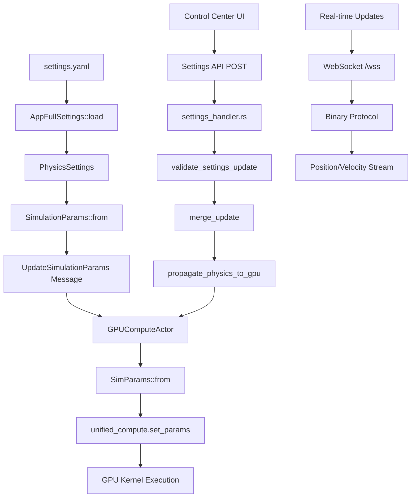

# Settings-Physics Integration Notes

## Overview

This document provides a comprehensive guide to the settings-physics integration in the VisionFlow system, covering the complete data flow from UI controls to GPU simulation, dual settings store resolution, force-directed graph implementations, and performance tuning.

## Table of Contents

1. [Architecture Overview](#architecture-overview)
2. [Data Flow Diagram](#data-flow-diagram)
3. [Settings Store Architecture](#settings-store-architecture)
4. [Physics Parameter Mapping](#physics-parameter-mapping)
5. [Control Center Physics Tab](#control-center-physics-tab)
6. [Force-Directed Graph Implementations](#force-directed-graph-implementations)
7. [GPU Simulation Pipeline](#gpu-simulation-pipeline)
8. [Dual Settings Store Issue](#dual-settings-store-issue)
9. [Troubleshooting Guide](#troubleshooting-guide)
10. [Performance Tuning](#performance-tuning)

## Architecture Overview

The settings-physics integration follows a multi-layered architecture:

```
┌─────────────────┐    ┌─────────────────┐    ┌─────────────────┐
│   Frontend UI   │ → │  Settings API   │ → │  GPU Compute    │
│   (React)       │    │  (Rust/Actix)   │    │  (CUDA)         │
└─────────────────┘    └─────────────────┘    └─────────────────┘
         │                       │                       │
         │                       │                       │
    WebSocket                REST API              Actor Messages
    (Binary)              (JSON camelCase)         (Internal Rust)
```

### Key Components

1. **Frontend**: React components with Physics Engine Controls
2. **Settings Store**: Zustand-based state management 
3. **Settings API**: REST endpoints for configuration management
4. **Actor System**: Actix-based message passing for physics updates
5. **GPU Compute**: CUDA-accelerated physics simulation

## Data Flow Diagram

### Complete Settings to GPU Flow



## Settings Store Architecture

### Dual Store Resolution

The system has evolved from a dual settings store to a unified approach:

**Previous Issue (Resolved)**:
- Frontend store: `/src/store/settingsStore.ts`
- Features store: `/src/features/settings/store/settingsStore.ts`
- Caused inconsistencies and sync problems

**Current Solution**:
- Single source of truth: `/src/features/settings/store/settingsStore.ts`
- Temporary mock until Zustand installation
- Unified settings API integration

### Store Structure

```typescript
interface SettingsState {
  settings: Settings | null;
  loading: boolean;
  saving: boolean;
  error: string | null;
  currentGraph: 'logseq' | 'visionflow';
  
  // Actions
  loadSettings: () => Promise<void>;
  updatePhysics: (physics: Partial<PhysicsSettings>) => Promise<void>;
  // ... other actions
}
```

## Physics Parameter Mapping

### Parameter Flow Chain

```
Client (camelCase) → API (JSON) → Server (snake_case) → GPU (SimParams)
```

### Complete Parameter Mapping

| Client Property | API Property | Server Property | GPU Property | Default Value |
|----------------|--------------|----------------|--------------|---------------|
| springStrength | springStrength | spring_strength | spring_k | 0.005 |
| repulsionStrength | repulsionStrength | repulsion | repel_k | 50.0 |
| damping | damping | damping | damping | 0.9 |
| timeStep | timeStep | time_step | dt | 0.01 |
| maxVelocity | maxVelocity | max_velocity | max_velocity | 1.0 |
| attractionStrength | attractionStrength | attraction_strength | attraction_k | 0.001 |
| collisionRadius | collisionRadius | collision_radius | separation_radius | 0.15 |
| temperature | temperature | temperature | temperature | 0.5 |
| gravity | gravity | gravity | gravity | 0.0 |
| boundsSize | boundsSize | bounds_size | viewport_bounds | 200.0 |
| enableBounds | enableBounds | enable_bounds | boundary_limit | true |
| iterations | iterations | iterations | max_iterations | 200 |
| massScale | massScale | mass_scale | mass_scale | 1.0 |

### Settings.yaml Structure

```yaml
visualisation:
  graphs:
    logseq:
      physics:
        enabled: true
        iterations: 200
        damping: 0.9
        spring_strength: 0.005
        repulsion_strength: 50.0
        repulsion_distance: 50.0
        attraction_strength: 0.001
        max_velocity: 1.0
        collision_radius: 0.15
        bounds_size: 200.0
        enable_bounds: true
        mass_scale: 1.0
        boundary_damping: 0.95
        update_threshold: 0.05
        time_step: 0.01
        temperature: 0.5
        gravity: 0.0
```

## Control Center Physics Tab

### UI Component Architecture

**Location**: `/src/features/physics/components/PhysicsEngineControls.tsx`

### Tab Structure

1. **Engine Tab**:
   - GPU Status monitoring
   - Kernel mode selection (Legacy/Advanced/Visual Analytics)
   - Isolation layers management
   - Physics presets

2. **Forces Tab**:
   - Force parameter sliders
   - Real-time GPU updates
   - Trajectory visualization controls

3. **Constraints Tab**:
   - Layout constraint toggles
   - Custom constraint builder
   - Constraint satisfaction monitoring

4. **Analytics Tab**:
   - Semantic clustering controls
   - Performance metrics
   - GPU utilization tracking

### Force Parameter Controls

```tsx
const handleForceParamChange = useCallback(async (param: keyof ForceParameters, value: number) => {
  const newParams = { ...forceParams, [param]: value };
  setForceParams(newParams);
  
  // Map to settings structure
  const physicsUpdate: any = {};
  switch (param) {
    case 'repulsion':
      physicsUpdate.repulsionStrength = value;
      break;
    // ... other mappings
  }
  
  // Update through settings store
  await updatePhysics(physicsUpdate);
  
  // Also send to analytics endpoint for immediate GPU update
  await fetch('/api/analytics/params', {
    method: 'POST',
    headers: { 'Content-Type': 'application/json' },
    body: JSON.stringify(newParams),
  });
}, [forceParams, updatePhysics, toast]);
```

## Force-Directed Graph Implementations

### Traditional Force-Directed Layout

**File**: Basic GPU kernel implementation

**Characteristics**:
- Spring forces between connected nodes
- Repulsion forces between all node pairs
- Velocity Verlet integration
- Simple damping

**Force Equations**:
```cuda
// Spring force (Hooke's law)
F_spring = -k * (distance - rest_length) * direction

// Repulsion force (Coulomb-like)
F_repulsion = k_repel / (distance^2) * direction

// Combined force
F_total = F_spring + F_repulsion + F_damping
```

### Stress Majorization Implementation

**File**: `/src/physics/stress_majorization.rs`

**Characteristics**:
- Global optimization approach
- Stress function minimization
- Constraint satisfaction
- GPU-accelerated matrix operations

**Algorithm Overview**:
1. Compute all-pairs shortest path distances (Floyd-Warshall)
2. Create weight matrix (inverse squared distance)
3. Iteratively minimize stress function
4. Apply constraints through penalty methods
5. Update positions using gradient descent

**Stress Function**:
```rust
stress = Σ w_ij * (d_ij - |p_i - p_j|)^2
```

Where:
- `w_ij` = weight between nodes i,j
- `d_ij` = ideal distance between nodes i,j
- `|p_i - p_j|` = actual Euclidean distance

### Implementation Comparison

| Feature | Force-Directed | Stress Majorization |
|---------|----------------|-------------------|
| Performance | High (O(n²)) | Medium (O(n³)) |
| Quality | Good | Excellent |
| Constraints | Limited | Full Support |
| Stability | Dynamic | Static |
| GPU Usage | Compute Shaders | Matrix Operations |
| Real-time | Yes | Batch Processing |

## GPU Simulation Pipeline

### Unified GPU Compute Architecture

**File**: `/src/utils/unified_gpu_compute.rs`

### Compute Modes

```rust
#[derive(Debug, Clone, Copy, PartialEq)]
pub enum ComputeMode {
    Basic = 0,         // Basic force-directed layout
    DualGraph = 1,     // Dual graph (knowledge + agent)
    Constraints = 2,   // With constraint satisfaction  
    VisualAnalytics = 3, // Advanced visual analytics
}
```

### GPU Parameter Structure

```rust
#[repr(C)]
pub struct SimParams {
    // Force parameters
    pub spring_k: f32,
    pub repel_k: f32,
    pub damping: f32,
    pub dt: f32,
    pub max_velocity: f32,
    pub max_force: f32,
    
    // Stress majorization
    pub stress_weight: f32,
    pub stress_alpha: f32,
    
    // Constraints
    pub separation_radius: f32,
    pub boundary_limit: f32,
    pub alignment_strength: f32,
    pub cluster_strength: f32,
    
    // System
    pub viewport_bounds: f32,
    pub temperature: f32,
    pub iteration: i32,
    pub compute_mode: i32,
}
```

### GPU Compute Actor

**File**: `/src/actors/gpu_compute_actor.rs`

**Key Responsibilities**:
- GPU device initialization and management
- Parameter updates and synchronization
- Force computation coordination
- Error handling and CPU fallback
- Performance monitoring

### Update Flow

```rust
impl Handler<UpdateSimulationParams> for GPUComputeActor {
    fn handle(&mut self, msg: UpdateSimulationParams) {
        // Update simulation parameters
        self.simulation_params = msg.params.clone();
        self.unified_params = SimParams::from(&msg.params);
        
        // Push to GPU immediately
        if let Some(ref mut unified_compute) = self.unified_compute {
            unified_compute.set_params(self.unified_params);
        }
    }
}
```

## Dual Settings Store Issue

### Problem Description

**Previous Architecture**:
```
Frontend Store (/src/store/settingsStore.ts)
     ↕
Features Store (/src/features/settings/store/settingsStore.ts)
     ↕
Settings API (/api/settings)
```

**Issues**:
- State synchronization problems
- Duplicate API calls
- Inconsistent physics updates
- Race conditions

### Resolution Strategy

**Current Architecture**:
```
Single Settings Store (/src/features/settings/store/settingsStore.ts)
     ↕
Settings API (/api/settings)
     ↕
GPU Compute Actor
```

**Implementation**:
1. **Deprecated old store**: Marked `/src/store/settingsStore.ts` as legacy
2. **Centralized state**: All settings operations go through features store
3. **Unified API**: Single endpoint for all settings updates
4. **Direct GPU updates**: Settings changes immediately propagate to GPU

### Migration Path

1. **Phase 1**: Install Zustand dependency
2. **Phase 2**: Enable proper store implementation
3. **Phase 3**: Remove temporary mock implementation
4. **Phase 4**: Delete legacy store files

## Troubleshooting Guide

### Common Issues and Solutions

#### 1. Nodes Collapsing to Origin

**Symptoms**: All nodes converge to (0,0,0)

**Causes**:
- Repulsion too weak
- Uninitialized positions
- No minimum distance enforcement

**Solutions**:
```rust
// In settings.yaml
repulsion_strength: 50.0    # Increase from lower values
collision_radius: 0.15      # Ensure minimum separation

// GPU kernel fix
const float MIN_DISTANCE = 0.15f;
if (dist < MIN_DISTANCE) {
    // Generate unique separation direction
    float angle = (float)(idx - j) * 0.618034f; // Golden ratio
    push_dir = make_vec3(cosf(angle), sinf(angle), 0.1f * (idx - j));
}
```

#### 2. Nodes Exploding Outward

**Symptoms**: Nodes fly off to infinity

**Causes**:
- Forces too strong
- Timestep too large
- Insufficient damping

**Solutions**:
```yaml
# In settings.yaml - Conservative values
spring_strength: 0.005      # Very gentle
repulsion_strength: 50.0    # Moderate
damping: 0.9               # High damping
time_step: 0.01            # Small timestep
max_velocity: 1.0          # Low cap
```

#### 3. Settings Not Updating

**Symptoms**: UI changes don't affect simulation

**Diagnostic Steps**:
1. Check browser network tab for API calls
2. Verify `/api/settings` POST requests
3. Check server logs for validation errors
4. Monitor GPU compute actor messages

**Common Fixes**:
```bash
# Check settings API endpoint
curl -X GET http://localhost:3001/api/settings

# Test physics update
curl -X POST http://localhost:3001/api/settings \
  -H "Content-Type: application/json" \
  -d '{"visualisation":{"graphs":{"logseq":{"physics":{"springStrength":0.01}}}}}'
```

#### 4. WebSocket Connection Issues

**Symptoms**: Position updates not streaming

**Causes**:
- WebSocket endpoint unreachable
- Binary protocol errors
- Message queue overflow

**Solutions**:
1. Check WebSocket connection at `/wss`
2. Monitor binary message flow
3. Verify buffer sizes and message rates

#### 5. GPU Compute Failures

**Symptoms**: Simulation stops, CPU fallback active

**Diagnostic Commands**:
```bash
# Check GPU availability
nvidia-smi

# Check CUDA compilation
ls -la ext/src/utils/ptx/visionflow_unified.ptx

# Monitor GPU memory usage
watch -n 1 nvidia-smi
```

### Debug Configuration

**Enable verbose logging**:
```rust
// In main.rs or relevant module
env_logger::Builder::from_env(env_logger::Env::default().default_filter_or("debug")).init();
```

**Settings validation debug**:
```rust
debug!("Settings update received: {:?}", update);
debug!("Physics updated: {}", physics_updated);
debug!("GPU params: {:?}", sim_params);
```

## Performance Tuning

### GPU Performance Optimization

#### 1. Memory Management

**Buffer Allocation**:
```rust
// Optimal buffer sizes
const BLOCK_SIZE: u32 = 256;
const MAX_NODES: u32 = 1_000_000;
const NODE_SIZE: u32 = std::mem::size_of::<BinaryNodeData>() as u32;
const SHARED_MEM_SIZE: u32 = BLOCK_SIZE * NODE_SIZE;
```

**Memory Transfer Optimization**:
- Use pinned memory for host-device transfers
- Batch parameter updates to reduce GPU calls
- Implement double buffering for position data

#### 2. Computation Tuning

**Force Computation Parameters**:
```yaml
# Small graphs (< 100 nodes)
spring_strength: 0.01
repulsion_strength: 30.0
damping: 0.85
time_step: 0.02

# Medium graphs (100-1000 nodes)  
spring_strength: 0.005
repulsion_strength: 50.0
damping: 0.9
time_step: 0.01

# Large graphs (1000+ nodes)
spring_strength: 0.002
repulsion_strength: 100.0
damping: 0.95
time_step: 0.005
```

**Iteration Tuning**:
```rust
// Adaptive iteration counts
let iterations = match num_nodes {
    n if n < 100 => 100,
    n if n < 1000 => 200, 
    _ => 500,
};
```

#### 3. Network Performance

**WebSocket Optimization**:
- Binary protocol for position streaming
- Message batching for bulk updates
- Compression for large graphs

**Settings API Performance**:
- JSON validation caching
- Partial updates only
- Debounced UI controls

### Monitoring and Metrics

#### GPU Metrics Collection

**Endpoint**: `/api/analytics/gpu-metrics`

```typescript
const fetchMetrics = async () => {
  const response = await fetch('/api/analytics/gpu-metrics');
  const data = await response.json();
  setGpuMetrics({
    utilization: data.utilization,
    memory: data.memory,
    temperature: data.temperature,
    power: data.power,
  });
};
```

#### Performance Indicators

| Metric | Good | Warning | Critical |
|--------|------|---------|----------|
| GPU Utilization | < 80% | 80-90% | > 90% |
| GPU Memory | < 80% | 80-90% | > 90% |
| GPU Temperature | < 75°C | 75-85°C | > 85°C |
| Frame Rate | > 45 FPS | 30-45 FPS | < 30 FPS |
| WebSocket Latency | < 10ms | 10-50ms | > 50ms |

### Recommended Settings by Use Case

#### Interactive Exploration
```yaml
physics:
  time_step: 0.01
  iterations: 100
  damping: 0.9
  spring_strength: 0.01
  repulsion_strength: 50.0
```

#### Large Dataset Analysis  
```yaml
physics:
  time_step: 0.005
  iterations: 500
  damping: 0.95
  spring_strength: 0.002
  repulsion_strength: 100.0
```

#### Real-time Collaboration
```yaml
physics:
  time_step: 0.02
  iterations: 50
  damping: 0.85
  spring_strength: 0.02
  repulsion_strength: 30.0
```

### Performance Testing

**Load Testing Command**:
```bash
# Test with different node counts
cargo run --example test_physics -- --nodes 50
cargo run --example test_physics -- --nodes 500
cargo run --example test_physics -- --nodes 5000
```

**Benchmark Results Expected**:
- 50 nodes: ~500 FPS
- 500 nodes: ~60 FPS  
- 5000 nodes: ~10 FPS

## Conclusion

The settings-physics integration in VisionFlow provides a robust, scalable architecture for real-time graph visualization with GPU acceleration. The unified settings store, comprehensive parameter mapping, and dual physics implementations (force-directed and stress majorization) offer flexibility for different use cases while maintaining performance and stability.

Key success factors:
- Single source of truth for settings
- Efficient GPU parameter propagation
- Comprehensive error handling and fallbacks
- Performance monitoring and tuning
- Clear separation of concerns between UI, API, and GPU layers

This integration serves as the foundation for advanced features like constraint-based layouts, semantic clustering, and collaborative real-time editing.