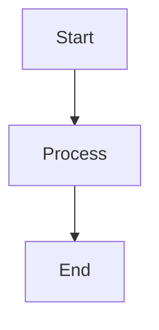

# Documentation Validation Checklist

Use this checklist to ensure documentation meets quality standards before submission.

---

## Pre-Submission Checklist

### Front Matter

- [ ] Front matter block present (`---` delimiters)
- [ ] `title` field populated with clear title
- [ ] `description` field populated (one-line summary)
- [ ] `category` set to valid value (architecture, development, deployment, api, guides, reference)
- [ ] `tags` array with 3-5 relevant tags
- [ ] `version` follows semantic versioning (2.0.0)
- [ ] `last_updated` in ISO format (YYYY-MM-DD)

### Content Structure

- [ ] Clear, descriptive H1 title matches front matter
- [ ] Table of contents for documents >500 words
- [ ] Logical heading hierarchy (H1 → H2 → H3)
- [ ] Short paragraphs (3-5 sentences max)
- [ ] No orphaned sections (each section has content)

### Writing Quality

- [ ] Clear, concise language
- [ ] Active voice preferred
- [ ] Technical terms defined on first use
- [ ] No spelling or grammar errors
- [ ] Consistent terminology throughout

### Links

- [ ] All internal links use relative paths
- [ ] All links validated and working
- [ ] No broken references
- [ ] External links include full URL
- [ ] Descriptive link text (not "click here")

### Code Examples

- [ ] Syntax highlighting specified
- [ ] Complete, runnable examples
- [ ] Context provided for each example
- [ ] Error handling shown where relevant
- [ ] All imports/dependencies included

### Diagrams

- [ ] All diagrams use Mermaid syntax
- [ ] No ASCII art diagrams
- [ ] Diagram syntax validated
- [ ] Diagrams have clear labels
- [ ] Context provided before each diagram

### Cross-References

- [ ] Links to related documents added
- [ ] Referenced from appropriate documents
- [ ] Not orphaned (has incoming links)
- [ ] Appears in INDEX.md or category README

---

## Validation Commands

### Run All Validations

```bash
cd /home/devuser/workspace/project/docs
./scripts/validate-all.sh
```

### Individual Validations

**Link Validation:**
```bash
./scripts/validate-links.sh
```
Expected result: ✓ No broken links, ✓ No orphans

**Front Matter Validation:**
```bash
./scripts/validate-frontmatter.sh
```
Expected result: ✓ All documents have valid front matter

**Mermaid Validation:**
```bash
./scripts/validate-mermaid.sh
```
Expected result: ✓ All Mermaid diagrams appear valid

**ASCII Detection:**
```bash
./scripts/detect-ascii.sh
```
Expected result: ✓ No ASCII diagrams detected

**Coverage Validation:**
```bash
./scripts/validate-coverage.sh
```
Expected result: ✓ All categories present

---

## Quality Metrics

### Document Size

- [ ] 500-2000 words (optimal)
- [ ] <3000 words (if longer, consider splitting)
- [ ] >200 words (sufficient detail)

### Link Density

- [ ] 3+ internal cross-references
- [ ] Links to related documents
- [ ] Links to API/reference docs
- [ ] No circular link chains

### Diagram Coverage

- [ ] Complex concepts have diagrams
- [ ] Architecture sections visualized
- [ ] Workflows shown in sequence diagrams
- [ ] System relationships illustrated

### Code Coverage

- [ ] Key concepts have code examples
- [ ] Examples are complete and tested
- [ ] Common use cases covered
- [ ] Error scenarios addressed

---

## Category-Specific Requirements

### Architecture Documents

- [ ] System context diagram
- [ ] Component relationships shown
- [ ] Data flow illustrated
- [ ] Design decisions documented
- [ ] Trade-offs explained

### Development Documents

- [ ] Setup instructions complete
- [ ] Prerequisites listed
- [ ] Step-by-step procedures
- [ ] Troubleshooting section
- [ ] Example outputs shown

### Deployment Documents

- [ ] Environment requirements specified
- [ ] Configuration examples provided
- [ ] Deployment steps detailed
- [ ] Rollback procedures included
- [ ] Monitoring/validation steps

### API Documents

- [ ] Endpoint descriptions
- [ ] Request/response examples
- [ ] Authentication explained
- [ ] Error codes documented
- [ ] Rate limits specified

### User Guides

- [ ] Clear learning objectives
- [ ] Progressive difficulty
- [ ] Screenshots/diagrams
- [ ] Common pitfalls addressed
- [ ] Next steps suggested

### Reference Documents

- [ ] Complete parameter lists
- [ ] Default values specified
- [ ] Required vs optional marked
- [ ] Examples for each option
- [ ] Cross-references to usage

---

## CI/CD Pipeline Checks

### Pull Request Validation

When you submit a PR, GitHub Actions will automatically:

- [ ] Validate all links
- [ ] Check front matter completeness
- [ ] Validate Mermaid syntax
- [ ] Detect ASCII diagrams
- [ ] Check documentation coverage
- [ ] Post results as PR comment

**All checks must pass before merge.**

### Post-Merge Actions

After merge to main, automation will:

- [ ] Generate documentation metrics
- [ ] Update INDEX.md
- [ ] Publish metrics to GitHub Pages
- [ ] Commit updated reports

---

## Manual Review Checklist

### Peer Review

Ask reviewer to check:

- [ ] Content accuracy
- [ ] Technical correctness
- [ ] Clear explanations
- [ ] Appropriate level of detail
- [ ] Consistent with existing docs

### Self-Review

Before requesting review:

- [ ] Read document aloud
- [ ] Check all links manually
- [ ] Test all code examples
- [ ] Verify diagram accuracy
- [ ] Spell check entire document

---

## Common Issues and Fixes

### Issue: Broken Links

**Detection:**
```bash
./scripts/validate-links.sh
```

**Fix:**
```bash
# Update link paths
grep -r "broken-link.md" **/*.md
# Correct all references
```

### Issue: Missing Front Matter

**Detection:**
```bash
./scripts/validate-frontmatter.sh
```

**Fix:**
Add complete front matter block:
```markdown
---
title: "Document Title"
description: "Description here"
category: reference
tags: [tag1, tag2, tag3]
version: 2.0.0
last_updated: 2025-12-18
---
```

### Issue: ASCII Diagrams

**Detection:**
```bash
./scripts/detect-ascii.sh
```

**Fix:**
Convert to Mermaid:
```markdown

```

### Issue: Orphaned Document

**Detection:**
```bash
./scripts/validate-links.sh | grep Orphaned
```

**Fix:**
- Add links from related documents
- Add to category README
- Add to INDEX.md

---

## Pre-Commit Workflow

**Recommended workflow:**

1. Write/update documentation
2. Add front matter
3. Add cross-references
4. Convert ASCII to Mermaid
5. Run validation suite:
   ```bash
   ./scripts/validate-all.sh
   ```
6. Fix any issues identified
7. Re-run validation
8. Commit changes:
   ```bash
   git add .
   git commit -m "docs: add feature documentation"
   ```
9. Push and create PR

---

## Release Checklist

Before major release:

### Validation

- [ ] Full validation suite passes
- [ ] No broken links
- [ ] No orphaned documents
- [ ] No ASCII diagrams
- [ ] All front matter complete

### Metrics

- [ ] Generate fresh metrics report
- [ ] Update INDEX.md
- [ ] Review coverage gaps
- [ ] Address recommendations

### Quality

- [ ] Review old documents (>180 days)
- [ ] Update outdated information
- [ ] Verify external links
- [ ] Check code examples still work

### Publication

- [ ] Commit all updates
- [ ] Tag release
- [ ] Update changelog
- [ ] Publish to GitHub Pages

---

## Scoring System

### Quality Score Calculation

Each document can achieve up to 100 points:

**Front Matter (20 points)**
- Complete required fields: 20
- Missing 1-2 fields: 10
- Missing 3+ fields: 0

**Content (30 points)**
- Clear structure: 10
- Quality writing: 10
- Complete coverage: 10

**Links (20 points)**
- 5+ cross-references: 20
- 3-4 cross-references: 15
- 1-2 cross-references: 10
- No links: 0

**Diagrams (15 points)**
- Mermaid diagrams present: 15
- ASCII diagrams: 0

**Code Examples (15 points)**
- Complete, tested examples: 15
- Basic examples: 10
- No examples: 0

### Target Scores

- **Excellent**: 90-100 points
- **Good**: 75-89 points
- **Acceptable**: 60-74 points
- **Needs Work**: <60 points

---

## Continuous Improvement

### Monthly Review

- [ ] Review validation metrics
- [ ] Identify low-scoring documents
- [ ] Update outdated content
- [ ] Improve cross-linking
- [ ] Add missing diagrams

### Quarterly Audit

- [ ] Full documentation review
- [ ] Tag consistency check
- [ ] Link structure optimization
- [ ] Diagram quality review
- [ ] Code example updates

---

*Last Updated: 2025-12-18*
*Version: 2.0.0*
