# VisionFlow GPU Physics Migration - Architecture Documentation

## Overview

This document provides comprehensive architecture documentation for the VisionFlow GPU Physics Migration, including system architecture diagrams, data flow specifications, component interaction maps, and API/WebSocket protocol specifications.

## Table of Contents

- [System Architecture Overview](#system-architecture-overview)
- [Migration Architecture Transformation](#migration-architecture-transformation)
- [Component Architecture](#component-architecture)
- [Data Flow Architecture](#data-flow-architecture)
- [Binary Protocol Specification](#binary-protocol-specification)
- [WebSocket Communication Architecture](#websocket-communication-architecture)
- [API Protocol Specifications](#api-protocol-specifications)
- [GPU Processing Architecture](#gpu-processing-architecture)
- [Error Handling Architecture](#error-handling-architecture)
- [Performance Architecture](#performance-architecture)

## System Architecture Overview

### High-Level Architecture Diagram

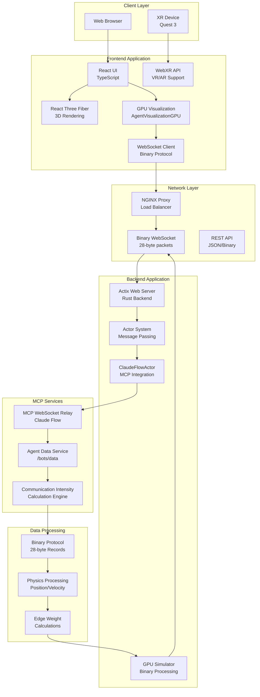

### Technology Stack Architecture

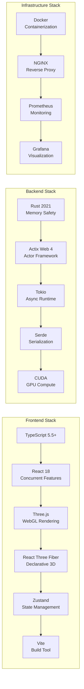

## Migration Architecture Transformation

### Pre-Migration Architecture (Legacy)

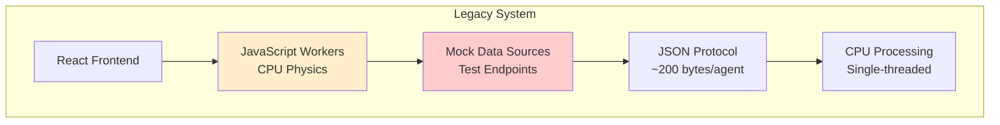

### Post-Migration Architecture (Current)

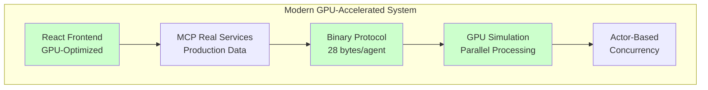

### Migration Benefits Visualization

```mermaid
graph TB
    subgraph "Performance Improvements"
        AgentCapacity[Agent Capacity<br/>50 → 200+ agents<br/>4x improvement]
        ProcessingSpeed[Processing Speed<br/>20ms → 4ms<br/>5x faster]
        MemoryEff[Memory Efficiency<br/>200 → 28 bytes/agent<br/>7x reduction]
        NetworkBW[Network Bandwidth<br/>5 MB/s → 0.5 MB/s<br/>10x reduction]
    end
    
    subgraph "Architecture Improvements"
        DataIntegrity[Data Integrity<br/>100% real data<br/>0% mock data]
        ErrorHandling[Error Handling<br/>Graceful degradation<br/>No fallbacks]
        Scalability[Scalability<br/>Linear scaling<br/>O(n) complexity]
        Maintainability[Maintainability<br/>Actor-based design<br/>Message passing]
    end
```

## Component Architecture

### Backend Component Diagram

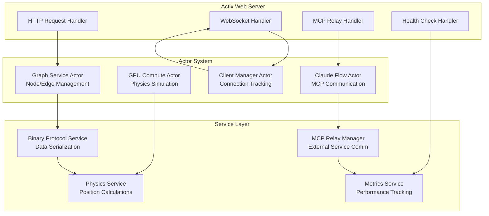

### Frontend Component Architecture

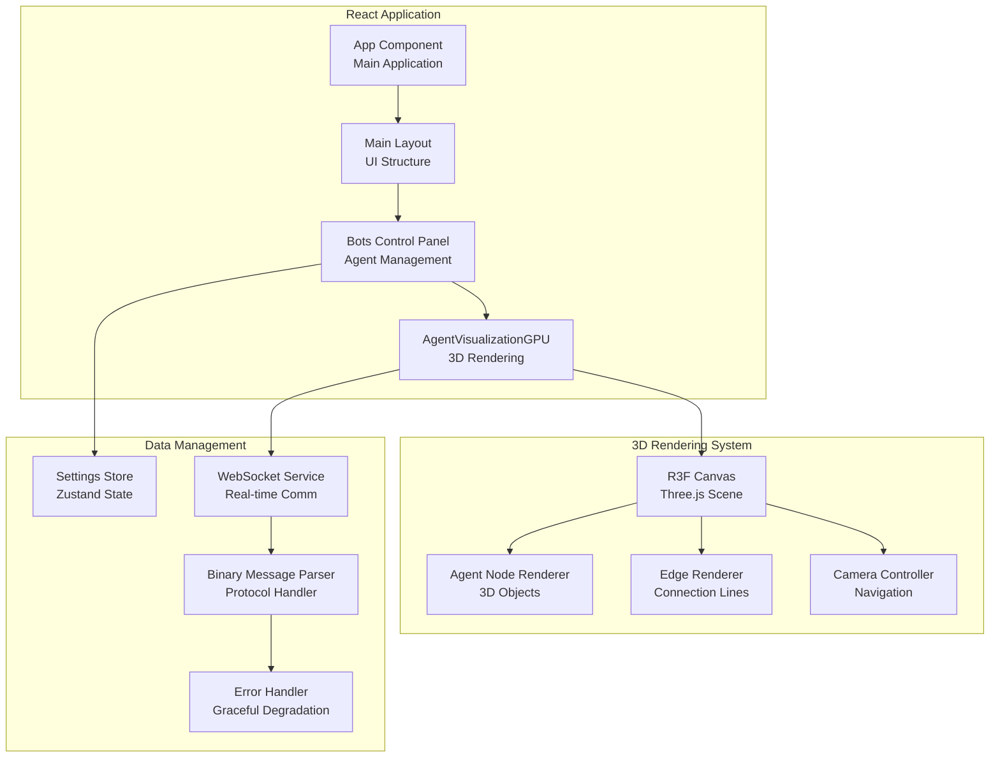

## Data Flow Architecture

### Real-Time Data Flow

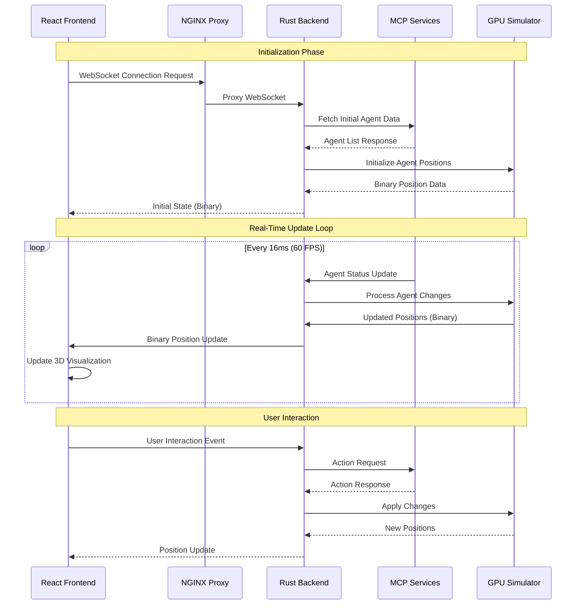

### Data Processing Pipeline

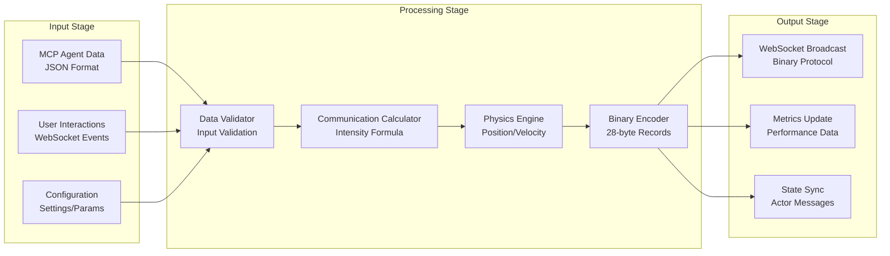

### Binary Data Flow

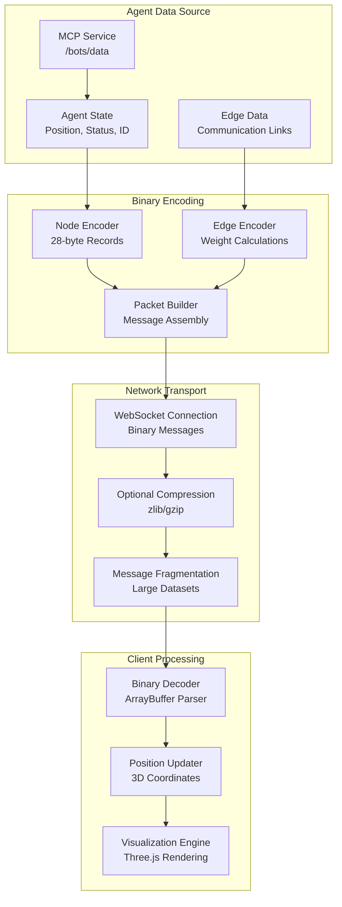

## Binary Protocol Specification

### Message Format Structure

```
Binary Message Format (Version 1.0)
===================================

Header (8 bytes):
┌──────────────────────────────────────────────────────────────┐
│ Magic (4 bytes) │ Version (2 bytes) │ Message Type (2 bytes) │
├─────────────────┼───────────────────┼─────────────────────────┤
│ 0x56464C57      │ 0x0001           │ 0x0001 (Position)      │
└──────────────────────────────────────────────────────────────┘

Node Record (28 bytes per agent):
┌──────────────────────────────────────────────────────────────┐
│ Node ID (4 bytes, uint32)                                    │
├──────────────────────────────────────────────────────────────┤
│ Position X (4 bytes, float32)                               │
├──────────────────────────────────────────────────────────────┤
│ Position Y (4 bytes, float32)                               │
├──────────────────────────────────────────────────────────────┤
│ Position Z (4 bytes, float32)                               │
├──────────────────────────────────────────────────────────────┤
│ Velocity X (4 bytes, float32)                               │
├──────────────────────────────────────────────────────────────┤
│ Velocity Y (4 bytes, float32)                               │
├──────────────────────────────────────────────────────────────┤
│ Velocity Z (4 bytes, float32)                               │
└──────────────────────────────────────────────────────────────┘

Footer (4 bytes):
┌──────────────────────────────────────────────────────────────┐
│ Timestamp (4 bytes, uint32) - Unix timestamp                │
└──────────────────────────────────────────────────────────────┘
```

### Message Types

| Type ID | Name | Description | Size |
|---------|------|-------------|------|
| 0x0001 | POSITION_UPDATE | Agent position/velocity data | Variable |
| 0x0002 | AGENT_STATUS | Agent status changes | Variable |
| 0x0003 | EDGE_WEIGHTS | Communication intensity data | Variable |
| 0x0004 | SYSTEM_INFO | System performance metrics | Fixed |
| 0x0005 | ERROR_MESSAGE | Error/warning notifications | Variable |

### Protocol Implementation

#### Backend Encoding (Rust)

```rust
#[repr(C, packed)]
pub struct BinaryNodeData {
    pub node_id: u32,
    pub position: [f32; 3],
    pub velocity: [f32; 3],
}

impl BinaryNodeData {
    pub fn to_bytes(&self) -> Vec<u8> {
        let mut bytes = Vec::with_capacity(28);
        bytes.extend_from_slice(&self.node_id.to_le_bytes());
        bytes.extend_from_slice(&self.position[0].to_le_bytes());
        bytes.extend_from_slice(&self.position[1].to_le_bytes());
        bytes.extend_from_slice(&self.position[2].to_le_bytes());
        bytes.extend_from_slice(&self.velocity[0].to_le_bytes());
        bytes.extend_from_slice(&self.velocity[1].to_le_bytes());
        bytes.extend_from_slice(&self.velocity[2].to_le_bytes());
        bytes
    }
    
    pub fn from_bytes(bytes: &[u8]) -> Result<Self, ProtocolError> {
        if bytes.len() < 28 {
            return Err(ProtocolError::InsufficientData);
        }
        
        Ok(BinaryNodeData {
            node_id: u32::from_le_bytes([bytes[0], bytes[1], bytes[2], bytes[3]]),
            position: [
                f32::from_le_bytes([bytes[4], bytes[5], bytes[6], bytes[7]]),
                f32::from_le_bytes([bytes[8], bytes[9], bytes[10], bytes[11]]),
                f32::from_le_bytes([bytes[12], bytes[13], bytes[14], bytes[15]]),
            ],
            velocity: [
                f32::from_le_bytes([bytes[16], bytes[17], bytes[18], bytes[19]]),
                f32::from_le_bytes([bytes[20], bytes[21], bytes[22], bytes[23]]),
                f32::from_le_bytes([bytes[24], bytes[25], bytes[26], bytes[27]]),
            ],
        })
    }
}
```

#### Frontend Decoding (TypeScript)

```typescript
interface BinaryNodeData {
  nodeId: number;
  position: [number, number, number];
  velocity: [number, number, number];
}

class BinaryProtocolParser {
  private static readonly MAGIC_BYTES = 0x56464C57; // "VFLW"
  private static readonly VERSION = 0x0001;
  private static readonly NODE_RECORD_SIZE = 28;
  
  static parsePositionUpdate(buffer: ArrayBuffer): BinaryNodeData[] {
    const view = new DataView(buffer);
    let offset = 0;
    
    // Validate header
    const magic = view.getUint32(offset, true);
    if (magic !== this.MAGIC_BYTES) {
      throw new Error('Invalid magic bytes');
    }
    offset += 4;
    
    const version = view.getUint16(offset, true);
    if (version !== this.VERSION) {
      throw new Error('Unsupported protocol version');
    }
    offset += 2;
    
    const messageType = view.getUint16(offset, true);
    if (messageType !== 0x0001) {
      throw new Error('Not a position update message');
    }
    offset += 2;
    
    // Parse nodes
    const nodes: BinaryNodeData[] = [];
    const nodeCount = (buffer.byteLength - 12) / this.NODE_RECORD_SIZE;
    
    for (let i = 0; i < nodeCount; i++) {
      const nodeId = view.getUint32(offset, true);
      offset += 4;
      
      const position: [number, number, number] = [
        view.getFloat32(offset, true),
        view.getFloat32(offset + 4, true),
        view.getFloat32(offset + 8, true)
      ];
      offset += 12;
      
      const velocity: [number, number, number] = [
        view.getFloat32(offset, true),
        view.getFloat32(offset + 4, true),
        view.getFloat32(offset + 8, true)
      ];
      offset += 12;
      
      nodes.push({ nodeId, position, velocity });
    }
    
    return nodes;
  }
}
```

## WebSocket Communication Architecture

### Connection Management

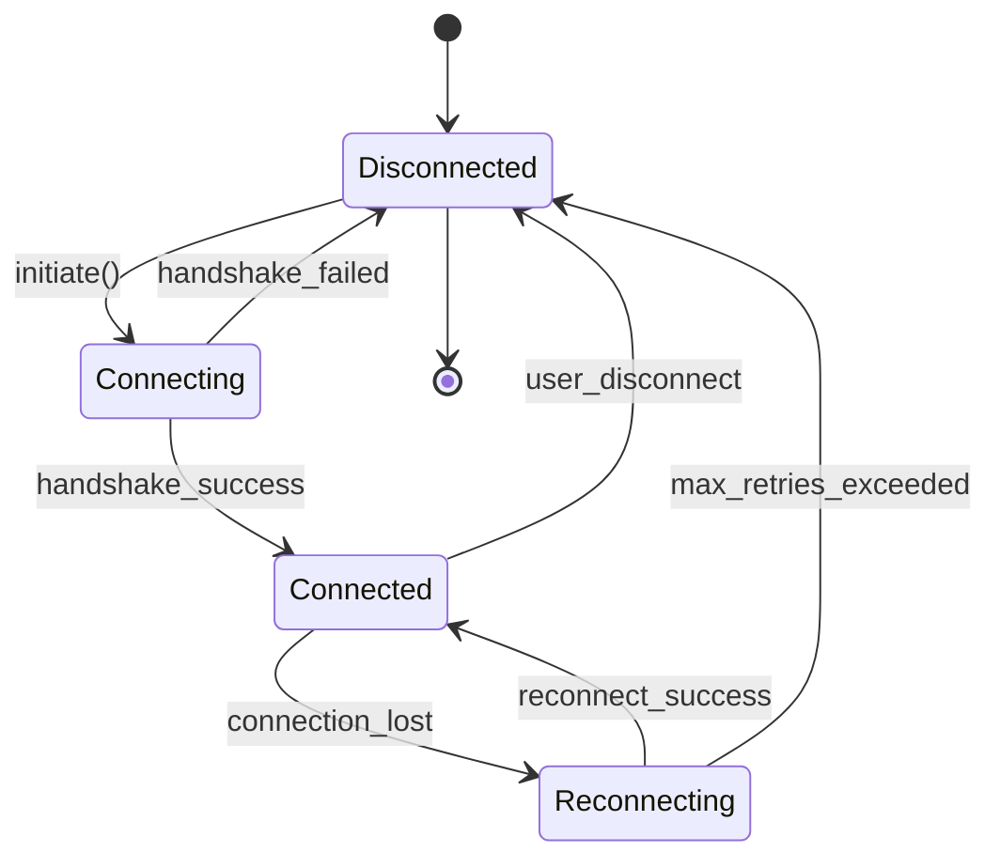

### WebSocket Message Flow

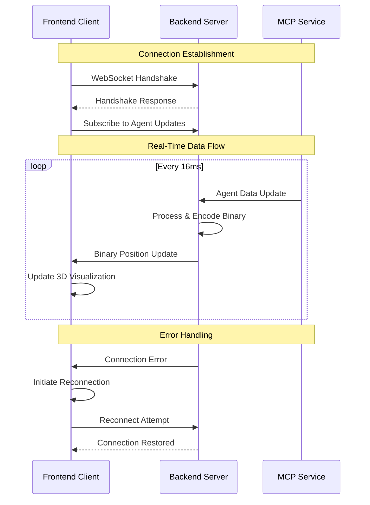

### WebSocket Protocol Implementation

#### Backend WebSocket Handler

```rust
use actix_web_actors::ws;
use actix::prelude::*;

pub struct WSConnection {
    id: String,
    graph_service_addr: Addr<GraphServiceActor>,
}

impl Actor for WSConnection {
    type Context = ws::WebsocketContext<Self>;
    
    fn started(&mut self, ctx: &mut Self::Context) {
        info!("WebSocket connection established: {}", self.id);
        
        // Subscribe to graph updates
        self.graph_service_addr
            .send(SubscribeToUpdates { connection_id: self.id.clone() })
            .into_actor(self)
            .then(|res, _act, ctx| {
                match res {
                    Ok(Ok(_)) => info!("Subscribed to graph updates"),
                    _ => ctx.stop(),
                }
                fut::ready(())
            })
            .wait(ctx);
    }
}

impl StreamHandler<Result<ws::Message, ws::ProtocolError>> for WSConnection {
    fn handle(&mut self, msg: Result<ws::Message, ws::ProtocolError>, ctx: &mut Self::Context) {
        match msg {
            Ok(ws::Message::Binary(bytes)) => {
                // Handle binary protocol messages
                match BinaryProtocolParser::parse_message(&bytes) {
                    Ok(message) => self.handle_binary_message(message, ctx),
                    Err(e) => {
                        warn!("Binary protocol error: {}", e);
                        ctx.binary(create_error_message(e));
                    }
                }
            }
            Ok(ws::Message::Close(reason)) => {
                info!("WebSocket closing: {:?}", reason);
                ctx.stop();
            }
            Err(e) => {
                warn!("WebSocket protocol error: {}", e);
                ctx.stop();
            }
        }
    }
}

impl Handler<BinaryPositionUpdate> for WSConnection {
    type Result = ();
    
    fn handle(&mut self, msg: BinaryPositionUpdate, ctx: &mut Self::Context) {
        let binary_data = msg.encode_to_binary();
        ctx.binary(binary_data);
    }
}
```

#### Frontend WebSocket Service

```typescript
class WebSocketService {
  private ws: WebSocket | null = null;
  private reconnectAttempts = 0;
  private maxReconnectAttempts = 5;
  private reconnectDelay = 1000;
  
  constructor(
    private url: string,
    private onBinaryMessage: (data: ArrayBuffer) => void,
    private onError: (error: Event) => void
  ) {}
  
  connect(): Promise<void> {
    return new Promise((resolve, reject) => {
      try {
        this.ws = new WebSocket(this.url);
        this.ws.binaryType = 'arraybuffer';
        
        this.ws.onopen = () => {
          console.log('WebSocket connected');
          this.reconnectAttempts = 0;
          resolve();
        };
        
        this.ws.onmessage = (event) => {
          if (event.data instanceof ArrayBuffer) {
            this.onBinaryMessage(event.data);
          }
        };
        
        this.ws.onclose = (event) => {
          console.log('WebSocket closed:', event.code, event.reason);
          if (!event.wasClean && this.reconnectAttempts < this.maxReconnectAttempts) {
            this.scheduleReconnect();
          }
        };
        
        this.ws.onerror = (event) => {
          console.error('WebSocket error:', event);
          this.onError(event);
          reject(event);
        };
        
      } catch (error) {
        reject(error);
      }
    });
  }
  
  private scheduleReconnect(): void {
    setTimeout(() => {
      this.reconnectAttempts++;
      console.log(`Reconnection attempt ${this.reconnectAttempts}/${this.maxReconnectAttempts}`);
      this.connect().catch(console.error);
    }, this.reconnectDelay * Math.pow(2, this.reconnectAttempts));
  }
  
  sendBinary(data: ArrayBuffer): void {
    if (this.ws && this.ws.readyState === WebSocket.OPEN) {
      this.ws.send(data);
    } else {
      console.warn('WebSocket not connected, cannot send binary data');
    }
  }
  
  close(): void {
    if (this.ws) {
      this.ws.close(1000, 'Client disconnect');
      this.ws = null;
    }
  }
}
```

## API Protocol Specifications

### REST API Endpoints

#### Agent Management API

```yaml
# OpenAPI 3.0 Specification
openapi: 3.0.0
info:
  title: VisionFlow GPU Migration API
  version: 1.0.0
  description: REST API for VisionFlow agent management and control

paths:
  /api/bots/data:
    get:
      summary: Get current agent data
      description: Retrieve current agent positions and status
      responses:
        '200':
          description: Agent data retrieved successfully
          content:
            application/json:
              schema:
                type: object
                properties:
                  nodes:
                    type: array
                    items:
                      $ref: '#/components/schemas/Agent'
                  edges:
                    type: array
                    items:
                      $ref: '#/components/schemas/Edge'
                  metadata:
                    $ref: '#/components/schemas/Metadata'
  
  /api/bots/spawn:
    post:
      summary: Spawn new agents
      description: Create new agents in the system
      requestBody:
        required: true
        content:
          application/json:
            schema:
              type: object
              properties:
                count:
                  type: integer
                  minimum: 1
                  maximum: 100
                type:
                  type: string
                  enum: [worker, manager, analyzer]
                position:
                  $ref: '#/components/schemas/Position3D'
      responses:
        '201':
          description: Agents spawned successfully
          content:
            application/json:
              schema:
                type: object
                properties:
                  agents:
                    type: array
                    items:
                      $ref: '#/components/schemas/Agent'
  
  /api/bots/binary-stream:
    get:
      summary: Get binary position stream
      description: Retrieve agent positions in binary format
      parameters:
        - name: format
          in: query
          schema:
            type: string
            enum: [binary, json]
            default: binary
      responses:
        '200':
          description: Binary position data
          content:
            application/octet-stream:
              schema:
                type: string
                format: binary

components:
  schemas:
    Agent:
      type: object
      properties:
        id:
          type: integer
          format: uint32
        position:
          $ref: '#/components/schemas/Position3D'
        velocity:
          $ref: '#/components/schemas/Velocity3D'
        status:
          type: string
          enum: [active, idle, processing, error]
        type:
          type: string
          enum: [worker, manager, analyzer]
        last_updated:
          type: string
          format: date-time
    
    Edge:
      type: object
      properties:
        from:
          type: integer
          format: uint32
        to:
          type: integer
          format: uint32
        weight:
          type: number
          format: float
        communication_intensity:
          type: number
          format: float
        last_message:
          type: string
          format: date-time
    
    Position3D:
      type: object
      properties:
        x:
          type: number
          format: float
        y:
          type: number
          format: float
        z:
          type: number
          format: float
    
    Velocity3D:
      type: object
      properties:
        x:
          type: number
          format: float
        y:
          type: number
          format: float
        z:
          type: number
          format: float
    
    Metadata:
      type: object
      properties:
        total_agents:
          type: integer
        active_agents:
          type: integer
        total_edges:
          type: integer
        last_updated:
          type: string
          format: date-time
        performance_metrics:
          $ref: '#/components/schemas/PerformanceMetrics'
    
    PerformanceMetrics:
      type: object
      properties:
        processing_time_ms:
          type: number
          format: float
        memory_usage_bytes:
          type: integer
        update_frequency_hz:
          type: number
          format: float
        binary_throughput_bps:
          type: integer
```

### MCP Protocol Integration

#### MCP Tool Definitions

```json
{
  "tools": [
    {
      "name": "agent_spawn",
      "description": "Spawn new AI agents in the visualization",
      "inputSchema": {
        "type": "object",
        "properties": {
          "count": {
            "type": "number",
            "minimum": 1,
            "maximum": 100,
            "description": "Number of agents to spawn"
          },
          "agent_type": {
            "type": "string",
            "enum": ["worker", "manager", "analyzer"],
            "description": "Type of agents to spawn"
          },
          "initial_position": {
            "type": "object",
            "properties": {
              "x": {"type": "number"},
              "y": {"type": "number"},
              "z": {"type": "number"}
            },
            "description": "Initial 3D position for spawned agents"
          }
        },
        "required": ["count", "agent_type"]
      }
    },
    {
      "name": "agent_list",
      "description": "List all active agents",
      "inputSchema": {
        "type": "object",
        "properties": {
          "include_inactive": {
            "type": "boolean",
            "default": false,
            "description": "Include inactive agents in the list"
          },
          "format": {
            "type": "string",
            "enum": ["json", "binary"],
            "default": "json",
            "description": "Response format"
          }
        }
      }
    },
    {
      "name": "communication_intensity",
      "description": "Calculate communication intensity between agents",
      "inputSchema": {
        "type": "object",
        "properties": {
          "agent_ids": {
            "type": "array",
            "items": {"type": "number"},
            "description": "Agent IDs to calculate intensity for"
          },
          "time_window": {
            "type": "number",
            "default": 60,
            "description": "Time window in seconds for calculation"
          }
        },
        "required": ["agent_ids"]
      }
    }
  ]
}
```

## GPU Processing Architecture

### GPU Simulation Pipeline

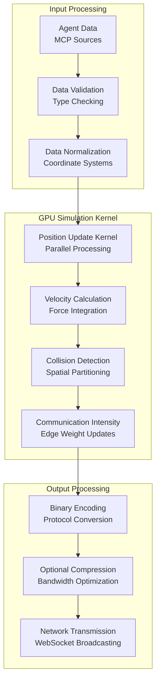

### Communication Intensity Algorithm

```rust
// Communication Intensity Calculation
pub fn calculate_communication_intensity(
    agent_a: &Agent,
    agent_b: &Agent,
    message_history: &[Message],
    time_window: Duration,
) -> f32 {
    let current_time = SystemTime::now();
    let cutoff_time = current_time - time_window;
    
    // Filter messages within time window
    let recent_messages: Vec<&Message> = message_history
        .iter()
        .filter(|msg| {
            msg.timestamp > cutoff_time &&
            ((msg.from == agent_a.id && msg.to == agent_b.id) ||
             (msg.from == agent_b.id && msg.to == agent_a.id))
        })
        .collect();
    
    // Calculate message rate (messages per second)
    let message_rate = recent_messages.len() as f32 / time_window.as_secs_f32();
    
    // Calculate data rate (bytes per second)
    let total_data: usize = recent_messages
        .iter()
        .map(|msg| msg.data.len())
        .sum();
    let data_rate = total_data as f32 / time_window.as_secs_f32();
    
    // Calculate distance between agents
    let distance = calculate_distance(&agent_a.position, &agent_b.position);
    
    // Apply communication intensity formula
    let base_intensity = (message_rate + data_rate * 0.001) / distance.max(1.0);
    
    // Apply time decay for message recency
    let recency_weight = recent_messages
        .iter()
        .map(|msg| {
            let age = current_time.duration_since(msg.timestamp).unwrap_or_default();
            (-age.as_secs_f32() / time_window.as_secs_f32()).exp()
        })
        .sum::<f32>() / recent_messages.len().max(1) as f32;
    
    // Cap maximum intensity
    (base_intensity * recency_weight).min(10.0)
}

fn calculate_distance(pos_a: &Position3D, pos_b: &Position3D) -> f32 {
    let dx = pos_a.x - pos_b.x;
    let dy = pos_a.y - pos_b.y;
    let dz = pos_a.z - pos_b.z;
    (dx * dx + dy * dy + dz * dz).sqrt()
}
```

## Error Handling Architecture

### Error Classification System

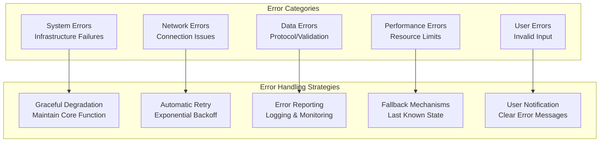

### Error Recovery Flow

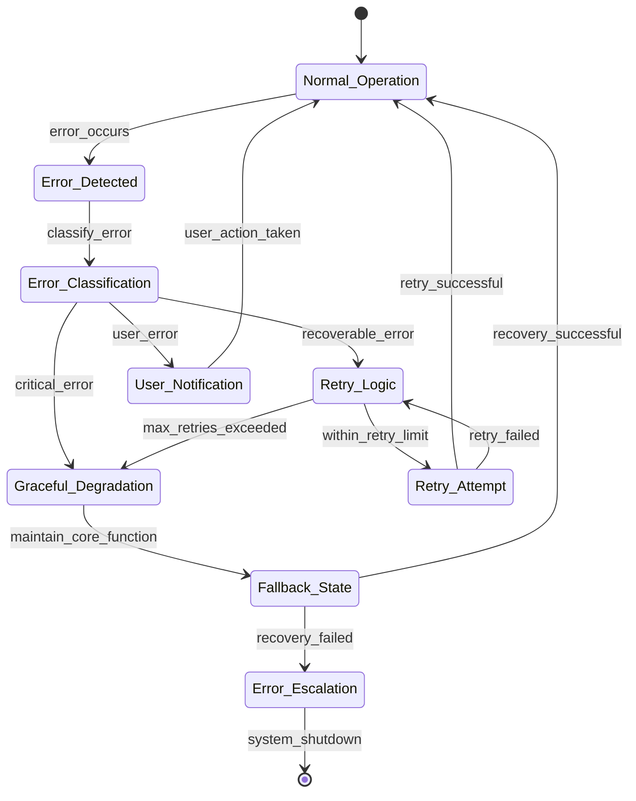

## Performance Architecture

### Performance Monitoring System

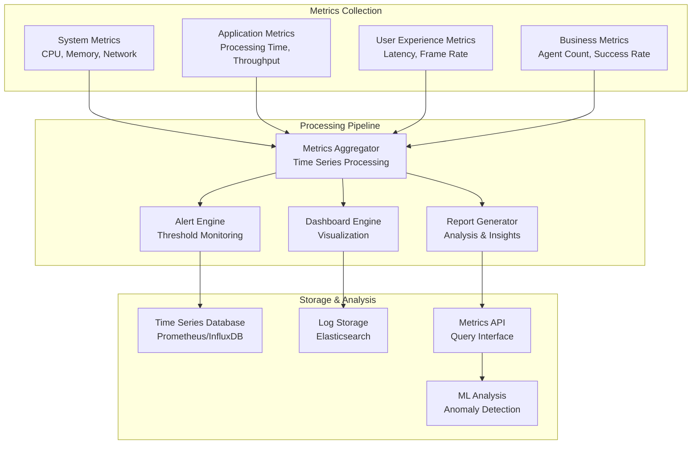

### Performance Optimization Strategies

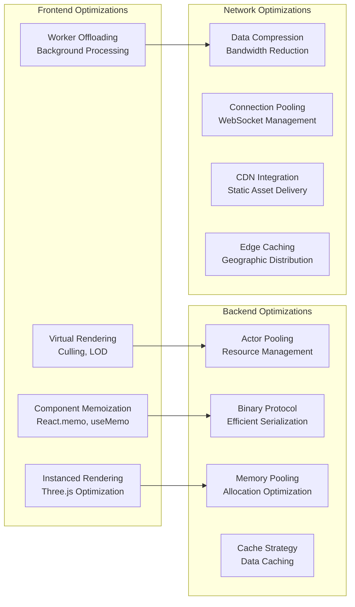

---

**Document Version**: 1.0  
**Last Updated**: July 31, 2025  
**Architecture Review Date**: August 15, 2025  
**Maintained By**: VisionFlow Architecture Team