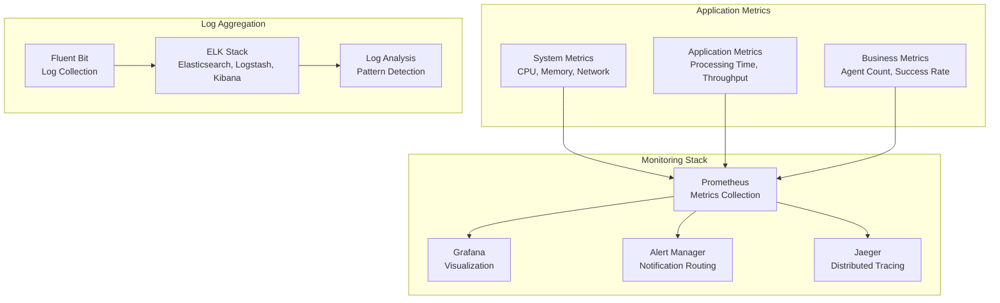

# VisionFlow GPU Physics Migration - Operations Manual

## Overview

This operations manual provides comprehensive guidance for monitoring, troubleshooting, performance tuning, and maintaining the VisionFlow GPU Physics Migration system in production environments. It serves as the primary reference for operations teams, system administrators, and support engineers.

## Table of Contents

- [System Monitoring](#system-monitoring)
- [Performance Monitoring](#performance-monitoring)
- [Troubleshooting Guide](#troubleshooting-guide)
- [Performance Tuning](#performance-tuning)
- [Maintenance Procedures](#maintenance-procedures)
- [Alert Management](#alert-management)
- [Capacity Planning](#capacity-planning)
- [Disaster Recovery](#disaster-recovery)

## System Monitoring

### Monitoring Architecture

The VisionFlow system implements multi-layer monitoring covering infrastructure, application, and business metrics.



### Key Performance Indicators (KPIs)

#### System Health KPIs

| Metric | Target | Warning | Critical | Description |
|--------|--------|---------|----------|-------------|
| System Uptime | >99.9% | <99.5% | <99% | Overall system availability |
| API Response Time | <100ms | >200ms | >500ms | Average API response time |
| WebSocket Latency | <16ms | >33ms | >50ms | Real-time update latency |
| Error Rate | <1% | >2% | >5% | Percentage of failed requests |
| Memory Usage | <70% | >80% | >90% | System memory utilization |
| CPU Utilization | <60% | >75% | >85% | Average CPU usage |

#### Application Performance KPIs

| Metric | Target | Warning | Critical | Description |
|--------|--------|---------|----------|-------------|
| Agent Processing Time | <4ms/100 agents | >6ms | >10ms | Time to process agent updates |
| Binary Protocol Throughput | >1MB/s | <800KB/s | <500KB/s | Binary data transmission rate |
| Active Agent Count | 200+ | 150-199 | <150 | Number of active agents |
| WebSocket Connections | 100+ | 50-99 | <50 | Concurrent WebSocket connections |
| MCP Service Response | <50ms | >100ms | >200ms | MCP service response time |

#### Business Impact KPIs

| Metric | Target | Warning | Critical | Description |
|--------|--------|---------|----------|-------------|
| User Session Duration | >10min | 5-10min | <5min | Average user engagement time |
| Visualization Frame Rate | 60 FPS | 45-59 FPS | <45 FPS | 3D rendering performance |
| Data Accuracy | 100% | 99.5-99.9% | <99.5% | Binary protocol data integrity |
| Feature Availability | 100% | 95-99% | <95% | Percentage of features working |

### Monitoring Dashboard Configuration

#### Primary Operations Dashboard

```json
{
  "dashboard": {
    "title": "VisionFlow Operations Dashboard",
    "tags": ["visionflow", "operations"],
    "refresh": "5s",
    "panels": [
      {
        "title": "System Overview",
        "type": "stat",
        "gridPos": {"h": 8, "w": 12, "x": 0, "y": 0},
        "targets": [
          {
            "expr": "up{job=\"visionflow\"} * 100",
            "legendFormat": "Uptime %"
          },
          {
            "expr": "visionflow_active_agents",
            "legendFormat": "Active Agents"
          },
          {
            "expr": "visionflow_websocket_connections",
            "legendFormat": "WebSocket Connections"
          }
        ]
      },
      {
        "title": "Performance Metrics",
        "type": "graph",
        "gridPos": {"h": 8, "w": 12, "x": 12, "y": 0},
        "targets": [
          {
            "expr": "rate(visionflow_processing_duration_seconds_sum[5m]) / rate(visionflow_processing_duration_seconds_count[5m]) * 1000",
            "legendFormat": "Avg Processing Time (ms)"
          },
          {
            "expr": "rate(visionflow_binary_bytes_transmitted[5m])",
            "legendFormat": "Binary Throughput (bytes/s)"
          }
        ]
      },
      {
        "title": "Error Rates",
        "type": "graph",
        "gridPos": {"h": 8, "w": 12, "x": 0, "y": 8},
        "targets": [
          {
            "expr": "rate(visionflow_errors_total[5m]) * 100",
            "legendFormat": "Error Rate %"
          },
          {
            "expr": "rate(visionflow_websocket_disconnections[5m])",
            "legendFormat": "WebSocket Disconnections/s"
          }
        ]
      },
      {
        "title": "Resource Utilization",
        "type": "graph",
        "gridPos": {"h": 8, "w": 12, "x": 12, "y": 8},
        "targets": [
          {
            "expr": "rate(process_cpu_seconds_total[5m]) * 100",
            "legendFormat": "CPU Usage %"
          },
          {
            "expr": "process_resident_memory_bytes / 1024 / 1024",
            "legendFormat": "Memory Usage (MB)"
          }
        ]
      }
    ]
  }
}
```

#### GPU Migration Specific Dashboard

```json
{
  "dashboard": {
    "title": "VisionFlow GPU Migration Metrics",
    "tags": ["visionflow", "gpu", "migration"],
    "panels": [
      {
        "title": "Binary Protocol Efficiency",
        "type": "stat",
        "targets": [
          {
            "expr": "visionflow_binary_protocol_compression_ratio",
            "legendFormat": "Compression Ratio"
          },
          {
            "expr": "visionflow_binary_protocol_accuracy",
            "legendFormat": "Data Accuracy %"
          }
        ]
      },
      {
        "title": "Agent Processing Pipeline",
        "type": "graph",
        "targets": [
          {
            "expr": "visionflow_mcp_fetch_duration_seconds",
            "legendFormat": "MCP Fetch Time"
          },
          {
            "expr": "visionflow_gpu_processing_duration_seconds",
            "legendFormat": "GPU Processing Time"
          },
          {
            "expr": "visionflow_binary_encoding_duration_seconds", 
            "legendFormat": "Binary Encoding Time"
          }
        ]
      },
      {
        "title": "Communication Intensity",
        "type": "heatmap",
        "targets": [
          {
            "expr": "visionflow_communication_intensity_histogram",
            "legendFormat": "Intensity Distribution"
          }
        ]
      }
    ]
  }
}
```

### Log Analysis and Monitoring

#### Log Categories and Severity Levels

```yaml
# Logging Configuration
log_levels:
  - TRACE: "Detailed execution flow for debugging"
  - DEBUG: "Development and troubleshooting information" 
  - INFO: "Normal operational events"
  - WARN: "Potentially harmful situations"
  - ERROR: "Error events that allow application to continue"
  - FATAL: "Critical errors that may cause application to abort"

log_categories:
  system:
    - component_startup
    - configuration_loading
    - resource_allocation
    
  application:
    - agent_processing
    - binary_protocol
    - websocket_communication
    - mcp_integration
    
  security:
    - authentication_events
    - authorization_failures
    - suspicious_activity
    
  performance:
    - processing_times
    - memory_usage
    - network_throughput
    - error_rates
```

#### Log Queries for Common Issues

```sql
-- High error rate detection
SELECT 
  timestamp,
  component,
  error_message,
  COUNT(*) as error_count
FROM logs 
WHERE 
  level = 'ERROR' 
  AND timestamp > NOW() - INTERVAL '5 minutes'
GROUP BY component, error_message
HAVING error_count > 10
ORDER BY error_count DESC;

-- Performance degradation detection
SELECT 
  timestamp,
  processing_time_ms,
  agent_count
FROM performance_logs
WHERE 
  processing_time_ms > 10
  AND timestamp > NOW() - INTERVAL '15 minutes'
ORDER BY processing_time_ms DESC;

-- WebSocket connection issues
SELECT 
  timestamp,
  connection_id,
  disconnect_reason,
  session_duration
FROM websocket_logs
WHERE 
  event_type = 'disconnect'
  AND disconnect_reason != 'normal_closure'
  AND timestamp > NOW() - INTERVAL '10 minutes';
```

## Performance Monitoring

### Real-Time Performance Metrics

#### System Performance Monitoring

```bash
#!/bin/bash
# performance-monitor.sh - Real-time performance monitoring script

PROMETHEUS_URL="http://localhost:9090"
ALERT_THRESHOLD_CPU=80
ALERT_THRESHOLD_MEMORY=85
ALERT_THRESHOLD_LATENCY=50

echo "=== VisionFlow Performance Monitor ==="
echo "Starting continuous monitoring at $(date)"

while true; do
    # CPU Usage
    CPU_USAGE=$(curl -s "$PROMETHEUS_URL/api/v1/query?query=rate(process_cpu_seconds_total[1m])*100" | \
                jq -r '.data.result[0].value[1]' | cut -d. -f1)
    
    # Memory Usage  
    MEMORY_USAGE=$(curl -s "$PROMETHEUS_URL/api/v1/query?query=process_resident_memory_bytes/1024/1024" | \
                   jq -r '.data.result[0].value[1]' | cut -d. -f1)
    
    # WebSocket Latency
    WS_LATENCY=$(curl -s "$PROMETHEUS_URL/api/v1/query?query=visionflow_websocket_latency_ms" | \
                 jq -r '.data.result[0].value[1]' | cut -d. -f1)
    
    # Agent Processing Time
    PROCESSING_TIME=$(curl -s "$PROMETHEUS_URL/api/v1/query?query=visionflow_processing_duration_ms" | \
                      jq -r '.data.result[0].value[1]' | cut -d. -f1)
    
    # Active Agents
    AGENT_COUNT=$(curl -s "$PROMETHEUS_URL/api/v1/query?query=visionflow_active_agents" | \
                  jq -r '.data.result[0].value[1]')
    
    # Display metrics
    echo "$(date '+%H:%M:%S') | CPU: ${CPU_USAGE}% | Memory: ${MEMORY_USAGE}MB | Latency: ${WS_LATENCY}ms | Processing: ${PROCESSING_TIME}ms | Agents: ${AGENT_COUNT}"
    
    # Check thresholds and alert
    if [ "$CPU_USAGE" -gt "$ALERT_THRESHOLD_CPU" ]; then
        echo "⚠️  ALERT: High CPU usage detected: ${CPU_USAGE}%"
    fi
    
    if [ "$MEMORY_USAGE" -gt "$ALERT_THRESHOLD_MEMORY" ]; then
        echo "⚠️  ALERT: High memory usage detected: ${MEMORY_USAGE}MB"
    fi
    
    if [ "$WS_LATENCY" -gt "$ALERT_THRESHOLD_LATENCY" ]; then
        echo "⚠️  ALERT: High WebSocket latency detected: ${WS_LATENCY}ms"
    fi
    
    sleep 5
done
```

#### Application Performance Monitoring

```python
#!/usr/bin/env python3
# app-performance-monitor.py - Application-specific performance monitoring

import requests
import time
import json
import statistics
from datetime import datetime, timedelta

class VisionFlowPerformanceMonitor:
    def __init__(self, api_base_url, prometheus_url):
        self.api_base_url = api_base_url
        self.prometheus_url = prometheus_url
        self.metrics_history = []
        
    def collect_metrics(self):
        """Collect current performance metrics"""
        try:
            # API Response Time
            start_time = time.time()
            health_response = requests.get(f"{self.api_base_url}/health", timeout=10)
            api_response_time = (time.time() - start_time) * 1000
            
            # Binary Protocol Metrics
            binary_metrics = self.get_prometheus_metric("visionflow_binary_protocol_efficiency")
            
            # Agent Processing Metrics
            processing_metrics = self.get_prometheus_metric("visionflow_agent_processing_time_ms")
            
            # WebSocket Connection Count
            ws_connections = self.get_prometheus_metric("visionflow_websocket_connections")
            
            # Error Rate
            error_rate = self.get_prometheus_metric("rate(visionflow_errors_total[5m]) * 100")
            
            metrics = {
                'timestamp': datetime.now().isoformat(),
                'api_response_time_ms': api_response_time,
                'binary_protocol_efficiency': binary_metrics,
                'agent_processing_time_ms': processing_metrics,
                'websocket_connections': ws_connections,
                'error_rate_percent': error_rate,
                'api_status_code': health_response.status_code
            }
            
            self.metrics_history.append(metrics)
            return metrics
            
        except Exception as e:
            print(f"Error collecting metrics: {e}")
            return None
    
    def get_prometheus_metric(self, query):
        """Query Prometheus for a specific metric"""
        try:
            response = requests.get(
                f"{self.prometheus_url}/api/v1/query",
                params={'query': query},
                timeout=5
            )
            data = response.json()
            if data.get('data', {}).get('result'):
                return float(data['data']['result'][0]['value'][1])
            return 0
        except Exception as e:
            print(f"Error querying Prometheus: {e}")
            return 0
    
    def analyze_performance_trends(self, window_minutes=15):
        """Analyze performance trends over time window"""
        cutoff_time = datetime.now() - timedelta(minutes=window_minutes)
        recent_metrics = [
            m for m in self.metrics_history 
            if datetime.fromisoformat(m['timestamp']) > cutoff_time
        ]
        
        if len(recent_metrics) < 3:
            return "Insufficient data for trend analysis"
        
        # Calculate trends
        response_times = [m['api_response_time_ms'] for m in recent_metrics]
        processing_times = [m['agent_processing_time_ms'] for m in recent_metrics]
        error_rates = [m['error_rate_percent'] for m in recent_metrics]
        
        analysis = {
            'avg_response_time': statistics.mean(response_times),
            'max_response_time': max(response_times),
            'avg_processing_time': statistics.mean(processing_times),
            'max_processing_time': max(processing_times),
            'avg_error_rate': statistics.mean(error_rates),
            'max_error_rate': max(error_rates),
            'trend_direction': self.calculate_trend(response_times[-5:])
        }
        
        return analysis
    
    def calculate_trend(self, values):
        """Calculate if trend is improving, degrading, or stable"""
        if len(values) < 3:
            return "stable"
        
        recent_avg = statistics.mean(values[-3:])
        earlier_avg = statistics.mean(values[:-3])
        
        if recent_avg > earlier_avg * 1.1:
            return "degrading"
        elif recent_avg < earlier_avg * 0.9:
            return "improving"
        else:
            return "stable"
    
    def generate_performance_report(self):
        """Generate comprehensive performance report"""
        analysis = self.analyze_performance_trends()
        current_metrics = self.collect_metrics()
        
        report = {
            'report_timestamp': datetime.now().isoformat(),
            'current_metrics': current_metrics,
            'trend_analysis': analysis,
            'recommendations': self.get_performance_recommendations(analysis, current_metrics)
        }
        
        return json.dumps(report, indent=2)
    
    def get_performance_recommendations(self, analysis, current_metrics):
        """Generate performance improvement recommendations"""
        recommendations = []
        
        if current_metrics and current_metrics['api_response_time_ms'] > 200:
            recommendations.append("Consider scaling backend services - API response time is high")
        
        if analysis and isinstance(analysis, dict):
            if analysis['avg_processing_time'] > 8:
                recommendations.append("Agent processing time exceeds target - consider GPU optimization")
            
            if analysis['avg_error_rate'] > 2:
                recommendations.append("Error rate is elevated - investigate application logs")
            
            if analysis['trend_direction'] == 'degrading':
                recommendations.append("Performance is degrading - investigate resource constraints")
        
        if not recommendations:
            recommendations.append("System performance is within acceptable parameters")
        
        return recommendations

# Usage example
if __name__ == "__main__":
    monitor = VisionFlowPerformanceMonitor(
        api_base_url="https://api.yourdomain.com",
        prometheus_url="http://localhost:9090"
    )
    
    print("Starting VisionFlow Performance Monitoring...")
    
    while True:
        metrics = monitor.collect_metrics()
        if metrics:
            print(f"[{metrics['timestamp']}] API: {metrics['api_response_time_ms']:.1f}ms | "
                  f"Processing: {metrics['agent_processing_time_ms']:.1f}ms | "
                  f"Connections: {metrics['websocket_connections']} | "
                  f"Errors: {metrics['error_rate_percent']:.2f}%")
        
        # Generate detailed report every 5 minutes
        if int(time.time()) % 300 == 0:
            report = monitor.generate_performance_report()
            with open(f"performance_report_{int(time.time())}.json", 'w') as f:
                f.write(report)
        
        time.sleep(30)
```

### Performance Benchmarking

#### Load Testing Script

```bash
#!/bin/bash
# load-test.sh - Automated load testing for VisionFlow

API_BASE_URL="https://api.yourdomain.com"
WEBSOCKET_URL="wss://yourdomain.com/ws"
CONCURRENT_USERS="50 100 200 400"
TEST_DURATION="300" # 5 minutes
RESULTS_DIR="load-test-results"

mkdir -p $RESULTS_DIR

echo "=== VisionFlow Load Testing Suite ==="
echo "Test Duration: ${TEST_DURATION} seconds"
echo "API URL: ${API_BASE_URL}"
echo "WebSocket URL: ${WEBSOCKET_URL}"
echo ""

for users in $CONCURRENT_USERS; do
    echo "Testing with $users concurrent users..."
    
    # Test API endpoints
    echo "1. Testing API performance..."
    ab -n $((users * 10)) -c $users -g "${RESULTS_DIR}/api_${users}_users.dat" \
       "${API_BASE_URL}/api/bots/data" > "${RESULTS_DIR}/api_${users}_users.txt"
    
    # Test WebSocket connections
    echo "2. Testing WebSocket performance..."
    node load-test-websocket.js $users $TEST_DURATION > "${RESULTS_DIR}/ws_${users}_users.txt"
    
    # Test binary protocol efficiency
    echo "3. Testing binary protocol..."
    curl -X POST "${API_BASE_URL}/api/bots/load-test" \
         -H "Content-Type: application/json" \
         -d "{\"agentCount\": $users, \"duration\": $TEST_DURATION, \"protocol\": \"binary\"}" \
         > "${RESULTS_DIR}/binary_${users}_users.txt"
    
    echo "Completed test with $users users"
    echo "Waiting 60 seconds before next test..."
    sleep 60
done

echo "=== Load Testing Complete ==="
echo "Results saved to: $RESULTS_DIR"

# Generate summary report
python3 generate-load-test-report.py $RESULTS_DIR
```

## Troubleshooting Guide

### Common Issues and Solutions

#### Issue Category: WebSocket Connection Problems

**Symptom**: Clients unable to establish WebSocket connections
```
Error: WebSocket connection failed
Error: Connection timeout after 30 seconds
Error: WebSocket closed unexpectedly (code: 1006)
```

**Diagnosis Steps**:
1. Check WebSocket service status
```bash
curl -I https://yourdomain.com/ws
netstat -tulpn | grep :3002
docker logs visionflow_backend | grep -i websocket
```

2. Verify NGINX configuration
```bash
nginx -t
cat /etc/nginx/sites-available/visionflow | grep -A 10 "location /ws"
```

3. Check SSL certificates for WSS
```bash
echo | openssl s_client -servername yourdomain.com -connect yourdomain.com:443
```

**Solutions**:
- Restart WebSocket service: `docker-compose restart visionflow_backend`
- Check firewall rules: `ufw status | grep 3002`
- Verify NGINX WebSocket proxy configuration
- Validate SSL certificate chain for WSS connections

#### Issue Category: High Processing Latency

**Symptom**: Agent processing times exceed performance targets
```
Processing Time: 25ms (target: <10ms)
Binary Protocol Latency: >100ms
Frame Rate: 15 FPS (target: 60 FPS)
```

**Diagnosis Steps**:
1. Check system resources
```bash
htop
iostat -x 1
free -h
```

2. Analyze processing pipeline
```bash
curl https://yourdomain.com/api/metrics | grep processing_time
docker stats visionflow_backend
```

3. Review application logs
```bash
docker logs visionflow_backend | grep -E "(WARN|ERROR)" | tail -50
```

**Solutions**:
- Scale backend resources: Update Docker compose memory/CPU limits
- Optimize agent count: Reduce concurrent agents below capacity limit
- Enable GPU acceleration: Set `GPU_ACCELERATION=true` in environment
- Implement agent culling: Enable distance-based agent filtering

#### Issue Category: MCP Service Integration Failures

**Symptom**: Agents not appearing or showing stale data
```
Error: MCP service connection failed
Error: /bots/data endpoint timeout
Warning: Using cached agent data (>5 minutes old)
```

**Diagnosis Steps**:
1. Test MCP service connectivity
```bash
curl -X GET http://powerdev:3000/health
telnet powerdev 3000
docker logs claude_flow_mcp
```

2. Check MCP WebSocket relay
```bash
wscat -c ws://powerdev:3000/ws
docker-compose logs mcp_relay
```

3. Verify MCP protocol messages
```bash
# Enable debug logging
export RUST_LOG=debug
docker-compose restart visionflow_backend
```

**Solutions**:
- Restart MCP service: `docker-compose restart claude_flow_mcp`
- Check network connectivity between containers
- Verify MCP authentication credentials
- Update MCP service endpoint configuration

#### Issue Category: Binary Protocol Data Corruption

**Symptom**: Visualization showing incorrect agent positions
```
Error: Binary data validation failed
Warning: Position coordinates out of bounds
Error: ArrayBuffer size mismatch
```

**Diagnosis Steps**:
1. Validate binary protocol integrity
```bash
curl -X GET https://yourdomain.com/api/bots/binary-test
```

2. Check data encoding/decoding
```javascript
// Browser console test
const testData = new ArrayBuffer(28);
const view = new DataView(testData);
// Verify binary data structure
```

3. Monitor network transmission
```bash
tcpdump -i any -w websocket-capture.pcap port 3002
wireshark websocket-capture.pcap
```

**Solutions**:
- Verify endianness consistency (little-endian)
- Check WebSocket binary message handling
- Validate binary protocol version compatibility
- Implement additional data integrity checks

### Diagnostic Commands Reference

#### System Health Diagnostics

```bash
#!/bin/bash
# system-diagnostics.sh - Comprehensive system health check

echo "=== VisionFlow System Diagnostics ==="
echo "Timestamp: $(date)"
echo ""

# Container Status
echo "1. Container Status:"
docker-compose ps
echo ""

# Resource Usage
echo "2. Resource Usage:"
docker stats --no-stream --format "table {{.Container}}\t{{.CPUPerc}}\t{{.MemUsage}}\t{{.NetIO}}"
echo ""

# Service Health
echo "3. Service Health Checks:"
curl -f https://yourdomain.com/api/health || echo "❌ API health check failed"
curl -f http://localhost:3000/health || echo "❌ MCP service health check failed"
curl -I https://yourdomain.com/ws || echo "❌ WebSocket endpoint check failed"
echo ""

# Log Analysis
echo "4. Recent Errors (last 10 minutes):"
docker logs visionflow_backend --since 10m | grep -E "(ERROR|FATAL)" | wc -l | \
    xargs echo "Backend errors:"
docker logs claude_flow_mcp --since 10m | grep -E "(ERROR|FATAL)" | wc -l | \
    xargs echo "MCP errors:"
echo ""

# Performance Metrics
echo "5. Current Performance Metrics:"
AGENT_COUNT=$(curl -s https://yourdomain.com/api/bots/data | jq '.nodes | length' 2>/dev/null || echo "N/A")
echo "Active agents: $AGENT_COUNT"

WS_CONNECTIONS=$(curl -s http://localhost:9090/api/v1/query?query=visionflow_websocket_connections 2>/dev/null | \
    jq -r '.data.result[0].value[1]' 2>/dev/null || echo "N/A")
echo "WebSocket connections: $WS_CONNECTIONS"

# Network Connectivity
echo "6. Network Connectivity:"
ping -c 1 powerdev >/dev/null 2>&1 && echo "✅ MCP host reachable" || echo "❌ MCP host unreachable"
nc -z localhost 3000 && echo "✅ MCP service port open" || echo "❌ MCP service port closed"
nc -z localhost 8080 && echo "✅ Backend API port open" || echo "❌ Backend API port closed"

echo ""
echo "=== Diagnostics Complete ==="
```

#### Performance Profiling

```bash
#!/bin/bash
# performance-profile.sh - Deep performance analysis

PROFILE_DURATION="60"
RESULTS_DIR="performance-profile-$(date +%Y%m%d_%H%M%S)"
mkdir -p $RESULTS_DIR

echo "=== VisionFlow Performance Profiling ==="
echo "Duration: ${PROFILE_DURATION} seconds"
echo "Results will be saved to: $RESULTS_DIR"

# System resource monitoring
echo "Starting system monitoring..."
{
    echo "timestamp,cpu_percent,memory_mb,network_rx_mb,network_tx_mb"
    for i in $(seq 1 $PROFILE_DURATION); do
        TIMESTAMP=$(date '+%Y-%m-%d %H:%M:%S')
        CPU=$(top -bn1 | grep "Cpu(s)" | awk '{print $2}' | sed 's/%us,//')
        MEMORY=$(free -m | awk 'NR==2{printf "%.1f", $3}')
        NETWORK=$(cat /proc/net/dev | grep eth0 | awk '{print $2","$10}' | \
                  awk -F',' '{printf "%.2f,%.2f", $1/1024/1024, $2/1024/1024}')
        echo "$TIMESTAMP,$CPU,$MEMORY,$NETWORK"
        sleep 1
    done
} > "$RESULTS_DIR/system_resources.csv" &

# Application-specific monitoring
echo "Starting application monitoring..."
{
    echo "timestamp,api_response_ms,processing_time_ms,agent_count,websocket_connections,error_rate"
    for i in $(seq 1 $PROFILE_DURATION); do
        TIMESTAMP=$(date '+%Y-%m-%d %H:%M:%S')
        
        # API response time
        API_TIME=$(curl -w "%{time_total}" -o /dev/null -s https://yourdomain.com/api/health | \
                   awk '{printf "%.0f", $1*1000}')
        
        # Processing time from metrics
        PROC_TIME=$(curl -s http://localhost:9090/api/v1/query?query=visionflow_processing_duration_ms 2>/dev/null | \
                    jq -r '.data.result[0].value[1]' 2>/dev/null || echo "0")
        
        # Agent count
        AGENTS=$(curl -s https://yourdomain.com/api/bots/data 2>/dev/null | \
                 jq '.nodes | length' 2>/dev/null || echo "0")
        
        # WebSocket connections
        WS_CONN=$(curl -s http://localhost:9090/api/v1/query?query=visionflow_websocket_connections 2>/dev/null | \
                  jq -r '.data.result[0].value[1]' 2>/dev/null || echo "0")
        
        # Error rate
        ERROR_RATE=$(curl -s http://localhost:9090/api/v1/query?query=rate\\(visionflow_errors_total\\[1m\\]\\)*100 2>/dev/null | \
                     jq -r '.data.result[0].value[1]' 2>/dev/null || echo "0")
        
        echo "$TIMESTAMP,$API_TIME,$PROC_TIME,$AGENTS,$WS_CONN,$ERROR_RATE"
        sleep 1
    done
} > "$RESULTS_DIR/application_metrics.csv" &

# WebSocket connection profiling
echo "Starting WebSocket profiling..."
node websocket-profiler.js $PROFILE_DURATION > "$RESULTS_DIR/websocket_profile.json" &

# Wait for all monitoring to complete
wait

echo "Profiling complete. Analyzing results..."

# Generate analysis report
python3 analyze-performance-profile.py "$RESULTS_DIR"

echo "Results available in: $RESULTS_DIR"
```

## Performance Tuning

### Backend Performance Optimization

#### Rust Backend Tuning

```toml
# Cargo.toml - Production optimized build configuration
[profile.release]
opt-level = 3
lto = true
codegen-units = 1
panic = 'abort'

[dependencies.actix-web]
version = "4"
features = ["rustls"]
default-features = false

[dependencies.tokio]
version = "1"
features = ["full"]
```

```rust
// Performance optimized actor configuration
pub struct AppConfig {
    pub max_websocket_connections: usize,
    pub agent_processing_batch_size: usize,
    pub binary_buffer_pool_size: usize,
    pub mcp_connection_timeout: Duration,
}

impl Default for AppConfig {
    fn default() -> Self {
        Self {
            max_websocket_connections: 1000,
            agent_processing_batch_size: 100,
            binary_buffer_pool_size: 50,
            mcp_connection_timeout: Duration::from_secs(30),
        }
    }
}

// Memory pool for binary buffers
pub struct BinaryBufferPool {
    buffers: Arc<Mutex<Vec<Vec<u8>>>>,
    buffer_size: usize,
}

impl BinaryBufferPool {
    pub fn new(pool_size: usize, buffer_size: usize) -> Self {
        let buffers = (0..pool_size)
            .map(|_| Vec::with_capacity(buffer_size))
            .collect();
        
        Self {
            buffers: Arc::new(Mutex::new(buffers)),
            buffer_size,
        }
    }
    
    pub fn get_buffer(&self) -> Vec<u8> {
        let mut buffers = self.buffers.lock().unwrap();
        buffers.pop().unwrap_or_else(|| Vec::with_capacity(self.buffer_size))
    }
    
    pub fn return_buffer(&self, mut buffer: Vec<u8>) {
        buffer.clear();
        let mut buffers = self.buffers.lock().unwrap();
        if buffers.len() < 50 { // Max pool size
            buffers.push(buffer);
        }
    }
}
```

#### Database and Storage Optimization

```sql
-- Database indexes for optimal query performance
CREATE INDEX CONCURRENTLY idx_agents_active 
ON agents(id) WHERE status = 'active';

CREATE INDEX CONCURRENTLY idx_agent_positions_timestamp 
ON agent_positions(agent_id, timestamp DESC);

CREATE INDEX CONCURRENTLY idx_communication_links_intensity 
ON communication_links(from_agent, to_agent, intensity DESC);

-- Partitioning for large datasets
CREATE TABLE agent_positions_2025 PARTITION OF agent_positions
FOR VALUES FROM ('2025-01-01') TO ('2026-01-01');
```

### Frontend Performance Optimization

#### React Component Optimization

```typescript
// Optimized agent visualization component
import React, { memo, useMemo, useCallback } from 'react';
import { Canvas } from '@react-three/fiber';

interface AgentVisualizationGPUProps {
  agents: BotsAgent[];
  onAgentClick?: (agent: BotsAgent) => void;
  maxRenderDistance?: number;
}

export const AgentVisualizationGPU = memo<AgentVisualizationGPUProps>(({
  agents,
  onAgentClick,
  maxRenderDistance = 100
}) => {
  // Memoize visible agents based on distance culling
  const visibleAgents = useMemo(() => {
    return agents.filter(agent => {
      const distance = Math.sqrt(
        agent.position.x ** 2 + 
        agent.position.y ** 2 + 
        agent.position.z ** 2
      );
      return distance <= maxRenderDistance;
    });
  }, [agents, maxRenderDistance]);
  
  // Memoize instanced mesh data
  const instancedData = useMemo(() => {
    const positions = new Float32Array(visibleAgents.length * 3);
    const colors = new Float32Array(visibleAgents.length * 3);
    
    visibleAgents.forEach((agent, index) => {
      positions[index * 3] = agent.position.x;
      positions[index * 3 + 1] = agent.position.y;
      positions[index * 3 + 2] = agent.position.z;
      
      const color = getAgentColor(agent.status);
      colors[index * 3] = color.r;
      colors[index * 3 + 1] = color.g;
      colors[index * 3 + 2] = color.b;
    });
    
    return { positions, colors };
  }, [visibleAgents]);
  
  const handleAgentClick = useCallback((event: ThreeEvent<MouseEvent>) => {
    if (onAgentClick) {
      const instanceId = event.instanceId;
      if (instanceId !== undefined && visibleAgents[instanceId]) {
        onAgentClick(visibleAgents[instanceId]);
      }
    }
  }, [onAgentClick, visibleAgents]);
  
  return (
    <Canvas>
      <InstancedAgentMesh
        count={visibleAgents.length}
        positions={instancedData.positions}
        colors={instancedData.colors}
        onClick={handleAgentClick}
      />
    </Canvas>
  );
});

// Helper component for instanced rendering
const InstancedAgentMesh = memo<{
  count: number;
  positions: Float32Array;
  colors: Float32Array;
  onClick: (event: ThreeEvent<MouseEvent>) => void;
}>(({ count, positions, colors, onClick }) => {
  return (
    <instancedMesh args={[undefined, undefined, count]} onClick={onClick}>
      <sphereGeometry args={[0.1, 8, 6]} />
      <meshBasicMaterial />
      <instancedBufferAttribute
        attach="geometry-attributes-instancePosition"
        args={[positions, 3]}
      />
      <instancedBufferAttribute
        attach="geometry-attributes-instanceColor"
        args={[colors, 3]}
      />
    </instancedMesh>
  );
});
```

#### WebSocket Optimization

```typescript
// Optimized WebSocket service with connection pooling
class OptimizedWebSocketService {
  private connections: WebSocket[] = [];
  private connectionIndex = 0;
  private maxConnections = 4;
  private messageQueue: ArrayBuffer[] = [];
  private processing = false;
  
  constructor(private baseUrl: string) {
    this.initializeConnections();
  }
  
  private async initializeConnections(): Promise<void> {
    const promises = Array.from({ length: this.maxConnections }, (_, i) =>
      this.createConnection(`${this.baseUrl}/ws-${i}`)
    );
    
    this.connections = await Promise.all(promises);
    this.startMessageProcessor();
  }
  
  private createConnection(url: string): Promise<WebSocket> {
    return new Promise((resolve, reject) => {
      const ws = new WebSocket(url);
      ws.binaryType = 'arraybuffer';
      
      ws.onopen = () => resolve(ws);
      ws.onerror = reject;
      
      ws.onmessage = (event) => {
        if (event.data instanceof ArrayBuffer) {
          this.messageQueue.push(event.data);
        }
      };
    });
  }
  
  private startMessageProcessor(): void {
    const processMessages = () => {
      if (this.messageQueue.length > 0 && !this.processing) {
        this.processing = true;
        
        // Process messages in batches
        const batch = this.messageQueue.splice(0, 10);
        this.processBinaryBatch(batch).finally(() => {
          this.processing = false;
        });
      }
      
      requestAnimationFrame(processMessages);
    };
    
    processMessages();
  }
  
  private async processBinaryBatch(messages: ArrayBuffer[]): Promise<void> {
    const allAgents: BinaryNodeData[] = [];
    
    for (const message of messages) {
      try {
        const agents = BinaryProtocolParser.parsePositionUpdate(message);
        allAgents.push(...agents);
      } catch (error) {
        console.warn('Binary protocol parsing error:', error);
      }
    }
    
    if (allAgents.length > 0) {
      // Update agent positions in batch
      this.updateAgentPositions(allAgents);
    }
  }
  
  private updateAgentPositions(agents: BinaryNodeData[]): void {
    // Use requestAnimationFrame for smooth updates
    requestAnimationFrame(() => {
      // Update Three.js objects efficiently
      agents.forEach(agent => {
        const object = this.getAgentObject(agent.nodeId);
        if (object) {
          object.position.set(...agent.position);
          object.velocity = agent.velocity;
        }
      });
    });
  }
}
```

### Network Optimization

#### CDN Configuration

```yaml
# CloudFlare configuration for static assets
cloudflare_rules:
  - pattern: "*.js"
    cache_level: "aggressive"
    edge_cache_ttl: "1y"
    browser_cache_ttl: "1y"
    
  - pattern: "*.css"
    cache_level: "aggressive"
    edge_cache_ttl: "1y"
    browser_cache_ttl: "1y"
    
  - pattern: "*.wasm"
    cache_level: "aggressive"
    edge_cache_ttl: "1y"
    browser_cache_ttl: "1y"
    
  - pattern: "/api/*"
    cache_level: "bypass"
    
  - pattern: "/ws"
    cache_level: "bypass"
```

#### Compression Configuration

```nginx
# NGINX compression optimization
http {
    # Enable gzip compression
    gzip on;
    gzip_vary on;
    gzip_min_length 1024;
    gzip_comp_level 6;
    gzip_types
        text/plain
        text/css
        text/xml
        text/javascript
        application/json
        application/javascript
        application/xml+rss
        application/atom+xml
        image/svg+xml;
    
    # Enable Brotli compression (if available)
    brotli on;
    brotli_comp_level 6;
    brotli_types
        text/plain
        text/css
        application/json
        application/javascript
        text/xml
        application/xml
        application/xml+rss
        text/javascript;
    
    # Connection optimization
    keepalive_timeout 65;
    keepalive_requests 100;
    
    # Buffer optimization
    client_body_buffer_size 10K;
    client_header_buffer_size 1k;
    client_max_body_size 8m;
    large_client_header_buffers 2 1k;
}
```

## Maintenance Procedures

### Routine Maintenance Schedule

#### Daily Maintenance Tasks

```bash
#!/bin/bash
# daily-maintenance.sh - Daily maintenance procedures

echo "=== VisionFlow Daily Maintenance ==="
echo "Date: $(date)"

# 1. Health Check
echo "1. Performing health checks..."
./system-diagnostics.sh > "logs/health-check-$(date +%Y%m%d).log"

# 2. Log Rotation
echo "2. Rotating logs..."
docker-compose exec visionflow_backend logrotate /etc/logrotate.d/visionflow
find logs/ -name "*.log" -mtime +30 -delete

# 3. Cleanup Temporary Files
echo "3. Cleaning temporary files..."
docker system prune -f --volumes --filter "until=24h"

# 4. Database Maintenance
echo "4. Database maintenance..."
docker-compose exec postgres vacuumdb -U postgres -d visionflow -z

# 5. Performance Snapshot
echo "5. Creating performance snapshot..."
python3 performance-snapshot.py > "logs/performance-$(date +%Y%m%d).json"

# 6. Backup Verification
echo "6. Verifying backups..."
./verify-backups.sh

echo "Daily maintenance completed at $(date)"
```

#### Weekly Maintenance Tasks

```bash
#!/bin/bash
# weekly-maintenance.sh - Weekly maintenance procedures

echo "=== VisionFlow Weekly Maintenance ==="
echo "Week of: $(date +%Y-%U)"

# 1. Full System Backup
echo "1. Creating full system backup..."
./full-backup.sh

# 2. Security Updates
echo "2. Checking for security updates..."
apt list --upgradable | grep -i security
docker images --format "table {{.Repository}}\t{{.Tag}}\t{{.CreatedAt}}" | grep -E "(weeks|months) ago"

# 3. Performance Analysis
echo "3. Generating weekly performance report..."
python3 weekly-performance-analysis.py

# 4. Capacity Analysis
echo "4. Analyzing capacity trends..."
./capacity-analysis.sh

# 5. SSL Certificate Check
echo "5. Checking SSL certificates..."
./check-ssl-expiry.sh

# 6. Clean Old Backups
echo "6. Cleaning old backups..."
find backups/ -name "*.tar.gz" -mtime +90 -delete

echo "Weekly maintenance completed at $(date)"
```

#### Monthly Maintenance Tasks

```bash
#!/bin/bash
# monthly-maintenance.sh - Monthly maintenance procedures

echo "=== VisionFlow Monthly Maintenance ==="
echo "Month: $(date +%Y-%m)"

# 1. Full Security Audit
echo "1. Performing security audit..."
./security-audit.sh > "reports/security-audit-$(date +%Y%m).log"

# 2. Performance Optimization Review
echo "2. Reviewing performance optimizations..."
python3 performance-optimization-review.py

# 3. Disaster Recovery Test
echo "3. Testing disaster recovery procedures..."
./test-disaster-recovery.sh

# 4. Dependency Updates
echo "4. Updating dependencies..."
docker-compose pull
cargo update
npm audit fix

# 5. Configuration Review
echo "5. Reviewing system configuration..."
./config-review.sh

# 6. Documentation Updates
echo "6. Updating documentation..."
./update-documentation.sh

echo "Monthly maintenance completed at $(date)"
```

### Backup and Recovery Procedures

#### Automated Backup System

```bash
#!/bin/bash
# automated-backup.sh - Comprehensive backup system

BACKUP_BASE_DIR="/opt/visionflow/backups"
DATE=$(date +%Y%m%d_%H%M%S)
BACKUP_DIR="$BACKUP_BASE_DIR/$DATE"
RETENTION_DAYS=30

mkdir -p "$BACKUP_DIR"

echo "=== VisionFlow Automated Backup ==="
echo "Backup Directory: $BACKUP_DIR"
echo "Start Time: $(date)"

# 1. Application Data Backup
echo "1. Backing up application data..."
tar -czf "$BACKUP_DIR/app-data.tar.gz" -C /opt/visionflow data/
tar -czf "$BACKUP_DIR/logs.tar.gz" -C /opt/visionflow logs/

# 2. Configuration Backup
echo "2. Backing up configuration..."
tar -czf "$BACKUP_DIR/config.tar.gz" \
    docker-compose.yml \
    .env \
    nginx/ \
    ssl-certificates/

# 3. Database Backup (if applicable)
echo "3. Backing up database..."
if docker-compose ps postgres | grep -q "Up"; then
    docker-compose exec -T postgres pg_dump -U postgres visionflow | \
        gzip > "$BACKUP_DIR/database.sql.gz"
fi

# 4. Container Images Backup
echo "4. Backing up container images..."
docker save visionflow/backend:latest | gzip > "$BACKUP_DIR/backend-image.tar.gz"
docker save visionflow/frontend:latest | gzip > "$BACKUP_DIR/frontend-image.tar.gz"

# 5. Create backup manifest
echo "5. Creating backup manifest..."
cat > "$BACKUP_DIR/manifest.json" << EOF
{
  "backup_date": "$(date -Iseconds)",
  "backup_type": "automated",
  "retention_until": "$(date -d "+$RETENTION_DAYS days" -Iseconds)",
  "files": [
    "app-data.tar.gz",
    "logs.tar.gz",
    "config.tar.gz",
    "database.sql.gz",
    "backend-image.tar.gz",
    "frontend-image.tar.gz"
  ],
  "system_info": {
    "hostname": "$(hostname)",
    "docker_version": "$(docker --version)",
    "system_load": "$(uptime)",
    "disk_usage": "$(df -h / | tail -1)"
  }
}
EOF

# 6. Cleanup old backups
echo "6. Cleaning up old backups..."
find "$BACKUP_BASE_DIR" -name "20*" -type d -mtime +$RETENTION_DAYS -exec rm -rf {} \;

# 7. Verify backup integrity
echo "7. Verifying backup integrity..."
for file in "$BACKUP_DIR"/*.tar.gz "$BACKUP_DIR"/*.sql.gz; do
    if [ -f "$file" ]; then
        if ! gzip -t "$file" 2>/dev/null; then
            echo "❌ Backup verification failed for: $(basename "$file")"
            exit 1
        fi
    fi
done

BACKUP_SIZE=$(du -sh "$BACKUP_DIR" | cut -f1)
echo "✅ Backup completed successfully"
echo "Backup Size: $BACKUP_SIZE"
echo "End Time: $(date)"

# 8. Send notification (if configured)
if [ -n "$BACKUP_NOTIFICATION_URL" ]; then
    curl -X POST "$BACKUP_NOTIFICATION_URL" \
         -H "Content-Type: application/json" \
         -d "{\"message\": \"VisionFlow backup completed: $BACKUP_SIZE\", \"status\": \"success\"}"
fi
```

#### Disaster Recovery Procedure

```bash
#!/bin/bash
# disaster-recovery.sh - Disaster recovery implementation

BACKUP_DIR="$1"
RECOVERY_TYPE="${2:-full}" # full, partial, config-only

if [ -z "$BACKUP_DIR" ]; then
    echo "Usage: $0 <backup_directory> [recovery_type]"
    echo "Recovery types: full, partial, config-only"
    exit 1
fi

echo "=== VisionFlow Disaster Recovery ==="
echo "Backup Source: $BACKUP_DIR"
echo "Recovery Type: $RECOVERY_TYPE"
echo "Start Time: $(date)"

# 1. Stop services
echo "1. Stopping services..."
docker-compose down

# 2. Backup current state (if possible)
echo "2. Creating pre-recovery backup..."
if [ -d "/opt/visionflow" ]; then
    tar -czf "/tmp/pre-recovery-backup-$(date +%Y%m%d_%H%M%S).tar.gz" -C / opt/visionflow
fi

case "$RECOVERY_TYPE" in
    "full")
        echo "3. Performing full recovery..."
        
        # Restore application data
        echo "3a. Restoring application data..."
        tar -xzf "$BACKUP_DIR/app-data.tar.gz" -C /opt/visionflow/
        
        # Restore configuration
        echo "3b. Restoring configuration..."
        tar -xzf "$BACKUP_DIR/config.tar.gz" -C /opt/visionflow/
        
        # Restore database
        echo "3c. Restoring database..."
        if [ -f "$BACKUP_DIR/database.sql.gz" ]; then
            docker-compose up -d postgres
            sleep 10
            zcat "$BACKUP_DIR/database.sql.gz" | \
                docker-compose exec -T postgres psql -U postgres -d visionflow
        fi
        
        # Restore container images
        echo "3d. Restoring container images..."
        docker load < "$BACKUP_DIR/backend-image.tar.gz"
        docker load < "$BACKUP_DIR/frontend-image.tar.gz"
        ;;
        
    "partial")
        echo "3. Performing partial recovery (data only)..."
        tar -xzf "$BACKUP_DIR/app-data.tar.gz" -C /opt/visionflow/
        ;;
        
    "config-only")
        echo "3. Performing configuration recovery..."
        tar -xzf "$BACKUP_DIR/config.tar.gz" -C /opt/visionflow/
        ;;
        
    *)
        echo "❌ Unknown recovery type: $RECOVERY_TYPE"
        exit 1
        ;;
esac

# 4. Start services
echo "4. Starting services..."
docker-compose up -d

# 5. Wait for services to be ready
echo "5. Waiting for services to start..."
sleep 30

# 6. Verify recovery
echo "6. Verifying recovery..."
./system-diagnostics.sh

# 7. Health check
echo "7. Performing health check..."
for i in {1..10}; do
    if curl -f https://yourdomain.com/api/health >/dev/null 2>&1; then
        echo "✅ Service is healthy"
        break
    else
        echo "Waiting for service to be ready... ($i/10)"
        sleep 10
    fi
done

echo "=== Disaster Recovery Complete ==="
echo "End Time: $(date)"
```

## Alert Management

### Alert Configuration

#### Prometheus Alert Rules

```yaml
# alerts.yml - Prometheus alert rules
groups:
  - name: visionflow.rules
    rules:
      # High Error Rate
      - alert: HighErrorRate
        expr: rate(visionflow_errors_total[5m]) * 100 > 5
        for: 2m
        labels:
          severity: critical
        annotations:
          summary: "High error rate detected"
          description: "Error rate is {{ $value }}% over the last 5 minutes"
      
      # High Processing Latency
      - alert: HighProcessingLatency
        expr: visionflow_processing_duration_ms > 20
        for: 1m
        labels:
          severity: warning
        annotations:
          summary: "High processing latency"
          description: "Processing time is {{ $value }}ms (target: <10ms)"
      
      # WebSocket Connection Issues
      - alert: WebSocketConnectionLow
        expr: visionflow_websocket_connections < 10
        for: 5m
        labels:
          severity: warning
        annotations:
          summary: "Low WebSocket connection count"
          description: "Only {{ $value }} WebSocket connections active"
      
      # System Resource Alerts
      - alert: HighMemoryUsage
        expr: (process_resident_memory_bytes / 1024 / 1024) > 1000
        for: 5m
        labels:
          severity: warning
        annotations:
          summary: "High memory usage"
          description: "Memory usage is {{ $value }}MB"
      
      # Service Down
      - alert: ServiceDown
        expr: up{job="visionflow"} == 0
        for: 1m
        labels:
          severity: critical
        annotations:
          summary: "VisionFlow service is down"
          description: "Service has been down for more than 1 minute"
```

#### Alert Manager Configuration

```yaml
# alertmanager.yml
global:
  smtp_smarthost: 'smtp.gmail.com:587'
  smtp_from: 'alerts@yourdomain.com'

route:
  group_by: ['alertname']
  group_wait: 10s
  group_interval: 10s
  repeat_interval: 1h
  receiver: 'web.hook'
  routes:
    - match:
        severity: critical
      receiver: 'critical-alerts'
    - match:
        severity: warning
      receiver: 'warning-alerts'

receivers:
  - name: 'web.hook'
    webhook_configs:
      - url: 'http://webhook-service:5000/alerts'
  
  - name: 'critical-alerts'
    email_configs:
      - to: 'oncall@yourdomain.com'
        subject: 'CRITICAL: VisionFlow Alert'
        body: |
          {{ range .Alerts }}
          Alert: {{ .Annotations.summary }}
          Description: {{ .Annotations.description }}
          {{ end }}
    webhook_configs:
      - url: 'http://webhook-service:5000/critical-alerts'
  
  - name: 'warning-alerts'
    email_configs:
      - to: 'team@yourdomain.com'
        subject: 'WARNING: VisionFlow Alert'
        body: |
          {{ range .Alerts }}
          Alert: {{ .Annotations.summary }}
          Description: {{ .Annotations.description }}
          {{ end }}
```

### Alert Response Procedures

#### Critical Alert Response

```bash
#!/bin/bash
# critical-alert-response.sh - Automated critical alert response

ALERT_TYPE="$1"
ALERT_MESSAGE="$2"

echo "=== CRITICAL ALERT RESPONSE ==="
echo "Alert Type: $ALERT_TYPE"
echo "Message: $ALERT_MESSAGE"
echo "Time: $(date)"

case "$ALERT_TYPE" in
    "ServiceDown")
        echo "Service down detected - initiating recovery..."
        
        # 1. Check container status
        docker-compose ps
        
        # 2. Check system resources
        free -h
        df -h
        
        # 3. Attempt service restart
        docker-compose restart visionflow_backend
        
        # 4. Wait and verify
        sleep 30
        if curl -f https://yourdomain.com/api/health; then
            echo "✅ Service recovery successful"
        else
            echo "❌ Service recovery failed - escalating"
            ./escalate-alert.sh "ServiceDown" "Failed to recover service"
        fi
        ;;
        
    "HighErrorRate")
        echo "High error rate detected - investigating..."
        
        # 1. Check recent errors
        docker logs visionflow_backend --since 10m | grep ERROR | tail -20
        
        # 2. Check system resources
        docker stats --no-stream
        
        # 3. Check external dependencies  
        curl -f http://powerdev:3000/health || echo "MCP service issue detected"
        
        # 4. If errors persist, restart service
        ERROR_COUNT=$(docker logs visionflow_backend --since 5m | grep ERROR | wc -l)
        if [ "$ERROR_COUNT" -gt 20 ]; then
            echo "Error count exceeds threshold - restarting service"
            docker-compose restart visionflow_backend
        fi
        ;;
        
    *)
        echo "Unknown critical alert type: $ALERT_TYPE"
        ./escalate-alert.sh "$ALERT_TYPE" "$ALERT_MESSAGE"
        ;;
esac

echo "Critical alert response completed at $(date)"
```

## Capacity Planning

### Resource Usage Analysis

```python
#!/usr/bin/env python3
# capacity-analysis.py - Resource usage and capacity planning

import requests
import json
import pandas as pd
import matplotlib.pyplot as plt
from datetime import datetime, timedelta
import numpy as np

class CapacityAnalyzer:
    def __init__(self, prometheus_url, lookback_days=30):
        self.prometheus_url = prometheus_url
        self.lookback_days = lookback_days
        
    def collect_metrics(self):
        """Collect historical metrics for analysis"""
        end_time = datetime.now()
        start_time = end_time - timedelta(days=self.lookback_days)
        
        metrics = {
            'cpu_usage': self.query_range('rate(process_cpu_seconds_total[5m]) * 100', start_time, end_time),
            'memory_usage': self.query_range('process_resident_memory_bytes / 1024 / 1024', start_time, end_time),
            'agent_count': self.query_range('visionflow_active_agents', start_time, end_time),
            'websocket_connections': self.query_range('visionflow_websocket_connections', start_time, end_time),
            'processing_time': self.query_range('visionflow_processing_duration_ms', start_time, end_time),
            'network_throughput': self.query_range('rate(visionflow_network_bytes_total[5m])', start_time, end_time),
        }
        
        return metrics
    
    def query_range(self, query, start_time, end_time):
        """Query Prometheus for time range data"""
        try:
            response = requests.get(
                f"{self.prometheus_url}/api/v1/query_range",
                params={
                    'query': query,
                    'start': start_time.timestamp(),
                    'end': end_time.timestamp(),
                    'step': '3600'  # 1 hour steps
                },
                timeout=30
            )
            
            data = response.json()
            if data.get('data', {}).get('result'):
                values = data['data']['result'][0]['values']
                return [(datetime.fromtimestamp(float(ts)), float(val)) for ts, val in values]
            
            return []
        except Exception as e:
            print(f"Error querying {query}: {e}")
            return []
    
    def analyze_trends(self, metrics):
        """Analyze resource usage trends"""
        analysis = {}
        
        for metric_name, data in metrics.items():
            if not data:
                continue
                
            df = pd.DataFrame(data, columns=['timestamp', 'value'])
            df['timestamp'] = pd.to_datetime(df['timestamp'])
            df.set_index('timestamp', inplace=True)
            
            # Calculate statistics
            analysis[metric_name] = {
                'current': df['value'].iloc[-1] if len(df) > 0 else 0,
                'average': df['value'].mean(),
                'max': df['value'].max(),
                'min': df['value'].min(),
                'trend': self.calculate_trend(df['value']),
                'percentiles': {
                    '95th': df['value'].quantile(0.95),
                    '90th': df['value'].quantile(0.90),
                    '75th': df['value'].quantile(0.75),
                    '50th': df['value'].quantile(0.50)
                }
            }
            
        return analysis
    
    def calculate_trend(self, series):
        """Calculate trend direction and rate"""
        if len(series) < 2:
            return {'direction': 'stable', 'rate': 0}
        
        # Linear regression to find trend
        x = np.arange(len(series))
        slope, intercept = np.polyfit(x, series, 1)
        
        # Classify trend
        if abs(slope) < series.std() * 0.1:
            direction = 'stable'
        elif slope > 0:
            direction = 'increasing'
        else:
            direction = 'decreasing'
        
        return {
            'direction': direction,
            'rate': slope,
            'r_squared': np.corrcoef(x, series)[0, 1] ** 2
        }
    
    def predict_capacity_needs(self, analysis):
        """Predict future capacity requirements"""
        predictions = {}
        
        # Define resource limits
        limits = {
            'cpu_usage': 80,      # 80% CPU utilization
            'memory_usage': 1500, # 1.5GB memory usage
            'agent_count': 300,   # 300 max agents
            'processing_time': 15 # 15ms processing time
        }
        
        for metric, data in analysis.items():
            if metric in limits:
                current = data['current']
                trend_rate = data['trend']['rate']
                limit = limits[metric]
                
                if trend_rate > 0:
                    # Calculate time to reach limit
                    time_to_limit = (limit - current) / trend_rate if trend_rate > 0 else float('inf')
                    days_to_limit = time_to_limit / 24  # Convert hours to days
                    
                    predictions[metric] = {
                        'current_usage': current,
                        'limit': limit,
                        'trend_rate_per_hour': trend_rate,
                        'days_to_limit': days_to_limit,
                        'utilization_percent': (current / limit) * 100,
                        'recommendation': self.get_recommendation(metric, current, limit, days_to_limit)
                    }
        
        return predictions
    
    def get_recommendation(self, metric, current, limit, days_to_limit):
        """Generate capacity planning recommendations"""
        utilization = (current / limit) * 100
        
        if utilization > 90:
            return f"URGENT: {metric} at {utilization:.1f}% - immediate scaling required"
        elif utilization > 75:
            return f"HIGH: {metric} at {utilization:.1f}% - plan scaling within 1 week"
        elif days_to_limit < 30:
            return f"MEDIUM: {metric} will reach limit in {days_to_limit:.1f} days - plan scaling"
        elif days_to_limit < 90:
            return f"LOW: {metric} will reach limit in {days_to_limit:.1f} days - monitor trend"
        else:
            return f"OK: {metric} at {utilization:.1f}% - no immediate action needed"
    
    def generate_report(self):
        """Generate comprehensive capacity planning report"""
        print("=== VisionFlow Capacity Analysis Report ===")
        print(f"Analysis Period: {self.lookback_days} days")
        print(f"Generated: {datetime.now().strftime('%Y-%m-%d %H:%M:%S')}\n")
        
        metrics = self.collect_metrics()
        analysis = self.analyze_trends(metrics)
        predictions = self.predict_capacity_needs(analysis)
        
        # Current Status
        print("CURRENT RESOURCE UTILIZATION:")
        for metric, data in analysis.items():
            print(f"  {metric.replace('_', ' ').title()}:")
            print(f"    Current: {data['current']:.2f}")
            print(f"    Average: {data['average']:.2f}")
            print(f"    95th Percentile: {data['percentiles']['95th']:.2f}")
            print(f"    Trend: {data['trend']['direction']} ({data['trend']['rate']:.4f}/hour)")
            print()
        
        # Capacity Predictions
        print("CAPACITY PLANNING PREDICTIONS:")
        for metric, data in predictions.items():
            print(f"  {metric.replace('_', ' ').title()}:")
            print(f"    Current: {data['current_usage']:.2f} / {data['limit']} ({data['utilization_percent']:.1f}%)")
            print(f"    Days to Limit: {data['days_to_limit']:.1f}")
            print(f"    Recommendation: {data['recommendation']}")
            print()
        
        # Generate scaling recommendations
        scaling_recommendations = self.generate_scaling_recommendations(predictions)
        print("SCALING RECOMMENDATIONS:")
        for recommendation in scaling_recommendations:
            print(f"  • {recommendation}")
        
        return {
            'analysis': analysis,
            'predictions': predictions,
            'recommendations': scaling_recommendations
        }
    
    def generate_scaling_recommendations(self, predictions):
        """Generate specific scaling recommendations"""
        recommendations = []
        
        for metric, data in predictions.items():
            if data['days_to_limit'] < 30:
                if metric == 'cpu_usage':
                    recommendations.append("Increase backend container CPU allocation or add replica")
                elif metric == 'memory_usage':
                    recommendations.append("Increase backend container memory allocation")
                elif metric == 'agent_count':
                    recommendations.append("Implement agent load balancing across multiple instances")
                elif metric == 'processing_time':
                    recommendations.append("Optimize processing algorithms or enable GPU acceleration")
        
        if not recommendations:
            recommendations.append("No immediate scaling required - continue monitoring")
        
        return recommendations

if __name__ == "__main__":
    analyzer = CapacityAnalyzer("http://localhost:9090")
    report = analyzer.generate_report()
    
    # Save report to file
    with open(f"capacity_report_{datetime.now().strftime('%Y%m%d')}.json", 'w') as f:
        json.dump(report, f, indent=2, default=str)
```

---

**Document Version**: 1.0  
**Last Updated**: July 31, 2025  
**Next Review**: September 30, 2025  
**Maintained By**: VisionFlow Operations Team