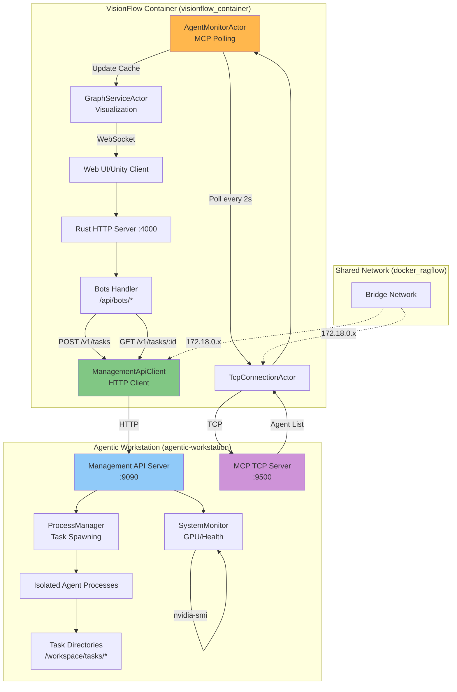

# Multi-Agent Integration Architecture

**Last Updated**: 2025-10-12
**Status**: Simplified HTTP-based Integration
**Component**: VisionFlow ↔ agentic-workstation Integration

## Overview

VisionFlow integrates with the agentic-workstation container through a simplified dual-channel architecture:

1. **Management API (HTTP :9090)**: Task orchestration, creation, and lifecycle management
2. **MCP TCP (:9500)**: Agent status monitoring and real-time updates

This replaces the previous complex Docker exec-based orchestration with clean HTTP APIs and dedicated monitoring actors.

## Architecture Diagram



## Component Details

### 1. Management API Client (Rust)

**Purpose**: HTTP client for task management operations

**Location**: To be implemented as utility service

**Interface**:
```rust
pub struct ManagementApiClient {
    base_url: String,
    api_key: String,
    http_client: reqwest::Client,
}

impl ManagementApiClient {
    /// Create a new task
    pub async fn create_task(
        &self,
        agent: &str,
        task: &str,
        provider: &str,
    ) -> Result<TaskCreated, Error> {
        // POST /v1/tasks
    }

    /// Get task status and logs
    pub async fn get_task_status(
        &self,
        task_id: &str,
    ) -> Result<TaskStatus, Error> {
        // GET /v1/tasks/:taskId
    }

    /// Stop a running task
    pub async fn stop_task(
        &self,
        task_id: &str,
    ) -> Result<(), Error> {
        // DELETE /v1/tasks/:taskId
    }

    /// Get system status
    pub async fn get_system_status(&self) -> Result<SystemStatus, Error> {
        // GET /v1/status
    }
}
```

**Authentication**:
```rust
// Bearer token from environment
let api_key = std::env::var("MANAGEMENT_API_KEY")
    .unwrap_or_else(|_| "change-this-secret-key".to_string());

// Add to all requests
headers.insert("Authorization", format!("Bearer {}", api_key));
```

### 2. Management API Server (Node.js/Fastify)

**Location**: `/multi-agent-docker/management-api/`

**Key Features**:
- Task isolation via unique directories
- Process management with proper cleanup
- System monitoring (GPU, providers, resources)
- Bearer token authentication
- Rate limiting (100 req/min)
- Structured JSON logging
- Prometheus metrics export

**Endpoints**:

#### POST /v1/tasks
Create and spawn a new isolated task.

**Request**:
```json
{
  "agent": "coder",
  "task": "Build a REST API with Express",
  "provider": "gemini"
}
```

**Response (202 Accepted)**:
```json
{
  "taskId": "550e8400-e29b-41d4-a716-446655440000",
  "status": "accepted",
  "message": "Task started successfully",
  "taskDir": "/home/devuser/workspace/tasks/550e8400-e29b-41d4-a716-446655440000",
  "logFile": "/home/devuser/logs/tasks/550e8400-e29b-41d4-a716-446655440000.log"
}
```

#### GET /v1/tasks/:taskId
Retrieve task status and log output.

**Response (200 OK)**:
```json
{
  "taskId": "550e8400-e29b-41d4-a716-446655440000",
  "agent": "coder",
  "task": "Build a REST API",
  "provider": "gemini",
  "status": "running",
  "startTime": 1704110400000,
  "exitTime": null,
  "exitCode": null,
  "duration": 45000,
  "logTail": "... last 50 lines ..."
}
```

**Status Values**:
- `running`: Task currently executing
- `completed`: Finished successfully (exitCode 0)
- `failed`: Exited with error (exitCode > 0)

#### DELETE /v1/tasks/:taskId
Stop a running task (sends SIGTERM).

**Response (200 OK)**:
```json
{
  "taskId": "550e8400-e29b-41d4-a716-446655440000",
  "status": "stopped",
  "message": "Task stop signal sent successfully"
}
```

#### GET /v1/status
System health check with GPU monitoring.

**Response (200 OK)**:
```json
{
  "timestamp": "2025-01-01T12:00:00.000Z",
  "api": {
    "uptime": 3600,
    "version": "2.1.0",
    "pid": 1234
  },
  "tasks": {
    "active": 2
  },
  "gpu": {
    "available": true,
    "gpus": [
      {
        "index": 0,
        "name": "NVIDIA RTX 4090",
        "utilization": 45.5,
        "memory": {
          "used": 8192,
          "total": 24576,
          "percentUsed": "33.33"
        },
        "temperature": 65
      }
    ]
  },
  "providers": {
    "gemini": "configured",
    "openai": "configured",
    "claude": "configured"
  }
}
```

### 3. Agent Monitor Actor

**Purpose**: Poll MCP TCP for agent status updates (read-only)

**Location**: `/src/actors/claude_flow_actor.rs` (to be renamed)

**Responsibilities**:
- Establish TCP connection to agentic-workstation:9500
- Poll agent list every 2 seconds
- Update local agent cache
- Send updates to GraphService for visualization
- NO task management (delegated to Management API)

**Key Changes**:
- Renamed from ClaudeFlowActor to AgentMonitorActor (conceptually)
- Removed task spawning logic
- Simplified to pure monitoring
- Connects to `agentic-workstation` hostname

**Configuration**:
```rust
let host = std::env::var("MCP_HOST")
    .unwrap_or_else(|_| "agentic-workstation".to_string());
let port = std::env::var("MCP_TCP_PORT")
    .unwrap_or_else(|_| "9500".to_string())
    .parse::<u16>()
    .unwrap_or(9500);
```

**Polling Flow**:
```rust
// Every 2 seconds
async fn poll_agents(&mut self) {
    // Call MCP method via JsonRpcClient
    let response = self.jsonrpc_client.call_tool(
        "hive-mind",
        "list-agents",
        json!({}),
    ).await;

    // Parse agent list
    let agents = parse_agent_list(response);

    // Update cache and notify graph service
    self.update_agent_cache(agents);
    self.graph_service.do_send(UpdateAgentCache { agents });
}
```

## Task Isolation

Each task spawned via Management API runs in complete isolation:

**Directory Structure**:
```
/home/devuser/workspace/tasks/{taskId}/
  ├── .db files (SQLite databases - isolated)
  ├── generated code
  ├── task artifacts
  └── (working directory for agentic-flow)

/home/devuser/logs/tasks/{taskId}.log
  └── stdout/stderr output
```

**Benefits**:
- No database locking conflicts
- Clean separation between concurrent tasks
- Easy cleanup and archival
- Independent execution environments

## Network Configuration

**Docker Network**: `docker_ragflow` (bridge)

**Container Hostnames**:
- VisionFlow: `visionflow_container`
- Agentic Flow: `agentic-workstation`

**Environment Variables**:
```bash
# In VisionFlow container
MCP_HOST=agentic-workstation
MCP_TCP_PORT=9500
MANAGEMENT_API_URL=http://agentic-workstation:9090
MANAGEMENT_API_KEY=secure-token-here

# In agentic-workstation container
MANAGEMENT_API_PORT=9090
MANAGEMENT_API_HOST=0.0.0.0
MANAGEMENT_API_KEY=secure-token-here
```

## Integration Flow Examples

### Example 1: Create Task from Web UI

```
1. User clicks "Spawn Agent" in web UI
2. Frontend sends POST to /api/bots/spawn
3. BotsHandler receives request
4. ManagementApiClient calls POST /v1/tasks on agentic-workstation:9090
5. Management API spawns isolated process
6. Returns task ID to frontend
7. Frontend polls GET /v1/tasks/:id for status updates
8. AgentMonitorActor polls MCP TCP for agent status
9. Graph visualization updates in real-time
```

### Example 2: Monitor Active Agents

```
1. AgentMonitorActor timer fires (every 2s)
2. Sends MCP "list-agents" request via TcpConnectionActor
3. MCP server returns current agent list
4. AgentMonitorActor updates local cache
5. Sends UpdateAgentCache to GraphService
6. GraphService broadcasts via WebSocket to connected clients
7. Web UI updates node colors and status
```

## Migration from Old Architecture

### Removed Components

| Old Component | Replacement |
|---------------|-------------|
| DockerHiveMind | ManagementApiClient (HTTP) |
| McpSessionBridge | Direct Management API calls |
| SessionCorrelationBridge | Task isolation in Management API |
| Docker exec commands | HTTP REST endpoints |
| ClaudeFlowActor (task spawning) | Management API + AgentMonitorActor |

### Key Improvements

1. **Cleaner Separation**: Task management (HTTP) vs monitoring (MCP TCP)
2. **Better Isolation**: Dedicated task directories prevent conflicts
3. **Simpler Protocol**: HTTP/JSON vs Docker exec command strings
4. **Enhanced Security**: Bearer tokens, rate limiting, authentication
5. **Better Observability**: Structured logs, metrics, health endpoints
6. **Easier Testing**: HTTP mocking vs Docker container mocking

## Security Considerations

### Authentication
- Bearer token authentication on Management API
- API key rotation supported via environment variable
- No authentication required on MCP TCP (internal network only)

### Network Security
- Both services on internal Docker network only
- Not exposed to host network by default
- Rate limiting on Management API (100 req/min)

### Process Isolation
- Each task runs in isolated directory
- Separate log files per task
- Resource limits enforced by process manager

## Error Handling

### Management API Errors

**Connection Failure**:
```rust
// Retry with exponential backoff
let response = retry(|| {
    client.create_task(agent, task, provider)
}, 3, Duration::from_secs(2)).await?;
```

**Task Not Found**:
```json
{
  "error": "Not Found",
  "message": "Task 550e8400-... not found",
  "statusCode": 404
}
```

**Rate Limit Exceeded**:
```json
{
  "error": "Too Many Requests",
  "message": "Rate limit exceeded",
  "statusCode": 429
}
```

### MCP TCP Errors

**Connection Lost**:
- TcpConnectionActor auto-reconnects with exponential backoff
- AgentMonitorActor continues with stale cache
- Graph UI shows disconnected state

**Timeout**:
- 30-second timeout on MCP requests
- Fallback to cached agent data
- Log warning and continue polling

## Performance Characteristics

### Management API
- **Latency**: 10-50ms for task creation (local network)
- **Throughput**: 100 requests/minute per client (rate limited)
- **Concurrent Tasks**: Limited by system resources (CPU/memory)

### MCP TCP Monitoring
- **Polling Interval**: 2 seconds (configurable)
- **Latency**: 5-20ms per poll (local network)
- **Data Size**: ~1-5KB per agent list response

## Monitoring and Observability

### Logs

**Management API**:
```
/home/devuser/logs/management-api.log (JSON structured)
/home/devuser/logs/tasks/{taskId}.log (task output)
```

**VisionFlow**:
```
Standard Rust logs via env_logger
MCP connection events logged by TcpConnectionActor
```

### Metrics

**Prometheus Endpoint**: `http://agentic-workstation:9090/metrics`

**Key Metrics**:
- `http_requests_total{method, route, status}` - HTTP request counts
- `http_request_duration_seconds` - Request latency histogram
- `active_tasks_count` - Current active tasks
- `task_errors_total{type}` - Task failure counts
- `api_uptime_seconds` - Service uptime

## Testing Strategy

### Unit Tests
- ManagementApiClient: Mock HTTP responses
- AgentMonitorActor: Mock TcpConnectionActor
- ProcessManager: Test task spawning/cleanup

### Integration Tests
- End-to-end task creation and monitoring
- Error handling and retry logic
- Network failure scenarios

### Load Tests
- Concurrent task spawning
- High-frequency polling
- Rate limit validation

## Future Enhancements

### Planned Features
1. **Task Streaming**: Server-Sent Events for real-time log streaming
2. **Task Metrics**: Per-task resource usage tracking
3. **Task Prioritization**: Queue management for concurrent tasks
4. **Task Dependencies**: Chain tasks with dependencies
5. **Webhook Support**: Notify external systems on task completion

### Performance Optimizations
1. **Connection Pooling**: Reuse HTTP connections
2. **Batch Operations**: Create multiple tasks in one request
3. **Caching**: Cache system status for faster responses
4. **Compression**: gzip response compression

## References

- [Management API README](/multi-agent-docker/management-api/README.md)
- [Server Architecture](/docs/architecture/core/server.md)
- [MCP Protocol Specification](https://modelcontextprotocol.io/)
- [Docker Networking](https://docs.docker.com/network/)

---

**Status**: This architecture is currently being implemented as part of the VisionFlow refactoring to simplify multi-agent integration.
