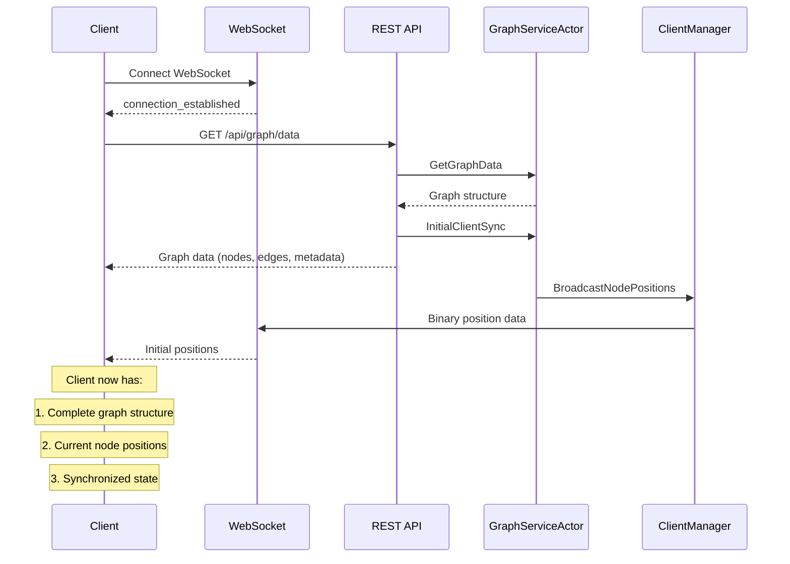

# Unified REST-WebSocket Initialization Flow

## Overview

The unified initialization flow creates a clean, atomic initialization process where REST handles data retrieval and triggers WebSocket state synchronization. This eliminates race conditions and ensures reliable client initialization.

## Architecture

### Components

1. **REST Endpoint**: `/api/graph/data`
   - Returns complete graph structure (nodes, edges, metadata)
   - Triggers WebSocket broadcast via `InitialClientSync` message
   - Provides client identification for tracking

2. **WebSocket Handler**: Simplified initialization
   - Handles connection establishment
   - Responds to `requestInitialData` with guidance to use REST endpoint
   - Continues handling normal position updates

3. **GraphServiceActor**: Coordination hub
   - Processes `InitialClientSync` messages
   - Manages position broadcasting to all connected clients
   - Maintains client state synchronization

## Flow Sequence



## Message Types

### InitialClientSync

```rust
#[derive(Message)]
#[rtype(result = "Result<(), String>")]
pub struct InitialClientSync {
    pub client_identifier: String, // IP address or session ID
    pub trigger_source: String,    // "rest_api", "websocket", etc.
}
```

### Usage in REST Handler

```rust
pub async fn get_graph_data(state: web::Data<AppState>, req: HttpRequest) -> impl Responder {
    // ... get graph data ...
    
    // Trigger WebSocket broadcast for initial client synchronization
    let client_identifier = req.peer_addr()
        .map(|addr| addr.to_string())
        .unwrap_or_else(|| "unknown".to_string());
    
    let sync_msg = InitialClientSync {
        client_identifier: client_identifier.clone(),
        trigger_source: "rest_api".to_string(),
    };
    
    state.graph_service_addr.try_send(sync_msg)?;
    // ... return response ...
}
```

## Benefits

### Atomic Initialization
- Single point of coordination through REST endpoint
- Guaranteed order: graph structure first, then positions
- No race conditions between data loading and position updates

### Clean Separation of Concerns
- REST: Data retrieval and structure
- WebSocket: Real-time position updates
- Actor System: State coordination

### Simplified Client Logic
```javascript
// Before: Complex WebSocket initialization
websocket.send(JSON.stringify({type: 'requestInitialData'}));
// Wait for various responses, handle timing issues...

// After: Simple unified flow
const graphData = await fetch('/api/graph/data').then(r => r.json());
// WebSocket automatically receives position updates
```

### Improved Reliability
- Eliminates settled/unsettled position coordination complexity  
- Consistent initialization regardless of client connection timing
- Automatic synchronization for all connected clients

## Implementation Details

### REST Endpoint Changes
- Added `HttpRequest` parameter to capture client identifier
- Added `InitialClientSync` message sending after successful data retrieval
- Maintains backward compatibility with existing API

### WebSocket Handler Simplification  
- Removed complex `requestInitialData` logic
- Now provides guidance to use REST endpoint first
- Simplified to focus on real-time updates

### GraphServiceActor Enhancement
- Added `InitialClientSync` message handler
- Broadcasts current positions to all clients when triggered
- Maintains existing `ForcePositionBroadcast` functionality

## Client Integration

### Recommended Client Flow
```javascript
class UnifiedGraphClient {
    async initialize() {
        // 1. Connect WebSocket first
        await this.connectWebSocket();
        
        // 2. Fetch graph structure via REST (triggers position broadcast)
        const graphData = await this.fetchGraphData();
        
        // 3. WebSocket automatically receives initial positions
        // 4. Continue with normal operation
        
        return graphData;
    }
    
    async fetchGraphData() {
        const response = await fetch('/api/graph/data');
        return await response.json();
    }
}
```

### Migration from Legacy Flow
- Remove WebSocket `requestInitialData` calls
- Add REST `/api/graph/data` call after WebSocket connection
- Remove manual position synchronization logic

## Error Handling

### REST Endpoint Failures
- If `InitialClientSync` sending fails, logs warning but doesn't fail request
- Client still receives graph data from REST response
- WebSocket may not receive initial positions (graceful degradation)

### WebSocket Disconnections  
- Client reconnection follows same unified flow
- REST call triggers fresh position broadcast
- No special reconnection logic needed

### Actor System Failures
- `InitialClientSync` uses `try_send` to avoid blocking
- Existing `ForcePositionBroadcast` remains as fallback
- System continues operating with reduced functionality

## Testing Recommendations

### Unit Tests
- Test `InitialClientSync` message handling in GraphServiceActor
- Verify REST endpoint triggers WebSocket broadcast
- Check WebSocket handler provides correct guidance

### Integration Tests  
- Test complete client initialization flow
- Verify position synchronization across multiple clients
- Test error conditions and graceful degradation

### Load Testing
- Multiple concurrent client initializations
- WebSocket broadcast performance with many clients
- REST endpoint performance under load

## Monitoring and Observability

### Logs
- REST endpoint logs client identifiers and sync triggers
- GraphServiceActor logs broadcast completions
- WebSocket handler logs simplified responses

### Metrics
- Track `InitialClientSync` message frequency
- Monitor WebSocket broadcast latency
- Measure REST endpoint response times

## Future Enhancements

### Client-Specific Synchronization
- Track individual client synchronization state
- Send targeted updates instead of broadcast to all
- Implement client session management

### Advanced Error Recovery
- Retry mechanisms for failed synchronization
- Client state validation and correction
- Automatic resynchronization on detected drift

### Performance Optimizations
- Batch multiple client synchronization requests
- Implement position update deduplication  
- Add compression for large graph structures

## Conclusion

The unified REST-WebSocket initialization flow provides a robust, atomic, and maintainable approach to client initialization. It eliminates complex timing coordination while maintaining full backward compatibility and providing clear separation of concerns between data retrieval and real-time updates.