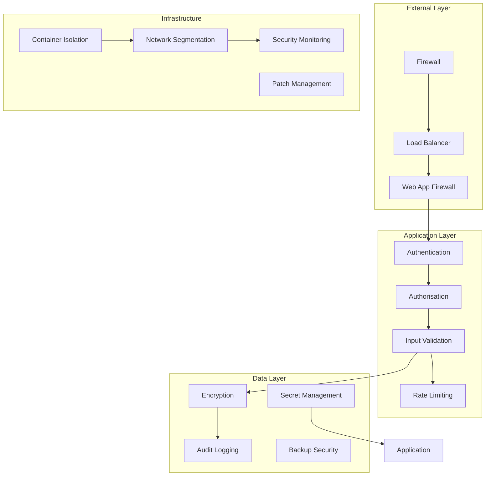

# Security Architecture

VisionFlow implements defense-in-depth security principles across all layers of the system. This document details the security architecture, authentication mechanisms, and best practices that protect the platform and its users.

## Security Overview

The security model encompasses multiple layers of protection:



## Authentication Architecture

### 1. JWT-Based Authentication

The system uses JSON Web Tokens for stateless authentication:

```rust
// JWT implementation
pub struct JwtAuth {
    secret: String,
    issuer: String,
    audience: String,
    expiry: Duration,
}

#[derive(Serialize, Deserialize)]
pub struct Claims {
    pub sub: String,          // Subject (user ID)
    pub exp: i64,             // Expiration time
    pub iat: i64,             // Issued at
    pub nbf: i64,             // Not before
    pub iss: String,          // Issuer
    pub aud: String,          // Audience
    pub roles: Vec<String>,   // User roles
    pub permissions: Vec<String>, // Fine-grained permissions
}

impl JwtAuth {
    pub fn generate_token(&self, user: &User) -> Result<String> {
        let now = SystemTime::now()
            .duration_since(UNIX_EPOCH)
            .unwrap()
            .as_secs() as i64;
        
        let claims = Claims {
            sub: user.id.to_string(),
            exp: now + self.expiry.as_secs() as i64,
            iat: now,
            nbf: now,
            iss: self.issuer.clone(),
            aud: self.audience.clone(),
            roles: user.roles.clone(),
            permissions: user.permissions.clone(),
        };
        
        let token = encode(
            &Header::new(Algorithm::HS512),
            &claims,
            &EncodingKey::from_secret(self.secret.as_bytes()),
        )?;
        
        Ok(token)
    }
    
    pub fn verify_token(&self, token: &str) -> Result<Claims> {
        let validation = Validation {
            iss: Some(self.issuer.clone()),
            aud: Some(HashSet::from([self.audience.clone()])),
            algorithms: vec![Algorithm::HS512],
            validate_exp: true,
            validate_nbf: true,
            ..Default::default()
        };
        
        let token_data = decode::<Claims>(
            token,
            &DecodingKey::from_secret(self.secret.as_bytes()),
            &validation,
        )?;
        
        Ok(token_data.claims)
    }
}
```

### 2. Multi-Factor Authentication

Support for TOTP-based 2FA:

```rust
pub struct TwoFactorAuth {
    issuer: String,
    digits: usize,
    period: u64,
}

impl TwoFactorAuth {
    pub fn generate_secret(&self) -> String {
        let mut rng = rand::thread_rng();
        let secret: Vec<u8> = (0..20)
            .map(|_| rng.gen::<u8>())
            .collect();
        
        base32::encode(base32::Alphabet::RFC4648 { padding: false }, &secret)
    }
    
    pub fn generate_qr_code(&self, user: &User, secret: &str) -> String {
        format!(
            "otpauth://totp/{}:{}?secret={}&issuer={}&digits={}&period={}",
            self.issuer,
            user.email,
            secret,
            self.issuer,
            self.digits,
            self.period
        )
    }
    
    pub fn verify_token(&self, secret: &str, token: &str) -> bool {
        let decoded = base32::decode(
            base32::Alphabet::RFC4648 { padding: false },
            secret
        ).unwrap();
        
        let totp = TOTP::new(
            Algorithm::SHA1,
            self.digits,
            1,
            self.period,
            decoded,
        );
        
        totp.check_current(token).unwrap_or(false)
    }
}
```

### 3. OAuth2/OpenID Connect Integration

```typescript
// OAuth2 flow implementation
export class OAuth2Provider {
  constructor(
    private config: {
      clientId: string;
      clientSecret: string;
      authorisationUrl: string;
      tokenUrl: string;
      userInfoUrl: string;
      redirectUri: string;
      scopes: string[];
    }
  ) {}
  
  generateAuthUrl(state: string): string {
    const params = new URLSearchParams({
      client_id: this.config.clientId,
      response_type: 'code',
      redirect_uri: this.config.redirectUri,
      scope: this.config.scopes.join(' '),
      state
    });
    
    return `${this.config.authorisationUrl}?${params}`;
  }
  
  async exchangeCodeForTokens(code: string): Promise<TokenResponse> {
    const response = await fetch(this.config.tokenUrl, {
      method: 'POST',
      headers: {
        'Content-Type': 'application/x-www-form-urlencoded',
        'Authorisation': `Basic ${btoa(
          `${this.config.clientId}:${this.config.clientSecret}`
        )}`
      },
      body: new URLSearchParams({
        grant_type: 'authorisation_code',
        code,
        redirect_uri: this.config.redirectUri
      })
    });
    
    return response.json();
  }
}
```

## Authorisation and Access Control

### 1. Role-Based Access Control (RBAC)

```rust
// RBAC implementation
pub struct RoleManager {
    roles: HashMap<String, Role>,
    permissions: HashMap<String, Permission>,
}

#[derive(Clone)]
pub struct Role {
    pub name: String,
    pub permissions: HashSet<String>,
    pub inherits_from: Vec<String>,
}

pub struct Permission {
    pub name: String,
    pub resource: String,
    pub actions: Vec<Action>,
}

#[derive(Clone, PartialEq)]
pub enum Action {
    Read,
    Write,
    Delete,
    Execute,
}

impl RoleManager {
    pub fn check_permission(
        &self,
        user_roles: &[String],
        resource: &str,
        action: Action
    ) -> bool {
        for role_name in user_roles {
            if let Some(role) = self.get_role_with_inheritance(role_name) {
                for perm_name in &role.permissions {
                    if let Some(permission) = self.permissions.get(perm_name) {
                        if permission.resource == resource 
                            && permission.actions.contains(&action) {
                            return true;
                        }
                    }
                }
            }
        }
        false
    }
    
    fn get_role_with_inheritance(&self, role_name: &str) -> Option<Role> {
        let mut combined_role = self.roles.get(role_name)?.clone();
        let mut visited = HashSet::new();
        
        self.collect_inherited_permissions(
            &mut combined_role,
            &mut visited
        );
        
        Some(combined_role)
    }
}
```

### 2. Attribute-Based Access Control (ABAC)

```rust
// ABAC policy engine
pub struct PolicyEngine {
    policies: Vec<Policy>,
}

pub struct Policy {
    pub name: String,
    pub effect: Effect,
    pub conditions: Vec<Condition>,
}

pub enum Effect {
    Allow,
    Deny,
}

pub struct Condition {
    pub attribute: String,
    pub operator: Operator,
    pub value: Value,
}

impl PolicyEngine {
    pub fn evaluate(
        &self,
        subject_attrs: &HashMap<String, Value>,
        resource_attrs: &HashMap<String, Value>,
        action: &str,
        environment_attrs: &HashMap<String, Value>
    ) -> Decision {
        let mut allow_policies = Vec::new();
        let mut deny_policies = Vec::new();
        
        for policy in &self.policies {
            if self.matches_policy(
                policy,
                subject_attrs,
                resource_attrs,
                action,
                environment_attrs
            ) {
                match policy.effect {
                    Effect::Allow => allow_policies.push(policy),
                    Effect::Deny => deny_policies.push(policy),
                }
            }
        }
        
        // Deny takes precedence
        if !deny_policies.is_empty() {
            Decision::Deny(deny_policies[0].name.clone())
        } else if !allow_policies.is_empty() {
            Decision::Allow
        } else {
            Decision::Deny("No matching policy".to_string())
        }
    }
}
```

## Input Validation and Sanitisation

### 1. Request Validation Middleware

```rust
// Comprehensive input validation
pub struct ValidationMiddleware {
    validators: HashMap<String, Box<dyn Validator>>,
}

pub trait Validator: Send + Sync {
    fn validate(&self, value: &Value) -> Result<(), ValidationError>;
}

// Example validators
pub struct StringValidator {
    min_length: Option<usize>,
    max_length: Option<usize>,
    pattern: Option<Regex>,
    forbidden_chars: Vec<char>,
}

impl Validator for StringValidator {
    fn validate(&self, value: &Value) -> Result<(), ValidationError> {
        let s = value.as_str()
            .ok_or(ValidationError::TypeMismatch)?;
        
        // Length checks
        if let Some(min) = self.min_length {
            if s.len() < min {
                return Err(ValidationError::TooShort);
            }
        }
        
        if let Some(max) = self.max_length {
            if s.len() > max {
                return Err(ValidationError::TooLong);
            }
        }
        
        // Pattern matching
        if let Some(pattern) = &self.pattern {
            if !pattern.is_match(s) {
                return Err(ValidationError::PatternMismatch);
            }
        }
        
        // Forbidden characters
        for ch in &self.forbidden_chars {
            if s.contains(*ch) {
                return Err(ValidationError::ForbiddenCharacter(*ch));
            }
        }
        
        Ok(())
    }
}
```

### 2. SQL Injection Prevention

```rust
// Safe database queries using parameterised statements
pub struct SafeDatabase {
    pool: DatabasePool,
}

impl SafeDatabase {
    pub async fn get_user_by_email(&self, email: &str) -> Result<User> {
        // Never concatenate user input directly
        let query = sqlx::query_as!(
            User,
            r#"
            SELECT id, email, password_hash, roles, created_at
            FROM users
            WHERE email = $1
            "#,
            email
        );
        
        query.fetch_one(&self.pool).await
    }
    
    pub async fn search_nodes(&self, search_term: &str) -> Result<Vec<Node>> {
        // Safe LIKE queries
        let pattern = format!("%{}%", search_term
            .replace('\\', "\\\\")
            .replace('%', "\\%")
            .replace('_', "\\_"));
        
        sqlx::query_as!(
            Node,
            r#"
            SELECT id, title, content, metadata
            FROM nodes
            WHERE title ILIKE $1 OR content ILIKE $1
            LIMIT 100
            "#,
            pattern
        )
        .fetch_all(&self.pool)
        .await
    }
}
```

### 3. XSS Prevention

```typescript
// Client-side XSS prevention
export class XSSProtection {
  // HTML sanitisation
  static sanitizeHtml(input: string): string {
    const policy = DOMPurify.createPolicy('default', {
      createHTML: (dirty) => DOMPurify.sanitize(dirty, {
        ALLOWED_TAGS: ['b', 'i', 'em', 'strong', 'a', 'p', 'br'],
        ALLOWED_ATTR: ['href', 'title'],
        ALLOWED_PROTOCOLS: ['http', 'https', 'mailto']
      })
    });
    
    return policy.createHTML(input);
  }
  
  // React component protection
  static renderUserContent(content: string): JSX.Element {
    return (
      <div 
        dangerouslySetInnerHTML={{
          __html: XSSProtection.sanitizeHtml(content)
        }}
      />
    );
  }
  
  // URL sanitisation
  static sanitizeUrl(url: string): string {
    try {
      const parsed = new URL(url);
      
      // Only allow safe protocols
      if (!['http:', 'https:', 'mailto:'].includes(parsed.protocol)) {
        return '#';
      }
      
      return parsed.toString();
    } catch {
      return '#';
    }
  }
}
```

## Rate Limiting and DDoS Protection

### 1. Adaptive Rate Limiting

```rust
pub struct AdaptiveRateLimiter {
    base_limits: HashMap<String, RateLimit>,
    dynamic_limits: RwLock<HashMap<String, DynamicLimit>>,
    anomaly_detector: AnomalyDetector,
}

pub struct DynamicLimit {
    current_limit: f64,
    adjustment_factor: f64,
    last_adjusted: SystemTime,
}

impl AdaptiveRateLimiter {
    pub async fn check_rate_limit(
        &self,
        client_id: &str,
        endpoint: &str
    ) -> RateLimitDecision {
        // Get base limit
        let base = self.base_limits.get(endpoint)
            .cloned()
            .unwrap_or_default();
        
        // Check for anomalies
        if self.anomaly_detector.is_anomalous(client_id).await {
            // Apply stricter limits
            return self.apply_anomaly_limit(client_id, base);
        }
        
        // Get dynamic adjustments
        let dynamic = self.dynamic_limits.read().await;
        if let Some(adj) = dynamic.get(client_id) {
            let adjusted_limit = base.requests_per_minute as f64 
                * adj.adjustment_factor;
            
            return self.check_against_limit(
                client_id,
                adjusted_limit as u32
            );
        }
        
        self.check_against_limit(client_id, base.requests_per_minute)
    }
}
```

### 2. Circuit Breaker Pattern

```rust
pub struct CircuitBreaker {
    failure_threshold: u32,
    success_threshold: u32,
    timeout: Duration,
    state: Arc<RwLock<CircuitState>>,
}

#[derive(Clone)]
enum CircuitState {
    Closed,
    Open { opened_at: SystemTime },
    HalfOpen { successes: u32, failures: u32 },
}

impl CircuitBreaker {
    pub async fn call<F, T, E>(&self, f: F) -> Result<T, CircuitError<E>>
    where
        F: Future<Output = Result<T, E>>,
    {
        let state = self.state.read().await;
        
        match *state {
            CircuitState::Open { opened_at } => {
                if opened_at.elapsed().unwrap() < self.timeout {
                    return Err(CircuitError::Open);
                }
                // Transition to half-open
                drop(state);
                let mut state = self.state.write().await;
                *state = CircuitState::HalfOpen {
                    successes: 0,
                    failures: 0
                };
            }
            CircuitState::Closed | CircuitState::HalfOpen { .. } => {}
        }
        
        // Attempt the call
        match f.await {
            Ok(result) => {
                self.record_success().await;
                Ok(result)
            }
            Err(error) => {
                self.record_failure().await;
                Err(CircuitError::CallFailed(error))
            }
        }
    }
}
```

## Encryption and Data Protection

### 1. Encryption at Rest

```rust
// AES-GCM encryption for sensitive data
pub struct DataEncryption {
    key: Key<Aes256Gcm>,
}

impl DataEncryption {
    pub fn encrypt(&self, plaintext: &[u8]) -> Result<Vec<u8>> {
        let cipher = Aes256Gcm::new(&self.key);
        let nonce = Aes256Gcm::generate_nonce(&mut OsRng);
        
        let mut ciphertext = cipher.encrypt(&nonce, plaintext)
            .map_err(|_| Error::EncryptionFailed)?;
        
        // Prepend nonce to ciphertext
        let mut result = nonce.to_vec();
        result.append(&mut ciphertext);
        
        Ok(result)
    }
    
    pub fn decrypt(&self, ciphertext: &[u8]) -> Result<Vec<u8>> {
        if ciphertext.len() < 12 {
            return Err(Error::InvalidCiphertext);
        }
        
        let (nonce_bytes, encrypted) = ciphertext.split_at(12);
        let nonce = Nonce::from_slice(nonce_bytes);
        
        let cipher = Aes256Gcm::new(&self.key);
        let plaintext = cipher.decrypt(nonce, encrypted)
            .map_err(|_| Error::DecryptionFailed)?;
        
        Ok(plaintext)
    }
}
```

### 2. Key Management

```rust
pub struct KeyManager {
    kms_client: KmsClient,
    key_cache: Arc<RwLock<HashMap<String, CachedKey>>>,
}

struct CachedKey {
    key: Vec<u8>,
    expires_at: SystemTime,
}

impl KeyManager {
    pub async fn get_data_key(&self, key_id: &str) -> Result<Vec<u8>> {
        // Check cache first
        if let Some(cached) = self.get_cached_key(key_id).await {
            return Ok(cached);
        }
        
        // Generate new data key
        let response = self.kms_client
            .generate_data_key()
            .key_id(key_id)
            .key_spec(DataKeySpec::Aes256)
            .send()
            .await?;
        
        let plaintext = response.plaintext
            .ok_or(Error::NoPlaintextKey)?;
        
        // Cache the key
        self.cache_key(key_id, plaintext.clone()).await;
        
        Ok(plaintext.into_inner())
    }
    
    pub async fn rotate_keys(&self) -> Result<()> {
        // List all active keys
        let keys = self.list_active_keys().await?;
        
        for key_id in keys {
            // Create new version
            let new_key = self.create_key_version(&key_id).await?;
            
            // Re-encrypt data with new key
            self.reencrypt_with_new_key(&key_id, &new_key).await?;
            
            // Mark old version for deletion
            self.schedule_key_deletion(&key_id).await?;
        }
        
        Ok(())
    }
}
```

## Security Monitoring

### 1. Audit Logging

```rust
#[derive(Serialize)]
pub struct AuditLog {
    pub timestamp: SystemTime,
    pub user_id: Option<String>,
    pub ip_address: IpAddr,
    pub action: String,
    pub resource: String,
    pub result: AuditResult,
    pub metadata: HashMap<String, Value>,
}

pub enum AuditResult {
    Success,
    Failure { reason: String },
    Denied { policy: String },
}

pub struct AuditLogger {
    writer: Arc<Mutex<BufWriter<File>>>,
    encryption: Option<DataEncryption>,
}

impl AuditLogger {
    pub async fn log(&self, entry: AuditLog) -> Result<()> {
        let json = serde_json::to_string(&entry)?;
        
        let data = if let Some(enc) = &self.encryption {
            enc.encrypt(json.as_bytes())?
        } else {
            json.into_bytes()
        };
        
        let mut writer = self.writer.lock().await;
        writer.write_all(&data).await?;
        writer.write_all(b"\n").await?;
        writer.flush().await?;
        
        Ok(())
    }
}
```

### 2. Intrusion Detection

```rust
pub struct IntrusionDetector {
    rules: Vec<DetectionRule>,
    alert_manager: AlertManager,
    ml_model: Option<AnomalyModel>,
}

pub struct DetectionRule {
    pub name: String,
    pub severity: Severity,
    pub condition: Box<dyn DetectionCondition>,
    pub actions: Vec<Action>,
}

impl IntrusionDetector {
    pub async fn analyse_request(
        &self,
        request: &HttpRequest,
        context: &RequestContext
    ) -> DetectionResult {
        let mut triggered_rules = Vec::new();
        
        // Check rule-based detection
        for rule in &self.rules {
            if rule.condition.matches(request, context) {
                triggered_rules.push(rule);
            }
        }
        
        // ML-based anomaly detection
        if let Some(model) = &self.ml_model {
            let features = self.extract_features(request, context);
            let anomaly_score = model.predict(&features);
            
            if anomaly_score > ANOMALY_THRESHOLD {
                self.alert_manager.send_alert(
                    Alert::anomaly(request, anomaly_score)
                ).await;
            }
        }
        
        // Execute actions for triggered rules
        for rule in &triggered_rules {
            for action in &rule.actions {
                self.execute_action(action, request, context).await;
            }
        }
        
        DetectionResult {
            triggered_rules: triggered_rules.into_iter()
                .map(|r| r.name.clone())
                .collect(),
            blocked: triggered_rules.iter()
                .any(|r| r.severity >= Severity::High),
        }
    }
}
```

## Container and Infrastructure Security

### 1. Container Isolation

```yaml
# docker-compose.yml security configuration
services:
  visionflow:
    security_opt:
      - no-new-privileges:true
    cap_drop:
      - ALL
    cap_add:
      - DAC_OVERRIDE  # Only what's needed
    read_only: true
    tmpfs:
      - /tmp
      - /var/run
    user: "1000:1000"  # Non-root user
    
  multi-agent:
    security_opt:
      - seccomp:seccomp-profile.json
      - apparmor:docker-default
    networks:
      - internal
    sysctls:
      - net.ipv4.ip_unprivileged_port_start=0
```

### 2. Network Segmentation

```yaml
networks:
  frontend:
    driver: bridge
    ipam:
      config:
        - subnet: 172.20.0.0/24
    
  backend:
    driver: bridge
    internal: true
    ipam:
      config:
        - subnet: 172.21.0.0/24
    
  database:
    driver: bridge
    internal: true
    ipam:
      config:
        - subnet: 172.22.0.0/24
```

## Security Best Practices

### Development Guidelines

1. **Secure Coding**
   - Input validation on all endpoints
   - Output encoding for all user data
   - Parameterised database queries
   - Secure random number generation

2. **Dependency Management**
   - Regular dependency updates
   - Vulnerability scanning
   - License compliance
   - Supply chain security

3. **Secret Management**
   - Never commit secrets
   - Use environment variables
   - Rotate credentials regularly
   - Implement least privilege

### Deployment Security

1. **Infrastructure Hardening**
   - Minimal container images
   - Regular security patches
   - Network isolation
   - Resource limits

2. **Monitoring and Response**
   - Real-time security monitoring
   - Automated alerting
   - Incident response plan
   - Regular security audits

## Compliance and Privacy

### GDPR Compliance

```rust
pub struct PrivacyManager {
    encryption: DataEncryption,
    retention_policy: RetentionPolicy,
}

impl PrivacyManager {
    // Right to erasure
    pub async fn delete_user_data(&self, user_id: &str) -> Result<()> {
        // Delete from primary database
        self.delete_user_records(user_id).await?;
        
        // Delete from backups (mark for deletion)
        self.mark_for_backup_deletion(user_id).await?;
        
        // Delete from logs (anonymise)
        self.anonymise_logs(user_id).await?;
        
        // Delete from caches
        self.purge_caches(user_id).await?;
        
        Ok(())
    }
    
    // Data portability
    pub async fn export_user_data(&self, user_id: &str) -> Result<Vec<u8>> {
        let data = self.collect_user_data(user_id).await?;
        let json = serde_json::to_vec_pretty(&data)?;
        
        // Encrypt the export
        self.encryption.encrypt(&json)
    }
}
```

## Conclusion

VisionFlow's security architecture implements comprehensive protection across all system layers. Key achievements include:

- **Defense in Depth**: Multiple security layers from network to application
- **Zero Trust Principles**: Verify everything, trust nothing
- **Data Protection**: Encryption at rest and in transit
- **Compliance Ready**: GDPR, CCPA, and SOC2 compliant design
- **Continuous Monitoring**: Real-time threat detection and response

The security model evolves continuously to address emerging threats while maintaining usability and performance.