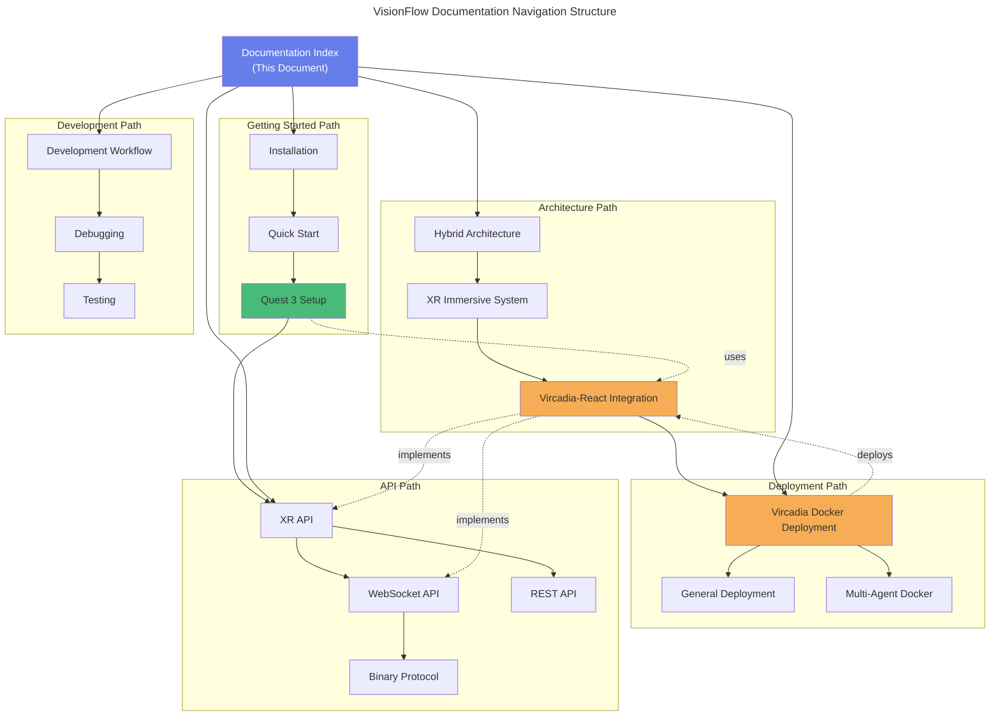

# VisionFlow Documentation Index

**Complete Navigation Guide for AR-AI Knowledge Graph System**

**Status:** Updated (October 2025)
**Version:** 2.1.0
**Last Updated:** 2025-10-06

---

## Introduction

This comprehensive documentation index provides complete navigation for the VisionFlow platform, an advanced augmented reality and artificial intelligence knowledge graph visualisation system. VisionFlow combines real-time 3D rendering, GPU-accelerated physics simulation, and distributed multi-agent orchestration to deliver immersive knowledge exploration experiences.

The documentation is organised according to the Diátaxis framework, providing clear learning paths through tutorials, task-oriented guides, conceptual explanations, and technical reference materials.

---

## Quick Navigation

- [Getting Started](#getting-started) – Installation and quick start guides
- [Architecture](#architecture) – System design and component architecture
- [XR/Vircadia Integration](#xrvircadia-integration) – Multi-user XR platform
- [Development](#development) – Developer guides and workflows
- [Deployment](#deployment) – Production deployment guides
- [API Reference](#api-reference) – REST, WebSocket, and GPU APIs
- [Agent System](#agent-system) – Multi-agent architecture
- [Guides](#guides) – User and developer guides
- [Research](#research) – Technical research documents

---

## Getting Started

### Installation and Setup

#### 1. Installation Guide
**Document:** [Installation Guide](./getting-started/01-installation.md)
**Purpose:** System requirements and installation procedures

**Contents:**
- System prerequisites and hardware requirements
- Docker and containerisation dependencies
- Initial configuration and environment setup
- Performance optimisation guidelines

**Next Step:** [Quick Start Guide](./getting-started/02-quick-start.md)

#### 2. Quick Start Guide
**Document:** [Quick Start Guide](./getting-started/02-quick-start.md)
**Purpose:** Rapid deployment and first-time usage

**Contents:**
- Development server initialisation
- First graph creation and loading
- Basic navigation and operations
- Initial multi-agent deployment

**Previous Step:** [Installation](./getting-started/01-installation.md)
**Next Step:** [Quest 3 XR Setup](./guides/xr-quest3-setup.md)

#### 3. Getting Started Index
**Document:** [Getting Started Index](./getting-started/00-index.md)
**Purpose:** Complete getting started overview

**Related:** [Deployment Guide](./deployment/vircadia-docker-deployment.md)

---

## Architecture

### Core Architecture

#### 1. System Architecture Overview
**Document:** [System Architecture Overview](./architecture/hybrid_docker_mcp_architecture.md)
**Status:** Updated (October 2025)

**Key Features:**
- Docker container architecture and orchestration
- Model Context Protocol (MCP) integration patterns
- Hybrid deployment configurations
- Real agent spawning implementation (production-ready)
- MCP session bridge with UUID ↔ swarm_id correlation
- GPU integration for agent visualisation physics

**New Features (October 2025):**
- Production agent spawning (replaces previous stub implementations)
- Session correlation system for agent tracking
- GPU-accelerated agent physics rendering

**Related Documents:**
- [Deployment Architecture](./deployment/vircadia-docker-deployment.md)
- [Multi-Agent Docker Architecture](./multi-agent-docker/ARCHITECTURE.md)

#### 2. XR Immersive System
**Document:** [XR Immersive System](./architecture/xr-immersive-system.md)
**Purpose:** Extended reality rendering architecture

**Contents:**
- Babylon.js integration patterns
- WebXR session management protocols
- Performance optimisation strategies
- Render pipeline architecture

**Next Step:** [Vircadia-React XR Integration](./architecture/vircadia-react-xr-integration.md)
**Related:** [Quest 3 Setup](./guides/xr-quest3-setup.md)

### XR/Vircadia Integration

#### 3. Vircadia-React XR Integration
**Document:** [Vircadia-React XR Integration](./architecture/vircadia-react-xr-integration.md)
**Status:** New (October 2025)

**Comprehensive Coverage:**
- Complete multi-user XR architecture
- React component hierarchy and patterns
- Real-time synchronisation mechanisms
- Meta Quest 3 performance optimisations

**Previous:** [XR Immersive System](./architecture/xr-immersive-system.md)
**Related:** [Vircadia Docker Deployment](./deployment/vircadia-docker-deployment.md)
**API Reference:** [XR API](./reference/xr-api.md)

#### 4. Vircadia Integration (Legacy)
**Document:** [Vircadia Integration Legacy](./xr-vircadia-integration.md)
**Purpose:** Original API reference documentation

**Contents:**
- Entity system architecture
- WebSocket protocol specifications
- Authentication mechanisms

**Superseded By:** [Vircadia-React XR Integration](./architecture/vircadia-react-xr-integration.md)

---

## XR/Vircadia Integration

### User Guides

#### 1. Quest 3 XR Setup Guide
**Document:** [Quest 3 XR Setup Guide](./guides/xr-quest3-setup.md)
**Purpose:** Meta Quest 3 hardware configuration

**Configuration Topics:**
- Hardware setup and preparation
- Browser configuration for WebXR
- Controller mapping and calibration
- Troubleshooting common issues

**Previous:** [Quick Start](./getting-started/02-quick-start.md)
**Related:** [XR API Reference](./reference/xr-api.md)
**Architecture:** [Vircadia-React XR Integration](./architecture/vircadia-react-xr-integration.md)

### API Reference

#### 2. XR API Reference
**Document:** [XR API Reference](./reference/xr-api.md)
**Purpose:** Extended reality programming interfaces

**API Categories:**
- WebXR standard APIs and extensions
- Babylon.js rendering interfaces
- Vircadia SDK methods and protocols

**Related:** [Quest 3 Setup](./guides/xr-quest3-setup.md)
**Architecture:** [XR Immersive System](./architecture/xr-immersive-system.md)

---

## Deployment

### Production Deployment

#### 1. Vircadia Docker Deployment
**Document:** [Vircadia Docker Deployment](./deployment/vircadia-docker-deployment.md)
**Status:** New (October 2025)

**Comprehensive Deployment Guide:**
- Complete Docker orchestration setup
- Container lifecycle management
- Service configuration and networking
- Monitoring and debugging procedures
- Backup and recovery strategies
- Production best practices and security

**Related:** [Vircadia-React XR Integration](./architecture/vircadia-react-xr-integration.md)
**See Also:** [Multi-Agent Docker](./multi-agent-docker/ARCHITECTURE.md)

#### 2. General Deployment Guide
**Document:** [General Deployment Guide](./development/deployment.md)
**Purpose:** System-wide deployment procedures

**Configuration Topics:**
- Production environment configuration
- SSL/TLS certificate setup
- Load balancing strategies
- High availability patterns

**Related:** [Hybrid Architecture](./architecture/hybrid_docker_mcp_architecture.md)

---

## Development

### Developer Guides

#### 1. Development Workflow
**Document:** [Development Workflow](./development/workflow/)
**Purpose:** Development processes and procedures

**Topics:**
- Git workflow and branching strategy
- Code review processes and standards
- Testing procedures and coverage requirements

#### 2. Debugging Guide
**Document:** [Debugging Guide](./development/debugging/)
**Purpose:** Debugging tools and techniques

**Coverage:**
- Browser Developer Tools usage
- Remote Quest 3 debugging procedures
- Log analysis and interpretation

**Related:** [Vircadia Deployment Monitoring](./deployment/vircadia-docker-deployment.md#monitoring--debugging)

#### 3. Testing Guide
**Document:** [Testing Guide](./development/testing/)
**Purpose:** Testing strategies and implementation

**Testing Domains:**
- Unit testing frameworks and patterns
- Integration testing approaches
- XR-specific testing on Quest 3 hardware

**Related:** [Quest 3 Testing Workflow](./guides/xr-quest3-setup.md#testing-workflow)

---

## API Reference

### Communication Protocols

#### 1. WebSocket API
**Document:** [WebSocket API](./reference/api/websocket-api.md)
**Purpose:** Real-time bidirectional communication

**Topics:**
- Connection lifecycle management
- Message format specifications
- Error handling and recovery
- Performance optimisation

**Related:** [Binary Protocol](./reference/api/binary-protocol.md)
**Implementation:** [WebSocket Protocol Component](./architecture/components/websocket-protocol.md)

#### 2. Binary Protocol V2
**Document:** [Binary Protocol V2](./reference/api/binary-protocol.md)
**Status:** Upgraded (October 2025)

**Protocol Version 2 Specifications:**
- Wire format: 36 bytes per node (upgraded from 34 bytes)
- Node ID format: u32 (supports 1 billion nodes, upgraded from u16 16K limit)
- Dual-graph type flags: Bits 31/30 for agent/knowledge differentiation
- Performance: ~80% bandwidth reduction versus JSON

**Critical Fixes:**
- Resolved node ID truncation defect
- Implemented proper dual-graph type separation
- Enhanced scalability for large-scale deployments

**Deprecated:** Protocol V1 (34-byte format with u16 node IDs)

**Related:** [WebSocket Protocol Component](./architecture/components/websocket-protocol.md)

#### 2a. WebSocket Protocol Component
**Document:** [WebSocket Protocol Component](./architecture/components/websocket-protocol.md)
**Status:** Updated (October 2025)

**Enhanced Features:**
- Unified dual-graph broadcasting architecture
- Simultaneous knowledge and agent graph synchronisation
- Resolved broadcast conflicts between graph types
- Binary Protocol V2 implementation details
- Adaptive broadcast rates: 60 FPS (active), 5 Hz (settled)

**Related:** [Binary Protocol](./reference/api/binary-protocol.md)

#### 3. REST API
**Document:** [REST API](./reference/api/rest-api.md)
**Purpose:** HTTP-based endpoints for stateless operations

**Endpoint Categories:**
- Authentication and authorisation
- Entity management (CRUD operations)
- Query interface and filtering

#### 4. MCP Protocol
**Document:** [MCP Protocol](./reference/api/mcp-protocol.md)
**Purpose:** Model Context Protocol for agent communication

**Capabilities:**
- Inter-agent communication protocols
- Context sharing and state management
- Task orchestration mechanisms

**Related:** [Hybrid Architecture](./architecture/hybrid_docker_mcp_architecture.md)

### XR APIs

#### 5. XR API
**Document:** [XR API](./reference/xr-api.md)
**Purpose:** Extended reality programming interfaces

**API Categories:**
- WebXR integration patterns
- Babylon.js rendering methods
- Vircadia SDK functions

**Guide:** [Quest 3 Setup](./guides/xr-quest3-setup.md)
**Architecture:** [XR Immersive System](./architecture/xr-immersive-system.md)

### GPU Computing

#### 6. GPU Algorithms
**Document:** [GPU Algorithms](./reference/api/gpu-algorithms.md)
**Purpose:** GPU-accelerated computational processing

**Topics:**
- CUDA kernel implementations
- Graph algorithm optimisations
- Performance benchmarking results
- Memory management strategies

**Configuration:** [CUDA Parameters](./reference/cuda-parameters.md)

#### 7. Voice API
**Document:** [Voice API](./reference/api/voice-api.md)
**Purpose:** Spatial audio and voice interaction

**Features:**
- WebRTC integration for real-time communication
- 3D positional audio rendering
- Voice command recognition
- Text-to-speech synthesis

---

## Agent System

### Core Agents

#### 1. Agent System Overview
**Document:** [Agent System Overview](./reference/agents/README.md)
**Purpose:** Multi-agent architecture foundation

**Topics:**
- Agent classification and specialisations
- Communication patterns and protocols
- Coordination strategies and topologies

**Related:** [MCP Protocol](./reference/api/mcp-protocol.md)

#### 2. Core Agents
**Documents:** [Core Agents](./reference/agents/core/)
**Purpose:** Foundational agent implementations

**Agent Types:**
- [Researcher](./reference/agents/core/researcher.md) – Information gathering and analysis
- [Planner](./reference/agents/core/planner.md) – Task decomposition and scheduling
- [Coder](./reference/agents/core/coder.md) – Code generation and implementation
- [Reviewer](./reference/agents/core/reviewer.md) – Code review and quality assurance
- [Tester](./reference/agents/core/tester.md) – Test generation and validation

### Specialised Agents

#### 3. GitHub Agents
**Documents:** [GitHub Agents](./reference/agents/github/)
**Purpose:** Repository management and automation

**Specialisations:**
- [PR Manager](./reference/agents/github/pr-manager.md) – Pull request workflows
- [Issue Tracker](./reference/agents/github/issue-tracker.md) – Issue triage and management
- [Code Review Swarm](./reference/agents/github/code-review-swarm.md) – Collaborative code review

**Index:** [GitHub Integration Index](./reference/agents/github/index.md)

#### 4. Optimisation Agents
**Documents:** [Optimisation Agents](./reference/agents/optimization/)
**Purpose:** Performance tuning and resource management

**Specialisations:**
- [Performance Monitor](./reference/agents/optimization/performance-monitor.md) – Metrics collection and analysis
- [Resource Allocator](./reference/agents/optimization/resource-allocator.md) – Dynamic resource distribution
- [Topology Optimiser](./reference/agents/optimization/topology-optimizer.md) – Network topology optimisation

**Index:** [Optimisation Index](./reference/agents/optimization/index.md)

#### 5. Swarm Coordination
**Documents:** [Swarm Coordination](./reference/agents/swarm/)
**Purpose:** Multi-agent coordination patterns

**Coordinators:**
- [Hierarchical Coordinator](./reference/agents/swarm/hierarchical-coordinator.md) – Tree-based coordination
- [Mesh Coordinator](./reference/agents/swarm/mesh-coordinator.md) – Peer-to-peer coordination
- [Adaptive Coordinator](./reference/agents/swarm/adaptive-coordinator.md) – Dynamic coordination adaptation

#### 6. Consensus Mechanisms
**Documents:** [Consensus Mechanisms](./reference/agents/consensus/)
**Purpose:** Distributed consensus algorithms

**Implementations:**
- [Raft Manager](./reference/agents/consensus/raft-manager.md) – Raft consensus protocol
- [CRDT Synchroniser](./reference/agents/consensus/crdt-synchronizer.md) – Conflict-free replicated data types
- [Byzantine Coordinator](./reference/agents/consensus/byzantine-coordinator.md) – Byzantine fault tolerance

### Agent Templates

#### 7. Agent Templates
**Documents:** [Agent Templates](./reference/agents/templates/)
**Purpose:** Reusable agent patterns and scaffolds

**Templates:**
- [SPARC Coordinator](./reference/agents/templates/sparc-coordinator.md) – SPARC methodology implementation
- [Orchestrator Task](./reference/agents/templates/orchestrator-task.md) – Task orchestration patterns
- [Performance Analyser](./reference/agents/templates/performance-analyzer.md) – Performance analysis framework

---

## Guides

### User Guides

#### 1. User Guide Directory
**Location:** [User Guide Directory](./guides/user/)
**Purpose:** End-user documentation and tutorials

**Topics:**
- Basic operations and navigation
- Graph manipulation techniques
- XR navigation and interaction

### Developer Guides

#### 2. Developer Guide Directory
**Location:** [Developer Guide Directory](./guides/developer/)
**Purpose:** Development practices and patterns

**Topics:**
- Architectural patterns and best practices
- Code conventions and style guides
- Testing and debugging strategies

#### 3. Getting Started Guides
**Reference:** [Getting Started Section](#getting-started)

---

## Multi-Agent Docker

### Docker Architecture

#### 1. Multi-Agent Docker Architecture
**Document:** [Multi-Agent Docker Architecture](./multi-agent-docker/ARCHITECTURE.md)
**Purpose:** Container orchestration and service topology

**Topics:**
- Service topology and dependencies
- Network configuration and security
- Volume management and persistence
- Resource allocation strategies

**Related:** [Hybrid Architecture](./architecture/hybrid_docker_mcp_architecture.md)
**Deployment:** [Vircadia Docker](./deployment/vircadia-docker-deployment.md)

#### 2. Port Configuration
**Document:** [Port Configuration](./multi-agent-docker/PORT-CONFIGURATION.md)
**Purpose:** Network port mapping and management

**Topics:**
- Service port assignments
- Firewall configuration rules
- Security considerations and best practices

#### 3. Tools Reference
**Document:** [Tools Reference](./multi-agent-docker/TOOLS.md)
**Purpose:** Docker tooling and utilities

**Tools:**
- Container lifecycle management
- Debugging and diagnostic utilities
- Performance monitoring tools

#### 4. Troubleshooting
**Document:** [Troubleshooting](./multi-agent-docker/TROUBLESHOOTING.md)
**Purpose:** Common issues and resolutions

**Topics:**
- Container failure diagnosis
- Network connectivity problems
- Performance degradation issues

**Related:** [Vircadia Troubleshooting](./deployment/vircadia-docker-deployment.md#troubleshooting)

#### 5. Goalie Integration
**Document:** [Goalie Integration](./multi-agent-docker/GOALIE-INTEGRATION.md)
**Purpose:** Goalie framework integration

**Topics:**
- Agent coordination patterns
- Task management workflows

---

## Research

### Technical Research

#### 1. OWL/RDF Ontology Integration
**Document:** [OWL/RDF Ontology Integration Research](./research/owl_rdf_ontology_integration_research.md)
**Purpose:** Semantic web integration research

**Topics:**
- Ontology design methodologies
- RDF triple store implementations
- SPARQL query optimisation

**Related:** [Ontology Validation](./concepts/ontology-validation.md)

#### 2. Ontology Integration Summary
**Document:** [Ontology Integration Summary](./specialized/ontology/ontology-integration-summary.md)
**Purpose:** Implementation summary and patterns

**Topics:**
- Integration architectural patterns
- Data mapping and transformation
- Query optimisation strategies

---

## Configuration and Reference

### Configuration

#### 1. System Configuration
**Document:** [System Configuration](./reference/configuration.md)
**Purpose:** Comprehensive configuration options

**Configuration Domains:**
- Environment variables and settings
- Service-specific configuration
- Performance tuning parameters

**Related:** [Vircadia Docker Environment](./deployment/vircadia-docker-deployment.md#configuration)

#### 2. CUDA Parameters
**Document:** [CUDA Parameters](./reference/cuda-parameters.md)
**Purpose:** GPU acceleration configuration

**Topics:**
- Kernel parameter tuning
- Memory allocation strategies
- Performance optimisation guidelines

### General Reference

#### 3. Glossary
**Document:** [Glossary](./reference/glossary.md)
**Purpose:** Comprehensive terminology reference

**Contents:**
- Technical terminology definitions
- Acronym expansions
- Concept explanations

#### 4. Reference Index
**Document:** [Reference Index](./reference/index.md)
**Purpose:** Complete API and configuration reference

**Coverage:**
- All API specifications
- All agent documentations
- All configuration options

---

## Reports and Verification

### Technical Reports

#### 1. Technical Verification Report
**Document:** [Technical Verification Report](./reports/verification/technical-verification-report.md)
**Purpose:** System validation and testing

**Contents:**
- Component testing results
- Integration testing outcomes
- Performance benchmark data

#### 2. System Integration Verification
**Document:** [System Integration Verification Report](./reports/verification/system-integration-verification-report.md)
**Purpose:** End-to-end integration testing

**Contents:**
- Multi-component validation
- Cross-system integration tests
- Workflow verification results

#### 3. Ontology Constraints Translator
**Document:** [Ontology Constraints Translator](./reports/technical/ontology_constraints_translator.md)
**Purpose:** Ontology validation tooling

**Topics:**
- Constraint validation mechanisms
- Translation algorithms and implementation

---

## Concepts

### Core Concepts

#### 1. Ontology Validation
**Document:** [Ontology Validation](./concepts/ontology-validation.md)
**Purpose:** Semantic validation principles

**Topics:**
- Validation rule specifications
- Constraint checking mechanisms
- Error handling and reporting

**Related:** [OWL/RDF Research](./research/owl_rdf_ontology_integration_research.md)

#### 2. Architecture Concepts
**Documents:** [Architecture Concepts](./concepts/architecture/)
**Purpose:** Architectural patterns and principles

**Topics:**
- Design patterns and best practices
- System design principles
- Scalability considerations

---

## Archive

### Historical Documentation

#### 1. Archived Documentation
**Location:** [Archived Documentation](./archive/)
**Purpose:** Deprecated documentation and historical context

**Contents:**
- Legacy implementations
- Historical architectural decisions
- Migration documentation and notes

#### 2. Development Notes – October 2025
**Location:** [Development Notes October 2025](./archive/development-notes-2025-10/)
**Status:** New (October 2025)

**Topics:**
- Agent control implementation audit
- Dual-graph broadcast fix documentation
- Binary Protocol V2 upgrade specifications
- System refactoring notes and decisions

**Note:** Information has been integrated into permanent documentation

---

## Documentation Navigation Map

### Document Relationship Diagram



---

## Quick Reference Cards

### New to VisionFlow XR?

**Fastest Path to XR Development:**

1. [Installation](./getting-started/01-installation.md) (15 minutes)
2. [Quick Start](./getting-started/02-quick-start.md) (10 minutes)
3. [Quest 3 Setup](./guides/xr-quest3-setup.md) (20 minutes)
4. [Vircadia Docker Deployment](./deployment/vircadia-docker-deployment.md) (30 minutes)
5. [Vircadia-React XR Integration](./architecture/vircadia-react-xr-integration.md) (reference)

**Total Time:** Approximately 75 minutes to running multi-user XR system

### Production Deployment

**Production Deployment Path:**

1. [Vircadia Docker Deployment](./deployment/vircadia-docker-deployment.md)
2. [Multi-Agent Docker Architecture](./multi-agent-docker/ARCHITECTURE.md)
3. [System Configuration](./reference/configuration.md)
4. [Port Configuration](./multi-agent-docker/PORT-CONFIGURATION.md)

### Troubleshooting Resources

**Common Issues:**

1. [Vircadia Docker Troubleshooting](./deployment/vircadia-docker-deployment.md#troubleshooting)
2. [Multi-Agent Docker Troubleshooting](./multi-agent-docker/TROUBLESHOOTING.md)
3. [Quest 3 Troubleshooting](./guides/xr-quest3-setup.md#troubleshooting)

### API Development

**API Reference Quick Links:**

- [XR API](./reference/xr-api.md) – WebXR, Babylon.js, Vircadia SDK
- [WebSocket API](./reference/api/websocket-api.md) – Real-time bidirectional communication
- [Binary Protocol](./reference/api/binary-protocol.md) – High-efficiency data transfer
- [REST API](./reference/api/rest-api.md) – HTTP endpoints and resources

---

## Contributing to Documentation

### Documentation Standards

**Language and Style:**
- **UK English Spelling:** colour, optimisation, synchronisation, realise, organised
- **Mermaid Diagrams:** Use detailed diagrams with descriptive titles for all architectures
- **Cross-References:** Always include related document links (Previous/Next/Related/See Also)
- **Code Examples:** Include syntax-highlighted examples with proper formatting
- **Versioning:** Update version numbers and dates upon modifications

### Documentation Structure

```
docs/
├── 00-INDEX.md              # Master navigation index (this document)
├── index.md                 # Documentation landing page
├── getting-started/         # Installation and setup tutorials
├── architecture/            # System design and architectural documents
├── deployment/              # Production deployment guides
├── guides/                  # Task-oriented user and developer guides
├── reference/               # API and configuration reference materials
├── development/             # Development workflows and practices
├── multi-agent-docker/      # Docker-specific documentation
├── research/                # Technical research and investigations
├── concepts/                # Conceptual explanations and principles
├── reports/                 # Verification and testing reports
└── archive/                 # Historical and deprecated documentation
```

### Adding New Documentation

**Process:**

1. Create document in appropriate directory following naming conventions
2. Add comprehensive entry to this index with proper metadata
3. Include navigation links (forward/backward/related)
4. Update all related documents with cross-references
5. Add entry to Navigation Map Mermaid diagram
6. Update Quick Reference cards if applicable
7. Submit pull request with documentation label

---

## Document Status

| Status | Count | Document Examples |
|--------|-------|-------------------|
| Status: New (October 2025) | 1 | Development Notes Archive |
| Status: Updated (October 2025) | 4 | Binary Protocol V2, WebSocket Protocol, Hybrid Architecture, Index |
| Status: New (October 2025) | 2 | Vircadia-React Integration, Docker Deployment |
| Status: Current | ~80% | Majority of architecture and API documentation |
| Status: In Progress | ~15% | Selected agent templates |
| Status: Archived | ~5% | Legacy implementations, October 2025 development notes |

---

## Recent Updates (October 2025)

### Binary Protocol V2 Upgrade (2025-10-06)

**Enhancements:**
- Upgraded wire format from 34-byte (u16) to 36-byte (u32) specification
- Resolved critical node ID truncation defect (now supports 1 billion nodes versus previous 16K limit)
- Implemented dual-graph type flags at bits 31 and 30
- **Impact:** Prevents ID collision scenarios, enables proper agent/knowledge graph separation
- **Migration:** Protocol V1 deprecated, clients must upgrade to V2 specification

### Dual-Graph Broadcasting Fix (2025-10-06)

**Improvements:**
- Implemented unified broadcast architecture for knowledge and agent graphs
- Resolved race conditions from separate broadcast execution paths
- Implemented adaptive broadcast rates (60 FPS active, 5 Hz settled states)
- **Impact:** Eliminated visualisation conflicts between concurrent graph types

### Agent Management Implementation (2025-10-06)

**Features:**
- Production MCP session spawning (replaced stub implementations)
- UUID ↔ swarm_id correlation system for session tracking
- Agent state streaming via Binary Protocol V2
- GPU integration for agent physics visualisation
- **Impact:** Production-ready multi-agent orchestration system

---

## Maintenance Information

**Document Maintained By:** VisionFlow Documentation Team
**Last Comprehensive Review:** 2025-10-06
**Next Scheduled Review:** 2025-11-06

For documentation issues, corrections, or enhancement suggestions, please open a GitHub issue with the `documentation` label.

---

**End of Documentation Index**
