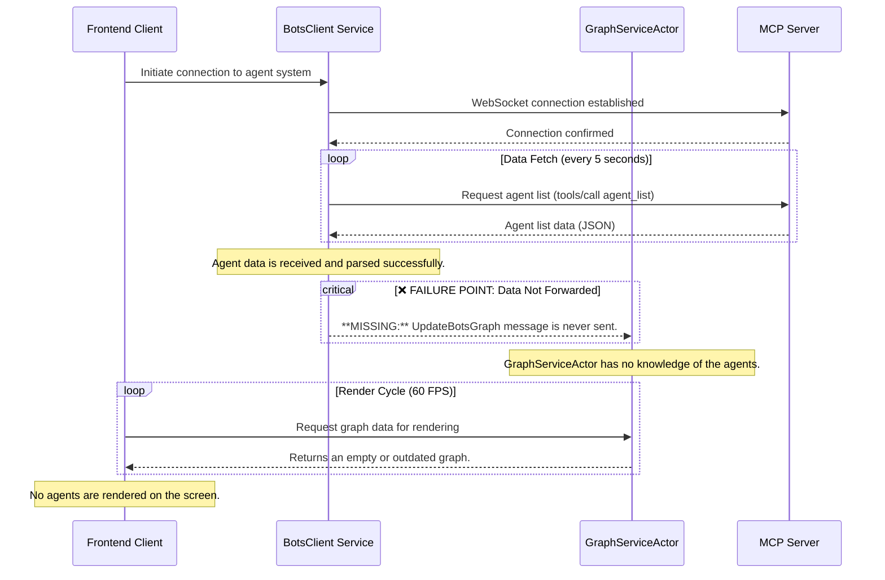

# Agent Data Flow and Visualization Breakdown

This document illustrates the data flow for agent visualization, highlighting the point of failure and the proposed fix.

## System Components

*   **BotsClient**: A Rust service responsible for connecting to the MCP server via WebSocket and fetching agent data.
*   **GraphServiceActor**: A Rust actor that manages the graph data structure used for rendering in the frontend.
*   **MCP Server**: A Node.js application running in a Docker container that manages the agent lifecycle.

## Data Flow Diagram

The following diagram shows the sequence of events for fetching and displaying agent data. The failure point is clearly marked.



## The Fix: `consolidated_agent_graph_fix.patch`

The provided patch resolves this issue by adding the missing communication link.

```mermaid
sequenceDiagram
    participant Client as Frontend Client
    participant BotsClient as BotsClient Service
    participant GraphServiceActor as GraphServiceActor
    participant MCPServer as MCP Server

    Client->>BotsClient: Initiate connection to agent system
    BotsClient->>MCPServer: WebSocket connection established
    MCPServer-->>BotsClient: Connection confirmed

    loop Data Fetch (every 5 seconds)
        BotsClient->>MCPServer: Request agent list (tools/call agent_list)
        MCPServer-->>BotsClient: Agent list data (JSON)
    end

    Note over BotsClient: Agent data is received and parsed successfully.

    rect rgb(200, 255, 200)
        Note over BotsClient, GraphServiceActor: ✅ FIX APPLIED
        BotsClient->>GraphServiceActor: **FIX:** Sends UpdateBotsGraph message with agent data.
    end

    Note over GraphServiceActor: GraphServiceActor now has the latest agent data.

    loop Render Cycle (60 FPS)
        Client->>GraphServiceActor: Request graph data for rendering
        GraphServiceActor-->>Client: Returns graph with all agents.
    end

    Note over Client: Agents are correctly rendered on the screen.