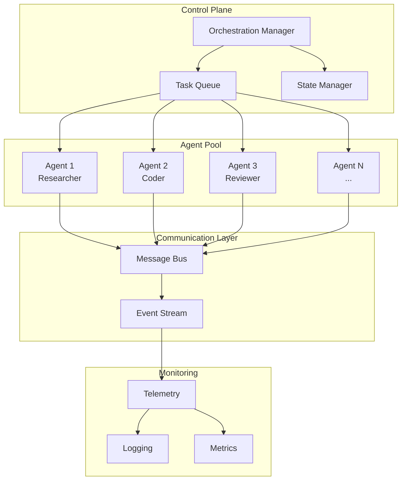
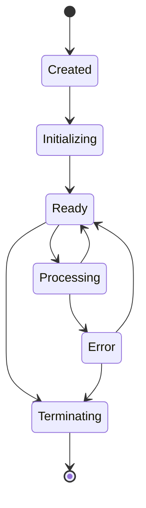

# Orchestrating Agents

*[← Back to Guides](index.md)*

This guide covers how to orchestrate and manage AI agents within the VisionFlow system, including agent lifecycle management, communication patterns, and monitoring.

## Table of Contents

1. [Agent Architecture Overview](#agent-architecture-overview)
2. [Agent Types and Roles](#agent-types-and-roles)
3. [Spawning and Managing Agents](#spawning-and-managing-agents)
4. [Inter-Agent Communication](#inter-agent-communication)
5. [Task Distribution](#task-distribution)
6. [Agent Coordination Patterns](#agent-coordination-patterns)
7. [Monitoring and Telemetry](#monitoring-and-telemetry)
8. [Scaling Strategies](#scaling-strategies)
9. [Error Handling and Recovery](#error-handling-and-recovery)

## Agent Architecture Overview

### System Components



### Core Concepts

1. **Agent**: Autonomous unit with specific capabilities
2. **Task**: Unit of work assigned to agents
3. **Orchestrator**: Manages agent lifecycle and task distribution
4. **Message Bus**: Enables inter-agent communication
5. **State Manager**: Tracks agent and task states

## Agent Types and Roles

### Core Agent Types

| Agent Type | Role | Capabilities |
|------------|------|--------------|
| **Researcher** | Information gathering | Web search, documentation analysis, data collection |
| **Planner** | Task decomposition | Break down complex tasks, create execution plans |
| **Coder** | Implementation | Write code, create configurations, implement solutions |
| **Reviewer** | Quality assurance | Code review, testing, validation |
| **Tester** | Automated testing | Unit tests, integration tests, performance tests |

### Specialized Agents

```yaml
# Agent configuration examples
agents:
  - type: sparc-coordinator
    role: orchestrator
    capabilities:
      - task_decomposition
      - agent_coordination
      - workflow_management
    
  - type: github-pr-manager
    role: integration
    capabilities:
      - pull_request_creation
      - code_review_coordination
      - merge_management
    
  - type: performance-analyser
    role: optimisation
    capabilities:
      - performance_profiling
      - bottleneck_detection
      - optimization_suggestions
```

### Custom Agent Definition

```python
# agents/custom_agent.py
from visionflow.agents import BaseAgent

class DataAnalysisAgent(BaseAgent):
    """Specialized agent for data analysis tasks."""
    
    def __init__(self, agent_id: str, config: dict):
        super().__init__(agent_id, config)
        self.capabilities = ['data_analysis', 'visualization', 'reporting']
        
    async def process_task(self, task):
        """Process data analysis tasks."""
        if task.type == 'analyze_dataset':
            return await self.analyze_dataset(task.params)
        elif task.type == 'create_visualization':
            return await self.create_visualization(task.params)
        else:
            return await super().process_task(task)
    
    async def analyze_dataset(self, params):
        """Perform dataset analysis."""
        # Implementation
        pass
```

## Spawning and Managing Agents

### Agent Lifecycle



### Spawning Agents

1. **Manual Agent Spawning**
```bash
# Using CLI
docker exec multi-agent-container visionflow agent spawn \
  --type researcher \
  --name "Research Agent 1" \
  --config '{"max_tasks": 10}'

# Using API
curl -X POST http://localhost:3001/api/agents \
  -H "Content-Type: application/json" \
  -d '{
    "type": "coder",
    "name": "Code Generator",
    "config": {
      "language": "python",
      "frameworks": ["fastapi", "sqlalchemy"]
    }
  }'
```

2. **Programmatic Spawning**
```python
# Python SDK
from visionflow import AgentOrchestrator

orchestrator = AgentOrchestrator()

# Spawn single agent
agent = await orchestrator.spawn_agent(
    agent_type="researcher",
    config={
        "max_concurrent_tasks": 5,
        "timeout": 300
    }
)

# Spawn agent swarm
swarm = await orchestrator.spawn_swarm(
    template="code-review-swarm",
    agents=[
        {"type": "coder", "count": 2},
        {"type": "reviewer", "count": 1},
        {"type": "tester", "count": 1}
    ]
)
```

### Agent Configuration

```yaml
# config/agents.yaml
agent_templates:
  researcher:
    class: visionflow.agents.ResearcherAgent
    default_config:
      max_concurrent_tasks: 3
      search_depth: 5
      sources:
        - web
        - documentation
        - code_repositories
      timeout: 600
    resources:
      memory: "2Gi"
      cpu: "1.0"
    
  coder:
    class: visionflow.agents.CoderAgent
    default_config:
      languages: ["python", "typescript", "rust"]
      linting: true
      formatting: true
      test_generation: true
    resources:
      memory: "4Gi"
      cpu: "2.0"
```

### Lifecycle Management

```python
# Agent lifecycle management
class AgentManager:
    async def manage_agent_lifecycle(self, agent_id: str):
        """Manage agent lifecycle states."""
        agent = self.get_agent(agent_id)
        
        # Initialize agent
        await agent.initialize()
        
        # Health monitoring
        health_task = asyncio.create_task(
            self.monitor_health(agent)
        )
        
        # Process tasks
        try:
            while agent.is_active:
                task = await self.task_queue.get(agent.capabilities)
                if task:
                    await agent.process_task(task)
                else:
                    await asyncio.sleep(1)
        finally:
            # Cleanup
            health_task.cancel()
            await agent.cleanup()
```

## Inter-Agent Communication

### Communication Patterns

1. **Direct Messaging**
```python
# Agent-to-agent direct communication
class Agent:
    async def send_message(self, target_agent_id: str, message: dict):
        """Send direct message to another agent."""
        await self.message_bus.publish(
            channel=f"agent.{target_agent_id}",
            message={
                "from": self.agent_id,
                "to": target_agent_id,
                "type": "direct",
                "content": message,
                "timestamp": datetime.utcnow().isoformat()
            }
        )
    
    async def handle_message(self, message: dict):
        """Process incoming messages."""
        if message["type"] == "task_request":
            await self.handle_task_request(message["content"])
        elif message["type"] == "status_update":
            await self.handle_status_update(message["content"])
```

2. **Broadcast Communication**
```python
# Broadcasting to multiple agents
async def broadcast_task(self, task: Task, agent_filter=None):
    """Broadcast task to multiple agents."""
    message = {
        "type": "task_broadcast",
        "task": task.to_dict(),
        "requirements": task.requirements,
        "timestamp": datetime.utcnow().isoformat()
    }
    
    if agent_filter:
        # Send to specific agents
        channel = f"broadcast.{agent_filter}"
    else:
        # Send to all agents
        channel = "broadcast.all"
    
    await self.message_bus.publish(channel, message)
```

3. **Event-Based Communication**
```python
# Event-driven agent communication
class EventDrivenAgent(BaseAgent):
    def __init__(self, *args, **kwargs):
        super().__init__(*args, **kwargs)
        self.event_handlers = {
            "task.completed": self.on_task_completed,
            "agent.joined": self.on_agent_joined,
            "error.occurred": self.on_error_occurred
        }
    
    async def subscribe_to_events(self):
        """Subscribe to relevant events."""
        for event_type in self.event_handlers:
            await self.event_bus.subscribe(
                event_type, 
                self.handle_event
            )
    
    async def handle_event(self, event):
        """Route events to appropriate handlers."""
        handler = self.event_handlers.get(event.type)
        if handler:
            await handler(event)
```

### Message Protocols

```python
# Define message schemas
from pydantic import BaseModel
from typing import Optional, Dict, Any
from datetime import datetime

class AgentMessage(BaseModel):
    """Standard agent message format."""
    message_id: str
    from_agent: str
    to_agent: Optional[str]
    message_type: str
    content: Dict[str, Any]
    timestamp: datetime
    correlation_id: Optional[str]
    
class TaskMessage(AgentMessage):
    """Task-specific message."""
    task_id: str
    task_type: str
    priority: int = 0
    deadline: Optional[datetime]
    
class StatusMessage(AgentMessage):
    """Agent status update."""
    status: str
    metrics: Dict[str, float]
    capabilities: List[str]
```

## Task Distribution

### Task Queue Management

```python
# Priority-based task queue
from heapq import heappush, heappop
from dataclasses import dataclass, field

@dataclass(order=True)
class PrioritizedTask:
    priority: int
    task: Task = field(compare=False)
    created_at: datetime = field(default_factory=datetime.utcnow, compare=False)

class TaskQueue:
    def __init__(self):
        self.queue = []
        self.task_map = {}
    
    async def add_task(self, task: Task, priority: int = 0):
        """Add task to queue with priority."""
        prioritized = PrioritizedTask(priority, task)
        heappush(self.queue, prioritized)
        self.task_map[task.id] = task
        
        # Notify available agents
        await self.notify_agents(task)
    
    async def get_task(self, agent_capabilities: List[str]) -> Optional[Task]:
        """Get next suitable task for agent."""
        for i, prioritized in enumerate(self.queue):
            task = prioritized.task
            if self.can_handle(task, agent_capabilities):
                self.queue.pop(i)
                return task
        return None
```

### Task Assignment Strategies

1. **Capability-Based Assignment**
```python
class CapabilityMatcher:
    def match_agent_to_task(self, task: Task, agents: List[Agent]) -> Optional[Agent]:
        """Match task to most capable agent."""
        suitable_agents = []
        
        for agent in agents:
            if agent.is_available and self.has_capabilities(agent, task):
                score = self.calculate_match_score(agent, task)
                suitable_agents.append((agent, score))
        
        if suitable_agents:
            # Return agent with highest match score
            suitable_agents.sort(key=lambda x: x[1], reverse=True)
            return suitable_agents[0][0]
        
        return None
    
    def calculate_match_score(self, agent: Agent, task: Task) -> float:
        """Calculate how well agent matches task."""
        score = 0.0
        
        # Exact capability matches
        matching_caps = set(agent.capabilities) & set(task.required_capabilities)
        score += len(matching_caps) * 10
        
        # Past performance
        if agent.metrics.get('task_success_rate'):
            score += agent.metrics['task_success_rate'] * 5
        
        # Current workload (prefer less loaded agents)
        workload = agent.current_tasks / agent.max_tasks
        score -= workload * 3
        
        return score
```

2. **Load Balancing**
```python
class LoadBalancer:
    def __init__(self):
        self.agent_loads = {}
        
    async def assign_task(self, task: Task) -> Agent:
        """Assign task using load balancing."""
        available_agents = await self.get_available_agents(task)
        
        if not available_agents:
            raise NoAvailableAgentError()
        
        # Find least loaded agent
        min_load = float('inf')
        selected_agent = None
        
        for agent in available_agents:
            load = self.calculate_load(agent)
            if load < min_load:
                min_load = load
                selected_agent = agent
        
        # Update load tracking
        self.agent_loads[selected_agent.id] = min_load + task.estimated_duration
        
        return selected_agent
    
    def calculate_load(self, agent: Agent) -> float:
        """Calculate agent's current load."""
        base_load = self.agent_loads.get(agent.id, 0)
        
        # Add current task processing time
        for task in agent.active_tasks:
            base_load += task.remaining_time
        
        return base_load
```

## Agent Coordination Patterns

### 1. Pipeline Pattern

```python
class PipelineCoordinator:
    """Coordinate agents in a pipeline workflow."""
    
    def __init__(self, stages: List[Dict]):
        self.stages = stages
        self.pipeline = self.build_pipeline(stages)
    
    async def execute_pipeline(self, initial_input: Any) -> Any:
        """Execute pipeline stages sequentially."""
        result = initial_input
        
        for stage in self.pipeline:
            agent = await self.get_agent_for_stage(stage)
            
            task = Task(
                type=stage['task_type'],
                input=result,
                config=stage.get('config', {})
            )
            
            result = await agent.process_task(task)
            
            # Pass result to next stage
            if stage.get('transform'):
                result = stage['transform'](result)
        
        return result

# Usage
pipeline = PipelineCoordinator([
    {"agent_type": "researcher", "task_type": "gather_requirements"},
    {"agent_type": "planner", "task_type": "create_plan"},
    {"agent_type": "coder", "task_type": "implement_solution"},
    {"agent_type": "reviewer", "task_type": "review_code"},
    {"agent_type": "tester", "task_type": "run_tests"}
])

result = await pipeline.execute_pipeline(project_requirements)
```

### 2. Swarm Pattern

```python
class SwarmCoordinator:
    """Coordinate agent swarms for parallel processing."""
    
    async def execute_swarm_task(self, task: Task, swarm_size: int = 5):
        """Execute task using agent swarm."""
        # Decompose task
        subtasks = await self.decompose_task(task)
        
        # Create swarm
        agents = await self.spawn_swarm(task.agent_type, swarm_size)
        
        # Distribute subtasks
        results = await asyncio.gather(*[
            agent.process_task(subtask)
            for agent, subtask in zip(agents, subtasks)
        ])
        
        # Aggregate results
        final_result = await self.aggregate_results(results)
        
        # Cleanup
        await self.terminate_swarm(agents)
        
        return final_result
    
    async def decompose_task(self, task: Task) -> List[Task]:
        """Break down task into parallelizable subtasks."""
        decomposer = await self.get_agent("task_decomposer")
        return await decomposer.decompose(task)
```

### 3. Hierarchical Pattern

```python
class HierarchicalCoordinator:
    """Hierarchical agent coordination."""
    
    def __init__(self):
        self.hierarchy = {
            "manager": None,
            "team_leads": [],
            "workers": {}
        }
    
    async def build_hierarchy(self, config: Dict):
        """Build agent hierarchy."""
        # Create manager agent
        self.hierarchy["manager"] = await self.spawn_agent(
            type="manager",
            config=config["manager"]
        )
        
        # Create team leads
        for team_config in config["teams"]:
            team_lead = await self.spawn_agent(
                type="team_lead",
                config=team_config
            )
            self.hierarchy["team_leads"].append(team_lead)
            
            # Create workers for this team
            workers = []
            for _ in range(team_config["size"]):
                worker = await self.spawn_agent(
                    type=team_config["worker_type"]
                )
                workers.append(worker)
            
            self.hierarchy["workers"][team_lead.id] = workers
    
    async def delegate_task(self, task: Task):
        """Delegate task through hierarchy."""
        # Manager decides which team
        manager = self.hierarchy["manager"]
        team_assignment = await manager.assign_to_team(task)
        
        # Team lead distributes to workers
        team_lead = self.get_team_lead(team_assignment)
        worker_tasks = await team_lead.distribute_work(task)
        
        # Workers execute
        results = []
        for worker, subtask in worker_tasks:
            result = await worker.process_task(subtask)
            results.append(result)
        
        # Team lead aggregates
        team_result = await team_lead.aggregate_results(results)
        
        # Manager reviews
        final_result = await manager.review_result(team_result)
        
        return final_result
```

## Monitoring and Telemetry

### Agent Telemetry System

```python
class AgentTelemetry:
    """Collect and process agent telemetry data."""
    
    def __init__(self):
        self.metrics = {}
        self.events = []
        self.prometheus_client = PrometheusClient()
        
    async def collect_metrics(self, agent_id: str):
        """Collect metrics from agent."""
        metrics = {
            "cpu_usage": psutil.cpu_percent(),
            "memory_usage": psutil.virtual_memory().percent,
            "active_tasks": len(agent.active_tasks),
            "completed_tasks": agent.metrics["completed_tasks"],
            "error_rate": agent.metrics["error_rate"],
            "avg_task_duration": agent.metrics["avg_duration"],
            "timestamp": datetime.utcnow()
        }
        
        self.metrics[agent_id] = metrics
        
        # Export to Prometheus
        await self.export_to_prometheus(agent_id, metrics)
        
        return metrics
    
    async def export_to_prometheus(self, agent_id: str, metrics: Dict):
        """Export metrics to Prometheus."""
        for metric_name, value in metrics.items():
            if isinstance(value, (int, float)):
                self.prometheus_client.gauge(
                    f"agent_{metric_name}",
                    value,
                    labels={"agent_id": agent_id}
                )
```

### Monitoring Dashboard

```yaml
# grafana/dashboards/agent-monitoring.json
{
  "dashboard": {
    "title": "Agent Monitoring",
    "panels": [
      {
        "title": "Active Agents",
        "targets": [{
          "expr": "count(agent_status == 'active')"
        }]
      },
      {
        "title": "Task Throughput",
        "targets": [{
          "expr": "rate(agent_completed_tasks[5m])"
        }]
      },
      {
        "title": "Error Rate",
        "targets": [{
          "expr": "rate(agent_errors[5m])"
        }]
      },
      {
        "title": "Agent Resource Usage",
        "targets": [{
          "expr": "agent_cpu_usage",
          "legend": "CPU %"
        }, {
          "expr": "agent_memory_usage",
          "legend": "Memory %"
        }]
      }
    ]
  }
}
```

### Real-time Monitoring

```python
class RealtimeMonitor:
    """Real-time agent monitoring via WebSocket."""
    
    def __init__(self, websocket_url: str):
        self.ws_url = websocket_url
        self.connections = {}
        
    async def monitor_agent(self, agent_id: str, callback):
        """Monitor specific agent in real-time."""
        ws = await websockets.connect(f"{self.ws_url}/agent/{agent_id}")
        
        try:
            async for message in ws:
                data = json.loads(message)
                await callback(data)
                
                # Check for alerts
                if self.should_alert(data):
                    await self.send_alert(agent_id, data)
        finally:
            await ws.close()
    
    def should_alert(self, data: Dict) -> bool:
        """Check if metrics warrant an alert."""
        return (
            data.get("error_rate", 0) > 0.1 or
            data.get("cpu_usage", 0) > 90 or
            data.get("memory_usage", 0) > 90
        )
```

## Scaling Strategies

### Horizontal Scaling

```python
class AutoScaler:
    """Automatically scale agent pool based on demand."""
    
    def __init__(self, min_agents: int = 1, max_agents: int = 20):
        self.min_agents = min_agents
        self.max_agents = max_agents
        self.scaling_metrics = {}
        
    async def evaluate_scaling_need(self):
        """Evaluate if scaling is needed."""
        metrics = await self.collect_metrics()
        
        # Scale up conditions
        if (metrics["queue_length"] > 10 and 
            metrics["avg_wait_time"] > 60 and
            metrics["agent_count"] < self.max_agents):
            return "scale_up"
            
        # Scale down conditions
        if (metrics["queue_length"] < 2 and
            metrics["agent_utilization"] < 0.3 and
            metrics["agent_count"] > self.min_agents):
            return "scale_down"
            
        return "maintain"
    
    async def scale_agents(self, action: str):
        """Scale agent pool up or down."""
        current_count = await self.get_agent_count()
        
        if action == "scale_up":
            new_count = min(
                current_count + self.calculate_scale_up_count(),
                self.max_agents
            )
            await self.spawn_agents(new_count - current_count)
            
        elif action == "scale_down":
            new_count = max(
                current_count - self.calculate_scale_down_count(),
                self.min_agents
            )
            await self.terminate_agents(current_count - new_count)
```

### Resource Optimization

```python
class ResourceOptimizer:
    """Optimize resource allocation for agents."""
    
    async def optimize_resources(self):
        """Dynamically adjust agent resources."""
        agents = await self.get_all_agents()
        
        for agent in agents:
            metrics = await self.get_agent_metrics(agent.id)
            
            # Adjust CPU allocation
            if metrics["cpu_usage"] > 80:
                await self.increase_cpu_limit(agent, 0.5)
            elif metrics["cpu_usage"] < 20:
                await self.decrease_cpu_limit(agent, 0.25)
            
            # Adjust memory allocation
            if metrics["memory_usage"] > 80:
                await self.increase_memory_limit(agent, "512Mi")
            elif metrics["memory_usage"] < 30:
                await self.decrease_memory_limit(agent, "256Mi")
    
    async def rebalance_workload(self):
        """Rebalance tasks across agents."""
        agents = await self.get_all_agents()
        
        # Calculate load imbalance
        loads = [len(a.active_tasks) for a in agents]
        avg_load = sum(loads) / len(loads)
        
        # Identify overloaded and underloaded agents
        overloaded = [a for a in agents if len(a.active_tasks) > avg_load * 1.5]
        underloaded = [a for a in agents if len(a.active_tasks) < avg_load * 0.5]
        
        # Redistribute tasks
        for over_agent in overloaded:
            tasks_to_move = len(over_agent.active_tasks) - int(avg_load)
            
            for _ in range(tasks_to_move):
                if underloaded:
                    task = await over_agent.release_task()
                    under_agent = underloaded.pop(0)
                    await under_agent.assign_task(task)
```

## Error Handling and Recovery

### Failure Detection

```python
class FailureDetector:
    """Detect and handle agent failures."""
    
    def __init__(self, heartbeat_interval: int = 30):
        self.heartbeat_interval = heartbeat_interval
        self.last_heartbeat = {}
        self.failure_handlers = {}
        
    async def monitor_heartbeats(self):
        """Monitor agent heartbeats."""
        while True:
            current_time = time.time()
            
            for agent_id, last_beat in self.last_heartbeat.items():
                if current_time - last_beat > self.heartbeat_interval * 2:
                    await self.handle_failure(agent_id)
            
            await asyncio.sleep(self.heartbeat_interval / 2)
    
    async def handle_failure(self, agent_id: str):
        """Handle agent failure."""
        logger.warning(f"Agent {agent_id} failed")
        
        # Get agent's active tasks
        agent = await self.get_agent(agent_id)
        active_tasks = agent.active_tasks
        
        # Mark agent as failed
        await self.mark_agent_failed(agent_id)
        
        # Reassign tasks
        for task in active_tasks:
            await self.reassign_task(task)
        
        # Attempt recovery
        await self.attempt_recovery(agent_id)
```

### Recovery Strategies

```python
class RecoveryManager:
    """Manage agent recovery strategies."""
    
    async def recover_agent(self, agent_id: str, failure_type: str):
        """Recover failed agent based on failure type."""
        
        strategies = {
            "timeout": self.recover_from_timeout,
            "crash": self.recover_from_crash,
            "resource_exhaustion": self.recover_from_resource_exhaustion,
            "network_failure": self.recover_from_network_failure
        }
        
        recovery_fn = strategies.get(failure_type, self.default_recovery)
        return await recovery_fn(agent_id)
    
    async def recover_from_timeout(self, agent_id: str):
        """Recover from timeout failure."""
        # Kill stuck processes
        await self.kill_agent_processes(agent_id)
        
        # Restart agent
        agent = await self.restart_agent(agent_id)
        
        # Restore state
        await self.restore_agent_state(agent)
        
        return agent
    
    async def recover_from_crash(self, agent_id: str):
        """Recover from agent crash."""
        # Check crash logs
        crash_info = await self.analyze_crash_logs(agent_id)
        
        # Fix configuration if needed
        if crash_info.get("config_error"):
            await self.fix_agent_config(agent_id)
        
        # Restart with backoff
        return await self.restart_with_backoff(agent_id)
```

### Circuit Breaker Pattern

```python
class CircuitBreaker:
    """Circuit breaker for agent operations."""
    
    def __init__(self, failure_threshold: int = 5, timeout: int = 60):
        self.failure_threshold = failure_threshold
        self.timeout = timeout
        self.failures = defaultdict(int)
        self.last_failure_time = {}
        self.state = defaultdict(lambda: "closed")  # closed, open, half_open
        
    async def call(self, agent_id: str, operation: Callable):
        """Execute operation with circuit breaker protection."""
        if self.state[agent_id] == "open":
            if time.time() - self.last_failure_time[agent_id] > self.timeout:
                self.state[agent_id] = "half_open"
            else:
                raise CircuitOpenError(f"Circuit open for agent {agent_id}")
        
        try:
            result = await operation()
            
            # Success - reset failures
            if self.state[agent_id] == "half_open":
                self.state[agent_id] = "closed"
            self.failures[agent_id] = 0
            
            return result
            
        except Exception as e:
            self.failures[agent_id] += 1
            self.last_failure_time[agent_id] = time.time()
            
            if self.failures[agent_id] >= self.failure_threshold:
                self.state[agent_id] = "open"
                logger.error(f"Circuit opened for agent {agent_id}")
            
            raise e
```

## Best Practices

### 1. Agent Design Principles

- **Single Responsibility**: Each agent should have one clear purpose
- **Stateless Operations**: Avoid storing state in agents when possible
- **Idempotency**: Agent operations should be idempotent
- **Graceful Degradation**: Handle partial failures gracefully

### 2. Performance Guidelines

```python
# Efficient task batching
async def batch_process_tasks(agent, tasks: List[Task]):
    """Process multiple tasks efficiently."""
    # Group similar tasks
    task_groups = defaultdict(list)
    for task in tasks:
        task_groups[task.type].append(task)
    
    results = []
    for task_type, group in task_groups.items():
        # Process group in parallel where possible
        if agent.supports_batch(task_type):
            result = await agent.batch_process(group)
            results.extend(result)
        else:
            # Fall back to sequential processing
            for task in group:
                result = await agent.process_task(task)
                results.append(result)
    
    return results
```

### 3. Monitoring Best Practices

- Track key metrics: throughput, latency, error rate
- Set up alerts for anomalies
- Log structured data for analysis
- Use distributed tracing for complex workflows

### 4. Testing Strategies

```python
# Test agent coordination
@pytest.mark.asyncio
async def test_pipeline_coordination():
    """Test pipeline coordination pattern."""
    # Create mock agents
    mock_agents = [
        MockAgent("researcher"),
        MockAgent("planner"),
        MockAgent("coder")
    ]
    
    # Setup pipeline
    pipeline = PipelineCoordinator([
        {"agent_type": "researcher", "task_type": "research"},
        {"agent_type": "planner", "task_type": "plan"},
        {"agent_type": "coder", "task_type": "implement"}
    ])
    
    # Execute pipeline
    result = await pipeline.execute_pipeline("test input")
    
    # Verify coordination
    assert mock_agents[0].called_with("research", "test input")
    assert mock_agents[1].called_with("plan", mock_agents[0].output)
    assert mock_agents[2].called_with("implement", mock_agents[1].output)
```

## Troubleshooting

### Common Issues

1. **Agent Not Responding**
```bash
# Check agent status
curl http://localhost:3001/api/agents/{agent_id}/status

# View agent logs
docker logs multi-agent-container | grep "agent_id"

# Restart specific agent
curl -X POST http://localhost:3001/api/agents/{agent_id}/restart
```

2. **Task Queue Backlog**
```bash
# Check queue status
curl http://localhost:3001/api/tasks/queue/status

# Clear stuck tasks
curl -X POST http://localhost:3001/api/tasks/queue/clear-stuck

# Increase agent pool
curl -X POST http://localhost:3001/api/agents/scale -d '{"count": 5}'
```

3. **High Error Rate**
```bash
# View error logs
docker exec multi-agent-container tail -f /app/logs/errors.log

# Get error statistics
curl http://localhost:3001/api/agents/errors/stats

# Enable debug mode
curl -X PUT http://localhost:3001/api/debug/enable
```

## Next Steps

- Continue to [Extending the System](05-extending-the-system.md) for customization
- See [Troubleshooting](06-troubleshooting.md) for more solutions
- Review [Agent Reference](../reference/agents/README.md) for detailed documentation

---

*[← Using the GUI Sandbox](03-using-the-gui-sandbox.md) | [Back to Guides](index.md) | [Extending the System →](05-extending-the-system.md)*