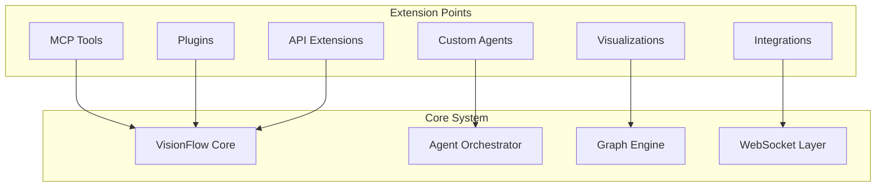

# Extending the System

*[← Back to Guides](index.md)*

This guide covers how to extend VisionFlow with custom functionality, including creating new MCP tools, agent types, plugins, and API extensions.

## Table of Contents

1. [Extension Points Overview](#extension-points-overview)
2. [Creating Custom MCP Tools](#creating-custom-mcp-tools)
3. [Developing Custom Agents](#developing-custom-agents)
4. [Building Plugins](#building-plugins)
5. [API Extensions](#api-extensions)
6. [Integration with External Services](#integration-with-external-services)
7. [Custom Visualizations](#custom-visualizations)
8. [Publishing Extensions](#publishing-extensions)

## Extension Points Overview

VisionFlow provides multiple extension points for customization:



### Extension Architecture

| Extension Type | Purpose | Language | Interface |
|----------------|---------|----------|-----------|
| MCP Tools | External tool integration | Python/Node.js | Stdio JSON |
| Custom Agents | Specialized AI agents | Python | Agent API |
| Plugins | System functionality | Rust/TypeScript | Plugin API |
| API Extensions | New endpoints | Rust | REST/GraphQL |
| Visualizations | Custom 3D views | TypeScript/GLSL | React Three Fiber |
| Integrations | External services | Any | WebSocket/HTTP |

## Creating Custom MCP Tools

### MCP Tool Anatomy

MCP tools communicate via stdio using JSON messages:

```python
#!/usr/bin/env python3
"""
Custom MCP Tool Template
"""
import sys
import json
import logging
from typing import Dict, Any, Optional

class CustomMCPTool:
    def __init__(self):
        # Configure logging
        logging.basicConfig(
            level=logging.INFO,
            format='%(asctime)s - %(name)s - %(levelname)s - %(message)s',
            handlers=[logging.FileHandler('/app/logs/custom_tool.log')]
        )
        self.logger = logging.getLogger(__name__)
        
        # Initialize tool state
        self.config = self.load_config()
        self.capabilities = ['process', 'analyse', 'transform']
    
    def load_config(self) -> Dict:
        """Load tool configuration."""
        try:
            with open('/app/config/custom_tool.json', 'r') as f:
                return json.load(f)
        except Exception:
            return {}
    
    def process_request(self, request: Dict[str, Any]) -> Dict[str, Any]:
        """Process incoming MCP request."""
        try:
            method = request.get('method', 'default')
            params = request.get('params', {})
            
            # Route to appropriate handler
            handlers = {
                'process': self.handle_process,
                'analyse': self.handle_analyze,
                'transform': self.handle_transform,
                'capabilities': self.get_capabilities
            }
            
            handler = handlers.get(method, self.handle_unknown)
            result = handler(params)
            
            return {'result': result}
            
        except Exception as e:
            self.logger.error(f"Error processing request: {e}", exc_info=True)
            return {'error': str(e)}
    
    def handle_process(self, params: Dict) -> Any:
        """Handle process requests."""
        data = params.get('data')
        options = params.get('options', {})
        
        # Your processing logic here
        processed = self.process_data(data, options)
        
        return {
            'status': 'success',
            'processed': processed,
            'metadata': {
                'items_processed': len(processed),
                'options_used': options
            }
        }
    
    def handle_analyze(self, params: Dict) -> Any:
        """Handle analysis requests."""
        # Implementation
        pass
    
    def handle_transform(self, params: Dict) -> Any:
        """Handle transformation requests."""
        # Implementation
        pass
    
    def handle_unknown(self, params: Dict) -> Any:
        """Handle unknown methods."""
        return {'error': 'Unknown method'}
    
    def get_capabilities(self, params: Dict) -> List[str]:
        """Return tool capabilities."""
        return self.capabilities
    
    def run(self):
        """Main execution loop."""
        self.logger.info("Custom MCP Tool started")
        
        # Read from stdin, write to stdout
        for line in sys.stdin:
            try:
                request = json.loads(line.strip())
                response = self.process_request(request)
                print(json.dumps(response), flush=True)
            except json.JSONDecodeError as e:
                error_response = {'error': f'Invalid JSON: {e}'}
                print(json.dumps(error_response), flush=True)
            except Exception as e:
                error_response = {'error': str(e)}
                print(json.dumps(error_response), flush=True)

if __name__ == '__main__':
    tool = CustomMCPTool()
    tool.run()
```

### Registering the Tool

1. **Add to MCP Configuration**
```json
// .mcp.json
{
  "tools": {
    "custom-tool": {
      "command": "python3",
      "args": ["-u", "./mcp-tools/custom_tool.py"],
      "description": "Custom tool for specialized processing",
      "schema": {
        "methods": {
          "process": {
            "params": {
              "data": "array",
              "options": "object"
            }
          },
          "analyse": {
            "params": {
              "input": "string",
              "depth": "number"
            }
          }
        }
      }
    }
  }
}
```

2. **Create Tool Wrapper Script**
```bash
#!/bin/bash
# mcp-tools/custom_tool_wrapper.sh

# Set environment
export PYTHONUNBUFFERED=1
export TOOL_CONFIG_PATH=/workspace/config/custom_tool.json

# Run tool with proper error handling
exec python3 -u /workspace/mcp-tools/custom_tool.py 2>>/app/logs/custom_tool.error.log
```

### Advanced MCP Tool Features

1. **Async Operations**
```python
import asyncio
import aiohttp

class AsyncMCPTool(CustomMCPTool):
    async def handle_fetch(self, params: Dict) -> Any:
        """Handle async fetch operations."""
        url = params.get('url')
        
        async with aiohttp.ClientSession() as session:
            async with session.get(url) as response:
                data = await response.json()
                
        return {
            'status': response.status,
            'data': data
        }
    
    def process_request(self, request: Dict[str, Any]) -> Dict[str, Any]:
        """Process request with async support."""
        method = request.get('method')
        
        if method == 'fetch':
            # Run async method in event loop
            loop = asyncio.new_event_loop()
            asyncio.set_event_loop(loop)
            result = loop.run_until_complete(
                self.handle_fetch(request.get('params', {}))
            )
            return {'result': result}
        
        return super().process_request(request)
```

2. **State Management**
```python
class StatefulMCPTool(CustomMCPTool):
    def __init__(self):
        super().__init__()
        self.sessions = {}
    
    def handle_create_session(self, params: Dict) -> str:
        """Create new session."""
        import uuid
        session_id = str(uuid.uuid4())
        
        self.sessions[session_id] = {
            'created': datetime.utcnow().isoformat(),
            'data': {},
            'history': []
        }
        
        return session_id
    
    def handle_session_operation(self, params: Dict) -> Any:
        """Handle session-based operations."""
        session_id = params.get('session_id')
        operation = params.get('operation')
        
        if session_id not in self.sessions:
            raise ValueError("Invalid session ID")
        
        session = self.sessions[session_id]
        session['history'].append(operation)
        
        # Process operation
        result = self.process_session_operation(session, operation)
        
        return result
```

## Developing Custom Agents

### Agent Base Class

```python
# agents/base_agent.py
from abc import ABC, abstractmethod
from typing import Dict, List, Any, Optional
import asyncio
import logging

class BaseCustomAgent(ABC):
    """Base class for custom agents."""
    
    def __init__(self, agent_id: str, config: Dict[str, Any]):
        self.agent_id = agent_id
        self.config = config
        self.logger = logging.getLogger(f"agent.{agent_id}")
        
        # Agent state
        self.status = "initializing"
        self.capabilities = []
        self.active_tasks = []
        self.metrics = {
            "tasks_completed": 0,
            "tasks_failed": 0,
            "avg_task_duration": 0
        }
    
    @abstractmethod
    async def initialize(self):
        """Initialize agent resources."""
        pass
    
    @abstractmethod
    async def process_task(self, task: Dict[str, Any]) -> Any:
        """Process a single task."""
        pass
    
    @abstractmethod
    async def cleanup(self):
        """Clean up agent resources."""
        pass
    
    async def run(self):
        """Main agent execution loop."""
        try:
            await self.initialize()
            self.status = "ready"
            
            while self.status == "ready":
                task = await self.get_next_task()
                
                if task:
                    await self.execute_task(task)
                else:
                    await asyncio.sleep(1)
                    
        except Exception as e:
            self.logger.error(f"Agent error: {e}", exc_info=True)
            self.status = "error"
        finally:
            await self.cleanup()
    
    async def execute_task(self, task: Dict[str, Any]):
        """Execute task with metrics tracking."""
        start_time = asyncio.get_event_loop().time()
        
        try:
            self.active_tasks.append(task['id'])
            result = await self.process_task(task)
            
            # Update metrics
            duration = asyncio.get_event_loop().time() - start_time
            self.update_metrics('success', duration)
            
            # Report result
            await self.report_result(task['id'], result)
            
        except Exception as e:
            self.logger.error(f"Task {task['id']} failed: {e}")
            self.update_metrics('failure', 0)
            await self.report_error(task['id'], str(e))
            
        finally:
            self.active_tasks.remove(task['id'])
```

### Specialized Agent Example

```python
# agents/data_pipeline_agent.py
import pandas as pd
from typing import Dict, Any
import aiofiles

class DataPipelineAgent(BaseCustomAgent):
    """Agent specialized in data pipeline operations."""
    
    def __init__(self, agent_id: str, config: Dict[str, Any]):
        super().__init__(agent_id, config)
        self.capabilities = [
            'data_extraction',
            'data_transformation',
            'data_validation',
            'data_loading'
        ]
        self.pipeline_config = config.get('pipeline', {})
    
    async def initialize(self):
        """Initialize data pipeline resources."""
        # Setup database connections
        self.db_pool = await self.create_db_pool()
        
        # Load transformation rules
        self.transformations = await self.load_transformations()
        
        # Initialize cache
        self.cache = {}
        
        self.logger.info("Data pipeline agent initialized")
    
    async def process_task(self, task: Dict[str, Any]) -> Any:
        """Process data pipeline tasks."""
        task_type = task.get('type')
        
        handlers = {
            'extract': self.extract_data,
            'transform': self.transform_data,
            'validate': self.validate_data,
            'load': self.load_data,
            'pipeline': self.run_pipeline
        }
        
        handler = handlers.get(task_type)
        if not handler:
            raise ValueError(f"Unknown task type: {task_type}")
        
        return await handler(task.get('params', {}))
    
    async def extract_data(self, params: Dict) -> pd.DataFrame:
        """Extract data from source."""
        source_type = params.get('source_type')
        
        if source_type == 'database':
            query = params.get('query')
            async with self.db_pool.acquire() as conn:
                result = await conn.fetch(query)
                return pd.DataFrame(result)
                
        elif source_type == 'file':
            file_path = params.get('file_path')
            async with aiofiles.open(file_path, 'r') as f:
                content = await f.read()
                return pd.read_csv(content)
                
        else:
            raise ValueError(f"Unsupported source type: {source_type}")
    
    async def transform_data(self, params: Dict) -> pd.DataFrame:
        """Apply transformations to data."""
        data = params.get('data')
        rules = params.get('transformation_rules', [])
        
        df = pd.DataFrame(data)
        
        for rule in rules:
            rule_type = rule.get('type')
            
            if rule_type == 'filter':
                df = df[df[rule['column']] > rule['value']]
            elif rule_type == 'aggregate':
                df = df.groupby(rule['group_by']).agg(rule['aggregations'])
            elif rule_type == 'join':
                other_df = await self.get_cached_data(rule['dataset'])
                df = df.merge(other_df, on=rule['join_key'])
        
        return df
    
    async def run_pipeline(self, params: Dict) -> Dict[str, Any]:
        """Run complete data pipeline."""
        pipeline_name = params.get('pipeline_name')
        pipeline_def = self.pipeline_config.get(pipeline_name)
        
        if not pipeline_def:
            raise ValueError(f"Pipeline {pipeline_name} not found")
        
        results = {}
        data = None
        
        for stage in pipeline_def['stages']:
            self.logger.info(f"Running stage: {stage['name']}")
            
            stage_params = stage.get('params', {})
            if data is not None:
                stage_params['data'] = data
            
            if stage['type'] == 'extract':
                data = await self.extract_data(stage_params)
            elif stage['type'] == 'transform':
                data = await self.transform_data(stage_params)
            elif stage['type'] == 'validate':
                validation_result = await self.validate_data(stage_params)
                if not validation_result['valid']:
                    raise ValueError(f"Validation failed: {validation_result['errors']}")
            elif stage['type'] == 'load':
                load_result = await self.load_data(stage_params)
                results['load'] = load_result
            
            results[stage['name']] = {
                'status': 'completed',
                'records': len(data) if hasattr(data, '__len__') else 0
            }
        
        return results
    
    async def cleanup(self):
        """Clean up resources."""
        if hasattr(self, 'db_pool'):
            await self.db_pool.close()
        self.cache.clear()
```

### Registering Custom Agents

```yaml
# config/agents.yaml
custom_agents:
  data_pipeline:
    class: agents.data_pipeline_agent.DataPipelineAgent
    config:
      max_concurrent_tasks: 5
      pipeline:
        customer_etl:
          stages:
            - name: extract_customers
              type: extract
              params:
                source_type: database
                query: "SELECT * FROM customers WHERE updated_at > $1"
            - name: transform_customers
              type: transform
              params:
                transformation_rules:
                  - type: filter
                    column: status
                    value: active
            - name: validate_customers
              type: validate
              params:
                schema: customer_schema
            - name: load_customers
              type: load
              params:
                target: data_warehouse
                table: dim_customers
    resources:
      memory: "4Gi"
      cpu: "2.0"
```

## Building Plugins

### Plugin Architecture

```rust
// src/plugins/plugin_interface.rs
use async_trait::async_trait;
use serde::{Deserialize, Serialize};
use std::collections::HashMap;

#[async_trait]
pub trait Plugin: Send + Sync {
    /// Plugin metadata
    fn metadata(&self) -> PluginMetadata;
    
    /// Initialize plugin
    async fn initialize(&mut self, config: PluginConfig) -> Result<(), PluginError>;
    
    /// Handle plugin events
    async fn handle_event(&self, event: PluginEvent) -> Result<PluginResponse, PluginError>;
    
    /// Cleanup plugin
    async fn cleanup(&mut self) -> Result<(), PluginError>;
}

#[derive(Debug, Clone, Serialize, Deserialize)]
pub struct PluginMetadata {
    pub name: String,
    pub version: String,
    pub author: String,
    pub description: String,
    pub capabilities: Vec<String>,
}

#[derive(Debug, Clone, Serialize, Deserialize)]
pub struct PluginConfig {
    pub settings: HashMap<String, serde_json::Value>,
}

#[derive(Debug, Clone, Serialize, Deserialize)]
pub struct PluginEvent {
    pub event_type: String,
    pub payload: serde_json::Value,
}

#[derive(Debug, Clone, Serialize, Deserialize)]
pub struct PluginResponse {
    pub success: bool,
    pub data: Option<serde_json::Value>,
    pub error: Option<String>,
}
```

### Example Plugin Implementation

```rust
// src/plugins/custom_analytics.rs
use super::{Plugin, PluginMetadata, PluginConfig, PluginEvent, PluginResponse, PluginError};
use async_trait::async_trait;
use std::collections::HashMap;

pub struct CustomAnalyticsPlugin {
    config: PluginConfig,
    metrics: HashMap<String, f64>,
}

#[async_trait]
impl Plugin for CustomAnalyticsPlugin {
    fn metadata(&self) -> PluginMetadata {
        PluginMetadata {
            name: "Custom Analytics".to_string(),
            version: "1.0.0".to_string(),
            author: "Your Name".to_string(),
            description: "Advanced analytics for graph data".to_string(),
            capabilities: vec![
                "graph_analysis".to_string(),
                "pattern_detection".to_string(),
                "anomaly_detection".to_string(),
            ],
        }
    }
    
    async fn initialize(&mut self, config: PluginConfig) -> Result<(), PluginError> {
        self.config = config;
        
        // Initialize analytics engine
        self.setup_analytics_engine()?;
        
        Ok(())
    }
    
    async fn handle_event(&self, event: PluginEvent) -> Result<PluginResponse, PluginError> {
        match event.event_type.as_str() {
            "analyze_graph" => self.analyze_graph(event.payload).await,
            "detect_patterns" => self.detect_patterns(event.payload).await,
            "find_anomalies" => self.find_anomalies(event.payload).await,
            _ => Err(PluginError::UnknownEvent(event.event_type)),
        }
    }
    
    async fn cleanup(&mut self) -> Result<(), PluginError> {
        self.metrics.clear();
        Ok(())
    }
}

impl CustomAnalyticsPlugin {
    async fn analyze_graph(&self, data: serde_json::Value) -> Result<PluginResponse, PluginError> {
        // Parse graph data
        let graph: Graph = serde_json::from_value(data)
            .map_err(|e| PluginError::InvalidData(e.to_string()))?;
        
        // Perform analysis
        let metrics = self.calculate_graph_metrics(&graph)?;
        
        Ok(PluginResponse {
            success: true,
            data: Some(serde_json::to_value(metrics)?),
            error: None,
        })
    }
    
    fn calculate_graph_metrics(&self, graph: &Graph) -> Result<GraphMetrics, PluginError> {
        let metrics = GraphMetrics {
            node_count: graph.nodes.len(),
            edge_count: graph.edges.len(),
            average_degree: self.calculate_average_degree(graph),
            clustering_coefficient: self.calculate_clustering_coefficient(graph),
            connected_components: self.find_connected_components(graph),
        };
        
        Ok(metrics)
    }
}
```

### Plugin Registration

```toml
# plugins.toml
[[plugins]]
name = "custom-analytics"
path = "./plugins/custom_analytics.so"
enabled = true
config = { buffer_size = 1000, cache_ttl = 300 }

[[plugins]]
name = "external-integration"
path = "./plugins/external_integration.wasm"
enabled = true
config = { api_endpoint = "https://api.example.com" }
```

## API Extensions

### Creating Custom Endpoints

```rust
// src/api/extensions/custom_endpoints.rs
use actix_web::{web, HttpResponse, Result};
use serde::{Deserialize, Serialize};

#[derive(Serialize, Deserialize)]
struct CustomAnalysisRequest {
    graph_id: String,
    analysis_type: String,
    parameters: serde_json::Value,
}

#[derive(Serialize)]
struct CustomAnalysisResponse {
    result: serde_json::Value,
    metadata: AnalysisMetadata,
}

pub fn configure_custom_routes(cfg: &mut web::ServiceConfig) {
    cfg.service(
        web::scope("/custom")
            .route("/analyse", web::post().to(analyze_graph))
            .route("/visualize/{id}", web::get().to(get_visualization))
            .route("/export", web::post().to(export_data))
    );
}

async fn analyze_graph(
    req: web::Json<CustomAnalysisRequest>,
    app_state: web::Data<AppState>,
) -> Result<HttpResponse> {
    let analysis_result = app_state
        .analyser
        .perform_analysis(&req.graph_id, &req.analysis_type, &req.parameters)
        .await?;
    
    Ok(HttpResponse::Ok().json(CustomAnalysisResponse {
        result: analysis_result,
        metadata: AnalysisMetadata {
            timestamp: chrono::Utc::now(),
            duration_ms: 0, // Calculate actual duration
        },
    }))
}
```

### GraphQL Extensions

```rust
// src/graphql/custom_schema.rs
use juniper::{FieldResult, RootNode};

pub struct CustomQuery;

#[juniper::object(Context = Context)]
impl CustomQuery {
    async fn advanced_search(
        ctx: &Context,
        query: String,
        filters: SearchFilters,
        limit: Option<i32>,
    ) -> FieldResult<SearchResults> {
        let results = ctx
            .search_engine
            .search(&query, filters, limit.unwrap_or(10))
            .await?;
        
        Ok(results)
    }
    
    async fn pattern_analysis(
        ctx: &Context,
        graph_id: String,
        pattern_type: PatternType,
    ) -> FieldResult<Vec<Pattern>> {
        let patterns = ctx
            .pattern_detector
            .find_patterns(&graph_id, pattern_type)
            .await?;
        
        Ok(patterns)
    }
}

pub struct CustomMutation;

#[juniper::object(Context = Context)]
impl CustomMutation {
    async fn create_custom_visualization(
        ctx: &Context,
        input: VisualizationInput,
    ) -> FieldResult<Visualization> {
        let viz = ctx
            .visualization_engine
            .create_custom(input)
            .await?;
        
        Ok(viz)
    }
}
```

## Integration with External Services

### Webhook Integration

```python
# integrations/webhook_handler.py
from aiohttp import web
import aiohttp
import hmac
import hashlib

class WebhookIntegration:
    def __init__(self, config):
        self.config = config
        self.secret = config.get('webhook_secret')
        self.handlers = {}
    
    def register_handler(self, event_type: str, handler):
        """Register webhook handler for event type."""
        self.handlers[event_type] = handler
    
    async def handle_webhook(self, request: web.Request) -> web.Response:
        """Handle incoming webhook."""
        # Verify webhook signature
        signature = request.headers.get('X-Webhook-Signature')
        body = await request.read()
        
        if not self.verify_signature(body, signature):
            return web.Response(status=401, text="Invalid signature")
        
        # Parse webhook data
        data = await request.json()
        event_type = data.get('event_type')
        
        # Route to handler
        handler = self.handlers.get(event_type)
        if handler:
            try:
                result = await handler(data)
                return web.json_response({'status': 'success', 'result': result})
            except Exception as e:
                return web.json_response({'status': 'error', 'error': str(e)}, status=500)
        
        return web.json_response({'status': 'error', 'error': 'Unknown event type'}, status=400)
    
    def verify_signature(self, body: bytes, signature: str) -> bool:
        """Verify webhook signature."""
        expected = hmac.new(
            self.secret.encode(),
            body,
            hashlib.sha256
        ).hexdigest()
        
        return hmac.compare_digest(expected, signature)
```

### External Service Client

```typescript
// src/integrations/ExternalServiceClient.ts
export class ExternalServiceClient {
  private apiKey: string;
  private baseUrl: string;
  private httpClient: axios.AxiosInstance;

  constructor(config: ExternalServiceConfig) {
    this.apiKey = config.apiKey;
    this.baseUrl = config.baseUrl;
    
    this.httpClient = axios.create({
      baseURL: this.baseUrl,
      headers: {
        'Authorization': `Bearer ${this.apiKey}`,
        'Content-Type': 'application/json'
      },
      timeout: 30000
    });
    
    this.setupInterceptors();
  }
  
  private setupInterceptors() {
    // Request interceptor
    this.httpClient.interceptors.request.use(
      (config) => {
        config.headers['X-Request-ID'] = generateRequestId();
        return config;
      },
      (error) => Promise.reject(error)
    );
    
    // Response interceptor
    this.httpClient.interceptors.response.use(
      (response) => response,
      async (error) => {
        if (error.response?.status === 401) {
          await this.refreshToken();
          return this.httpClient.request(error.config);
        }
        return Promise.reject(error);
      }
    );
  }
  
  async syncData(data: any): Promise<SyncResult> {
    const response = await this.httpClient.post('/sync', {
      data,
      timestamp: new Date().toISOString()
    });
    
    return response.data;
  }
  
  async streamUpdates(onUpdate: (update: any) => void): Promise<void> {
    const eventSource = new EventSource(
      `${this.baseUrl}/stream?token=${this.apiKey}`
    );
    
    eventSource.onmessage = (event) => {
      const update = JSON.parse(event.data);
      onUpdate(update);
    };
    
    eventSource.onerror = (error) => {
      console.error('Stream error:', error);
      eventSource.close();
    };
  }
}
```

## Custom Visualizations

### Three.js Custom Component

```typescript
// src/components/CustomVisualization.tsx
import React, { useRef, useMemo } from 'react';
import { useFrame, useThree } from '@react-three/fiber';
import { BufferGeometry, Float32BufferAttribute } from 'three';
import { vertexShader, fragmentShader } from '../shaders/custom';

interface CustomVisualizationProps {
  data: VisualizationData;
  config: VisualizationConfig;
}

export const CustomVisualization: React.FC<CustomVisualizationProps> = ({ 
  data, 
  config 
}) => {
  const meshRef = useRef<THREE.Mesh>();
  const { camera } = useThree();
  
  // Generate geometry from data
  const geometry = useMemo(() => {
    const geo = new BufferGeometry();
    
    const positions = new Float32Array(data.points.length * 3);
    const colors = new Float32Array(data.points.length * 3);
    const sizes = new Float32Array(data.points.length);
    
    data.points.forEach((point, i) => {
      positions[i * 3] = point.x;
      positions[i * 3 + 1] = point.y;
      positions[i * 3 + 2] = point.z;
      
      colors[i * 3] = point.colour.r;
      colors[i * 3 + 1] = point.colour.g;
      colors[i * 3 + 2] = point.colour.b;
      
      sizes[i] = point.size;
    });
    
    geo.setAttribute('position', new Float32BufferAttribute(positions, 3));
    geo.setAttribute('colour', new Float32BufferAttribute(colors, 3));
    geo.setAttribute('size', new Float32BufferAttribute(sizes, 1));
    
    return geo;
  }, [data]);
  
  // Custom shader material
  const material = useMemo(() => {
    return new THREE.ShaderMaterial({
      uniforms: {
        time: { value: 0 },
        resolution: { value: new THREE.Vector2(window.innerWidth, window.innerHeight) },
        cameraPosition: { value: camera.position }
      },
      vertexShader,
      fragmentShader,
      transparent: true,
      blending: THREE.AdditiveBlending
    });
  }, [camera]);
  
  // Animation
  useFrame((state, delta) => {
    if (meshRef.current) {
      material.uniforms.time.value += delta;
      material.uniforms.cameraPosition.value = state.camera.position;
    }
  });
  
  return (
    <points ref={meshRef} geometry={geometry} material={material} />
  );
};
```

### Custom Shaders

```glsl
// shaders/custom.glsl
// Vertex Shader
attribute float size;
attribute vec3 colour;

varying vec3 vColor;
varying float vDistance;

uniform vec3 cameraPosition;

void main() {
  vColor = colour;
  
  vec4 mvPosition = modelViewMatrix * vec4(position, 1.0);
  vDistance = length(cameraPosition - position);
  
  gl_PointSize = size * (300.0 / -mvPosition.z);
  gl_Position = projectionMatrix * mvPosition;
}

// Fragment Shader
varying vec3 vColor;
varying float vDistance;

uniform float time;

void main() {
  vec2 uv = gl_PointCoord - vec2(0.5);
  float dist = length(uv);
  
  if (dist > 0.5) discard;
  
  float alpha = 1.0 - smoothstep(0.0, 0.5, dist);
  alpha *= 1.0 - smoothstep(100.0, 500.0, vDistance);
  
  // Pulsing effect
  alpha *= 0.8 + 0.2 * sin(time * 2.0);
  
  gl_FragColor = vec4(vColor, alpha);
}
```

## Publishing Extensions

### Package Structure

```
my-visionflow-extension/
├── package.json
├── README.md
├── LICENSE
├── src/
│   ├── index.ts
│   ├── agent/
│   │   └── MyCustomAgent.ts
│   ├── tools/
│   │   └── my_tool.py
│   ├── components/
│   │   └── MyVisualization.tsx
│   └── api/
│       └── endpoints.ts
├── dist/
├── config/
│   ├── agent.yaml
│   └── tool.json
└── examples/
    └── usage.md
```

### Extension Manifest

```json
// extension.json
{
  "name": "my-visionflow-extension",
  "version": "1.0.0",
  "description": "Custom extension for VisionFlow",
  "author": "Your Name",
  "license": "MIT",
  "visionflow": {
    "minVersion": "1.0.0",
    "maxVersion": "2.0.0"
  },
  "components": {
    "agents": [
      {
        "type": "data-processor",
        "class": "MyCustomAgent",
        "config": "./config/agent.yaml"
      }
    ],
    "tools": [
      {
        "name": "my-tool",
        "command": "python3 -u ./src/tools/my_tool.py",
        "config": "./config/tool.json"
      }
    ],
    "visualizations": [
      {
        "name": "MyVisualization",
        "component": "./dist/components/MyVisualization.js"
      }
    ],
    "api": {
      "routes": "./dist/api/endpoints.js"
    }
  },
  "dependencies": {
    "visionflow-sdk": "^1.0.0"
  }
}
```

### Publishing Process

```bash
# Build extension
npm run build

# Test locally
visionflow-cli test-extension ./

# Validate extension
visionflow-cli validate-extension ./

# Package extension
visionflow-cli package-extension ./

# Publish to registry
visionflow-cli publish-extension ./dist/my-extension-1.0.0.vfx
```

### Extension Installation

```bash
# Install from registry
visionflow-cli install-extension my-visionflow-extension

# Install from file
visionflow-cli install-extension ./my-extension-1.0.0.vfx

# Install from GitHub
visionflow-cli install-extension github:username/repo

# List installed extensions
visionflow-cli list-extensions

# Update extension
visionflow-cli update-extension my-visionflow-extension

# Remove extension
visionflow-cli remove-extension my-visionflow-extension
```

## Best Practices

### 1. Extension Development

- **Modularity**: Keep extensions focused on specific functionality
- **Documentation**: Provide clear documentation and examples
- **Error Handling**: Implement robust error handling
- **Performance**: Optimize for performance and resource usage
- **Testing**: Include comprehensive tests

### 2. Security Considerations

```python
# Validate inputs
def validate_input(data: Dict) -> bool:
    """Validate and sanitize input data."""
    schema = {
        "type": "object",
        "properties": {
            "action": {"type": "string", "enum": ["process", "analyse"]},
            "data": {"type": "array", "maxItems": 1000}
        },
        "required": ["action", "data"]
    }
    
    try:
        jsonschema.validate(data, schema)
        return True
    except jsonschema.ValidationError:
        return False

# Sandbox execution
def execute_in_sandbox(code: str) -> Any:
    """Execute code in sandboxed environment."""
    restricted_globals = {
        "__builtins__": {
            "len": len,
            "range": range,
            "str": str,
            "int": int,
            "float": float,
            # Limited built-ins only
        }
    }
    
    return exec(code, restricted_globals, {})
```

### 3. Version Compatibility

```typescript
// Check version compatibility
export function checkCompatibility(
  requiredVersion: string,
  currentVersion: string
): boolean {
  const required = parseVersion(requiredVersion);
  const current = parseVersion(currentVersion);
  
  return (
    current.major === required.major &&
    current.minor >= required.minor
  );
}

// Provide compatibility layer
export class CompatibilityAdapter {
  constructor(private version: string) {}
  
  async callAPI(method: string, params: any): Promise<any> {
    if (this.version.startsWith('1.')) {
      return this.callV1API(method, params);
    } else if (this.version.startsWith('2.')) {
      return this.callV2API(method, params);
    }
    
    throw new Error(`Unsupported version: ${this.version}`);
  }
}
```

## Troubleshooting Extensions

### Common Issues

1. **Extension Not Loading**
```bash
# Check extension status
visionflow-cli status my-extension

# View extension logs
docker logs visionflow_container | grep my-extension

# Validate configuration
visionflow-cli validate-config ./extension.json
```

2. **Performance Issues**
```python
# Profile extension performance
import cProfile
import pstats

profiler = cProfile.Profile()
profiler.enable()

# Your extension code
result = process_data(large_dataset)

profiler.disable()
stats = pstats.Stats(profiler)
stats.sort_stats('cumulative')
stats.print_stats(10)
```

3. **Debugging Tips**
- Enable debug logging in extension config
- Use remote debugging for complex issues
- Monitor resource usage
- Test with minimal configuration first

## Next Steps

- Review the [Troubleshooting Guide](06-troubleshooting.md) for common issues
- Check the [Reference Documentation](../reference/README.md) for API details
- Join the community to share your extensions

---

*[← Orchestrating Agents](04-orchestrating-agents.md) | [Back to Guides](index.md) | [Troubleshooting →](06-troubleshooting.md)*