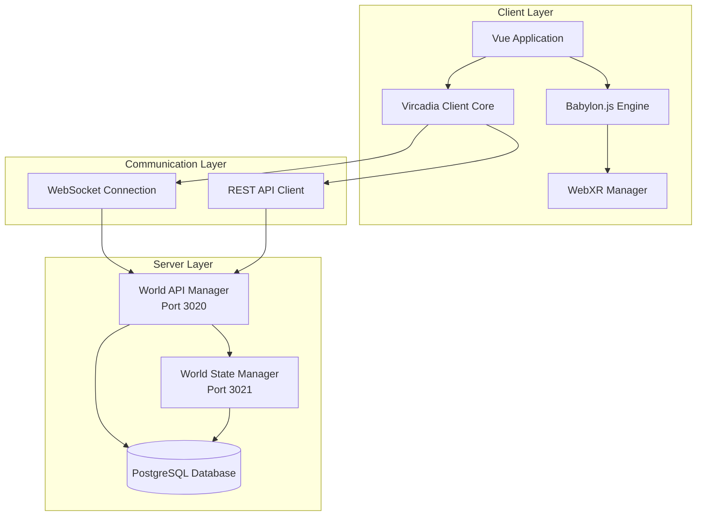
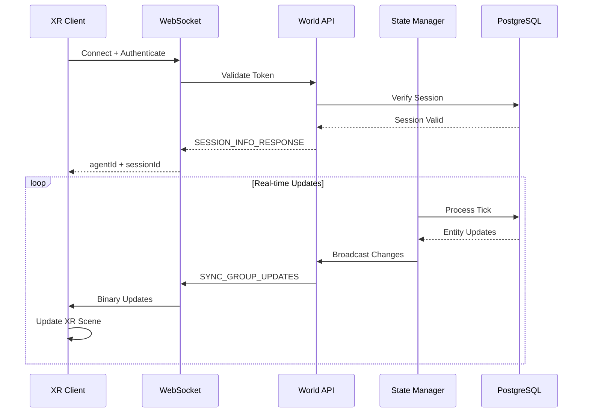
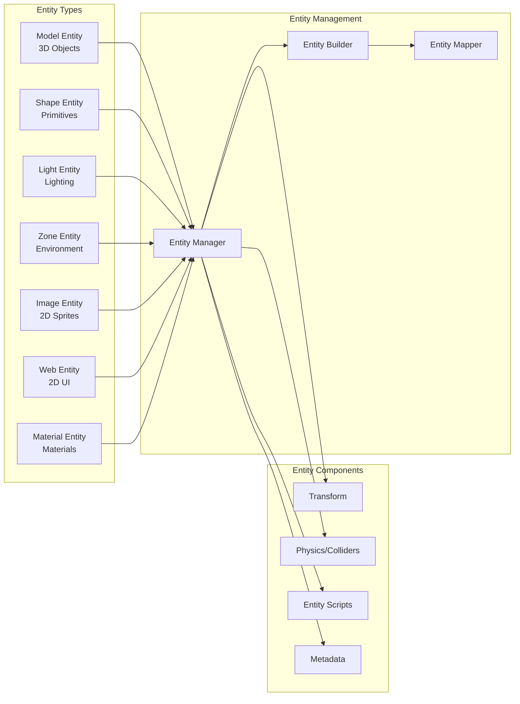

# XR/Vircadia Integration Documentation

## Table of Contents

1. [Overview](#overview)
2. [Architecture](#architecture)
3. [Setup & Installation](#setup--installation)
4. [Core Components](#core-components)
5. [XR Features](#xr-features)
6. [API Reference](#api-reference)
7. [Integration Patterns](#integration-patterns)
8. [Troubleshooting](#troubleshooting)
9. [Best Practices](#best-practices)

---

## Overview

### What is Vircadia?

Vircadia is an open-source metaverse platform that provides real-time, multi-user virtual world capabilities with comprehensive XR support. The integration combines Babylon.js for WebXR rendering with a robust TypeScript/Bun backend architecture.

### Key Capabilities

- **Real-time Multi-user Synchronization**: Tick-based state synchronization with configurable tick rates
- **WebXR Support**: Full VR/AR capabilities through WebXR API with Babylon.js
- **Entity System**: Flexible entity-component architecture supporting multiple entity types
- **WebRTC Integration**: Peer-to-peer voice and video communication
- **Asset Management**: Binary asset storage with automatic synchronization
- **Authentication**: Multi-provider auth system with JWT tokens

### Technology Stack

| Component | Technology | Purpose |
|-----------|-----------|---------|
| **Frontend** | Vue 3 + Babylon.js | XR rendering and UI |
| **Backend** | Bun + TypeScript | High-performance server runtime |
| **Database** | PostgreSQL | Entity and state persistence |
| **Transport** | WebSocket + REST | Real-time and request/response communication |
| **XR Engine** | Babylon.js WebXR | VR/AR capabilities |

---

## Architecture

### System Architecture



### Data Flow Architecture



### Entity System Architecture



---

## Setup & Installation

### Prerequisites

```bash
# Required software
- Node.js 18+ or Bun 1.0+
- PostgreSQL 14+
- Docker & Docker Compose (recommended)
- WebXR-compatible browser (Chrome, Edge, or Firefox)
```

### Quick Start with Docker

```bash
# 1. Clone the repository
git clone <vircadia-repo>
cd vircadia-world

# 2. Start services with Docker Compose
cd server/service
docker compose -f server.docker.compose.yml up -d

# 3. Wait for services to be healthy
bun run cli server:postgres:health --timeout 30000
bun run cli server:world-api-manager:health --timeout 30000

# 4. Run database migrations
bun run cli server:postgres:migrate

# 5. Seed initial data
bun run cli server:postgres:seed:sql
bun run cli server:postgres:seed:assets

# 6. Generate system token for authentication
export SYSTEM_TOKEN=$(bun run cli server:postgres:system-token true)
echo "System Token: $SYSTEM_TOKEN"
```

### Manual Installation

#### Backend Setup

```bash
# Install dependencies
cd server/vircadia-world
bun install

# Configure environment
cp cli/.env.example cli/.env
# Edit cli/.env with your settings

# Start PostgreSQL (if not using Docker)
# Configure connection settings in cli/.env

# Run migrations
bun run cli server:postgres:migrate

# Start API server
cd server/service/api/volume/app
bun run world.api.manager.ts

# Start State Manager (in separate terminal)
cd server/service/state/volume/app
bun run world.state.manager.ts
```

#### Frontend Setup

```bash
# Install client dependencies
cd client/web_babylon_js
bun install

# Configure API endpoint
export VRCA_CLIENT_WEB_BABYLON_JS_DEFAULT_WORLD_API_URI="localhost:3020"

# Start development server
bun run dev

# Build for production
bun run build
```

### Environment Configuration

#### Server Configuration (`cli/.env`)

```bash
# PostgreSQL Configuration
VRCA_CLI_SERVICE_POSTGRES_HOST=localhost
VRCA_CLI_SERVICE_POSTGRES_PORT=5432
VRCA_CLI_SERVICE_POSTGRES_DATABASE=vircadia_world
VRCA_CLI_SERVICE_POSTGRES_SUPER_USER_USERNAME=postgres
VRCA_CLI_SERVICE_POSTGRES_SUPER_USER_PASSWORD=your_password

# World API Manager
VRCA_CLI_SERVICE_WORLD_API_MANAGER_HOST=localhost
VRCA_CLI_SERVICE_WORLD_API_MANAGER_PORT=3020

# World State Manager
VRCA_CLI_SERVICE_WORLD_STATE_MANAGER_HOST=localhost
VRCA_CLI_SERVICE_WORLD_STATE_MANAGER_PORT=3021

# Debug Settings
VRCA_CLI_DEBUG=true
VRCA_CLI_SUPPRESS=false
```

#### Client Configuration

```typescript
// src/vircadia.browser.config.ts
export const browserConfiguration = {
    VRCA_CLIENT_WEB_BABYLON_JS_DEFAULT_WORLD_API_URI:
        import.meta.env.VITE_WORLD_API_URI || "localhost:3020",

    VRCA_CLIENT_WEB_BABYLON_JS_DEFAULT_AUTH_PROVIDER: "system",

    // XR Settings
    VRCA_CLIENT_WEBXR_ENABLED: true,
    VRCA_CLIENT_WEBXR_FLOOR_MESH_ENABLED: true,
    VRCA_CLIENT_WEBXR_TELEPORTATION_ENABLED: true,
};
```

---

## Core Components

### 1. Client Core (`ClientCore`)

The main class coordinating all client-side Vircadia operations.

```typescript
import { ClientCore } from "@vircadia/web-sdk";

// Initialize client
const client = new ClientCore({
    serverUrl: "ws://localhost:3020/world/ws",
    authToken: "your-jwt-token",
    authProvider: "system",
    reconnectAttempts: 5,
    reconnectDelay: 5000,
    debug: true
});

// Connection management
await client.Utilities.Connection.connect({ timeoutMs: 30000 });

const info = client.Utilities.Connection.getConnectionInfo();
console.log("Connected:", info.isConnected);
console.log("Agent ID:", info.agentId);
console.log("Session ID:", info.sessionId);

// Query entities
const entities = await client.Utilities.Connection.query<Entity[]>({
    query: "SELECT * FROM entity.entities WHERE group__sync = $1",
    parameters: ["public.NORMAL"],
    timeoutMs: 10000
});

// Listen for connection events
client.Utilities.Connection.addEventListener("statusChange", () => {
    const info = client.Utilities.Connection.getConnectionInfo();
    console.log("Status changed:", info.status);
});

// Cleanup
client.dispose();
```

### 2. WebSocket Communication

#### Message Types

```typescript
enum MessageType {
    GENERAL_ERROR_RESPONSE = "GENERAL_ERROR_RESPONSE",
    QUERY_REQUEST = "QUERY_REQUEST",
    QUERY_RESPONSE = "QUERY_RESPONSE",
    SYNC_GROUP_UPDATES_RESPONSE = "SYNC_GROUP_UPDATES_RESPONSE",
    TICK_NOTIFICATION_RESPONSE = "TICK_NOTIFICATION_RESPONSE",
    SESSION_INFO_RESPONSE = "SESSION_INFO_RESPONSE"
}
```

#### Query Request Example

```typescript
// Query request message structure
const queryMessage = {
    type: "QUERY_REQUEST",
    timestamp: Date.now(),
    requestId: crypto.randomUUID(),
    query: "SELECT * FROM entity.entities",
    parameters: [],
    errorMessage: null
};

// Send via WebSocket
const response = await client.Utilities.Connection.query({
    query: "SELECT * FROM entity.entities WHERE general__entity_name = $1",
    parameters: ["MyEntity"],
    timeoutMs: 5000
});
```

#### Tick Notifications

```typescript
// Tick notification structure
interface TickNotification {
    type: "TICK_NOTIFICATION_RESPONSE";
    timestamp: number;
    requestId: string;
    tick: {
        general__tick_id: string;
        tick__number: number;
        tick__start_time: Date;
        tick__end_time: Date;
        tick__duration_ms: number;
        tick__entity_states_processed: number;
    };
}
```

### 3. Entity Management

#### Entity Schema

```typescript
interface Entity {
    // Core fields
    general__entity_name: string;
    general__semantic_version: string;
    general__created_at?: string;
    general__updated_at?: string;
    general__created_by?: string;
    general__updated_by?: string;

    // Synchronization
    group__sync: string;
    group__load_priority: number;

    // Metadata
    meta__data?: unknown;

    // Expiry configuration
    general__expiry__delete_since_updated_at_ms?: number;
    general__expiry__delete_since_created_at_ms?: number;
}
```

#### Entity Metadata

```typescript
interface EntityMetadata {
    general__entity_name: string;
    metadata__key: string;
    metadata__value: unknown;
    group__sync: string;
    general__created_at?: string;
    general__updated_at?: string;
}
```

#### Asset Management

```typescript
interface EntityAsset {
    general__asset_file_name: string;
    asset__data__bytea?: Buffer;
    asset__mime_type?: string;
    asset__data__bytea_updated_at?: string;
    group__sync?: string;
}

// Upload asset via CLI
await Server_CLI.seedAssets({
    options: {
        parallelProcessing: true,
        batchSize: 10,
        syncGroup: "public.NORMAL"
    }
});

// Download assets
await Server_CLI.downloadAssetsFromDatabase({
    options: {
        syncGroup: "public.NORMAL",
        outputDir: "./assets"
    }
});
```

### 4. Authentication System

#### Auth Providers

```typescript
interface AuthProvider {
    auth__agent_id: string;
    auth__provider_name: string;
    auth__provider_uid: string;
    auth__refresh_token?: string;
    auth__provider_email?: string;
    auth__is_primary: boolean;
    auth__metadata?: Record<string, any>;
}
```

#### Session Management

```typescript
interface Session {
    general__session_id: string;
    auth__agent_id: string;
    auth__provider_name: string;
    session__started_at?: string;
    session__last_seen_at?: string;
    session__expires_at: string;
    session__jwt?: string;
    session__is_active: boolean;
}

// Generate system token
const { token, sessionId, agentId } =
    await Server_CLI.generateDbSystemToken();

// Validate token via REST
const response = await fetch(
    "http://localhost:3020/world/rest/session/validate",
    {
        method: "POST",
        headers: { "Content-Type": "application/json" },
        body: JSON.stringify({
            token: "your-jwt-token",
            provider: "system"
        })
    }
);
```

#### Sync Groups & Permissions

```typescript
interface SyncGroup {
    general__sync_group: string;
    general__description?: string;

    // Tick configuration
    server__tick__rate_ms: number;
    server__tick__max_tick_count_buffer: number;

    // Client settings
    client__render_delay_ms: number;
    client__max_prediction_time_ms: number;

    // Network settings
    network__packet_timing_variance_ms: number;
}

interface SyncGroupRole {
    auth__agent_id: string;
    group__sync: string;
    permissions__can_insert: boolean;
    permissions__can_update: boolean;
    permissions__can_delete: boolean;
}
```

---

## XR Features

### WebXR Integration with Babylon.js

#### Basic XR Setup

```typescript
import { Engine, Scene, WebXRDefaultExperience } from "@babylonjs/core";

// Initialize Babylon.js engine
const canvas = document.getElementById("renderCanvas") as HTMLCanvasElement;
const engine = new Engine(canvas, true);
const scene = new Scene(engine);

// Create XR experience
const xrHelper = await scene.createDefaultXRExperienceAsync({
    floorMeshes: [ground],
    optionalFeatures: true
});

// Check XR support
if (xrHelper.baseExperience) {
    console.log("WebXR supported!");

    // Enter VR
    await xrHelper.baseExperience.enterXRAsync(
        "immersive-vr",
        "local-floor"
    );
}
```

#### XR Camera Setup

```vue
<!-- BabylonScene.vue -->
<template>
    <canvas ref="renderCanvas" class="render-canvas"></canvas>
</template>

<script setup lang="ts">
import { onMounted, ref } from "vue";
import { useBabylonEnvironment } from "@/composables/useBabylonEnvironment";

const renderCanvas = ref<HTMLCanvasElement>();

onMounted(async () => {
    if (!renderCanvas.value) return;

    // Initialize XR environment
    const { engine, scene, xrHelper } = await useBabylonEnvironment({
        canvas: renderCanvas.value,
        enableXR: true,
        floorMeshEnabled: true
    });

    // Configure XR features
    if (xrHelper) {
        // Enable teleportation
        const teleportation = xrHelper.teleportation;
        if (teleportation) {
            teleportation.attach();
        }

        // Enable pointer selection
        const pointerSelection = xrHelper.pointerSelection;
        if (pointerSelection) {
            pointerSelection.attach();
        }
    }

    // Start render loop
    engine.runRenderLoop(() => {
        scene.render();
    });
});
</script>
```

#### XR Controller Input

```typescript
import { WebXRInputSource } from "@babylonjs/core";

// Handle controller input
xrHelper.input.onControllerAddedObservable.add((controller) => {
    controller.onMotionControllerInitObservable.add((motionController) => {
        // Handle trigger button
        const triggerComponent = motionController.getComponentOfType("trigger");
        if (triggerComponent) {
            triggerComponent.onButtonStateChangedObservable.add((component) => {
                if (component.pressed) {
                    console.log("Trigger pressed!");
                    handleTriggerPress(controller);
                }
            });
        }

        // Handle thumbstick
        const thumbstickComponent = motionController.getComponentOfType("thumbstick");
        if (thumbstickComponent) {
            thumbstickComponent.onAxisValueChangedObservable.add((axes) => {
                handleThumbstickMovement(axes.x, axes.y);
            });
        }
    });
});
```

### Avatar System

#### Avatar Loading

```typescript
// useBabylonAvatarModelLoader.ts
import { SceneLoader } from "@babylonjs/core";

export async function loadAvatar(scene: Scene, modelUrl: string) {
    const result = await SceneLoader.ImportMeshAsync(
        "",
        "",
        modelUrl,
        scene
    );

    const avatar = result.meshes[0];
    avatar.scaling = new Vector3(1, 1, 1);
    avatar.position = new Vector3(0, 0, 0);

    return {
        mesh: avatar,
        meshes: result.meshes,
        skeletons: result.skeletons,
        animationGroups: result.animationGroups
    };
}
```

#### Avatar Animation

```typescript
// useBabylonAvatarAnimationLoader.ts
export function setupAvatarAnimations(
    scene: Scene,
    skeleton: Skeleton,
    animations: AnimationGroup[]
) {
    const animationMap = new Map<string, AnimationGroup>();

    animations.forEach(anim => {
        animationMap.set(anim.name, anim);
        anim.stop();
    });

    return {
        play: (animationName: string, loop = true) => {
            const anim = animationMap.get(animationName);
            if (anim) {
                anim.start(loop);
            }
        },
        stop: (animationName: string) => {
            const anim = animationMap.get(animationName);
            if (anim) {
                anim.stop();
            }
        },
        stopAll: () => {
            animations.forEach(anim => anim.stop());
        }
    };
}
```

#### Multi-User Avatar Synchronization

```vue
<!-- BabylonOtherAvatar.vue -->
<script setup lang="ts">
import { watch, onUnmounted } from "vue";
import { useVircadia } from "@/composables/useVircadia";

const props = defineProps<{
    agentId: string;
}>();

const { client } = useVircadia();
const avatar = ref<any>(null);

// Listen for avatar position updates via WebSocket
watch(() => props.agentId, async (agentId) => {
    if (!agentId) return;

    // Subscribe to avatar updates
    const unsubscribe = client.Utilities.Connection.addEventListener(
        "avatarUpdate",
        (update) => {
            if (update.agentId === agentId && avatar.value) {
                avatar.value.position.copyFrom(update.position);
                avatar.value.rotation.copyFrom(update.rotation);
            }
        }
    );

    onUnmounted(() => unsubscribe());
});
</script>
```

### WebRTC Voice & Video

#### Simple WebRTC Setup

```typescript
// useSimplifiedWebRTC.ts
import { ref, onUnmounted } from "vue";

export function useSimplifiedWebRTC() {
    const localStream = ref<MediaStream | null>(null);
    const peerConnections = new Map<string, RTCPeerConnection>();

    async function startLocalStream() {
        try {
            localStream.value = await navigator.mediaDevices.getUserMedia({
                audio: true,
                video: false
            });
            return localStream.value;
        } catch (error) {
            console.error("Failed to get user media:", error);
            throw error;
        }
    }

    async function createPeerConnection(remoteAgentId: string) {
        const config: RTCConfiguration = {
            iceServers: [
                { urls: "stun:stun.l.google.com:19302" }
            ]
        };

        const pc = new RTCPeerConnection(config);

        // Add local tracks
        if (localStream.value) {
            localStream.value.getTracks().forEach(track => {
                pc.addTrack(track, localStream.value!);
            });
        }

        // Handle remote tracks
        pc.ontrack = (event) => {
            const remoteAudio = new Audio();
            remoteAudio.srcObject = event.streams[0];
            remoteAudio.play();
        };

        // Handle ICE candidates
        pc.onicecandidate = (event) => {
            if (event.candidate) {
                // Send candidate to remote peer via signaling
                sendICECandidate(remoteAgentId, event.candidate);
            }
        };

        peerConnections.set(remoteAgentId, pc);
        return pc;
    }

    async function createOffer(remoteAgentId: string) {
        const pc = peerConnections.get(remoteAgentId);
        if (!pc) return;

        const offer = await pc.createOffer();
        await pc.setLocalDescription(offer);

        // Send offer via signaling
        sendOffer(remoteAgentId, offer);
    }

    async function handleAnswer(remoteAgentId: string, answer: RTCSessionDescriptionInit) {
        const pc = peerConnections.get(remoteAgentId);
        if (!pc) return;

        await pc.setRemoteDescription(answer);
    }

    async function handleICECandidate(remoteAgentId: string, candidate: RTCIceCandidateInit) {
        const pc = peerConnections.get(remoteAgentId);
        if (!pc) return;

        await pc.addIceCandidate(candidate);
    }

    function cleanup() {
        peerConnections.forEach(pc => pc.close());
        peerConnections.clear();

        if (localStream.value) {
            localStream.value.getTracks().forEach(track => track.stop());
            localStream.value = null;
        }
    }

    onUnmounted(cleanup);

    return {
        localStream,
        startLocalStream,
        createPeerConnection,
        createOffer,
        handleAnswer,
        handleICECandidate,
        cleanup
    };
}
```

---

## API Reference

### REST API Endpoints

#### Session Validation

```http
POST /world/rest/session/validate
Content-Type: application/json

{
    "token": "eyJhbGc...",
    "provider": "system"
}
```

**Response:**
```json
{
    "success": true,
    "timestamp": 1704067200000
}
```

#### Statistics Endpoint

```http
GET /stats
X-Forwarded-For: 127.0.0.1
```

**Response:**
```json
{
    "uptime": 3600000,
    "connections": {
        "active": { "current": 5, "average": 3.2, "p99": 10, "p999": 15 },
        "total": 150,
        "failed": 2,
        "successRate": 0.987
    },
    "database": {
        "connected": true,
        "connections": { "current": 3, "average": 2.5, "p99": 5, "p999": 8 }
    },
    "memory": {
        "heapUsed": { "current": 45000000, "average": 42000000, "p99": 50000000, "p999": 55000000 },
        "heapTotal": { "current": 60000000, "average": 58000000, "p99": 65000000, "p999": 70000000 }
    },
    "queries": {
        "queriesPerSecond": { "current": 15.5, "average": 12.3, "peak": 25.0 },
        "queryCompletionTime": { "averageMs": 5.2, "p99Ms": 15.0, "p999Ms": 30.0 }
    }
}
```

### CLI Commands

#### Server Management

```bash
# Start services
bun run cli server:run-command up -d

# Stop services
bun run cli server:run-command down

# Health checks
bun run cli server:postgres:health --timeout 30000
bun run cli server:world-api-manager:health
bun run cli server:world-state-manager:health
bun run cli server:pgweb:health
```

#### Database Operations

```bash
# Run migrations
bun run cli server:postgres:migrate

# Wipe database (dangerous!)
bun run cli server:postgres:wipe

# Seed SQL data
bun run cli server:postgres:seed:sql

# Seed assets
bun run cli server:postgres:seed:assets

# Backup database
bun run cli server:postgres:backup

# Restore database
bun run cli server:postgres:restore

# Get connection string
bun run cli server:postgres:connection-string
```

#### Authentication

```bash
# Generate system token
bun run cli server:postgres:system-token

# Generate token (print only)
export TOKEN=$(bun run cli server:postgres:system-token true)

# Invalidate all system tokens
bun run cli server:postgres:system-token:invalidate-all
```

#### Database Access

```bash
# Access PGWeb UI
bun run cli server:pgweb:access-command
# Opens: http://localhost:8081
```

---

## Integration Patterns

### Pattern 1: Real-time Entity Synchronization

```typescript
// EntitySyncManager.ts
import { ClientCore } from "@vircadia/web-sdk";
import { Scene, Mesh, TransformNode } from "@babylonjs/core";

export class EntitySyncManager {
    private client: ClientCore;
    private scene: Scene;
    private entityMeshes = new Map<string, TransformNode>();

    constructor(client: ClientCore, scene: Scene) {
        this.client = client;
        this.scene = scene;
        this.setupSyncUpdates();
    }

    private setupSyncUpdates() {
        // Listen for sync group updates
        this.client.Utilities.Connection.addEventListener(
            "syncUpdate",
            this.handleSyncUpdate.bind(this)
        );
    }

    private async handleSyncUpdate(update: any) {
        // Parse entity updates
        const entities = update.entities || [];

        for (const entity of entities) {
            await this.updateEntity(entity);
        }
    }

    private async updateEntity(entity: Entity) {
        let mesh = this.entityMeshes.get(entity.general__entity_name);

        if (!mesh) {
            // Create new mesh
            mesh = await this.createEntityMesh(entity);
            this.entityMeshes.set(entity.general__entity_name, mesh);
        }

        // Update transform from metadata
        if (entity.meta__data) {
            const transform = entity.meta__data as any;
            if (transform.position) {
                mesh.position.copyFromFloats(
                    transform.position.x,
                    transform.position.y,
                    transform.position.z
                );
            }
            if (transform.rotation) {
                mesh.rotation.copyFromFloats(
                    transform.rotation.x,
                    transform.rotation.y,
                    transform.rotation.z
                );
            }
            if (transform.scale) {
                mesh.scaling.copyFromFloats(
                    transform.scale.x,
                    transform.scale.y,
                    transform.scale.z
                );
            }
        }
    }

    private async createEntityMesh(entity: Entity): Promise<TransformNode> {
        // Implementation depends on entity type
        const mesh = new TransformNode(entity.general__entity_name, this.scene);
        return mesh;
    }

    dispose() {
        this.entityMeshes.forEach(mesh => mesh.dispose());
        this.entityMeshes.clear();
    }
}
```

### Pattern 2: XR Teleportation System

```typescript
// XRTeleportationManager.ts
import {
    Scene,
    WebXRDefaultExperience,
    Mesh,
    Vector3,
    Color3
} from "@babylonjs/core";

export class XRTeleportationManager {
    private xr: WebXRDefaultExperience;
    private scene: Scene;
    private teleportMeshes: Mesh[] = [];

    constructor(xr: WebXRDefaultExperience, scene: Scene) {
        this.xr = xr;
        this.scene = scene;
        this.setupTeleportation();
    }

    private setupTeleportation() {
        const teleportation = this.xr.teleportation;
        if (!teleportation) return;

        // Add all floor meshes as teleportation targets
        this.teleportMeshes.forEach(mesh => {
            teleportation.addFloorMesh(mesh);
        });

        // Configure teleportation behavior
        teleportation.parabolicCheckRadius = 5;
        teleportation.parabolicRayEnabled = true;
        teleportation.straightRayEnabled = true;

        // Custom teleportation validation
        teleportation.onTargetMeshPositionUpdatedObservable.add((pickInfo) => {
            if (pickInfo) {
                const isValid = this.validateTeleportLocation(pickInfo.pickedPoint);
                teleportation.setSelectionFeature
                    .getMeshUnderPointer()
                    ?.material
                    ?.emissiveColor
                    .copyFrom(isValid ? Color3.Green() : Color3.Red());
            }
        });
    }

    addTeleportMesh(mesh: Mesh) {
        this.teleportMeshes.push(mesh);
        this.xr.teleportation?.addFloorMesh(mesh);
    }

    removeTeleportMesh(mesh: Mesh) {
        const index = this.teleportMeshes.indexOf(mesh);
        if (index > -1) {
            this.teleportMeshes.splice(index, 1);
            this.xr.teleportation?.removeFloorMesh(mesh);
        }
    }

    private validateTeleportLocation(position: Vector3): boolean {
        // Custom validation logic
        // e.g., check if position is within allowed zones
        return true;
    }
}
```

### Pattern 3: Multi-User Voice Chat

```typescript
// VoiceChatManager.ts
import { ClientCore } from "@vircadia/web-sdk";
import { useSimplifiedWebRTC } from "@/composables/useSimplifiedWebRTC";

export class VoiceChatManager {
    private client: ClientCore;
    private webRTC: ReturnType<typeof useSimplifiedWebRTC>;
    private activeUsers = new Map<string, RTCPeerConnection>();

    constructor(client: ClientCore) {
        this.client = client;
        this.webRTC = useSimplifiedWebRTC();
        this.setupVoiceChat();
    }

    private async setupVoiceChat() {
        // Start local audio stream
        await this.webRTC.startLocalStream();

        // Listen for new users joining
        this.client.Utilities.Connection.addEventListener(
            "userJoined",
            this.handleUserJoined.bind(this)
        );

        // Listen for users leaving
        this.client.Utilities.Connection.addEventListener(
            "userLeft",
            this.handleUserLeft.bind(this)
        );

        // Handle WebRTC signaling messages
        this.client.Utilities.Connection.addEventListener(
            "webrtcSignaling",
            this.handleSignaling.bind(this)
        );
    }

    private async handleUserJoined(user: { agentId: string }) {
        // Create peer connection
        const pc = await this.webRTC.createPeerConnection(user.agentId);
        this.activeUsers.set(user.agentId, pc);

        // Create and send offer
        await this.webRTC.createOffer(user.agentId);
    }

    private handleUserLeft(user: { agentId: string }) {
        const pc = this.activeUsers.get(user.agentId);
        if (pc) {
            pc.close();
            this.activeUsers.delete(user.agentId);
        }
    }

    private async handleSignaling(message: any) {
        switch (message.type) {
            case "offer":
                // Handle incoming offer
                break;
            case "answer":
                await this.webRTC.handleAnswer(message.from, message.answer);
                break;
            case "ice-candidate":
                await this.webRTC.handleICECandidate(message.from, message.candidate);
                break;
        }
    }

    dispose() {
        this.webRTC.cleanup();
        this.activeUsers.clear();
    }
}
```

---

## Troubleshooting

### Common Issues

#### 1. WebSocket Connection Fails

**Symptoms:**
- "WebSocket connection failed" errors
- Client cannot connect to server
- Immediate disconnections

**Solutions:**

```bash
# Check if services are running
docker ps | grep vircadia

# Check API manager health
curl http://localhost:3020/stats

# Check WebSocket endpoint
wscat -c ws://localhost:3020/world/ws?token=YOUR_TOKEN&provider=system

# Verify firewall/network settings
netstat -tuln | grep 3020
```

**Configuration Check:**

```typescript
// Ensure correct WebSocket URL format
const wsUrl = "ws://localhost:3020/world/ws"; // HTTP
const wssUrl = "wss://yourdomain.com/world/ws"; // HTTPS

// Include auth parameters
const url = new URL(wsUrl);
url.searchParams.set("token", authToken);
url.searchParams.set("provider", "system");
```

#### 2. Authentication Errors

**Symptoms:**
- 401 Unauthorized responses
- "Invalid token" errors
- Session validation fails

**Solutions:**

```bash
# Generate new system token
export TOKEN=$(bun run cli server:postgres:system-token true)

# Verify token is valid
curl -X POST http://localhost:3020/world/rest/session/validate \
  -H "Content-Type: application/json" \
  -d "{\"token\":\"$TOKEN\",\"provider\":\"system\"}"

# Check session in database
psql -U postgres -d vircadia_world \
  -c "SELECT * FROM auth.agent_sessions WHERE session__is_active = true;"

# Invalidate old tokens
bun run cli server:postgres:system-token:invalidate-all
```

#### 3. Database Migration Issues

**Symptoms:**
- "relation does not exist" errors
- Missing tables or columns
- Migration version conflicts

**Solutions:**

```bash
# Check migration status
psql -U postgres -d vircadia_world \
  -c "SELECT * FROM config.migrations ORDER BY general__executed_at;"

# Reset database (CAUTION: destroys all data)
bun run cli server:postgres:wipe
bun run cli server:postgres:migrate

# Manual migration verification
psql -U postgres -d vircadia_world -c "\dt entity.*"
psql -U postgres -d vircadia_world -c "\dt auth.*"
```

#### 4. XR Session Not Starting

**Symptoms:**
- WebXR not available
- VR mode button not appearing
- "WebXR not supported" errors

**Solutions:**

```typescript
// Check WebXR availability
if (!navigator.xr) {
    console.error("WebXR not supported");
    // Provide fallback or error message
}

// Check for secure context (HTTPS required)
if (!window.isSecureContext) {
    console.error("WebXR requires HTTPS");
}

// Verify browser support
const supported = await navigator.xr.isSessionSupported("immersive-vr");
console.log("VR supported:", supported);

// Enable WebXR polyfill for development
import WebXRPolyfill from "webxr-polyfill";
const polyfill = new WebXRPolyfill();
```

**Browser Requirements:**
- Chrome/Edge 79+ (recommended)
- Firefox 98+
- Must be served over HTTPS (except localhost)
- WebXR device API enabled in browser flags

#### 5. Entity Synchronization Delays

**Symptoms:**
- Entities appear laggy or delayed
- Position updates not smooth
- High latency

**Solutions:**

```typescript
// Optimize tick rate in sync group
const optimizedSyncGroup = {
    server__tick__rate_ms: 16, // ~60 tps
    client__render_delay_ms: 50,
    client__max_prediction_time_ms: 100,
    network__packet_timing_variance_ms: 20
};

// Enable client-side prediction
class EntityPredictor {
    predict(entity: Entity, deltaTime: number) {
        // Extrapolate position based on velocity
        if (entity.meta__data?.velocity) {
            const predicted = {
                x: entity.position.x + entity.velocity.x * deltaTime,
                y: entity.position.y + entity.velocity.y * deltaTime,
                z: entity.position.z + entity.velocity.z * deltaTime
            };
            return predicted;
        }
        return entity.position;
    }
}

// Monitor network performance
client.Utilities.Connection.addEventListener("statusChange", () => {
    const info = client.Utilities.Connection.getConnectionInfo();
    console.log("Pending requests:", info.pendingRequests.length);
    console.log("Connection duration:", info.connectionDuration);
});
```

#### 6. Asset Loading Failures

**Symptoms:**
- 3D models not appearing
- Textures missing
- Asset download errors

**Solutions:**

```bash
# Verify assets are seeded
bun run cli server:postgres:seed:assets

# Check asset in database
psql -U postgres -d vircadia_world \
  -c "SELECT general__asset_file_name, asset__mime_type,
      LENGTH(asset__data__bytea) as size_bytes
      FROM entity.entity_assets LIMIT 10;"

# Download assets for inspection
bun run cli server:postgres:download-assets --sync-group public.NORMAL

# Verify asset paths in entities
psql -U postgres -d vircadia_world \
  -c "SELECT general__entity_name, meta__data->>'modelUrl'
      FROM entity.entities WHERE meta__data->>'modelUrl' IS NOT NULL;"
```

**Asset URL Format:**
```typescript
// Correct asset URLs
const assetUrl = "/assets/models/mymodel.glb"; // Relative
const assetUrl = "https://cdn.example.com/models/mymodel.glb"; // Absolute

// Babylon.js asset loading with error handling
try {
    const result = await SceneLoader.ImportMeshAsync(
        "",
        "",
        assetUrl,
        scene,
        (progress) => {
            console.log(`Loading: ${progress.loaded / progress.total * 100}%`);
        }
    );
} catch (error) {
    console.error("Asset loading failed:", error);
    // Load fallback model
}
```

### Performance Optimization

#### Client-Side Optimization

```typescript
// Reduce draw calls with instancing
import { InstancedMesh } from "@babylonjs/core";

class InstancedEntityManager {
    private masterMesh: Mesh;
    private instances = new Map<string, InstancedMesh>();

    createInstance(entityId: string, position: Vector3) {
        const instance = this.masterMesh.createInstance(entityId);
        instance.position = position;
        this.instances.set(entityId, instance);
        return instance;
    }
}

// Use LOD (Level of Detail)
import { Mesh } from "@babylonjs/core";

mesh.addLODLevel(50, detailedMesh);
mesh.addLODLevel(100, mediumMesh);
mesh.addLODLevel(200, lowPolyMesh);
mesh.addLODLevel(500, null); // Culled

// Optimize rendering
scene.autoClear = false;
scene.autoClearDepthAndStencil = false;
scene.skipPointerMovePicking = true;
scene.blockMaterialDirtyMechanism = true;

// Enable hardware scaling for performance
engine.setHardwareScalingLevel(1 / window.devicePixelRatio);
```

#### Server-Side Optimization

```bash
# Optimize PostgreSQL
# Edit postgresql.conf
shared_buffers = 256MB
effective_cache_size = 1GB
max_connections = 100
work_mem = 16MB

# Create indexes for common queries
psql -U postgres -d vircadia_world <<EOF
CREATE INDEX idx_entities_sync_group ON entity.entities(group__sync);
CREATE INDEX idx_entities_name ON entity.entities(general__entity_name);
CREATE INDEX idx_sessions_active ON auth.agent_sessions(session__is_active)
  WHERE session__is_active = true;
EOF

# Monitor query performance
psql -U postgres -d vircadia_world \
  -c "SELECT * FROM pg_stat_statements ORDER BY total_time DESC LIMIT 10;"
```

### Debugging Tools

#### Enable Debug Logging

```typescript
// Client-side
const client = new ClientCore({
    serverUrl: "ws://localhost:3020/world/ws",
    authToken: token,
    authProvider: "system",
    debug: true,  // Enable verbose logging
    suppress: false
});

// Server-side (environment variables)
VRCA_CLI_DEBUG=true
VRCA_CLI_SUPPRESS=false
VRCA_SERVER_DEBUG=true
```

#### WebSocket Debugging

```bash
# Use wscat for interactive WebSocket testing
npm install -g wscat

# Connect to server
wscat -c "ws://localhost:3020/world/ws?token=YOUR_TOKEN&provider=system"

# Send query
> {"type":"QUERY_REQUEST","timestamp":1704067200000,"requestId":"test-123","query":"SELECT * FROM entity.entities LIMIT 1","parameters":[],"errorMessage":null}

# Monitor WebSocket traffic in browser DevTools
# 1. Open DevTools (F12)
# 2. Go to Network tab
# 3. Filter by WS (WebSocket)
# 4. Click on connection to see frames
```

#### Database Debugging

```bash
# Access PGWeb UI
bun run cli server:pgweb:access-command
# Navigate to http://localhost:8081

# Direct PostgreSQL access
psql -U postgres -h localhost -p 5432 -d vircadia_world

# Monitor active connections
SELECT * FROM pg_stat_activity WHERE datname = 'vircadia_world';

# Check table sizes
SELECT
    schemaname,
    tablename,
    pg_size_pretty(pg_total_relation_size(schemaname||'.'||tablename)) AS size
FROM pg_tables
ORDER BY pg_total_relation_size(schemaname||'.'||tablename) DESC;
```

---

## Best Practices

### 1. Connection Management

```typescript
// Use connection pooling and retries
class RobustVircadiaClient {
    private client: ClientCore;
    private maxRetries = 3;
    private retryDelay = 5000;

    async connect() {
        let attempts = 0;

        while (attempts < this.maxRetries) {
            try {
                await this.client.Utilities.Connection.connect({
                    timeoutMs: 30000
                });
                console.log("Connected successfully");
                return;
            } catch (error) {
                attempts++;
                console.error(`Connection attempt ${attempts} failed:`, error);

                if (attempts < this.maxRetries) {
                    await new Promise(resolve =>
                        setTimeout(resolve, this.retryDelay)
                    );
                }
            }
        }

        throw new Error("Failed to connect after max retries");
    }

    // Implement heartbeat to detect stale connections
    private startHeartbeat() {
        setInterval(async () => {
            try {
                await this.client.Utilities.Connection.query({
                    query: "SELECT 1",
                    timeoutMs: 5000
                });
            } catch (error) {
                console.error("Heartbeat failed, reconnecting...");
                await this.connect();
            }
        }, 30000); // Every 30 seconds
    }
}
```

### 2. Entity State Management

```typescript
// Use a centralized state store
import { reactive } from "vue";

interface EntityState {
    entities: Map<string, Entity>;
    lastUpdateTime: Map<string, number>;
}

const entityStore = reactive<EntityState>({
    entities: new Map(),
    lastUpdateTime: new Map()
});

// Throttle updates to prevent excessive renders
function throttledUpdateEntity(entity: Entity) {
    const lastUpdate = entityStore.lastUpdateTime.get(entity.general__entity_name) || 0;
    const now = Date.now();

    // Update at most 30 times per second
    if (now - lastUpdate < 33) {
        return;
    }

    entityStore.entities.set(entity.general__entity_name, entity);
    entityStore.lastUpdateTime.set(entity.general__entity_name, now);
}
```

### 3. Error Handling

```typescript
// Comprehensive error handling
class VircadiaErrorHandler {
    handleError(error: unknown, context: string) {
        if (error instanceof Error) {
            // Authentication errors
            if (error.message.includes("401") || error.message.includes("Authentication")) {
                console.error("Authentication failed:", error);
                // Trigger re-authentication flow
                this.refreshAuthentication();
                return;
            }

            // Network errors
            if (error.message.includes("timeout") || error.message.includes("Connection")) {
                console.error("Network error:", error);
                // Attempt reconnection
                this.reconnect();
                return;
            }

            // Database errors
            if (error.message.includes("relation") || error.message.includes("column")) {
                console.error("Database schema error:", error);
                // Alert admin
                this.notifyAdmin(error);
                return;
            }
        }

        // Generic error
        console.error(`Error in ${context}:`, error);
        this.logError(error, context);
    }

    private async refreshAuthentication() {
        // Implementation
    }

    private async reconnect() {
        // Implementation
    }

    private notifyAdmin(error: Error) {
        // Implementation
    }

    private logError(error: unknown, context: string) {
        // Send to logging service
    }
}
```

### 4. Security Best Practices

```typescript
// Never expose sensitive credentials
// ❌ BAD
const client = new ClientCore({
    serverUrl: "ws://localhost:3020/world/ws",
    authToken: "hardcoded-secret-token", // NEVER DO THIS
    authProvider: "system"
});

// ✅ GOOD
const client = new ClientCore({
    serverUrl: import.meta.env.VITE_WORLD_API_URI,
    authToken: await fetchTokenFromSecureEndpoint(),
    authProvider: import.meta.env.VITE_AUTH_PROVIDER
});

// Validate all user input
function sanitizeEntityName(name: string): string {
    // Remove special characters that could cause SQL injection
    return name.replace(/[^a-zA-Z0-9_-]/g, "");
}

// Use parameterized queries
const entities = await client.Utilities.Connection.query({
    query: "SELECT * FROM entity.entities WHERE general__entity_name = $1",
    parameters: [sanitizeEntityName(userInput)], // Parameterized
    timeoutMs: 10000
});

// Implement rate limiting
class RateLimiter {
    private requests = new Map<string, number[]>();
    private maxRequests = 100;
    private windowMs = 60000; // 1 minute

    checkLimit(userId: string): boolean {
        const now = Date.now();
        const userRequests = this.requests.get(userId) || [];

        // Remove old requests outside window
        const validRequests = userRequests.filter(
            time => now - time < this.windowMs
        );

        if (validRequests.length >= this.maxRequests) {
            return false; // Rate limit exceeded
        }

        validRequests.push(now);
        this.requests.set(userId, validRequests);
        return true;
    }
}
```

### 5. XR Best Practices

```typescript
// Optimize for VR performance
class XROptimizer {
    optimizeScene(scene: Scene) {
        // Reduce shadow map size in VR
        scene.lights.forEach(light => {
            if (light instanceof DirectionalLight && light.shadowGenerator) {
                light.shadowGenerator.mapSize = 512; // Lower for VR
                light.shadowGenerator.useBlurExponentialShadowMap = true;
            }
        });

        // Use dynamic resolution scaling
        scene.getEngine().enableOfflineSupport = false;
        scene.skipFrustumClipping = false;
        scene.skipPointerMovePicking = true;

        // Optimize post-processing for VR
        scene.postProcessesEnabled = false; // Disable in VR for performance
    }

    // Implement foveated rendering (if supported)
    enableFoveatedRendering(xr: WebXRDefaultExperience) {
        const foveation = xr.baseExperience.featuresManager.enableFeature(
            "webxr-foveated-rendering",
            "latest",
            { level: 2 } // 0-3, higher = more aggressive
        );
    }

    // Maintain 90fps minimum for VR comfort
    monitorFrameRate(scene: Scene) {
        scene.onBeforeRenderObservable.add(() => {
            const fps = scene.getEngine().getFps();
            if (fps < 90) {
                console.warn("FPS below VR threshold:", fps);
                this.reduceQuality();
            }
        });
    }
}
```

### 6. Testing Strategies

```typescript
// Unit tests for client connection
import { describe, it, expect, beforeEach, afterEach } from "vitest";

describe("ClientCore", () => {
    let client: ClientCore;

    beforeEach(() => {
        client = new ClientCore({
            serverUrl: "ws://localhost:3020/world/ws",
            authToken: "test-token",
            authProvider: "system",
            debug: false
        });
    });

    afterEach(() => {
        client.dispose();
    });

    it("should connect successfully", async () => {
        await client.Utilities.Connection.connect();
        const info = client.Utilities.Connection.getConnectionInfo();
        expect(info.isConnected).toBe(true);
    });

    it("should handle connection timeout", async () => {
        await expect(
            client.Utilities.Connection.connect({ timeoutMs: 100 })
        ).rejects.toThrow("Connection timeout");
    });

    it("should execute queries", async () => {
        await client.Utilities.Connection.connect();
        const result = await client.Utilities.Connection.query({
            query: "SELECT 1 as test",
            timeoutMs: 5000
        });
        expect(result.result).toBeDefined();
    });
});

// Integration tests
describe("XR Integration", () => {
    it("should initialize XR session", async () => {
        const scene = new Scene(engine);
        const xr = await scene.createDefaultXRExperienceAsync();
        expect(xr.baseExperience).toBeDefined();
    });

    it("should sync entity transforms in XR", async () => {
        // Test entity synchronization in XR context
    });
});
```

---

## Additional Resources

### Documentation Links

- [Babylon.js Documentation](https://doc.babylonjs.com/)
- [WebXR Device API](https://immersive-web.github.io/webxr/)
- [PostgreSQL Documentation](https://www.postgresql.org/docs/)
- [Bun Documentation](https://bun.sh/docs)
- [Vue 3 Documentation](https://vuejs.org/)

### Community Resources

- Vircadia Discord: [Join Here](https://discord.gg/vircadia)
- GitHub Repository: [vircadia/vircadia-world](https://github.com/vircadia/vircadia-world)
- WebXR Community: [immersive-web.github.io](https://immersive-web.github.io/)

### Sample Projects

Example implementations are available in the `/client/web_babylon_js` directory:
- Avatar synchronization
- WebRTC voice chat
- Entity management
- XR teleportation
- Multi-user environments

---

## Appendix

### Schema Reference

#### Complete Entity Schema

```sql
CREATE TABLE entity.entities (
    -- Core identification
    general__entity_name VARCHAR(255) PRIMARY KEY,
    general__semantic_version VARCHAR(50) DEFAULT '0.0.1',
    general__created_at TIMESTAMP DEFAULT CURRENT_TIMESTAMP,
    general__created_by VARCHAR(255),
    general__updated_at TIMESTAMP DEFAULT CURRENT_TIMESTAMP,
    general__updated_by VARCHAR(255),
    general__initialized_at TIMESTAMP,
    general__initialized_by VARCHAR(255),

    -- Synchronization
    group__sync VARCHAR(255) NOT NULL,
    group__load_priority INTEGER DEFAULT 0,

    -- Metadata
    meta__data JSONB,

    -- Expiry settings
    general__expiry__delete_since_updated_at_ms BIGINT,
    general__expiry__delete_since_created_at_ms BIGINT,

    -- Foreign keys
    FOREIGN KEY (group__sync) REFERENCES auth.sync_groups(general__sync_group)
);

CREATE INDEX idx_entities_sync ON entity.entities(group__sync);
CREATE INDEX idx_entities_priority ON entity.entities(group__load_priority DESC);
```

#### Complete Auth Schema

```sql
-- Agent profiles
CREATE TABLE auth.agent_profiles (
    general__agent_profile_id VARCHAR(255) PRIMARY KEY,
    profile__username VARCHAR(255) UNIQUE NOT NULL,
    auth__email VARCHAR(255) UNIQUE NOT NULL,
    auth__is_admin BOOLEAN DEFAULT false,
    general__created_at TIMESTAMP DEFAULT CURRENT_TIMESTAMP,
    general__updated_at TIMESTAMP DEFAULT CURRENT_TIMESTAMP
);

-- Auth providers
CREATE TABLE auth.auth_providers_config (
    provider__name VARCHAR(255) PRIMARY KEY,
    provider__enabled BOOLEAN DEFAULT true,
    provider__jwt_secret TEXT NOT NULL,
    provider__session_duration_ms BIGINT DEFAULT 86400000
);

-- Sessions
CREATE TABLE auth.agent_sessions (
    general__session_id VARCHAR(255) PRIMARY KEY,
    auth__agent_id VARCHAR(255) NOT NULL,
    auth__provider_name VARCHAR(255) NOT NULL,
    session__started_at TIMESTAMP DEFAULT CURRENT_TIMESTAMP,
    session__last_seen_at TIMESTAMP DEFAULT CURRENT_TIMESTAMP,
    session__expires_at TIMESTAMP NOT NULL,
    session__jwt TEXT,
    session__is_active BOOLEAN DEFAULT true,
    FOREIGN KEY (auth__agent_id) REFERENCES auth.agent_profiles(general__agent_profile_id),
    FOREIGN KEY (auth__provider_name) REFERENCES auth.auth_providers_config(provider__name)
);
```

### Glossary

- **Agent**: A user or automated entity in the Vircadia system
- **Entity**: Any object in the virtual world (models, lights, zones, etc.)
- **Sync Group**: A logical grouping of entities that share synchronization settings
- **Tick**: A server-side time step for processing entity updates
- **WebXR**: Web standard for VR/AR experiences
- **Session**: An authenticated connection to the Vircadia server
- **Metadata**: Additional JSON data attached to entities
- **Asset**: Binary data (3D models, textures, audio) stored in the database

---

**Document Version**: 1.0.0
**Last Updated**: 2025-10-02
**Maintained By**: VisionFlow/Vircadia Integration Team

For questions or contributions, please open an issue on GitHub or join our Discord community.
