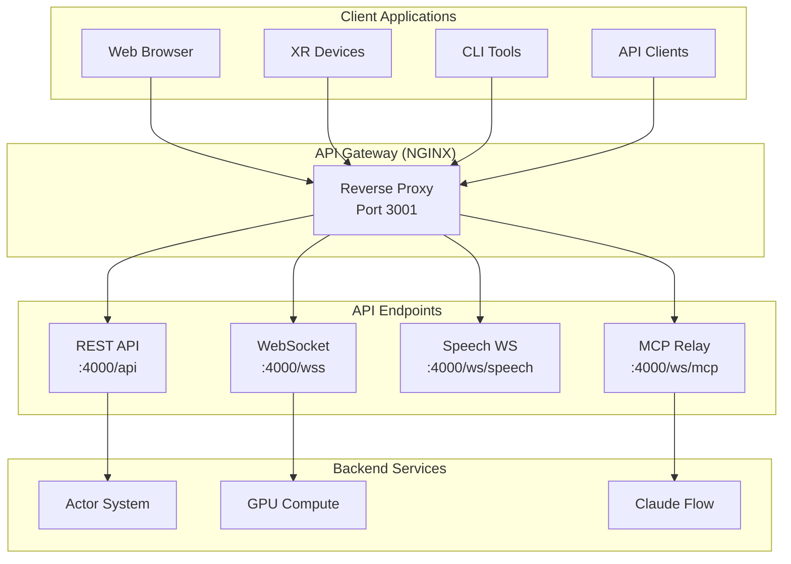

# VisionFlow API Documentation

## Overview

VisionFlow provides multiple API interfaces for different types of communication and functionality:

- **REST API** - Traditional HTTP endpoints for CRUD operations and control
- **WebSocket API** - Real-time bidirectional communication for live updates
- **Binary Protocol** - Optimised binary format for high-frequency position updates
- **MCP Integration** - Model Context Protocol for AI agent orchestration

## API Architecture



## Quick Start

### Base URLs

```bash
# Development
http://localhost:3001/api    # REST API
ws://localhost:3001/wss      # WebSocket
ws://localhost:3001/ws/*     # Specialised WebSockets

# Production
https://api.visionflow.dev/api    # REST API
wss://api.visionflow.dev/wss      # WebSocket
wss://api.visionflow.dev/ws/*     # Specialised WebSockets
```

### Authentication

VisionFlow uses Nostr-based authentication for secure access:

```javascript
// Example authentication request
const response = await fetch('/api/nostr/auth', {
  method: 'POST',
  headers: { 'Content-Type': 'application/json' },
  body: JSON.stringify({
    pubkey: 'user_pubkey_hex',
    signature: 'signature_hex',
    challenge: 'server_challenge'
  })
});

const { token, features } = await response.json();
```

### Making API Requests

#### REST API Example

```javascript
// Fetch graph data
const response = await fetch('/api/graph/data', {
  headers: {
    'Authorization': `Bearer ${token}`,
    'Content-Type': 'application/json'
  }
});

const graphData = await response.json();
```

#### WebSocket Example

```javascript
// Connect to position updates stream
const ws = new WebSocket('ws://localhost:3001/wss');

ws.onopen = () => {
  ws.send(JSON.stringify({ type: 'requestInitialData' }));
};

ws.onmessage = (event) => {
  if (event.data instanceof ArrayBuffer) {
    // Handle binary position data
    const positions = decodeBinaryData(event.data);
  } else {
    // Handle JSON control messages
    const message = JSON.parse(event.data);
  }
};
```

## API Categories

### 📊 Graph Management
- [REST Endpoints](rest/graph.md) - CRUD operations for graph data
- [WebSocket Streaming](websocket/index.md) - Real-time position updates
- [Binary Protocol](../binary-protocol.md) - Efficient position encoding specification

### 🤖 Agent Orchestration
- [Agent Control](rest/bots.md) - Manage AI agents
- [MCP Integration](mcp/index.md) - Claude Flow tools
- [Visualisation Stream](websocket/bots-visualization.md) - Agent state updates

### ⚙️ Configuration
- [Settings API](rest/settings.md) - System configuration
- [User Preferences](rest/user-settings.md) - Personalisation

### 📈 Analytics
- [System Analytics](rest/analytics.md) - Performance metrics
- [Graph Analytics](rest/analytics.md#graph) - Topology analysis
- [GPU Metrics](rest/analytics.md#gpu) - Compute statistics

### 🎮 XR/AR Support
- [Quest 3 Integration](rest/quest3.md) - VR/AR endpoints
- [WebXR Sessions](rest/xr.md) - Immersive experiences

### 🔊 Voice Interaction
- [Speech WebSocket](websocket/speech.md) - Voice streaming
- [TTS/STT Control](rest/speech.md) - Voice configuration

### 🔧 System Operations
- [Health Checks](rest/health.md) - Service status
- [File Management](rest/files.md) - Content processing
- [External Services](rest/integrations.md) - Third-party APIs

## Response Formats

### Standard Success Response

```json
{
  "success": true,
  "data": {
    // Endpoint-specific data
  },
  "metadata": {
    "timestamp": "2024-01-01T00:00:00Z",
    "requestId": "req-123",
    "processingTime": 250
  }
}
```

### Standard Error Response

```json
{
  "success": false,
  "error": {
    "code": "ERROR_CODE",
    "message": "Human-readable error message",
    "details": {
      // Additional error context
    },
    "requestId": "req-123"
  }
}
```

### Pagination Response

```json
{
  "data": [],
  "pagination": {
    "currentPage": 1,
    "totalPages": 10,
    "totalItems": 1000,
    "pageSize": 100,
    "hasNext": true,
    "hasPrevious": false
  }
}
```

## Rate Limiting

All API endpoints implement rate limiting to ensure fair usage:

| Category | Limit | Window | Burst |
|----------|-------|--------|-------|
| Graph Operations | 100/min | 1 minute | 20 |
| Agent Operations | 50/min | 1 minute | 10 |
| Analytics | 200/min | 1 minute | 50 |
| WebSocket Messages | 1000/min | 1 minute | 100 |

Rate limit information is included in response headers:

```http
X-RateLimit-Limit: 100
X-RateLimit-Remaining: 95
X-RateLimit-Reset: 1609459200
```

## Performance Optimisation

### Best Practices

1. **Use Binary Protocol** for high-frequency position updates
2. **Batch Operations** when performing multiple updates
3. **Enable Compression** for large payloads
4. **Implement Caching** for frequently accessed data
5. **Use WebSockets** for real-time requirements

### Bandwidth Comparison

| Protocol | 100 Nodes @ 60fps | 1000 Nodes @ 60fps |
|----------|-------------------|---------------------|
| JSON | 3 MB/s | 30 MB/s |
| Binary | 168 KB/s | 1.68 MB/s |
| Compressed Binary | 100 KB/s | 1 MB/s |

## Security

### Authentication Methods
- **Nostr Protocol** (NIP-07) - Primary authentication
- **Session Tokens** - Temporary access tokens
- **API Keys** - Service-to-service communication

### Security Headers
```http
X-Content-Type-Options: nosniff
X-Frame-Options: DENY
X-XSS-Protection: 1; mode=block
Content-Security-Policy: default-src 'self'
```

## SDK and Client Libraries

### Official SDKs
- [JavaScript/TypeScript SDK](https://github.com/visionflow/js-sdk)
- [Python SDK](https://github.com/visionflow/python-sdk)
- [Rust Client](https://github.com/visionflow/rust-client)

### Quick Installation

```bash
# JavaScript/TypeScript
npm install @visionflow/sdk

# Python
pip install visionflow-sdk

# Rust
cargo add visionflow-client
```

## API Versioning

The API uses URL-based versioning:
- Current version: `v1` (implicit, no version in URL)
- Future versions: `/api/v2/*`

Deprecation notices are provided 6 months before removal.

## Support and Resources

- **API Status**: [status.visionflow.dev](https://status.visionflow.dev)
- **OpenAPI Spec**: [/api/openapi.json](http://localhost:3001/api/openapi.json)
- **Postman Collection**: [Download](https://api.visionflow.dev/postman.json)
- **Support**: [support@visionflow.dev](mailto:support@visionflow.dev)

## Quick Links

- [REST API Reference](rest/index.md)
- [WebSocket Protocols](websocket/index.md)
- [Binary Protocol Spec](../binary-protocol.md)
- [MCP Integration](mcp/index.md)