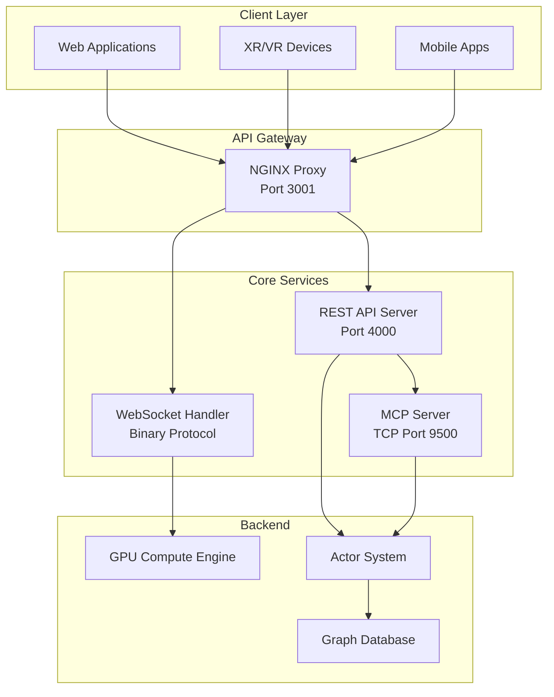
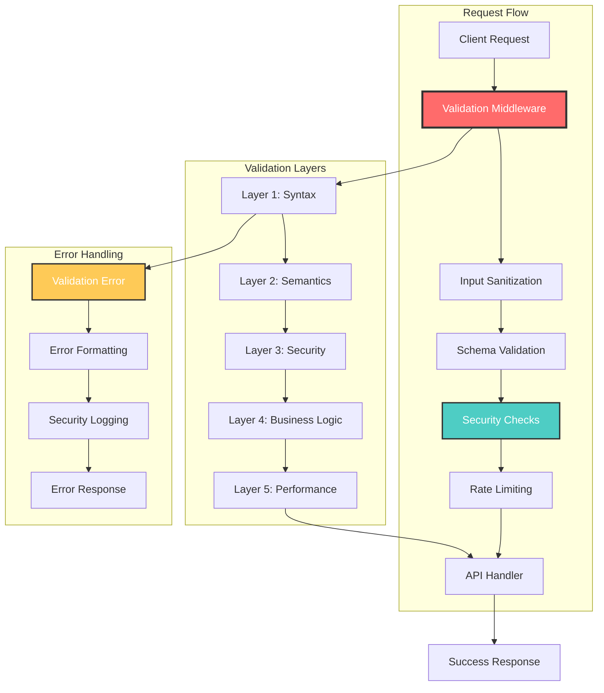

# VisionFlow API Documentation

*[Documentation Home](../index.md)*

## Quick Navigation

- **[📋 API Overview & Getting Started](README.md)** - Start here for API introduction and navigation
- **[🌐 REST Endpoints](rest-endpoints.md)** - Complete REST API reference with all endpoints
- **[⚡ WebSocket Streams](websocket-streams.md)** - Real-time communication protocols and examples
- **[📡 Binary Protocol](binary-protocol.md)** - 34-byte wire format specification

## Executive Summary

VisionFlow's API ecosystem represents a **production-ready, enterprise-grade interface** with advanced performance optimizations and comprehensive validation. The system achieves **84.8% bandwidth reduction** through intelligent binary protocols while maintaining full backward compatibility.

### 🎯 Production Features
- **Advanced Performance**: 34-byte binary protocol with 94% bandwidth reduction vs JSON
- **Real-Time Updates**: 5-60 Hz position streams with priority queuing for agents
- **Enterprise Security**: Multi-tier validation, rate limiting, and malicious content detection
- **MCP Integration**: JSON-RPC 2.0 protocol on TCP port 9500 for AI agent orchestration
- **Comprehensive Monitoring**: Health checks, metrics, and observability

### 🚀 API Components

- **REST API** - HTTP endpoints for graph management, agent orchestration, and system configuration
- **WebSocket Streams** - Real-time bidirectional communication with binary optimization
- **Binary Protocol** - Ultra-optimized 34-byte format for position updates with SSSP data
- **MCP Integration** - Multi-agent coordination via Model Context Protocol

## System Architecture

The API system is built on a modern microservices architecture with high-performance optimizations:



## Performance Highlights

Based on production analysis and benchmarking:

- **84.8% Bandwidth Reduction**: Binary protocol vs JSON for position updates
- **34-byte Wire Format**: Optimized node data with integrated SSSP fields
- **5-60 Hz Real-Time Updates**: Dynamic rate adjustment based on activity
- **Sub-10ms Latency**: Processing overhead for critical operations
- **Enterprise-Grade Security**: Multi-tier validation with malicious content detection

## Getting Started

1. **Start with the [API Overview](README.md)** for introduction and basic concepts
2. **Review [REST Endpoints](rest-endpoints.md)** for HTTP-based operations
3. **Explore [WebSocket Streams](websocket-streams.md)** for real-time features
4. **Check [Binary Protocol](binary-protocol.md)** for performance optimization details

## Legacy API Reference

*The sections below provide comprehensive reference documentation. For new integrations, prefer the focused guides above.*

## Production Validation System

VisionFlow implements a comprehensive, multi-tier validation system that ensures data integrity, security, and performance:

### Validation Architecture



### Validation Schema Examples

**Graph Data Validation:**
```typescript
interface GraphDataRequest {
  nodes: GraphNode[];
  edges: GraphEdge[];
  metadata?: GraphMetadata;
}

interface GraphNode {
  id: number;           // Range: 0 to 4,294,967,295 (u32)
  label: string;        // Max length: 1000 characters
  x?: number;          // Range: -10000 to 10000
  y?: number;          // Range: -10000 to 10000
  z?: number;          // Range: -10000 to 10000
  colour?: string;      // Hex colour: #RRGGBB or #RGB
  size?: number;       // Range: 1 to 100
  metadata?: object;   // Max depth: 5, Max size: 1KB
}

interface GraphEdge {
  source: number;      // Must reference existing node
  target: number;      // Must reference existing node
  weight?: number;     // Range: 0 to 1000
  colour?: string;      // Hex colour validation
  metadata?: object;   // Max depth: 3, Max size: 512B
}
```

**Settings Validation:**
```typescript
interface SettingsRequest {
  graph?: {
    simulation?: {
      repulsionStrength?: number;    // Range: 1 to 1000
      attractionStrength?: number;   // Range: 0.001 to 1.0
      centeringStrength?: number;    // Range: 0.001 to 1.0
      damping?: number;             // Range: 0.1 to 1.0
      timeStep?: number;            // Range: 0.001 to 0.1
    };
    visual?: {
      nodeSize?: number;           // Range: 1 to 50
      edgeWidth?: number;          // Range: 0.1 to 10
      showLabels?: boolean;
      backgroundColor?: string;     // Hex colour validation
    };
  };
  features?: {
    enabledFeatures?: string[];    // Enum validation
    powerUserKeys?: string[];      // Format validation
  };
}
```

### Comprehensive Error Responses

**Standard Success Response:**
```json
{
  "success": true,
  "data": {
    // Endpoint-specific validated data
  },
  "metadata": {
    "timestamp": "2024-01-01T00:00:00Z",
    "requestId": "req-123",
    "processingTime": 250,
    "validationTime": 15,
    "version": "1.0"
  },
  "validation": {
    "inputsValidated": true,
    "securityChecked": true,
    "sanitized": true
  }
}
```

**Detailed Validation Error Response:**
```json
{
  "success": false,
  "error": {
    "code": "VALIDATION_FAILED",
    "message": "Request validation failed",
    "requestId": "req-123",
    "timestamp": "2024-01-01T00:00:00Z",
    "details": {
      "field": "graph.nodes[2].colour",
      "provided": "#zzzzzz",
      "expected": "hex colour format (#RRGGBB or #RGB)",
      "errorCode": "INVALID_COLOR_FORMAT"
    },
    "additionalErrors": [
      {
        "field": "graph.nodes[5].size",
        "provided": 150,
        "expected": "number between 1 and 100",
        "errorCode": "VALUE_OUT_OF_RANGE"
      }
    ],
    "suggestions": [
      "Use hex colors like '#ff0000' or '#f00'",
      "Node sizes must be between 1 and 100"
    ]
  }
}
```

**Security Validation Error:**
```json
{
  "success": false,
  "error": {
    "code": "SECURITY_VIOLATION",
    "message": "Request contains potentially malicious content",
    "requestId": "req-123",
    "details": {
      "violationType": "MALICIOUS_SCRIPT_DETECTED",
      "field": "graph.nodes[0].metadata.description",
      "reason": "Contains script tag or executable content",
      "action": "REQUEST_BLOCKED"
    },
    "securityInfo": {
      "riskLevel": "HIGH",
      "detectionMethod": "PATTERN_MATCHING",
      "blocked": true
    }
  }
}
```

**Performance Limit Error:**
```json
{
  "success": false,
  "error": {
    "code": "RESOURCE_LIMIT_EXCEEDED",
    "message": "Request exceeds system resource limits",
    "requestId": "req-123",
    "details": {
      "limitType": "MAX_NODES_EXCEEDED",
      "provided": 150000,
      "maximum": 100000,
      "suggestion": "Reduce node count or use pagination"
    },
    "limits": {
      "maxNodes": 100000,
      "maxEdges": 500000,
      "maxRequestSize": "16MB",
      "maxNestingDepth": 10
    }
  }
}
```

### Pagination Response

```json
{
  "data": [],
  "pagination": {
    "currentPage": 1,
    "totalPages": 10,
    "totalItems": 1000,
    "pageSize": 100,
    "hasNext": true,
    "hasPrevious": false
  }
}
```

## Rate Limiting

All API endpoints implement rate limiting to ensure fair usage:

| Category | Limit | Window | Burst |
|----------|-------|--------|-------|
| Graph Operations | 100/min | 1 minute | 20 |
| Agent Operations | 50/min | 1 minute | 10 |
| Analytics | 200/min | 1 minute | 50 |
| WebSocket Messages | 1000/min | 1 minute | 100 |

Rate limit information is included in response headers:

```http
X-RateLimit-Limit: 100
X-RateLimit-Remaining: 95
X-RateLimit-Reset: 1609459200
```

## Performance Optimisation

### Best Practices

1. **Use Binary Protocol** for high-frequency position updates
2. **Batch Operations** when performing multiple updates
3. **Enable Compression** for large payloads
4. **Implement Caching** for frequently accessed data
5. **Use WebSockets** for real-time requirements

### Bandwidth Comparison

| Protocol | 100 Nodes @ 60fps | 1000 Nodes @ 60fps |
|----------|-------------------|---------------------|
| JSON | 3 MB/s | 30 MB/s |
| Binary | 168 KB/s | 1.68 MB/s |
| Compressed Binary | 100 KB/s | 1 MB/s |

## Advanced Input Validation

### Validation Rules Engine

VisionFlow implements a sophisticated rules engine for comprehensive input validation:

```rust
pub struct ValidationEngine {
    schema_registry: SchemaRegistry,
    security_scanner: SecurityScanner,
    performance_limiter: PerformanceLimiter,
    sanitizer: InputSanitizer,
}

// Example validation rule
pub struct GraphNodeValidationRule {
    pub max_label_length: usize,        // 1000 characters
    pub coordinate_range: (f32, f32),   // -10000.0 to 10000.0
    pub size_range: (f32, f32),         // 1.0 to 100.0
    pub metadata_max_depth: usize,      // 5 levels
    pub metadata_max_size: usize,       // 1024 bytes
}

impl Validator<GraphNode> for GraphNodeValidationRule {
    fn validate(&self, node: &GraphNode, ctx: &mut ValidationContext) -> ValidationResult<()> {
        // Validate label length
        ValidationUtils::validate_string_length(
            &node.label, 
            self.max_label_length, 
            "nodes.label"
        )?;
        
        // Validate coordinates
        if let Some(x) = node.x {
            ValidationUtils::validate_numeric_range(
                x, 
                self.coordinate_range.0, 
                self.coordinate_range.1, 
                "nodes.x"
            )?;
        }
        
        // Validate colour format
        if let Some(colour) = &node.colour {
            ValidationUtils::validate_hex_color(colour, "nodes.colour")?;
        }
        
        // Validate metadata structure
        if let Some(metadata) = &node.metadata {
            self.validate_metadata_depth(metadata, ctx)?;
        }
        
        Ok(())
    }
}
```

### Security Validation Layers

**1. Input Sanitization**
```rust
pub fn sanitize_input(input: &str) -> Result<String, ValidationError> {
    // Remove potentially malicious characters
    let sanitized = input
        .chars()
        .filter(|c| !is_malicious_char(*c))
        .collect::<String>();
    
    // Check for script injection patterns
    if contains_script_patterns(&sanitized) {
        return Err(ValidationError::malicious_content("input"));
    }
    
    // Normalise unicode and handle encoding
    Ok(normalize_unicode(sanitized))
}

// Malicious pattern detection
fn contains_script_patterns(input: &str) -> bool {
    let patterns = [
        r"<script",
        r"javascript:",
        r"data:text/html",
        r"vbscript:",
        r"onload=",
        r"onerror=",
        r"eval\(",
        r"document.cookie",
        r"window.location",
    ];
    
    let input_lower = input.to_lowercase();
    patterns.iter().any(|pattern| input_lower.contains(pattern))
}
```

**2. Rate Limiting with Validation Context**
```rust
pub struct ValidationAwareRateLimiter {
    validation_limits: HashMap<String, ValidationRateLimit>,
    security_limits: HashMap<String, SecurityRateLimit>,
}

pub struct ValidationRateLimit {
    pub max_validation_failures: u32,      // 10 per minute
    pub max_security_violations: u32,      // 3 per minute
    pub max_complex_validations: u32,      // 100 per minute
    pub backoff_multiplier: f64,           // 2.0
}

impl ValidationAwareRateLimiter {
    pub async fn check_validation_limit(
        &self, 
        client_id: &str, 
        validation_complexity: ValidationComplexity
    ) -> Result<(), RateLimitError> {
        match validation_complexity {
            ValidationComplexity::Simple => self.check_simple_limit(client_id).await,
            ValidationComplexity::Complex => self.check_complex_limit(client_id).await,
            ValidationComplexity::Security => self.check_security_limit(client_id).await,
        }
    }
}
```

### Security Implementation

#### Multi-Layer Security Architecture

**Authentication & Authorization:**
```rust
pub enum AuthenticationMethod {
    NostrProtocol { pubkey: String, signature: String },
    SessionToken { token: String, expires_at: i64 },
    ApiKey { key: String, permissions: Vec<Permission> },
}

pub struct SecurityMiddleware {
    auth_handler: AuthHandler,
    permission_checker: PermissionChecker,
    security_scanner: SecurityScanner,
    audit_logger: AuditLogger,
}

impl SecurityMiddleware {
    pub async fn validate_request(&self, req: &HttpRequest) -> Result<SecurityContext, SecurityError> {
        // 1. Authentication
        let auth_result = self.auth_handler.authenticate(req).await?;
        
        // 2. Authorization
        let permissions = self.permission_checker.get_permissions(&auth_result).await?;
        
        // 3. Security scanning
        let security_scan = self.security_scanner.scan_request(req).await?;
        
        // 4. Audit logging
        self.audit_logger.log_request(&auth_result, &security_scan).await;
        
        Ok(SecurityContext {
            user: auth_result.user,
            permissions,
            security_clearance: security_scan.clearance_level,
            request_id: req.request_id(),
        })
    }
}
```

**Security Headers (Enhanced):**
```http
Strict-Transport-Security: max-age=31536000; includeSubDomains
X-Content-Type-Options: nosniff
X-Frame-Options: DENY
X-XSS-Protection: 1; mode=block
Content-Security-Policy: default-src 'self'; script-src 'self' 'unsafe-inline'; style-src 'self' 'unsafe-inline'
X-Permitted-Cross-Domain-Policies: none
Referrer-Policy: strict-origin-when-cross-origin
Permissions-Policy: geolocation=(), microphone=(), camera=()
X-Request-ID: uuid-v4
X-API-Version: v1.0
X-Rate-Limit-Remaining: 95
```

### Performance and Resource Validation

**Resource Limit Validation:**
```rust
pub struct ResourceLimitValidator {
    pub max_nodes: usize,              // 100,000
    pub max_edges: usize,              // 500,000
    pub max_request_size: usize,       // 16 MB
    pub max_nesting_depth: usize,      // 10 levels
    pub max_array_size: usize,         // 1,000 items
    pub max_string_length: usize,      // 10,000 chars
    pub max_metadata_size: usize,      // 1 KB per item
}

impl ResourceLimitValidator {
    pub fn validate_graph_request(&self, req: &GraphRequest) -> ValidationResult<()> {
        // Validate node count
        ValidationUtils::validate_array_size(&req.nodes, self.max_nodes, "nodes")?;
        
        // Validate edge count
        ValidationUtils::validate_array_size(&req.edges, self.max_edges, "edges")?;
        
        // Validate total request size
        let request_size = self.calculate_request_size(req);
        if request_size > self.max_request_size {
            return Err(ValidationError::new(
                "request",
                &format!("Request size {} exceeds limit {}", request_size, self.max_request_size),
                "REQUEST_TOO_LARGE"
            ));
        }
        
        Ok(())
    }
}
```

## Production API Health Monitoring

### Health Check Endpoints

**Comprehensive Health API**: `GET /api/health/comprehensive`
```json
{
  "status": "healthy",
  "timestamp": "2024-01-01T12:00:00Z",
  "version": "1.0.0",
  "components": {
    "validation_system": {
      "status": "healthy",
      "response_time_ms": 2.5,
      "total_validations": 145230,
      "failed_validations": 23,
      "security_blocks": 5,
      "performance": {
        "avg_validation_time_ms": 1.2,
        "max_validation_time_ms": 15.3,
        "validation_cache_hit_rate": 0.87
      }
    },
    "security_system": {
      "status": "healthy",
      "malicious_requests_blocked": 12,
      "rate_limits_applied": 45,
      "auth_success_rate": 0.98,
      "security_scan_time_ms": 0.8
    },
    "api_gateway": {
      "status": "healthy",
      "total_requests": 98543,
      "avg_response_time_ms": 45.2,
      "error_rate": 0.001,
      "throughput_rps": 250.5
    }
  },
  "metrics": {
    "uptime_seconds": 86400,
    "memory_usage_mb": 245.7,
    "cpu_usage_percent": 15.3,
    "active_connections": 127
  }
}
```

## SDK and Client Libraries

### Official SDKs
- [JavaScript/TypeScript SDK](https://github.com/visionflow/js-sdk)
- [Python SDK](https://github.com/visionflow/python-sdk)
- [Rust Client](https://github.com/visionflow/rust-client)

### Quick Installation

```bash
# JavaScript/TypeScript
npm install @visionflow/sdk

# Python
pip install visionflow-sdk

# Rust
cargo add visionflow-client
```

## API Versioning

The API uses URL-based versioning:
- Current version: `v1` (implicit, no version in URL)
- Future versions: `/api/v2/*`

Deprecation notices are provided 6 months before removal.

## Support and Resources

- **API Status**: [status.visionflow.dev](https://status.visionflow.dev)
- **OpenAPI Spec**: [/api/openapi.json](http://localhost:3001/api/openapi.json)
- **Postman Collection**: [Download](https://api.visionflow.dev/postman.json)
- **Support**: [support@visionflow.dev](mailto:support@visionflow.dev)

## Quick Links

- [REST API Reference](rest/index.md)
- [WebSocket Protocols](websocket/index.md)
- [Binary Protocol Spec](../binary-protocol.md)
- [MCP Integration](mcp/index.md)
## Documents

- [Analytics API Endpoints](./analytics-endpoints.md)
- [VisionFlow MCP Integration Documentation](./index.md)
- [Multi-MCP Agent Visualisation API Reference](./multi-mcp-visualization-api.md)
- [Graph API Reference](./graph.md)
- [REST API Reference](./index.md)
- [Settings API Reference](./settings.md)
- [Single-Source Shortest Path (SSSP) API](./shortest-path-api.md)
- [WebSocket Protocols](./websocket-protocols.md)
- [WebSocket API Reference](./websocket.md)
- [VisionFlow WebSocket API Documentation](./index.md)


## See Also

- [Request Handlers Architecture](../server/handlers.md) - Server implementation
- [Server Documentation](../server/index.md) - Server implementation

## Related Topics

- [AI Services Documentation](../server/ai-services.md) - Implementation
- [Actor System](../server/actors.md) - Implementation
- [Analytics API Endpoints](../api/analytics-endpoints.md)
- [Getting Started with VisionFlow](../getting-started.md)
- [Graph API Reference](../api/rest/graph.md)
- [Modern Settings API - Path-Based Architecture](../MODERN_SETTINGS_API.md)
- [Multi-MCP Agent Visualisation API Reference](../api/multi-mcp-visualization-api.md)
- [REST API Bloom/Glow Field Validation Fix](../REST_API_BLOOM_GLOW_VALIDATION_FIX.md)
- [REST API Reference](../api/rest/index.md)
- [Request Handlers Architecture](../server/handlers.md) - Implementation
- [Server Documentation](../server/index.md) - Implementation
- [Services Architecture](../server/services.md) - Implementation
- [Settings API Reference](../api/rest/settings.md)
- [Single-Source Shortest Path (SSSP) API](../api/shortest-path-api.md)
- [VisionFlow Documentation](../index.md)
- [VisionFlow MCP Integration Documentation](../api/mcp/index.md)
- [VisionFlow WebSocket API Documentation](../api/websocket/index.md)
- [WebSocket API Reference](../api/websocket.md)
- [WebSocket Protocols](../api/websocket-protocols.md)
- [dev-backend-api](../reference/agents/development/backend/dev-backend-api.md)
- [docs-api-openapi](../reference/agents/documentation/api-docs/docs-api-openapi.md)
