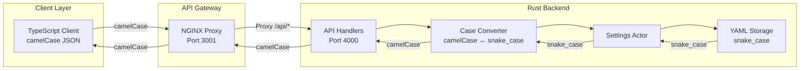

# REST API Reference

## Overview

The VisionFlow REST API provides comprehensive endpoints for managing graphs, AI agents, system configuration, and analytics. All endpoints follow RESTful conventions with consistent request/response formats.

## Architecture



## Base Configuration

### Base URL
```
Development: http://localhost:3001/api
Production:  https://api.visionflow.dev/api
```

### Request Headers
```http
Content-Type: application/json
Accept: application/json
Authorization: Bearer <token>
X-Request-ID: <uuid>
```

### Response Headers
```http
Content-Type: application/json; charset=utf-8
X-Response-Time: 25ms
X-Request-ID: <uuid>
Cache-Control: no-cache, no-store, must-revalidate
```

## Authentication

VisionFlow uses Nostr-based authentication (NIP-07 protocol):

### Authenticate
```http
POST /api/nostr/auth
```

**Request:**
```json
{
  "pubkey": "user_public_key_hex",
  "signature": "signature_hex",
  "challenge": "server_challenge",
  "relay": "wss://relay.nostr.com"
}
```

**Response:**
```json
{
  "success": true,
  "user": {
    "pubkey": "user_public_key",
    "npub": "npub_encoded_key",
    "isPowerUser": true
  },
  "token": "session_token",
  "expiresAt": 1234567890,
  "features": ["graph", "agents", "xr", "gpu"]
}
```

## Core Endpoints

### Graph Management
- **[GET /api/graph/data](graph.md#get-graph-data)** - Retrieve graph data
- **[GET /api/graph/data/paginated](graph.md#paginated-data)** - Paginated graph data
- **[POST /api/graph/update](graph.md#update-graph)** - Update graph from files
- **[POST /api/graph/refresh](graph.md#refresh-graph)** - Refresh graph structure

### Agent Orchestration
- **[GET /api/bots/data](bots.md#list-agents)** - List active agents
- **[POST /api/bots/data](bots.md#update-agents)** - Update agent states
- **[POST /api/bots/initialize-swarm](bots.md#initialize-swarm)** - Create agent swarm

### System Configuration
- **[GET /api/settings](settings.md#get-settings)** - Retrieve current settings
- **[POST /api/settings](settings.md#update-settings)** - Update settings
- **[POST /api/settings/reset](settings.md#reset-settings)** - Reset to defaults

### Analytics & Monitoring
- **[GET /api/analytics/system](analytics.md#system-metrics)** - System performance
- **[GET /api/analytics/graph](analytics.md#graph-analytics)** - Graph topology analysis
- **[GET /api/analytics/clustering](analytics.md#clustering)** - Semantic clustering

### Health & Status
- **[GET /api/health](health.md)** - Service health check
- **[GET /api/mcp/health](health.md#mcp-health)** - MCP connection status

## Request/Response Formats

### Standard Success Response
```json
{
  "success": true,
  "data": {
    // Endpoint-specific data
  },
  "metadata": {
    "timestamp": "2024-01-01T00:00:00Z",
    "requestId": "req-123",
    "processingTime": 250
  }
}
```

### Standard Error Response
```json
{
  "success": false,
  "error": {
    "code": "ERROR_CODE",
    "message": "Human-readable error message",
    "details": {
      "field": "fieldName",
      "reason": "Validation failed",
      "validValues": ["option1", "option2"]
    },
    "requestId": "req-123"
  }
}
```

### Paginated Response
```json
{
  "data": [],
  "pagination": {
    "currentPage": 1,
    "totalPages": 10,
    "totalItems": 1000,
    "pageSize": 100,
    "hasNext": true,
    "hasPrevious": false
  }
}
```

## Error Codes

| Code | Description | HTTP Status |
|------|-------------|-------------|
| `UNAUTHORISED` | Authentication required | 401 |
| `FORBIDDEN` | Insufficient permissions | 403 |
| `NOT_FOUND` | Resource not found | 404 |
| `INVALID_REQUEST` | Invalid parameters | 400 |
| `VALIDATION_ERROR` | Validation failed | 422 |
| `RATE_LIMITED` | Too many requests | 429 |
| `INTERNAL_ERROR` | Server error | 500 |
| `SERVICE_UNAVAILABLE` | Service down | 503 |

## Rate Limiting

| Endpoint Category | Requests/Min | Burst | Window |
|------------------|--------------|-------|--------|
| Graph Operations | 100 | 20 | 60s |
| Agent Operations | 50 | 10 | 60s |
| Settings Updates | 100 | 20 | 60s |
| Analytics Queries | 200 | 50 | 60s |
| Health Checks | 600 | 100 | 60s |

Rate limit information in response headers:
```http
X-RateLimit-Limit: 100
X-RateLimit-Remaining: 95
X-RateLimit-Reset: 1609459200
```

## Case Conversion

The API automatically handles case conversion between client and server:

### Client → Server
- Client sends: `camelCase` JSON
- Server converts to: `snake_case` for processing
- Storage format: `snake_case` YAML

### Server → Client
- Server processes: `snake_case` internally
- Server converts to: `camelCase` for response
- Client receives: `camelCase` JSON

### Example
```javascript
// Client sends (camelCase)
{
  "springStrength": 0.5,
  "repulsionStrength": 100
}

// Server processes (snake_case)
{
  "spring_strength": 0.5,
  "repulsion_strength": 100
}

// Client receives (camelCase)
{
  "springStrength": 0.5,
  "repulsionStrength": 100
}
```

## Performance Optimisation

### Best Practices
1. **Use pagination** for large datasets
2. **Implement caching** for frequently accessed data
3. **Batch operations** when possible
4. **Enable compression** for large payloads
5. **Use WebSockets** for real-time updates

### Caching Strategy
- ETags for resource versioning
- Cache-Control headers for static resources
- In-memory caching for hot data
- Session caching for user preferences

## Security Considerations

### Input Validation
- All inputs validated against schemas
- SQL injection prevention
- XSS protection
- Path traversal prevention

### CORS Configuration
```javascript
Access-Control-Allow-Origin: http://localhost:3001
Access-Control-Allow-Methods: GET, POST, PUT, DELETE, OPTIONS
Access-Control-Allow-Headers: Content-Type, Authorization
Access-Control-Allow-Credentials: true
```

## SDK Integration

### TypeScript/JavaScript
```typescript
import { VisionFlowClient } from '@visionflow/sdk';

const client = new VisionFlowClient({
  baseUrl: 'http://localhost:3001/api',
  token: 'your_auth_token'
});

// Fetch graph data
const graph = await client.graph.getData();

// Update settings
await client.settings.update({
  physics: { springStrength: 0.5 }
});
```

### cURL Examples
```bash
# Get graph data
curl -H "Authorization: Bearer TOKEN" \
     http://localhost:3001/api/graph/data

# Update settings
curl -X POST \
     -H "Content-Type: application/json" \
     -H "Authorization: Bearer TOKEN" \
     -d '{"physics":{"springStrength":0.5}}' \
     http://localhost:3001/api/settings
```

## Testing

### Unit Testing
```typescript
describe('Settings API', () => {
  it('should handle camelCase requests', async () => {
    const response = await api.post('/settings', {
      springStrength: 0.5
    });
    expect(response.data.springStrength).toBe(0.5);
  });
});
```

### Integration Testing
```bash
# Run API tests
npm run test:api

# Run with coverage
npm run test:api:coverage
```

## Troubleshooting

### Common Issues

1. **Case Conversion Errors**
   - Ensure client sends camelCase
   - Check server logs for conversion errors
   - Validate against both formats

2. **Rate Limiting**
   - Check X-RateLimit headers
   - Implement exponential backoff
   - Use caching to reduce requests

3. **Authentication Failures**
   - Verify Nostr signature
   - Check token expiration
   - Ensure proper relay configuration

## Migration Guide

### v0 → v1 Changes
- Node IDs: `u16` → `u32`
- Authentication: Basic → Nostr
- Case handling: Manual → Automatic
- Response format: Varied → Standardised

## Additional Resources

- [Graph API Details](graph.md)
- [Settings API Details](settings.md)
- [Agent API Details](bots.md)
- [Analytics API Details](analytics.md)
- [WebSocket Protocols](../websocket/index.md)
- [Binary Protocol](../binary-protocol.md)
- [MCP Integration](../mcp/index.md)