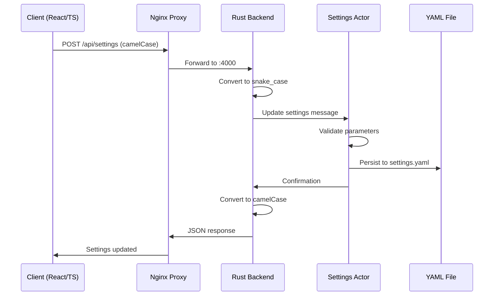

# Settings API Reference

*[Api](../index.md) > [Rest](../api/rest/index.md)*

## Overview

The Settings API manages all configuration aspects of VisionFlow, including physics parameters, visualisation settings, node properties, and rendering options. It supports multiple graph types with independent configurations and automatic case conversion between client and server.

## Complete REST Flow Architecture

### Request/Response Flow


### Architecture Components

#### 1. Client-Side (TypeScript/React)
- **settingsStore.ts**: Zustand store managing client state
- **apiService.ts**: Generic API service for HTTP requests  
- **settingsApi.ts**: Settings-specific API client
- **settings.ts**: TypeScript interfaces (camelCase)

#### 2. Proxy Layer
- **nginx.dev.conf**: Routes `/api/*` from port 3001 to Rust backend on port 4000

#### 3. Server-Side (Rust)
- **main.rs**: Initialises app with AppFullSettings
- **settings_handler.rs**: REST endpoint handlers
- **settings_actor.rs**: Actor managing settings state
- **config/mod.rs**: AppFullSettings struct and conversion logic

#### 4. Persistence
- **settings.yaml**: Snake_case YAML configuration file

## Case Conversion Logic

### The Challenge
- **Client**: Uses camelCase (JavaScript convention)
- **Server**: Uses snake_case (Rust/YAML convention)
- **Validation**: Must handle both formats seamlessly

### Conversion Implementation

#### Request Flow (Client → Server)
```rust
// 1. Client sends camelCase JSON
{ "springStrength": 0.5, "repulsionStrength": 100 }

// 2. Server receives in update_settings handler
fn update_settings(payload: web::Json<Value>) -> Result<HttpResponse>

// 3. AppFullSettings::merge_update() converts to snake_case
fn keys_to_snake_case(value: Value) -> Value {
    match value {
        Value::Object(map) => {
            let mut new_map = serde_json::Map::new();
            for (k, v) in map {
                let snake_key = to_snake_case(&k);
                new_map.insert(snake_key, keys_to_snake_case(v));
            }
            Value::Object(new_map)
        }
        Value::Array(arr) => Value::Array(
            arr.into_iter().map(keys_to_snake_case).collect()
        ),
        _ => value,
    }
}

// 4. Validation accepts BOTH formats
let spring = physics.get("springStrength")
    .or_else(|| physics.get("spring_strength"));

// 5. Settings saved to YAML in snake_case
```

#### Response Flow (Server → Client)
```rust
// 1. Server loads snake_case from AppFullSettings
let settings = app_settings.load();

// 2. to_camel_case_json() converts to camelCase
pub fn to_camel_case_json(&self) -> Result<Value, serde_json::Error> {
    let json = serde_json::to_value(self)?;
    Ok(keys_to_camel_case(json))
}

// 3. Client receives familiar camelCase JSON
{ "springStrength": 0.5, "repulsionStrength": 100 }
```

## Validation Engine

### Dual-Format Validation
All validation functions check both camelCase and snake_case:

```rust
fn validate_physics_settings(physics: &Value) -> Result<(), String> {
    // Spring strength validation (both formats)
    let spring = physics.get("springStrength")
        .or_else(|| physics.get("spring_strength"));
    
    if let Some(spring_val) = spring {
        let spring_f = spring_val.as_f64()
            .ok_or("Spring strength must be a number")?;
        if spring_f < 0.0 || spring_f > 1.0 {
            return Err("Spring strength must be between 0.0 and 1.0".to_string());
        }
    }

    // Continue for all other parameters...
}
```

### Validation Rules

#### Physics Parameters
| Parameter | Type | Range | Description |
|-----------|------|-------|-------------|
| `springStrength` | f64 | 0.0 - 1.0 | Force of springs connecting nodes |
| `repulsionStrength` | f64 | 0.0 - 500.0 | Repulsive force between nodes |
| `dampingFactor` | f64 | 0.0 - 1.0 | Energy dissipation rate |
| `centralForce` | f64 | 0.0 - 100.0 | Attraction to centre |
| `linkDistance` | f64 | 1.0 - 200.0 | Desired distance between connected nodes |
| `linkStrength` | f64 | 0.0 - 1.0 | Strength of link constraints |
| `chargeStrength` | f64 | -1000.0 - 0.0 | Node charge (negative for repulsion) |
| `collisionRadius` | f64 | 0.0 - 50.0 | Node collision detection radius |
| `alphaDecay` | f64 | 0.0 - 1.0 | Simulation cooling rate |
| `velocityDecay` | f64 | 0.0 - 1.0 | Velocity reduction per tick |

#### Node Settings
| Parameter | Type | Range | Description |
|-----------|------|-------|-------------|
| `defaultSize` | f64 | 1.0 - 50.0 | Default node radius |
| `minSize` | f64 | 0.1 - 10.0 | Minimum node size |
| `maxSize` | f64 | 10.0 - 100.0 | Maximum node size |
| `sizeMultiplier` | f64 | 0.1 - 5.0 | Size scaling factor |

#### Rendering Settings
| Parameter | Type | Range | Description |
|-----------|------|-------|-------------|
| `quality` | string | "low", "medium", "high" | Rendering quality preset |
| `antialiasing` | boolean | - | Enable anti-aliasing |
| `shadows` | boolean | - | Enable shadow rendering |

## API Endpoints

### GET /api/settings

Retrieve complete current settings configuration.

#### Request
```http
GET /api/settings HTTP/1.1
Host: localhost:3001
Accept: application/json
```

#### Response
```json
{
  "success": true,
  "data": {
    "visualisation": {
      "graphs": {
        "logseq": {
          "physics": {
            "springStrength": 0.3,
            "repulsionStrength": 150,
            "dampingFactor": 0.9,
            "centralForce": 10,
            "linkDistance": 50,
            "linkStrength": 0.7,
            "chargeStrength": -30,
            "collisionRadius": 5,
            "alphaDecay": 0.028,
            "velocityDecay": 0.4
          },
          "nodes": {
            "defaultSize": 8,
            "minSize": 2,
            "maxSize": 40,
            "sizeMultiplier": 1.5,
            "showLabels": true,
            "labelSize": 12,
            "labelColour": "#333333"
          },
          "edges": {
            "defaultThickness": 1.5,
            "minThickness": 0.5,
            "maxThickness": 5.0,
            "showArrows": true,
            "arrowSize": 8,
            "colour": "#999999"
          },
          "labels": {
            "fontSize": 14,
            "fontFamily": "Arial, sans-serif",
            "colour": "#000000",
            "background": "rgba(255, 255, 255, 0.8)",
            "padding": 4,
            "borderRadius": 3
          }
        },
        "visionflow": {
          // Similar structure with different defaults
        }
      }
    },
    "rendering": {
      "quality": "high",
      "antialiasing": true,
      "shadows": true,
      "animations": true,
      "fps": 60
    },
    "xr": {
      "enabled": false,
      "handTracking": true,
      "eyeTracking": false,
      "roomScale": true
    },
    "persistSettings": true,
    "debugMode": false
  },
  "timestamp": "2024-01-15T14:30:00.000Z"
}
```

#### Error Responses
```json
{
  "error": {
    "code": "INTERNAL_ERROR",
    "message": "Failed to load settings from actor",
    "details": {
      "actorError": "Settings actor not responding"
    }
  }
}
```

### POST /api/settings

Update settings with partial or complete configuration.

#### Request
```http
POST /api/settings HTTP/1.1
Host: localhost:3001
Content-Type: application/json

{
  "visualisation": {
    "graphs": {
      "logseq": {
        "physics": {
          "springStrength": 0.5,
          "repulsionStrength": 200
        }
      }
    }
  },
  "persistSettings": true
}
```

#### Validation Examples

##### Valid Request
```json
{
  "physics": {
    "springStrength": 0.6,
    "dampingFactor": 0.85,
    "centralForce": 15
  },
  "nodes": {
    "defaultSize": 10,
    "showLabels": true
  }
}
```

##### Invalid Request (Validation Errors)
```json
{
  "physics": {
    "springStrength": 1.5,  // Error: > 1.0
    "repulsionStrength": -10  // Error: < 0.0
  }
}
```

#### Response (Success)
```json
{
  "success": true,
  "data": {
    // Complete updated settings object in camelCase
  },
  "changes": {
    "physics.springStrength": {
      "from": 0.3,
      "to": 0.5
    },
    "physics.repulsionStrength": {
      "from": 150,
      "to": 200
    }
  },
  "timestamp": "2024-01-15T14:30:00.000Z"
}
```

#### Response (Validation Error)
```json
{
  "error": {
    "code": "VALIDATION_ERROR",
    "message": "Multiple validation errors",
    "details": {
      "errors": [
        {
          "field": "physics.springStrength",
          "value": 1.5,
          "message": "Spring strength must be between 0.0 and 1.0"
        },
        {
          "field": "physics.repulsionStrength", 
          "value": -10,
          "message": "Repulsion strength must be between 0.0 and 500.0"
        }
      ]
    }
  }
}
```

### POST /api/settings/reset

Reset settings to default values from YAML configuration.

#### Request
```http
POST /api/settings/reset HTTP/1.1
Host: localhost:3001
Content-Type: application/json

{
  "graph": "logseq",  // Optional: reset specific graph
  "persist": true     // Optional: save reset to YAML
}
```

#### Response
```json
{
  "success": true,
  "data": {
    // Complete default settings in camelCase
  },
  "message": "Settings reset to defaults",
  "timestamp": "2024-01-15T14:30:00.000Z"
}
```

### GET /api/settings/schema

Retrieve validation schema for all settings parameters.

#### Response
```json
{
  "success": true,
  "data": {
    "physics": {
      "springStrength": {
        "type": "number",
        "minimum": 0.0,
        "maximum": 1.0,
        "description": "Force of springs connecting nodes"
      },
      "repulsionStrength": {
        "type": "number", 
        "minimum": 0.0,
        "maximum": 500.0,
        "description": "Repulsive force between nodes"
      }
      // ... all other parameters
    }
  }
}
```

## Multi-Graph Support

### Graph Configuration Structure
```json
{
  "visualisation": {
    "graphs": {
      "logseq": {
        "physics": { /* logseq-specific physics */ },
        "nodes": { /* logseq-specific nodes */ },
        "edges": { /* logseq-specific edges */ },
        "labels": { /* logseq-specific labels */ }
      },
      "visionflow": {
        "physics": { /* visionflow-specific physics */ },
        "nodes": { /* visionflow-specific nodes */ },
        "edges": { /* visionflow-specific edges */ },
        "labels": { /* visionflow-specific labels */ }
      }
    }
  }
}
```

### Graph-Specific Updates
```json
// Update only logseq graph settings
{
  "visualisation": {
    "graphs": {
      "logseq": {
        "physics": {
          "springStrength": 0.4
        }
      }
    }
  }
}
```

### Default Values per Graph

#### Logseq Graph Defaults
- Optimised for knowledge graph visualisation
- Lower spring strength for looser clustering
- Higher repulsion for better node separation
- Smaller node sizes for text-heavy content

#### VisionFlow Graph Defaults  
- Optimised for general-purpose visualisation
- Higher spring strength for tighter clustering
- Moderate repulsion for balanced layout
- Larger node sizes for visual emphasis

## Integration with GPU Compute

Settings updates automatically trigger GPU optimisation:

### Physics Parameter Updates
```json
{
  "physics": {
    "springStrength": 0.6
  }
}
```

This triggers:
1. Settings validation and storage
2. GPU kernel parameter update
3. CUDA context refresh
4. Optimised computation pipeline restart

### Performance Impact
- **CPU Mode**: Settings changes apply immediately
- **GPU Mode**: Brief pause (~100ms) during kernel recompilation
- **Memory**: Minimal impact, parameters cached efficiently

## Error Handling Patterns

### Client-Side Error Handling
```typescript
interface SettingsUpdateError {
  code: string;
  message: string;
  details: {
    field?: string;
    value?: any;
    expected?: string;
    errors?: ValidationError[];
  };
}

try {
  await settingsApi.update(newSettings);
} catch (error: SettingsUpdateError) {
  switch (error.code) {
    case 'VALIDATION_ERROR':
      handleValidationErrors(error.details.errors);
      break;
    case 'ACTOR_ERROR':
      showRetryDialog();
      break;
    default:
      showGenericError(error.message);
  }
}
```

### Server-Side Error Categories

#### Validation Errors
- Parameter out of range
- Invalid data type
- Missing required fields
- Malformed JSON structure

#### Actor Communication Errors
- Settings actor unavailable
- Message timeout
- Actor restart in progress

#### Persistence Errors
- YAML file write permission denied
- Disk space insufficient
- File corruption detected

## Performance Optimisation

### Batch Updates
```javascript
// Good: Single request with multiple changes
await api.updateSettings({
  physics: {
    springStrength: 0.5,
    repulsionStrength: 200,
    dampingFactor: 0.9
  },
  nodes: {
    defaultSize: 12,
    showLabels: true
  }
});

// Avoid: Multiple individual requests
await api.updateSettings({ physics: { springStrength: 0.5 } });
await api.updateSettings({ physics: { repulsionStrength: 200 } });
await api.updateSettings({ physics: { dampingFactor: 0.9 } });
```

### Debouncing User Input
```javascript
import { debounce } from 'lodash';

const debouncedUpdate = debounce(async (settings) => {
  await api.updateSettings(settings);
}, 300);

// Use in components
const handleSliderChange = (value) => {
  setLocalValue(value); // Immediate UI update
  debouncedUpdate({ physics: { springStrength: value } });
};
```

### Caching Strategy
- Settings cached in memory by Settings Actor
- Client-side cache with TTL (5 minutes)
- ETag support for conditional requests
- WebSocket notifications for cache invalidation

## Migration and Versioning

### Settings Version History
- **v1.0**: Basic physics parameters
- **v1.1**: Multi-graph support added
- **v1.2**: XR settings integration
- **v2.0**: GPU compute parameters

### Migration Handling
```rust
pub fn migrate_settings(version: &str, settings: &mut Value) -> Result<(), MigrationError> {
    match version {
        "1.0" => migrate_v1_to_v2(settings)?,
        "1.1" => migrate_v1_1_to_v2(settings)?,
        _ => return Err(MigrationError::UnsupportedVersion(version.to_string())),
    }
    Ok(())
}
```

### Backwards Compatibility
- All v1.x settings remain supported
- Automatic migration on first load
- Fallback to defaults for missing parameters
- Clear migration error messages

## Testing and Validation

### Unit Tests
```rust
#[cfg(test)]
mod tests {
    use super::*;

    #[test]
    fn test_camel_case_conversion() {
        let camel_input = json!({
            "springStrength": 0.5,
            "repulsionStrength": 100
        });
        
        let snake_output = keys_to_snake_case(camel_input);
        
        assert_eq!(snake_output["spring_strength"], 0.5);
        assert_eq!(snake_output["repulsion_strength"], 100);
    }

    #[test]
    fn test_validation_both_formats() {
        let camel_case = json!({ "springStrength": 0.5 });
        let snake_case = json!({ "spring_strength": 0.5 });
        
        assert!(validate_physics_settings(&camel_case).is_ok());
        assert!(validate_physics_settings(&snake_case).is_ok());
    }
}
```

### Integration Tests
```bash
# Test complete settings flow
curl -X POST http://localhost:3001/api/settings \
  -H "Content-Type: application/json" \
  -d '{"physics": {"springStrength": 0.7}}' | \
  jq '.data.visualisation.graphs.logseq.physics.springStrength'
```

### Load Testing
- Concurrent settings updates
- Large payload handling
- Actor system stress testing
- Memory leak detection

## Related Documentation

- [REST API Overview](./index.md)
- [WebSocket Integration](../websocket/index.md)
- [Client Settings Store](../../client/state.md)
- [GPU Compute Integration](../../server/gpu-compute.md)

## See Also

- [Request Handlers Architecture](../../server/handlers.md) - Server implementation
