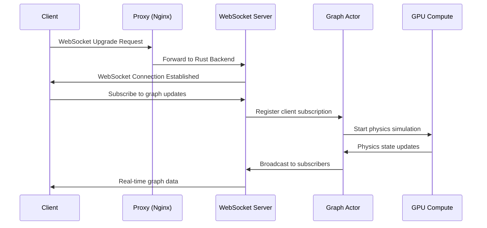

# VisionFlow WebSocket API Documentation

*[Api](../index.md) > [Websocket](../api/websocket/index.md)*

## Overview

The VisionFlow WebSocket API provides real-time, bidirectional communication for live graph updates, physics simulation state, collaborative editing, and system notifications. Built on a high-performance Rust backend with Tokio async runtime, it ensures low-latency communication with automatic reconnection and message ordering.

## Architecture

### Connection Flow


### Core Components

#### Client-Side WebSocket Manager
- **Connection Management**: Automatic reconnection with exponential backoff
- **Message Queue**: Reliable message delivery with acknowledgements
- **Subscription Manager**: Topic-based subscription handling
- **State Synchronisation**: Maintains consistency with REST API

#### Server-Side WebSocket Handler
- **Connection Pool**: Manages concurrent client connections
- **Message Router**: Routes messages to appropriate handlers
- **Broadcast System**: Efficient message distribution
- **Rate Limiting**: Per-connection rate limiting and throttling

## Connection Endpoints

### Primary WebSocket Endpoint
```
ws://localhost:8080/wss
wss://your-domain.com/wss (Production)
```

**Note**: The primary endpoint changed from `/ws` to `/wss` in the current implementation.

### Specialised Endpoints

**Based on actual server implementation (src/main.rs):**

- `/wss` - Primary graph position updates (binary protocol)
- `/ws/speech` - Voice interaction and audio streaming  
- `/ws/mcp-relay` - MCP protocol relay and agent orchestration
- `/api/visualisation/agents/ws` - Multi-agent system visualisation

## Connection Establishment

### Client Connection
```javascript
const ws = new WebSocket('ws://localhost:3001/ws');

ws.onopen = (event) => {
  console.log('WebSocket connected');
  
  // Send initial handshake
  ws.send(JSON.stringify({
    type: 'handshake',
    version: '2.0',
    clientId: generateClientId(),
    subscriptions: ['graph_updates', 'physics_state']
  }));
};

ws.onmessage = (event) => {
  const message = JSON.parse(event.data);
  handleWebSocketMessage(message);
};

ws.onerror = (error) => {
  console.error('WebSocket error:', error);
};

ws.onclose = (event) => {
  console.log('WebSocket closed:', event.code, event.reason);
  attemptReconnection();
};
```

### Handshake Protocol
```json
{
  "type": "handshake",
  "version": "2.0",
  "clientId": "client_123456789",
  "capabilities": [
    "graph_rendering",
    "physics_simulation", 
    "voice_commands",
    "collaborative_editing"
  ],
  "subscriptions": [
    "graph_updates",
    "physics_state",
    "system_notifications"
  ],
  "authentication": {
    "token": "jwt_token_here", // Optional for production
    "sessionId": "session_abc123"
  }
}
```

### Server Response
```json
{
  "type": "handshake_ack",
  "success": true,
  "sessionId": "session_abc123",
  "serverId": "server_001",
  "supportedProtocols": ["v2.0", "v1.5"],
  "maxMessageSize": 1048576,
  "rateLimits": {
    "messagesPerSecond": 50,
    "subscriptionsPerClient": 20
  },
  "availableTopics": [
    "graph_updates",
    "physics_state", 
    "system_notifications",
    "collaboration_events"
  ]
}
```

## Message Protocol

### Message Structure
```json
{
  "id": "msg_unique_id",
  "type": "message_type",
  "timestamp": "2024-01-15T14:30:00.000Z",
  "payload": {
    // Message-specific data
  },
  "metadata": {
    "priority": "normal", // low, normal, high, critical
    "acknowledgement": true,
    "broadcast": false,
    "ttl": 30000 // milliseconds
  }
}
```

### Message Types

#### Graph Updates
```json
{
  "id": "graph_update_001",
  "type": "graph_update",
  "payload": {
    "graphId": "logseq",
    "updateType": "incremental", // full, incremental, delta
    "nodes": [
      {
        "id": "node_123",
        "action": "update", // add, update, remove
        "data": {
          "position": { "x": 100, "y": 150, "z": 0 },
          "size": 12,
          "colour": "#3498db",
          "label": "Updated Node"
        }
      }
    ],
    "edges": [
      {
        "id": "edge_456",
        "action": "add",
        "data": {
          "source": "node_123",
          "target": "node_789",
          "thickness": 2,
          "colour": "#2ecc71"
        }
      }
    ],
    "statistics": {
      "nodeCount": 1247,
      "edgeCount": 3891,
      "updateDuration": 16 // milliseconds
    }
  }
}
```

#### Physics State Updates
```json
{
  "id": "physics_state_001",
  "type": "physics_state",
  "payload": {
    "graphId": "logseq",
    "simulationState": "running", // stopped, running, paused
    "iteration": 1543,
    "energy": 0.023,
    "temperature": 0.15,
    "convergence": 0.95,
    "performance": {
      "fps": 59.8,
      "computeTime": 2.3, // milliseconds
      "gpuUtilisation": 78 // percentage
    },
    "forces": {
      "spring": 0.034,
      "repulsion": 0.019,
      "centering": 0.008
    }
  }
}
```

#### Settings Synchronisation
```json
{
  "id": "settings_sync_001",
  "type": "settings_change",
  "payload": {
    "changeType": "update", // update, reset, migration
    "source": "client_789", // Who made the change
    "path": "visualisation.graphs.logseq.physics.springStrength",
    "oldValue": 0.3,
    "newValue": 0.5,
    "timestamp": "2024-01-15T14:30:00.000Z",
    "broadcast": true // Notify other clients
  }
}
```

#### System Notifications
```json
{
  "id": "system_notification_001",
  "type": "system_notification",
  "payload": {
    "level": "info", // debug, info, warning, error, critical
    "category": "gpu_compute",
    "title": "GPU Optimisation Complete",
    "message": "Physics simulation switched to GPU acceleration",
    "details": {
      "previousMode": "cpu",
      "newMode": "gpu",
      "performanceGain": "3.2x"
    },
    "actions": [
      {
        "label": "View Metrics",
        "action": "navigate",
        "target": "/metrics/gpu"
      }
    ]
  }
}
```

## Subscription Management

### Subscribe to Topics
```json
{
  "type": "subscribe",
  "payload": {
    "topics": [
      "graph_updates:logseq",
      "physics_state:*", // All graphs
      "system_notifications:gpu_compute"
    ],
    "options": {
      "includePastEvents": false,
      "maxEventHistory": 100,
      "compression": true
    }
  }
}
```

### Unsubscribe from Topics
```json
{
  "type": "unsubscribe", 
  "payload": {
    "topics": [
      "graph_updates:visionflow",
      "physics_state:logseq"
    ]
  }
}
```

### Topic Patterns
- `graph_updates:*` - All graph updates
- `graph_updates:logseq` - Specific graph updates
- `physics_state:*` - All physics simulations
- `system_notifications:gpu_compute` - GPU-specific notifications
- `collaboration:*` - All collaboration events

## Real-Time Physics Integration

### Physics Simulation Control
```json
{
  "type": "physics_control",
  "payload": {
    "action": "start", // start, stop, pause, resume, step
    "graphId": "logseq",
    "parameters": {
      "iterations": 1000,
      "targetFps": 60,
      "enableGpu": true
    }
  }
}
```

### Live Physics Updates
Clients receive continuous physics state updates:

```javascript
ws.onmessage = (event) => {
  const message = JSON.parse(event.data);
  
  if (message.type === 'physics_state') {
    const { nodes, edges, statistics } = message.payload;
    
    // Update graph visualisation
    updateNodePositions(nodes);
    updateGraphStatistics(statistics);
    
    // Monitor performance
    if (statistics.fps < 30) {
      console.warn('Physics simulation performance degraded');
    }
  }
};
```

## Collaborative Features

### Multi-User Synchronisation
```json
{
  "type": "collaboration_event",
  "payload": {
    "eventType": "cursor_move", // cursor_move, selection_change, edit_start
    "userId": "user_123",
    "userName": "Alice Smith",
    "data": {
      "position": { "x": 450, "y": 320 },
      "nodeId": "node_789", // If hovering over node
      "tool": "select" // Current tool
    },
    "timestamp": "2024-01-15T14:30:00.000Z"
  }
}
```

### Conflict Resolution
```json
{
  "type": "conflict_resolution",
  "payload": {
    "conflictId": "conflict_001",
    "type": "concurrent_edit",
    "participants": ["user_123", "user_456"],
    "resolution": "merge", // merge, overwrite, reject
    "finalState": {
      // Resolved state
    }
  }
}
```

## Voice Command Integration

### Voice WebSocket Endpoint
```javascript
const voiceWs = new WebSocket('ws://localhost:3001/ws/voice');

// Send audio data
voiceWs.send(audioBuffer);

// Receive transcription and commands
voiceWs.onmessage = (event) => {
  const message = JSON.parse(event.data);
  
  if (message.type === 'voice_command') {
    executeVoiceCommand(message.payload);
  }
};
```

### Voice Command Processing
```json
{
  "type": "voice_command",
  "payload": {
    "transcription": "increase spring strength to 0.7",
    "confidence": 0.94,
    "intent": "update_physics_parameter",
    "parameters": {
      "parameter": "springStrength",
      "value": 0.7,
      "graph": "current" // Inferred from context
    },
    "actions": [
      {
        "type": "settings_update",
        "data": {
          "physics": { "springStrength": 0.7 }
        }
      }
    ]
  }
}
```

## MCP Integration Relay

### MCP Message Relay
```json
{
  "type": "mcp_relay",
  "payload": {
    "mcpType": "notification",
    "tool": "claude_flow",
    "data": {
      "agent": "researcher",
      "status": "completed",
      "result": {
        "summary": "Analysis complete",
        "insights": ["Key finding 1", "Key finding 2"]
      }
    }
  }
}
```

### Agent Communication
```json
{
  "type": "agent_communication",
  "payload": {
    "fromAgent": "coder",
    "toAgent": "reviewer", 
    "messageType": "code_review_request",
    "data": {
      "files": ["src/components/Graph.tsx"],
      "priority": "high",
      "deadline": "2024-01-15T18:00:00.000Z"
    }
  }
}
```

## Error Handling

### WebSocket Error Types
```json
{
  "type": "error",
  "payload": {
    "errorCode": "SUBSCRIPTION_FAILED",
    "message": "Failed to subscribe to topic 'invalid_topic'",
    "details": {
      "requestedTopic": "invalid_topic",
      "availableTopics": ["graph_updates", "physics_state"],
      "suggestion": "Use 'graph_updates' instead"
    },
    "recoverable": true,
    "retryAfter": 5000 // milliseconds
  }
}
```

### Error Codes
| Code | Description | Recoverable |
|------|-------------|-------------|
| `CONNECTION_FAILED` | WebSocket connection failed | Yes |
| `AUTHENTICATION_FAILED` | Invalid credentials | No |
| `RATE_LIMIT_EXCEEDED` | Too many messages | Yes |
| `SUBSCRIPTION_FAILED` | Invalid subscription request | No |
| `MESSAGE_TOO_LARGE` | Message exceeds size limit | No |
| `PROTOCOL_ERROR` | Invalid message format | No |

### Automatic Recovery
```javascript
class WebSocketManager {
  constructor() {
    this.reconnectAttempts = 0;
    this.maxReconnectAttempts = 10;
    this.reconnectDelay = 1000; // Start with 1 second
  }

  attemptReconnection() {
    if (this.reconnectAttempts >= this.maxReconnectAttempts) {
      console.error('Max reconnection attempts reached');
      return;
    }

    setTimeout(() => {
      this.reconnectAttempts++;
      this.reconnectDelay *= 2; // Exponential backoff
      this.connect();
    }, this.reconnectDelay);
  }

  onConnectionEstablished() {
    this.reconnectAttempts = 0;
    this.reconnectDelay = 1000; // Reset delay
    this.resubscribeToTopics();
  }
}
```

## Performance Optimisation

### Message Batching
```javascript
class MessageBatcher {
  constructor(batchSize = 10, maxDelay = 50) {
    this.batchSize = batchSize;
    this.maxDelay = maxDelay;
    this.messageQueue = [];
    this.batchTimer = null;
  }

  addMessage(message) {
    this.messageQueue.push(message);
    
    if (this.messageQueue.length >= this.batchSize) {
      this.flushBatch();
    } else if (!this.batchTimer) {
      this.batchTimer = setTimeout(() => this.flushBatch(), this.maxDelay);
    }
  }

  flushBatch() {
    if (this.messageQueue.length > 0) {
      ws.send(JSON.stringify({
        type: 'batch',
        payload: this.messageQueue
      }));
      this.messageQueue = [];
    }
    
    if (this.batchTimer) {
      clearTimeout(this.batchTimer);
      this.batchTimer = null;
    }
  }
}
```

### Compression
```json
{
  "type": "subscribe",
  "payload": {
    "topics": ["graph_updates:logseq"],
    "options": {
      "compression": {
        "enabled": true,
        "algorithm": "gzip", // gzip, deflate, brotli
        "level": 6
      }
    }
  }
}
```

### Rate Limiting
Client-side rate limiting:
```javascript
class RateLimiter {
  constructor(maxMessages = 50, timeWindow = 1000) {
    this.maxMessages = maxMessages;
    this.timeWindow = timeWindow;
    this.messageTimestamps = [];
  }

  canSendMessage() {
    const now = Date.now();
    this.messageTimestamps = this.messageTimestamps.filter(
      timestamp => now - timestamp < this.timeWindow
    );
    
    return this.messageTimestamps.length < this.maxMessages;
  }

  recordMessage() {
    this.messageTimestamps.push(Date.now());
  }
}
```

## Security Considerations

### Authentication
```json
{
  "type": "authenticate",
  "payload": {
    "method": "jwt",
    "token": "eyJhbGciOiJIUzI1NiIsInR5cCI6IkpXVCJ9...",
    "refreshToken": "refresh_token_here"
  }
}
```

### Message Validation
- All messages validated against JSON schema
- Content sanitisation for user-generated data
- Rate limiting per connection and per user
- Topic permission validation

### Connection Security
- WSS (WebSocket Secure) in production
- CORS validation
- Origin header verification
- Session timeout management

## Monitoring and Debugging

### Connection Diagnostics
```json
{
  "type": "diagnostics",
  "payload": {
    "connectionId": "conn_123456",
    "uptime": 3600000, // milliseconds
    "messagesSent": 1432,
    "messagesReceived": 2891,
    "subscriptions": ["graph_updates:logseq", "physics_state:*"],
    "lastActivity": "2024-01-15T14:29:45.000Z",
    "latency": {
      "current": 12, // milliseconds
      "average": 15,
      "maximum": 89
    }
  }
}
```

### Debug Messages
```javascript
// Enable debug mode
ws.send(JSON.stringify({
  type: 'debug_mode',
  payload: {
    enabled: true,
    level: 'verbose', // minimal, normal, verbose
    categories: ['message_flow', 'subscriptions', 'performance']
  }
}));
```

## Client SDK Example

### TypeScript WebSocket Client
```typescript
import { WebSocketClient } from '@visionflow/websocket-client';

const client = new WebSocketClient({
  url: 'ws://localhost:3001/ws',
  autoReconnect: true,
  maxReconnectAttempts: 10,
  messageTimeout: 5000
});

// Connect and authenticate
await client.connect();
await client.authenticate({ token: 'jwt_token' });

// Subscribe to graph updates
client.subscribe('graph_updates:logseq', (message) => {
  console.log('Graph update received:', message.payload);
});

// Send physics control command
client.send({
  type: 'physics_control',
  payload: {
    action: 'start',
    graphId: 'logseq'
  }
});

// Handle connection events
client.on('connected', () => console.log('Connected'));
client.on('disconnected', () => console.log('Disconnected'));
client.on('error', (error) => console.error('Error:', error));
```

## Best Practices

### 1. Connection Management
- Implement automatic reconnection with exponential backoff
- Handle connection state changes gracefully
- Persist subscriptions across reconnections

### 2. Message Handling
- Validate all incoming messages
- Implement message deduplication
- Use message IDs for tracking and debugging

### 3. Performance
- Batch frequent updates
- Use compression for large messages
- Monitor connection latency and throughput

### 4. Error Recovery
- Implement graceful degradation
- Cache critical messages during disconnections
- Provide user feedback for connection issues

## Related Documentation

- [REST API Overview](../rest/index.md)
- [Settings API Reference](../rest/settings.md)
- [MCP Integration](../mcp/index.md)
- [Client WebSocket Integration](../../client/websocket.md)
- [Physics Engine](../../server/physics-engine.md)

## See Also

- [Request Handlers Architecture](../../server/handlers.md) - Server implementation
- [Server Documentation](../../server/index.md) - Server implementation
