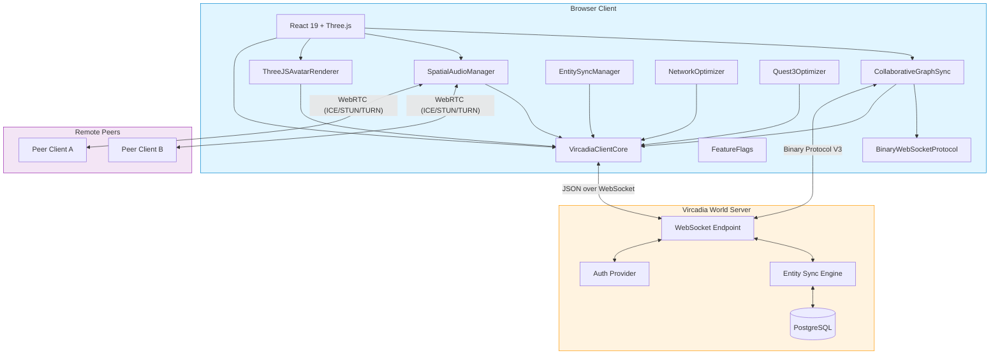
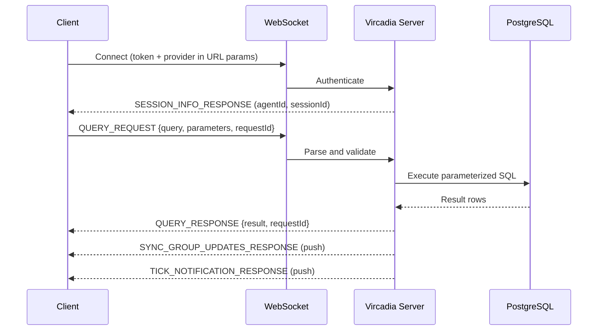
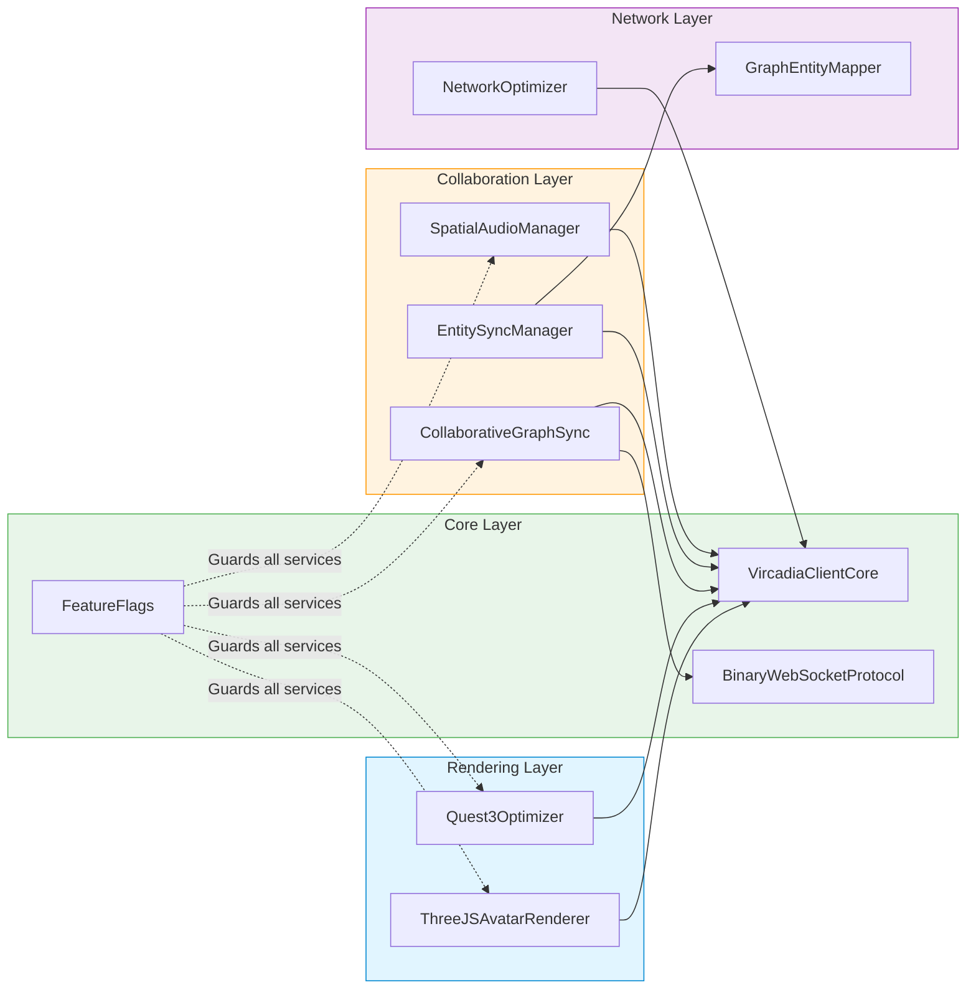
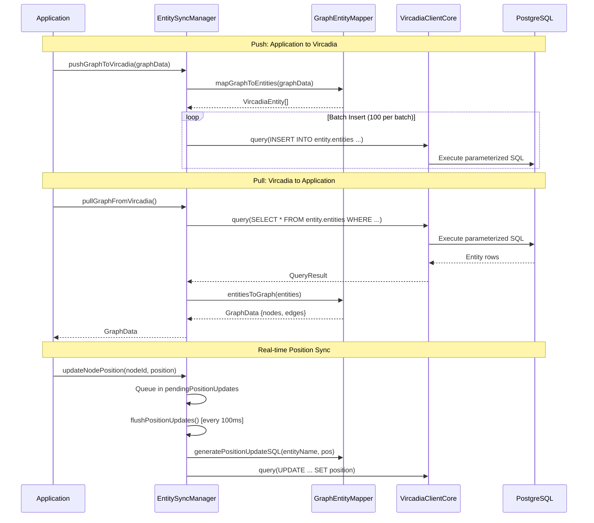
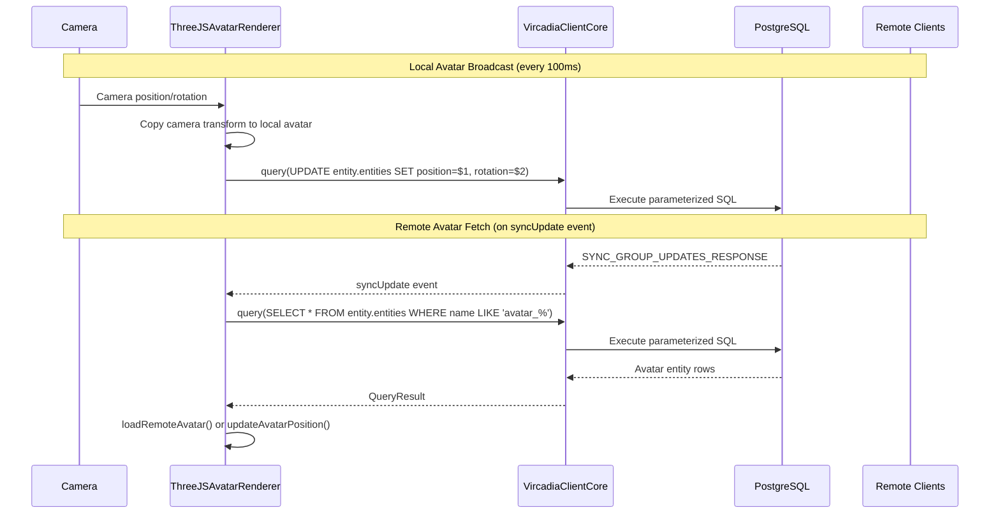
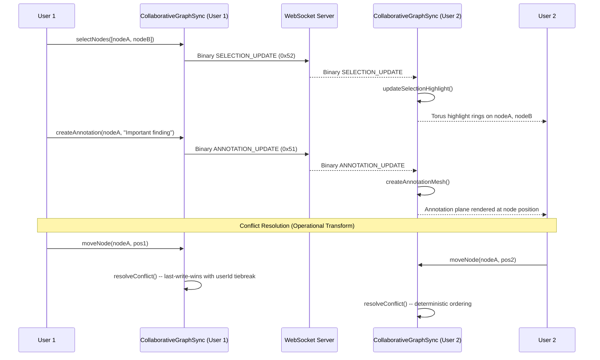
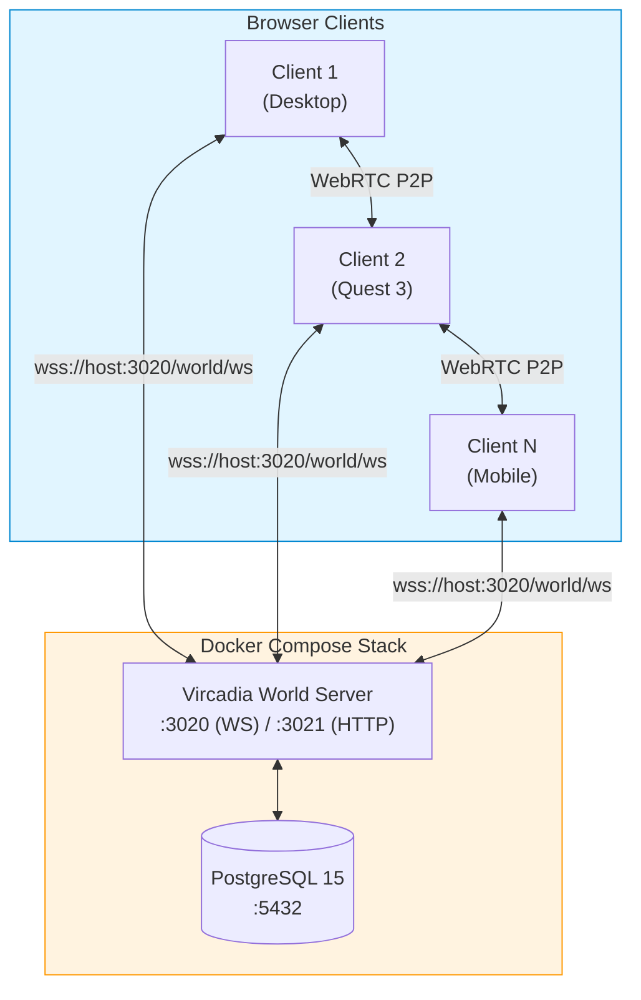

# Architecture Overview

This document describes the architecture of the VisionFlow Vircadia immersive experience -- a multi-user, real-time 3D knowledge graph visualization system with WebXR support.

## System Overview

VisionFlow connects a React/Three.js client to a Vircadia World Server over WebSocket. The server exposes a SQL-over-WebSocket interface backed by PostgreSQL, enabling clients to query and mutate shared entity state in real time. Peer-to-peer audio is handled via WebRTC.



## Client-Server Communication

### SQL-over-WebSocket Pattern

VisionFlow uses the Vircadia World Server's SQL-over-WebSocket interface. The client sends parameterized SQL queries as JSON messages over a persistent WebSocket connection. The server executes queries against PostgreSQL and returns results.



### Message Types

| Type | Direction | Description |
|:-----|:----------|:------------|
| `QUERY_REQUEST` | Client to Server | Parameterized SQL query |
| `QUERY_RESPONSE` | Server to Client | Query result |
| `SESSION_INFO_RESPONSE` | Server to Client | Agent and session identifiers |
| `SYNC_GROUP_UPDATES_RESPONSE` | Server to Client | Entity change notifications |
| `TICK_NOTIFICATION_RESPONSE` | Server to Client | Server tick heartbeat |
| `GENERAL_ERROR_RESPONSE` | Server to Client | Error details |

### Binary Protocol V3

For high-frequency data (positions, agent state, graph operations), VisionFlow uses a compact binary protocol that reduces bandwidth by up to 80% compared to JSON.

| Field | Size | Description |
|:------|:-----|:------------|
| Message Type | 1 byte | Identifies the payload type |
| Protocol Version | 1 byte | Currently `3` |
| Payload Length | 2 bytes | Little-endian uint16 |
| Payload | Variable | Type-specific binary data |

Position updates use 21 bytes per agent (4-byte ID, 12-byte position, 4-byte timestamp, 1-byte flags).

## Service Layer Architecture



### Service Dependency Summary

| Service | Depends On | Responsibility |
|:--------|:-----------|:---------------|
| **VircadiaClientCore** | None (foundation) | WebSocket lifecycle, SQL queries, event bus |
| **BinaryWebSocketProtocol** | None (singleton) | Binary message encoding/decoding |
| **FeatureFlags** | None (singleton) | Runtime feature gating and rollout |
| **ThreeJSAvatarRenderer** | VircadiaClientCore, Three.js Scene | Avatar GLTF loading, position sync, nameplates |
| **SpatialAudioManager** | VircadiaClientCore, Three.js Scene | WebRTC peer connections, HRTF spatialization |
| **CollaborativeGraphSync** | VircadiaClientCore, BinaryWebSocketProtocol | Selections, annotations, presence, OT conflict resolution |
| **EntitySyncManager** | VircadiaClientCore, GraphEntityMapper | Bidirectional graph-entity mapping and sync |
| **NetworkOptimizer** | VircadiaClientCore | Delta compression, binary batching, adaptive quality |
| **Quest3Optimizer** | VircadiaClientCore, Three.js Renderer | Foveated rendering, dynamic resolution, hand tracking |
| **GraphEntityMapper** | None (utility) | Graph node/edge to Vircadia entity conversion |

## Data Flow Diagrams

### Entity Sync Lifecycle



### Avatar Position Broadcast



### WebRTC Signaling Flow

```mermaid
sequenceDiagram
    participant A as Client A (SpatialAudioManager)
    participant DB as Vircadia DB (Signaling Store)
    participant B as Client B (SpatialAudioManager)

    Note over A,B: Offer/Answer Exchange via Entity Storage
    A->>A: createOffer()
    A->>DB: INSERT webrtc_offer_A_B (offer SDP)

    B->>DB: SELECT webrtc_* WHERE to = B
    DB-->>B: Offer from A
    B->>B: setRemoteDescription(offer)
    B->>B: createAnswer()
    B->>DB: INSERT webrtc_answer_B_A (answer SDP)

    A->>DB: SELECT webrtc_* WHERE to = A
    DB-->>A: Answer from B
    A->>A: setRemoteDescription(answer)

    Note over A,B: ICE Candidate Exchange
    A->>DB: INSERT webrtc_ice_A_B (candidate)
    B->>DB: SELECT webrtc_ice WHERE to = B
    DB-->>B: ICE candidate
    B->>B: addIceCandidate()

    Note over A,B: Peer Connection Established
    A<-->B: Direct WebRTC Audio (HRTF spatialized)
```

### Collaborative Graph Editing



## Technology Stack

| Layer | Technology | Version |
|:------|:-----------|:--------|
| **UI Framework** | React | 19.x |
| **3D Rendering** | Three.js (React Three Fiber) | 0.182.x |
| **XR Runtime** | WebXR (@react-three/xr) | 6.x |
| **Language** | TypeScript | 5.9.x |
| **Build Tool** | Vite | 6.x |
| **Testing** | Vitest + Playwright | 4.x / 1.57.x |
| **Styling** | Tailwind CSS | 4.x |
| **Backend** | Rust (Actix-web) | 1.75+ |
| **Database** | PostgreSQL (via Vircadia World Server) | 15 |
| **GPU Compute** | CUDA 12.4 | 100+ kernels |
| **Ontology** | OWL 2 EL (Whelk-rs) | - |
| **Networking** | WebSocket (JSON + Binary V3), WebRTC | - |
| **Spatial Audio** | Web Audio API (HRTF PannerNode) | - |
| **Avatar Format** | glTF/GLB (via GLTFLoader) | 2.0 |
| **License** | Mozilla Public License 2.0 | - |

## Deployment Topology



The Vircadia World Server is deployed as a Docker container alongside PostgreSQL. Authentication supports system tokens and Nostr identity. Clients connect via WebSocket with token-based auth, and establish direct WebRTC connections for spatial audio.
