# CQRS Migration Analysis & Implementation Plan
**VisionFlow Graph Service - Actor to CQRS Decomposition**

**Date**: November 3, 2025
**Agent**: System Architecture Designer
**Status**: 🔄 **MIGRATION IN PROGRESS** - Partial CQRS Implementation

---

## Executive Summary

### Current State Assessment

**GraphServiceActor Statistics**:
- **File Size**: 156,158 bytes (152 KB)
- **Line Count**: 4,614 lines
- **Token Estimate**: ~48,000 tokens
- **Message Handlers**: 46 implemented handlers
- **Message Types**: 129 defined message structures
- **Dependencies**: GPU compute, WebSocket, semantic analysis, physics, settings

**CQRS Implementation Status**:
- ✅ **Query Handlers**: Implemented (8 query handlers)
- ⚠️ **Directive Handlers**: Partially implemented (only knowledge_graph, ontology, physics, settings)
- ❌ **Graph Directives**: Missing (add_node, add_edge, update_positions, etc.)
- ❌ **Event Bus**: Not integrated with GitHub sync or cache invalidation
- ⚠️ **HTTP Handlers**: Mixed (some use CQRS, others still use ActorGraphRepository)

### Problems Identified

1. **ActorGraphRepository as Technical Debt**
   - Adapter wraps GraphServiceActor instead of direct database access
   - Still depends on actor message passing for all operations
   - No cache invalidation mechanism
   - Cannot be used independently of actor system

2. **Missing Graph Directives**
   - No `AddNode` directive in application/graph (only in knowledge_graph)
   - No `AddEdge`, `UpdateNodePosition`, `BatchUpdatePositions` directives
   - Write operations still go through ActorGraphRepository → Actor messages

3. **HTTP Handlers Split**
   - Some use CQRS query handlers (get_graph_data)
   - Others still send actor messages directly (AddNodesFromMetadata)
   - Inconsistent architecture patterns

4. **No Event-Driven Cache Invalidation**
   - GitHub sync writes to database but doesn't emit events
   - GraphServiceActor cache remains stale (63 nodes vs 316 nodes bug)
   - No event bus integration

---

## Architecture Analysis

### Current Hybrid Architecture

```mermaid
graph TB
    subgraph HTTP["HTTP Layer"]
        H1["GET /api/graph/data"]
        H2["POST /api/graph/nodes"]
    end

    subgraph CQRS["CQRS Layer (Partial)"]
        Q1["GetGraphDataHandler<br/>✅ IMPLEMENTED"]
        D1["??? Graph Directives<br/>❌ MISSING"]
    end

    subgraph Adapters["Adapter Layer"]
        A1["ActorGraphRepository<br/>⚠️ TECHNICAL DEBT"]
    end

    subgraph Actors["Actor System"]
        ACT["GraphServiceActor<br/>🔴 48,000 TOKENS<br/>46 message handlers"]
    end

    subgraph Database["Database"]
        DB["unified.db"]
    end

    H1 --> Q1
    H2 --> ACT
    Q1 --> A1
    A1 --> ACT
    ACT --> DB

    classDef http fill:#e3f2fd,stroke:#1976d2
    classDef cqrs fill:#fff3e0,stroke:#f57c00
    classDef adapter fill:#ffebee,stroke:#c62828
    classDef actor fill:#ffcdd2,stroke:#d32f2f,stroke-width:3px
    classDef db fill:#e8f5e9,stroke:#388e3c

    class H1,H2 http
    class Q1,D1 cqrs
    class A1 adapter
    class ACT actor
    class DB db
```



### Target Pure CQRS Architecture


---

## Message Mapping Analysis

### GraphServiceActor Message Categories

Based on analysis of `/src/actors/messages.rs` (129 message types), here's the breakdown:

#### 1. **Query Messages** (Read Operations) - ✅ ALREADY MIGRATED TO CQRS

| Actor Message | CQRS Query Handler | Status |
|--------------|-------------------|--------|
| `GetGraphData` | `GetGraphDataHandler` | ✅ Implemented |
| `GetNodeMap` | `GetNodeMapHandler` | ✅ Implemented |
| `GetPhysicsState` | `GetPhysicsStateHandler` | ✅ Implemented |
| `GetNodePositions` | `GetNodePositionsHandler` | ✅ Implemented |
| `GetConstraints` | `GetConstraintsHandler` | ✅ Implemented |
| `GetBotsGraphData` | `GetBotsGraphDataHandler` | ✅ Implemented |
| `GetAutoBalanceNotifications` | `GetAutoBalanceNotificationsHandler` | ✅ Implemented |
| `GetEquilibriumStatus` | `GetEquilibriumStatusHandler` | ✅ Implemented |
| `ComputeShortestPaths` | `ComputeShortestPathsHandler` | ✅ Implemented |

**Status**: ✅ **PHASE 1 COMPLETE** - All query operations use CQRS handlers

---

#### 2. **Command Messages** (Write Operations) - ❌ NOT MIGRATED

These need to become **Directives** in `/src/application/graph/directives.rs`:

| Actor Message | Required CQRS Directive | Priority | Status |
|--------------|------------------------|----------|--------|
| `AddNode` | `CreateNode` | HIGH | ❌ Missing |
| `AddEdge` | `CreateEdge` | HIGH | ❌ Missing |
| `RemoveNode` | `DeleteNode` | MEDIUM | ❌ Missing |
| `RemoveEdge` | `DeleteEdge` | MEDIUM | ❌ Missing |
| `UpdateNodePositions` | `BatchUpdatePositions` | HIGH | ❌ Missing |
| `UpdateNodePosition` | `UpdateNodePosition` | HIGH | ❌ Missing |
| `BuildGraphFromMetadata` | `BuildGraphFromMetadata` | HIGH | ❌ Missing |
| `AddNodesFromMetadata` | `AddNodesFromMetadata` | MEDIUM | ❌ Missing |
| `UpdateGraphData` | `ReplaceGraphData` | LOW | ❌ Missing |
| `ReloadGraphFromDatabase` | `ReloadGraph` | MEDIUM | ❌ Missing |

**Status**: ❌ **PHASE 2 NOT STARTED** - Commands still use actor messages

---

#### 3. **Physics Control Messages** - ⚠️ PARTIALLY MIGRATED

| Actor Message | CQRS Directive | Status |
|--------------|----------------|--------|
| `StartSimulation` | `StartPhysicsSimulation` | ⚠️ Exists in physics/directives.rs but not graph-specific |
| `StopSimulation` | `StopPhysicsSimulation` | ⚠️ Exists in physics/directives.rs |
| `SimulationStep` | - | ❌ Still actor-based (needs to stay?) |
| `UpdateAdvancedParams` | `UpdatePhysicsParams` | ✅ In physics/directives.rs |
| `TriggerStressMajorization` | - | ❌ Domain service needed |

**Status**: ⚠️ **MIXED** - Some physics directives exist, but graph-specific physics ops missing

---

#### 4. **Semantic Analysis Messages** - ❌ ACTOR-ONLY

| Actor Message | Migration Path | Priority |
|--------------|---------------|----------|
| `ComputeSSSP` | Domain service or query | MEDIUM |
| `UpdateConstraintData` | Directive | LOW |

---

#### 5. **Settings Messages** - ✅ MIGRATED TO settings/directives.rs

Settings have their own CQRS layer already implemented.

---

#### 6. **WebSocket Broadcast Messages** - 🔄 NEEDS EVENT BUS

Current: GraphServiceActor directly broadcasts to WebSocket server
Target: Event subscribers handle broadcasting

**Messages that trigger broadcasts**:
- `AddNode` → emit `NodeCreated` event → WebSocket subscriber broadcasts
- `UpdateNodePositions` → emit `PositionsUpdated` event → WebSocket subscriber broadcasts
- `ReloadGraphFromDatabase` → emit `GraphReloaded` event → Cache invalidator + WebSocket

---

## Critical Missing Components

### 1. Graph Directives (`src/application/graph/directives.rs`)

**Does not exist yet!** Need to create:

```rust
// src/application/graph/directives.rs
//! Graph Domain - Write Operations (Directives)

use hexser::{Directive, DirectiveHandler, HexResult, Hexserror};
use std::sync::Arc;

use crate::models::node::Node;
use crate::models::edge::Edge;
use crate::ports::graph_repository::GraphRepository;
use crate::application::events::DomainEventPublisher;

// ============================================================================
// CREATE NODE
// ============================================================================

#[derive(Debug, Clone)]
pub struct CreateNode {
    pub node: Node,
}

impl Directive for CreateNode {
    fn validate(&self) -> HexResult<()> {
        if self.node.metadata_id.is_empty() {
            return Err(Hexserror::validation("Node metadata_id cannot be empty"));
        }
        Ok(())
    }
}

pub struct CreateNodeHandler {
    repository: Arc<dyn GraphRepository>,
    event_publisher: Arc<dyn DomainEventPublisher>,
}

impl CreateNodeHandler {
    pub fn new(
        repository: Arc<dyn GraphRepository>,
        event_publisher: Arc<dyn DomainEventPublisher>,
    ) -> Self {
        Self { repository, event_publisher }
    }
}

impl DirectiveHandler<CreateNode> for CreateNodeHandler {
    fn handle(&self, directive: CreateNode) -> HexResult<()> {
        // 1. Validate via directive
        directive.validate()?;

        // 2. Execute domain logic
        let node = directive.node.clone();

        // 3. Persist via repository
        let repository = self.repository.clone();
        tokio::runtime::Handle::current().block_on(async move {
            repository.add_nodes(vec![node.clone()]).await
                .map_err(|e| Hexserror::adapter("E_GRAPH_CREATE_001", &e.to_string()))?;

            // 4. Emit domain event
            let event = GraphEvent::NodeCreated {
                node_id: node.id,
                metadata_id: node.metadata_id.clone(),
                timestamp: chrono::Utc::now(),
            };

            // Event publisher would broadcast to subscribers
            // (cache invalidation, WebSocket, etc.)

            Ok(())
        })
    }
}

// Similar for CreateEdge, UpdateNodePosition, etc.
```

**Why this is critical**:
- Removes dependency on ActorGraphRepository
- Enables event-driven architecture
- Fixes cache invalidation bug (GraphSync → Event → Cache invalidator)

---

### 2. Domain Events (`src/application/events.rs`)

Currently exists but not integrated. Needs:

```rust
// src/application/events.rs (enhance existing)

pub enum GraphEvent {
    NodeCreated {
        node_id: u32,
        metadata_id: String,
        timestamp: DateTime<Utc>,
    },

    NodeDeleted {
        node_id: u32,
        timestamp: DateTime<Utc>,
    },

    EdgeCreated {
        edge_id: String,
        source: u32,
        target: u32,
        timestamp: DateTime<Utc>,
    },

    PositionsUpdated {
        node_ids: Vec<u32>,
        source: UpdateSource, // User, Physics, GitHubSync
        timestamp: DateTime<Utc>,
    },

    /// ⭐ CRITICAL FOR CACHE BUG FIX
    GraphSyncCompleted {
        total_nodes: usize,
        total_edges: usize,
        timestamp: DateTime<Utc>,
    },
}

pub enum UpdateSource {
    UserInteraction,
    PhysicsSimulation,
    GitHubSync,        // ← This fixes the 63→316 nodes bug
    SemanticAnalysis,
}

pub trait DomainEventPublisher: Send + Sync {
    fn publish(&self, event: GraphEvent) -> Result<(), String>;
}

pub trait DomainEventSubscriber: Send + Sync {
    fn on_event(&self, event: &GraphEvent) -> Result<(), String>;
}
```

---

### 3. Event Subscribers

#### Cache Invalidation Subscriber

```rust
// src/application/graph/cache_invalidator.rs

pub struct CacheInvalidationSubscriber {
    // If we had a cache service, would hold reference
}

impl DomainEventSubscriber for CacheInvalidationSubscriber {
    fn on_event(&self, event: &GraphEvent) -> Result<(), String> {
        match event {
            GraphEvent::GraphSyncCompleted { .. } => {
                log::info!("🔄 Invalidating all graph caches after GitHub sync");
                // Clear any cached graph data
                // Currently GraphServiceActor holds cache - this is the problem!
            }

            GraphEvent::NodeCreated { .. } |
            GraphEvent::PositionsUpdated { .. } => {
                log::debug!("Invalidating graph data cache");
                // Selective cache invalidation
            }

            _ => {}
        }
        Ok(())
    }
}
```

#### WebSocket Broadcaster Subscriber

```rust
// src/application/graph/websocket_broadcaster.rs

pub struct WebSocketBroadcasterSubscriber {
    ws_server: Addr<WebSocketServer>, // Use existing WebSocket server
}

impl DomainEventSubscriber for WebSocketBroadcasterSubscriber {
    fn on_event(&self, event: &GraphEvent) -> Result<(), String> {
        match event {
            GraphEvent::NodeCreated { node_id, .. } => {
                let msg = json!({
                    "type": "nodeCreated",
                    "nodeId": node_id,
                });
                self.ws_server.do_send(BroadcastMessage { data: msg });
            }

            GraphEvent::PositionsUpdated { node_ids, .. } => {
                let msg = json!({
                    "type": "positionsUpdated",
                    "nodeIds": node_ids,
                });
                self.ws_server.do_send(BroadcastMessage { data: msg });
            }

            GraphEvent::GraphSyncCompleted { total_nodes, total_edges, .. } => {
                let msg = json!({
                    "type": "graphReloaded",
                    "totalNodes": total_nodes,
                    "totalEdges": total_edges,
                    "message": "Graph synchronized from GitHub",
                });
                self.ws_server.do_send(BroadcastMessage { data: msg });
            }

            _ => {}
        }
        Ok(())
    }
}
```

---

### 4. HTTP Handler Migration

**Current (Mixed)**:

```rust
// src/handlers/api_handler/graph/mod.rs

pub async fn get_graph_data(state: web::Data<AppState>) -> impl Responder {
    // ✅ Uses CQRS query handlers
    let graph_handler = state.graph_query_handlers.get_graph_data.clone();
    let result = execute_in_thread(move || graph_handler.handle(GetGraphData)).await;
    // ...
}

pub async fn upload_and_process(state: web::Data<AppState>) -> impl Responder {
    // ❌ Still sends actor messages directly
    let result = state
        .graph_service_actor
        .send(AddNodesFromMetadata { metadata })
        .await??;
    // ...
}
```

**Target (Pure CQRS)**:

```rust
// All handlers use directive/query handlers

pub async fn create_node(
    state: web::Data<AppState>,
    node_data: web::Json<NodeCreateRequest>,
) -> impl Responder {
    // ✅ Use CQRS directive handler
    let handler = state.graph_directive_handlers.create_node.clone();

    let directive = CreateNode {
        node: Node {
            id: generate_id(),
            metadata_id: node_data.metadata_id.clone(),
            label: node_data.label.clone(),
            // ...
        },
    };

    match execute_in_thread(move || handler.handle(directive)).await {
        Ok(Ok(())) => HttpResponse::Created().json(json!({"success": true})),
        Ok(Err(e)) => HttpResponse::BadRequest().json(json!({"error": e.to_string()})),
        Err(e) => HttpResponse::InternalServerError().json(json!({"error": e.to_string()})),
    }
}
```

---

## Migration Strategy

### Phase 1: Query Operations ✅ COMPLETE

**Status**: All read operations migrated to CQRS queries.

**Files implemented**:
- `src/application/graph/queries.rs` - 8 query handlers
- `src/application/graph/query_handlers.rs` - Query implementations
- `src/handlers/api_handler/graph/mod.rs` - Uses query handlers

**Success criteria met**:
- ✅ All GET endpoints use query handlers
- ✅ ActorGraphRepository still used but only for queries
- ✅ Zero performance regression

---

### Phase 2: Write Operations 🔄 IN PROGRESS

**Goal**: Create graph directive handlers and migrate write operations.

**Tasks**:

1. **Create graph directives** (1-2 days)
   - [ ] Create `src/application/graph/directives.rs`
   - [ ] Implement `CreateNode` directive and handler
   - [ ] Implement `CreateEdge` directive and handler
   - [ ] Implement `UpdateNodePosition` directive and handler
   - [ ] Implement `BatchUpdatePositions` directive and handler
   - [ ] Implement `DeleteNode` directive and handler
   - [ ] Implement `DeleteEdge` directive and handler

2. **Update HTTP handlers** (1-2 days)
   - [ ] Replace `AddNode` actor messages with `CreateNode` directive
   - [ ] Replace `AddEdge` actor messages with `CreateEdge` directive
   - [ ] Replace `UpdateNodePositions` with `BatchUpdatePositions` directive
   - [ ] Replace `BuildGraphFromMetadata` with directive sequence

3. **Remove ActorGraphRepository usage** (1 day)
   - [ ] Update handlers to use `UnifiedGraphRepository` directly
   - [ ] Remove `ActorGraphRepository` adapter
   - [ ] Update `AppState` to remove actor references for write ops

**Success criteria**:
- [ ] All POST/PUT/DELETE endpoints use directive handlers
- [ ] ActorGraphRepository removed or deprecated
- [ ] HTTP handlers use UnifiedGraphRepository directly
- [ ] Zero data loss during migration

---

### Phase 3: Event-Driven Architecture 🔄 CRITICAL FOR BUG FIX

**Goal**: Integrate event bus for cache invalidation and real-time updates.

**Tasks**:

1. **Enhance domain events** (1 day)
   - [ ] Extend `src/application/events.rs` with all graph events
   - [ ] Implement `InMemoryEventBus` (simple in-process pub/sub)
   - [ ] Create event publisher trait and implementation

2. **Create event subscribers** (1-2 days)
   - [ ] Implement `CacheInvalidationSubscriber`
   - [ ] Implement `WebSocketBroadcasterSubscriber`
   - [ ] Wire subscribers to event bus

3. **Integrate events with directives** (1 day)
   - [ ] Update all directive handlers to emit events after persistence
   - [ ] Ensure GitHub sync service emits `GraphSyncCompleted` event

4. **Test cache invalidation** (1 day)
   - [ ] Run GitHub sync
   - [ ] Verify `GraphSyncCompleted` event emitted
   - [ ] Verify cache invalidated (if we had one - currently actor holds cache)
   - [ ] Verify API returns fresh data (316 nodes, not 63)

**Success criteria**:
- [ ] GitHub sync emits `GraphSyncCompleted` event
- [ ] Event subscribers receive and process events
- [ ] WebSocket clients notified of changes
- [ ] ⭐ **Cache bug fixed**: API returns 316 nodes after sync

---

### Phase 4: Actor Deprecation 🎯 FINAL CLEANUP

**Goal**: Remove GraphServiceActor and transition remaining functionality.

**What stays in actor** (at least initially):
- Physics simulation coordination (might need domain service instead)
- WebSocket server management (could use adapter)
- Real-time broadcast coordination

**What gets removed**:
- Graph state caching (use database as source of truth)
- Message handlers for CRUD operations (replaced by directives)
- ActorGraphRepository adapter (replaced by direct repository usage)

**Tasks**:

1. **Identify remaining actor usage** (1 day)
   - [ ] Grep for all `GraphServiceActor` references
   - [ ] Categorize: physics, WebSocket, or legacy CRUD
   - [ ] Create migration plan for each category

2. **Extract physics simulation** (2-3 days)
   - [ ] Create `PhysicsSimulationService` domain service
   - [ ] Move physics step logic from actor to service
   - [ ] Update physics directives to use service
   - [ ] Test physics simulation without actor

3. **Extract WebSocket coordination** (1-2 days)
   - [ ] Create `WebSocketGateway` adapter
   - [ ] Wire event subscribers to gateway
   - [ ] Remove WebSocket logic from actor

4. **Remove actor** (1 day)
   - [ ] Delete `src/actors/graph_actor.rs` (4,614 lines!)
   - [ ] Remove actor message types
   - [ ] Update tests
   - [ ] Update documentation

**Success criteria**:
- [ ] GraphServiceActor deleted
- [ ] All tests passing
- [ ] No actor references in HTTP handlers
- [ ] Physics simulation works via domain service
- [ ] WebSocket broadcasts work via event subscribers

---

## ActorGraphRepository Transition Plan

### Current Usage Analysis

**ActorGraphRepository implements**:
```rust
// src/adapters/actor_graph_repository.rs

impl GraphRepository for ActorGraphRepository {
    // Write operations - forward to actor
    async fn add_nodes(&self, nodes: Vec<Node>) -> Result<Vec<u32>> {
        // Sends AddNode message to GraphServiceActor
        // Actor updates in-memory cache AND database
    }

    async fn add_edges(&self, edges: Vec<Edge>) -> Result<Vec<String>> {
        // Sends AddEdge message to GraphServiceActor
    }

    // Read operations - forward to actor
    async fn get_graph(&self) -> Result<Arc<GraphData>> {
        // Sends GetGraphData message to GraphServiceActor
        // Returns actor's in-memory cache (STALE!)
    }
}
```

**Problems**:
1. Reads return actor's in-memory cache (stale after GitHub sync)
2. Writes go through actor instead of direct database access
3. No event emission for cache invalidation
4. Tight coupling to actor system

### Migration Path

**Step 1**: Update queries to use UnifiedGraphRepository directly

```rust
// Before
let graph_data = actor_graph_repo.get_graph().await?;

// After
let graph_data = unified_graph_repo.get_graph().await?;
```

**Step 2**: Create directive handlers that use UnifiedGraphRepository

```rust
// New directive handler
impl DirectiveHandler<CreateNode> for CreateNodeHandler {
    fn handle(&self, directive: CreateNode) -> HexResult<()> {
        // Use UnifiedGraphRepository directly, not actor!
        self.unified_repo.add_nodes(vec![directive.node]).await?;

        // Emit event for subscribers
        self.event_publisher.publish(GraphEvent::NodeCreated { ... })?;

        Ok(())
    }
}
```

**Step 3**: Remove ActorGraphRepository

Once all handlers use UnifiedGraphRepository and directive handlers:
- [ ] Delete `src/adapters/actor_graph_repository.rs`
- [ ] Remove from dependency injection
- [ ] Update tests

---

## Repository Port vs Implementation

### GraphRepository Port (Interface)

```rust
// src/ports/graph_repository.rs (trait definition)

#[async_trait]
pub trait GraphRepository: Send + Sync {
    async fn get_graph(&self) -> Result<Arc<GraphData>>;
    async fn add_nodes(&self, nodes: Vec<Node>) -> Result<Vec<u32>>;
    async fn add_edges(&self, edges: Vec<Edge>) -> Result<Vec<String>>;
    async fn update_positions(&self, updates: Vec<(u32, (f32, f32, f32))>) -> Result<()>;
    // ... other methods
}
```

### Current Implementations

1. **UnifiedGraphRepository** ✅ Direct database access
   ```rust
   // src/repositories/unified_graph_repository.rs

   impl GraphRepository for UnifiedGraphRepository {
       async fn get_graph(&self) -> Result<Arc<GraphData>> {
           // Read directly from unified.db
           // Always fresh data!
       }
   }
   ```

2. **ActorGraphRepository** ❌ Technical debt - wraps actor
   ```rust
   // src/adapters/actor_graph_repository.rs

   impl GraphRepository for ActorGraphRepository {
       async fn get_graph(&self) -> Result<Arc<GraphData>> {
           // Forwards to GraphServiceActor
           // Returns stale cache!
       }
   }
   ```

**Decision**: Use `UnifiedGraphRepository` everywhere, deprecate `ActorGraphRepository`.

---

## GitHub Sync Integration

### Current (Broken)

```rust
// src/services/github_sync_service.rs

pub async fn sync_graphs(&self) -> Result<SyncStatistics> {
    // 1. Fetch from GitHub
    let files = self.fetch_markdown_files().await?;

    // 2. Parse into nodes/edges
    let (nodes, edges) = self.parse_files(files)?;

    // 3. Write to unified.db
    self.unified_repo.save_graph(GraphData { nodes, edges }).await?;

    // 4. Return stats
    Ok(stats)  // ❌ NO EVENT EMITTED!

    // GraphServiceActor's in-memory cache still has old data (63 nodes)
    // Next API call returns stale 63 nodes instead of fresh 316 nodes
}
```

### Target (Fixed with Events)

```rust
// src/services/github_sync_service.rs

pub struct GitHubSyncService {
    unified_repo: Arc<UnifiedGraphRepository>,
    event_publisher: Arc<dyn DomainEventPublisher>,  // ← ADD THIS
}

pub async fn sync_graphs(&self) -> Result<SyncStatistics> {
    // 1. Fetch from GitHub
    let files = self.fetch_markdown_files().await?;

    // 2. Parse into nodes/edges
    let (nodes, edges) = self.parse_files(files)?;

    // 3. Write to unified.db
    self.unified_repo.save_graph(GraphData {
        nodes: nodes.clone(),
        edges: edges.clone()
    }).await?;

    // 4. ✅ EMIT EVENT - This fixes the bug!
    let event = GraphEvent::GraphSyncCompleted {
        total_nodes: nodes.len(),
        total_edges: edges.len(),
        timestamp: Utc::now(),
    };
    self.event_publisher.publish(event)?;

    // 5. Return stats
    Ok(stats)

    // Now:
    // - CacheInvalidationSubscriber clears any caches
    // - WebSocketBroadcasterSubscriber notifies clients
    // - Next API call reads fresh 316 nodes from database
}
```

---

## Event Flow Examples

### Example 1: User Creates Node


### Example 2: GitHub Sync Completes

```mermaid
sequenceDiagram
    participant GH as GitHub API
    participant SYNC as GitHubSyncService
    participant REPO as UnifiedGraphRepository
    participant DB as unified.db
    participant BUS as EventBus
    participant CACHE as Cache Invalidator
    participant WS as WebSocket Subscriber
    participant CLIENT as API Client

    GH->>SYNC: Fetch markdown files
    SYNC->>SYNC: Parse 316 nodes + edges
    SYNC->>REPO: save_graph(GraphData)
    REPO->>DB: BEGIN TRANSACTION
    REPO->>DB: INSERT 316 nodes
    REPO->>DB: INSERT edges
    REPO->>DB: COMMIT
    DB-->>REPO: ✓

    SYNC->>BUS: Publish GraphSyncCompleted event

    par Event Subscribers
        BUS->>CACHE: on_event(GraphSyncCompleted)
        CACHE->>CACHE: Invalidate all caches
    and
        BUS->>WS: on_event(GraphSyncCompleted)
        WS->>WS: Broadcast "graphReloaded"
    end

    CLIENT->>HTTP: GET /api/graph/data
    HTTP->>QUERY: GetGraphData
    QUERY->>REPO: get_graph()
    REPO->>DB: SELECT * FROM nodes
    DB-->>REPO: 316 nodes (fresh!)
    REPO-->>QUERY: GraphData
    QUERY-->>HTTP: GraphData
    HTTP-->>CLIENT: ✅ 316 nodes (BUG FIXED!)
```



---

## File Structure After Migration

```
src/
├── application/
│   ├── graph/
│   │   ├── mod.rs
│   │   ├── queries.rs              ✅ EXISTS (8 query handlers)
│   │   ├── directives.rs           🔧 CREATE (write operations)
│   │   ├── cache_invalidator.rs    🔧 CREATE (event subscriber)
│   │   └── websocket_broadcaster.rs 🔧 CREATE (event subscriber)
│   ├── events.rs                   ⚠️ EXISTS but needs enhancement
│   ├── physics_service.rs          ✅ EXISTS
│   └── ...
│
├── ports/
│   ├── graph_repository.rs         ✅ EXISTS (trait definition)
│   ├── event_publisher.rs          🔧 CREATE (event bus trait)
│   └── ...
│
├── repositories/
│   ├── unified_graph_repository.rs ✅ EXISTS (production implementation)
│   └── ...
│
├── adapters/
│   ├── actor_graph_repository.rs   ❌ DELETE (technical debt)
│   └── ...
│
├── handlers/
│   └── api_handler/
│       └── graph/
│           └── mod.rs               ⚠️ UPDATE (remove actor usage)
│
└── actors/
    ├── graph_actor.rs              🎯 DEPRECATE THEN DELETE (4,614 lines)
    ├── messages.rs                 ⚠️ REDUCE (remove graph messages)
    └── ...
```

---

## Testing Strategy

### Unit Tests

**Directive handlers** (business logic isolation):

```rust
#[tokio::test]
async fn test_create_node_directive() {
    // Arrange
    let mock_repo = Arc::new(MockGraphRepository::new());
    let mock_publisher = Arc::new(MockEventPublisher::new());
    let handler = CreateNodeHandler::new(mock_repo.clone(), mock_publisher.clone());

    let directive = CreateNode {
        node: Node {
            id: 1,
            metadata_id: "test-node".to_string(),
            label: "Test Node".to_string(),
            // ...
        },
    };

    // Act
    let result = handler.handle(directive);

    // Assert
    assert!(result.is_ok());
    assert_eq!(mock_repo.add_nodes_calls(), 1);
    assert_eq!(mock_publisher.published_events().len(), 1);
    assert!(matches!(
        mock_publisher.published_events()[0],
        GraphEvent::NodeCreated { node_id: 1, .. }
    ));
}
```

### Integration Tests

**Event flow validation**:

```rust
#[tokio::test]
async fn test_github_sync_emits_event_and_invalidates_cache() {
    // Arrange
    let db_path = create_test_database();
    let repo = Arc::new(UnifiedGraphRepository::new(&db_path));
    let event_bus = Arc::new(InMemoryEventBus::new());

    let cache_invalidator = Arc::new(CacheInvalidationSubscriber::new());
    event_bus.subscribe("GraphSyncCompleted", cache_invalidator).await?;

    let sync_service = GitHubSyncService::new(
        Arc::new(MockGitHubAPI::with_316_nodes()),
        repo.clone(),
        event_bus.clone(),
    );

    // Act
    let stats = sync_service.sync_graphs().await?;

    // Assert
    assert_eq!(stats.total_nodes, 316);

    let events = event_bus.get_published_events();
    assert_eq!(events.len(), 1);
    assert!(matches!(
        events[0],
        GraphEvent::GraphSyncCompleted { total_nodes: 316, .. }
    ));

    // Verify fresh data from database
    let graph_data = repo.get_graph().await?;
    assert_eq!(graph_data.nodes.len(), 316);  // ✅ Bug fixed!
}
```

---

## Success Criteria

### Phase 1: Queries ✅ COMPLETE
- [x] All GET endpoints use query handlers
- [x] ActorGraphRepository used for reads (temporary)
- [x] Zero performance regression
- [x] Test coverage >80%

### Phase 2: Commands 🔄 IN PROGRESS
- [ ] `src/application/graph/directives.rs` created
- [ ] All POST/PUT/DELETE endpoints use directive handlers
- [ ] ActorGraphRepository deprecated for writes
- [ ] HTTP handlers use UnifiedGraphRepository directly
- [ ] Zero data loss

### Phase 3: Events 🎯 CRITICAL
- [ ] Domain events enhanced with all graph event types
- [ ] Event bus implemented (in-memory pub/sub)
- [ ] Cache invalidation subscriber implemented
- [ ] WebSocket broadcaster subscriber implemented
- [ ] GitHub sync emits `GraphSyncCompleted` event
- [ ] ⭐ **Cache bug fixed**: API returns 316 nodes after sync

### Phase 4: Actor Removal 🎯 FINAL
- [ ] Physics simulation extracted to domain service
- [ ] WebSocket coordination extracted to adapter
- [ ] GraphServiceActor deleted (4,614 lines removed!)
- [ ] ActorGraphRepository deleted
- [ ] All tests passing
- [ ] Documentation updated

---

## Risk Assessment

### High Risk Items

1. **Physics Simulation Migration**
   - **Risk**: Complex GPU coordination, real-time updates
   - **Mitigation**: Extract to domain service gradually, keep actor running in parallel for comparison

2. **WebSocket Broadcast Timing**
   - **Risk**: Event subscribers might introduce latency
   - **Mitigation**: Benchmark event dispatch, use async broadcasting, batch updates

3. **Data Loss During Migration**
   - **Risk**: Switching from actor to directives might lose data
   - **Mitigation**: Run both systems in parallel (Phase 2), compare results, comprehensive testing

### Medium Risk Items

1. **Event Bus Performance**
   - **Risk**: In-process event bus might become bottleneck
   - **Mitigation**: Start with simple in-memory bus, add metrics, consider async dispatch

2. **Cache Invalidation Complexity**
   - **Risk**: Currently actor holds cache, unclear where cache should live
   - **Mitigation**: Initially just use database as source of truth (no cache), add caching layer later if needed

### Low Risk Items

1. **Query Handler Performance**
   - Already implemented and tested, no regression observed

---

## Timeline Estimate

| Phase | Tasks | Duration | Status |
|-------|-------|----------|--------|
| Phase 1: Queries | Query handlers | 1 week | ✅ COMPLETE |
| Phase 2: Commands | Directive handlers, HTTP updates | 1-2 weeks | 🔄 NOT STARTED |
| Phase 3: Events | Event bus, subscribers, GitHub integration | 1-2 weeks | 🔄 NOT STARTED |
| Phase 4: Actor Removal | Physics service, WebSocket adapter, cleanup | 1-2 weeks | ⚠️ BLOCKED |

**Total estimated time**: 4-7 weeks for complete migration

**Current progress**: ~15% complete (Phase 1 done)

---

## Recommendations

### Immediate Next Steps (Priority Order)

1. **Create graph directives** (1-2 days)
   - Start with `CreateNode` and `CreateEdge`
   - Test with simple HTTP handler
   - Validate directive → repository → database flow works

2. **Add event emission** (1 day)
   - Enhance `src/application/events.rs` with graph events
   - Create simple in-memory event bus
   - Wire GitHub sync to emit `GraphSyncCompleted` event

3. **Implement cache invalidation subscriber** (1 day)
   - Create subscriber that listens to `GraphSyncCompleted`
   - Test event flow end-to-end
   - Verify 316 nodes returned after sync ✅

4. **Migrate HTTP handlers incrementally** (1 week)
   - Replace one handler at a time with directive handlers
   - Run old actor and new directives in parallel
   - Compare results, ensure zero data loss

5. **Document deprecation plan** (1 day)
   - Mark ActorGraphRepository as deprecated
   - Add migration guide for remaining actor usage
   - Create TODO comments for final cleanup

### Long-Term Strategy

- **Keep actor for physics initially**: Physics simulation is complex, extract later
- **Keep WebSocket server**: Existing WebSocket infrastructure works, just wrap in adapter
- **Remove actor state caching**: Use database as source of truth, add caching layer separately if needed
- **Event bus can stay simple**: In-process pub/sub sufficient for now, can add Redis/NATS later if needed

---

## Architecture Principles Applied

### Hexagonal Architecture (Ports & Adapters)

✅ **Achieved**:
- Ports define interfaces (`GraphRepository`, `EventPublisher`)
- Adapters implement ports (`UnifiedGraphRepository`, `InMemoryEventBus`)
- Application layer isolated from infrastructure

⚠️ **In Progress**:
- ActorGraphRepository is adapter wrapping actor (technical debt)
- Need to remove and use proper repository adapters

### CQRS (Command Query Responsibility Segregation)

✅ **Queries**: Fully implemented
- 8 query handlers in `src/application/graph/queries.rs`
- Separate read path from write path

❌ **Commands**: Not implemented
- No directive handlers for write operations
- Still using actor messages for writes

### Event Sourcing

❌ **Not implemented**:
- Events defined but not integrated
- No event bus wired to directive handlers
- No event subscribers for cache/WebSocket

🎯 **Target**:
- All state changes emit domain events
- Event subscribers handle side effects (cache, WebSocket, metrics)
- GitHub sync emits events for cache invalidation

---

## Conclusion

### Current State Summary

**What Works ✅**:
- Query operations use CQRS handlers
- UnifiedGraphRepository provides database access
- Hexagonal architecture foundation established

**What Doesn't Work ❌**:
- Write operations still use actor messages
- ActorGraphRepository wraps actor (technical debt)
- No event-driven cache invalidation
- GitHub sync doesn't emit events → cache stays stale → 63 nodes bug

**Critical Blocker 🚨**:
- Missing `src/application/graph/directives.rs` for write operations
- No event bus integration for cache invalidation
- Cannot fix 316 nodes cache bug without events

### Path Forward

**Phase 2 (Next 1-2 weeks)**:
1. Create graph directive handlers
2. Migrate HTTP handlers to use directives
3. Remove ActorGraphRepository usage

**Phase 3 (Following 1-2 weeks)**:
1. Wire event bus to directives
2. Implement event subscribers (cache, WebSocket)
3. Fix GitHub sync cache bug with events

**Phase 4 (Final 1-2 weeks)**:
1. Extract physics to domain service
2. Wrap WebSocket in adapter
3. Delete GraphServiceActor (4,614 lines!)

---

**Document prepared by**: System Architecture Designer
**Analysis based on**:
- `src/actors/graph_actor.rs` (156KB, 4,614 lines, 46 handlers)
- `src/actors/messages.rs` (129 message types)
- `src/application/graph/queries.rs` (8 query handlers implemented)
- `src/adapters/actor_graph_repository.rs` (technical debt analysis)
- Architecture documents and CQRS patterns

**Next review**: After Phase 2 completion (directive handlers implemented)
