# VisionFlow Ontology Migration: Visual Summary

**Quick Reference Guide**
**Date**: November 2, 2025
**Purpose**: One-page visual overview of the migration

---

## The Problem (Current State)

```mermaid
graph LR
    subgraph "Dual System (BROKEN)"
        MD["Markdown Files<br/>owl_class:: Person"]

        subgraph "Parallel Pipelines"
            KGP["KnowledgeGraphParser<br/>Creates: Node"]
            ONT["OntologyParser<br/>Creates: OwlClass"]
        end

        DB[("unified.db")]

        subgraph "Separate Tables"
            GN["graph_nodes<br/>❌ owl_class_iri = NULL"]
            OC["owl_classes<br/>(isolated)"]
        end

        MD --> KGP
        MD --> ONT
        KGP --> GN
        ONT --> OC
        GN -.x DB
        OC -.x DB
    end

    style GN fill:#ffcdd2
    style OC fill:#ffcdd2
    style KGP fill:#fff9c4
    style ONT fill:#fff9c4
```

**Issue**: Nodes have no semantic type. Can't filter by class, can't apply class-specific rendering.

---

## The Solution (Target State)

```mermaid
graph LR
    subgraph "Unified System (FIXED)"
        MD["Markdown Files<br/>owl_class:: Person"]
        EXT["OntologyExtractor<br/>(Enhanced Parser)"]

        DB[("unified.db")]

        subgraph "Linked Tables"
            OC["owl_classes<br/>(PRIMARY)"]
            GN["graph_nodes<br/>✅ owl_class_iri FK"]
        end

        MD --> EXT
        EXT -->|"1. Create class"| OC
        EXT -->|"2. Create node"| GN
        EXT -->|"3. Link via FK"| GN
        OC -.->|"Foreign Key"| GN
        OC --> DB
        GN --> DB
    end

    style GN fill:#c8e6c9
    style OC fill:#c8e6c9
    style EXT fill:#e1f5ff
```



**Result**: Nodes have semantic identity. Can filter, style, and organize by ontology class.

---

## Migration Phases (2-3 Weeks)


---

## Critical Path

```mermaid
graph TD
    START["✅ Phase 0<br/>Foundation<br/>COMPLETE"]

    P1["Phase 1<br/>OntologyExtractor<br/>2-3 days"]
    P2["Phase 2<br/>Server Updates<br/>3-4 days"]
    P3["Phase 3<br/>Client Updates<br/>3-4 days"]
    P4["Phase 4<br/>Validation<br/>2-3 days"]

    DONE["✅ Production<br/>Ontology-First<br/>System"]

    START --> P1
    P1 --> P2
    P2 --> P3
    P3 --> P4
    P4 --> DONE

    style START fill:#c8e6c9
    style P1 fill:#fff9c4
    style P2 fill:#e1f5ff
    style P3 fill:#f3e5f5
    style P4 fill:#ffeb3b
    style DONE fill:#c8e6c9
```



**Total Time**: 12-14 working days (2-3 weeks)

---

## What Changes vs What Stays

```mermaid
graph TB
    subgraph CHANGES["📝 Changes Needed"]
        C1["Parser Logic<br/>(populate owl_class_iri)"]
        C2["WebSocket Handlers<br/>(send ontology metadata)"]
        C3["Client Rendering<br/>(class-specific styles)"]
        C4["Database Migration<br/>(one-time backfill)"]
    end

    subgraph STAYS["✅ No Changes"]
        S1["GPU Physics<br/>(39 CUDA kernels)"]
        S2["Database Schema<br/>(already supports FK)"]
        S3["Binary Protocol<br/>(field exists)"]
        S4["Networking Stack<br/>(WebSocket working)"]
        S5["Actor System<br/>(message patterns)"]
    end

    style CHANGES fill:#fff9c4
    style STAYS fill:#c8e6c9
```



**Key Insight**: Infrastructure is ready. Just need to connect the dots.

---

## Before vs After

### Before: Typeless Nodes

```
curl http://localhost:4000/api/graph/data

{
  "nodes": [
    {
      "id": 1,
      "label": "Apple",
      "owl_class_iri": null,  // ❌ No semantic type
      "x": 10, "y": 20, "z": 30
    },
    {
      "id": 2,
      "label": "Tim Cook",
      "owl_class_iri": null,  // ❌ No semantic type
      "x": 15, "y": 25, "z": 35
    }
  ]
}

// Result: Can't distinguish Company from Person!
```

### After: Semantic Nodes

```
curl http://localhost:4000/api/graph/data

{
  "nodes": [
    {
      "id": 1,
      "label": "Apple",
      "owl_class_iri": "mv:Company",  // ✅ It's a Company!
      "ontology": {
        "parent_class": "mv:Organization",
        "description": "Business entity"
      },
      "x": 10, "y": 20, "z": 30
    },
    {
      "id": 2,
      "label": "Tim Cook",
      "owl_class_iri": "mv:Person",  // ✅ It's a Person!
      "ontology": {
        "parent_class": "mv:Agent",
        "description": "Human being"
      },
      "x": 15, "y": 25, "z": 35
    }
  ]
}

// Result: Full semantic context for every node!
```

---

## Client Visualization Impact

### Before

```
┌─────────────────────────────────┐
│  All Nodes = Green Spheres      │
│                                 │
│     🟢 Apple                    │
│     🟢 Tim Cook                 │
│     🟢 iPhone                   │
│     🟢 California               │
│                                 │
│  No way to distinguish types!   │
└─────────────────────────────────┘
```

### After

```
┌─────────────────────────────────┐
│  Class-Specific Rendering       │
│                                 │
│     🔵 Apple (Company = Cube)   │
│     🟢 Tim Cook (Person = Sphere)│
│     🟠 iPhone (Product = Cone)   │
│     🟡 California (Place = Box)  │
│                                 │
│  + Filter by type in sidebar    │
│  + Hierarchy tree view          │
│  + Semantic search              │
└─────────────────────────────────┘
```

---

## Risk Matrix

```
         High Impact
              ↑
              │
   🟢 Low     │  🟡 Medium    🔴 High
   Risk      │  Risk         Risk
              │
         Low  ←─────────────────→ High
            Probability
```

**This Migration**: 🟢 **Low Risk, High Impact**

- ✅ Infrastructure supports it
- ✅ Rollback straightforward
- ✅ Incremental deployment
- ✅ Extensive testing planned

---

## Success Criteria Checklist

**Technical** (Must All Pass):
- [ ] All nodes have `owl_class_iri` populated (100%)
- [ ] Foreign key constraints valid (0 orphans)
- [ ] Performance within 5% of baseline
- [ ] 60 FPS maintained with 900+ nodes
- [ ] WebSocket latency <30ms (p95)
- [ ] Zero critical errors for 48 hours

**User Experience** (Must All Pass):
- [ ] Nodes render with class-specific colors/shapes
- [ ] Ontology tree view displays correctly
- [ ] Class filtering works smoothly (<100ms)
- [ ] Node detail shows ontology metadata
- [ ] No console errors in browser

**Business Value** (Must Deliver):
- [ ] Users can filter graph by ontology class
- [ ] Users can browse class hierarchy visually
- [ ] Users can distinguish node types at a glance
- [ ] Foundation for semantic search ready

---

## Rollback Plan (If Needed)


**Rollback Time**: < 8 minutes total

**Rollback Steps**:
1. Set feature flag: `USE_ONTOLOGY_PARSER=false`
2. Restart container (previous image)
3. Verify GitHub sync working
4. Verify client rendering

---

## Resource Summary

```
┌──────────────────────────────────────┐
│ Team:                                │
│  • 1 Backend Developer: 6-8 days    │
│  • 1 Frontend Developer: 4-5 days   │
│  • 1 QA Engineer: 3-4 days          │
│  • 0.5 DevOps: 2 days               │
│                                      │
│ Total: ~15-19 person-days            │
├──────────────────────────────────────┤
│ Infrastructure:                      │
│  • No new servers needed            │
│  • Existing database/GPU/networking │
│  • Existing CI/CD pipeline          │
│                                      │
│ Additional Cost: $0                  │
├──────────────────────────────────────┤
│ Timeline:                            │
│  • 2-3 weeks (12-14 working days)   │
│  • Start: Week of Nov 4, 2025       │
│  • Expected Completion: Nov 22-29   │
└──────────────────────────────────────┘
```

---

## Recommendation

```
┌────────────────────────────────────────────┐
│                                            │
│        ✅ PROCEED WITH MIGRATION           │
│                                            │
│  • Low risk (infrastructure ready)         │
│  • High impact (semantic visualization)    │
│  • Short timeline (2-3 weeks)              │
│  • No additional cost                      │
│  • Rollback available at any point         │
│                                            │
│  Next Step: Approve and start Phase 1      │
│  Expected Start: November 4, 2025          │
│                                            │
└────────────────────────────────────────────┘
```

---

## Quick Links

- **[Detailed Architecture](ONTOLOGY_MIGRATION_ARCHITECTURE.md)** - 30,000+ word technical spec
- **[Executive Summary](../ARCHITECTURE_SYNTHESIS_EXECUTIVE_SUMMARY.md)** - Business case and metrics
- **[Master Diagrams](../research/Master-Architecture-Diagrams.md)** - 16 comprehensive diagrams
- **[Current Status](../../task.md)** - Real-time implementation progress

---

**Document Version**: 1.0
**Last Updated**: November 2, 2025
**Review Status**: ✅ Ready for Approval
