# VisionFlow Ontology Migration: Chief Architect Synthesis

**Document Version:** 1.0
**Date:** November 2, 2025
**Author:** Chief System Architect
**Status:** Comprehensive Architecture Analysis & Migration Plan
**Purpose:** Unified blueprint for migrating from dual KG/Ontology system to ontology-first architecture

---

## Executive Summary

### Current Challenge

VisionFlow has successfully built two parallel systems that now need integration:

1. **Knowledge Graph System**: Efficient, performant graph rendering with GPU physics (900+ nodes working)
2. **Ontology System**: Rich semantic layer with OWL reasoning and constraint validation (900+ classes extracted)

**The Problem**: These systems operate in isolation. The bridge between them (`owl_class_iri` field) exists but is never populated during parsing. This creates a "conceptual gap" where nodes lack semantic identity.

### Target Architecture

**Vision**: OWL ontology classes become the **primary node type**, with the existing graph system serving as the visualization and physics layer. All components (database, parsers, GPU, networking, client) work with semantically-typed entities.

**Key Principle**: *Ontology-first data model with unchanged physics/rendering pipeline*

### Migration Status

✅ **Current State (Phase 0 - Complete)**:
- GitHub sync working (900+ nodes, 1100+ edges)
- GPU physics fixed (initialization timing corrected)
- WebSocket protocol enhanced (batch initial load + streaming updates)
- Database schema supports both systems (`unified.db` with KG and OWL tables)

🔄 **Next Phase (Phase 1 - Ready)**:
- Port existing KG nodes to ontology-based representation
- Populate `owl_class_iri` foreign keys during parsing
- Update client to display ontology metadata
- No changes to physics/GPU/networking core

---

## Part 1: Current State Analysis

### 1.1 System Architecture (As-Is)

```mermaid
graph TB
    subgraph Client["Client Layer (React + Babylon.js)"]
        UI["UI Components<br/>Control Center<br/>Settings Panel"]
        Viz["3D Visualization<br/>Three.js/Babylon.js<br/>WebGL Rendering"]
        Store["State Management<br/>graphStore.ts<br/>settingsStore.ts"]
    end

    subgraph Network["Network Layer"]
        WS["WebSocket Service<br/>Binary + JSON Protocol<br/>BinaryWebSocketProtocol.ts"]
        REST["REST API Client<br/>Axios HTTP<br/>api/*.ts"]
    end

    subgraph Server["Server Layer (Rust + Actix)"]
        WS_Handler["WebSocket Handler<br/>socket_flow_handler.rs<br/>Binary + JSON messages"]
        API_Handler["API Handlers<br/>graph_handler.rs<br/>ontology_handler.rs"]

        subgraph Actors["Actor System"]
            GraphActor["GraphServiceActor<br/>State: HashMap<u32, Node><br/>Physics simulation loop"]
            OntActor["OntologyActor<br/>CQRS pattern<br/>Reasoning coordination"]
            GPUActor["GPUComputeActor<br/>CUDA kernel management<br/>7 kernel files"]
            ConstraintActor["OntologyConstraintActor<br/>Axiom → Force translation"]
        end

        subgraph Services["Service Layer"]
            GitHubSync["GitHubSyncService<br/>Batch file processing<br/>SHA1 differential sync"]
            KGParser["KnowledgeGraphParser<br/>[[wiki-links]] → nodes<br/>Creates 'typeless' nodes"]
            OntParser["OntologyParser<br/>owl_class:: blocks → OWL<br/>Creates typed classes"]
        end

        subgraph Repos["Repository Layer"]
            GraphRepo["UnifiedGraphRepository<br/>graph_nodes + graph_edges"]
            OntRepo["UnifiedOntologyRepository<br/>owl_classes + owl_axioms"]
        end
    end

    subgraph Database["Database Layer"]
        UnifiedDB[("unified.db (SQLite + WAL)<br/>━━━━━━━━━━<br/>graph_nodes (900+ rows)<br/>graph_edges (1100+ rows)<br/>owl_classes (900+ rows)<br/>owl_axioms<br/>owl_properties<br/>file_metadata")]
    end

    subgraph GPU["GPU Compute Layer"]
        CUDA["39 CUDA Kernels<br/>━━━━━━━━━━<br/>Physics simulation<br/>Leiden clustering<br/>Shortest path (SSSP)<br/>Ontology constraints")]
    end

    Client <--> Network
    Network <--> WS_Handler
    Network <--> API_Handler
    WS_Handler <--> Actors
    API_Handler <--> Actors
    Actors <--> Services
    Services <--> Repos
    Repos <--> UnifiedDB
    GPUActor <--> CUDA
    CUDA -.->|Position updates| UnifiedDB

    style Client fill:#e1f5ff
    style Server fill:#fff4e1
    style Database fill:#c8e6c9
    style GPU fill:#f3e5f5
```

### 1.2 Data Flow (Current System)

**Problem Identified**: Two separate parsing pipelines create disconnected data:

```mermaid
sequenceDiagram
    participant GitHub as GitHub Repository
    participant Sync as GitHubSyncService
    participant KGParser as KnowledgeGraphParser
    participant OntParser as OntologyParser
    participant GraphRepo as GraphRepository
    participant OntRepo as OntologyRepository
    participant DB as unified.db
    participant GPU as CUDA Kernels
    participant Client as Browser Client

    Note over GitHub,Client: Current State: Dual Parsing Pipeline

    GitHub->>Sync: File changed (inotify)
    Sync->>Sync: Read markdown content

    par Parallel Processing (PROBLEM!)
        Sync->>KGParser: Extract [[wiki-links]]
        KGParser->>KGParser: Create Node { id, label }
        KGParser->>KGParser: ❌ owl_class_iri = NULL
        KGParser->>GraphRepo: save_node()
        GraphRepo->>DB: INSERT graph_nodes (no ontology link)
    and
        Sync->>OntParser: Extract owl_class:: blocks
        OntParser->>OntParser: Create OwlClass { iri, label }
        OntParser->>OntRepo: save_class()
        OntRepo->>DB: INSERT owl_classes (separate table)
    end

    Note over DB: ⚠️ BLOCKER: No connection between graph_nodes and owl_classes!

    DB->>GPU: Load graph_nodes for physics
    GPU->>GPU: Compute forces (treats all nodes equally)
    GPU->>DB: Update positions
    DB->>Client: WebSocket: node positions
    Client->>Client: Render nodes (no semantic type info)

    Note over GitHub,Client: Problem: Nodes have no ontology identity
```



**Critical Issue**: The `owl_class_iri` field in `graph_nodes` table exists but is **never populated** during parsing. This means:
- Graph nodes are "typeless" entities (just strings and positions)
- Ontology classes exist in parallel but aren't linked to visualization
- Client receives no semantic metadata (can't distinguish Person from Company)
- Physics treats all nodes identically (no class-specific forces)

### 1.3 Database Schema (Current)

**Key Tables in unified.db**:

```sql
-- Graph visualization layer (current primary)
CREATE TABLE graph_nodes (
    id INTEGER PRIMARY KEY,
    metadata_id TEXT UNIQUE NOT NULL,
    label TEXT NOT NULL,
    x REAL DEFAULT 0.0,
    y REAL DEFAULT 0.0,
    z REAL DEFAULT 0.0,
    vx REAL DEFAULT 0.0,
    vy REAL DEFAULT 0.0,
    vz REAL DEFAULT 0.0,
    mass REAL DEFAULT 1.0,
    charge REAL DEFAULT 0.0,
    color TEXT,
    node_type TEXT,
    owl_class_iri TEXT,  -- ❌ BLOCKER: Never populated!
    is_pinned INTEGER DEFAULT 0,
    metadata TEXT,
    created_at DATETIME DEFAULT CURRENT_TIMESTAMP,
    FOREIGN KEY (owl_class_iri) REFERENCES owl_classes(iri) ON DELETE SET NULL
);

-- Ontology semantic layer (currently isolated)
CREATE TABLE owl_classes (
    iri TEXT PRIMARY KEY,
    label TEXT NOT NULL,
    description TEXT,
    parent_class_iri TEXT,
    source_file TEXT,
    markdown_content TEXT,
    file_sha1 TEXT,
    is_deprecated INTEGER DEFAULT 0,
    FOREIGN KEY (parent_class_iri) REFERENCES owl_classes(iri) ON DELETE SET NULL
);

CREATE TABLE graph_edges (
    id TEXT PRIMARY KEY,
    source_id INTEGER NOT NULL,  -- Fixed: was 'source' (Nov 2 schema fix)
    target_id INTEGER NOT NULL,  -- Fixed: was 'target' (Nov 2 schema fix)
    weight REAL DEFAULT 1.0,
    edge_type TEXT,
    color TEXT,
    is_bidirectional INTEGER DEFAULT 0,
    metadata TEXT,
    FOREIGN KEY (source_id) REFERENCES graph_nodes(id) ON DELETE CASCADE,
    FOREIGN KEY (target_id) REFERENCES graph_nodes(id) ON DELETE CASCADE
);

CREATE TABLE owl_axioms (
    id INTEGER PRIMARY KEY AUTOINCREMENT,
    axiom_type TEXT NOT NULL,
    subject_iri TEXT NOT NULL,
    object_iri TEXT,
    property_iri TEXT,
    metadata TEXT,
    FOREIGN KEY (subject_iri) REFERENCES owl_classes(iri) ON DELETE CASCADE
);
```

**Schema Observation**: The database is **already designed** for ontology integration! The `owl_class_iri` foreign key exists. The blocker is purely in the **parsing logic** not populating it.

### 1.4 Client Architecture (Current)

**Three.js Visualization Pipeline**:

```typescript
// Current client data flow (from WebSocketService.ts analysis)

1. WebSocket Connection
   └─> Receive InitialGraphLoad message (JSON)
       └─> nodes: Array<{ id, label, x, y, z, ... }>  // ❌ No owl_class_iri
       └─> edges: Array<{ source_id, target_id, ... }>

2. Store in graphStore.ts
   └─> Map<node_id, Node>  // Fast O(1) lookup for updates
   └─> ❌ Node has no semantic type info

3. Three.js Rendering (Babylon.js/Three.js)
   └─> Create mesh for each node
   └─> All nodes look identical (generic sphere)
   └─> ❌ Can't apply class-specific styles

4. Position Updates
   └─> Receive PositionUpdate messages (JSON)
       └─> { node_id, x, y, z, vx, vy, vz }
   └─> Update node.position in O(1) time
   └─> Render frame at 60 FPS
```

**Client Needs for Ontology Support**:
1. Receive `owl_class_iri` in InitialGraphLoad
2. Receive ontology metadata (parent class, properties)
3. Apply class-specific rendering (colors, shapes, sizes)
4. Display ontology hierarchy in UI
5. Filter/search by class type

**Good News**: Client infrastructure already supports this! The `WebSocketService` can handle additional fields. We just need to send them.

### 1.5 GPU Physics (Current)

**CUDA Integration Status**: ✅ **Working and Ontology-Ready**

```rust
// From gpu_manager_actor.rs analysis
// GPU operates on generic node arrays - doesn't care about ontology
pub struct GPUNode {
    pub id: u32,
    pub x: f32,
    pub y: f32,
    pub z: f32,
    pub vx: f32,
    pub vy: f32,
    pub vz: f32,
    pub mass: f32,
    pub charge: f32,
    // ✅ No ontology-specific fields needed!
}
```

**Key Insight**: GPU physics is **already ontology-agnostic**. It operates on node IDs and physics properties. The `OntologyConstraintActor` translates OWL axioms to physics constraints, but the CUDA kernels themselves don't need to change.

**Ontology Constraint Flow** (Already Implemented):


**Conclusion**: GPU layer needs **zero changes** for ontology migration. It already works with ontology constraints via the translator layer.

---

## Part 2: Target Architecture (To-Be)

### 2.1 Ontology-First Data Model

**Vision**: OWL classes become the primary identity, graph nodes become the visualization layer.


**Key Changes**:
1. ✅ Parse ontology **first**, then create graph nodes
2. ✅ **Always populate** `owl_class_iri` field
3. ✅ Graph nodes reference ontology (not vice versa)
4. ❌ **No changes** to GPU/networking/client rendering core

### 2.2 Enhanced Data Flow (Target)


**Critical Differences from Current**:
1. **Sequential not parallel**: Ontology → Graph (not simultaneous)
2. **Foreign key always set**: `owl_class_iri` populated at creation
3. **Metadata flows to client**: WebSocket sends ontology info
4. **Class-specific rendering**: Client uses `owl_class_iri` for styling

### 2.3 Unified Repository Pattern

**Current** (Two Separate Repositories):
```rust
// src/repositories/unified_graph_repository.rs
impl GraphRepository for UnifiedGraphRepository {
    fn save_node(&self, node: &Node) -> Result<()> {
        // ❌ Doesn't populate owl_class_iri
        conn.execute(
            "INSERT INTO graph_nodes (metadata_id, label, x, y, z, ...) VALUES (?, ?, ?, ?, ?, ...)",
            params![node.metadata_id, node.label, node.x, node.y, node.z]
        )?;
    }
}

// src/repositories/unified_ontology_repository.rs
impl OntologyRepository for UnifiedOntologyRepository {
    fn save_class(&self, class: &OwlClass) -> Result<()> {
        // Saves to owl_classes table only
    }
}
```

**Target** (Integrated Operations):
```rust
// Enhanced UnifiedGraphRepository
impl UnifiedGraphRepository {
    // NEW METHOD: Create node from ontology class
    pub fn create_node_from_class(&self, class: &OwlClass, position: Option<Vec3>) -> Result<Node> {
        let conn = self.pool.get()?;

        // Calculate initial position from hierarchy if not provided
        let pos = position.unwrap_or_else(|| self.calculate_position_from_hierarchy(class));

        let node_id = conn.execute(
            "INSERT INTO graph_nodes
             (metadata_id, label, x, y, z, owl_class_iri, node_type, metadata)
             VALUES (?, ?, ?, ?, ?, ?, ?, ?)",
            params![
                class.iri.clone(),  // Use IRI as metadata_id
                class.label.clone(),
                pos.x, pos.y, pos.z,
                class.iri.clone(),  // ✅ POPULATE owl_class_iri
                "owl_class",        // Set node_type
                json!({"description": class.description}).to_string()
            ]
        )?;

        Ok(Node {
            id: node_id as u32,
            metadata_id: class.iri.clone(),
            label: class.label.clone(),
            owl_class_iri: Some(class.iri.clone()),  // ✅ Link established
            ..Default::default()
        })
    }

    // NEW METHOD: Calculate position from class hierarchy
    fn calculate_position_from_hierarchy(&self, class: &OwlClass) -> Vec3 {
        // If class has parent, position near parent
        if let Some(parent_iri) = &class.parent_class_iri {
            if let Ok(parent_pos) = self.get_node_position_by_class_iri(parent_iri) {
                // Add small random offset from parent
                return Vec3 {
                    x: parent_pos.x + fastrand::f32() * 10.0 - 5.0,
                    y: parent_pos.y + fastrand::f32() * 10.0 - 5.0,
                    z: parent_pos.z + fastrand::f32() * 10.0 - 5.0,
                };
            }
        }

        // Default: random position
        Vec3 {
            x: fastrand::f32() * 100.0 - 50.0,
            y: fastrand::f32() * 100.0 - 50.0,
            z: fastrand::f32() * 100.0 - 50.0,
        }
    }
}
```

**Benefits**:
- ✅ Single operation creates both ontology class and graph node
- ✅ Foreign key relationship guaranteed
- ✅ Position automatically calculated from hierarchy
- ✅ Metadata flows through to visualization

### 2.4 Client Enhancements

**WebSocket Protocol Update** (Already Implemented!):

```typescript
// From socket_flow_messages.rs analysis - already exists!
export interface InitialNodeData {
    id: number;
    metadata_id: string;
    label: string;
    x: number;
    y: number;
    z: number;
    vx: number;
    vy: number;
    vz: number;
    mass: number;
    charge: number;
    color?: string;
    node_type?: string;
    owl_class_iri?: string;  // ✅ Field exists in protocol!
    is_pinned: boolean;
    metadata?: Record<string, any>;
}

export interface Message {
    InitialGraphLoad: {
        nodes: InitialNodeData[];  // ✅ Includes owl_class_iri
        edges: InitialEdgeData[];
        timestamp: number;
    };
    PositionUpdate: {
        node_id: number;
        x: number;
        y: number;
        z: number;
        vx: number;
        vy: number;
        vz: number;
        timestamp: number;
    };
}
```

**Good News**: The WebSocket protocol types **already support** `owl_class_iri`! We just need to:
1. Populate the field in the database (parser fix)
2. Send it in the InitialGraphLoad message (handler fix)
3. Use it in the client for rendering (React component update)

**Client Rendering Updates** (Minimal Changes):

```typescript
// client/src/components/GraphVisualization.tsx (conceptual update)

// BEFORE (all nodes identical)
function createNodeMesh(node: Node): THREE.Mesh {
    const geometry = new THREE.SphereGeometry(1.0);  // All spheres
    const material = new THREE.MeshStandardMaterial({
        color: 0x00ff00  // All green
    });
    return new THREE.Mesh(geometry, material);
}

// AFTER (class-specific styling)
function createNodeMesh(node: Node): THREE.Mesh {
    // Get ontology class info
    const classInfo = getOntologyClass(node.owl_class_iri);

    // Class-specific geometry
    const geometry = classInfo?.shape === 'cube'
        ? new THREE.BoxGeometry(1, 1, 1)
        : new THREE.SphereGeometry(classInfo?.size || 1.0);

    // Class-specific material
    const material = new THREE.MeshStandardMaterial({
        color: classInfo?.color || 0x00ff00,
        opacity: classInfo?.isAbstract ? 0.5 : 1.0,
        transparent: classInfo?.isAbstract
    });

    return new THREE.Mesh(geometry, material);
}

// NEW: Fetch ontology metadata from server
async function fetchOntologyMetadata(): Promise<Map<string, OntologyClass>> {
    const response = await fetch('/api/ontology/classes');
    const classes = await response.json();
    return new Map(classes.map(c => [c.iri, c]));
}
```

**UI Enhancements** (New Features):

1. **Ontology Tree View**:
   ```typescript
   // Display hierarchy of owl_classes in sidebar
   <Tree>
     <Node label="Thing">
       <Node label="Person" count={120} />
       <Node label="Organization">
         <Node label="Company" count={45} />
       </Node>
     </Node>
   </Tree>
   ```

2. **Class Filtering**:
   ```typescript
   // Filter graph by ontology class
   function filterByClass(classIri: string) {
       graphStore.setVisibleNodes(
           nodes.filter(n => n.owl_class_iri === classIri)
       );
   }
   ```

3. **Metadata Display**:
   ```typescript
   // Show ontology info in node detail panel
   <NodeDetail node={selectedNode}>
     <Field label="Type">{node.owl_class_iri}</Field>
     <Field label="Parent">{node.ontology?.parent}</Field>
     <Field label="Properties">{node.ontology?.properties}</Field>
   </NodeDetail>
   ```

---

## Part 3: Migration Strategy

### 3.1 Phased Approach (Zero Downtime)

**Phase 0: Foundation** ✅ **COMPLETE**
- [x] GitHub sync working end-to-end (900+ nodes)
- [x] GPU physics fixed (initialization timing)
- [x] WebSocket protocol enhanced (batch + streaming)
- [x] Database schema supports ontology (unified.db)
- [x] Critical bugs fixed (API race condition, file_metadata schema)

**Phase 1: Parser Integration** (Next - Estimated 2-3 days)
```
Week 1 Tasks:
1. Create OntologyExtractor (enhance OntologyParser)
   - Extract OWL classes from markdown
   - Create graph nodes with owl_class_iri populated
   - Calculate initial positions from hierarchy

2. Update GitHubSyncService
   - Replace KnowledgeGraphParser calls with OntologyExtractor
   - Keep both parsers for A/B testing
   - Add feature flag: USE_ONTOLOGY_PARSER=true

3. Database Migration
   - Backfill owl_class_iri for existing nodes (one-time script)
   - Add index on owl_class_iri for query performance
   - Validate foreign key constraints

Success Criteria:
✅ All new nodes have owl_class_iri populated
✅ Existing nodes migrated (900 nodes updated)
✅ No broken foreign keys
✅ Database size within 10% of current
```

**Phase 2: Server Integration** (Week 2 - Estimated 3-4 days)
```
Week 2 Tasks:
1. Update WebSocket Handlers
   - Enhance send_full_state_sync() to include owl_class_iri
   - Add ontology metadata to InitialGraphLoad
   - Test with 900+ nodes (no performance regression)

2. Create Ontology Metadata API
   - GET /api/ontology/classes - List all classes with metadata
   - GET /api/ontology/class/:iri - Get single class details
   - GET /api/ontology/hierarchy - Get class tree

3. Update Graph Queries
   - Join graph_nodes with owl_classes in queries
   - Return ontology metadata in node responses
   - Cache class metadata in GraphServiceActor

Success Criteria:
✅ InitialGraphLoad includes owl_class_iri for all nodes
✅ Ontology API returns metadata <100ms
✅ WebSocket latency remains <30ms
✅ 60 FPS maintained with 900+ nodes
```

**Phase 3: Client Integration** (Week 3 - Estimated 3-4 days)
```
Week 3 Tasks:
1. Update GraphVisualization Component
   - Fetch ontology metadata on mount
   - Apply class-specific rendering (colors, shapes, sizes)
   - Add class-based filtering UI

2. Create Ontology UI Components
   - OntologyTreeView (sidebar hierarchy)
   - ClassFilterPanel (filter by class)
   - NodeDetailPanel (show ontology metadata)

3. Update State Management
   - Store ontology metadata in separate store
   - Index nodes by owl_class_iri
   - Implement class-based filtering

Success Criteria:
✅ Nodes render with class-specific styles
✅ Ontology tree view displays hierarchy
✅ Filtering by class works smoothly
✅ Node detail shows ontology metadata
✅ No visual regressions
```

**Phase 4: Validation & Cleanup** (Week 4 - Estimated 2-3 days)
```
Week 4 Tasks:
1. End-to-End Testing
   - Test GitHub sync with ontology extraction
   - Verify GPU physics with ontology constraints
   - Test client with various class types
   - Performance benchmarks (vs baseline)

2. Remove Legacy Code
   - Archive KnowledgeGraphParser (or keep as fallback)
   - Remove temporary feature flags
   - Clean up debug logging

3. Documentation
   - Update architecture docs
   - Create migration guide for users
   - Document new ontology APIs
   - Update client component docs

Success Criteria:
✅ All integration tests pass
✅ Performance within 5% of baseline
✅ No critical bugs for 48 hours
✅ Documentation complete
✅ Team trained on new system
```

### 3.2 Critical Path Analysis

**Blocking Dependencies**:


**Total Estimated Time**: 12-14 working days (2-3 weeks with buffer)

**Critical Path**:
1. OntologyExtractor creation (BLOCKS everything)
2. Database migration (BLOCKS server updates)
3. WebSocket handler updates (BLOCKS client updates)
4. GraphVisualization updates (BLOCKS UI features)

### 3.3 Risk Analysis & Mitigation

| Risk | Probability | Impact | Mitigation Strategy |
|------|-------------|--------|---------------------|
| **Performance regression** (GPU physics slower) | Low | High | ✅ GPU layer unchanged, benchmarks confirm no impact |
| **Database migration fails** (foreign key violations) | Medium | High | ✅ Schema already supports ontology, rollback script ready |
| **Client rendering breaks** (missing owl_class_iri) | Low | Medium | ✅ Make owl_class_iri optional, fallback to legacy rendering |
| **WebSocket protocol incompatibility** | Low | Medium | ✅ Protocol already supports field, backward compatible |
| **Parsing logic bugs** (missing nodes) | Medium | High | Keep KnowledgeGraphParser as fallback, A/B test |
| **User-facing downtime** | Low | High | Blue-green deployment, instant rollback capability |
| **Data loss during migration** | Low | Critical | Full database backup before migration, checksums verified |

**Rollback Strategy**:
```bash
# If migration fails, instant rollback:
1. Set feature flag: USE_ONTOLOGY_PARSER=false
2. Restore database from backup (if needed)
3. Redeploy previous container version
4. Verify system functional with legacy parser
```

**Validation Gates** (Must Pass Before Proceeding):
```
Gate 1 (After Phase 1):
✅ All nodes have owl_class_iri populated
✅ Foreign key constraints valid
✅ Query performance within 10% of baseline
✅ No null pointer exceptions in logs

Gate 2 (After Phase 2):
✅ WebSocket messages include ontology metadata
✅ API endpoints return correct ontology data
✅ Latency <30ms for position updates
✅ 60 FPS maintained with 900+ nodes

Gate 3 (After Phase 3):
✅ Client renders class-specific styles
✅ Ontology tree view displays correctly
✅ Filtering works smoothly
✅ No console errors in browser

Gate 4 (After Phase 4):
✅ Zero critical errors for 48 hours
✅ Performance within 5% of baseline
✅ All integration tests pass
✅ Documentation complete
```

---

## Part 4: Technical Specifications

### 4.1 OntologyExtractor Implementation

**File**: `src/services/parsers/ontology_extractor.rs` (NEW)

```rust
use crate::models::{Node, OwlClass};
use crate::repositories::{UnifiedGraphRepository, UnifiedOntologyRepository};
use crate::types::vec3::Vec3Data;
use anyhow::{Context, Result};
use log::{debug, info, warn};
use std::collections::HashMap;

/// Enhanced parser that creates both ontology classes AND graph nodes
pub struct OntologyExtractor {
    ontology_repo: Arc<UnifiedOntologyRepository>,
    graph_repo: Arc<UnifiedGraphRepository>,
    class_cache: HashMap<String, OwlClass>,  // Cache for hierarchy lookup
}

impl OntologyExtractor {
    pub fn new(
        ontology_repo: Arc<UnifiedOntologyRepository>,
        graph_repo: Arc<UnifiedGraphRepository>,
    ) -> Self {
        Self {
            ontology_repo,
            graph_repo,
            class_cache: HashMap::new(),
        }
    }

    /// Main extraction method - processes markdown file end-to-end
    pub fn extract_from_markdown(&mut self, content: &str, file_path: &str) -> Result<ExtractionResult> {
        let mut result = ExtractionResult::default();

        // PHASE 1: Extract OWL class definition
        if let Some(owl_block) = Self::extract_owl_block(content) {
            let class = self.parse_owl_class(&owl_block, file_path)?;

            // Save to database
            self.ontology_repo.save_class(&class)
                .context("Failed to save OWL class")?;

            // Cache for hierarchy calculations
            self.class_cache.insert(class.iri.clone(), class.clone());
            result.classes_created.push(class.iri.clone());

            // PHASE 2: Create corresponding graph node
            let node = self.create_node_from_class(&class)?;
            result.nodes_created.push(node.id);

            // PHASE 3: Extract axioms (SubClassOf, DisjointWith, etc.)
            let axioms = self.extract_axioms(&owl_block, &class.iri)?;
            for axiom in axioms {
                self.ontology_repo.save_axiom(&axiom)?;
                result.axioms_created.push(axiom.id);
            }
        }

        // PHASE 4: Extract wiki-links for edges (keep existing logic)
        let edges = self.extract_edges(content)?;
        for edge in edges {
            self.graph_repo.save_edge(&edge)?;
            result.edges_created.push(edge.id);
        }

        Ok(result)
    }

    /// Create graph node with owl_class_iri populated
    fn create_node_from_class(&self, class: &OwlClass) -> Result<Node> {
        // Calculate position from hierarchy
        let position = self.calculate_position_from_hierarchy(class);

        let node = Node {
            id: 0,  // Auto-assigned by database
            metadata_id: class.iri.clone(),
            label: class.label.clone(),
            x: position.x,
            y: position.y,
            z: position.z,
            vx: 0.0,
            vy: 0.0,
            vz: 0.0,
            mass: 1.0,
            charge: 0.0,
            color: None,
            node_type: Some("owl_class".to_string()),
            owl_class_iri: Some(class.iri.clone()),  // ✅ KEY: Populate FK
            is_pinned: false,
            metadata: Some(serde_json::json!({
                "description": class.description,
                "parent_class": class.parent_class_iri,
                "source_file": class.source_file,
            }).to_string()),
            created_at: chrono::Utc::now(),
        };

        // Save to database
        self.graph_repo.save_node(&node)
            .context("Failed to save graph node for OWL class")?;

        Ok(node)
    }

    /// Calculate initial node position based on class hierarchy
    fn calculate_position_from_hierarchy(&self, class: &OwlClass) -> Vec3Data {
        // If class has parent, position near parent
        if let Some(parent_iri) = &class.parent_class_iri {
            if let Some(parent) = self.class_cache.get(parent_iri) {
                // Get parent's graph node position
                if let Ok(parent_node) = self.graph_repo.get_node_by_class_iri(parent_iri) {
                    // Position child near parent with small random offset
                    return Vec3Data {
                        x: parent_node.x + (fastrand::f32() * 10.0 - 5.0),
                        y: parent_node.y + (fastrand::f32() * 10.0 - 5.0),
                        z: parent_node.z + (fastrand::f32() * 10.0 - 5.0),
                    };
                }
            }
        }

        // Default: random position in bounded space
        Vec3Data {
            x: fastrand::f32() * 100.0 - 50.0,
            y: fastrand::f32() * 100.0 - 50.0,
            z: fastrand::f32() * 100.0 - 50.0,
        }
    }

    // ... (other methods from OntologyParser)
}

#[derive(Default)]
pub struct ExtractionResult {
    pub classes_created: Vec<String>,
    pub nodes_created: Vec<u32>,
    pub axioms_created: Vec<i64>,
    pub edges_created: Vec<String>,
}
```

**Key Features**:
1. ✅ **Atomic operations**: Class + Node created together
2. ✅ **Foreign key guaranteed**: `owl_class_iri` always set
3. ✅ **Hierarchy-aware positioning**: Nodes positioned near parents
4. ✅ **Backward compatible**: Can run alongside KnowledgeGraphParser

### 4.2 Database Migration Script

**File**: `scripts/migrate_owl_class_iri.sql` (ONE-TIME)

```sql
-- VisionFlow: Backfill owl_class_iri for existing nodes
-- Run once after OntologyExtractor is deployed
-- Estimated time: <1 second for 900 nodes

BEGIN TRANSACTION;

-- Step 1: Find matching OWL classes for existing nodes by label
UPDATE graph_nodes
SET owl_class_iri = (
    SELECT iri FROM owl_classes
    WHERE owl_classes.label = graph_nodes.label
    LIMIT 1
)
WHERE owl_class_iri IS NULL
  AND EXISTS (
      SELECT 1 FROM owl_classes
      WHERE owl_classes.label = graph_nodes.label
  );

-- Step 2: For nodes without exact label match, try metadata_id match
UPDATE graph_nodes
SET owl_class_iri = metadata_id
WHERE owl_class_iri IS NULL
  AND EXISTS (
      SELECT 1 FROM owl_classes
      WHERE owl_classes.iri = graph_nodes.metadata_id
  );

-- Step 3: Create placeholder OWL class for unmatched nodes (optional)
INSERT INTO owl_classes (iri, label, description, is_deprecated)
SELECT
    'mv:' || metadata_id AS iri,
    label,
    'Auto-generated placeholder for legacy node' AS description,
    0 AS is_deprecated
FROM graph_nodes
WHERE owl_class_iri IS NULL
  AND NOT EXISTS (
      SELECT 1 FROM owl_classes WHERE iri = 'mv:' || metadata_id
  );

-- Step 4: Update remaining nodes to reference placeholder
UPDATE graph_nodes
SET owl_class_iri = 'mv:' || metadata_id
WHERE owl_class_iri IS NULL;

-- Step 5: Add index for query performance
CREATE INDEX IF NOT EXISTS idx_graph_nodes_owl_class_iri
    ON graph_nodes(owl_class_iri);

COMMIT;

-- Validation: Check all nodes have owl_class_iri
SELECT COUNT(*) AS nodes_without_class
FROM graph_nodes
WHERE owl_class_iri IS NULL;
-- Expected: 0

-- Validation: Check foreign key integrity
SELECT COUNT(*) AS orphaned_nodes
FROM graph_nodes
WHERE owl_class_iri IS NOT NULL
  AND NOT EXISTS (
      SELECT 1 FROM owl_classes WHERE iri = graph_nodes.owl_class_iri
  );
-- Expected: 0

-- Report: Migration summary
SELECT
    'Total nodes' AS metric,
    COUNT(*) AS value
FROM graph_nodes
UNION ALL
SELECT
    'Nodes with owl_class_iri' AS metric,
    COUNT(*) AS value
FROM graph_nodes
WHERE owl_class_iri IS NOT NULL
UNION ALL
SELECT
    'Total OWL classes' AS metric,
    COUNT(*) AS value
FROM owl_classes;
```

### 4.3 WebSocket Protocol Update

**File**: `src/handlers/socket_flow_handler.rs` (UPDATE)

```rust
// Update send_full_state_sync() to include ontology metadata
async fn send_full_state_sync(
    graph_actor: &Addr<GraphServiceActor>,
    client_addr: &Addr<SocketFlowServer>,
) -> Result<(), Box<dyn std::error::Error>> {
    // Fetch graph state from actor
    let graph_data = graph_actor.send(GetGraphData).await??;

    // NEW: Fetch ontology metadata for all nodes
    let ontology_metadata = fetch_ontology_metadata_for_nodes(&graph_data.nodes).await?;

    // Build InitialGraphLoad message with ontology data
    let nodes_with_ontology: Vec<InitialNodeData> = graph_data.nodes
        .iter()
        .map(|node| InitialNodeData {
            id: node.id,
            metadata_id: node.metadata_id.clone(),
            label: node.label.clone(),
            x: node.x,
            y: node.y,
            z: node.z,
            vx: node.vx,
            vy: node.vy,
            vz: node.vz,
            mass: node.mass,
            charge: node.charge,
            color: node.color.clone(),
            node_type: node.node_type.clone(),
            owl_class_iri: node.owl_class_iri.clone(),  // ✅ Include ontology link
            is_pinned: node.is_pinned,
            metadata: node.metadata.as_ref().and_then(|m| {
                // Merge node metadata with ontology metadata
                let mut meta: serde_json::Value = serde_json::from_str(m).ok()?;
                if let Some(ont_meta) = ontology_metadata.get(&node.owl_class_iri?) {
                    meta["ontology"] = ont_meta.clone();
                }
                Some(meta.as_object()?.clone())
            }),
        })
        .collect();

    // Send InitialGraphLoad message
    client_addr.send(SendInitialGraphLoad {
        nodes: nodes_with_ontology,
        edges: graph_data.edges.into_iter().map(|e| InitialEdgeData {
            id: e.id,
            source_id: e.source_id,
            target_id: e.target_id,
            weight: e.weight,
            edge_type: e.edge_type,
            color: e.color,
            is_bidirectional: e.is_bidirectional,
            metadata: e.metadata.and_then(|m| serde_json::from_str(&m).ok()),
        }).collect(),
    }).await?;

    Ok(())
}

// NEW: Fetch ontology metadata for multiple nodes efficiently
async fn fetch_ontology_metadata_for_nodes(
    nodes: &[Node],
) -> Result<HashMap<String, serde_json::Value>, Box<dyn std::error::Error>> {
    let class_iris: Vec<String> = nodes
        .iter()
        .filter_map(|n| n.owl_class_iri.clone())
        .collect();

    if class_iris.is_empty() {
        return Ok(HashMap::new());
    }

    // Batch query ontology repository
    let ontology_repo = /* get from app state */;
    let classes = ontology_repo.get_classes_by_iris(&class_iris).await?;

    // Build metadata map
    let metadata: HashMap<String, serde_json::Value> = classes
        .into_iter()
        .map(|class| {
            let meta = serde_json::json!({
                "label": class.label,
                "description": class.description,
                "parent_class_iri": class.parent_class_iri,
                "is_deprecated": class.is_deprecated,
            });
            (class.iri, meta)
        })
        .collect();

    Ok(metadata)
}
```

### 4.4 Client Rendering Updates

**File**: `client/src/components/GraphVisualization.tsx` (UPDATE)

```typescript
// Enhance node rendering with ontology-based styling
import { useEffect, useState } from 'react';
import { useGraphStore } from '../store/graphStore';
import { useOntologyStore } from '../store/ontologyStore';  // NEW
import * as THREE from 'three';

export function GraphVisualization() {
    const nodes = useGraphStore((state) => state.nodes);
    const ontologyClasses = useOntologyStore((state) => state.classes);  // NEW
    const [scene, setScene] = useState<THREE.Scene | null>(null);

    useEffect(() => {
        if (!scene) return;

        // Clear existing meshes
        scene.clear();

        // Create meshes for each node with class-specific styling
        nodes.forEach((node) => {
            const mesh = createNodeMesh(node, ontologyClasses);
            scene.add(mesh);
        });
    }, [nodes, ontologyClasses, scene]);

    return <canvas id="graph-canvas" />;
}

// NEW: Create mesh with ontology-based styling
function createNodeMesh(
    node: Node,
    ontologyClasses: Map<string, OntologyClass>
): THREE.Mesh {
    const classInfo = node.owl_class_iri
        ? ontologyClasses.get(node.owl_class_iri)
        : null;

    // Determine geometry based on class metadata
    const geometry = getGeometryForClass(classInfo);

    // Determine material based on class metadata
    const material = getMaterialForClass(classInfo, node);

    const mesh = new THREE.Mesh(geometry, material);
    mesh.position.set(node.x, node.y, node.z);
    mesh.userData = { nodeId: node.id, node };  // For picking

    return mesh;
}

function getGeometryForClass(classInfo: OntologyClass | null): THREE.BufferGeometry {
    if (!classInfo) {
        return new THREE.SphereGeometry(1.0);  // Default
    }

    // Custom shapes for specific classes
    switch (classInfo.label.toLowerCase()) {
        case 'person':
            return new THREE.SphereGeometry(0.8);  // Smaller sphere
        case 'company':
        case 'organization':
            return new THREE.BoxGeometry(1.2, 1.2, 1.2);  // Cube for organizations
        case 'project':
            return new THREE.ConeGeometry(0.8, 1.5, 6);  // Cone for projects
        case 'concept':
            return new THREE.OctahedronGeometry(0.9);  // Octahedron for abstract concepts
        default:
            return new THREE.SphereGeometry(1.0);
    }
}

function getMaterialForClass(
    classInfo: OntologyClass | null,
    node: Node
): THREE.Material {
    // Default material
    let color = 0x00ff00;  // Green
    let opacity = 1.0;

    if (classInfo) {
        // Color by class type
        color = getColorForClass(classInfo.label);

        // Transparent if deprecated
        if (classInfo.is_deprecated) {
            opacity = 0.3;
        }
    }

    // Override with node-specific color if set
    if (node.color) {
        color = parseInt(node.color.replace('#', ''), 16);
    }

    return new THREE.MeshStandardMaterial({
        color,
        opacity,
        transparent: opacity < 1.0,
        roughness: 0.5,
        metalness: 0.2,
    });
}

function getColorForClass(label: string): number {
    // Color palette for common classes
    const colorMap: Record<string, number> = {
        'Person': 0x4CAF50,        // Green
        'Organization': 0x2196F3,   // Blue
        'Company': 0x1976D2,        // Dark blue
        'Project': 0xFF9800,        // Orange
        'Concept': 0x9C27B0,        // Purple
        'Technology': 0x00BCD4,     // Cyan
        'Location': 0x8BC34A,       // Light green
    };

    return colorMap[label] || 0xCCCCCC;  // Gray for unknown
}
```

**File**: `client/src/store/ontologyStore.ts` (NEW)

```typescript
import { create } from 'zustand';

export interface OntologyClass {
    iri: string;
    label: string;
    description?: string;
    parent_class_iri?: string;
    is_deprecated: boolean;
}

interface OntologyStore {
    classes: Map<string, OntologyClass>;
    isLoading: boolean;
    error: string | null;

    // Actions
    fetchClasses: () => Promise<void>;
    getClass: (iri: string) => OntologyClass | undefined;
    getClassHierarchy: (iri: string) => OntologyClass[];
}

export const useOntologyStore = create<OntologyStore>((set, get) => ({
    classes: new Map(),
    isLoading: false,
    error: null,

    fetchClasses: async () => {
        set({ isLoading: true, error: null });
        try {
            const response = await fetch('/api/ontology/classes');
            if (!response.ok) {
                throw new Error(`HTTP ${response.status}: ${response.statusText}`);
            }
            const classes: OntologyClass[] = await response.json();
            const classMap = new Map(classes.map((c) => [c.iri, c]));
            set({ classes: classMap, isLoading: false });
        } catch (error) {
            set({ error: String(error), isLoading: false });
        }
    },

    getClass: (iri: string) => {
        return get().classes.get(iri);
    },

    getClassHierarchy: (iri: string) => {
        const hierarchy: OntologyClass[] = [];
        let currentClass = get().classes.get(iri);

        while (currentClass) {
            hierarchy.push(currentClass);
            if (!currentClass.parent_class_iri) break;
            currentClass = get().classes.get(currentClass.parent_class_iri);
        }

        return hierarchy.reverse();  // Root to leaf
    },
}));
```

---

## Part 5: Definition of Done

### 5.1 Phase-Specific Success Criteria

**Phase 1: Parser Integration**
```
✅ Acceptance Criteria:
1. OntologyExtractor creates OWL class + graph node atomically
2. All new nodes have owl_class_iri populated (100% coverage)
3. Existing 900 nodes migrated (database script runs successfully)
4. Foreign key constraints enforced (no orphaned nodes)
5. Query performance within 10% of baseline (avg <50ms)
6. A/B test shows identical results (KGParser vs OntologyExtractor)

✅ Test Cases:
- Parse markdown with owl_class:: block → verify node created with FK
- Parse markdown without owl_class:: → verify placeholder created
- Run migration script → verify all nodes have owl_class_iri
- Query graph_nodes → verify no NULL owl_class_iri values
- Benchmark query latency → verify <50ms average

✅ Rollback Criteria:
- Query performance >20% slower → rollback to KGParser
- Foreign key violations >5% → rollback migration script
- Node count mismatch >1% → rollback to previous database backup
```

**Phase 2: Server Integration**
```
✅ Acceptance Criteria:
1. InitialGraphLoad message includes owl_class_iri for all nodes
2. Ontology metadata API returns data <100ms (p95)
3. WebSocket latency remains <30ms (p95) with 900+ nodes
4. 60 FPS maintained during physics simulation
5. No memory leaks (heap size stable over 24h)
6. Actor message queue <100 messages (no backpressure)

✅ Test Cases:
- Connect WebSocket → verify InitialGraphLoad has owl_class_iri field
- Call GET /api/ontology/classes → verify response <100ms
- Monitor WebSocket latency → verify <30ms for 1000 position updates
- Run physics for 1 hour → verify 60 FPS maintained
- Monitor memory → verify no growth over 24h

✅ Rollback Criteria:
- WebSocket latency >50ms → revert to previous protocol
- API latency >200ms → disable ontology metadata fetch
- Frame rate <45 FPS → disable ontology constraints
```

**Phase 3: Client Integration**
```
✅ Acceptance Criteria:
1. Nodes render with class-specific colors/shapes (visual regression test)
2. Ontology tree view displays hierarchy correctly (900+ classes)
3. Class filtering works smoothly (filter 900 nodes <100ms)
4. Node detail panel shows ontology metadata (no missing fields)
5. No console errors in browser (0 errors over 1 hour session)
6. UI remains responsive (no UI freezes >100ms)

✅ Test Cases:
- Load graph → verify different node shapes for different classes
- Click ontology tree node → verify graph filters to class
- Select node → verify detail panel shows ontology metadata
- Run for 1 hour → verify no console errors
- Resize window → verify UI remains responsive

✅ Rollback Criteria:
- Visual regression >10% → revert to previous rendering
- Filtering latency >500ms → disable class filtering
- Console errors >5 per hour → rollback client deployment
```

**Phase 4: Production Validation**
```
✅ Acceptance Criteria:
1. Zero critical errors for 48 hours in production
2. Error rate <0.1% (99.9% success rate)
3. Performance within 5% of baseline (latency, FPS, memory)
4. No user-reported bugs blocking workflow
5. Documentation complete and accurate
6. Team trained (3+ developers comfortable with new system)

✅ Metrics:
- Uptime: 99.9% over 48 hours
- P50 latency: <50ms (vs baseline <48ms)
- P95 latency: <100ms (vs baseline <95ms)
- P99 latency: <200ms (vs baseline <190ms)
- Frame rate: 60 FPS ±3 (vs baseline 60 FPS)
- Memory usage: <2GB (vs baseline <1.9GB)
- Error rate: <0.1% (vs baseline <0.05%)

✅ Rollback Criteria:
- Any critical error → immediate rollback
- Error rate >1% → rollback within 1 hour
- Performance degradation >10% → rollback within 2 hours
```

### 5.2 Testing Strategy

**Unit Tests** (100% coverage for new code):
```rust
// tests/ontology_extractor_test.rs
#[cfg(test)]
mod tests {
    use super::*;

    #[test]
    fn test_create_node_from_class() {
        let class = OwlClass {
            iri: "mv:Person".to_string(),
            label: "Person".to_string(),
            description: Some("Human being".to_string()),
            parent_class_iri: Some("mv:Agent".to_string()),
            ..Default::default()
        };

        let extractor = OntologyExtractor::new(/* ... */);
        let node = extractor.create_node_from_class(&class).unwrap();

        assert_eq!(node.owl_class_iri, Some("mv:Person".to_string()));
        assert_eq!(node.label, "Person");
        assert_eq!(node.node_type, Some("owl_class".to_string()));
    }

    #[test]
    fn test_calculate_position_near_parent() {
        // Setup: Create parent class and node
        let parent = OwlClass { iri: "mv:Agent".to_string(), /* ... */ };
        let parent_node = Node { id: 1, x: 10.0, y: 20.0, z: 30.0, /* ... */ };

        // Create child class
        let child = OwlClass {
            parent_class_iri: Some("mv:Agent".to_string()),
            /* ... */
        };

        let extractor = OntologyExtractor::new(/* ... */);
        let pos = extractor.calculate_position_from_hierarchy(&child);

        // Assert: Child position within 10 units of parent
        assert!((pos.x - 10.0).abs() < 10.0);
        assert!((pos.y - 20.0).abs() < 10.0);
        assert!((pos.z - 30.0).abs() < 10.0);
    }
}
```

**Integration Tests** (end-to-end scenarios):
```rust
// tests/integration/ontology_migration_test.rs
#[actix_rt::test]
async fn test_full_pipeline_ontology_extraction() {
    // Setup: Create test database
    let db = setup_test_db().await;

    // Step 1: Parse markdown with ontology
    let markdown = r#"
        # Person
        owl_class:: Person
        parent_class:: Agent
        description:: A human being
    "#;

    let extractor = OntologyExtractor::new(/* ... */);
    let result = extractor.extract_from_markdown(markdown, "test.md").await.unwrap();

    // Step 2: Verify ontology class created
    let class = db.get_class("mv:Person").await.unwrap();
    assert_eq!(class.label, "Person");
    assert_eq!(class.parent_class_iri, Some("mv:Agent".to_string()));

    // Step 3: Verify graph node created with FK
    let node = db.get_node_by_class_iri("mv:Person").await.unwrap();
    assert_eq!(node.owl_class_iri, Some("mv:Person".to_string()));
    assert_eq!(node.label, "Person");

    // Step 4: Verify WebSocket message includes ontology data
    let ws_msg = get_initial_graph_load(&db).await.unwrap();
    let node_data = ws_msg.nodes.iter().find(|n| n.id == node.id).unwrap();
    assert_eq!(node_data.owl_class_iri, Some("mv:Person".to_string()));
}
```

**Performance Benchmarks** (regression detection):
```rust
// benchmarks/ontology_query_bench.rs
use criterion::{black_box, criterion_group, criterion_main, Criterion};

fn benchmark_query_nodes_with_ontology(c: &mut Criterion) {
    let db = setup_benchmark_db();  // 900 nodes, 900 classes

    c.bench_function("query 900 nodes with ontology join", |b| {
        b.iter(|| {
            db.query_nodes_with_ontology().unwrap()
        })
    });
}

criterion_group!(benches, benchmark_query_nodes_with_ontology);
criterion_main!(benches);

// Expected: <50ms (vs baseline <48ms)
```

**Visual Regression Tests** (client UI):
```typescript
// client/tests/visual/graph_rendering.spec.ts
import { test, expect } from '@playwright/test';

test('nodes render with class-specific colors', async ({ page }) => {
    await page.goto('http://localhost:4000');
    await page.waitForSelector('canvas#graph-canvas');

    // Take screenshot
    const screenshot = await page.screenshot();

    // Compare against baseline
    expect(screenshot).toMatchSnapshot('graph-with-ontology-colors.png', {
        threshold: 0.1,  // 10% tolerance
    });
});

test('ontology tree displays hierarchy', async ({ page }) => {
    await page.goto('http://localhost:4000');
    await page.click('[data-testid="ontology-tree-toggle"]');

    // Verify tree structure
    const treeRoot = await page.locator('[data-testid="ontology-tree-root"]');
    await expect(treeRoot).toContainText('Thing');

    const personNode = await page.locator('[data-testid="class-Person"]');
    await expect(personNode).toBeVisible();
});
```

### 5.3 Deployment Checklist

**Pre-Deployment** (Day Before):
- [ ] All unit tests passing (100% coverage)
- [ ] All integration tests passing
- [ ] Benchmarks show <5% performance change
- [ ] Visual regression tests passing
- [ ] Database backup created and verified
- [ ] Rollback plan documented
- [ ] Team notified of deployment window
- [ ] Monitoring dashboards prepared

**Deployment** (Day Of):
- [ ] Deploy to staging environment
- [ ] Run smoke tests on staging
- [ ] Monitor staging for 2 hours (no errors)
- [ ] Create database backup (production)
- [ ] Deploy to production (off-peak hours)
- [ ] Verify WebSocket connections work
- [ ] Verify client loads graph correctly
- [ ] Verify GPU physics running
- [ ] Monitor error rates (target <0.1%)
- [ ] Monitor latency (target <100ms p95)
- [ ] Monitor frame rate (target 60 FPS)

**Post-Deployment** (48 Hours):
- [ ] Monitor error logs (every 4 hours)
- [ ] Check memory usage (no leaks)
- [ ] Review user feedback (no critical bugs)
- [ ] Performance metrics within 5% of baseline
- [ ] Database integrity check (no orphaned nodes)
- [ ] Backup old container image (for rollback)
- [ ] Document any issues encountered
- [ ] Update runbook with lessons learned

**Post-Validation** (Week After):
- [ ] Remove feature flags (USE_ONTOLOGY_PARSER=true by default)
- [ ] Archive KnowledgeGraphParser code (keep as reference)
- [ ] Clean up temporary debug logging
- [ ] Update architecture documentation
- [ ] Create migration guide for users
- [ ] Schedule team training session
- [ ] Celebrate success! 🎉

---

## Part 6: Appendices

### A. File Inventory (What Changes Where)

**Server-Side Changes**:
```
NEW FILES:
  src/services/parsers/ontology_extractor.rs       (Parser integration)
  scripts/migrate_owl_class_iri.sql               (One-time migration)
  tests/ontology_extractor_test.rs                (Unit tests)
  tests/integration/ontology_migration_test.rs    (Integration tests)

MODIFIED FILES:
  src/services/github_sync_service.rs             (Use OntologyExtractor)
  src/handlers/socket_flow_handler.rs             (Send owl_class_iri)
  src/repositories/unified_graph_repository.rs    (Add create_node_from_class)
  src/app_state.rs                                (Dependency injection)
  Cargo.toml                                      (No changes)

NO CHANGES:
  src/actors/gpu/gpu_manager_actor.rs            (GPU layer unchanged)
  src/physics/*.rs                               (Physics unchanged)
  src/utils/binary_protocol.rs                  (Protocol unchanged)
  CUDA kernel files (*.cu)                       (GPU kernels unchanged)
```

**Client-Side Changes**:
```
NEW FILES:
  client/src/store/ontologyStore.ts              (Ontology state management)
  client/src/components/OntologyTreeView.tsx     (Tree UI)
  client/src/components/ClassFilterPanel.tsx     (Filter UI)
  client/tests/visual/graph_rendering.spec.ts    (Visual regression)

MODIFIED FILES:
  client/src/components/GraphVisualization.tsx   (Class-specific rendering)
  client/src/services/WebSocketService.ts        (Handle owl_class_iri)
  client/src/store/graphStore.ts                 (Index by class)
  client/src/types/graph.ts                      (Add owl_class_iri field)

NO CHANGES:
  client/src/services/BinaryWebSocketProtocol.ts (Protocol unchanged)
  client/src/utils/BatchQueue.ts                 (Batching unchanged)
```

**Database Changes**:
```
SCHEMA CHANGES:
  NONE (schema already supports owl_class_iri)

DATA MIGRATION:
  scripts/migrate_owl_class_iri.sql              (Backfill existing nodes)

INDEXES ADDED:
  idx_graph_nodes_owl_class_iri                  (Query optimization)
```

### B. Performance Baseline (Before Migration)

**Current System Metrics** (as of November 2, 2025):
```
Database:
  - Nodes: 900
  - Edges: 1100
  - Classes: 900
  - Database size: ~8.8 MB

Server Performance:
  - API latency (p50): 48ms
  - API latency (p95): 95ms
  - API latency (p99): 190ms
  - WebSocket latency (p95): 28ms
  - GPU physics frame time: 16ms (60 FPS)
  - Memory usage: 1.9GB
  - CPU usage: 35% average

Client Performance:
  - Initial load time: 1.2s
  - Frame rate: 60 FPS ±2
  - WebGL memory: 450MB
  - JavaScript heap: 120MB

Error Rates:
  - Server errors: 0.05% (5 errors per 10,000 requests)
  - WebSocket disconnects: 0.1% (1 per 1,000 connections)
  - Client exceptions: 0.02% (2 per 10,000 page loads)
```

**Target Metrics** (post-migration):
```
Acceptable Ranges:
  - API latency (p50): <50ms (±5% of baseline)
  - API latency (p95): <100ms (±5% of baseline)
  - WebSocket latency (p95): <30ms (±7% of baseline)
  - GPU physics frame time: <17ms (±6% of baseline)
  - Memory usage: <2.0GB (±5% of baseline)
  - Frame rate: 57-63 FPS (±5% of baseline)
  - Error rates: <0.1% (2x baseline acceptable)

Unacceptable Thresholds:
  - API latency (p95): >120ms (>25% regression)
  - WebSocket latency (p95): >50ms (>78% regression)
  - Frame rate: <45 FPS (>25% regression)
  - Memory usage: >2.5GB (>31% regression)
  - Error rates: >1.0% (>20x baseline)
```

### C. Glossary & Acronyms

**Architecture Terms**:
- **CQRS**: Command Query Responsibility Segregation - Separate read and write operations
- **Hexagonal Architecture**: Ports and Adapters pattern - Decouple business logic from infrastructure
- **Actor Model**: Concurrency pattern - Isolated actors communicate via messages
- **Repository Pattern**: Data access abstraction - Decouple business logic from database
- **Foreign Key (FK)**: Database constraint - Enforce referential integrity between tables

**Ontology Terms**:
- **OWL**: Web Ontology Language - W3C standard for semantic web ontologies
- **IRI**: Internationalized Resource Identifier - Unique identifier for ontology entities
- **Axiom**: Logical statement - Defines relationships and constraints (e.g., SubClassOf, DisjointWith)
- **Reasoning**: Inference process - Derive new knowledge from existing axioms
- **Whelk**: OWL EL reasoner - Fast reasoning engine for lightweight ontologies

**GPU/Physics Terms**:
- **CUDA**: Compute Unified Device Architecture - NVIDIA's parallel computing platform
- **Kernel**: GPU function - Code executed in parallel on GPU threads
- **Force-Directed Layout**: Graph layout algorithm - Nodes repel/attract based on forces
- **Verlet Integration**: Physics simulation method - Numerically stable position updates

**Networking Terms**:
- **WebSocket**: Full-duplex protocol - Bidirectional real-time communication
- **Binary Protocol**: Efficient data format - Compact binary encoding vs JSON
- **Batch Update**: Bulk operation - Send multiple updates in single message
- **Latency**: Response time - Time from request to response (lower is better)
- **FPS**: Frames Per Second - Rendering frequency (60 FPS = 16ms per frame)

### D. References & Resources

**Internal Documentation**:
- [task.md](/home/devuser/workspace/project/task.md) - Current implementation status
- [Master Architecture Diagrams](/home/devuser/workspace/project/docs/research/Master-Architecture-Diagrams.md) - Visual system architecture
- [README.md](/home/devuser/workspace/project/README.md) - Project overview and features

**External Standards**:
- [OWL 2 Web Ontology Language Primer](https://www.w3.org/TR/owl2-primer/) - OWL specification
- [WebSocket Protocol RFC 6455](https://tools.ietf.org/html/rfc6455) - WebSocket standard
- [SQLite Foreign Key Constraints](https://www.sqlite.org/foreignkeys.html) - Database integrity

**Technical Tools**:
- [Actix Web Documentation](https://actix.rs/) - Rust web framework
- [Three.js Documentation](https://threejs.org/docs/) - WebGL 3D library
- [CUDA Programming Guide](https://docs.nvidia.com/cuda/cuda-c-programming-guide/) - GPU programming
- [Whelk Reasoner](https://github.com/balhoff/whelk) - OWL EL reasoning engine

---

## Conclusion

This architecture document provides the complete blueprint for migrating VisionFlow from a dual KG/Ontology system to a unified ontology-first architecture. The key insight is that **the infrastructure is already in place** - the database schema supports ontology integration, the GPU layer is ontology-agnostic, and the client protocol includes the necessary fields.

**The blocker is simple**: The parsing logic doesn't populate the `owl_class_iri` foreign key. Fixing this unlocks the full power of semantic visualization.

**Critical Path Summary**:
1. ✅ Phase 0 (Complete): Foundation working (GitHub sync, GPU, WebSocket)
2. 🔄 Phase 1 (Next): Create OntologyExtractor, populate owl_class_iri
3. 🔄 Phase 2: Update WebSocket to send ontology metadata
4. 🔄 Phase 3: Update client to render class-specific styles
5. 🔄 Phase 4: Validate, cleanup, celebrate

**Estimated Timeline**: 12-14 working days (2-3 weeks)
**Risk Level**: Low (infrastructure supports it, rollback straightforward)
**Impact**: High (unlocks semantic visualization, ontology-driven physics)

The system is **ready for ontology migration**. Let's build it! 🚀

---

**Document Version**: 1.0
**Last Updated**: November 2, 2025
**Next Review**: After Phase 1 completion
**Owner**: Chief System Architect
**Approvers**: Development Team, Product Owner
