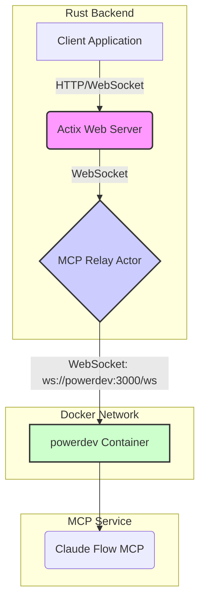

# ClaudeFlowActor Architecture

This document describes the ClaudeFlowActor implementation that integrates the Claude Flow MCP (Model Context Protocol) with the LogseqXR backend.

## Overview

The `ClaudeFlowActor` is a Rust Actix actor that manages the connection to the Claude Flow MCP server. It connects to a dedicated, containerized MCP service (`powerdev`) over the network using **WebSockets**, and provides agent data to the visualization system. The previous `stdio` transport mechanism has been disabled.

## Architecture

### Actor Structure

```rust
pub struct ClaudeFlowActor {
    client: ClaudeFlowClient,           // MCP client
    graph_service_addr: Addr<GraphServiceActor>,  // Graph visualization service
    is_connected: bool,                 // Connection status
}
```

### Transport Mechanism

The actor exclusively uses **WebSocket transport** to connect to the `powerdev` container. The `StdioTransport` has been disabled.

```rust
// src/actors/claude_flow_actor.rs
let host = std::env::var("CLAUDE_FLOW_HOST").unwrap_or_else(|_| "powerdev".to_string());
let port = std::env::var("CLAUDE_FLOW_PORT")
    // ...
    .unwrap_or(3000);

let mut client = ClaudeFlowClientBuilder::new()
    .host(&host)
    .port(port)
    .use_websocket()  // <-- Explicitly uses WebSocket
    .build()
    .await
    .expect("Failed to build ClaudeFlowClient");
```

### Disabled Stdio Transport

The `StdioTransport` implementation in `src/services/claude_flow/transport/stdio.rs` is no longer used. Its `connect` function now returns an error to prevent its use.

```rust
// src/services/claude_flow/transport/stdio.rs
async fn connect(&mut self) -> Result<()> {
    warn!("StdioTransport::connect() called, but this transport is disabled...");
    Err(ConnectorError::Connection("StdioTransport is disabled.".to_string()))
}
```

## Data Flow

### 1. Initialization Sequence



### 2. Agent Polling

The actor polls for agent updates periodically when connected.

```rust
// Polls every 5 seconds when connected
ctx.run_interval(Duration::from_secs(5), |act, _ctx| {
    let client = act.client.clone();
    let graph_addr = act.graph_service_addr.clone();

    actix::spawn(async move {
        match client.list_agents(false).await {
            Ok(agents) => {
                graph_addr.do_send(UpdateBotsGraph { agents });
            }
            Err(e) => error!("Failed to poll agents: {}", e),
        }
    });
});
```

### 3. Mock Mode

When the connection to the `powerdev` container is unavailable, the actor can provide mock data for development and testing purposes.

```rust
fn create_mock_agents() -> Vec<AgentStatus> {
    vec![
        AgentStatus {
            agent_id: "coordinator-001",
            status: "active",
            profile: AgentProfile {
                name: "System Coordinator",
                agent_type: AgentType::Coordinator,
                capabilities: vec!["orchestration", "task-management"],
            },
            // ... other fields
        },
        // ... more mock agents
    ]
}
```

## Message Handlers

The actor responds to several messages to manage the agent swarm.

- **GetActiveAgents**: Returns the current list of agents (real or mock).
- **SpawnClaudeAgent**: Creates a new agent in the swarm.
- **InitializeSwarm**: Initializes a complete swarm configuration.

## Environment Configuration

The actor's connection settings are configured via environment variables.

```bash
# Hostname of the container running Claude Flow MCP
CLAUDE_FLOW_HOST=powerdev    # Default: "powerdev"

# Port for the WebSocket connection
CLAUDE_FLOW_PORT=3000       # Default: 3000
```

## Health Monitoring

Health checks are performed every 30 seconds to ensure the MCP service is responsive.

```rust
ctx.run_interval(Duration::from_secs(30), |act, _ctx| {
    let client = act.client.clone();

    actix::spawn(async move {
        match client.get_system_health().await {
            Ok(health) if health.status != "healthy" => {
                warn!("System health check failed: {:?}", health);
            }
            Err(e) => error!("Health check failed: {}", e),
            _ => {}
        }
    });
});
```

## Error Handling and Degraded Mode

The actor is designed for resilience:
1.  **Connection Failure**: Logs the error and switches to mock mode, ensuring the UI remains functional.
2.  **Polling/Health Check Errors**: Errors are logged without crashing the actor, maintaining system stability.

## Container Integration

The system relies on Docker networking for service discovery. The backend service connects to the `powerdev` container using its service name (`powerdev`) as the hostname. No local Node.js/npm installation is required for the backend container to communicate with the MCP.

## API Integration

The actor integrates with the main application's REST API to expose bot management endpoints:

-   `GET /api/bots/agents`
-   `POST /api/bots/spawn`
-   `POST /api/bots/swarm/init`
-   `DELETE /api/bots/agent/:id`

## Performance Considerations

1.  **Network Communication**: All communication is over WebSockets, managed by the `tungstenite` library.
2.  **Polling Intervals**: Agent polling (5s) and health checks (30s) are asynchronous and non-blocking.
3.  **Resource Usage**: As a client, the actor's resource footprint is minimal. The `powerdev` container manages the resource-intensive MCP process.

## Future Enhancements

1.  **Event Streaming**: Replace polling with a full event-driven model for real-time updates.
2.  **Dynamic Reconnection**: Implement more robust logic to automatically re-establish lost WebSocket connections.
3.  **Metrics Collection**: Integrate with Prometheus or a similar tool for detailed performance monitoring.

## Troubleshooting

### Common Issues

1.  **Connection Refused Errors**
    -   Verify the `powerdev` container is running and healthy: `docker ps | grep powerdev`.
    -   Check Docker network settings to ensure the backend container can resolve the `powerdev` hostname.
    -   Confirm `CLAUDE_FLOW_HOST` and `CLAUDE_FLOW_PORT` environment variables are set correctly.

2.  **WebSocket Handshake Failures**
    -   Inspect logs from both the backend and the `powerdev` container for error messages.
    -   Enable debug logging for more detailed output: `RUST_LOG=debug`.

### Debug Commands

```bash
# Check container logs for errors
docker logs <backend_container_id>
docker logs <powerdev_container_id>

# Check actor-specific logs
RUST_LOG=logseq_spring_thing::actors::claude_flow_actor=debug ./target/release/visionflow
```