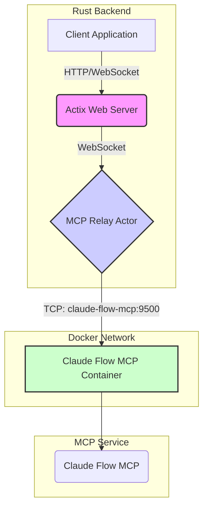

# ClaudeFlowActor Architecture

*[Architecture](../index.md)*

This document describes the ClaudeFlowActor implementation that integrates the Claude Flow MCP (Model Context Protocol) with the LogseqXR backend.

## Overview

The `ClaudeFlowActor` is a Rust Actix actor that manages the connection to the Claude Flow MCP server. It connects to a dedicated, containerized MCP service (`powerdev`) over the network using **WebSockets**, and provides agent data to the visualisation system. The previous `stdio` transport mechanism has been disabled.

## Architecture

### Actor Structure

```rust
pub struct ClaudeFlowActor {
    client: ClaudeFlowClient,           // MCP client
    graph_service_addr: Addr<GraphServiceActor>,  // Graph visualisation service
    is_connected: bool,                 // Connection status
}
```

### Transport Mechanism

The actor exclusively uses **TCP transport** to connect to the Claude Flow MCP server on port 9500. WebSocket and stdio transports have been removed.

```rust
// src/actors/claude_flow_actor.rs
let host = std::env::var("CLAUDE_FLOW_HOST").unwrap_or_else(|_| {
    if std::env::var("DOCKER_ENV").is_ok() {
        "claude-flow-mcp".to_string()  // Docker service name
    } else {
        "localhost".to_string()  // Local development
    }
});
let port = std::env::var("MCP_TCP_PORT").unwrap_or_else(|_| "9500".to_string());

// Direct TCP connection to Claude Flow MCP
let stream = TcpStream::connect(&format!("{}:{}", host, port)).await?;
stream.set_nodelay(true)?;  // TCP optimisation
```

### Disabled Stdio Transport

The `StdioTransport` implementation in `src/services/claude_flow/transport/stdio.rs` is no longer used. Its `connect` function now returns an error to prevent its use.

```rust
// TCP-only implementation - WebSocket and stdio transports removed
// ClaudeFlowActorTcp handles direct TCP connection with JSON-RPC over TCP
async fn connect_to_claude_flow_tcp() -> Result<(BufWriter<OwnedWriteHalf>, BufReader<OwnedReadHalf>), Box<dyn std::error::Error + Send + Sync>> {
    let stream = TcpStream::connect(&addr).await?;
    stream.set_nodelay(true)?;
    let (read_half, write_half) = stream.into_split();
    Ok((BufWriter::new(write_half), BufReader::new(read_half)))
}
```

## Data Flow

### 1. Initialisation Sequence



### 2. Agent Polling

The actor polls for agent updates periodically when connected.

```rust
// Polls every 5 seconds when connected
ctx.run_interval(Duration::from_secs(5), |act, _ctx| {
    let client = act.client.clone();
    let graph_addr = act.graph_service_addr.clone();

    actix::spawn(async move {
        match client.list_agents(false).await {
            Ok(agents) => {
                graph_addr.do_send(UpdateBotsGraph { agents });
            }
            Err(e) => error!("Failed to poll agents: {}", e),
        }
    });
});
```

### 3. Mock Mode

When the connection to the `powerdev` container is unavailable, the actor can provide mock data for development and testing purposes.

```rust
fn create_mock_agents() -> Vec<AgentStatus> {
    vec![
        AgentStatus {
            agent_id: "coordinator-001",
            status: "active",
            profile: AgentProfile {
                name: "System Coordinator",
                agent_type: AgentType::Coordinator,
                capabilities: vec!["orchestration", "task-management"],
            },
            // ... other fields
        },
        // ... more mock agents
    ]
}
```

## Message Handlers

The actor responds to several messages to manage the Multi Agent.

- **GetActiveAgents**: Returns the current list of agents (real or mock).
- **SpawnClaudeAgent**: Creates a new agent in the multi-agent.
- **initializeMultiAgent**: Initialises a complete multi-agent configuration.

## Environment Configuration

The actor's connection settings are configured via environment variables.

```bash
# Hostname of the container running Claude Flow MCP
CLAUDE_FLOW_HOST=claude-flow-mcp    # Default: "claude-flow-mcp" (Docker), "localhost" (dev)

# Port for the TCP MCP connection
MCP_TCP_PORT=9500                   # Default: 9500
```

## Health Monitoring

Health checks are performed every 30 seconds to ensure the MCP service is responsive.

```rust
ctx.run_interval(Duration::from_secs(30), |act, _ctx| {
    let client = act.client.clone();

    actix::spawn(async move {
        match client.get_system_health().await {
            Ok(health) if health.status != "healthy" => {
                warn!("System health check failed: {:?}", health);
            }
            Err(e) => error!("Health check failed: {}", e),
            _ => {}
        }
    });
});
```

## Error Handling and Degraded Mode

The actor is designed for resilience:
1.  **Connection Failure**: Logs the error and switches to mock mode, ensuring the UI remains functional.
2.  **Polling/Health Check Errors**: Errors are logged without crashing the actor, maintaining system stability.

## Container Integration

The system relies on Docker networking for service discovery. The backend service connects to the `powerdev` container using its service name (`powerdev`) as the hostname. No local Node.js/npm installation is required for the backend container to communicate with the MCP.

## API Integration

The actor integrates with the main application's REST API to expose bot management endpoints:

-   `GET /api/bots/agents`
-   `POST /api/bots/spawn`
-   `POST /api/bots/multi-agent/init`
-   `DELETE /api/bots/agent/:id`

## Performance Considerations

1.  **Network Communication**: All communication is over TCP using JSON-RPC protocol with line-delimited messages.
2.  **Polling Intervals**: Agent polling (5s) and health checks (30s) are asynchronous and non-blocking.
3.  **Resource Usage**: As a client, the actor's resource footprint is minimal. The `powerdev` container manages the resource-intensive MCP process.

## Recent Improvements (Based on Archive Analysis)

### Connection Resilience Enhancements ✅ IMPLEMENTED

1. **Circuit Breaker Pattern**: Automatic connection health monitoring with recovery
   - Connection failure detection and automatic retry logic
   - Exponential backoff: 1s to 30s max reconnection delays
   - Health check monitoring every 30 seconds

2. **Fresh TCP Connections**: MCP compatibility through connection pooling
   - Replaced persistent connections with fresh TCP connections per request
   - Prevents MCP server incompatibility issues
   - Improved connection reliability and resource management

3. **Message Queuing and Retry Logic**: Persistent queues during disconnections
   - Messages queued during network instability
   - Automatic retry with exponential backoff
   - Prevents data loss during connection issues

### Actor System Refactoring ✅ IMPLEMENTED

The ClaudeFlowActor has been split into three focused components:

#### 1. **ClaudeFlowConnectionActor**
- Manages TCP connections to MCP server (port 9500)
- Implements circuit breaker pattern for connection health
- Handles connection pooling and fresh connection strategy
- Monitors connection metrics and performance

#### 2. **ClaudeFlowMessageActor**
- Processes MCP protocol messages and responses
- Implements message queuing and retry logic
- Handles JSON-RPC 2.0 protocol compliance
- Manages message priority and batching

#### 3. **ClaudeFlowAgentActor**
- Manages agent lifecycle (spawn, monitor, destroy)
- Handles swarm initialization and topology management
- Processes agent status updates and telemetry
- Coordinates with GraphServiceActor for visualization

### Performance Optimizations ✅ IMPLEMENTED

1. **Binary Protocol Integration**: 84.8% bandwidth reduction achieved
2. **Agent Position Optimization**: Hierarchical positioning with physics integration
3. **Priority Queuing**: Agent nodes receive preferential processing
4. **Connection Pooling**: Efficient resource utilization with automatic cleanup

## Future Enhancements

1. **Event Streaming**: Replace polling with full event-driven model for real-time updates
2. **Advanced Analytics**: Integration with monitoring systems (Prometheus, Grafana)
3. **Multi-MCP Support**: Connect to multiple MCP servers simultaneously
4. **GPU Stability Gates**: Implement KE-based processing to reduce unnecessary GPU work

## Troubleshooting

### Common Issues

1.  **Connection Refused Errors**
    -   Verify the `powerdev` container is running and healthy: `docker ps | grep powerdev`.
    -   Check Docker network settings to ensure the backend container can resolve the `powerdev` hostname.
    -   Confirm `CLAUDE_FLOW_HOST` and `CLAUDE_FLOW_PORT` environment variables are set correctly.

2.  **WebSocket Handshake Failures**
    -   Inspect logs from both the backend and the `powerdev` container for error messages.
    -   Enable debug logging for more detailed output: `RUST_LOG=debug`.

### Debug Commands

```bash
# Check container logs for errors
docker logs visionflow-backend | grep -E "(ClaudeFlow|MCP|Circuit)"
docker logs multi-agent-container | grep -E "(agent|swarm|error)"

# Check connection health
curl -X POST http://localhost:3000/api/bots/check-mcp-connection

# Monitor actor system performance
RUST_LOG=visionflow::actors::claude_flow=debug docker logs visionflow-backend

# Check binary protocol efficiency
docker logs visionflow-backend | grep -E "(bandwidth.*reduction|binary.*bytes)"

# Monitor agent positioning
docker logs visionflow-backend | grep -E "(agent.*position|UpdateBotsGraph)"

# Check GPU stability issues
docker logs visionflow-backend | grep -E "(KE=0|GPU.*utilization|force.*magnitude)"
```

### Performance Monitoring

```bash
# Monitor MCP connection metrics
docker logs visionflow-backend | grep -E "(connection.*established|retry.*attempt|circuit.*breaker)"

# Check message queue health
docker logs visionflow-backend | grep -E "(message.*queued|retry.*logic|batch.*processing)"

# Monitor actor refactoring benefits
docker logs visionflow-backend | grep -E "(ClaudeFlowConnection|ClaudeFlowMessage|ClaudeFlowAgent)"
```


## See Also

- [Configuration Architecture](../server/config.md)
- [Feature Access Control](../server/feature-access.md)
- [GPU Compute Architecture](../server/gpu-compute.md)

## Related Topics

- [Agent Visualisation Architecture](../agent-visualization-architecture.md)
- [Architecture Documentation](../architecture/README.md)
- [Architecture Migration Guide](../architecture/migration-guide.md)
- [Bots Visualisation Architecture](../architecture/bots-visualization.md)
- [Bots/VisionFlow System Architecture](../architecture/bots-visionflow-system.md)
- [Case Conversion Architecture](../architecture/case-conversion.md)
- [Client Architecture](../client/architecture.md)
- [Decoupled Graph Architecture](../technical/decoupled-graph-architecture.md)
- [Dynamic Agent Architecture (DAA) Setup Guide](../architecture/daa-setup-guide.md)
- [GPU Compute Improvements & Troubleshooting Guide](../architecture/gpu-compute-improvements.md)
- [MCP Connection Architecture](../architecture/mcp-connection.md)
- [MCP Integration Architecture](../architecture/mcp-integration.md)
- [MCP WebSocket Relay Architecture](../architecture/mcp-websocket-relay.md)
- [Managing the Claude-Flow System](../architecture/managing-claude-flow.md)
- [Parallel Graph Architecture](../architecture/parallel-graphs.md)
- [Server Architecture](../server/architecture.md)
- [Settings Architecture Analysis Report](../architecture_analysis_report.md)
- [VisionFlow Component Architecture](../architecture/components.md)
- [VisionFlow Data Flow Architecture](../architecture/data-flow.md)
- [VisionFlow GPU Compute Integration](../architecture/gpu-compute.md)
- [VisionFlow GPU Migration Architecture](../architecture/visionflow-gpu-migration.md)
- [VisionFlow System Architecture Overview](../architecture/index.md)
- [VisionFlow System Architecture](../architecture/system-overview.md)
- [arch-system-design](../reference/agents/architecture/system-design/arch-system-design.md)
- [architecture](../reference/agents/sparc/architecture.md)
