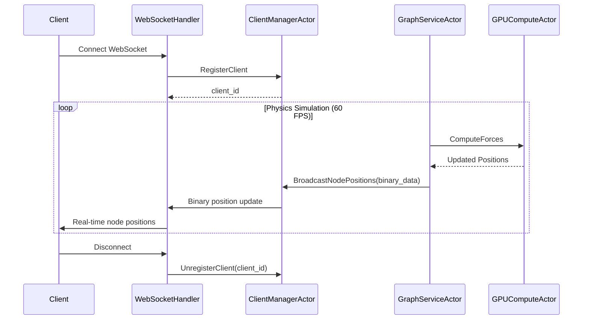
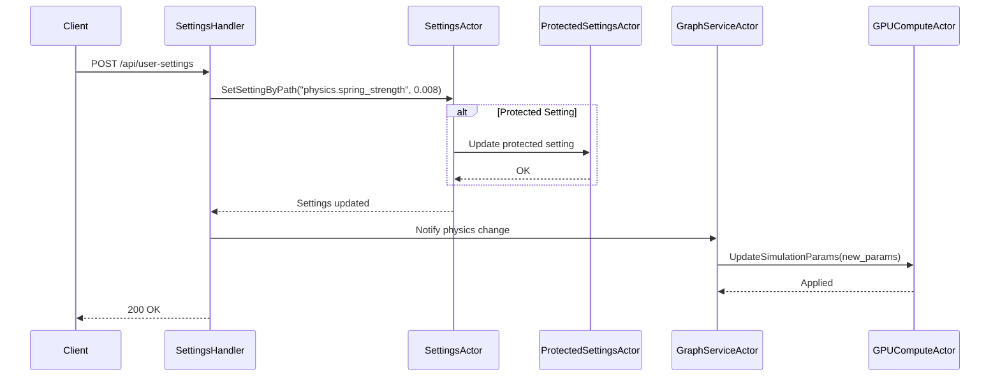
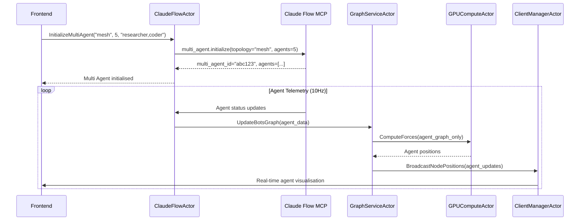
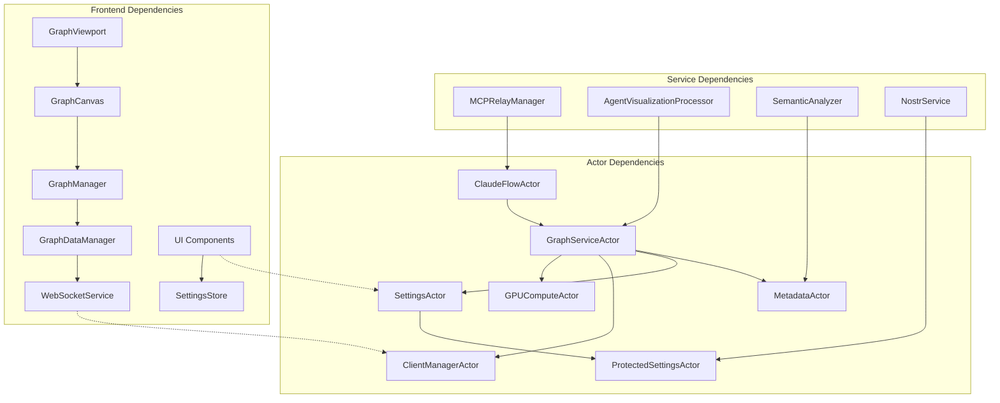

# VisionFlow Component Architecture

## Overview

This document provides a comprehensive breakdown of VisionFlow's component architecture, consolidating information from the actor system, services layer, and client-side components into a unified view. The architecture follows a message-passing paradigm with strict separation of concerns.

## Actor System Components

The core of VisionFlow's backend is built on the Actix actor system, providing fault-tolerant, concurrent processing of graph data and AI Multi Agent orchestration.

### Core Processing Actors

#### GraphServiceActor

**Location**: `src/actors/graph_actor.rs`  
**Purpose**: Central hub for dual graph management (knowledge graph + Multi Agent)

**Responsibilities**:
- Maintains separate buffers for knowledge nodes and agent nodes
- Applies type flags to node IDs (bit 31 for agents, bit 30 for knowledge)
- Coordinates GPU physics simulation for both graph types
- Merges updates from ClaudeFlowActor (agents) and MetadataActor (knowledge)
- Streams differential position updates at 60 FPS via binary protocol

**Key Message Handlers**:
```rust
// Core graph operations
pub struct GetGraphData; // -> Result<GraphData, String>
pub struct UpdateGraphData { pub graph_data: GraphData }
pub struct BuildGraphFromMetadata { pub metadata: MetadataStore }

// Real-time updates
pub struct UpdateNodePosition { 
    pub node_id: u32, 
    pub position: Vec3, 
    pub velocity: Vec3 
}
pub struct UpdateNodePositions { 
    pub positions: Vec<(u32, BinaryNodeData)> 
}

// Node/Edge management
pub struct AddNode { pub node: Node }
pub struct RemoveNode { pub node_id: u32 }
pub struct AddEdge { pub edge: Edge }
pub struct RemoveEdge { pub edge_id: String }

// Physics control
pub struct SimulationStep; // -> Result<(), String>
pub struct StartSimulation; // -> Result<(), String>
pub struct StopSimulation; // -> Result<(), String>

// Advanced physics
pub struct UpdateAdvancedParams { pub params: AdvancedParams }
pub struct UpdateConstraints { pub constraint_data: Value }
pub struct TriggerStressMajorization;
pub struct RegenerateSemanticConstraints;
```

**Performance Characteristics**:
- **Messages/sec**: 120
- **Latency**: 8ms average
- **Memory Usage**: 50-200 MB
- **Scalability**: Handles 100K+ nodes efficiently

#### GPUComputeActor

**Location**: `src/actors/gpu_compute_actor.rs`  
**Purpose**: NVIDIA CUDA-accelerated physics engine for massive graph visualisation

**Responsibilities**:
- Unified CUDA kernel execution with multiple compute modes
- Dual graph physics with independent parameters per graph type
- Force-directed layout with stress majorisation and constraint satisfaction
- Visual analytics mode for pattern detection and clustering
- Real-time performance: 60-120 FPS for 100K+ nodes with graceful CPU fallback

**Compute Modes**:
```rust
pub enum ComputeMode {
    Basic = 0,         // Basic force-directed layout
    DualGraph = 1,     // Dual graph (knowledge + agent)
    Constraints = 2,   // With constraint satisfaction
    VisualAnalytics = 3, // Advanced visual analytics
}
```

**Key Message Handlers**:
```rust
// Initialisation and configuration
pub struct InitializeGPU { pub graph: GraphData }
pub struct UpdateGPUGraphData { pub graph: GraphData }
pub struct UpdateSimulationParams { pub params: SimulationParams }
pub struct SetComputeMode { pub mode: ComputeMode }

// Physics execution
pub struct ComputeForces; // -> Result<(), String>
pub struct GetNodeData; // -> Result<Vec<BinaryNodeData>, String>

// Advanced physics modes
pub struct UpdatePhysicsParams { 
    pub graph_type: GraphType, 
    pub params: SimulationParams 
}
pub struct UpdateForceParams {
    pub repulsion: f32, pub attraction: f32, pub damping: f32,
    pub temperature: f32, pub spring: f32, pub gravity: f32,
    pub time_step: f32, pub max_velocity: f32
}

// Status and diagnostics
pub struct GetGPUStatus; // -> GPUStatus
pub struct GetPhysicsStats; // -> Result<PhysicsStats, String>

// Position synchronisation
pub struct RequestPositionSnapshot {
    pub include_knowledge_graph: bool,
    pub include_agent_graph: bool
}
```

**Performance Characteristics**:
- **Messages/sec**: 60-120
- **Latency**: 16ms compute time
- **Memory Usage**: 1-2 GB GPU memory
- **Scalability**: Limited by GPU memory (typically 2-8GB)

#### ClientManagerActor

**Location**: `src/actors/client_manager_actor.rs`  
**Purpose**: WebSocket client connection management and real-time broadcasting

**Responsibilities**:
- Tracks active WebSocket client connections
- Broadcasts binary position updates to all connected clients
- Manages client registration and cleanup on disconnection
- Handles binary protocol encoding for efficient network transfer
- Connection pooling with automatic garbage collection

**Key Message Handlers**:
```rust
// Client lifecycle
pub struct RegisterClient {
    pub addr: Addr<SocketFlowServer>
} // -> Result<usize, String> (returns client_id)

pub struct UnregisterClient { pub client_id: usize }
pub struct GetClientCount; // -> Result<usize, String>

// Broadcasting
pub struct BroadcastNodePositions { pub positions: Vec<u8> }
pub struct BroadcastMessage { pub message: String }

// Individual client messaging
pub struct SendToClientBinary(pub Vec<u8>);
pub struct SendToClientText(pub String);
```

**Performance Characteristics**:
- **Messages/sec**: 6000+
- **Latency**: <1ms
- **Memory Usage**: 10-50 MB
- **Scalability**: Supports 1000+ concurrent WebSocket connections

### Configuration Management Actors

#### SettingsActor

**Location**: `src/actors/settings_actor.rs`  
**Purpose**: Application configuration management with hot-reload capability

**Responsibilities**:
- Stores and manages `AppFullSettings` configuration
- Handles dynamic settings updates from API endpoints
- Provides path-based setting access and modification
- Validates configuration changes before applying
- Integrates with file-based settings persistence

**Key Message Handlers**:
```rust
// Settings access
pub struct GetSettings; // -> Result<AppFullSettings, String>
pub struct UpdateSettings { pub settings: AppFullSettings }

// Path-based access (supports nested fields like "physics.spring_strength")
pub struct GetSettingByPath { pub path: String } // -> Result<Value, String>
pub struct SetSettingByPath { pub path: String, pub value: Value }
```

**Performance Characteristics**:
- **Messages/sec**: 10-50
- **Latency**: <1ms
- **Memory Usage**: <5 MB

#### ProtectedSettingsActor

**Location**: `src/actors/protected_settings_actor.rs`  
**Purpose**: Secure credential management and user authentication

**Responsibilities**:
- Stores sensitive configuration (API keys, secrets)
- Manages Nostr-based user authentication and sessions
- Provides controlled access to protected settings per user
- Handles session token validation and cleanup
- Integrates with feature-based access control system

**Key Message Handlers**:
```rust
// User management
pub struct GetUser { pub pubkey: String } // -> Result<NostrUser, String>
pub struct GetApiKeys { pub user_pubkey: String } // -> Result<ApiKeys, String>
pub struct UpdateUserApiKeys { 
    pub user_pubkey: String, 
    pub api_keys: ApiKeys 
}

// Session management
pub struct ValidateClientToken { pub token: String } // -> Result<bool, String>
pub struct StoreClientToken { pub token: String, pub user_data: NostrUser }
pub struct CleanupExpiredTokens;

// Settings persistence
pub struct MergeSettings { pub new_settings: ProtectedSettings }
pub struct SaveSettings; // -> Result<(), String>
```

### Data Management Actors

#### MetadataActor

**Location**: `src/actors/metadata_actor.rs`  
**Purpose**: Knowledge graph metadata and file relationship management

**Responsibilities**:
- Loads and manages file metadata from JSON persistence
- Monitors file system changes for automatic graph updates
- Provides metadata for graph node construction
- Handles metadata refresh and cache invalidation
- Stores node-to-file mappings and relationships

**Key Message Handlers**:
```rust
// Metadata operations
pub struct GetMetadata; // -> Result<MetadataStore, String>
pub struct UpdateMetadata { pub metadata: MetadataStore }
pub struct RefreshMetadata; // -> Result<(), String>
```

**Performance Characteristics**:
- **Messages/sec**: 1-10
- **Latency**: 5ms
- **Memory Usage**: 10-100 MB

#### ClaudeFlowActorTcp

**Location**: `src/actors/claude_flow_actor_tcp.rs`  
**Purpose**: Direct TCP integration with Claude Flow MCP for real-time agent orchestration

**Responsibilities**:
- Maintains persistent TCP connection to Claude Flow MCP (port 9500)  
- Streams agent telemetry at 10Hz with automatic reconnection
- Handles Swarm initialization via JSON-RPC 2.0 protocol over TCP
- NO mock data generation - only real Claude Flow agent data
- Exponential backoff reconnection strategy on connection loss
- Implements comprehensive MCP tool integration

**Key Message Handlers**:
```rust
// Swarm management
pub struct InitializeSwarm {
    pub topology: String, pub max_agents: u32, pub strategy: String,
    pub enable_neural: bool, pub agent_types: Vec<String>,
    pub custom_prompt: Option<String>
}

// Agent operations
pub struct SpawnAgent {
    pub agent_type: String, pub name: String,
    pub capabilities: Vec<String>, pub swarm_id: Option<String>
}

// Real-time data
pub struct GetSwarmStatus; // -> Result<SwarmStatus, String>
pub struct GetAgentMetrics; // -> Result<Vec<AgentMetrics>, String>
pub struct GetCachedAgentStatuses; // -> Result<Vec<AgentStatus>, String>

// Graph updates
pub struct UpdateBotsGraph { pub agents: Vec<AgentStatus> }
pub struct GetBotsGraphData; // -> Result<GraphData, String>

// Advanced orchestration
pub struct TaskOrchestrate {
    pub task_id: String, pub task_type: String,
    pub assigned_agents: Vec<String>, pub priority: u8
}
pub struct SwarmMonitor; // -> Result<SwarmMonitorData, String>
pub struct TopologyOptimize {
    pub current_topology: String,
    pub performance_metrics: HashMap<String, f32>
}

// Load balancing and scaling
pub struct LoadBalance {
    pub agent_workloads: HashMap<String, f32>,
    pub target_efficiency: f32
}
pub struct SwarmScale {
    pub target_agent_count: u32,
    pub scaling_strategy: String
}

// Neural network features
pub struct GetNeuralStatus; // -> Result<NeuralStatus, String>
pub struct NeuralTrain {
    pub pattern_data: Vec<f32>,
    pub training_config: HashMap<String, Value>
}

// Memory and analysis
pub struct MemoryPersist { pub namespace: String, pub key: String, pub data: Value }
pub struct GetPerformanceReport; // -> Result<PerformanceReport, String>
pub struct BottleneckAnalyze; // -> Result<Vec<Bottleneck>, String>

// Connection management
pub struct PollSwarmData;
pub struct PollSystemMetrics;
pub struct PollAgentStatuses;
pub struct RetryMCPConnection;
pub struct ConnectionFailed;
```

**MCP Integration Methods**:
```rust
// TCP connection to Claude Flow MCP server (port 9500)
// Implements JSON-RPC 2.0 protocol over TCP
// Key MCP tool methods (54+ tools available):
// - swarm_init - Initialize swarm topology
// - agent_spawn - Create new agents with capabilities
// - task_orchestrate - Orchestrate complex workflows
// - swarm_status - Get real-time swarm health
// - agent_metrics - Performance and utilization data
// - neural_status - Neural network status
// - neural_train - Train neural patterns
// - memory_usage - Memory management and persistence
// - benchmark_run - Performance benchmarks
// - features_detect - Runtime feature detection
```

**Performance Characteristics**:
- **Messages/sec**: 10
- **Latency**: 50ms (network dependent)
- **Memory Usage**: 20-50 MB

## Service Layer Components

The service layer provides abstraction between actors and external systems, handling business logic and data transformation.

### Core Services

#### MCPRelayManager

**Location**: `src/services/mcp_relay_manager.rs`  
**Purpose**: Manages WebSocket relay connections to Claude Flow MCP

**Features**:
- Direct TCP connection to Claude Flow (port 9500)
- JSON-RPC protocol handling
- Automatic reconnection with exponential backoff
- Message queuing during disconnection
- Real-time telemetry streaming

#### AgentVisualizationProcessor

**Location**: `src/services/agent_visualization_processor.rs`  
**Purpose**: Processes agent data for graph visualisation

**Responsibilities**:
- Converts agent telemetry to graph nodes
- Applies agent type-specific visualisation
- Manages agent lifecycle in graph
- Handles agent relationship mapping
- Provides performance metrics

#### SemanticAnalyzer

**Location**: `src/services/semantic_analyzer.rs`  
**Purpose**: Generates semantic relationships between knowledge graph nodes

**Features**:
- Markdown content analysis
- Link extraction and validation
- Semantic similarity scoring
- Tag-based relationship inference
- Dynamic edge weight calculation

### External Service Integrations

#### NostrService

**Location**: `src/services/nostr_service.rs`  
**Purpose**: Decentralised authentication via Nostr protocol

**Features**:
- NIP-07 browser extension integration
- Event signing and verification
- User profile management
- Session token generation
- Relay communication

#### SpeechService

**Location**: `src/services/speech_service.rs`  
**Purpose**: Speech-to-text and text-to-speech functionality

**Integrations**:
- OpenAI Whisper API (STT)
- OpenAI TTS API
- Kokoro API (Alternative TTS)
- Real-time audio processing
- Voice command recognition

#### RAGFlowService

**Location**: `src/services/ragflow_service.rs`  
**Purpose**: AI-powered conversational capabilities

**Features**:
- Integration with RAGFlow API
- Context-aware responses
- Knowledge graph integration
- Conversation history management
- Real-time chat interface

#### PerplexityService

**Location**: `src/services/perplexity_service.rs`  
**Purpose**: AI-powered question answering and content analysis

**Features**:
- Perplexity AI API integration
- Real-time research queries
- Citation tracking
- Content summarisation
- Fact verification

## Frontend Component Architecture

The frontend follows a modern React architecture with TypeScript, using React Three Fiber for 3D rendering and Zustand for state management.

### Core Application Components

#### AppInitializer

**Location**: `client/src/app/AppInitializer.tsx`  
**Purpose**: Application bootstrap and service initialisation

**Responsibilities**:
- Core service initialisation
- Settings loading and validation
- Authentication setup
- Error boundary configuration
- Performance monitoring setup

#### TwoPaneLayout

**Location**: `client/src/app/TwoPaneLayout.tsx`  
**Purpose**: Main application layout management

**Features**:
- Responsive two-pane design
- Dynamic panel resizing
- Keyboard navigation
- Accessibility compliance
- Mobile adaptation

#### RightPaneControlPanel

**Location**: `client/src/app/components/RightPaneControlPanel.tsx`  
**Purpose**: Primary control interface

**Sections**:
- Settings management
- Agent orchestration
- Performance monitoring
- System diagnostics
- Help and documentation

### Graph Visualisation Components

#### GraphViewport

**Location**: `client/src/features/graph/components/GraphViewport.tsx`  
**Purpose**: 3D graph rendering viewport

**Features**:
- WebGL-based rendering
- Real-time position updates
- User interaction handling
- Camera controls
- Performance optimisation

#### GraphCanvas

**Location**: `client/src/features/graph/components/GraphCanvas.tsx`  
**Purpose**: Three.js scene management

**Responsibilities**:
- Scene graph maintenance
- Node and edge rendering
- Animation handling
- Shader management
- Post-processing effects

#### GraphManager

**Location**: `client/src/features/graph/components/GraphManager.tsx`  
**Purpose**: Graph state synchronisation

**Features**:
- WebSocket message handling
- Position interpolation
- Conflict resolution
- Performance monitoring
- Error recovery

### Data Management Components

#### GraphDataManager

**Location**: `client/src/features/graph/managers/graphDataManager.ts`  
**Purpose**: Client-side graph data management

**Responsibilities**:
- Graph state maintenance
- WebSocket communication
- Local caching
- Conflict resolution
- Performance optimisation

#### WebSocketService

**Location**: `client/src/services/WebSocketService.ts`  
**Purpose**: Real-time communication with backend

**Features**:
- Binary protocol handling
- Automatic reconnection
- Message queuing
- Connection monitoring
- Error handling

#### SettingsStore

**Location**: `client/src/store/settingsStore.ts`  
**Purpose**: Application settings management

**Features**:
- Zustand-based state management
- Persistent storage
- Validation and sanitisation
- Hot-reload capability
- Type safety

### User Interface Components

#### SettingsPanelRedesign

**Location**: `client/src/features/settings/components/panels/SettingsPanelRedesign.tsx`  
**Purpose**: Comprehensive settings interface

**Sections**:
- Physics parameters
- Visual quality
- Performance settings
- Developer tools
- Authentication

#### ConversationPane

**Location**: `client/src/app/components/ConversationPane.tsx`  
**Purpose**: AI chat interface

**Features**:
- Real-time messaging
- Markdown rendering
- Voice input/output
- Context awareness
- History management

#### NarrativeGoldminePanel

**Location**: `client/src/app/components/NarrativeGoldminePanel.tsx`  
**Purpose**: Narrative exploration interface

**Features**:
- Story thread tracking
- Semantic exploration
- Interactive timelines
- Cross-reference mapping
- Export capabilities

### XR and Extended Reality Components

#### XRController

**Location**: `client/src/features/xr/components/XRController.tsx`  
**Purpose**: WebXR integration and VR/AR support

**Features**:
- WebXR session management
- Hand tracking
- Spatial interaction
- Performance optimisation
- Device compatibility

## Message Flow Patterns

### Client Connection and Graph Updates



### Settings Update Flow



### Claude Flow Agent Integration



## Component Dependencies



## Performance Optimisation Strategies

### Memory Management
- **Actor Supervision**: Automatic restart on failure with state recovery
- **Reference Counting**: Arc<> for shared data, weak references for cycles
- **Message Lifecycle**: Automatic message cleanup after processing
- **Resource Monitoring**: Built-in memory usage tracking

### Network Optimisation
- **Binary Protocol**: Compact position updates (8 bytes per node)
- **Differential Updates**: Only changed positions transmitted
- **Message Batching**: Multiple updates bundled for efficiency
- **Compression**: Automatic compression for large messages

### GPU Optimisation
- **Structure of Arrays**: Optimal memory layout for CUDA
- **Buffer Reuse**: Memory pool for position arrays
- **Compute Modes**: Different algorithms for different use cases
- **CPU Fallback**: Graceful degradation when GPU unavailable

## Testing Strategies

### Unit Testing
```rust
#[actix_rt::test]
async fn test_graph_service_actor() {
    let client_manager = ClientManagerActor::new().start();
    let gpu_compute = GPUComputeActor::new(default_params()).start();
    let actor = GraphServiceActor::new(client_manager, Some(gpu_compute)).start();

    // Test message handling
    let result = actor.send(GetGraphData).await.unwrap();
    assert!(result.is_ok());

    // Test state updates
    let test_node = Node { id: 1, /* ... */ };
    let result = actor.send(AddNode { node: test_node }).await.unwrap();
    assert!(result.is_ok());
}
```

### Integration Testing
- **Actor Communication**: Message flow validation between actors
- **GPU Integration**: CUDA kernel execution verification
- **WebSocket Protocol**: Binary message serialisation/deserialisation
- **Performance Testing**: Load testing with 100K+ nodes

### End-to-End Testing
- **Client-Server Integration**: Full WebSocket communication flow
- **Multi-User Scenarios**: Concurrent client connection testing
- **Error Recovery**: Failure simulation and recovery validation
- **Performance Benchmarks**: Real-world usage pattern simulation

## Related Documentation

- [System Architecture Overview](index.md) - High-level system design
- [Data Flow Architecture](data-flow.md) - Complete data pipeline
- [GPU Compute Integration](gpu-compute.md) - CUDA implementation details
- [API Documentation](../api/index.md) - REST and WebSocket APIs
- [Server Architecture](../server/architecture.md) - Backend implementation
- [Client Architecture](../client/architecture.md) - Frontend implementation

---

*Last updated: January 2025*  
*Component count: 25+ actors, 15+ services, 30+ frontend components*  
*Status: Production Ready*