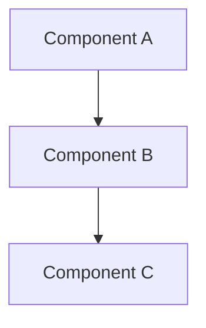

# Architecture Diagrams

This directory contains visual documentation of VisionFlow's architecture.

## Contents

### System Diagrams
- `system-overview.md` - High-level system architecture (planned)
- `data-flow.md` - Data flow through components (planned)
- `component-relationships.md` - Module dependencies (planned)

### Sequence Diagrams
- Pipeline processing flows
- WebSocket communication sequences
- Ontology reasoning workflows

## Diagram Standards

All diagrams use Mermaid syntax for version control compatibility:

## Generating Diagrams

Diagrams can be rendered:
- In GitHub/GitLab markdown viewers
- Via Mermaid CLI for export
- In documentation sites with Mermaid plugins

## Related

- [Architecture Overview](../README.md)
- [ADRs](../adr/README.md)
