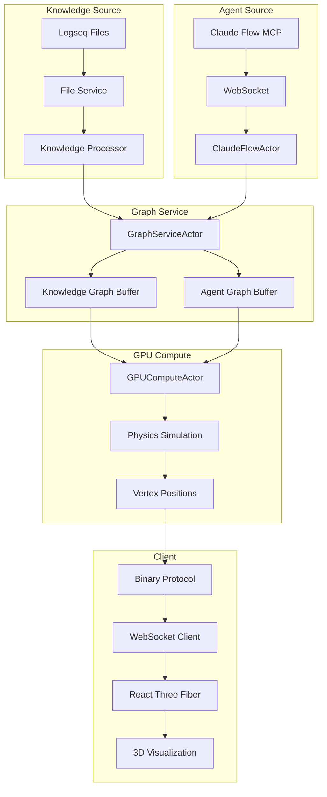

# Dual Graph Architecture

VisionFlow implements a sophisticated dual-graph system that enables simultaneous visualization of both knowledge structures and AI agent activity in a unified 3D space.

## Overview

The dual-graph architecture separates concerns between two distinct but interconnected graph types:

1. **Knowledge Graph** - Static knowledge structures from Logseq markdown files
2. **Agent Graph** - Dynamic AI agent swarm activity and interactions

Both graphs share the same 3D visualization space but maintain separate data structures, physics simulations, and update mechanisms.

## Graph Types

### Knowledge Graph

The Knowledge Graph represents:
- **Nodes**: Markdown documents, concepts, and knowledge entities
- **Edges**: Semantic relationships, references, and links
- **Source**: Logseq markdown files and metadata
- **Updates**: File system changes and manual edits
- **Physics**: Stable, slowly evolving layout

```typescript
interface KnowledgeNode {
  id: number;        // Bit 30 set (0x40000000)
  label: string;     // Document title or concept name
  content: string;   // Markdown content
  metadata: {
    tags: string[];
    created: Date;
    modified: Date;
    references: string[];
  };
}
```

### Agent Graph

The Agent Graph represents:
- **Nodes**: AI agents, coordinators, and specialists
- **Edges**: Communication channels and task dependencies
- **Source**: Claude Flow MCP orchestrator
- **Updates**: Real-time via WebSocket (100ms intervals)
- **Physics**: Dynamic, rapidly changing layout

```typescript
interface AgentNode {
  id: number;        // Bit 31 set (0x80000000)
  label: string;     // Agent name and role
  type: AgentType;   // coordinator, coder, researcher, etc.
  status: 'active' | 'idle' | 'busy';
  metrics: {
    cpu: number;
    memory: number;
    tasks: number;
    tokens: number;
  };
}
```

## Binary Protocol Type Flags

The system uses the high bits of the 32-bit node ID to distinguish between graph types:

```rust
// Node ID structure (32 bits)
// Bit 31: Agent flag (1 = agent node)
// Bit 30: Knowledge flag (1 = knowledge node)
// Bits 0-29: Actual node ID

const AGENT_NODE_FLAG: u32 = 0x80000000;     // Bit 31
const KNOWLEDGE_NODE_FLAG: u32 = 0x40000000; // Bit 30

fn encode_node_id(id: u32, is_agent: bool) -> u32 {
    if is_agent {
        id | AGENT_NODE_FLAG
    } else {
        id | KNOWLEDGE_NODE_FLAG
    }
}

fn decode_node_type(encoded_id: u32) -> NodeType {
    if encoded_id & AGENT_NODE_FLAG != 0 {
        NodeType::Agent
    } else if encoded_id & KNOWLEDGE_NODE_FLAG != 0 {
        NodeType::Knowledge
    } else {
        NodeType::Unknown
    }
}
```

## Data Flow Architecture



## Separation Strategies

### 1. Data Separation

Each graph maintains its own:
- Node buffer in GPU memory
- Edge buffer in GPU memory
- Metadata store in CPU memory
- Update queue for changes

### 2. Physics Separation

Different physics parameters for each graph:
- **Knowledge Graph**: High damping, low spring strength, stable layout
- **Agent Graph**: Low damping, high spring strength, dynamic layout

### 3. Rendering Separation

Visual differentiation:
- **Knowledge Nodes**: Blue spectrum, static icons, document previews
- **Agent Nodes**: Green spectrum, animated status, activity indicators
- **Mixed Edges**: Purple when connecting across graphs

## Update Mechanisms

### Knowledge Graph Updates

1. **File Watcher** detects markdown changes
2. **Semantic Analyzer** processes content
3. **Graph Builder** creates/updates nodes and edges
4. **GPU Upload** transfers to physics engine
5. **Layout Calculation** runs stress-majorization

### Agent Graph Updates

1. **MCP WebSocket** receives telemetry (10Hz)
2. **ClaudeFlowActor** processes agent status
3. **Differential Updates** compute changes
4. **Binary Protocol** streams positions (60 FPS)
5. **Force Simulation** maintains dynamic layout

## Performance Optimizations

### Separate Buffers

```rust
pub struct DualGraphBuffers {
    // Knowledge graph buffers
    knowledge_nodes: CudaBuffer<BinaryNodeData>,
    knowledge_edges: CudaBuffer<EdgeData>,
    knowledge_count: usize,
    
    // Agent graph buffers
    agent_nodes: CudaBuffer<BinaryNodeData>,
    agent_edges: CudaBuffer<EdgeData>,
    agent_count: usize,
    
    // Cross-graph edges (optional)
    cross_edges: CudaBuffer<EdgeData>,
}
```

### Selective Updates

Only update the graph that changed:
```rust
if knowledge_changed {
    gpu.update_knowledge_graph(&knowledge_data)?;
}

if agents_changed {
    gpu.update_agent_graph(&agent_data)?;
}
```

### Level-of-Detail (LOD)

Reduce detail for distant or inactive portions:
- Cull edges below threshold weight
- Simplify node representations
- Aggregate cluster details

## Cross-Graph Interactions

While graphs are separate, they can interact:

1. **Semantic Linking**: Agents reference knowledge nodes
2. **Task Assignment**: Knowledge triggers agent actions
3. **Result Integration**: Agent outputs update knowledge
4. **Unified Search**: Query across both graphs

## Configuration

Configure dual-graph behavior in `settings.yaml`:

```yaml
visualisation:
  graphs:
    knowledge:
      enabled: true
      physics:
        spring_strength: 0.001
        repulsion: 1000.0
        damping: 0.95
      rendering:
        node_size: 1.0
        edge_opacity: 0.6
        
    agents:
      enabled: true
      physics:
        spring_strength: 0.01
        repulsion: 500.0
        damping: 0.7
      rendering:
        node_size: 1.5
        edge_opacity: 0.8
        
    cross_graph:
      enabled: false
      max_edges: 100
      weight_threshold: 0.5
```

## Benefits

1. **Performance**: Independent update cycles
2. **Clarity**: Visual separation of concerns  
3. **Flexibility**: Different physics per graph type
4. **Scalability**: Parallel GPU processing
5. **Maintainability**: Clean code separation

## Implementation Details

See also:
- [Binary Protocol](../api/binary-protocol.md) for wire format
- [GPU Compute](gpu-compute.md) for physics implementation
- [System Overview](system-overview.md) for overall architecture