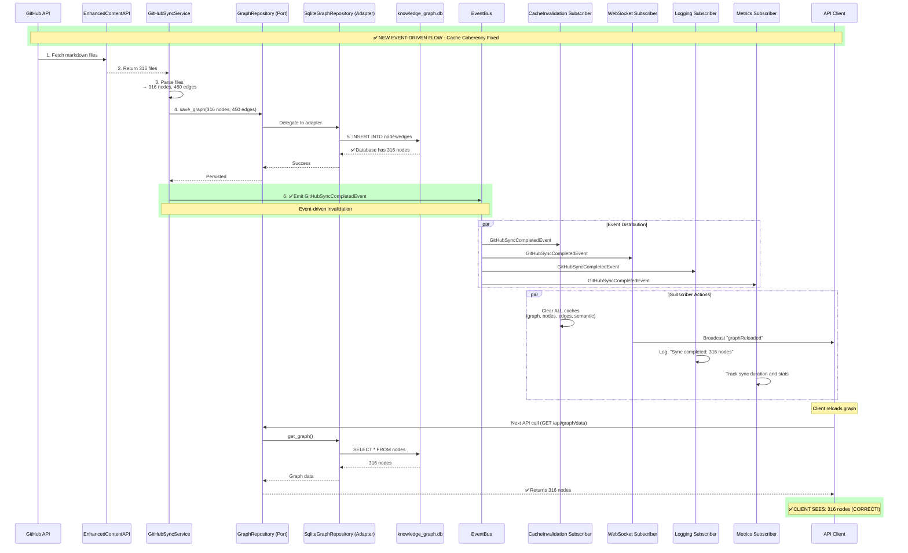
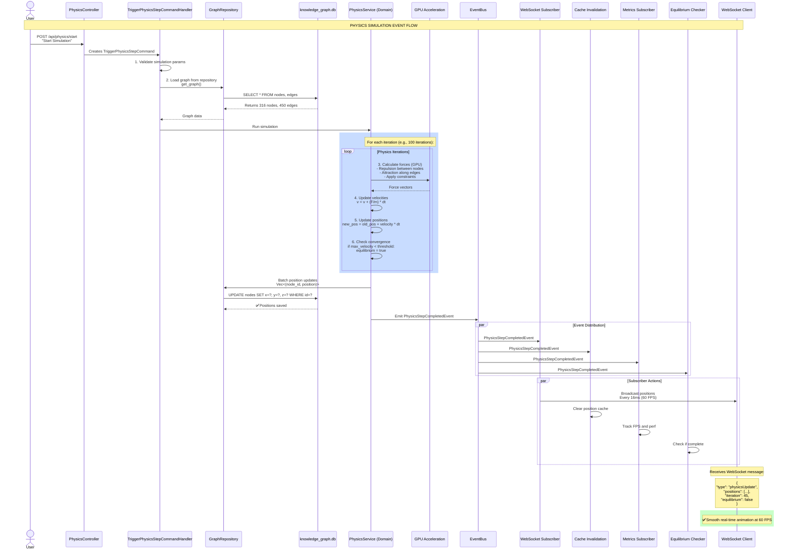
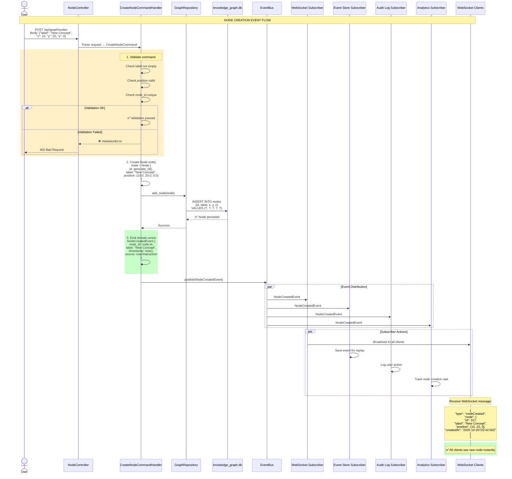
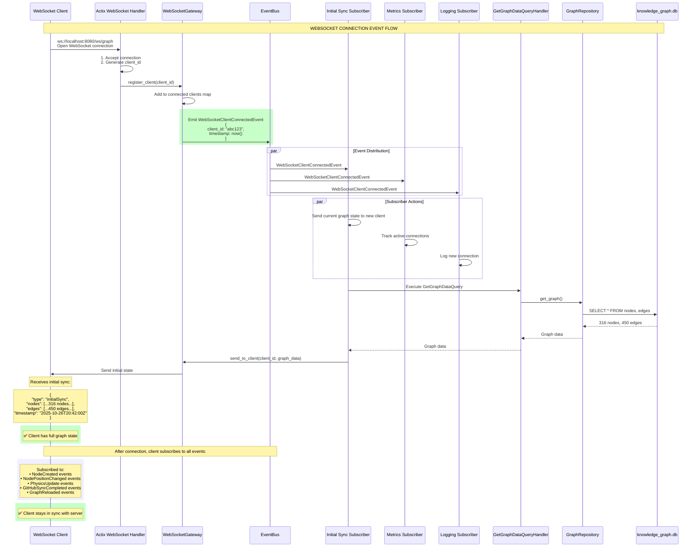
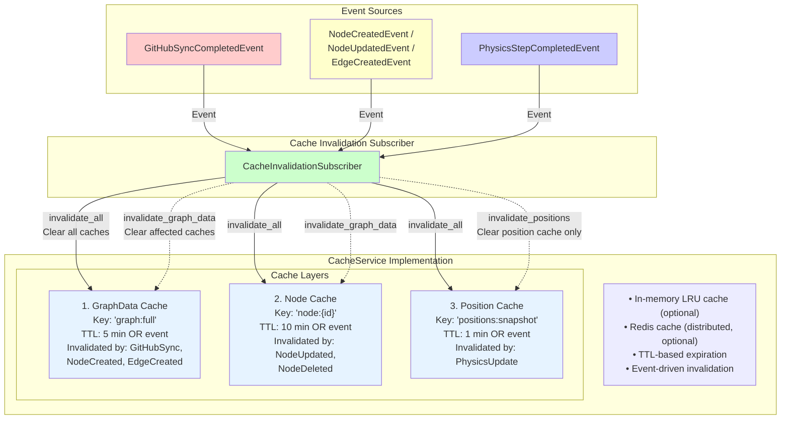
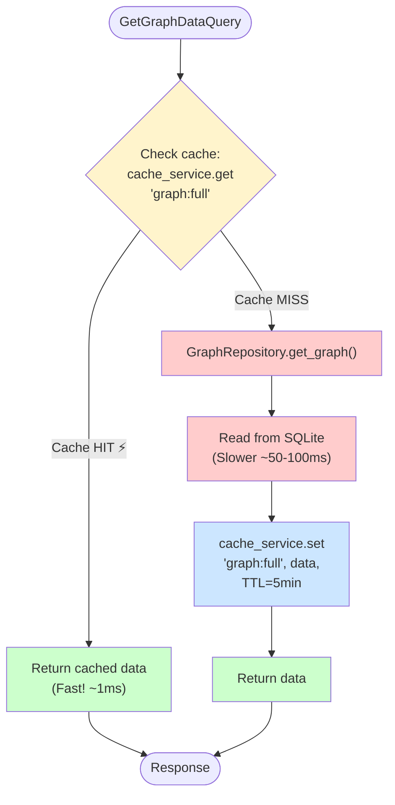
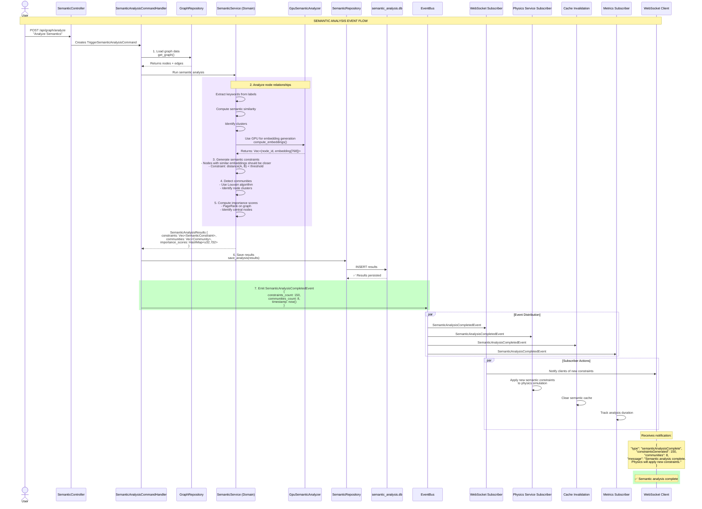
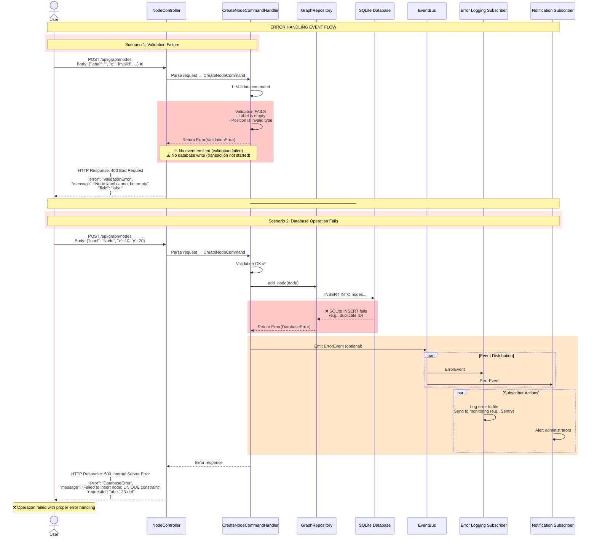
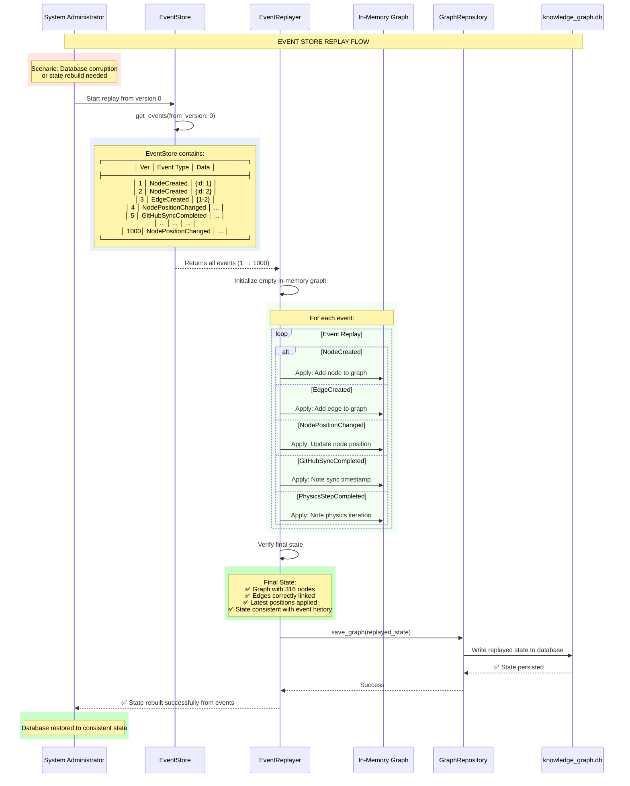

# Event Flow Diagrams
**Detailed Event Flows for Hexagonal/CQRS Architecture**

---

## 1. GitHub Sync Event Flow (BUG FIX)

### Current Problem Flow

```mermaid
sequenceDiagram
    participant GitHub as GitHub API
    participant ContentAPI as EnhancedContentAPI
    participant SyncService as GitHubSyncService
    participant Repo as SqliteKnowledgeGraphRepository
    participant DB as knowledge_graph.db
    participant Actor as GraphServiceActor
    participant Client as API Client

    rect rgb(255, 200, 200)
        Note over GitHub,Client: ❌ CURRENT BROKEN FLOW - Cache Coherency Issue
    end

    GitHub->>ContentAPI: 1. Fetch markdown files
    ContentAPI-->>SyncService: 2. Return 316 files

    SyncService->>SyncService: 3. Parse files<br/>→ 316 nodes, 450 edges

    SyncService->>Repo: 4. INSERT INTO nodes (316 nodes)
    Repo->>DB: INSERT INTO edges (450 edges)

    DB-->>Repo: ✅ Database has 316 nodes

    Note over SyncService,Actor: ❌ NO EVENT EMITTED!<br/>Cache remains stale

    rect rgb(255, 200, 200)
        Note over Actor: GraphServiceActor state:<br/>In-memory cache: 63 nodes (STALE!)<br/>Never refreshed
    end

    Client->>Actor: GET /api/graph/data<br/>Sends GetGraphData message

    Actor->>Actor: Returns in-memory cache<br/>(63 nodes)

    Actor-->>Client: ❌ CLIENT SEES: 63 nodes (WRONG!)

    Note over Client: Expected: 316 nodes<br/>Actual: 63 nodes<br/>❌ Cache coherency bug
```

### Fixed Event-Driven Flow



---

## 2. Physics Simulation Event Flow

### Physics Step Execution



---

## 3. Node Creation Event Flow (User Interaction)

### User Creates New Node



---

## 4. WebSocket Connection Event Flow

### Client Connects to WebSocket



---

## 5. Cache Invalidation Event Flow

### When Cache Gets Invalidated



### Read Flow with Cache



---

## 6. Semantic Analysis Event Flow

### AI-Powered Semantic Analysis



---

## 7. Error Handling Event Flow

### When Commands Fail



---

## 8. Event Store Replay (Event Sourcing)

### Rebuilding State from Events



---

## Event Flow Summary Table

| Event Type | Triggers | Subscribers | Latency Target |
|------------|----------|-------------|----------------|
| `GitHubSyncCompleted` | GitHub sync service | Cache invalidation, WebSocket, Metrics, Logging | <100ms |
| `NodeCreated` | User creates node | WebSocket, Event store, Audit log | <50ms |
| `NodePositionChanged` | Physics or user drag | WebSocket (batched), Cache invalidation | <16ms (60 FPS) |
| `PhysicsStepCompleted` | Physics simulation | WebSocket, Metrics, Equilibrium checker | <16ms (60 FPS) |
| `WebSocketClientConnected` | Client connects | Initial sync, Metrics | <200ms |
| `SemanticAnalysisCompleted` | Semantic analysis | Physics service, WebSocket, Cache | <100ms |

---

**Event flows designed by**: Hive Mind Architecture Planner
**Date**: 2025-10-26
