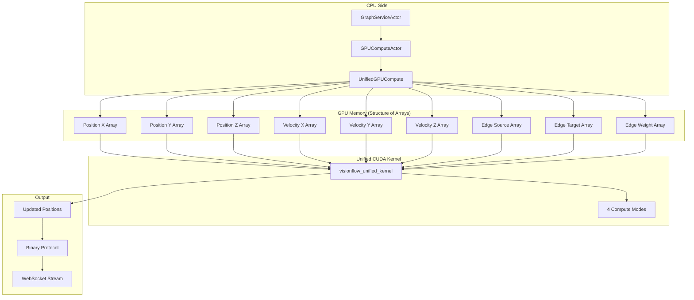

# Unified GPU Compute Architecture

VisionFlow leverages a single unified NVIDIA CUDA kernel for high-performance physics simulation and graph layout computation, enabling real-time visualisation of parallel graphs at 60 FPS with multiple compute modes.

## Overview

The unified GPU compute system implements a single kernel (`visionflow_unified.cu`) with multiple compute modes:
- **Basic Mode**: Standard force-directed layout
- **DualGraph Mode**: Parallel processing of knowledge and agent graphs  
- **Constraints Mode**: Advanced constraint satisfaction
- **Visual Analytics Mode**: Pattern detection and temporal analysis

## Architecture Components



## Unified CUDA Kernel

### Single Kernel Architecture

The unified kernel handles all compute modes in one optimised function:

```cuda
__global__ void visionflow_unified_kernel(
    float* pos_x, float* pos_y, float* pos_z,
    float* vel_x, float* vel_y, float* vel_z,
    int* edge_src, int* edge_dst, float* edge_weight,
    ConstraintData* constraints,
    SimParams params,
    int num_nodes,
    int num_edges,
    int num_constraints
) {
    int idx = blockIdx.x * blockDim.x + threadIdx.x;
    if (idx >= num_nodes) return;
    
    float3 position = make_vec3(pos_x[idx], pos_y[idx], pos_z[idx]);
    float3 velocity = make_vec3(vel_x[idx], vel_y[idx], vel_z[idx]);
    float3 force = make_vec3(0.0f, 0.0f, 0.0f);
    
    // Compute forces based on mode
    switch (params.compute_mode) {
        case 0: // Basic
            force = compute_basic_forces(idx, pos_x, pos_y, pos_z, 
                                       edge_src, edge_dst, edge_weight,
                                       num_nodes, num_edges, params);
            break;
        case 1: // DualGraph
            force = compute_dual_graph_forces(idx, pos_x, pos_y, pos_z,
                                             edge_src, edge_dst, edge_weight,
                                             num_nodes, num_edges, params);
            break;
        case 2: // Constraints
            force = compute_constrained_forces(idx, pos_x, pos_y, pos_z,
                                              edge_src, edge_dst, edge_weight,
                                              constraints, num_nodes, num_edges,
                                              num_constraints, params);
            break;
        case 3: // Analytics
            force = compute_analytics_forces(idx, pos_x, pos_y, pos_z,
                                            edge_src, edge_dst, edge_weight,
                                            num_nodes, num_edges, params);
            break;
    }
    
    // Update velocity and position
    velocity = vec3_add(velocity, vec3_scale(force, params.dt));
    velocity = vec3_scale(velocity, params.damping);
    velocity = vec3_clamp(velocity, params.max_velocity);
    
    position = vec3_add(position, vec3_scale(velocity, params.dt));
    
    // Write back (coalesced memory access)
    pos_x[idx] = position.x;
    pos_y[idx] = position.y;
    pos_z[idx] = position.z;
    vel_x[idx] = velocity.x;
    vel_y[idx] = velocity.y;
    vel_z[idx] = velocity.z;
}
```

### 2. Velocity Integration Kernel

Updates node positions using Verlet integration:

```cuda
__global__ void integrate_positions_kernel(
    BinaryNodeData* nodes,
    float3* forces,
    SimParams params,
    int num_nodes
) {
    int idx = blockIdx.x * blockDim.x + threadIdx.x;
    if (idx >= num_nodes) return;
    
    // Load current state
    float3 position = make_float3(
        nodes[idx].position.x,
        nodes[idx].position.y,
        nodes[idx].position.z
    );
    float3 velocity = make_float3(
        nodes[idx].velocity.x,
        nodes[idx].velocity.y,
        nodes[idx].velocity.z
    );
    
    // Apply force with damping
    velocity += forces[idx] * params.time_step;
    velocity *= params.damping;
    
    // Update position
    position += velocity * params.time_step;
    
    // Apply bounds
    position = clamp_to_bounds(position, params.bounds);
    
    // Write back
    nodes[idx].position.x = position.x;
    nodes[idx].position.y = position.y;
    nodes[idx].position.z = position.z;
    nodes[idx].velocity.x = velocity.x;
    nodes[idx].velocity.y = velocity.y;
    nodes[idx].velocity.z = velocity.z;
}
```

### 3. Stress Majorization Kernel

Optimizes graph layout to preserve ideal distances:

```cuda
__global__ void stress_majorization_kernel(
    BinaryNodeData* nodes,
    float* distance_matrix,
    float* weight_matrix,
    SimParams params,
    int num_nodes
) {
    int idx = blockIdx.x * blockDim.x + threadIdx.x;
    if (idx >= num_nodes) return;
    
    float3 position = get_position(nodes[idx]);
    float3 new_position = make_float3(0.0f, 0.0f, 0.0f);
    float total_weight = 0.0f;
    
    for (int j = 0; j < num_nodes; j++) {
        if (idx == j) continue;
        
        float ideal_dist = distance_matrix[idx * num_nodes + j];
        float weight = weight_matrix[idx * num_nodes + j];
        
        float3 other_pos = get_position(nodes[j]);
        float3 diff = other_pos - position;
        float current_dist = length(diff) + 0.001f;
        
        float ratio = ideal_dist / current_dist;
        new_position += other_pos * weight * ratio;
        total_weight += weight;
    }
    
    if (total_weight > 0.0f) {
        new_position /= total_weight;
        
        // Blend with current position
        position = lerp(position, new_position, params.stress_alpha);
        set_position(&nodes[idx], position);
    }
}
```

## Dual Graph Support

The GPU compute system maintains separate buffers for knowledge and agent graphs:

```rust
pub struct GPUComputeActor {
    // Dual graph buffers
    knowledge_node_data: Option<CudaBuffer<BinaryNodeData>>,
    knowledge_edge_data: Option<CudaBuffer<EdgeData>>,
    agent_node_data: Option<CudaBuffer<BinaryNodeData>>,
    agent_edge_data: Option<CudaBuffer<EdgeData>>,
    
    // Compute kernels
    force_kernel: CudaFunction,
    stress_kernel: CudaFunction,
    integration_kernel: CudaFunction,
    
    // Kernel modes
    compute_mode: ComputeMode,
}

pub enum ComputeMode {
    Legacy,        // Single graph
    DualGraph,     // Separate knowledge/agent graphs
    Advanced,      // Visual analytics mode
}
```

## Visual Analytics Mode

Advanced GPU kernels for pattern detection and analysis:

### Temporal-Spatial Analysis

```cuda
struct TSNode {
    float4 position;          // xyz + time
    float4 velocity;          
    float4 trajectory[8];     // Recent positions
    float layer_membership[MAX_LAYERS];
    float topology_features[TOPOLOGY_FEATURES];
};

__global__ void visual_analytics_kernel(
    TSNode* nodes,
    TSEdge* edges,
    AnalyticsParams params
) {
    // Compute temporal coherence
    float temporal_weight = compute_temporal_coherence(node, params);
    
    // Detect topological patterns
    float centrality = compute_betweenness_centrality(node, edges);
    float clustering = compute_clustering_coefficient(node, edges);
    
    // Apply isolation layers
    apply_isolation_constraints(node, params.isolation_layers);
    
    // Update with visual analytics forces
    update_with_analytics(node, temporal_weight, centrality, clustering);
}
```

## Performance Optimizations

### 1. Spatial Indexing

Accelerate neighbor searches with spatial hashing:

```cuda
__device__ int3 get_grid_cell(float3 position, float cell_size) {
    return make_int3(
        floor(position.x / cell_size),
        floor(position.y / cell_size),
        floor(position.z / cell_size)
    );
}

__global__ void build_spatial_index(
    BinaryNodeData* nodes,
    int* cell_indices,
    int* cell_counts
) {
    // Build spatial hash grid for O(1) neighbor lookup
}
```

### 2. Warp-Level Primitives

Utilize warp shuffle for faster reductions:

```cuda
__device__ float warp_reduce_sum(float val) {
    for (int offset = 16; offset > 0; offset /= 2) {
        val += __shfl_down_sync(0xffffffff, val, offset);
    }
    return val;
}
```

### 3. Memory Coalescing

Optimize memory access patterns:

```cuda
// Structure of Arrays (SoA) for better coalescing
struct NodeDataSoA {
    float* positions_x;
    float* positions_y;
    float* positions_z;
    float* velocities_x;
    float* velocities_y;
    float* velocities_z;
};
```

## Configuration

GPU compute parameters in `settings.yaml`:

```yaml
gpu:
  enabled: true
  device_id: 0
  
  kernels:
    block_size: 256
    grid_size: auto
    
  compute_mode: dual_graph  # legacy | dual_graph | advanced
  
  optimisation:
    use_spatial_index: true
    index_cell_size: 100.0
    use_shared_memory: true
    max_neighbors: 64
    
  memory:
    max_nodes: 100000
    max_edges: 1000000
    buffer_growth_factor: 1.5
```

## Kernel Launch Configuration

Optimal kernel launch parameters:

```rust
fn launch_force_kernel(&self, num_nodes: usize) -> Result<()> {
    let block_size = 256;
    let grid_size = (num_nodes + block_size - 1) / block_size;
    
    let params = LaunchParams {
        grid: (grid_size as u32, 1, 1),
        block: (block_size as u32, 1, 1),
        shared_mem_bytes: 0,
        stream: None,
    };
    
    self.force_kernel.launch(params, (
        &self.node_buffer,
        &self.edge_buffer,
        &self.force_buffer,
        &self.sim_params,
        num_nodes as i32,
        num_edges as i32,
    ))?;
    
    Ok(())
}
```

## Performance Metrics

Typical performance on NVIDIA RTX 4090 with unified kernel:

| Nodes | Edges | Mode | FPS | Memory | Kernel Time |
|-------|-------|------|-----|--------|-------------|
| 1,000 | 5,000 | Basic | 120 | 32 MB | 0.8ms |
| 10,000 | 50,000 | DualGraph | 60 | 128 MB | 4.2ms |
| 50,000 | 250,000 | DualGraph | 60 | 512 MB | 8.5ms |
| 100,000 | 500,000 | Analytics | 30 | 1.2 GB | 16.7ms |

## Error Handling

GPU compute errors are handled gracefully:

```rust
match gpu_compute.execute() {
    Ok(positions) => {
        // Stream updated positions
        websocket.send_binary(positions)?;
    }
    Err(GpuError::OutOfMemory) => {
        // Fall back to CPU computation
        cpu_fallback.compute()?;
    }
    Err(GpuError::KernelFailure(e)) => {
        // Log and retry with reduced parameters
        warn!("GPU kernel failed: {}, retrying with reduced load", e);
        gpu_compute.execute_reduced()?;
    }
}
```

## See Also

- [System Overview](system-overview.md) - Overall architecture
- [Dual Graph](dual-graph.md) - Graph separation strategy
- [Binary Protocol](../api/binary-protocol.md) - Data streaming format