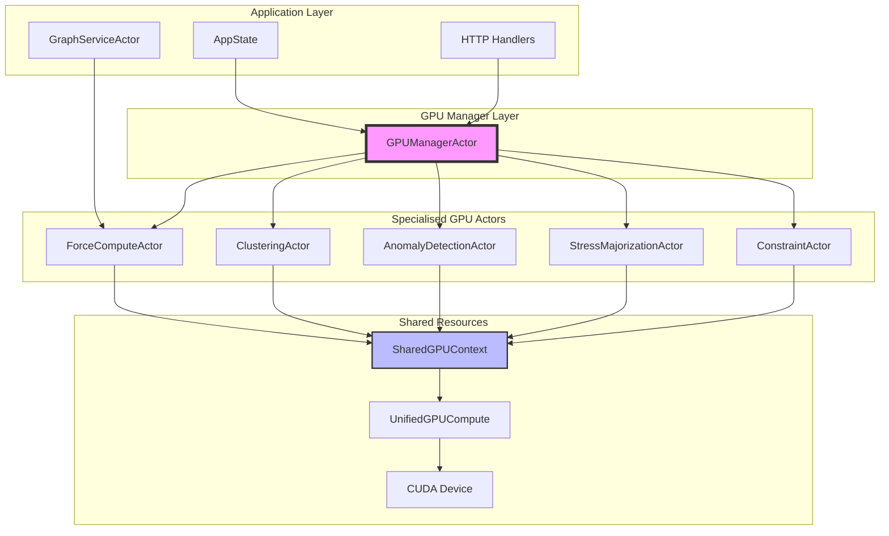
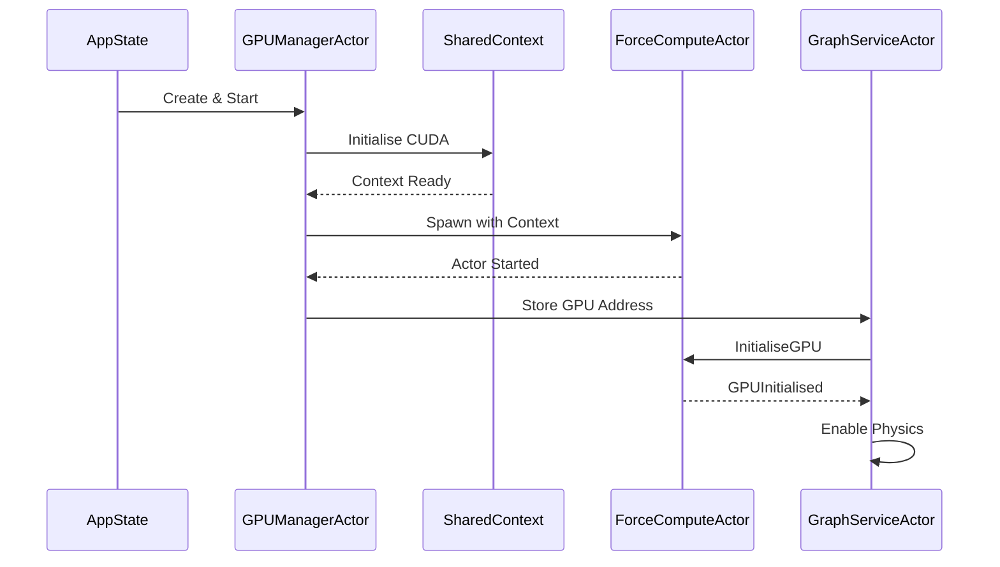
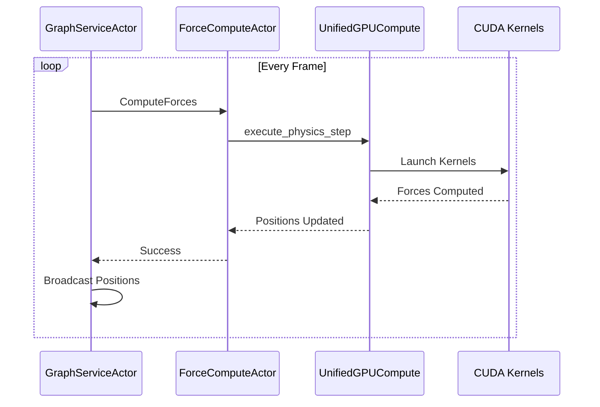

# GPU Modular Architecture System

## Executive Summary

The VisionFlow GPU system has been comprehensively refactored from a monolithic 1500+ line actor into a sophisticated modular architecture. This document provides the definitive reference for the new GPU compute system, its design principles, implementation details, and operational guidelines.

## Table of Contents

1. [System Overview](#system-overview)
2. [Architecture Design](#architecture-design)
3. [Core Components](#core-components)
4. [Message Flow](#message-flow)
5. [Initialisation Sequence](#initialisation-sequence)
6. [Error Handling](#error-handling)
7. [Performance Optimisation](#performance-optimisation)
8. [Migration Guide](#migration-guide)
9. [API Reference](#api-reference)
10. [Troubleshooting](#troubleshooting)

## System Overview

The modular GPU architecture replaces the legacy monolithic `GPUComputeActor` with a collection of specialised actors, each responsible for a specific domain of GPU computation. This separation of concerns provides:

- **Improved Maintainability**: Each actor is focused on a single responsibility
- **Enhanced Scalability**: New GPU features can be added as independent actors
- **Better Fault Isolation**: Failures in one component don't cascade
- **Clearer Dependencies**: Explicit message passing reveals data flow
- **Simplified Testing**: Each actor can be tested independently

### Key Design Principles

1. **Single Responsibility**: Each actor handles one computational domain
2. **Message-Driven**: All communication via typed Actix messages
3. **Shared Context**: GPU resources managed centrally and shared safely
4. **Graceful Degradation**: System continues with reduced functionality on GPU failure
5. **Zero-Copy Where Possible**: Minimise data movement between CPU and GPU

## Architecture Design



## Core Components

### GPUManagerActor

**Location**: `/src/actors/gpu/gpu_manager_actor.rs`

The orchestrator of the GPU subsystem, responsible for:

- Initialising the CUDA device and shared context
- Spawning and managing child actors
- Routing messages to appropriate specialised actors
- Monitoring GPU health and performance
- Coordinating cross-actor operations

```rust
pub struct GPUManagerActor {
    shared_context: Option<SharedGPUContext>,
    child_actors: Option<ChildActorAddresses>,
    initialisation_state: InitialisationState,
    metrics: GPUMetrics,
}
```

### ForceComputeActor

**Location**: `/src/actors/gpu/force_compute_actor.rs`

Handles physics force computation for graph layout:

- Spring forces between connected nodes
- Repulsion forces between all nodes
- Gravity/centering forces
- Damping and velocity constraints
- Integration of positions and velocities

Key features:
- Supports multiple compute modes (Basic, Advanced, Constraints)
- Synchronises with simulation parameters
- Provides physics statistics and metrics

### ClusteringActor

**Location**: `/src/actors/gpu/clustering_actor.rs`

Implements GPU-accelerated clustering algorithms:

- K-means clustering
- Spectral clustering
- Hierarchical clustering
- DBSCAN
- Louvain community detection
- Label propagation

Optimisations:
- Parallel distance computations
- GPU-based matrix operations
- Efficient memory layouts for cluster assignments

### AnomalyDetectionActor

**Location**: `/src/actors/gpu/anomaly_detection_actor.rs`

Detects anomalies in graph structure and behaviour:

- Local Outlier Factor (LOF)
- Z-score based detection
- Isolation Forest
- Temporal anomaly detection
- Multi-dimensional feature analysis

Features:
- Real-time anomaly scoring
- Adaptive thresholds
- Historical pattern learning

### StressMajorizationActor

**Location**: `/src/actors/gpu/stress_majorization_actor.rs`

Implements stress majorisation for optimal graph layout:

- Global stress minimisation
- Distance preservation
- Convergence detection
- Safety mechanisms (emergency stop, failure tracking)
- Incremental updates

Performance features:
- GPU-accelerated matrix operations
- Sparse matrix optimisations
- Adaptive iteration counts

### ConstraintActor

**Location**: `/src/actors/gpu/constraint_actor.rs`

Manages layout constraints and forces:

- Boundary constraints
- Fixed position constraints
- Clustering constraints
- Semantic grouping
- Custom user constraints

Implementation:
- Constraint compilation to GPU kernels
- Efficient constraint satisfaction
- Priority-based constraint resolution

### SharedGPUContext

**Location**: `/src/actors/gpu/shared.rs`

Provides shared GPU resources and state:

```rust
pub struct SharedGPUContext {
    pub device: Arc<CudaDevice>,
    pub unified_compute: Arc<Mutex<UnifiedGPUCompute>>,
    pub stress_majorization_safety: Arc<Mutex<StressMajorizationSafety>>,
}
```

Thread-safe access to:
- CUDA device handle
- Unified compute kernels
- Shared memory buffers
- Safety mechanisms

## Message Flow

### Initialisation Sequence



### Force Computation Flow



## Initialisation Sequence

The GPU system initialisation follows a strict sequence to prevent race conditions:

1. **AppState Creation**
   - GraphServiceActor created first (without GPU)
   - GPUManagerActor created and started
   - Initial connections established

2. **GPU Context Initialisation**
   - CUDA device detection and initialisation
   - Memory allocation for maximum nodes/edges
   - Kernel compilation and caching
   - Shared context creation

3. **Child Actor Spawning**
   - Each specialised actor spawned with shared context
   - Actor addresses stored in ChildActorAddresses
   - Health checks performed

4. **Graph Service Connection**
   - GPU address sent to GraphServiceActor
   - InitialiseGPU message triggers warmup
   - GPUInitialised notification enables physics

5. **Physics Activation**
   - First frame skipped for warmup
   - Subsequent frames process normally
   - Metrics collection begins

## Error Handling

### GPU Failure Recovery

The system implements multi-level failure recovery:

1. **Kernel Failures**
   - Retry with reduced workload
   - Fall back to CPU computation
   - Log detailed error context

2. **Memory Errors**
   - Attempt garbage collection
   - Reduce buffer sizes
   - Implement paging if needed

3. **Device Errors**
   - Reset device if possible
   - Migrate to different GPU
   - Continue with CPU-only mode

### Safety Mechanisms

```rust
pub struct StressMajorizationSafety {
    pub emergency_stop: bool,
    pub failure_count: u32,
    pub consecutive_failures: u32,
    pub last_error: Option<String>,
    pub cooldown_until: Option<Instant>,
}
```

Prevents runaway computations:
- Emergency stop on repeated failures
- Exponential backoff on errors
- Cooldown periods after failures
- Automatic recovery attempts

## Performance Optimisation

### Memory Management

- **Persistent Buffers**: Reuse allocated GPU memory
- **Pinned Memory**: Use page-locked host memory for transfers
- **Async Transfers**: Overlap computation and data movement
- **Memory Pools**: Pre-allocate common buffer sizes

### Kernel Optimisation

- **Warp Efficiency**: Ensure coalesced memory access
- **Occupancy**: Balance registers and shared memory
- **Grid Sizing**: Optimal block and grid dimensions
- **Kernel Fusion**: Combine multiple operations

### Profiling Points

Key metrics tracked:
- Kernel execution time
- Memory transfer bandwidth
- GPU utilisation percentage
- Cache hit rates
- Warp efficiency

## Migration Guide

### From Legacy GPUComputeActor

1. **Update Imports**
```rust
// Old
use crate::actors::gpu_compute_actor::GPUComputeActor;

// New
use crate::actors::gpu::ForceComputeActor;
use crate::actors::GPUManagerActor;
```

2. **Update AppState**
```rust
// Old
pub gpu_compute_addr: Option<Addr<GPUComputeActor>>,

// New
pub gpu_manager_addr: Option<Addr<GPUManagerActor>>,
pub gpu_compute_addr: Option<Addr<ForceComputeActor>>, // Compatibility
```

3. **Message Routing**
- Physics messages → ForceComputeActor
- Clustering messages → ClusteringActor
- Anomaly messages → AnomalyDetectionActor
- Stress messages → StressMajorizationActor
- Constraint messages → ConstraintActor

### Handler Updates

Most handlers now return appropriate types:
- `GetGPUStatus` → `GPUStatus` (not `Result<GPUStatus, String>`)
- `RunCommunityDetection` → `Result<CommunityDetectionResult, String>`
- Message responses properly typed

## API Reference

### Core Messages

#### Initialisation
- `InitializeGPU` - Prepare GPU for computation
- `StoreGPUComputeAddress` - Register GPU actor with graph

#### Physics
- `ComputeForces` - Calculate forces for current positions
- `UpdateSimulationParams` - Modify physics parameters
- `SetComputeMode` - Switch computation mode

#### Analytics
- `RunKMeans` - Execute K-means clustering
- `RunAnomalyDetection` - Detect anomalies
- `RunCommunityDetection` - Find communities

#### Optimisation
- `TriggerStressMajorization` - Run stress optimisation
- `UpdateConstraints` - Modify layout constraints

### Configuration

#### SimulationParams
```rust
pub struct SimulationParams {
    pub attraction_k: f32,      // Spring constant
    pub repel_k: f32,           // Repulsion strength
    pub center_gravity_k: f32,  // Centering force
    pub damping: f32,           // Velocity damping
    pub dt: f32,                // Time step
    pub max_velocity: f32,      // Speed limit
}
```

#### ComputeMode
```rust
pub enum ComputeMode {
    Basic,       // Simple force-directed
    DualGraph,   // Separate graphs
    Advanced,    // Semantic forces
    Constraints, // Full constraint system
}
```

## Troubleshooting

### Common Issues

#### "No reactor running" Error
**Cause**: Tokio runtime accessed from Actix context
**Solution**: Use `actix::spawn` instead of `tokio::spawn`

#### GPU Not Initialised
**Cause**: Physics started before GPU ready
**Solution**: Wait for `GPUInitialised` message

#### High GPU Failure Count
**Cause**: Kernel errors or memory issues
**Check**: 
- Available GPU memory
- CUDA version compatibility
- Kernel compilation logs

#### Stress Majorisation Not Converging
**Cause**: Conflicting constraints or parameters
**Solution**: 
- Reduce constraint weights
- Increase iteration limit
- Check for NaN values

### Debug Commands

```bash
# Check GPU status
curl http://localhost:8080/api/analytics/gpu-status

# View physics stats
curl http://localhost:8080/api/analytics/stats

# Monitor clustering
curl http://localhost:8080/api/analytics/clustering/status

# Anomaly detection state
curl http://localhost:8080/api/analytics/anomaly/stats
```

### Performance Monitoring

```rust
// Enable detailed GPU metrics
export VISIONFLOW_GPU_METRICS=true

// Profile kernel execution
export VISIONFLOW_GPU_PROFILE=true

// Log memory usage
export VISIONFLOW_GPU_MEMORY_LOG=true
```

## Best Practices

1. **Always check GPU availability** before sending compute messages
2. **Handle degraded modes** gracefully when GPU unavailable
3. **Monitor failure counts** and implement circuit breakers
4. **Profile before optimising** - measure, don't guess
5. **Test with various graph sizes** to ensure scalability
6. **Document custom kernels** thoroughly
7. **Version PTX carefully** for compatibility

## Future Enhancements

### Planned Features
- Multi-GPU support for large graphs
- Dynamic kernel compilation
- ML-based parameter tuning
- Distributed computation
- WebGPU fallback

### Research Areas
- Quantum-inspired optimisation
- Neural graph layouts
- Adaptive algorithms
- Energy-aware scheduling

---

*Last Updated: January 2025*
*Version: 2.0.0*
*Status: Production Ready*