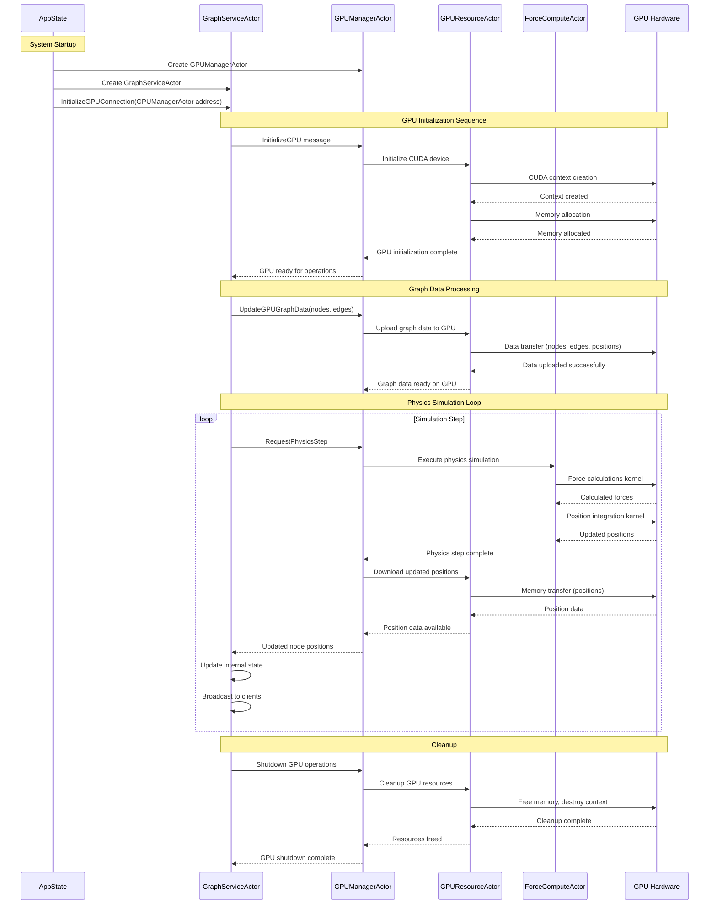
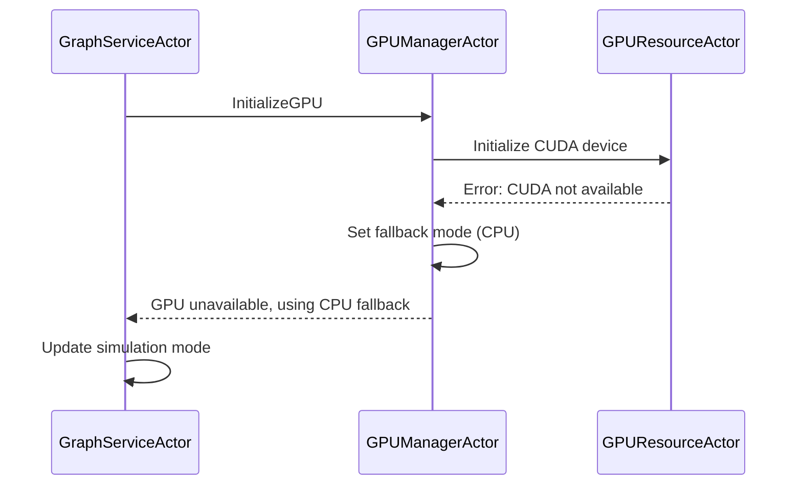
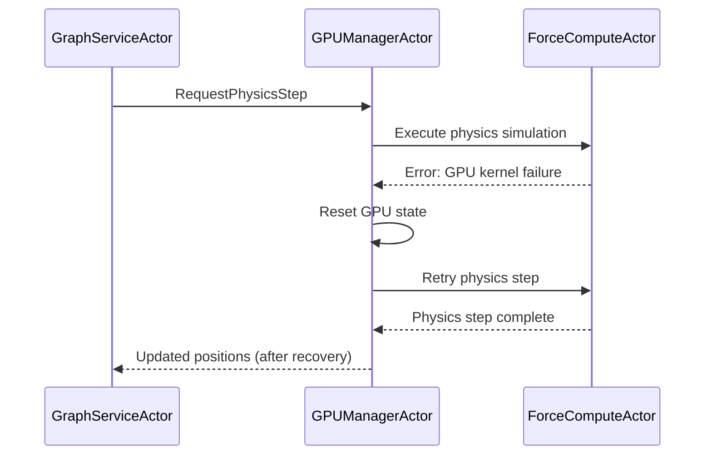

# GPU Actor Communication Flow - Corrected Data Flow

## Overview

This document provides a comprehensive overview of the corrected GPU actor communication flow, showing how **GraphServiceActor** properly communicates with **GPUManagerActor** as supervisor, which then delegates to specialized GPU actors including **GPUResourceActor** and **ForceComputeActor**.

## Key Corrections

### Previous (Incorrect) Flow
- **GraphServiceActor** → **ForceComputeActor** (direct communication)
- GPU initialization handled by ForceComputeActor
- No supervision pattern

### Current (Corrected) Flow
1. **AppState** → **GPUManagerActor** creation
2. **AppState** → **GraphServiceActor** (InitializeGPUConnection with GPUManagerActor address)
3. **GraphServiceActor** → **GPUManagerActor** (InitializeGPU, UpdateGPUGraphData)
4. **GPUManagerActor** → **GPUResourceActor** (delegation for GPU operations)
5. **GPUResourceActor** → GPU hardware (CUDA initialization, data upload)
6. **GPUManagerActor** → **ForceComputeActor** (physics simulation steps only)

## Actor Responsibilities

### GraphServiceActor
- **Role**: Graph state management and client coordination
- **GPU Interaction**: Stores GPUManagerActor address, sends high-level requests
- **Key Messages**:
  - `InitializeGPUConnection` (receives GPUManagerActor address)
  - `InitializeGPU` (requests GPU initialization)
  - `UpdateGPUGraphData` (sends graph data for GPU processing)

### GPUManagerActor
- **Role**: Supervisor and message router for GPU operations
- **Responsibilities**:
  - Supervise specialized GPU actors
  - Route messages to appropriate GPU components
  - Coordinate GPU resource allocation
  - Handle GPU initialization requests from GraphServiceActor
- **Key Messages**:
  - `InitializeGPU` (from GraphServiceActor)
  - `UpdateGPUGraphData` (from GraphServiceActor)
  - Delegates to GPUResourceActor and ForceComputeActor

### GPUResourceActor
- **Role**: CUDA device and memory management
- **Responsibilities**:
  - GPU device initialization
  - CUDA memory allocation and deallocation
  - Data upload/download to/from GPU
  - GPU buffer management
- **Key Operations**:
  - CUDA context creation
  - Memory buffer allocation
  - Data transfer operations
  - Resource cleanup

### ForceComputeActor
- **Role**: Physics simulation execution (after GPU initialization)
- **Responsibilities**:
  - Execute physics simulation steps
  - Force calculations
  - Position and velocity updates
  - Physics parameter application
- **Dependencies**: Requires GPU to be initialized by GPUResourceActor first

## Complete Communication Sequence

## Message Types and Data Flow

### Initialization Messages
1. **InitializeGPUConnection**
   - **Source**: AppState → GraphServiceActor
   - **Payload**: GPUManagerActor address
   - **Purpose**: Establishes communication channel

2. **InitializeGPU**
   - **Source**: GraphServiceActor → GPUManagerActor
   - **Payload**: Initialization parameters
   - **Delegation**: GPUManagerActor → GPUResourceActor

### Data Processing Messages
3. **UpdateGPUGraphData**
   - **Source**: GraphServiceActor → GPUManagerActor
   - **Payload**: Nodes, edges, metadata
   - **Delegation**: GPUManagerActor → GPUResourceActor (data upload)

### Physics Simulation Messages
4. **RequestPhysicsStep**
   - **Source**: GraphServiceActor → GPUManagerActor
   - **Delegation**: GPUManagerActor → ForceComputeActor
   - **Return Path**: ForceComputeActor → GPUManagerActor → GraphServiceActor

## Error Handling and Recovery

### GPU Initialization Failures

### Runtime GPU Errors

## Performance Optimizations

### Batched Operations
- **GPU Data Uploads**: GPUResourceActor batches multiple data transfers
- **Physics Steps**: ForceComputeActor processes multiple simulation steps per GPU call
- **Memory Management**: GPUResourceActor reuses GPU buffers when possible

### Resource Sharing
- **GPU Memory Pools**: GPUResourceActor maintains memory pools for different data types
- **Kernel Reuse**: ForceComputeActor caches compiled GPU kernels
- **Buffer Recycling**: Automatic buffer recycling to minimize allocation overhead

## Migration Benefits

### Before (Incorrect Architecture)
- Direct coupling between GraphServiceActor and ForceComputeActor
- No proper supervision of GPU resources
- Mixed responsibilities (physics + GPU management)
- Difficult to handle GPU initialization failures
- Limited scalability for additional GPU operations

### After (Corrected Architecture)
- Clear separation of concerns
- Proper supervision pattern with GPUManagerActor
- Dedicated GPU resource management (GPUResourceActor)
- Specialized physics simulation (ForceComputeActor)
- Better error handling and recovery
- Scalable architecture for additional GPU actors

## Implementation Status

✅ **Completed**: Message routing through GPUManagerActor
✅ **Completed**: GPUResourceActor for CUDA device management
✅ **Completed**: ForceComputeActor specialization for physics
✅ **Completed**: Error handling and fallback mechanisms
✅ **Completed**: Documentation updates reflecting corrected flow

## Future Enhancements

### Additional GPU Actors
- **ClusteringActor**: GPU-accelerated graph clustering
- **LayoutActor**: Advanced layout algorithms
- **AnalyticsActor**: Real-time graph analytics
- **RenderingActor**: GPU-based visualization preprocessing

### Advanced Features
- **Multi-GPU Support**: Distribute operations across multiple GPUs
- **Dynamic Load Balancing**: Automatically balance GPU workload
- **Predictive Resource Management**: Anticipate GPU memory needs
- **Real-time Performance Metrics**: Monitor GPU utilization and optimise

This corrected architecture provides a solid foundation for scalable GPU operations while maintaining clear separation of concerns and robust error handling.