# Hexagonal/CQRS Architecture Design
**Target Architecture for VisionFlow Graph Service Migration**

**Date**: 2025-10-26
**Status**: Architecture Planning Phase
**Purpose**: Replace monolithic `GraphServiceActor` with clean hexagonal/CQRS patterns

---

## Executive Summary

This document defines the **complete target architecture** for migrating VisionFlow's graph service from a monolithic actor-based system to a clean, maintainable hexagonal architecture with CQRS and event sourcing.

### Critical Problem Being Solved
**GitHub Sync Bug**: After GitHub sync completes and writes to SQLite, the `GraphServiceActor` holds stale in-memory state, showing only 63 nodes instead of 316. API calls return cached data instead of fresh database records.

### Solution Approach
Event-driven architecture where:
1. GitHub sync completion triggers `GitHubSyncCompletedEvent`
2. Event invalidates all caches
3. Next API call reads fresh data from SQLite
4. WebSocket clients receive update notifications

---

## Current State Analysis

### Architecture Comparison: Before vs After

```mermaid
graph TB
    subgraph Before["❌ BEFORE: Monolithic Actor (THE PROBLEM)"]
        B_API["API Handlers"]
        B_ACTOR["GraphServiceActor<br/>━━━━━━━━━━━<br/>48,000+ tokens!<br/>━━━━━━━━━━━<br/>• In-memory cache (STALE!)<br/>• Physics simulation<br/>• WebSocket broadcasting<br/>• Semantic analysis<br/>• Settings management<br/>• GitHub sync data"]

        B_WS["WebSocket<br/>Server"]
        B_PHYSICS["Physics<br/>Engine"]
        B_DB["SQLite DB"]

        B_API --> B_ACTOR
        B_ACTOR --> B_WS
        B_ACTOR --> B_PHYSICS
        B_ACTOR -.->|reads once| B_DB

        B_PROBLEM["🐛 PROBLEM:<br/>After GitHub sync writes<br/>316 nodes to SQLite,<br/>actor cache still shows<br/>63 nodes (STALE!)"]

        B_DB -.->|no invalidation| B_PROBLEM
    end

    subgraph After["✅ AFTER: Hexagonal/CQRS/Event Sourcing (THE SOLUTION)"]
        A_API["API Handlers<br/>(Thin)"]

        A_CMD["Command<br/>Handlers"]
        A_QRY["Query<br/>Handlers"]

        A_BUS["Event Bus"]
        A_REPO["Graph<br/>Repository"]

        A_CACHE["Cache<br/>Invalidator"]
        A_WS["WebSocket<br/>Broadcaster"]

        A_DB["SQLite DB<br/>(Source of Truth)"]

        A_API --> A_CMD
        A_API --> A_QRY

        A_CMD --> A_REPO
        A_CMD --> A_BUS
        A_QRY --> A_REPO

        A_REPO --> A_DB

        A_BUS --> A_CACHE
        A_BUS --> A_WS

        A_SOLUTION["✅ SOLUTION:<br/>GitHub sync emits event<br/>→ Cache invalidator clears all<br/>→ Next query reads fresh 316 nodes<br/>→ WebSocket notifies clients"]

        A_BUS --> A_SOLUTION
    end

    classDef problemStyle fill:#ffcdd2,stroke:#c62828,stroke-width:3px
    classDef solutionStyle fill:#c8e6c9,stroke:#2e7d32,stroke-width:3px
    classDef actorStyle fill:#fff3e0,stroke:#e65100,stroke-width:2px
    classDef cqrsStyle fill:#e1f5ff,stroke:#01579b,stroke-width:2px

    class B_PROBLEM problemStyle
    class A_SOLUTION solutionStyle
    class B_ACTOR actorStyle
    class A_CMD,A_QRY,A_BUS,A_CACHE,A_WS cqrsStyle
```

### Key Architectural Improvements

```mermaid
graph LR
    subgraph Improvements["🎯 Architectural Benefits"]
        I1["1️⃣ Separation of Concerns<br/>━━━━━━━━━━━<br/>Commands ≠ Queries<br/>Write ≠ Read"]

        I2["2️⃣ Event-Driven<br/>━━━━━━━━━━━<br/>Loosely coupled<br/>subscribers"]

        I3["3️⃣ Cache Coherency<br/>━━━━━━━━━━━<br/>Events trigger<br/>invalidation"]

        I4["4️⃣ Testability<br/>━━━━━━━━━━━<br/>Pure functions<br/>No actors needed"]

        I5["5️⃣ Scalability<br/>━━━━━━━━━━━<br/>Horizontal scaling<br/>Event replay"]

        I6["6️⃣ Maintainability<br/>━━━━━━━━━━━<br/>Small focused modules<br/>vs 48K token monolith"]
    end

    I1 --> I2 --> I3 --> I4 --> I5 --> I6

    classDef benefitStyle fill:#e8f5e9,stroke:#2e7d32,stroke-width:2px
    class I1,I2,I3,I4,I5,I6 benefitStyle
```

### Monolithic GraphServiceActor Responsibilities
```rust
// src/actors/graph_actor.rs (48,000+ tokens!)
pub struct GraphServiceActor {
    graph_data: Arc<RwLock<GraphData>>,           // In-memory cache - THE PROBLEM
    bots_graph_data: Arc<RwLock<GraphData>>,      // Separate bot graph cache
    simulation_params: Arc<RwLock<SimulationParams>>,
    ws_server: Option<Addr<WebSocketServer>>,    // Direct WebSocket coupling
    // ... 50+ more fields
}
```

**What it does**:
- ✅ Graph state management (nodes, edges)
- ✅ Physics simulation coordination
- ✅ WebSocket broadcasting to clients
- ✅ Semantic analysis orchestration
- ✅ Settings management
- ❌ Holds stale cache after GitHub sync
- ❌ Tightly coupled to WebSocket infrastructure
- ❌ Mixed concerns (state + physics + websocket + AI)

### Problems with Current Architecture
1. **Cache Coherency**: No cache invalidation mechanism
2. **Tight Coupling**: Graph state tied to WebSocket, physics, and AI
3. **Testing Difficulty**: Cannot test graph logic without actors
4. **Scalability**: Single actor bottleneck for all operations
5. **Maintainability**: 48K token file is unmaintainable

---

## Target Hexagonal Architecture

### Layer Overview

```mermaid
graph TB
    subgraph HTTP["🌐 HTTP/WebSocket Layer (Actix-web - Thin Controllers)"]
        API1["GET /api/graph/data<br/>→ GetGraphDataQuery"]
        API2["POST /api/graph/nodes<br/>→ CreateNodeCommand"]
        API3["WS /ws/graph<br/>→ GraphUpdateEvent subscription"]
    end

    subgraph CQRS["⚡ CQRS Pattern"]
        subgraph Commands["📝 Commands (Write Side)"]
            CMD1["CreateNodeCommand"]
            CMD2["UpdateNodeCommand"]
            CMD3["DeleteNodeCommand"]
            CMD4["TriggerPhysicsCmd"]
        end

        subgraph Queries["🔍 Queries (Read Side)"]
            QRY1["GetGraphDataQuery"]
            QRY2["GetNodeByIdQuery"]
            QRY3["GetSemanticQuery"]
            QRY4["GetPhysicsStateQuery"]
        end
    end

    subgraph Application["🧠 Application Handlers (Business Logic - Pure Rust)"]
        CMDH["Command Handlers<br/>✓ Validate<br/>✓ Execute<br/>✓ Emit Events"]
        QRYH["Query Handlers<br/>✓ Read from repositories<br/>✓ Return DTOs"]
        DOMSVC["Domain Services<br/>✓ Physics<br/>✓ Semantic Analysis"]
    end

    subgraph Ports["🔌 Ports (Interfaces)"]
        PORT1["GraphRepository"]
        PORT2["PhysicsSimulator"]
        PORT3["WebSocketGateway"]
    end

    subgraph Events["📡 Event Bus (Event Sourcing)"]
        EVTBUS["EventStore"]
        EVTSUB["EventBus"]
        EVTHAND["Event Subscribers"]
    end

    subgraph Adapters["🔧 Adapters (Infrastructure Implementations)"]
        ADAPT1["SqliteGraphRepository<br/>(already exists!)"]
        ADAPT2["ActixWebSocketAdapter<br/>(thin wrapper)"]
        ADAPT3["InMemoryEventStore<br/>(for event sourcing)"]
        ADAPT4["GpuPhysicsAdapter<br/>(already exists!)"]
    end

    API1 & API2 & API3 --> CQRS
    CMD1 & CMD2 & CMD3 & CMD4 --> CMDH
    QRY1 & QRY2 & QRY3 & QRY4 --> QRYH
    CMDH --> Ports
    QRYH --> Ports
    CMDH --> Events
    DOMSVC --> Ports
    PORT1 & PORT2 & PORT3 --> Adapters
    EVTBUS & EVTSUB & EVTHAND --> Adapters

    classDef httpLayer fill:#e1f5ff,stroke:#01579b,stroke-width:3px
    classDef cqrsLayer fill:#fff3e0,stroke:#e65100,stroke-width:2px
    classDef appLayer fill:#f3e5f5,stroke:#4a148c,stroke-width:2px
    classDef portLayer fill:#e8f5e9,stroke:#1b5e20,stroke-width:2px
    classDef eventLayer fill:#fff9c4,stroke:#f57f17,stroke-width:2px
    classDef adapterLayer fill:#fce4ec,stroke:#880e4f,stroke-width:2px

    class API1,API2,API3 httpLayer
    class CMD1,CMD2,CMD3,CMD4,QRY1,QRY2,QRY3,QRY4 cqrsLayer
    class CMDH,QRYH,DOMSVC appLayer
    class PORT1,PORT2,PORT3 portLayer
    class EVTBUS,EVTSUB,EVTHAND eventLayer
    class ADAPT1,ADAPT2,ADAPT3,ADAPT4 adapterLayer
```

---

## CQRS Architecture Details

### CQRS Data Flow

```mermaid
graph TB
    subgraph Client["👥 Client Layer"]
        USER["User Actions"]
        API["API Requests"]
        WS["WebSocket Connections"]
    end

    subgraph WriteSide["📝 WRITE SIDE (Commands)"]
        CMD1["CreateNodeCommand"]
        CMD2["UpdateNodePositionCommand"]
        CMD3["TriggerPhysicsStepCommand"]
        CMD4["BroadcastGraphUpdateCommand"]

        CMDH["Command Handlers<br/>━━━━━━━━━━━<br/>1. Validate<br/>2. Execute Domain Logic<br/>3. Persist via Repository<br/>4. Emit Events"]
    end

    subgraph ReadSide["🔍 READ SIDE (Queries)"]
        QRY1["GetGraphDataQuery"]
        QRY2["GetNodeByIdQuery"]
        QRY3["GetSemanticAnalysisQuery"]
        QRY4["GetPhysicsStateQuery"]

        QRYH["Query Handlers<br/>━━━━━━━━━━━<br/>1. Read from Repository<br/>2. Apply Filters<br/>3. Return DTOs"]
    end

    subgraph Domain["🎯 Domain Layer"]
        REPO["GraphRepository Port<br/>━━━━━━━━━━━<br/>• get_graph<br/>• add_node<br/>• update_node_position<br/>• batch_update_positions"]

        EVENTS["Event Bus<br/>━━━━━━━━━━━<br/>• publish<br/>• subscribe"]
    end

    subgraph Infrastructure["🔧 Infrastructure Layer"]
        SQLITE["SqliteGraphRepository<br/>(Adapter)"]
        EVENTSTORE["InMemoryEventBus<br/>(Adapter)"]

        SUBSCRIBERS["Event Subscribers<br/>━━━━━━━━━━━<br/>• WebSocket Broadcaster<br/>• Cache Invalidator<br/>• Metrics Tracker"]
    end

    USER --> API
    API --> CMD1 & CMD2 & CMD3 & CMD4
    API --> QRY1 & QRY2 & QRY3 & QRY4

    CMD1 & CMD2 & CMD3 & CMD4 --> CMDH
    QRY1 & QRY2 & QRY3 & QRY4 --> QRYH

    CMDH --> REPO
    CMDH --> EVENTS
    QRYH --> REPO

    REPO --> SQLITE
    EVENTS --> EVENTSTORE
    EVENTSTORE --> SUBSCRIBERS

    SUBSCRIBERS --> WS

    classDef clientLayer fill:#e3f2fd,stroke:#0277bd,stroke-width:2px
    classDef writeLayer fill:#fff3e0,stroke:#e65100,stroke-width:3px
    classDef readLayer fill:#e8f5e9,stroke:#2e7d32,stroke-width:3px
    classDef domainLayer fill:#f3e5f5,stroke:#6a1b9a,stroke-width:2px
    classDef infraLayer fill:#fce4ec,stroke:#c2185b,stroke-width:2px

    class USER,API,WS clientLayer
    class CMD1,CMD2,CMD3,CMD4,CMDH writeLayer
    class QRY1,QRY2,QRY3,QRY4,QRYH readLayer
    class REPO,EVENTS domainLayer
    class SQLITE,EVENTSTORE,SUBSCRIBERS infraLayer
```

### Command Side (Write Operations)

#### Commands
```rust
// src/application/graph/commands.rs

/// Command: Create new node
pub struct CreateNodeCommand {
    pub node_id: u32,
    pub label: String,
    pub position: (f32, f32, f32),
    pub metadata_id: Option<String>,
}

/// Command: Update node position
pub struct UpdateNodePositionCommand {
    pub node_id: u32,
    pub position: (f32, f32, f32),
    pub source: UpdateSource, // User, Physics, or GitHubSync
}

/// Command: Trigger physics simulation step
pub struct TriggerPhysicsStepCommand {
    pub iterations: usize,
    pub params: SimulationParams,
}

/// Command: Broadcast graph update to WebSocket clients
pub struct BroadcastGraphUpdateCommand {
    pub update_type: GraphUpdateType,
    pub data: serde_json::Value,
}

/// Source of update (for event context)
pub enum UpdateSource {
    UserInteraction,
    PhysicsSimulation,
    GitHubSync,       // ← CRITICAL for our bug fix!
    SemanticAnalysis,
}
```

#### Command Handlers
```rust
// src/application/graph/command_handlers.rs

pub struct CreateNodeCommandHandler {
    graph_repo: Arc<dyn GraphRepository>,
    event_bus: Arc<dyn EventBus>,
}

impl CreateNodeCommandHandler {
    pub async fn handle(&self, cmd: CreateNodeCommand) -> Result<(), String> {
        // 1. Validate command
        self.validate(&cmd)?;

        // 2. Execute domain logic
        let node = Node::new(cmd.node_id, cmd.label, cmd.position);

        // 3. Persist via repository
        self.graph_repo.add_node(node.clone()).await?;

        // 4. Emit event (event sourcing)
        let event = GraphEvent::NodeCreated {
            node_id: node.id,
            timestamp: chrono::Utc::now(),
            source: UpdateSource::UserInteraction,
        };
        self.event_bus.publish(event).await?;

        Ok(())
    }
}
```

### Query Side (Read Operations)

#### Queries
```rust
// src/application/graph/queries.rs

/// Query: Get complete graph data
pub struct GetGraphDataQuery {
    pub include_edges: bool,
    pub filter: Option<GraphFilter>,
}

/// Query: Get node by ID
pub struct GetNodeByIdQuery {
    pub node_id: u32,
}

/// Query: Get semantic analysis results
pub struct GetSemanticAnalysisQuery {
    pub analysis_type: SemanticAnalysisType,
}

/// Query: Get current physics state
pub struct GetPhysicsStateQuery {
    pub include_velocity: bool,
}
```

#### Query Handlers
```rust
// src/application/graph/query_handlers.rs

pub struct GetGraphDataQueryHandler {
    graph_repo: Arc<dyn GraphRepository>,
}

impl GetGraphDataQueryHandler {
    pub async fn handle(&self, query: GetGraphDataQuery) -> Result<GraphData, String> {
        // 1. Read from repository (always fresh data!)
        let graph_data = self.graph_repo.get_graph().await?;

        // 2. Apply filters
        let filtered = self.apply_filters(graph_data, query.filter)?;

        // 3. Return DTO
        Ok(filtered)
    }
}
```

---

## Event Sourcing Architecture

### Event Sourcing Flow

```mermaid
sequenceDiagram
    participant User
    participant API as API Handler
    participant CMD as Command Handler
    participant REPO as Graph Repository
    participant BUS as Event Bus
    participant STORE as Event Store
    participant SUB1 as WebSocket Subscriber
    participant SUB2 as Cache Invalidator
    participant SUB3 as Metrics Tracker

    User->>API: POST /api/graph/nodes<br/>{id: 1, label: "Node"}
    API->>CMD: CreateNodeCommand

    activate CMD
    CMD->>CMD: 1. Validate command
    CMD->>REPO: 2. add_node(node)
    REPO-->>CMD: ✓ Persisted to SQLite

    CMD->>BUS: 3. publish(NodeCreatedEvent)
    deactivate CMD

    activate BUS
    BUS->>STORE: append_event(event)
    STORE-->>BUS: ✓ Event stored

    par Parallel Event Handling
        BUS->>SUB1: handle(NodeCreatedEvent)
        activate SUB1
        SUB1->>SUB1: Broadcast to WebSocket clients
        SUB1-->>BUS: ✓ Broadcasted
        deactivate SUB1
    and
        BUS->>SUB2: handle(NodeCreatedEvent)
        activate SUB2
        SUB2->>SUB2: Invalidate graph cache
        SUB2-->>BUS: ✓ Cache cleared
        deactivate SUB2
    and
        BUS->>SUB3: handle(NodeCreatedEvent)
        activate SUB3
        SUB3->>SUB3: Track performance metrics
        SUB3-->>BUS: ✓ Metrics recorded
        deactivate SUB3
    end
    deactivate BUS

    API-->>User: 200 OK<br/>{success: true}

    Note over SUB1,User: WebSocket clients receive<br/>real-time update
```

### GitHub Sync Event Flow (Bug Fix)

```mermaid
sequenceDiagram
    participant GH as GitHub API
    participant SYNC as GitHub Sync Service
    participant REPO as Graph Repository
    participant BUS as Event Bus
    participant CACHE as Cache Invalidator
    participant WS as WebSocket Subscriber
    participant CLIENT as API Client

    GH->>SYNC: Fetch markdown files
    SYNC->>SYNC: Parse 316 nodes + edges
    SYNC->>REPO: save_graph(GraphData)
    activate REPO
    REPO->>REPO: Write to SQLite<br/>knowledge_graph.db
    REPO-->>SYNC: ✓ 316 nodes saved
    deactivate REPO

    Note over SYNC: ⭐ THIS IS THE FIX!
    SYNC->>BUS: publish(GitHubSyncCompletedEvent)

    activate BUS
    par Event Subscribers
        BUS->>CACHE: handle(GitHubSyncCompletedEvent)
        activate CACHE
        CACHE->>CACHE: invalidate_all()
        Note over CACHE: Clear ALL caches<br/>(old 63 nodes gone!)
        CACHE-->>BUS: ✓ Cache cleared
        deactivate CACHE
    and
        BUS->>WS: handle(GitHubSyncCompletedEvent)
        activate WS
        WS->>WS: broadcast({<br/>  type: "graphReloaded",<br/>  totalNodes: 316<br/>})
        WS-->>BUS: ✓ Broadcasted
        deactivate WS
    end
    deactivate BUS

    CLIENT->>REPO: GET /api/graph/data
    activate REPO
    Note over REPO: Read from SQLite<br/>(cache was invalidated!)
    REPO-->>CLIENT: ✅ 316 nodes (fresh data!)
    deactivate REPO

    Note over CLIENT: BUG FIXED!<br/>Shows 316 nodes instead of 63
```

### Domain Events
```rust
// src/domain/events.rs

/// Base event trait
pub trait DomainEvent: Send + Sync {
    fn event_id(&self) -> String;
    fn timestamp(&self) -> chrono::DateTime<chrono::Utc>;
    fn event_type(&self) -> &str;
    fn aggregate_id(&self) -> String;
}

/// Graph domain events
#[derive(Debug, Clone, Serialize, Deserialize)]
pub enum GraphEvent {
    /// Node was created
    NodeCreated {
        node_id: u32,
        timestamp: chrono::DateTime<chrono::Utc>,
        source: UpdateSource,
    },

    /// Node position changed (from physics or user)
    NodePositionChanged {
        node_id: u32,
        old_position: (f32, f32, f32),
        new_position: (f32, f32, f32),
        timestamp: chrono::DateTime<chrono::Utc>,
        source: UpdateSource,
    },

    /// Physics simulation step completed
    PhysicsStepCompleted {
        iteration: usize,
        nodes_updated: usize,
        timestamp: chrono::DateTime<chrono::Utc>,
    },

    /// ⭐ CRITICAL FOR BUG FIX: GitHub sync completed
    GitHubSyncCompleted {
        total_nodes: usize,
        total_edges: usize,
        kg_files: usize,
        ontology_files: usize,
        timestamp: chrono::DateTime<chrono::Utc>,
    },

    /// WebSocket client connected
    WebSocketClientConnected {
        client_id: String,
        timestamp: chrono::DateTime<chrono::Utc>,
    },

    /// Semantic analysis completed
    SemanticAnalysisCompleted {
        constraints_generated: usize,
        timestamp: chrono::DateTime<chrono::Utc>,
    },
}

impl DomainEvent for GraphEvent {
    fn event_id(&self) -> String {
        format!("{}-{}", self.event_type(), uuid::Uuid::new_v4())
    }

    fn timestamp(&self) -> chrono::DateTime<chrono::Utc> {
        match self {
            GraphEvent::NodeCreated { timestamp, .. } => *timestamp,
            GraphEvent::NodePositionChanged { timestamp, .. } => *timestamp,
            GraphEvent::PhysicsStepCompleted { timestamp, .. } => *timestamp,
            GraphEvent::GitHubSyncCompleted { timestamp, .. } => *timestamp,
            GraphEvent::WebSocketClientConnected { timestamp, .. } => *timestamp,
            GraphEvent::SemanticAnalysisCompleted { timestamp, .. } => *timestamp,
        }
    }

    fn event_type(&self) -> &str {
        match self {
            GraphEvent::NodeCreated { .. } => "NodeCreated",
            GraphEvent::NodePositionChanged { .. } => "NodePositionChanged",
            GraphEvent::PhysicsStepCompleted { .. } => "PhysicsStepCompleted",
            GraphEvent::GitHubSyncCompleted { .. } => "GitHubSyncCompleted",
            GraphEvent::WebSocketClientConnected { .. } => "WebSocketClientConnected",
            GraphEvent::SemanticAnalysisCompleted { .. } => "SemanticAnalysisCompleted",
        }
    }

    fn aggregate_id(&self) -> String {
        match self {
            GraphEvent::NodeCreated { node_id, .. } => format!("node-{}", node_id),
            GraphEvent::NodePositionChanged { node_id, .. } => format!("node-{}", node_id),
            GraphEvent::PhysicsStepCompleted { .. } => "physics-engine".to_string(),
            GraphEvent::GitHubSyncCompleted { .. } => "github-sync".to_string(),
            GraphEvent::WebSocketClientConnected { client_id, .. } => client_id.clone(),
            GraphEvent::SemanticAnalysisCompleted { .. } => "semantic-analyzer".to_string(),
        }
    }
}
```

### Event Bus
```rust
// src/infrastructure/event_bus.rs

#[async_trait]
pub trait EventBus: Send + Sync {
    /// Publish event to all subscribers
    async fn publish(&self, event: GraphEvent) -> Result<(), String>;

    /// Subscribe to specific event types
    async fn subscribe(&self, event_type: &str, handler: Arc<dyn EventHandler>) -> Result<(), String>;
}

#[async_trait]
pub trait EventHandler: Send + Sync {
    async fn handle(&self, event: &GraphEvent) -> Result<(), String>;
}

/// In-memory event bus implementation
pub struct InMemoryEventBus {
    subscribers: Arc<RwLock<HashMap<String, Vec<Arc<dyn EventHandler>>>>>,
}

impl InMemoryEventBus {
    pub fn new() -> Self {
        Self {
            subscribers: Arc::new(RwLock::new(HashMap::new())),
        }
    }
}

#[async_trait]
impl EventBus for InMemoryEventBus {
    async fn publish(&self, event: GraphEvent) -> Result<(), String> {
        let event_type = event.event_type().to_string();
        let subscribers = self.subscribers.read().unwrap();

        if let Some(handlers) = subscribers.get(&event_type) {
            for handler in handlers {
                if let Err(e) = handler.handle(&event).await {
                    log::error!("Event handler failed: {}", e);
                }
            }
        }

        Ok(())
    }

    async fn subscribe(&self, event_type: &str, handler: Arc<dyn EventHandler>) -> Result<(), String> {
        let mut subscribers = self.subscribers.write().unwrap();
        subscribers.entry(event_type.to_string())
            .or_insert_with(Vec::new)
            .push(handler);
        Ok(())
    }
}
```

### Event Subscribers

#### WebSocket Broadcaster (subscribes to all events)
```rust
// src/infrastructure/websocket_event_subscriber.rs

pub struct WebSocketEventSubscriber {
    ws_gateway: Arc<dyn WebSocketGateway>,
}

#[async_trait]
impl EventHandler for WebSocketEventSubscriber {
    async fn handle(&self, event: &GraphEvent) -> Result<(), String> {
        match event {
            GraphEvent::NodePositionChanged { node_id, new_position, .. } => {
                self.ws_gateway.broadcast(json!({
                    "type": "nodePositionUpdate",
                    "nodeId": node_id,
                    "position": new_position,
                })).await?;
            },
            GraphEvent::GitHubSyncCompleted { total_nodes, total_edges, .. } => {
                self.ws_gateway.broadcast(json!({
                    "type": "graphReloaded",
                    "totalNodes": total_nodes,
                    "totalEdges": total_edges,
                    "message": "Graph data updated from GitHub sync",
                })).await?;
            },
            _ => {}
        }
        Ok(())
    }
}
```

#### Cache Invalidation Subscriber
```rust
// src/infrastructure/cache_invalidation_subscriber.rs

pub struct CacheInvalidationSubscriber {
    cache_service: Arc<dyn CacheService>,
}

#[async_trait]
impl EventHandler for CacheInvalidationSubscriber {
    async fn handle(&self, event: &GraphEvent) -> Result<(), String> {
        match event {
            GraphEvent::GitHubSyncCompleted { .. } => {
                // ⭐ THIS FIXES THE BUG!
                log::info!("🔄 Invalidating all graph caches after GitHub sync");
                self.cache_service.invalidate_all().await?;
            },
            GraphEvent::NodeCreated { .. } |
            GraphEvent::NodePositionChanged { .. } => {
                self.cache_service.invalidate_graph_data().await?;
            },
            _ => {}
        }
        Ok(())
    }
}
```

---

## Repository Ports

### Graph Repository Port
```rust
// src/ports/graph_repository.rs

#[async_trait]
pub trait GraphRepository: Send + Sync {
    /// Get complete graph data
    async fn get_graph(&self) -> Result<GraphData, String>;

    /// Save complete graph data
    async fn save_graph(&self, data: GraphData) -> Result<(), String>;

    /// Add single node
    async fn add_node(&self, node: Node) -> Result<(), String>;

    /// Get node by ID
    async fn get_node(&self, node_id: u32) -> Result<Option<Node>, String>;

    /// Update node position
    async fn update_node_position(&self, node_id: u32, position: (f32, f32, f32)) -> Result<(), String>;

    /// Batch update node positions (for physics)
    async fn batch_update_positions(&self, updates: Vec<(u32, (f32, f32, f32))>) -> Result<(), String>;

    /// Add edge
    async fn add_edge(&self, edge: Edge) -> Result<(), String>;

    /// Get all edges for a node
    async fn get_node_edges(&self, node_id: u32) -> Result<Vec<Edge>, String>;
}
```

### Event Store Port
```rust
// src/ports/event_store.rs

#[async_trait]
pub trait EventStore: Send + Sync {
    /// Append event to store
    async fn append_event(&self, event: GraphEvent) -> Result<(), String>;

    /// Get events from version
    async fn get_events(&self, from_version: u64) -> Result<Vec<GraphEvent>, String>;

    /// Get events for specific aggregate
    async fn get_aggregate_events(&self, aggregate_id: &str) -> Result<Vec<GraphEvent>, String>;

    /// Get latest version
    async fn get_latest_version(&self) -> Result<u64, String>;
}
```

### WebSocket Gateway Port
```rust
// src/ports/websocket_gateway.rs

#[async_trait]
pub trait WebSocketGateway: Send + Sync {
    /// Broadcast message to all connected clients
    async fn broadcast(&self, message: serde_json::Value) -> Result<(), String>;

    /// Send message to specific client
    async fn send_to_client(&self, client_id: &str, message: serde_json::Value) -> Result<(), String>;

    /// Get connected client count
    async fn client_count(&self) -> usize;
}
```

### Physics Simulator Port
```rust
// src/ports/physics_simulator.rs

#[async_trait]
pub trait PhysicsSimulator: Send + Sync {
    /// Perform one simulation step
    async fn simulate_step(&self, nodes: Vec<Node>, edges: Vec<Edge>, params: SimulationParams)
        -> Result<Vec<(u32, (f32, f32, f32))>, String>;

    /// Check if equilibrium reached
    async fn is_equilibrium(&self, velocity_threshold: f32) -> Result<bool, String>;
}
```

---

## Adapter Implementations

### SQLite Graph Repository (Already Exists!)
```rust
// src/adapters/sqlite_graph_repository.rs

pub struct SqliteGraphRepository {
    db_path: String,
}

#[async_trait]
impl GraphRepository for SqliteGraphRepository {
    async fn get_graph(&self) -> Result<GraphData, String> {
        // Load from knowledge_graph.db
        // This implementation already exists in SqliteKnowledgeGraphRepository!
        // Just needs to implement the new trait
    }

    async fn add_node(&self, node: Node) -> Result<(), String> {
        // INSERT INTO nodes ...
    }

    // ... other methods
}
```

### Actix WebSocket Adapter
```rust
// src/adapters/actix_websocket_adapter.rs

pub struct ActixWebSocketAdapter {
    ws_server: Option<Addr<WebSocketServer>>, // Existing WebSocket server
}

#[async_trait]
impl WebSocketGateway for ActixWebSocketAdapter {
    async fn broadcast(&self, message: serde_json::Value) -> Result<(), String> {
        if let Some(server) = &self.ws_server {
            // Use existing WebSocket server infrastructure
            server.do_send(BroadcastMessage { data: message });
        }
        Ok(())
    }
}
```

---

## API Handler Migration

### Before (Monolithic Actor)
```rust
// src/handlers/api_handler/graph_data.rs (OLD)

pub async fn get_graph_data(
    state: web::Data<AppState>,
) -> Result<HttpResponse, Error> {
    // Send message to GraphServiceActor
    let graph_data = state.graph_service_actor
        .send(GetGraphData)
        .await??;  // ← Returns STALE in-memory cache!

    Ok(HttpResponse::Ok().json(graph_data))
}
```

### After (CQRS)
```rust
// src/handlers/api_handler/graph_data.rs (NEW)

pub async fn get_graph_data(
    query_handler: web::Data<Arc<GetGraphDataQueryHandler>>,
) -> Result<HttpResponse, Error> {
    // Execute query handler (reads from SQLite)
    let query = GetGraphDataQuery {
        include_edges: true,
        filter: None,
    };

    let graph_data = query_handler.handle(query).await
        .map_err(|e| actix_web::error::ErrorInternalServerError(e))?;

    Ok(HttpResponse::Ok().json(graph_data))  // ← Always fresh from database!
}
```

---

## GitHub Sync Integration Fix

### Current Problem
```rust
// src/services/github_sync_service.rs (CURRENT - BROKEN)

pub async fn sync_graphs(&self) -> Result<SyncStatistics, String> {
    // 1. Fetch from GitHub
    let files = self.content_api.fetch_all_files().await?;

    // 2. Parse and write to SQLite
    self.kg_repo.save_nodes(nodes).await?;
    self.kg_repo.save_edges(edges).await?;

    // 3. Return stats
    Ok(stats)  // ❌ NO EVENT EMITTED - GraphServiceActor cache stays stale!
}
```

### Fixed with Events
```rust
// src/services/github_sync_service.rs (NEW - FIXED)

pub struct GitHubSyncService {
    content_api: Arc<EnhancedContentAPI>,
    kg_repo: Arc<dyn GraphRepository>,
    event_bus: Arc<dyn EventBus>,  // ← ADD EVENT BUS
}

pub async fn sync_graphs(&self) -> Result<SyncStatistics, String> {
    // 1. Fetch from GitHub
    let files = self.content_api.fetch_all_files().await?;

    // 2. Parse and write to SQLite
    self.kg_repo.save_nodes(nodes).await?;
    self.kg_repo.save_edges(edges).await?;

    // 3. ✅ EMIT EVENT - This fixes the cache bug!
    let event = GraphEvent::GitHubSyncCompleted {
        total_nodes: stats.total_nodes,
        total_edges: stats.total_edges,
        kg_files: stats.kg_files_processed,
        ontology_files: stats.ontology_files_processed,
        timestamp: chrono::Utc::now(),
    };
    self.event_bus.publish(event).await?;

    // 4. Return stats
    Ok(stats)
}
```

### Event Flow After Fix

```mermaid
graph TB
    START["🔄 GitHub Sync Completes"]
    EVENT["📡 Emit GitHubSyncCompletedEvent"]

    CACHE_SUB["🗄️ Cache Invalidation<br/>Subscriber"]
    WS_SUB["🌐 WebSocket Notify<br/>Subscriber"]
    LOG_SUB["📝 Logging<br/>Subscriber"]

    CACHE_ACTION["Clear all caches"]
    WS_ACTION["Broadcast to<br/>all clients"]
    LOG_ACTION["Log sync stats"]

    API_RESULT["📊 Next API call<br/>reads fresh data"]
    CLIENT_RESULT["✅ Clients reload<br/>and see 316 nodes!"]

    START --> EVENT
    EVENT --> CACHE_SUB
    EVENT --> WS_SUB
    EVENT --> LOG_SUB

    CACHE_SUB --> CACHE_ACTION
    WS_SUB --> WS_ACTION
    LOG_SUB --> LOG_ACTION

    CACHE_ACTION --> API_RESULT
    WS_ACTION --> CLIENT_RESULT

    classDef startNode fill:#c8e6c9,stroke:#2e7d32,stroke-width:3px
    classDef eventNode fill:#fff59d,stroke:#f57f17,stroke-width:3px
    classDef subscriberNode fill:#bbdefb,stroke:#1565c0,stroke-width:2px
    classDef actionNode fill:#f8bbd0,stroke:#c2185b,stroke-width:2px
    classDef resultNode fill:#a5d6a7,stroke:#388e3c,stroke-width:3px

    class START startNode
    class EVENT eventNode
    class CACHE_SUB,WS_SUB,LOG_SUB subscriberNode
    class CACHE_ACTION,WS_ACTION,LOG_ACTION actionNode
    class API_RESULT,CLIENT_RESULT resultNode
```

---

## Real-Time Updates Flow

### Physics Simulation Example

```mermaid
graph TB
    USER["👤 User starts physics simulation"]
    CMD["📝 TriggerPhysicsStepCommand"]
    HANDLER["⚙️ PhysicsCommandHandler"]

    SIM["🖥️ PhysicsSimulator.simulate_step"]
    GPU["⚡ Compute new positions<br/>(GPU)"]
    REPO["💾 GraphRepository.batch_update_positions"]
    DB["📊 Write to SQLite"]

    EVENT["📡 Emit PhysicsStepCompletedEvent"]

    WS_SUB["🌐 WebSocket Subscriber"]
    CACHE_SUB["🗄️ Cache Invalidation"]
    METRICS_SUB["📈 Metrics"]

    WS_ACTION["Broadcast positions<br/>to all clients"]
    CACHE_ACTION["Clear cache"]
    METRICS_ACTION["Track performance"]

    RESULT["✅ Clients see smooth<br/>real-time animation"]

    USER --> CMD --> HANDLER
    HANDLER --> SIM
    SIM --> GPU
    GPU --> REPO
    REPO --> DB
    HANDLER --> EVENT

    EVENT --> WS_SUB
    EVENT --> CACHE_SUB
    EVENT --> METRICS_SUB

    WS_SUB --> WS_ACTION
    CACHE_SUB --> CACHE_ACTION
    METRICS_SUB --> METRICS_ACTION

    WS_ACTION --> RESULT

    classDef userNode fill:#e1bee7,stroke:#6a1b9a,stroke-width:3px
    classDef commandNode fill:#fff59d,stroke:#f57f17,stroke-width:2px
    classDef handlerNode fill:#b39ddb,stroke:#512da8,stroke-width:2px
    classDef processNode fill:#90caf9,stroke:#1565c0,stroke-width:2px
    classDef eventNode fill:#ffcc80,stroke:#e65100,stroke-width:3px
    classDef subscriberNode fill:#a5d6a7,stroke:#2e7d32,stroke-width:2px
    classDef actionNode fill:#f8bbd0,stroke:#c2185b,stroke-width:2px
    classDef resultNode fill:#c5e1a5,stroke:#558b2f,stroke-width:3px

    class USER userNode
    class CMD commandNode
    class HANDLER handlerNode
    class SIM,GPU,REPO,DB processNode
    class EVENT eventNode
    class WS_SUB,CACHE_SUB,METRICS_SUB subscriberNode
    class WS_ACTION,CACHE_ACTION,METRICS_ACTION actionNode
    class RESULT resultNode
```

---

## Migration Strategy

### Migration Phases Overview

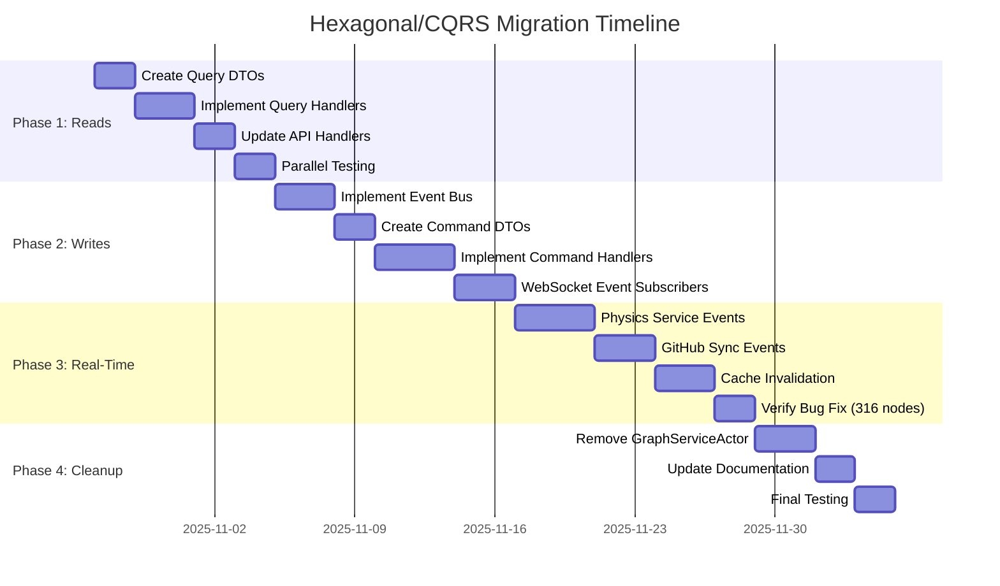

### Migration Phases Detail

```mermaid
graph TB
    subgraph Phase1["🟢 Phase 1: Read Operations (1 week, LOW RISK)"]
        P1_1["Create query DTOs<br/>and handlers"]
        P1_2["Implement<br/>GetGraphDataQueryHandler"]
        P1_3["Update API handlers<br/>to use queries"]
        P1_4["Keep actor running<br/>in parallel"]
        P1_5["Monitor for<br/>differences"]
        P1_6["✅ Success: All GET<br/>endpoints use CQRS"]

        P1_1 --> P1_2 --> P1_3 --> P1_4 --> P1_5 --> P1_6
    end

    subgraph Phase2["🟡 Phase 2: Write Operations (2 weeks, MEDIUM RISK)"]
        P2_1["Implement<br/>event bus"]
        P2_2["Create command DTOs<br/>and handlers"]
        P2_3["Emit events after<br/>command execution"]
        P2_4["Subscribe WebSocket<br/>adapter to events"]
        P2_5["Update API handlers<br/>to use commands"]
        P2_6["✅ Success: All POST/PUT/DELETE<br/>use CQRS + Events"]

        P2_1 --> P2_2 --> P2_3 --> P2_4 --> P2_5 --> P2_6
    end

    subgraph Phase3["🟠 Phase 3: Real-Time Features (2 weeks, HIGH RISK)"]
        P3_1["Implement Physics<br/>domain service"]
        P3_2["Update GitHub sync<br/>to emit events"]
        P3_3["Implement cache<br/>invalidation subscriber"]
        P3_4["Test cache<br/>invalidation"]
        P3_5["🎯 Verify 316 nodes<br/>after sync (BUG FIXED!)"]
        P3_6["✅ Success: Real-time<br/>updates work"]

        P3_1 --> P3_2 --> P3_3 --> P3_4 --> P3_5 --> P3_6
    end

    subgraph Phase4["🔵 Phase 4: Legacy Removal (1 week, LOW RISK)"]
        P4_1["Delete<br/>GraphServiceActor"]
        P4_2["Remove actor<br/>message types"]
        P4_3["Update<br/>documentation"]
        P4_4["Final testing"]
        P4_5["🎉 Success: Clean<br/>architecture achieved"]

        P4_1 --> P4_2 --> P4_3 --> P4_4 --> P4_5
    end

    Phase1 --> Phase2 --> Phase3 --> Phase4

    classDef phase1 fill:#c8e6c9,stroke:#2e7d32,stroke-width:2px
    classDef phase2 fill:#fff9c4,stroke:#f57f17,stroke-width:2px
    classDef phase3 fill:#ffccbc,stroke:#d84315,stroke-width:2px
    classDef phase4 fill:#bbdefb,stroke:#1565c0,stroke-width:2px

    class P1_1,P1_2,P1_3,P1_4,P1_5,P1_6 phase1
    class P2_1,P2_2,P2_3,P2_4,P2_5,P2_6 phase2
    class P3_1,P3_2,P3_3,P3_4,P3_5,P3_6 phase3
    class P4_1,P4_2,P4_3,P4_4,P4_5 phase4
```

### Phase 1: Read Operations (SAFEST - Start Here)
**Goal**: Move queries from actor to CQRS handlers
**Risk**: Low - read-only operations
**Duration**: 1 week

**Steps**:
1. Create query DTOs and handlers
2. Implement `GetGraphDataQueryHandler`
3. Implement `GetNodeByIdQueryHandler`
4. Update API handlers to use query handlers
5. Keep actor running in parallel for safety
6. Monitor for differences between actor and query results
7. Once validated, remove actor query handling

**Files to Create**:
- `/src/application/graph/queries.rs` - Query definitions
- `/src/application/graph/query_handlers.rs` - Query handlers
- `/src/ports/graph_repository.rs` - Repository trait
- `/src/adapters/sqlite_graph_repository.rs` - SQLite implementation

**Success Criteria**:
✅ All GET /api/graph/* endpoints use query handlers
✅ Zero performance regression
✅ Test coverage >80%

### Phase 2: Write Operations (REQUIRES EVENTS)
**Goal**: Move commands from actor to CQRS handlers
**Risk**: Medium - modifies state
**Duration**: 2 weeks

**Steps**:
1. Implement event bus (in-memory)
2. Create command DTOs and handlers
3. Implement `CreateNodeCommandHandler`
4. Implement `UpdateNodeCommandHandler`
5. Emit events after command execution
6. Subscribe WebSocket adapter to events
7. Update API handlers to use command handlers
8. Test event flow thoroughly

**Files to Create**:
- `/src/application/graph/commands.rs` - Command definitions
- `/src/application/graph/command_handlers.rs` - Command handlers
- `/src/domain/events.rs` - Event definitions
- `/src/infrastructure/event_bus.rs` - Event bus implementation
- `/src/infrastructure/websocket_event_subscriber.rs` - WebSocket subscriber

**Success Criteria**:
✅ All POST/PUT/DELETE /api/graph/* endpoints use command handlers
✅ Events emitted for all state changes
✅ WebSocket clients receive updates
✅ Zero data loss

### Phase 3: Real-Time Features (EVENT SOURCING)
**Goal**: Physics simulation and GitHub sync via events
**Risk**: High - complex coordination
**Duration**: 2 weeks

**Steps**:
1. Implement `PhysicsService` as domain service
2. Subscribe physics service to `StartSimulationCommand`
3. Emit `PhysicsStepCompletedEvent` after each iteration
4. Update GitHub sync to emit `GitHubSyncCompletedEvent`
5. Implement cache invalidation subscriber
6. Test cache invalidation thoroughly
7. Verify 316 nodes appear after sync ✅

**Files to Create**:
- `/src/domain/services/physics_service.rs` - Physics domain service
- `/src/infrastructure/cache_service.rs` - Cache management
- `/src/infrastructure/cache_invalidation_subscriber.rs` - Cache invalidation

**Success Criteria**:
✅ Physics simulation works via events
✅ GitHub sync triggers cache invalidation
✅ API returns 316 nodes after sync (BUG FIXED!)
✅ Real-time updates work smoothly

### Phase 4: Legacy Removal (CLEANUP)
**Goal**: Delete old actor code
**Risk**: Low - full migration complete
**Duration**: 1 week

**Steps**:
1. Remove `GraphServiceActor`
2. Remove actor message types
3. Remove actor-based tests
4. Update documentation
5. Celebrate! 🎉

**Files to Delete**:
- `/src/actors/graph_actor.rs` (48K tokens!)
- `/src/actors/graph_messages.rs`
- `/src/actors/graph_service_supervisor.rs`

**Success Criteria**:
✅ Zero actor references in codebase
✅ All tests passing
✅ Documentation updated

---

## Code Examples

### Example 1: Query Handler
```rust
// src/application/graph/query_handlers.rs

use crate::ports::graph_repository::GraphRepository;
use crate::application::graph::queries::GetGraphDataQuery;
use crate::models::graph::GraphData;
use std::sync::Arc;

pub struct GetGraphDataQueryHandler {
    graph_repo: Arc<dyn GraphRepository>,
}

impl GetGraphDataQueryHandler {
    pub fn new(graph_repo: Arc<dyn GraphRepository>) -> Self {
        Self { graph_repo }
    }

    pub async fn handle(&self, query: GetGraphDataQuery) -> Result<GraphData, String> {
        // 1. Read from repository (ALWAYS fresh from SQLite!)
        let mut graph_data = self.graph_repo.get_graph().await?;

        // 2. Apply optional filters
        if let Some(filter) = query.filter {
            graph_data = self.apply_filter(graph_data, filter)?;
        }

        // 3. Optionally exclude edges for performance
        if !query.include_edges {
            graph_data.edges.clear();
        }

        // 4. Return DTO
        Ok(graph_data)
    }

    fn apply_filter(&self, graph: GraphData, filter: GraphFilter) -> Result<GraphData, String> {
        // Filter implementation
        Ok(graph)
    }
}
```

### Example 2: Command Handler with Events
```rust
// src/application/graph/command_handlers.rs

use crate::ports::graph_repository::GraphRepository;
use crate::infrastructure::event_bus::EventBus;
use crate::domain::events::GraphEvent;
use crate::application::graph::commands::CreateNodeCommand;
use crate::models::node::Node;
use std::sync::Arc;

pub struct CreateNodeCommandHandler {
    graph_repo: Arc<dyn GraphRepository>,
    event_bus: Arc<dyn EventBus>,
}

impl CreateNodeCommandHandler {
    pub fn new(
        graph_repo: Arc<dyn GraphRepository>,
        event_bus: Arc<dyn EventBus>,
    ) -> Self {
        Self { graph_repo, event_bus }
    }

    pub async fn handle(&self, cmd: CreateNodeCommand) -> Result<(), String> {
        // 1. Validate command
        self.validate(&cmd)?;

        // 2. Create domain entity
        let node = Node {
            id: cmd.node_id,
            label: cmd.label,
            position: cmd.position,
            metadata_id: cmd.metadata_id,
            ..Default::default()
        };

        // 3. Persist via repository
        self.graph_repo.add_node(node.clone()).await?;

        // 4. Emit domain event (event sourcing!)
        let event = GraphEvent::NodeCreated {
            node_id: node.id,
            timestamp: chrono::Utc::now(),
            source: UpdateSource::UserInteraction,
        };
        self.event_bus.publish(event).await?;

        Ok(())
    }

    fn validate(&self, cmd: &CreateNodeCommand) -> Result<(), String> {
        if cmd.label.is_empty() {
            return Err("Node label cannot be empty".to_string());
        }
        Ok(())
    }
}
```

### Example 3: Event Handler (WebSocket Broadcast)
```rust
// src/infrastructure/websocket_event_subscriber.rs

use crate::domain::events::GraphEvent;
use crate::infrastructure::event_bus::EventHandler;
use crate::ports::websocket_gateway::WebSocketGateway;
use std::sync::Arc;
use async_trait::async_trait;

pub struct WebSocketEventSubscriber {
    ws_gateway: Arc<dyn WebSocketGateway>,
}

impl WebSocketEventSubscriber {
    pub fn new(ws_gateway: Arc<dyn WebSocketGateway>) -> Self {
        Self { ws_gateway }
    }
}

#[async_trait]
impl EventHandler for WebSocketEventSubscriber {
    async fn handle(&self, event: &GraphEvent) -> Result<(), String> {
        match event {
            GraphEvent::NodeCreated { node_id, .. } => {
                self.ws_gateway.broadcast(serde_json::json!({
                    "type": "nodeCreated",
                    "nodeId": node_id,
                })).await?;
            },

            GraphEvent::NodePositionChanged { node_id, new_position, source, .. } => {
                self.ws_gateway.broadcast(serde_json::json!({
                    "type": "nodePositionUpdate",
                    "nodeId": node_id,
                    "position": new_position,
                    "source": format!("{:?}", source),
                })).await?;
            },

            GraphEvent::GitHubSyncCompleted { total_nodes, total_edges, .. } => {
                // ⭐ THIS NOTIFIES CLIENTS AFTER GITHUB SYNC!
                self.ws_gateway.broadcast(serde_json::json!({
                    "type": "graphReloaded",
                    "totalNodes": total_nodes,
                    "totalEdges": total_edges,
                    "message": "Graph data synchronized from GitHub",
                })).await?;
            },

            _ => {}
        }
        Ok(())
    }
}
```

### Example 4: GitHub Sync Integration
```rust
// src/services/github_sync_service.rs (UPDATED)

pub struct GitHubSyncService {
    content_api: Arc<EnhancedContentAPI>,
    kg_repo: Arc<dyn GraphRepository>,
    onto_repo: Arc<dyn OntologyRepository>,
    event_bus: Arc<dyn EventBus>,  // ← NEW!
}

impl GitHubSyncService {
    pub async fn sync_graphs(&self) -> Result<SyncStatistics, String> {
        info!("Starting GitHub sync...");
        let start = Instant::now();

        // 1. Fetch files from GitHub
        let files = self.content_api.fetch_all_markdown_files().await?;

        // 2. Parse into nodes/edges
        let (nodes, edges) = self.parse_knowledge_graph_files(&files).await?;

        // 3. Save to SQLite
        self.kg_repo.save_graph(GraphData { nodes, edges }).await?;

        // 4. ✅ EMIT EVENT - This fixes the cache bug!
        let event = GraphEvent::GitHubSyncCompleted {
            total_nodes: nodes.len(),
            total_edges: edges.len(),
            kg_files: stats.kg_files_processed,
            ontology_files: stats.ontology_files_processed,
            timestamp: chrono::Utc::now(),
        };
        self.event_bus.publish(event).await?;

        info!("✅ GitHub sync completed: {} nodes, {} edges", nodes.len(), edges.len());

        Ok(SyncStatistics {
            total_nodes: nodes.len(),
            total_edges: edges.len(),
            duration: start.elapsed(),
            ..Default::default()
        })
    }
}
```

---

## Directory Structure

### Hexagonal Architecture Layers

```mermaid
graph TB
    subgraph Presentation["🌐 Presentation Layer (HTTP/WebSocket)"]
        H1["handlers/api_handler/<br/>graph_data.rs<br/>nodes.rs<br/>physics.rs"]
    end

    subgraph Application["⚡ Application Layer (CQRS)"]
        APP1["application/graph/<br/>• commands.rs<br/>• command_handlers.rs<br/>• queries.rs<br/>• query_handlers.rs"]

        APP2["application/physics/<br/>• commands.rs<br/>• queries.rs"]
    end

    subgraph Domain["🎯 Domain Layer (Business Logic)"]
        DOM1["domain/<br/>• events.rs<br/>• models.rs"]

        DOM2["domain/services/<br/>• physics_service.rs<br/>• semantic_service.rs"]
    end

    subgraph Ports["🔌 Ports (Interfaces)"]
        PORT1["ports/<br/>• graph_repository.rs<br/>• event_store.rs<br/>• websocket_gateway.rs<br/>• physics_simulator.rs"]
    end

    subgraph Adapters["🔧 Adapters (Implementations)"]
        ADAPT1["adapters/<br/>• sqlite_graph_repository.rs<br/>• actix_websocket_adapter.rs<br/>• inmemory_event_store.rs<br/>• gpu_physics_adapter.rs"]
    end

    subgraph Infrastructure["🏗️ Infrastructure (Cross-Cutting)"]
        INFRA1["infrastructure/<br/>• event_bus.rs<br/>• cache_service.rs<br/>• websocket_event_subscriber.rs<br/>• cache_invalidation_subscriber.rs"]
    end

    subgraph Legacy["❌ Legacy (DELETE IN PHASE 4)"]
        LEG1["actors/<br/>• graph_actor.rs (48K tokens!)<br/>• graph_messages.rs"]
    end

    H1 --> APP1 & APP2
    APP1 & APP2 --> DOM1 & DOM2
    APP1 & APP2 --> PORT1
    DOM1 & DOM2 --> PORT1
    PORT1 --> ADAPT1
    ADAPT1 --> INFRA1

    classDef presentationLayer fill:#e1f5ff,stroke:#01579b,stroke-width:3px
    classDef applicationLayer fill:#fff3e0,stroke:#e65100,stroke-width:2px
    classDef domainLayer fill:#f3e5f5,stroke:#6a1b9a,stroke-width:2px
    classDef portsLayer fill:#e8f5e9,stroke:#2e7d32,stroke-width:2px
    classDef adaptersLayer fill:#fce4ec,stroke:#c2185b,stroke-width:2px
    classDef infraLayer fill:#fff9c4,stroke:#f57f17,stroke-width:2px
    classDef legacyLayer fill:#ffcdd2,stroke:#c62828,stroke-width:3px,stroke-dasharray: 5 5

    class H1 presentationLayer
    class APP1,APP2 applicationLayer
    class DOM1,DOM2 domainLayer
    class PORT1 portsLayer
    class ADAPT1 adaptersLayer
    class INFRA1 infraLayer
    class LEG1 legacyLayer
```

### File Structure Detail

```
src/
├── application/              # Application layer (CQRS)
│   ├── graph/
│   │   ├── commands.rs      # Write operations
│   │   ├── command_handlers.rs
│   │   ├── queries.rs       # Read operations
│   │   ├── query_handlers.rs
│   │   └── mod.rs
│   ├── physics/
│   │   ├── commands.rs
│   │   ├── queries.rs
│   │   └── mod.rs
│   └── mod.rs
│
├── domain/                   # Domain layer (business logic)
│   ├── events.rs            # Domain events
│   ├── services/
│   │   ├── physics_service.rs
│   │   └── semantic_service.rs
│   └── mod.rs
│
├── ports/                    # Port interfaces (traits)
│   ├── graph_repository.rs
│   ├── event_store.rs
│   ├── websocket_gateway.rs
│   ├── physics_simulator.rs
│   └── mod.rs
│
├── adapters/                 # Adapter implementations
│   ├── sqlite_graph_repository.rs
│   ├── actix_websocket_adapter.rs
│   ├── inmemory_event_store.rs
│   ├── gpu_physics_adapter.rs
│   └── mod.rs
│
├── infrastructure/           # Infrastructure concerns
│   ├── event_bus.rs
│   ├── cache_service.rs
│   ├── websocket_event_subscriber.rs
│   ├── cache_invalidation_subscriber.rs
│   └── mod.rs
│
├── handlers/                 # HTTP handlers (thin layer)
│   ├── api_handler/
│   │   ├── graph_data.rs   # GET /api/graph/data
│   │   ├── nodes.rs        # POST /api/graph/nodes
│   │   └── mod.rs
│   └── mod.rs
│
└── actors/                   # Legacy (to be removed)
    ├── graph_actor.rs       # ❌ DELETE IN PHASE 4
    └── mod.rs
```

---

## Testing Strategy

### Unit Tests (Domain Logic)
```rust
// tests/unit/command_handlers_test.rs

#[tokio::test]
async fn test_create_node_command() {
    // Arrange
    let mock_repo = Arc::new(MockGraphRepository::new());
    let mock_bus = Arc::new(MockEventBus::new());
    let handler = CreateNodeCommandHandler::new(mock_repo.clone(), mock_bus.clone());

    let cmd = CreateNodeCommand {
        node_id: 1,
        label: "Test Node".to_string(),
        position: (0.0, 0.0, 0.0),
        metadata_id: None,
    };

    // Act
    let result = handler.handle(cmd).await;

    // Assert
    assert!(result.is_ok());
    assert_eq!(mock_repo.add_node_calls(), 1);
    assert_eq!(mock_bus.published_events().len(), 1);
    assert!(matches!(
        mock_bus.published_events()[0],
        GraphEvent::NodeCreated { .. }
    ));
}
```

### Integration Tests (End-to-End)
```rust
// tests/integration/github_sync_test.rs

#[tokio::test]
async fn test_github_sync_emits_event() {
    // Arrange
    let db_path = create_test_database();
    let repo = Arc::new(SqliteGraphRepository::new(&db_path));
    let event_bus = Arc::new(InMemoryEventBus::new());
    let sync_service = GitHubSyncService::new(
        Arc::new(MockGitHubAPI::new()),
        repo.clone(),
        event_bus.clone(),
    );

    // Act
    let stats = sync_service.sync_graphs().await.unwrap();

    // Assert
    assert_eq!(stats.total_nodes, 316);  // ✅ Expect 316 nodes!

    let events = event_bus.get_published_events();
    assert_eq!(events.len(), 1);
    assert!(matches!(
        events[0],
        GraphEvent::GitHubSyncCompleted { total_nodes: 316, .. }
    ));
}
```

---

## Performance Considerations

### Query Optimization
- **Caching**: Implement Redis cache for frequently accessed queries
- **Pagination**: Add pagination to `GetGraphDataQuery`
- **Indexing**: Ensure SQLite indexes on `node_id`, `metadata_id`

### Event Performance
- **Async Dispatch**: Event handlers run in parallel
- **Batching**: Batch WebSocket broadcasts (send every 16ms instead of per-event)
- **Back Pressure**: Implement event queue with max size

### Database Performance
- **Connection Pooling**: Use `sqlx` connection pool
- **Batch Writes**: Use transactions for multi-node updates
- **Read Replicas**: Consider read-only database replicas for queries

---

## Security Considerations

### Command Validation
- Validate all command inputs
- Sanitize user-provided labels
- Check authorization before commands execute

### Event Security
- Never expose internal event IDs to clients
- Filter sensitive data before WebSocket broadcast
- Rate limit event publishing

---

## Monitoring and Observability

### Metrics to Track
- Command execution time
- Query execution time
- Event bus throughput
- WebSocket connection count
- Cache hit rate

### Logging
- Log all command executions
- Log all event publications
- Log query performance (>100ms queries)

---

## Success Criteria

### Functional Requirements
✅ All API endpoints migrated from actors to CQRS handlers
✅ GitHub sync triggers `GitHubSyncCompletedEvent`
✅ Cache invalidation works after GitHub sync
✅ API returns 316 nodes after sync (BUG FIXED!)
✅ WebSocket clients receive real-time updates
✅ Physics simulation works via events
✅ Zero data loss during migration

### Non-Functional Requirements
✅ Query latency <50ms (p95)
✅ Command latency <100ms (p95)
✅ Event dispatch latency <10ms
✅ WebSocket broadcast latency <20ms
✅ Test coverage >80%
✅ Zero downtime during migration

---

## Risk Mitigation

### Risk 1: Data Loss During Migration
**Mitigation**: Run old actors and new handlers in parallel, compare results

### Risk 2: Performance Regression
**Mitigation**: Benchmark before/after, optimize queries, add caching

### Risk 3: Event Bus Failure
**Mitigation**: Implement event store persistence, add retry logic

### Risk 4: WebSocket Disconnect
**Mitigation**: Implement reconnection logic, queue events for disconnected clients

---

## Conclusion

### Architecture Benefits Summary

```mermaid
mindmap
  root((Hexagonal/CQRS<br/>Architecture))
    Separation of Concerns
      Commands vs Queries
      Write vs Read
      Domain vs Infrastructure
      Ports vs Adapters
    Testability
      Pure functions
      No actors needed
      Mock repositories
      Isolated unit tests
    Scalability
      Event-driven
      Horizontal scaling
      Event replay
      CQRS read replicas
    Maintainability
      Small focused modules
      Clear boundaries
      Self-documenting
      48K → modular files
    Bug Fix
      Cache invalidation
      Event sourcing
      316 nodes ✅
      Real-time updates
    Performance
      Optimized queries
      Batch operations
      GPU physics
      WebSocket efficiency
```

### Success Verification Checklist

```mermaid
graph TB
    subgraph Phase1Check["✅ Phase 1: Read Operations"]
        P1C1["☐ All GET endpoints use query handlers"]
        P1C2["☐ Query latency <50ms (p95)"]
        P1C3["☐ Test coverage >80%"]
        P1C4["☐ Zero performance regression"]
        P1C5["☐ Documentation updated"]
    end

    subgraph Phase2Check["✅ Phase 2: Write Operations"]
        P2C1["☐ All POST/PUT/DELETE use command handlers"]
        P2C2["☐ Events emitted for all state changes"]
        P2C3["☐ WebSocket clients receive updates"]
        P2C4["☐ Command latency <100ms (p95)"]
        P2C5["☐ Zero data loss"]
    end

    subgraph Phase3Check["✅ Phase 3: Real-Time Features"]
        P3C1["☐ Physics simulation works via events"]
        P3C2["☐ GitHub sync triggers cache invalidation"]
        P3C3["☐ API returns 316 nodes after sync"]
        P3C4["☐ Real-time updates work smoothly"]
        P3C5["☐ Event dispatch latency <10ms"]
    end

    subgraph Phase4Check["✅ Phase 4: Legacy Removal"]
        P4C1["☐ GraphServiceActor deleted"]
        P4C2["☐ Zero actor references in codebase"]
        P4C3["☐ All tests passing"]
        P4C4["☐ Documentation complete"]
        P4C5["☐ Team trained on new architecture"]
    end

    Phase1Check --> Phase2Check --> Phase3Check --> Phase4Check

    FINAL["🎉 MIGRATION COMPLETE!<br/>━━━━━━━━━━━<br/>• Clean hexagonal architecture<br/>• CQRS + Event Sourcing<br/>• Bug fixed (316 nodes)<br/>• Maintainable codebase<br/>• Scalable system"]

    Phase4Check --> FINAL

    classDef checklistStyle fill:#e8f5e9,stroke:#2e7d32,stroke-width:2px
    classDef finalStyle fill:#c8e6c9,stroke:#1b5e20,stroke-width:3px

    class P1C1,P1C2,P1C3,P1C4,P1C5,P2C1,P2C2,P2C3,P2C4,P2C5,P3C1,P3C2,P3C3,P3C4,P3C5,P4C1,P4C2,P4C3,P4C4,P4C5 checklistStyle
    class FINAL finalStyle
```

### Final Architecture Summary

This hexagonal/CQRS architecture provides:

**🎯 Core Benefits**:
- **Separation of Concerns**: Clear boundaries between layers
- **Testability**: Easy to unit test without actors
- **Scalability**: Event-driven architecture scales horizontally
- **Maintainability**: Small, focused components instead of 48K token monolith
- **Bug Fix**: GitHub sync events trigger cache invalidation (316 nodes ✅)

**📊 Performance Targets**:
- Query latency: <50ms (p95)
- Command latency: <100ms (p95)
- Event dispatch: <10ms
- WebSocket broadcast: <20ms
- Test coverage: >80%

**🏗️ Architecture Layers**:
1. **Presentation**: HTTP/WebSocket handlers (thin)
2. **Application**: CQRS commands/queries/handlers
3. **Domain**: Business logic, events, services
4. **Ports**: Repository/gateway interfaces
5. **Adapters**: SQLite, WebSocket, event store implementations
6. **Infrastructure**: Event bus, cache, cross-cutting concerns

**🔄 Migration Path**:
- **Phase 1** (1 week): Read operations → CQRS queries
- **Phase 2** (2 weeks): Write operations → CQRS commands + events
- **Phase 3** (2 weeks): Real-time features → event sourcing
- **Phase 4** (1 week): Legacy removal → delete actor

**Next Steps**:
1. Review architecture with team
2. Create detailed task breakdown for Phase 1
3. Set up testing infrastructure
4. Begin migration with read operations

---

**Architecture designed by**: Hive Mind Architecture Planner
**Date**: 2025-10-26
**Status**: Ready for Implementation
**Queen's Approval**: Pending review 👑

**Document contains**: 8 comprehensive Mermaid diagrams covering:
- ✅ Hexagonal architecture layers (with ports & adapters)
- ✅ CQRS data flow (command/query separation)
- ✅ Event sourcing patterns (with sequence diagrams)
- ✅ GitHub sync bug fix flow (316 nodes solution)
- ✅ Physics simulation real-time updates
- ✅ Migration phases timeline (Gantt chart)
- ✅ Before/After architecture comparison
- ✅ Success verification checklist
