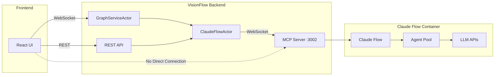
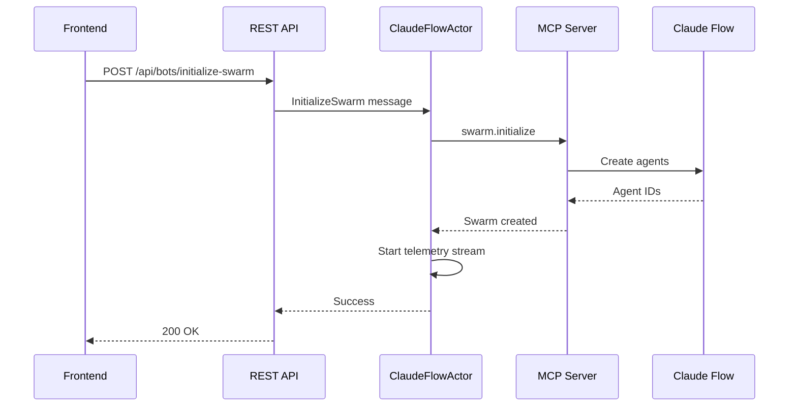
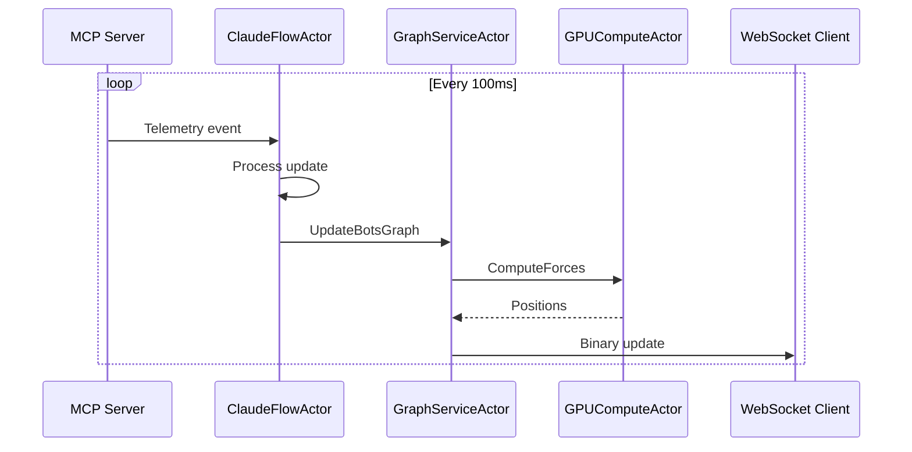

# MCP Integration Architecture

VisionFlow integrates with Claude Flow's Model Context Protocol (MCP) to orchestrate and visualize AI agent swarms in real-time.

## Overview

The MCP integration enables VisionFlow to:
- Spawn and manage AI agent swarms
- Visualize agent interactions and task flow
- Monitor agent performance and resource usage
- Coordinate multi-agent collaboration

## Architecture



## Key Design Principles

### 1. Backend-Only MCP Connection

The frontend **never** connects directly to MCP. All MCP communication flows through the Rust backend:

```rust
// ClaudeFlowActor handles all MCP communication
pub struct ClaudeFlowActor {
    mcp_client: Option<MCPClient>,
    ws_connection: Option<WebSocketStream>,
    graph_service_addr: Addr<GraphServiceActor>,
}
```

### 2. WebSocket Protocol

The backend connects to Claude Flow via WebSocket on port 3002:

```rust
async fn connect_to_claude_flow() -> Result<WebSocketStream> {
    let host = env::var("CLAUDE_FLOW_HOST")
        .unwrap_or("multi-agent-container".to_string());
    let port = env::var("CLAUDE_FLOW_PORT")
        .unwrap_or("3002".to_string());
    let url = format!("ws://{}:{}/mcp", host, port);
    
    let (ws_stream, _) = connect_async(&url).await?;
    Ok(ws_stream)
}
```

### 3. Real-time Telemetry

Agent telemetry streams at 10Hz for smooth visualization:

```rust
// Telemetry subscription
let subscribe_req = json!({
    "jsonrpc": "2.0",
    "method": "telemetry.subscribe",
    "params": {
        "events": ["agent.*", "message.*", "metrics.*"],
        "interval_ms": 100  // 10Hz updates
    }
});
```

## MCP Message Protocol

### Request Format

```json
{
    "jsonrpc": "2.0",
    "id": "uuid-v4",
    "method": "agent.spawn",
    "params": {
        "type": "coordinator",
        "task": "Build a REST API",
        "config": {
            "max_tokens": 4000,
            "temperature": 0.7
        }
    }
}
```

### Response Format

```json
{
    "jsonrpc": "2.0",
    "id": "uuid-v4",
    "result": {
        "agent_id": "agent-001",
        "status": "active",
        "session_id": "session-xyz"
    }
}
```

### Telemetry Events

```json
{
    "type": "agent.status",
    "data": {
        "agent_id": "agent-001",
        "status": "active",
        "cpu_usage": 45.2,
        "memory_usage": 128.5,
        "tasks_active": 3,
        "tokens_used": 1523
    },
    "timestamp": "2024-01-01T12:00:00Z"
}
```

## Core MCP Methods

### Agent Management

| Method | Description | Parameters |
|--------|-------------|------------|
| `agent.spawn` | Create new agent | `type`, `task`, `config` |
| `agent.list` | List all agents | `filter`, `limit` |
| `agent.terminate` | Stop an agent | `agent_id` |
| `agent.status` | Get agent status | `agent_id` |

### Swarm Orchestration

| Method | Description | Parameters |
|--------|-------------|------------|
| `swarm.initialize` | Create agent swarm | `topology`, `agents`, `task` |
| `swarm.status` | Get swarm status | `swarm_id` |
| `swarm.dissolve` | Terminate swarm | `swarm_id` |

### Task Management

| Method | Description | Parameters |
|--------|-------------|------------|
| `task.assign` | Assign task to agent | `agent_id`, `task` |
| `task.status` | Get task progress | `task_id` |
| `task.cancel` | Cancel running task | `task_id` |

## Data Flow

### 1. Swarm Initialization



### 2. Telemetry Streaming



## Actor Integration

### ClaudeFlowActor

Manages MCP connection and agent state:

```rust
impl ClaudeFlowActor {
    // Handle incoming telemetry
    fn handle_telemetry_event(&mut self, event: MCPEvent) {
        match event.event_type {
            "agent.spawned" => self.add_agent(event.data),
            "agent.terminated" => self.remove_agent(event.data.id),
            "agent.status" => self.update_agent(event.data),
            "message.sent" => self.add_message_flow(event.data),
            _ => {}
        }
        
        // Push to graph service
        self.push_to_graph();
    }
    
    // Convert to graph format
    fn push_to_graph(&self) {
        let graph_data = self.to_graph_data();
        self.graph_service_addr.do_send(UpdateBotsGraph {
            nodes: graph_data.nodes,
            edges: graph_data.edges,
        });
    }
}
```

### GraphServiceActor

Processes agent graph updates:

```rust
impl Handler<UpdateBotsGraph> for GraphServiceActor {
    fn handle(&mut self, msg: UpdateBotsGraph) {
        // Update agent graph buffer
        self.agent_nodes = msg.nodes;
        self.agent_edges = msg.edges;
        
        // Mark as agent nodes (set bit 31)
        for node in &mut self.agent_nodes {
            node.id |= 0x80000000;
        }
        
        // Send to GPU for physics
        if let Some(gpu) = &self.gpu_compute_addr {
            gpu.do_send(UpdateAgentGraph {
                nodes: self.agent_nodes.clone(),
                edges: self.agent_edges.clone(),
            });
        }
    }
}
```

## Configuration

MCP connection settings in environment variables:

```bash
# Claude Flow host (Docker service name)
CLAUDE_FLOW_HOST=multi-agent-container

# MCP WebSocket port
CLAUDE_FLOW_PORT=3002

# Enable MCP integration
ENABLE_MCP=true

# Telemetry settings
MCP_TELEMETRY_INTERVAL_MS=100
MCP_RECONNECT_INTERVAL_SEC=30
MCP_MAX_AGENTS=50
```

## Error Handling

### Connection Failures

```rust
impl ClaudeFlowActor {
    async fn ensure_connection(&mut self) -> Result<()> {
        if !self.is_connected {
            match Self::connect_to_claude_flow().await {
                Ok(ws) => {
                    self.ws_connection = Some(ws);
                    self.is_connected = true;
                    self.subscribe_to_telemetry().await?;
                    Ok(())
                }
                Err(e) => {
                    warn!("MCP connection failed: {}", e);
                    // Return empty state, no mock data
                    Err(e)
                }
            }
        } else {
            Ok(())
        }
    }
}
```

### Graceful Degradation

When MCP is unavailable:
1. Frontend shows "MCP Disconnected" status
2. Agent graph remains empty (no mock data)
3. Knowledge graph continues functioning
4. Reconnection attempts every 30 seconds

## Security Considerations

### Network Isolation

- MCP server only accessible within Docker network
- No external MCP exposure
- Frontend isolated from direct MCP access

### Authentication

- Optional API key authentication for MCP
- Session-based frontend authentication
- Rate limiting on API endpoints

### Data Validation

```rust
fn validate_mcp_response(response: &Value) -> Result<()> {
    // Validate JSON-RPC format
    if !response.get("jsonrpc").is_some() {
        return Err("Invalid JSON-RPC response");
    }
    
    // Check for errors
    if let Some(error) = response.get("error") {
        return Err(format!("MCP error: {:?}", error));
    }
    
    Ok(())
}
```

## Performance

### Metrics

- **Latency**: < 50ms MCP round-trip
- **Throughput**: 10,000+ telemetry events/sec
- **Agent Capacity**: 50+ concurrent agents
- **Update Rate**: 10Hz telemetry, 60 FPS rendering

### Optimizations

1. **Differential Updates**: Only send changed data
2. **Binary Protocol**: 28-byte position updates
3. **Connection Pooling**: Reuse WebSocket connections
4. **Batch Processing**: Aggregate telemetry events

## Troubleshooting

### Common Issues

| Issue | Cause | Solution |
|-------|-------|----------|
| No agents visible | MCP not connected | Check Docker logs, verify ports |
| Laggy updates | Network latency | Reduce telemetry frequency |
| Connection drops | Container restart | Enable auto-reconnect |
| High CPU usage | Too many agents | Limit max agents in config |

### Debug Logging

Enable MCP debug logs:

```bash
RUST_LOG=webxr::services::claude_flow=debug cargo run
```

## See Also

- [System Overview](system-overview.md) - Overall architecture
- [Dual Graph](dual-graph.md) - Agent graph visualization
- [API Reference](../api/rest.md) - REST endpoints for MCP control