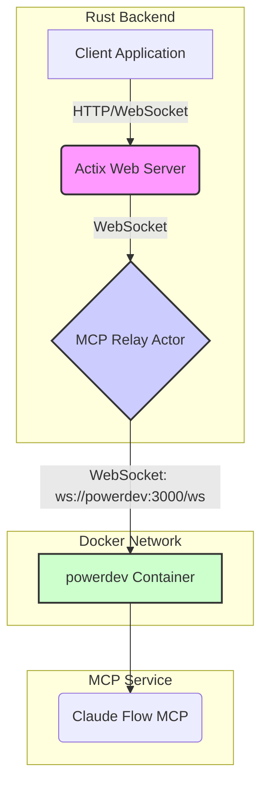

# MCP Connection Architecture

This document outlines the corrected architecture for the Multi-agent Control Plane (MCP) connection, which now exclusively uses a WebSocket transport to communicate with the `powerdev` container.

## Overview

The previous implementation had a critical flaw where it defaulted to an `stdio` transport, causing the system to spawn a local `npx claude-flow` process. This was incorrect, as the intended architecture is to connect to a dedicated, containerized MCP service (`powerdev`) over the network.

The following changes have been made to align the implementation with the correct architecture:

1.  **Disabled `StdioTransport`**: The logic responsible for spawning the local process in `src/services/claude_flow/transport/stdio.rs` has been removed. The `connect` method for this transport now returns an error, effectively disabling it.
2.  **Default to `WebSocketTransport`**: The `ClaudeFlowClientBuilder` in `src/services/claude_flow/client.rs` has been modified to default to `TransportType::WebSocket`.

This ensures that all MCP communication is routed through the `mcp_relay_handler`, which connects to the `powerdev` container via its WebSocket endpoint.

## Data Flow Diagram

The following Mermaid diagram illustrates the corrected data flow:

### Explanation

1.  **Client Application**: The frontend application communicates with the backend via standard HTTP and WebSocket connections.
2.  **Actix Web Server**: The Rust backend, built with Actix, handles incoming requests.
3.  **MCP Relay Actor**: When a connection to `/ws/mcp` is established, the `MCPRelayActor` is started. This actor is responsible for bridging the communication between the client and the `powerdev` container.
4.  **`powerdev` Container**: The `MCPRelayActor` establishes a WebSocket connection to the `powerdev` container at `ws://powerdev:3000/ws`. This hostname is resolved within the Docker network.
5.  **Claude Flow MCP**: The `powerdev` container runs the Claude Flow MCP, which manages the multi-agent system.

This corrected architecture is more robust, scalable, and aligns with modern microservice best practices. It eliminates the need for local process spawning, which was a significant source of errors and instability.