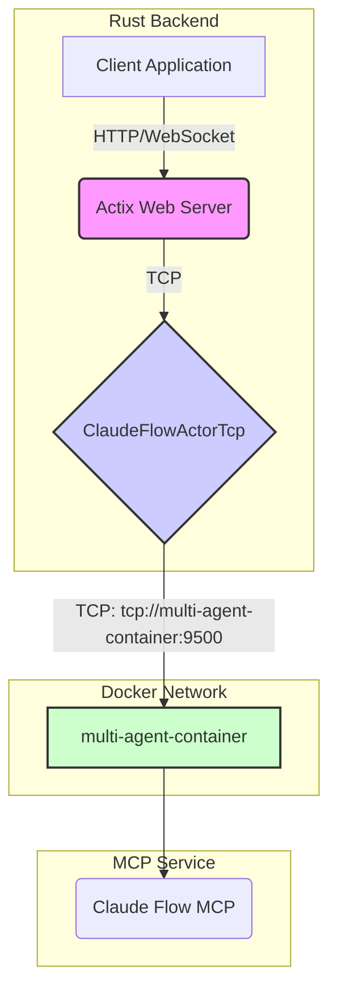

# MCP Connection Architecture

This document outlines the corrected architecture for the Multi-agent Control Plane (MCP) connection, which now exclusively uses TCP transport to communicate with the `multi-agent-container`.

## Overview

The previous implementation used both `stdio` and `WebSocket` transports, which were complex and unreliable. The current implementation uses only TCP transport to connect to a dedicated, containerized MCP service (`multi-agent-container`) over the network.

The following changes have been made to align the implementation with the correct architecture:

1.  **Disabled Legacy Transports**: Both `StdioTransport` and `WebSocketTransport` have been disabled.
2.  **TCP Only**: The `ClaudeFlowClientBuilder` in `src/services/claude_flow/client_builder.rs` now only supports TCP transport via `with_tcp()`.

This ensures that all MCP communication is direct TCP communication with the `multi-agent-container` on port 9500.

## Data Flow Diagram

The following Mermaid diagram illustrates the corrected data flow:

### Explanation

1.  **Client Application**: The frontend application communicates with the backend via standard HTTP and WebSocket connections.
2.  **Actix Web Server**: The Rust backend, built with Actix, handles incoming requests.
3.  **ClaudeFlowActorTcp**: This actor manages direct TCP connections to the `multi-agent-container`. It handles all MCP protocol communication.
4.  **`multi-agent-container`**: The `ClaudeFlowActorTcp` establishes a TCP connection to the `multi-agent-container` at `tcp://multi-agent-container:9500`. This hostname is resolved within the Docker network.
5.  **Claude Flow MCP**: The `multi-agent-container` runs the Claude Flow MCP, which manages the multi-agent system.

This TCP-only architecture is more robust and reliable. It eliminates the complexity of WebSocket handshakes and provides direct, efficient communication with the MCP server.