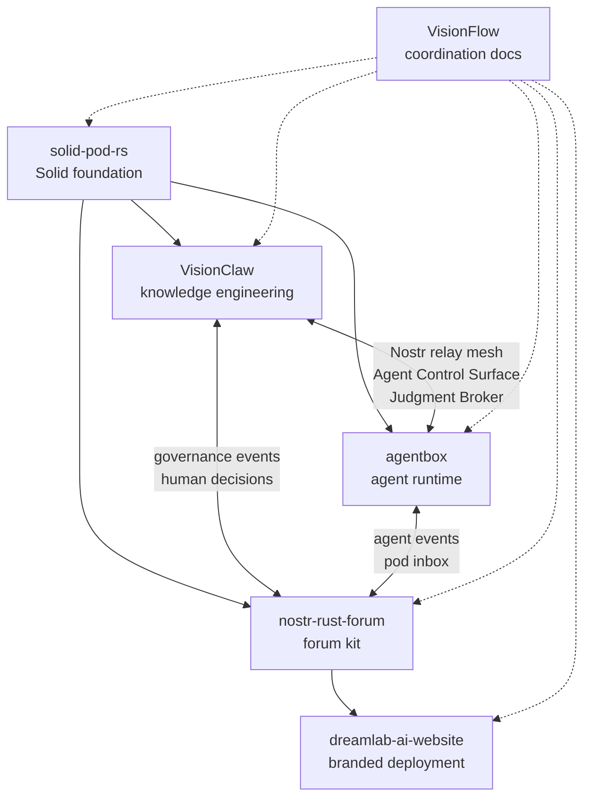

# Repository Map

**Status:** Docs-only map
**Date:** 2026-05-20

VisionFlow is a federated ecosystem. No single repository contains the whole runtime.

| Repository | Local path | Role | Primary docs entry |
|---|---|---|---|
| VisionFlow | `../VisionFlow` | Ecosystem guide, public website, coordination architecture | `README.md`, `docs/ecosystem-map.md` |
| VisionClaw | `../project` | Knowledge engineering, OWL reasoning, GPU graph physics, XR, MCP tools, Judgment Broker | `README.md`, `docs/PRD-010-did-nostr-mesh-federation.md`, `docs/PRD-014-ecosystem-productionisation.md`, `docs/PRD-015-ecosystem-code-hygiene.md` |
| agentbox | `../agentbox` | Sovereign agent runtime, Nix container, skills/tools, Solid pod and Nostr bridge | `README.md`, `docs/developer/ecosystem.md`, `docs/developer/identity-mesh.md` |
| solid-pod-rs | `../solid-pod-rs` | Solid/JSS foundation library and server: LDP, WAC, NIP-98, DID:Nostr, git pods | `README.md`, `crates/solid-pod-rs/docs/explanation/ecosystem-integration.md`, `crates/solid-pod-rs/GAP-ANALYSIS.md` |
| nostr-rust-forum | `../nostr-rust-forum` | Forum kit, Cloudflare Workers, passkey auth, relay, governance UI | `README.md`, `docs/architecture.md`, `docs/consumer-surface-map.md` |
| dreamlab-ai-website | `../dreamlab-ai-website` | DreamLab branded deployment and operator overlay for forum kit | `README.md`, `forum-config/` docs |

## Dependency Direction

## Ownership Rule

Protocol primitives should have one source of truth:

| Primitive | Preferred owner |
|---|---|
| Solid LDP, WAC, WebID, pod storage | solid-pod-rs |
| DID:Nostr document/resolution primitives | solid-pod-rs or a shared crate extracted from it |
| NIP-98 verification and replay contract | shared crate, using the most complete implementation as reference |
| Agent Control Surface kinds `31400-31405` | nostr-rust-forum, with schema consumed by agentbox and VisionClaw |
| Judgment Broker domain | VisionClaw |
| Operator deployment config | dreamlab-ai-website for DreamLab production; per-operator overlays elsewhere |

