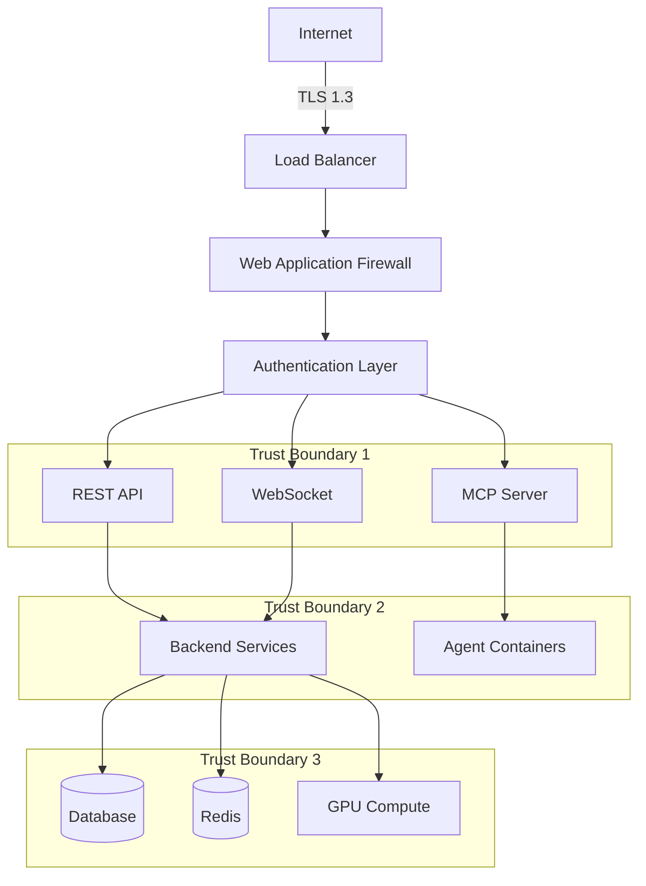
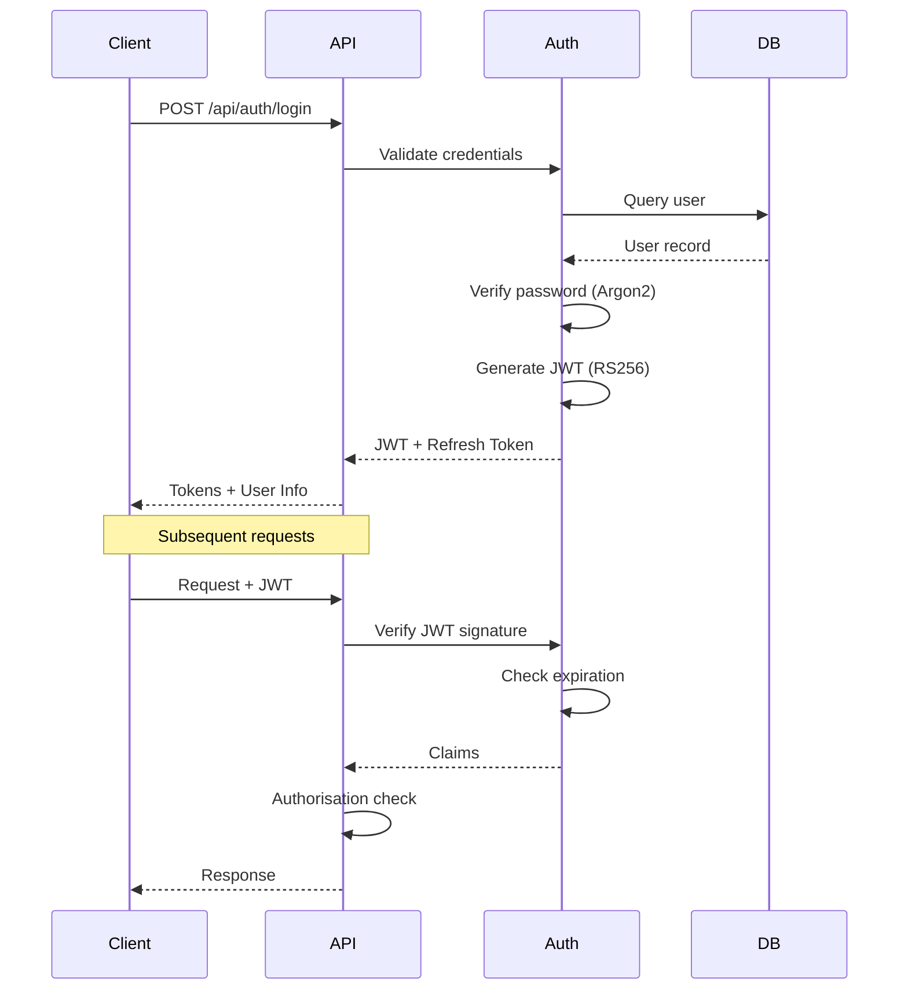
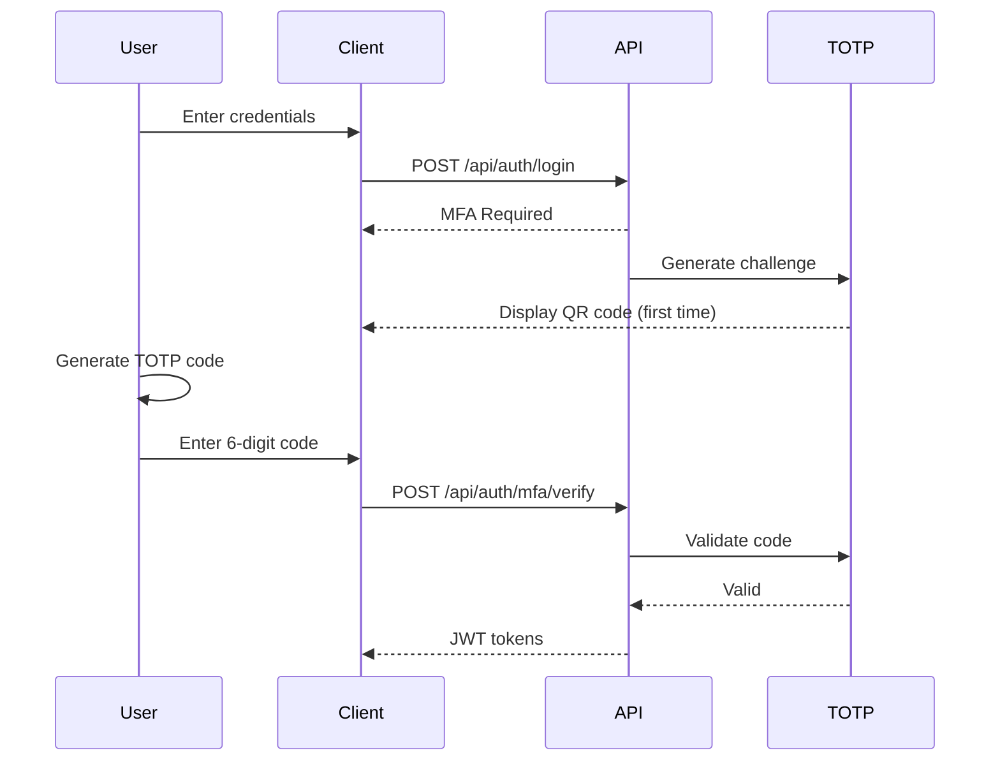
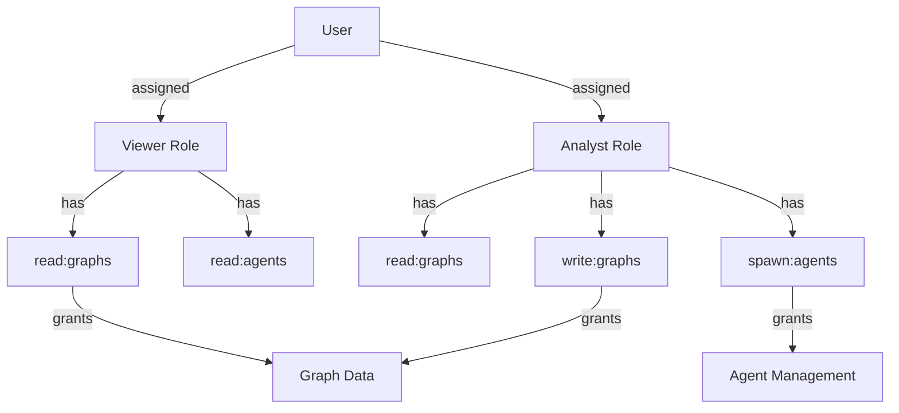
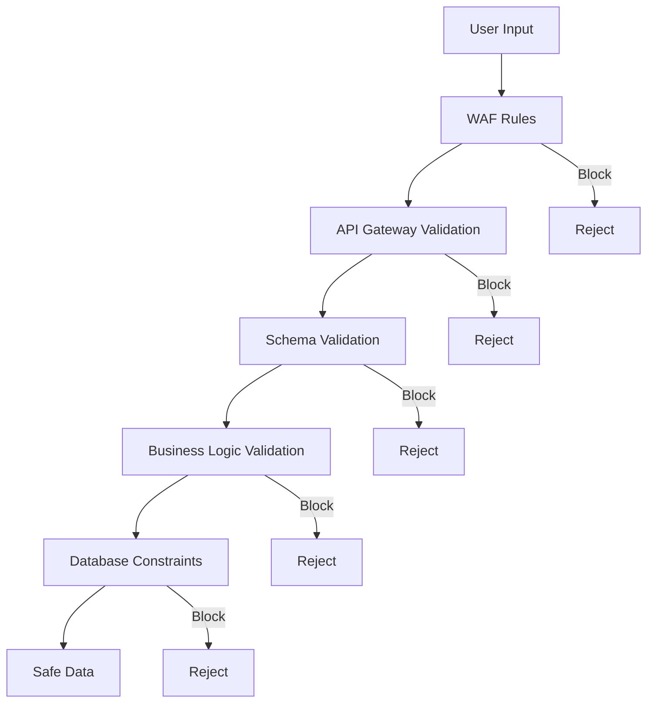
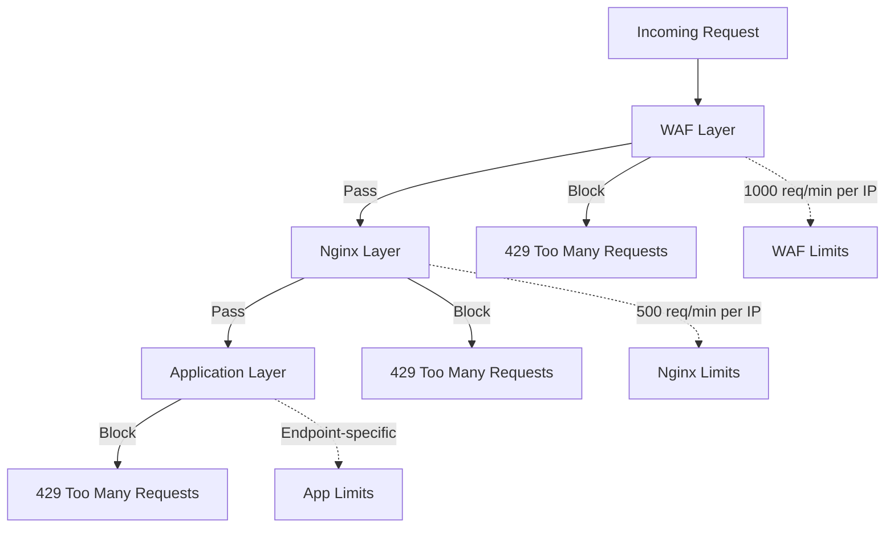

# Security Architecture

**Version**: 2.2.0
**Last Updated**: 2025-09-30
**Compliance**: OWASP Top 10, GDPR, SOC 2

## Security Overview

VisionFlow implements defence-in-depth security with multiple layers of protection across the application stack. This document outlines the security architecture, threat model, and implementation details.

## Security Principles

### Core Principles
1. **Least Privilege**: Users and services have minimum necessary permissions
2. **Defence in Depth**: Multiple overlapping security controls
3. **Fail Secure**: System defaults to secure state on failure
4. **Complete Mediation**: All access requests are validated
5. **Security by Design**: Security integrated from inception

### Compliance Framework
- **OWASP Top 10**: Protection against common web vulnerabilities
- **GDPR**: Personal data protection and privacy
- **SOC 2**: Security, availability, and confidentiality controls
- **ISO 27001**: Information security management (planned)

## Threat Model

### Attack Surface Analysis



### Threat Categories

| Category | Threats | Mitigations |
|----------|---------|-------------|
| **Authentication** | Credential theft, brute force | MFA, rate limiting, strong passwords |
| **Authorisation** | Privilege escalation, IDOR | RBAC, attribute-based access control |
| **Injection** | SQL, XSS, command injection | Parameterised queries, input validation, CSP |
| **Exposure** | Data leaks, information disclosure | Encryption, access controls, auditing |
| **DoS** | Resource exhaustion, flooding | Rate limiting, resource quotas, circuit breakers |
| **Supply Chain** | Dependency vulnerabilities | Automated scanning, pinned versions, SBOMs |

## Authentication Architecture

### JWT-Based Authentication



### Token Structure

**Access Token (JWT)**:
```json
{
  "header": {
    "alg": "RS256",
    "typ": "JWT",
    "kid": "key-id-2025-09"
  },
  "payload": {
    "sub": "user-uuid",
    "email": "user@example.com",
    "roles": ["user", "analyst"],
    "permissions": ["read:graphs", "write:agents"],
    "iss": "https://auth.yourdomain.com",
    "aud": "visionflow-api",
    "exp": 1727700000,
    "iat": 1727696400,
    "jti": "token-unique-id"
  },
  "signature": "..."
}
```

**Token Specifications**:
- **Algorithm**: RS256 (asymmetric signing)
- **Access Token Lifetime**: 15 minutes
- **Refresh Token Lifetime**: 7 days
- **Rotation**: Refresh tokens rotate on use
- **Revocation**: Token blacklist with Redis

### Password Security

**Hashing Algorithm**: Argon2id

```rust
use argon2::{
    password_hash::{PasswordHash, PasswordHasher, PasswordVerifier, SaltString},
    Argon2
};

pub fn hash_password(password: &str) -> Result<String, Error> {
    let salt = SaltString::generate(&mut OsRng);
    let argon2 = Argon2::default();

    let password_hash = argon2
        .hash_password(password.as_bytes(), &salt)?
        .to_string();

    Ok(password_hash)
}

pub fn verify_password(password: &str, hash: &str) -> Result<bool, Error> {
    let parsed_hash = PasswordHash::new(hash)?;
    let argon2 = Argon2::default();

    Ok(argon2.verify_password(password.as_bytes(), &parsed_hash).is_ok())
}
```

**Parameters**:
- **Memory**: 64 MB
- **Iterations**: 3
- **Parallelism**: 4 threads
- **Salt**: 16 bytes (random)
- **Output**: 32 bytes

### Multi-Factor Authentication



**TOTP Configuration**:
- **Algorithm**: SHA-256
- **Period**: 30 seconds
- **Digits**: 6
- **Window**: ±1 period for clock skew
- **Backup Codes**: 10 single-use codes generated

## Authorisation Architecture

### Role-Based Access Control (RBAC)



**Default Roles**:

| Role | Permissions | Description |
|------|-------------|-------------|
| **Viewer** | read:graphs, read:agents | Read-only access to graphs and agent status |
| **Analyst** | Viewer + write:graphs, spawn:agents | Can modify graphs and spawn agents |
| **Administrator** | Analyst + manage:users, manage:system | Full system administration |
| **Service** | Limited API access | For service-to-service authentication |

### Permission Structure

```rust
#[derive(Debug, Clone, Serialize, Deserialize)]
pub struct Permission {
    pub action: Action,      // read, write, delete, manage
    pub resource: Resource,  // graphs, agents, users, system
    pub conditions: Option<Vec<Condition>>,
}

#[derive(Debug, Clone)]
pub enum Condition {
    OwnerOnly,
    TimeRestriction { start: DateTime, end: DateTime },
    IpWhitelist { ips: Vec<IpAddr> },
    ResourceLimit { max: usize },
}
```

**Authorisation Check**:
```rust
pub fn check_permission(
    user: &User,
    permission: &Permission,
    resource_id: &str,
) -> Result<bool, AuthError> {
    // Check if user has role with permission
    if !user.has_permission(permission) {
        return Ok(false);
    }

    // Evaluate conditions
    if let Some(conditions) = &permission.conditions {
        for condition in conditions {
            if !evaluate_condition(condition, user, resource_id)? {
                return Ok(false);
            }
        }
    }

    Ok(true)
}
```

## Input Validation

### Validation Layers



### Input Sanitisation

```rust
use validator::{Validate, ValidationError};

#[derive(Debug, Validate, Deserialize)]
pub struct CreateGraphRequest {
    #[validate(length(min = 1, max = 100))]
    pub name: String,

    #[validate(length(max = 1000))]
    pub description: Option<String>,

    #[validate(range(min = 1, max = 1000000))]
    pub max_nodes: u32,

    #[validate(custom = "validate_node_data")]
    pub nodes: Vec<NodeInput>,
}

fn validate_node_data(nodes: &[NodeInput]) -> Result<(), ValidationError> {
    for node in nodes {
        // Validate node ID format
        if !node.id.chars().all(|c| c.is_alphanumeric() || c == '-') {
            return Err(ValidationError::new("invalid_node_id"));
        }

        // Validate position bounds
        if node.position.x.abs() > 10000.0
            || node.position.y.abs() > 10000.0
            || node.position.z.abs() > 10000.0
        {
            return Err(ValidationError::new("position_out_of_bounds"));
        }
    }

    Ok(())
}
```

### SQL Injection Prevention

```rust
// ✓ CORRECT: Parameterised query
let user = sqlx::query_as::<_, User>(
    "SELECT * FROM users WHERE email = $1"
)
.bind(&email)
.fetch_one(&pool)
.await?;

// ✗ WRONG: String concatenation
let query = format!("SELECT * FROM users WHERE email = '{}'", email);
```

### XSS Prevention

**Content Security Policy**:
```http
Content-Security-Policy:
  default-src 'self';
  script-src 'self' 'unsafe-inline' 'unsafe-eval' https://cdn.example.com;
  style-src 'self' 'unsafe-inline';
  img-src 'self' data: https:;
  connect-src 'self' wss://ws.yourdomain.com;
  font-src 'self' data:;
  object-src 'none';
  base-uri 'self';
  form-action 'self';
  frame-ancestors 'none';
  upgrade-insecure-requests;
```

**Output Encoding**:
```typescript
// HTML context
function escapeHtml(text: string): string {
    const map: Record<string, string> = {
        '&': '&amp;',
        '<': '&lt;',
        '>': '&gt;',
        '"': '&quot;',
        "'": '&#39;',
    };
    return text.replace(/[&<>"']/g, (m) => map[m]);
}

// JavaScript context
function escapeJs(text: string): string {
    return text
        .replace(/\\/g, '\\\\')
        .replace(/'/g, "\\'")
        .replace(/"/g, '\\"')
        .replace(/\n/g, '\\n')
        .replace(/\r/g, '\\r');
}
```

## Transport Security

### TLS Configuration

**Nginx TLS Settings**:
```nginx
ssl_protocols TLSv1.2 TLSv1.3;
ssl_ciphers 'ECDHE-ECDSA-AES128-GCM-SHA256:ECDHE-RSA-AES128-GCM-SHA256:ECDHE-ECDSA-AES256-GCM-SHA384:ECDHE-RSA-AES256-GCM-SHA384';
ssl_prefer_server_ciphers off;

ssl_session_cache shared:SSL:10m;
ssl_session_timeout 10m;
ssl_session_tickets off;

ssl_stapling on;
ssl_stapling_verify on;

# HSTS
add_header Strict-Transport-Security "max-age=31536000; includeSubDomains; preload" always;

# Certificate pinning (optional)
add_header Public-Key-Pins 'pin-sha256="base64+primary=="; pin-sha256="base64+backup=="; max-age=5184000; includeSubDomains';
```

### WebSocket Security

**TLS for WebSocket**:
- Use `wss://` protocol exclusively in production
- Same TLS configuration as HTTPS
- Verify Origin header to prevent CSRF

**Origin Validation**:
```rust
impl StreamHandler<Result<ws::Message, ws::ProtocolError>> for WebSocketActor {
    fn started(&mut self, ctx: &mut Self::Context) {
        // Validate origin
        if let Some(origin) = ctx.request().headers().get("Origin") {
            if !self.is_allowed_origin(origin) {
                ctx.stop();
                return;
            }
        }

        // Require authentication
        if !self.is_authenticated() {
            ctx.text(r#"{"error": "authentication_required"}"#);
            ctx.stop();
        }
    }
}
```

## Rate Limiting

### Multi-Tier Rate Limiting



### Rate Limit Configuration

**Application-Level**:
```rust
use actix_web::middleware::RateLimiter;

pub fn configure_rate_limits() -> HashMap<String, RateLimitConfig> {
    HashMap::from([
        ("/api/auth/login", RateLimitConfig {
            requests_per_minute: 5,
            burst_size: 10,
            ban_duration: Duration::from_secs(3600),
        }),
        ("/api/graph/data", RateLimitConfig {
            requests_per_minute: 60,
            burst_size: 10,
            ban_duration: Duration::from_secs(300),
        }),
        ("/api/agents/spawn", RateLimitConfig {
            requests_per_minute: 10,
            burst_size: 5,
            ban_duration: Duration::from_secs(600),
        }),
        ("/ws", RateLimitConfig {
            requests_per_minute: 300,  // 5 Hz updates
            burst_size: 50,
            ban_duration: Duration::from_secs(600),
        }),
    ])
}
```

### Adaptive Rate Limiting

```rust
pub struct AdaptiveRateLimiter {
    base_limit: u32,
    current_limit: AtomicU32,
    error_rate: AtomicF64,
}

impl AdaptiveRateLimiter {
    pub fn adjust_limit(&self) {
        let error_rate = self.error_rate.load(Ordering::Relaxed);

        // Reduce limit if error rate high
        if error_rate > 0.05 {  // 5% error rate
            let current = self.current_limit.load(Ordering::Relaxed);
            let new_limit = (current as f64 * 0.9) as u32;
            self.current_limit.store(new_limit.max(10), Ordering::Relaxed);
        }
        // Increase limit if error rate low
        else if error_rate < 0.01 {  // 1% error rate
            let current = self.current_limit.load(Ordering::Relaxed);
            let new_limit = (current as f64 * 1.1) as u32;
            self.current_limit.store(new_limit.min(self.base_limit), Ordering::Relaxed);
        }
    }
}
```

## Data Protection

### Encryption at Rest

**Database Encryption**:
```sql
-- PostgreSQL transparent data encryption
ALTER SYSTEM SET ssl = on;
ALTER SYSTEM SET ssl_cert_file = '/etc/ssl/certs/server.crt';
ALTER SYSTEM SET ssl_key_file = '/etc/ssl/private/server.key';

-- Column-level encryption for sensitive data
CREATE EXTENSION IF NOT EXISTS pgcrypto;

CREATE TABLE users (
    id UUID PRIMARY KEY,
    email TEXT NOT NULL,
    password_hash TEXT NOT NULL,
    api_key TEXT,  -- Encrypted
    encrypted_data BYTEA,  -- pgcrypto encrypted
    created_at TIMESTAMPTZ DEFAULT NOW()
);

-- Encrypt API keys
INSERT INTO users (id, email, password_hash, api_key)
VALUES (
    gen_random_uuid(),
    'user@example.com',
    'argon2_hash',
    pgp_sym_encrypt('api-key-value', 'encryption-key')
);

-- Decrypt API keys
SELECT
    id,
    email,
    pgp_sym_decrypt(api_key::bytea, 'encryption-key') AS api_key
FROM users;
```

**File Storage Encryption**:
```rust
use aes_gcm::{
    aead::{Aead, KeyInit},
    Aes256Gcm, Nonce
};

pub fn encrypt_file(data: &[u8], key: &[u8; 32]) -> Result<Vec<u8>, Error> {
    let cipher = Aes256Gcm::new(key.into());
    let nonce = Nonce::from_slice(b"unique-nonce"); // Use random nonce

    let ciphertext = cipher.encrypt(nonce, data)?;
    Ok(ciphertext)
}

pub fn decrypt_file(ciphertext: &[u8], key: &[u8; 32]) -> Result<Vec<u8>, Error> {
    let cipher = Aes256Gcm::new(key.into());
    let nonce = Nonce::from_slice(b"unique-nonce");

    let plaintext = cipher.decrypt(nonce, ciphertext)?;
    Ok(plaintext)
}
```

### Encryption in Transit

All inter-service communication uses TLS 1.3:

```rust
// TLS client configuration
use rustls::{ClientConfig, RootCertStore};

pub fn create_tls_config() -> ClientConfig {
    let mut root_store = RootCertStore::empty();
    root_store.add_trust_anchors(webpki_roots::TLS_SERVER_ROOTS.iter().map(|ta| {
        rustls::OwnedTrustAnchor::from_subject_spki_name_constraints(
            ta.subject,
            ta.spki,
            ta.name_constraints,
        )
    }));

    ClientConfig::builder()
        .with_safe_defaults()
        .with_root_certificates(root_store)
        .with_no_client_auth()
}
```

### Personal Data Protection (GDPR)

**Data Minimisation**:
```rust
#[derive(Debug, Serialize)]
pub struct UserProfile {
    pub id: Uuid,
    pub email: String,
    #[serde(skip_serializing)]  // Never expose in API
    pub password_hash: String,
    pub created_at: DateTime<Utc>,
    // No unnecessary personal data collected
}
```

**Right to Erasure**:
```rust
pub async fn delete_user_data(user_id: Uuid, pool: &PgPool) -> Result<(), Error> {
    let mut tx = pool.begin().await?;

    // Delete user graphs
    sqlx::query("DELETE FROM graphs WHERE owner_id = $1")
        .bind(user_id)
        .execute(&mut *tx)
        .await?;

    // Delete user agents
    sqlx::query("DELETE FROM agents WHERE owner_id = $1")
        .bind(user_id)
        .execute(&mut *tx)
        .await?;

    // Anonymise audit logs (retain for compliance)
    sqlx::query("UPDATE audit_logs SET user_id = NULL WHERE user_id = $1")
        .bind(user_id)
        .execute(&mut *tx)
        .await?;

    // Delete user account
    sqlx::query("DELETE FROM users WHERE id = $1")
        .bind(user_id)
        .execute(&mut *tx)
        .await?;

    tx.commit().await?;
    Ok(())
}
```

## Audit Logging

### Comprehensive Audit Trail

```rust
#[derive(Debug, Serialize, Deserialize)]
pub struct AuditLog {
    pub id: Uuid,
    pub timestamp: DateTime<Utc>,
    pub user_id: Option<Uuid>,
    pub ip_address: IpAddr,
    pub action: AuditAction,
    pub resource_type: String,
    pub resource_id: Option<String>,
    pub details: serde_json::Value,
    pub success: bool,
    pub error_message: Option<String>,
}

#[derive(Debug, Serialize, Deserialize)]
pub enum AuditAction {
    Login,
    Logout,
    CreateGraph,
    UpdateGraph,
    DeleteGraph,
    SpawnAgent,
    TerminateAgent,
    UpdateSettings,
    ChangePassword,
    EnableMFA,
    DisableMFA,
}
```

**Audit Middleware**:
```rust
pub async fn audit_middleware(
    req: ServiceRequest,
    next: Next<BoxBody>,
) -> Result<ServiceResponse<BoxBody>, Error> {
    let start = Instant::now();
    let user_id = extract_user_id(&req);
    let ip = extract_ip(&req);
    let action = extract_action(&req);

    let res = next.call(req).await?;

    let duration = start.elapsed();
    let success = res.status().is_success();

    // Log audit event
    log_audit_event(AuditLog {
        id: Uuid::new_v4(),
        timestamp: Utc::now(),
        user_id,
        ip_address: ip,
        action,
        resource_type: extract_resource(&res),
        resource_id: extract_resource_id(&res),
        details: json!({"duration_ms": duration.as_millis()}),
        success,
        error_message: if !success { Some(extract_error(&res)) } else { None },
    }).await?;

    Ok(res)
}
```

## Container Security

### Docker Security Best Practices

**Dockerfile**:
```dockerfile
FROM rust:1.70-alpine AS builder

# Run as non-root user
RUN addgroup -g 1000 app && adduser -D -u 1000 -G app app

USER app
WORKDIR /app

# Build application
COPY --chown=app:app . .
RUN cargo build --release

# Runtime stage
FROM alpine:3.18

RUN addgroup -g 1000 app && adduser -D -u 1000 -G app app

# Copy only necessary files
COPY --from=builder --chown=app:app /app/target/release/visionflow /app/visionflow

# Drop privileges
USER app

# Read-only filesystem
VOLUME ["/tmp"]

ENTRYPOINT ["/app/visionflow"]
```

**Container Security Options**:
```yaml
services:
  backend:
    security_opt:
      - no-new-privileges:true
      - apparmor=docker-default
    cap_drop:
      - ALL
    cap_add:
      - CHOWN
      - SETGID
      - SETUID
    read_only: true
    tmpfs:
      - /tmp:mode=1777,size=100m
```

### Kubernetes Security

**Pod Security Policy**:
```yaml
apiVersion: policy/v1beta1
kind: PodSecurityPolicy
metadata:
  name: restricted
spec:
  privileged: false
  allowPrivilegeEscalation: false
  requiredDropCapabilities:
    - ALL
  volumes:
    - 'configMap'
    - 'emptyDir'
    - 'projected'
    - 'secret'
    - 'downwardAPI'
    - 'persistentVolumeClaim'
  hostNetwork: false
  hostIPC: false
  hostPID: false
  runAsUser:
    rule: 'MustRunAsNonRoot'
  seLinux:
    rule: 'RunAsAny'
  fsGroup:
    rule: 'RunAsAny'
  readOnlyRootFilesystem: true
```

## Secrets Management

### Environment-Based Secrets

**Kubernetes Secrets**:
```yaml
apiVersion: v1
kind: Secret
metadata:
  name: db-credentials
  namespace: visionflow-prod
type: Opaque
data:
  username: dmlyaW9uZmxvdw==  # base64 encoded
  password: c2VjdXJlX3Bhc3N3b3JkX2hlcmU=
  url: cG9zdGdyZXNxbDovL3Zpc2lvbmZsb3c6cGFzc0Bwb3N0Z3Jlczo1NDMyL3Zpc2lvbmZsb3c=
```

**HashiCorp Vault Integration**:
```rust
use vaultrs::{client::{VaultClient, VaultClientSettingsBuilder}, kv2};

pub async fn fetch_secret(path: &str) -> Result<String, Error> {
    let client = VaultClient::new(
        VaultClientSettingsBuilder::default()
            .address("https://vault.yourdomain.com")
            .token(std::env::var("VAULT_TOKEN")?)
            .build()?
    )?;

    let secret: HashMap<String, String> = kv2::read(
        &client,
        "visionflow",
        path
    ).await?;

    Ok(secret.get("value").ok_or(Error::SecretNotFound)?.clone())
}
```

## Incident Response

### Security Incident Playbook

**Detection**:
1. Monitor audit logs for suspicious activity
2. Set up alerts for:
   - Failed authentication attempts (>5 in 5 minutes)
   - Privilege escalation attempts
   - Unusual API usage patterns
   - SQL injection attempts
   - XSS attempts

**Response**:
1. **Identify**: Classify incident severity (P1-P4)
2. **Contain**: Block malicious IPs, revoke compromised tokens
3. **Eradicate**: Remove malware, patch vulnerabilities
4. **Recover**: Restore from clean backups if needed
5. **Learn**: Post-mortem analysis and prevention

### Automated Response

```rust
pub async fn handle_security_event(event: SecurityEvent) -> Result<(), Error> {
    match event.severity {
        Severity::Critical => {
            // Block IP immediately
            block_ip(&event.ip_address).await?;

            // Revoke all sessions
            revoke_user_sessions(&event.user_id).await?;

            // Alert security team
            alert_security_team(&event).await?;

            // Log incident
            log_security_incident(&event).await?;
        }
        Severity::High => {
            // Rate limit IP
            rate_limit_ip(&event.ip_address, Duration::from_secs(3600)).await?;

            // Require MFA for next login
            require_mfa(&event.user_id).await?;

            // Alert security team
            alert_security_team(&event).await?;
        }
        Severity::Medium => {
            // Log and monitor
            log_security_event(&event).await?;
        }
        Severity::Low => {
            // Log only
            log_security_event(&event).await?;
        }
    }

    Ok(())
}
```

## Security Testing

### Automated Security Scanning

**Dependency Scanning**:
```bash
# Rust dependencies
cargo audit

# JavaScript dependencies
npm audit

# Container scanning
trivy image your-registry/visionflow-backend:latest
```

**SAST (Static Analysis)**:
```bash
# Rust
cargo clippy -- -W clippy::pedantic -W clippy::nursery

# Semgrep
semgrep --config=auto .
```

**DAST (Dynamic Analysis)**:
```bash
# OWASP ZAP
zap-cli quick-scan --self-contained https://staging.yourdomain.com

# Nuclei
nuclei -u https://staging.yourdomain.com -t cves/
```

### Penetration Testing

Annual third-party penetration testing covering:
- Network infrastructure
- Web application
- API endpoints
- Authentication and authorisation
- WebSocket protocol
- Container security
- Cloud infrastructure

## Compliance Checklist

### Pre-Production Security Review

- [ ] All secrets moved to secure storage (no hardcoded credentials)
- [ ] TLS 1.3 enforced for all connections
- [ ] Authentication and authorisation implemented correctly
- [ ] Input validation on all endpoints
- [ ] SQL injection prevention verified
- [ ] XSS prevention verified
- [ ] CSRF protection enabled
- [ ] Rate limiting configured
- [ ] Audit logging enabled
- [ ] Error handling doesn't leak sensitive information
- [ ] Security headers configured
- [ ] CORS properly restricted
- [ ] Dependency vulnerabilities resolved
- [ ] Container security hardened
- [ ] Kubernetes security policies applied
- [ ] Secrets management configured
- [ ] Backup and recovery tested
- [ ] Incident response plan documented
- [ ] Security monitoring configured
- [ ] Penetration testing completed

## References

- [OWASP Top 10](https://owasp.org/www-project-top-ten/)
- [OWASP API Security Top 10](https://owasp.org/www-project-api-security/)
- [CWE Top 25](https://cwe.mitre.org/top25/)
- [NIST Cybersecurity Framework](https://www.nist.gov/cyberframework)
- [GDPR Compliance](https://gdpr.eu/)
- [SOC 2 Framework](https://www.aicpa.org/soc4so)
