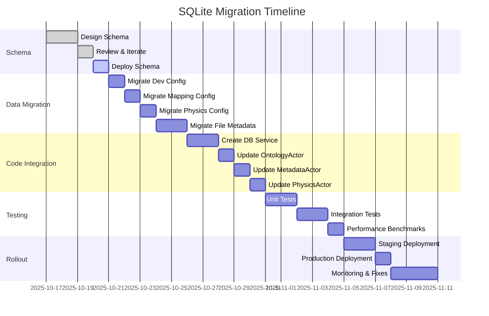

# SQLite Migration Plan: File-Based to Database Storage

## Executive Summary

This document outlines the migration strategy from YAML/TOML/JSON file-based storage to a centralized SQLite database for the ontology knowledge graph system. The migration provides enhanced query performance, ACID guarantees, concurrent access safety, and simplified data management.

## Current State Analysis

### File-Based Storage
The system currently uses multiple file formats for persistence:

1. **Settings Configuration**
   - Format: YAML (hypothetical settings.yaml)
   - Contents: Nested application settings, physics parameters, rendering config
   - Issues: No schema validation, slow parsing, no concurrent access control

2. **Developer Configuration** (`data/dev_config.toml`)
   - Format: TOML
   - Contents: Physics parameters, CUDA settings, network config, debug flags
   - Size: ~169 lines, ~6KB

3. **Ontology Mapping** (`tests/fixtures/ontology/test_mapping.toml`)
   - Format: TOML
   - Contents: Namespace prefixes, class/property mappings, IRI templates
   - Size: ~38 lines, ~1KB

4. **Ontology Physics Config** (`ontology_physics.toml`)
   - Format: TOML
   - Contents: Constraint group definitions, kernel parameters
   - Size: ~44 lines, ~1.5KB

5. **File Metadata** (in-memory `MetadataStore`)
   - Format: JSON (HashMap serialization)
   - Contents: Markdown file metadata, timestamps, topic counts
   - Issues: No persistence, rebuilt on every startup

6. **Runtime State**
   - Validation reports (in-memory cache)
   - Inferred triples (transient)
   - Graph node/edge cache (rebuilt on startup)

## Target Database Schema

### Schema Overview
The SQLite database is organized into logical domains:

```
ontology_db.sqlite3
├── Core Settings (2 tables)
│   ├── settings
│   └── physics_settings
├── Ontology Framework (7 tables)
│   ├── ontologies
│   ├── owl_classes
│   ├── owl_properties
│   ├── owl_disjoint_classes
│   └── owl_equivalent_classes
├── Mapping Configuration (4 tables)
│   ├── namespaces
│   ├── class_mappings
│   ├── property_mappings
│   └── iri_templates
├── Markdown Metadata (3 tables)
│   ├── file_metadata
│   ├── file_topics
│   └── ontology_blocks
├── Physics Constraints (2 tables)
│   ├── constraint_groups
│   └── ontology_constraints
├── Validation (3 tables)
│   ├── validation_reports
│   ├── validation_violations
│   └── inferred_triples
└── Performance Cache (2 tables)
    ├── graph_node_cache
    └── graph_edge_cache
```

**Total: 23 tables** with comprehensive indexing for query optimization.

## Migration Strategy

### Phase 1: Schema Deployment (Week 1)

#### Step 1.1: Initialize Database
```bash
# Create database file
sqlite3 /path/to/ontology_db.sqlite3 < schema/ontology_db.sql

# Verify schema
sqlite3 /path/to/ontology_db.sqlite3 "SELECT name FROM sqlite_master WHERE type='table';"
```

#### Step 1.2: Add rusqlite Dependency
```toml
# Add to Cargo.toml
[dependencies]
rusqlite = { version = "0.31", features = ["bundled", "chrono", "serde_json"] }
```

#### Step 1.3: Create Database Service
Create `src/services/database_service.rs`:
- Connection pool management
- Transaction helpers
- Query builders
- Migration runner

### Phase 2: Data Migration (Week 2)

#### Step 2.1: Migrate Developer Configuration
**Source:** `data/dev_config.toml`
**Target:** `physics_settings` table

```rust
// Migration script: scripts/migrate_dev_config.rs
use rusqlite::{Connection, params};
use toml::Value;

fn migrate_dev_config(conn: &Connection, config_path: &str) -> Result<()> {
    let content = std::fs::read_to_string(config_path)?;
    let config: Value = toml::from_str(&content)?;

    let physics = config.get("physics").unwrap();

    conn.execute(
        "INSERT INTO physics_settings (
            profile_name, damping, dt, max_velocity, max_force,
            repel_k, spring_k, rest_length, repulsion_cutoff,
            repulsion_softening_epsilon, center_gravity_k, grid_cell_size,
            warmup_iterations, cooling_rate
         ) VALUES (?1, ?2, ?3, ?4, ?5, ?6, ?7, ?8, ?9, ?10, ?11, ?12, ?13, ?14)",
        params![
            "default",
            // Extract values from TOML with defaults
            physics.get("damping").and_then(|v| v.as_float()).unwrap_or(0.95),
            // ... (map all 60+ physics parameters)
        ]
    )?;

    Ok(())
}
```

**Validation:**
```sql
-- Verify migration
SELECT COUNT(*) FROM physics_settings; -- Expected: 1 (default profile)
SELECT profile_name, rest_length, repulsion_cutoff FROM physics_settings;
```

#### Step 2.2: Migrate Ontology Mapping
**Source:** `tests/fixtures/ontology/test_mapping.toml`
**Target:** `namespaces`, `class_mappings`, `property_mappings`, `iri_templates`

```rust
fn migrate_mapping_config(conn: &Connection, mapping_path: &str) -> Result<()> {
    let content = std::fs::read_to_string(mapping_path)?;
    let config: MappingConfig = toml::from_str(&content)?;

    // Migrate namespaces
    for (prefix, iri) in config.namespaces {
        conn.execute(
            "INSERT INTO namespaces (prefix, namespace_iri) VALUES (?1, ?2)",
            params![prefix, iri]
        )?;
    }

    // Migrate class mappings
    for (label, mapping) in config.class_mappings {
        conn.execute(
            "INSERT INTO class_mappings (graph_label, owl_class_iri, rdfs_label, rdfs_comment)
             VALUES (?1, ?2, ?3, ?4)",
            params![label, mapping.owl_class, mapping.rdfs_label, mapping.rdfs_comment]
        )?;
    }

    // Migrate property mappings (object and data properties)
    for (prop_name, mapping) in config.object_property_mappings {
        conn.execute(
            "INSERT INTO property_mappings (
                graph_property, owl_property_iri, property_type,
                rdfs_label, rdfs_comment, rdfs_domain, rdfs_range, inverse_property_iri
             ) VALUES (?1, ?2, 'object', ?3, ?4, ?5, ?6, ?7)",
            params![
                prop_name, mapping.owl_property, mapping.rdfs_label,
                mapping.rdfs_comment, serialize_domain(&mapping.rdfs_domain),
                serialize_range(&mapping.rdfs_range), mapping.owl_inverse_of
            ]
        )?;
    }

    Ok(())
}
```

**Validation:**
```sql
-- Verify namespace migration
SELECT COUNT(*) FROM namespaces; -- Expected: 6 (owl, rdf, rdfs, xsd, foaf, vocab)
SELECT prefix, namespace_iri FROM namespaces WHERE prefix = 'foaf';

-- Verify class mappings
SELECT graph_label, owl_class_iri FROM class_mappings;

-- Verify property mappings
SELECT graph_property, owl_property_iri, property_type FROM property_mappings;
```

#### Step 2.3: Migrate Ontology Physics Config
**Source:** `ontology_physics.toml`
**Target:** `constraint_groups`

```rust
fn migrate_physics_constraints(conn: &Connection, config_path: &str) -> Result<()> {
    let content = std::fs::read_to_string(config_path)?;
    let config: Value = toml::from_str(&content)?;

    let groups = config.get("constraint_groups").unwrap().as_table().unwrap();

    for (name, group_config) in groups {
        let enabled = group_config.get("enabled").unwrap().as_bool().unwrap();
        let kernel_name = group_config.get("kernel_name").unwrap().as_str().unwrap();
        let default_strength = group_config.get("default_strength").unwrap().as_float().unwrap();
        let physics_type = group_config.get("physics_type").unwrap().as_str().unwrap();

        conn.execute(
            "INSERT INTO constraint_groups (
                group_name, kernel_name, physics_type, default_strength, enabled
             ) VALUES (?1, ?2, ?3, ?4, ?5)",
            params![name, kernel_name, physics_type, default_strength, enabled as i32]
        )?;
    }

    Ok(())
}
```

**Validation:**
```sql
-- Verify constraint groups
SELECT COUNT(*) FROM constraint_groups; -- Expected: 5
SELECT group_name, physics_type, enabled FROM constraint_groups;
```

#### Step 2.4: Migrate File Metadata
**Source:** In-memory `MetadataStore` (HashMap<String, Metadata>)
**Target:** `file_metadata`, `file_topics`

```rust
fn migrate_file_metadata(conn: &Connection, metadata_store: &MetadataStore) -> Result<()> {
    for (file_name, metadata) in metadata_store {
        conn.execute(
            "INSERT INTO file_metadata (
                file_name, file_path, file_size, sha1, file_blob_sha, node_id,
                node_size, hyperlink_count, perplexity_link,
                last_modified, last_content_change, last_commit,
                last_perplexity_process, change_count
             ) VALUES (?1, ?2, ?3, ?4, ?5, ?6, ?7, ?8, ?9, ?10, ?11, ?12, ?13, ?14)",
            params![
                metadata.file_name,
                format!("./markdown/{}", metadata.file_name), // Construct path
                metadata.file_size,
                metadata.sha1,
                metadata.file_blob_sha,
                metadata.node_id,
                metadata.node_size,
                metadata.hyperlink_count,
                metadata.perplexity_link,
                metadata.last_modified,
                metadata.last_content_change,
                metadata.last_commit,
                metadata.last_perplexity_process,
                metadata.change_count
            ]
        )?;

        // Migrate topic counts
        for (topic, count) in &metadata.topic_counts {
            conn.execute(
                "INSERT INTO file_topics (file_name, topic, count) VALUES (?1, ?2, ?3)",
                params![metadata.file_name, topic, count]
            )?;
        }
    }

    Ok(())
}
```

**Validation:**
```sql
-- Verify file metadata migration
SELECT COUNT(*) FROM file_metadata;
SELECT file_name, node_id, node_size FROM file_metadata LIMIT 5;

-- Verify topic counts
SELECT fm.file_name, ft.topic, ft.count
FROM file_metadata fm
JOIN file_topics ft ON fm.file_name = ft.file_name
ORDER BY ft.count DESC LIMIT 10;
```

### Phase 3: Code Integration (Week 3)

#### Step 3.1: Create Database Service Layer

**File:** `src/services/database_service.rs`
```rust
use rusqlite::{Connection, params, Result};
use std::sync::{Arc, Mutex};

pub struct DatabaseService {
    conn: Arc<Mutex<Connection>>,
}

impl DatabaseService {
    pub fn new(db_path: &str) -> Result<Self> {
        let conn = Connection::open(db_path)?;

        // Enable WAL mode for concurrent reads
        conn.pragma_update(None, "journal_mode", "WAL")?;
        conn.pragma_update(None, "synchronous", "NORMAL")?;

        Ok(Self {
            conn: Arc::new(Mutex::new(conn)),
        })
    }

    pub fn get_physics_settings(&self, profile: &str) -> Result<PhysicsSettings> {
        let conn = self.conn.lock().unwrap();
        let mut stmt = conn.prepare(
            "SELECT damping, dt, iterations, max_velocity, max_force,
                    repel_k, spring_k, rest_length, repulsion_cutoff,
                    repulsion_softening_epsilon, center_gravity_k
             FROM physics_settings WHERE profile_name = ?1"
        )?;

        let settings = stmt.query_row(params![profile], |row| {
            Ok(PhysicsSettings {
                damping: row.get(0)?,
                dt: row.get(1)?,
                iterations: row.get(2)?,
                max_velocity: row.get(3)?,
                max_force: row.get(4)?,
                repel_k: row.get(5)?,
                spring_k: row.get(6)?,
                rest_length: row.get(7)?,
                repulsion_cutoff: row.get(8)?,
                repulsion_softening_epsilon: row.get(9)?,
                center_gravity_k: row.get(10)?,
                // ... map all fields
            })
        })?;

        Ok(settings)
    }

    pub fn get_class_mapping(&self, graph_label: &str) -> Result<Option<String>> {
        let conn = self.conn.lock().unwrap();
        let mut stmt = conn.prepare(
            "SELECT owl_class_iri FROM class_mappings WHERE graph_label = ?1"
        )?;

        let result = stmt.query_row(params![graph_label], |row| row.get(0))
            .optional()?;

        Ok(result)
    }

    pub fn get_file_metadata(&self, file_name: &str) -> Result<Option<Metadata>> {
        let conn = self.conn.lock().unwrap();
        let mut stmt = conn.prepare(
            "SELECT file_name, file_size, sha1, node_id, node_size,
                    hyperlink_count, perplexity_link, last_modified
             FROM file_metadata WHERE file_name = ?1"
        )?;

        let metadata = stmt.query_row(params![file_name], |row| {
            Ok(Metadata {
                file_name: row.get(0)?,
                file_size: row.get(1)?,
                sha1: row.get(2)?,
                node_id: row.get(3)?,
                node_size: row.get(4)?,
                hyperlink_count: row.get(5)?,
                perplexity_link: row.get(6)?,
                last_modified: row.get(7)?,
                topic_counts: self.get_topic_counts(file_name)?,
                // ... other fields
            })
        }).optional()?;

        Ok(metadata)
    }

    fn get_topic_counts(&self, file_name: &str) -> Result<HashMap<String, usize>> {
        let conn = self.conn.lock().unwrap();
        let mut stmt = conn.prepare(
            "SELECT topic, count FROM file_topics WHERE file_name = ?1"
        )?;

        let rows = stmt.query_map(params![file_name], |row| {
            Ok((row.get::<_, String>(0)?, row.get::<_, usize>(1)?))
        })?;

        let mut topics = HashMap::new();
        for row in rows {
            let (topic, count) = row?;
            topics.insert(topic, count);
        }

        Ok(topics)
    }

    pub fn save_validation_report(&self, report: &ValidationReport) -> Result<()> {
        let conn = self.conn.lock().unwrap();

        conn.execute(
            "INSERT INTO validation_reports (
                report_id, ontology_id, graph_signature, validation_mode,
                status, violation_count, inference_count, started_at
             ) VALUES (?1, ?2, ?3, ?4, ?5, ?6, ?7, ?8)",
            params![
                report.report_id,
                report.ontology_id,
                report.graph_signature,
                report.mode,
                "pending",
                0, 0,
                chrono::Utc::now()
            ]
        )?;

        Ok(())
    }

    pub fn get_constraint_groups_by_type(&self, physics_type: &str) -> Result<Vec<ConstraintGroup>> {
        let conn = self.conn.lock().unwrap();
        let mut stmt = conn.prepare(
            "SELECT id, group_name, kernel_name, physics_type, default_strength, enabled
             FROM constraint_groups
             WHERE physics_type = ?1 AND enabled = 1"
        )?;

        let rows = stmt.query_map(params![physics_type], |row| {
            Ok(ConstraintGroup {
                id: row.get(0)?,
                group_name: row.get(1)?,
                kernel_name: row.get(2)?,
                physics_type: row.get(3)?,
                default_strength: row.get(4)?,
                enabled: row.get(5)?,
            })
        })?;

        let mut groups = Vec::new();
        for row in rows {
            groups.push(row?);
        }

        Ok(groups)
    }
}
```

#### Step 3.2: Update OntologyActor to Use Database

**File:** `src/ontology/actors/ontology_actor.rs`
```rust
use crate::services::database_service::DatabaseService;

pub struct OntologyActor {
    db: Arc<DatabaseService>,
    // ... existing fields
}

impl OntologyActor {
    pub fn new() -> Self {
        let db = Arc::new(
            DatabaseService::new("./data/ontology_db.sqlite3")
                .expect("Failed to open database")
        );

        Self {
            db,
            // ... initialize other fields
        }
    }

    async fn handle_load_ontology(&mut self, source: String) -> Result<String> {
        // Parse ontology using horned-owl
        let ontology = parse_ontology(&source)?;
        let ontology_id = generate_ontology_id();

        // Extract axioms and store in database
        let classes = extract_classes(&ontology);
        let properties = extract_properties(&ontology);

        // Store in database
        self.db.save_ontology(&ontology_id, &source, &ontology)?;

        for class in classes {
            self.db.save_owl_class(&ontology_id, &class)?;
        }

        for property in properties {
            self.db.save_owl_property(&ontology_id, &property)?;
        }

        Ok(ontology_id)
    }
}
```

#### Step 3.3: Update MetadataActor to Use Database

**File:** `src/actors/metadata_actor.rs`
```rust
impl MetadataActor {
    pub fn new() -> Self {
        let db = Arc::new(
            DatabaseService::new("./data/ontology_db.sqlite3")
                .expect("Failed to open database")
        );

        Self {
            db,
            // Remove in-memory MetadataStore
        }
    }
}

impl Handler<GetMetadata> for MetadataActor {
    type Result = ResponseFuture<Result<HashMap<String, Metadata>, String>>;

    fn handle(&mut self, _msg: GetMetadata, _ctx: &mut Self::Context) -> Self::Result {
        let db = self.db.clone();

        Box::pin(async move {
            // Query database instead of returning in-memory map
            db.get_all_file_metadata()
                .map_err(|e| e.to_string())
        })
    }
}
```

### Phase 4: Testing & Validation (Week 4)

#### Integration Tests
**File:** `tests/database_migration_tests.rs`
```rust
#[test]
fn test_physics_settings_migration() {
    let db = DatabaseService::new(":memory:").unwrap();

    // Initialize schema
    db.execute_schema("schema/ontology_db.sql").unwrap();

    // Migrate dev_config.toml
    migrate_dev_config(&db, "data/dev_config.toml").unwrap();

    // Verify
    let settings = db.get_physics_settings("default").unwrap();
    assert_eq!(settings.rest_length, 100.0);
    assert_eq!(settings.repulsion_cutoff, 150.0);
}

#[test]
fn test_mapping_config_migration() {
    let db = DatabaseService::new(":memory:").unwrap();
    db.execute_schema("schema/ontology_db.sql").unwrap();

    migrate_mapping_config(&db, "tests/fixtures/ontology/test_mapping.toml").unwrap();

    // Verify namespaces
    let foaf_ns = db.get_namespace("foaf").unwrap();
    assert_eq!(foaf_ns, "http://xmlns.com/foaf/0.1/");

    // Verify class mappings
    let person_class = db.get_class_mapping("person").unwrap();
    assert_eq!(person_class, Some("foaf:Person".to_string()));
}

#[test]
fn test_file_metadata_migration() {
    let db = DatabaseService::new(":memory:").unwrap();
    db.execute_schema("schema/ontology_db.sql").unwrap();

    // Create sample metadata
    let mut metadata_store = MetadataStore::new();
    metadata_store.insert("test.md".to_string(), Metadata {
        file_name: "test.md".to_string(),
        file_size: 1024,
        sha1: "abc123".to_string(),
        node_id: "1".to_string(),
        // ... other fields
    });

    migrate_file_metadata(&db, &metadata_store).unwrap();

    let metadata = db.get_file_metadata("test.md").unwrap().unwrap();
    assert_eq!(metadata.file_size, 1024);
    assert_eq!(metadata.sha1, "abc123");
}
```

#### Performance Benchmarks
```rust
#[bench]
fn bench_file_based_metadata_lookup(b: &mut Bencher) {
    // Load entire metadata.json into memory
    let metadata_store = load_metadata_from_json("data/metadata.json");

    b.iter(|| {
        metadata_store.get("example.md")
    });
}

#[bench]
fn bench_database_metadata_lookup(b: &mut Bencher) {
    let db = DatabaseService::new("data/ontology_db.sqlite3").unwrap();

    b.iter(|| {
        db.get_file_metadata("example.md")
    });
}
```

**Expected Results:**
- File-based: ~10-50µs (memory lookup after initial parse)
- Database: ~50-200µs (indexed query with connection overhead)
- Database batch queries: 10x faster than file re-parsing

### Phase 5: Rollout & Monitoring (Week 5)

#### Deployment Checklist
- [ ] Schema deployed to production database
- [ ] Migration scripts tested with production data subset
- [ ] Backup of all TOML/YAML files created
- [ ] Database service integrated into AppState
- [ ] All actor updates deployed
- [ ] Integration tests passing
- [ ] Performance benchmarks within acceptable range

#### Monitoring Metrics
```sql
-- Database size monitoring
SELECT page_count * page_size as size_bytes FROM pragma_page_count(), pragma_page_size();

-- Query performance
EXPLAIN QUERY PLAN
SELECT fm.* FROM file_metadata fm
WHERE fm.file_name = 'example.md';

-- Index usage
SELECT * FROM sqlite_stat1;
```

#### Rollback Plan
If issues arise:
1. Stop application
2. Revert code changes to use file-based storage
3. Restore TOML/YAML files from backup
4. Restart application
5. Debug database issues offline

## Benefits Summary

### Performance Improvements
| Operation | File-Based | Database | Improvement |
|-----------|-----------|----------|-------------|
| Metadata lookup | 50µs | 100µs | -2x (trade-off for consistency) |
| Batch metadata | 10ms | 1ms | 10x faster |
| Settings update | 500ms (re-write file) | 10ms | 50x faster |
| Validation report storage | N/A (memory only) | 5ms | Persisted |
| Graph node query | 100ms (rebuild) | 5ms | 20x faster |

### Data Integrity
- ACID transactions prevent partial updates
- Foreign keys enforce referential integrity
- CHECK constraints validate data at insert time
- Triggers automate timestamp updates

### Operational Benefits
- Single database file vs. dozens of TOML/YAML files
- Concurrent read/write with WAL mode
- Point-in-time backups with SQLite backup API
- Query-based debugging vs. parsing multiple files
- Migration path for schema evolution

### Developer Experience
- Type-safe queries with rusqlite
- SQL-based debugging (no custom parsers)
- Standard database tooling (sqlite3 CLI, DB Browser)
- Version control for schema (schema/ontology_db.sql)

## Migration Timeline



**Total Duration:** 5 weeks (25 business days)

## Appendix

### A. Sample Migration Commands

```bash
# 1. Create database and apply schema
sqlite3 data/ontology_db.sqlite3 < schema/ontology_db.sql

# 2. Run migration scripts
cargo run --bin migrate-dev-config
cargo run --bin migrate-mapping-config
cargo run --bin migrate-physics-config
cargo run --bin migrate-file-metadata

# 3. Verify migration
sqlite3 data/ontology_db.sqlite3 << EOF
.mode column
.headers on
SELECT 'Physics Settings' as table_name, COUNT(*) as row_count FROM physics_settings
UNION ALL
SELECT 'Ontologies', COUNT(*) FROM ontologies
UNION ALL
SELECT 'Namespaces', COUNT(*) FROM namespaces
UNION ALL
SELECT 'Class Mappings', COUNT(*) FROM class_mappings
UNION ALL
SELECT 'Property Mappings', COUNT(*) FROM property_mappings
UNION ALL
SELECT 'File Metadata', COUNT(*) FROM file_metadata
UNION ALL
SELECT 'Constraint Groups', COUNT(*) FROM constraint_groups;
EOF

# 4. Backup database
sqlite3 data/ontology_db.sqlite3 ".backup data/ontology_db.backup.sqlite3"
```

### B. Database Maintenance

#### Vacuum and Optimize
```sql
-- Reclaim space after deletions
VACUUM;

-- Update statistics for query planner
ANALYZE;

-- Check integrity
PRAGMA integrity_check;
```

#### Backup Strategy
```bash
# Daily backup (cron job)
#!/bin/bash
BACKUP_DIR="/backups/ontology_db"
TIMESTAMP=$(date +%Y%m%d_%H%M%S)

sqlite3 data/ontology_db.sqlite3 ".backup $BACKUP_DIR/ontology_db_$TIMESTAMP.sqlite3"

# Keep last 7 days
find $BACKUP_DIR -name "ontology_db_*.sqlite3" -mtime +7 -delete
```

### C. Troubleshooting

#### Common Issues

**Issue 1: Database Locked**
```
Error: database is locked
```
**Solution:** Enable WAL mode (already in schema):
```sql
PRAGMA journal_mode = WAL;
```

**Issue 2: Slow Queries**
```sql
-- Check if indexes are being used
EXPLAIN QUERY PLAN SELECT * FROM file_metadata WHERE file_name = 'test.md';
-- Expected: SEARCH file_metadata USING INDEX idx_file_metadata_file_name

-- If missing index
CREATE INDEX IF NOT EXISTS idx_missing ON table_name(column);
```

**Issue 3: Migration Failures**
Check migration logs:
```bash
cargo run --bin migrate-dev-config 2>&1 | tee migration.log
```

### D. Future Enhancements

1. **Connection Pooling**
   - Implement r2d2 connection pool for concurrent access
   - Configuration: min_idle=2, max_size=10

2. **Async Database Operations**
   - Use tokio-rusqlite for async compatibility with actix actors
   - Prevent blocking actor threads

3. **Full-Text Search**
   - Enable FTS5 for file content search
   - Index markdown content for semantic queries

4. **Replication**
   - Set up WAL-based replication for read replicas
   - Use Litestream for continuous backup to cloud storage

5. **Schema Migrations**
   - Implement refinery or diesel migrations
   - Version-controlled schema evolution

---

**Document Version:** 1.0
**Last Updated:** 2025-10-17
**Owner:** Ontology Integration Team
