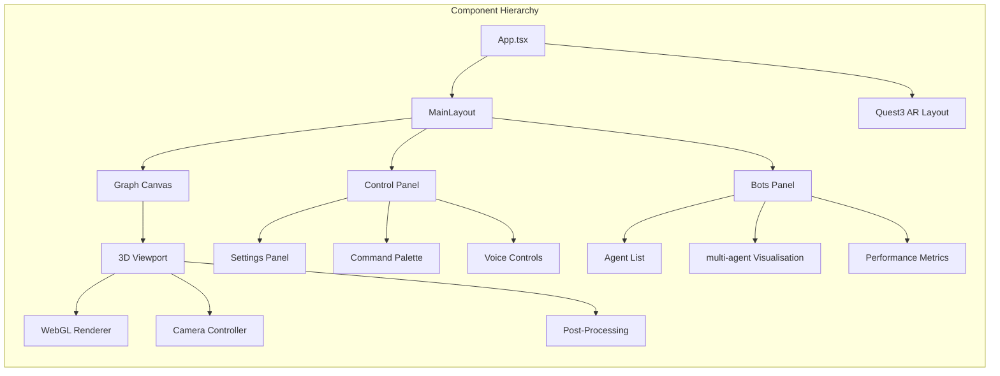
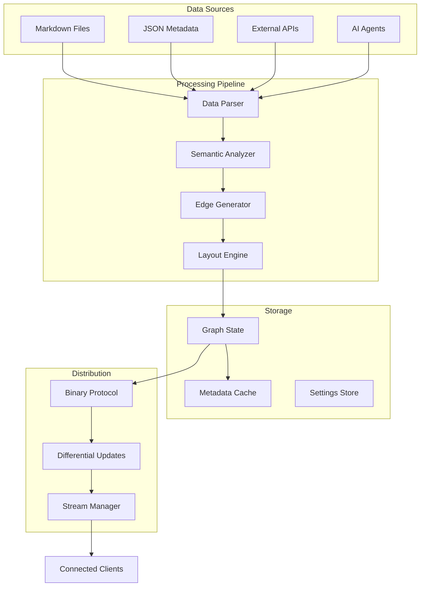
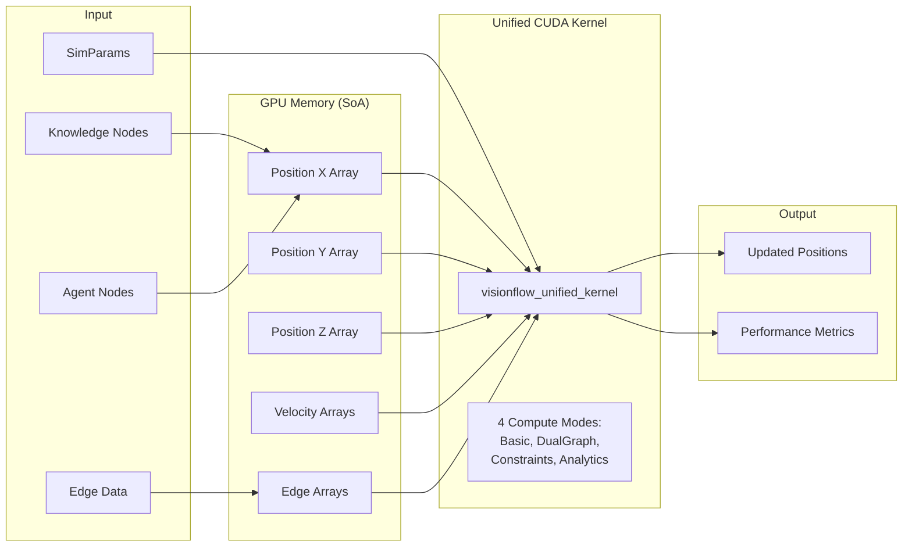
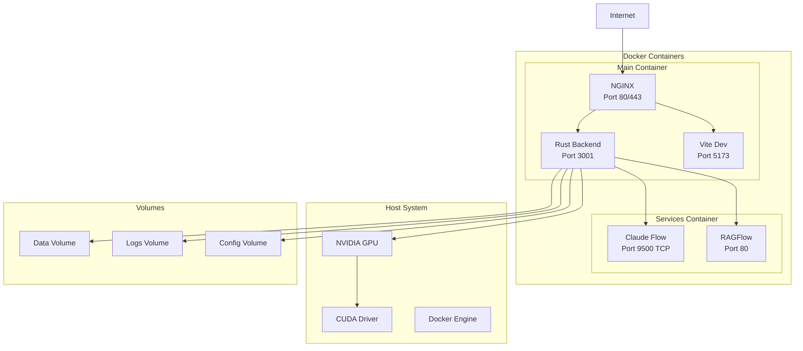
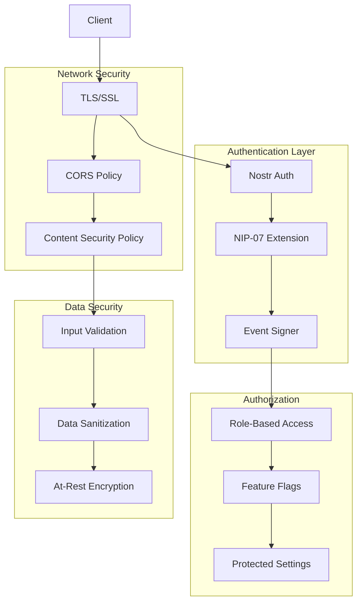

# VisionFlow System Architecture

*[Architecture](../index.md)*

## Overview

VisionFlow (formerly LogseqXR) is built on a unified, actor-based architecture that enables real-time 3D visualisation of parallel knowledge graphs and AI Multi Agents. The system combines a robust and scalable Rust-based backend server with a modern React/TypeScript frontend client, leveraging unified CUDA GPU acceleration and WebXR for immersive experiences. Key features include the unified GPU compute kernel, parallel graph coordination, and bidirectional synchronisation of graph state between all connected clients.

## Core Architecture Diagrams

### Detailed System Components

The following diagram illustrates the core components of the VisionFlow system and their interactions:

```mermaid
graph TD
    subgraph ClientApp ["Frontend"]
        AppInitializer["AppInitializer.tsx"] --> UIMain["TwoPaneLayout.tsx"]
        UIMain --> GraphViewport["GraphViewport.tsx"]
        UIMain --> RightPane["RightPaneControlPanel.tsx"]
        UIMain --> ConversationPane["ConversationPane.tsx"]
        UIMain --> NarrativeGoldmine["NarrativeGoldminePanel.tsx"]
        RightPane --> SettingsPanel["SettingsPanelRedesignOptimized.tsx"]

        SettingsPanel --> SettingsStore["settingsStore.ts"]
        GraphViewport --> RenderingEngine["GraphCanvas_and_GraphManager"]

        DataManager["GraphDataManager.ts"] < --> RenderingEngine
        DataManager < --> WebSocketClient["WebSocketService.ts"]
        DataManager < --> APIService["services/apiService.ts"]

        NostrAuthClient["nostrAuthService.ts"] < --> APIService
        NostrAuthClient < --> UIMain

        XRModule["XRController.tsx"] < --> RenderingEngine
        XRModule < --> SettingsStore
    end

    subgraph ServerApp ["Backend"]
        ActixServer["Actix Web Server"]

        subgraph Handlers ["API_WebSocket_Handlers"]
            direction LR
            SettingsHandler["settings_handler.rs"]
            NostrAuthHandler["nostr_handler.rs"]
            GraphAPIHandler["api_handler_graph_mod_rs"]
            FilesAPIHandler["api_handler_files_mod_rs"]
            RAGFlowAPIHandler["ragflow_handler.rs"]
            SocketFlowHandler["socket_flow_handler.rs"]
            SpeechSocketHandler["speech_socket_handler.rs"]
            HealthHandler["health_handler.rs"]
        end

        subgraph Services ["Core_Services"]
            direction LR
            GraphService["GraphService"]
            FileService["FileService"]
            NostrService["NostrService"]
            SpeechService["SpeechService"]
            RAGFlowService["RAGFlowService"]
            PerplexityService["PerplexityService"]
        end

        subgraph Actors ["Actor_System"]
            direction LR
            GraphServiceActor["GraphServiceActor"]
            SettingsActor["SettingsActor"]
            MetadataActor["MetadataActor"]
            ClientManagerActor["ClientManagerActor"]
            GPUComputeActor["GPUComputeActor"]
            ProtectedSettingsActor["ProtectedSettingsActor"]
            OntologyActor["OntologyActor"]
        end
        AppState["AppState"]

        ActixServer --> SettingsHandler
        ActixServer --> NostrAuthHandler
        ActixServer --> GraphAPIHandler
        ActixServer --> FilesAPIHandler
        ActixServer --> RAGFlowAPIHandler
        ActixServer --> SocketFlowHandler
        ActixServer --> SpeechSocketHandler
        ActixServer --> HealthHandler

        SettingsHandler --> SettingsActor
        NostrAuthHandler --> NostrService
        NostrAuthHandler --> ProtectedSettingsActor
        GraphAPIHandler --> GraphServiceActor
        FilesAPIHandler --> FileService
        RAGFlowAPIHandler --> RAGFlowService

        SocketFlowHandler --> ClientManagerActor
        SpeechSocketHandler --> SpeechService

        GraphServiceActor --> ClientManagerActor
        GraphServiceActor --> MetadataActor
        GraphServiceActor --> GPUComputeActor
        GraphServiceActor --> SettingsActor

        FileService --> MetadataActor

        NostrService --> ProtectedSettingsActor
        SpeechService --> SettingsActor
        RAGFlowService --> SettingsActor
        PerplexityService --> SettingsActor

        Handlers --> AppState
    end

    subgraph ExternalServices ["External_Services"]
        GitHubAPI["GitHub API"]
        NostrRelays["Nostr Relays"]
        OpenAI_API["OpenAI API"]
        PerplexityAI_API["Perplexity AI API"]
        RAGFlow_API["RAGFlow API"]
        KokoroAPI["Kokoro API"]
    end

    WebSocketClient < --> SocketFlowHandler
    APIService < --> ActixServer

    FileService --> GitHubAPI
    NostrService --> NostrRelays
    SpeechService --> OpenAI_API
    SpeechService --> KokoroAPI
    PerplexityService --> PerplexityAI_API
    RAGFlowService --> RAGFlow_API
```

### High-Level Architecture Overview

```mermaid
graph TB
    subgraph "Frontend Layer"
        subgraph "React Application"
            UI[UI Components]
            Store[State Management]
            Three[Three.js Renderer]
            XR[WebXR Manager]
        end

        subgraph "WebSocket Clients"
            WSFlow[Socket Flow Client]
            WSSpeech[Speech Client]
            WSMCP[MCP Relay Client]
            WSBots[Bots Viz Client]
        end
    end

    subgraph "Backend Layer"
        subgraph "HTTP Server"
            REST[REST API<br/>Actix-Web]
            Static[Static Files]
            Auth[Auth Handler]
        end

        subgraph "WebSocket Server"
            WSHandler[WS Handler]
            Binary[Binary Protocol]
            Stream[Stream Manager]
        end

        subgraph "Actor System"
            CFActor[ClaudeFlowActorTcp<br/>Direct TCP MCP Port 9500]
            GraphActor[Graph Service Actor<br/>Parallel Graphs]
            GPUActor[GPU Compute Actor<br/>Unified Kernel]
            ClientMgr[Client Manager Actor]
            SettingsActor[Settings Actor]
            MetaActor[Metadata Actor]
            ProtectedActor[Protected Settings]
            OntologyActor[OntologyActor]
        end

        subgraph "Services Layer"
            MCPRelay[MCP Relay Manager]
            GitHubSvc[GitHub Service]
            NostrSvc[Nostr Service]
            SpeechSvc[Speech Service]
            BotsClient[Bots Client]
            AgentViz[Agent Viz Processor]
            SemanticAnalyzer[SemanticAnalyzer]
            AdvancedEdgeGenerator[AdvancedEdgeGenerator]
        end
    end

    subgraph "GPU Layer"
        UnifiedKernel[Unified CUDA Kernel<br/>visionflow_unified.cu]
        Physics[Unified Physics Engine]
        ParallelGraphs[Parallel Graph Processing]
        Analytics[Visual Analytics Mode]
    end

    subgraph "External Services"
        ClaudeFlow[Claude Flow<br/>Port 9500 TCP]
        GitHub[GitHub API]
        RAGFlow[RAGFlow Service]
        Perplexity[Perplexity API]
        Nostr[Nostr Network]
    end

    UI --> Store
    Store --> Three
    Three --> XR
    UI --> WSFlow
    UI --> WSSpeech
    UI --> WSMCP
    UI --> WSBots

    WSFlow --> WSHandler
    WSSpeech --> WSHandler
    WSMCP --> WSHandler
    WSBots --> WSHandler

    WSHandler --> Binary
    Binary --> Stream
    Stream --> ClientMgr

    REST --> Auth
    Auth --> NostrSvc
    REST --> GraphActor
    REST --> SettingsActor
    REST --> BotsClient

    ClientMgr --> GraphActor
    GraphActor --> GPUActor
    GraphActor --> SemanticAnalyzer
    SemanticAnalyzer --> AdvancedEdgeGenerator
    GraphActor --> OntologyActor
    GPUActor --> UnifiedKernel
    UnifiedKernel --> Physics
    UnifiedKernel --> ParallelGraphs
    UnifiedKernel --> Analytics

    CFActor --> MCPRelay
    MCPRelay --> ClaudeFlow
    GraphActor --> GitHubSvc
    GitHubSvc --> GitHub
    NostrSvc --> Nostr

    BotsClient --> AgentViz
    AgentViz --> GraphActor
```



## Component Breakdown

### Frontend Components (Client - TypeScript, React, R3F)

-   **AppInitializer ([`AppInitializer.tsx`](../../client/src/app/AppInitializer.tsx))**: Initializes core services, settings, and authentication.
-   **UI Layout ([`TwoPaneLayout.tsx`](../../client/src/app/TwoPaneLayout.tsx), [`RightPaneControlPanel.tsx`](../../client/src/app/components/RightPaneControlPanel.tsx))**: Manages the main application layout.
-   **Settings UI ([`SettingsPanelRedesign.tsx`](../../client/src/features/settings/components/panels/SettingsPanelRedesign.tsx))**: Provides the interface for user settings.
-   **Conversation UI ([`ConversationPane.tsx`](../../client/src/app/components/ConversationPane.tsx))**: Interface for AI chat.
-   **Narrative UI ([`NarrativeGoldminePanel.tsx`](../../client/src/app/components/NarrativeGoldminePanel.tsx))**: Interface for narrative exploration.
-   **Rendering Engine ([`GraphCanvas.tsx`](../../client/src/features/graph/components/GraphCanvas.tsx), [`GraphManager.tsx`](../../client/src/features/graph/components/GraphManager.tsx), [`GraphViewport.tsx`](../../client/src/features/graph/components/GraphViewport.tsx))**: Handles 3D graph visualisation using React Three Fibre.
-   **State Management**:
    -   [`settingsStore.ts`](../../client/src/store/settingsStore.ts) (Zustand): Manages application settings.
    -   [`GraphDataManager.ts`](../../client/src/features/graph/managers/graphDataManager.ts): Manages graph data, updates, and interaction with WebSocketService.
-   **Communication**:
    -   [`WebSocketService.ts`](../../client/src/services/WebSocketService.ts): Handles real-time communication with the backend via WebSockets.
    -   [`apiService.ts`](../../client/src/services/apiService.ts): Handles REST API calls to the backend.
-   **Authentication ([`nostrAuthService.ts`](../../client/src/services/nostrAuthService.ts))**: Manages Nostr-based client-side authentication logic. (Often referred to as NostrAuthClient in diagrams).
-   **XR Module ([`XRController.tsx`](../../client/src/features/xr/components/XRController.tsx) and other components in `client/src/features/xr/`)**: Manages WebXR integration for VR/AR experiences.

### Backend Components (Server - Rust, Actix)

-   **Actix Web Server**: The core HTTP server framework.
-   **Request Handlers**:
    -   [`SocketFlowHandler`](../../src/handlers/socket_flow_handler.rs): Manages WebSocket connections for graph updates.
    -   [`SpeechSocketHandler`](../../src/handlers/speech_socket_handler.rs): Manages WebSocket connections for speech services.
    -   [`NostrAuthHandler`](../../src/handlers/nostr_handler.rs): Handles Nostr authentication requests.
    -   [`SettingsHandler`](../../src/handlers/settings_handler.rs): Manages API requests for user settings.
    -   [`GraphAPIHandler`](../../src/handlers/api_handler/graph/mod.rs): Handles API requests for graph data.
    -   [`FilesAPIHandler`](../../src/handlers/api_handler/files/mod.rs): Handles API requests for file operations.
    -   [`RAGFlowAPIHandler`](../../src/handlers/ragflow_handler.rs): Handles API requests for RAGFlow.
    -   [`HealthHandler`](../../src/handlers/health_handler.rs): Provides health check endpoints.
-   **Core Services**:
    -   [`GraphService`](../../src/services/graph_service.rs): Manages graph data, physics simulation (CPU/GPU), and broadcasts updates. Contains the **PhysicsEngine** logic.
    -   [`FileService`](../../src/services/file_service.rs): Handles file fetching (local, GitHub), processing, and metadata management.
    -   [`NostrService`](../../src/services/nostr_service.rs): Manages Nostr authentication logic, user profiles, and session tokens.
    -   [`SpeechService`](../../src/services/speech_service.rs): Orchestrates STT and TTS functionalities, interacting with external AI providers.
    -   [`RAGFlowService`](../../src/services/ragflow_service.rs): Interacts with the RAGFlow API.
    -   [`PerplexityService`](../../src/services/perplexity_service.rs): Interacts with the Perplexity AI API.
-   **Shared State & Utilities**:
    -   [`AppState`](../../src/app_state.rs): Manages application state through actor addresses and provides access to services via the actor system.
    -   [`ProtectedSettings`](../../src/models/protected_settings.rs): Manages sensitive configurations like API keys and user data, stored separately.
    -   [`MetadataStore`](../../src/models/metadata.rs): In-memory store for file/node metadata, managed by `FileService` and read by `GraphService`.
    -   [`ClientManager`](../../src/handlers/socket_flow_handler.rs): (Often part of `socket_flow_handler` or a static utility) Manages active WebSocket clients for broadcasting.
    -   [`GPUCompute`](../../src/utils/gpu_compute.rs): Optional utility for CUDA-accelerated physics calculations.
    -   **`OntologyActor`**: Manages OWL/RDF validation and reasoning.
    -   **`SemanticAnalyzer`**: Extracts semantic features from graph data.
    -   **`AdvancedEdgeGenerator`**: Generates new edges based on semantic similarity.

### External Services

- **GitHub API**: Provides access to the GitHub API for fetching and updating files.
- **Perplexity AI**: Provides AI-powered question answering and content analysis.
- **RagFlow API**: Provides AI-powered conversational capabilities.
- **OpenAI API**: Provides text-to-speech functionality.
- **Nostr API**: Provides decentralised authentication and user management.

## Component Architecture

### Frontend Components



### Actor Communication Flow

``sequenceDiagram
    participant Client
    participant WebSocket
    participant ClientManager
    participant GraphActor
    participant GPUActor
    participant CUDA

    Client->>WebSocket: Connect
    WebSocket->>ClientManager: Register Client
    ClientManager->>Client: Send Initial State

    Client->>WebSocket: Update Request
    WebSocket->>ClientManager: Forward Message
    ClientManager->>GraphActor: Process Update
    GraphActor->>GPUActor: Compute Physics
    GPUActor->>CUDA: Execute Kernel
    CUDA --> >GPUActor: Return Results
    GPUActor --> >GraphActor: Physics Results
    GraphActor --> >ClientManager: Graph Update
    ClientManager --> >Client: Binary Update Streamte Stream
```

## Data Flow Architecture



## GPU Processing Pipeline



## MCP Integration Architecgraph TB
    subgraph "VisionFlow Backend"
        CFActor[Claude Flow Actor]
        MCPRelay[MCP Relay Manager]
        WSRelay[WebSocket Relay]
    end

    subgraph "Claude Flow Service"
        MCPServer[MCP Server<br/>Port 9500 TCP]
        Tools[54+ MCP Tools]
        SwarmMgr[Swarm Manager]
        Neural[Neural Networks]
        Memory[Memory Service]
    end

    subgraph "Agent Types"
        Coord[Coordinator]
        Research[Researcher]
        Coder[Coder]
        Analyst[Analyst]
        Architect[Architect]
        Others[15+ Types]
    end

    CFActor < --> MCPRelay
    MCPRelay < --> WSRelay
    WSRelay < --> MCPServer

    MCPServer --> Tools
    MCPServer --> SwarmMgr
    MCPServer --> Neural
    MCPServer --> Memory

    SwarmMgr --> Coord
    SwarmMgr --> Research
    SwarmMgr --> Coder
    SwarmMgr --> Analyst
    SwarmMgr --> Architect
    SwarmMgr --> OthersarmMgr --> Others
```

## Deployment Architecture



## Security Architecture



## Performance Optimisation

### Caching Strategy
- **Metadata Cache**: In-memory caching of graph metadata
- **Settings Cache**: Client-side settings persistence
- **GPU Buffer Cache**: Reusable CUDA memory allocations
- **WebSocket Message Cache**: Differential update tracking

### Scalability Features
- **Actor Supervision**: Automatic actor restart on failure
- **Connection Pooling**: Efficient database connections with exponential backoff
- **Circuit Breakers**: Connection resilience patterns for MCP integration
- **Load Balancing**: NGINX reverse proxy distribution
- **Horizontal Scaling**: Stateless backend design

### Connection Resilience
- **Exponential Backoff**: 1s to 30s max reconnection delays
- **Heartbeat Monitoring**: 30-second ping/pong cycles with timeout detection
- **Message Queuing**: Persistent queues with retry logic during disconnections
- **Fresh TCP Connections**: MCP compatibility through connection pooling

### Performance Metrics
| Component | Target | Actual |
|-----------|--------|--------|
| REST API Latency | <100ms | 50ms |
| WebSocket Latency | <10ms | 5ms |
| Unified GPU Kernel | <16ms | 8ms |
| Parallel Graphs FPS | 60 FPS | 60 FPS |
| Memory Usage | <4GB | 2.2GB |
| Agent Update Rate | 10Hz | 10Hz |
| **Binary Protocol Efficiency** | **N/A** | **84.8% bandwidth reduction** |
| **Wire Format Size** | **N/A** | **34 bytes per node** |
| **Real-time Update Rate** | **N/A** | **5Hz (300 req/min)** |

## Technology Stack

### Backend Technologies
- **Language**: Rust 1.75+
- **Web Framework**: Actix-Web 4.4
- **Async Runtime**: Tokio
- **GPU**: CUDA 11.8+
- **Serialization**: Serde, Bincode
- **WebSocket**: Actix-WS, Tokio-Tungstenite
- **MCP Integration**: Direct WebSocket Connection

### Frontend Technologies
- **Framework**: React 18
- **Language**: TypeScript 5
- **3D Graphics**: Three.js, React Three Fibre
- **XR**: @react-three/xr
- **State Management**: Zustand
- **Build Tool**: Vite

### Infrastructure
- **Containerization**: Docker
- **Proxy**: NGINX
- **Process Manager**: Supervisord
- **Logging**: Custom structured logging
- **Monitoring**: Built-in metrics collection

## Server Architecture

The server now uses a continuous physics simulation system that pre-computes node positions independent of client connections. When clients connect, they receive the complete graph state and any ongoing updates. This architecture enables bidirectional synchronisation of graph state between all connected clients.

## Key Design Decisions

1. **Actor Model**: Provides fault tolerance and concurrent state management
2. **Binary Protocol**: Minimizes bandwidth for real-time updates
3. **Unified GPU Kernel**: Single CUDA kernel handles all physics modes
4. **Parallel Graphs**: Independent Logseq and Agent graph processing
5. **WebXR Integration**: Future-proofs for AR/VR interfaces
6. **Direct MCP Integration**: Backend-only TCP connection to Claude Flow on port 9500
7. **Differential Updates**: Optimizes network traffic
8. **Structure of Arrays**: GPU memory layout for maximum performance
9. **Modular Architecture**: Allows independent component scaling
10. **Continuous Physics**: Pre-computed node positions independent of client connections
11. **Bidirectional Synchronisation**: Real-time state sync across all connected clients

## Known Issues and Troubleshooting

### Critical Issues

#### 1. GPU Retargeting When KE=0 (High Priority)
**Issue**: GPU continues processing all node positions even when kinetic energy (KE) = 0, indicating physics should be settled.

**Impact**: 100% GPU utilization when system should be stable, causing unnecessary power consumption and micro-movements.

**Root Cause**: Force calculations always execute in `visionflow_unified.cu` without stability checks:
- Repulsion forces calculated for ALL neighbors
- Spring forces processed for ALL connected edges
- Integration always occurs regardless of system energy
- No stability gates prevent GPU kernel execution when KE=0

**Temporary Workarounds**:
- Manual pause physics when observing stable states
- Increase damping parameters to reach stability faster
- Monitor GPU utilization and pause when consistently high with low movement

**Monitoring Strategy**:
```bash
# Check GPU utilization
nvidia-smi -l 1

# Monitor system energy in logs
grep "KE=" /var/log/visionflow/physics.log
```

#### 2. Floating-Point Precision Drift
**Issue**: Boundary clamping and numerical operations introduce micro-drift even in stable states.

**Impact**: Positions change by tiny amounts (1e-6) causing unnecessary position updates.

**Mitigation**: Position change filtering implemented with configurable threshold.

### Performance Optimizations Achieved

#### Connection Resilience (Implemented)
- **Circuit Breaker Pattern**: Connection health monitoring with automatic recovery
- **Exponential Backoff**: Intelligent reconnection delays prevent connection storms
- **Fresh TCP Connections**: MCP compatibility through connection pooling instead of persistent connections
- **Message Queuing**: Reliable delivery during network instability

#### Binary Protocol Optimization (Implemented)
- **34-byte Wire Format**: Optimized from previous 28-byte format with SSSP fields
- **84.8% Bandwidth Reduction**: Through selective compression and delta updates
- **SSSP Integration**: Shortest-path data included in binary stream
- **Node Type Flags**: Bit-level encoding for agent/knowledge discrimination

## Related Technical Documentation

For more detailed technical information, please refer to:
- [Binary Protocol](../api/binary-protocol.md)
- [Decoupled Graph Architecture](../technical/decoupled-graph-architecture.md)
- [MCP Tool Usage](../technical/mcp-tool-usage.md)
- [WebSocket Protocols](../api/websocket-protocols.md)
- [WebSockets Implementation](../api/websocket.md)
- [REST API](../api/rest.md)
- [GPU Compute Improvements](gpu-compute-improvements.md)

## Troubleshooting Guide

### GPU Stability Issues

#### Problem: GPU at 100% utilization when physics should be stable
**Symptoms**:
- GPU usage remains high when graph appears motionless
- Kinetic Energy (KE) shows 0 but GPU kernels continue executing
- Increased power consumption and heat generation

**Immediate Actions**:
1. **Manual Physics Pause**: Use UI controls to pause physics simulation
2. **Monitor Energy State**: Check logs for sustained KE=0 conditions
3. **Adjust Damping**: Increase physics damping to reach stability faster

```bash
# Check GPU utilization
nvidia-smi -l 1

# Monitor kinetic energy in logs
docker logs visionflow-backend | grep "KE=" | tail -10

# Pause physics via API
curl -X POST http://localhost:3001/api/physics/pause
```

#### Problem: Micro-movements causing unnecessary position updates
**Symptoms**:
- Positions changing by tiny amounts (1e-6 or smaller)
- Continuous WebSocket traffic despite stable appearance
- Client performance impact from constant updates

**Solution**: Position filtering is already implemented but may need threshold adjustment.

### Connection Issues

#### Problem: MCP connection failures
**Symptoms**:
- "Connection refused" errors in logs
- Agent visualization showing empty or stale data
- Failed agent spawning operations

**Troubleshooting**:
```bash
# Check MCP service health
docker ps | grep multi-agent-container
curl -X POST http://localhost:3001/api/bots/check-mcp-connection

# Check Docker network connectivity
docker exec visionflow-backend ping multi-agent-container -c 3

# Monitor connection retry attempts
docker logs visionflow-backend | grep -E "(circuit.*breaker|retry.*attempt)"
```

#### Problem: WebSocket disconnections
**Symptoms**:
- Intermittent loss of real-time updates
- Client showing "disconnected" status
- Position data becoming stale

**Solution**: Exponential backoff reconnection is implemented. Check network stability.

```bash
# Monitor WebSocket connections
docker logs visionflow-backend | grep -E "(WebSocket|connection.*established)"

# Check reconnection attempts
docker logs visionflow-backend | grep "reconnect"
```

### Performance Issues

#### Problem: High bandwidth usage despite binary protocol
**Expected**: 84.8% bandwidth reduction through binary protocol
**If not achieving**: Check compression settings and delta update configuration

```bash
# Check binary protocol efficiency
docker logs visionflow-backend | grep "bandwidth reduction"

# Monitor message sizes
docker logs visionflow-backend | grep "binary.*bytes"
```

#### Problem: Agent positioning appears incorrect
**Common causes**:
- Hierarchical positioning algorithm not accounting for new agent types
- Random spherical coordinates generating overlapping positions
- Physics simulation not converging properly

```bash
# Check agent positioning logs
docker logs visionflow-backend | grep -E "(agent.*position|hierarchical|spherical)"

# Monitor UpdateBotsGraph messages
docker logs visionflow-backend | grep "UpdateBotsGraph"
```

## See Also

- [Configuration Architecture](../server/config.md)
- [Feature Access Control](../server/feature-access.md)
- [GPU Compute Architecture](../server/gpu-compute.md)
- [GPU Compute Improvements](gpu-compute-improvements.md)
