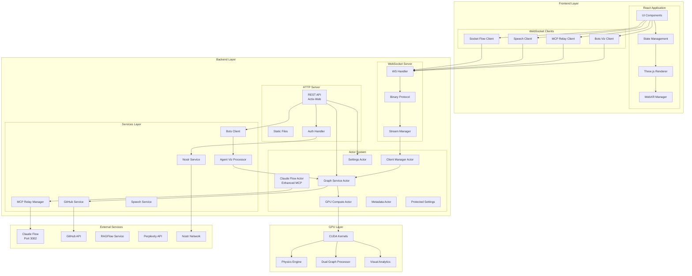
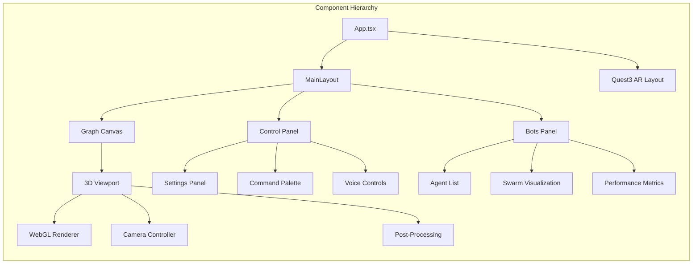
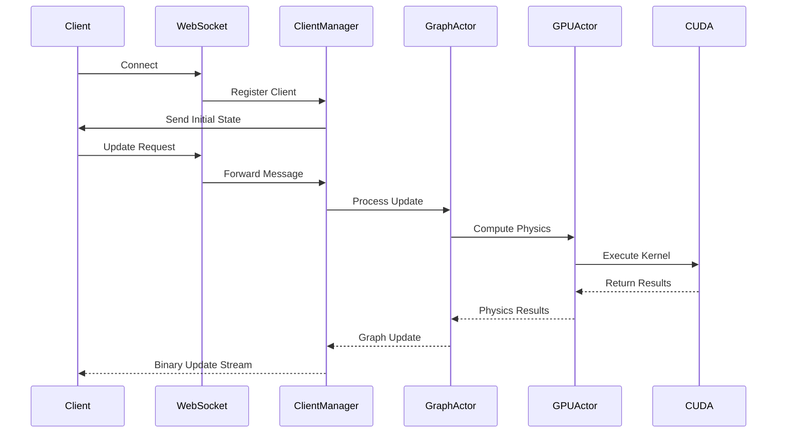
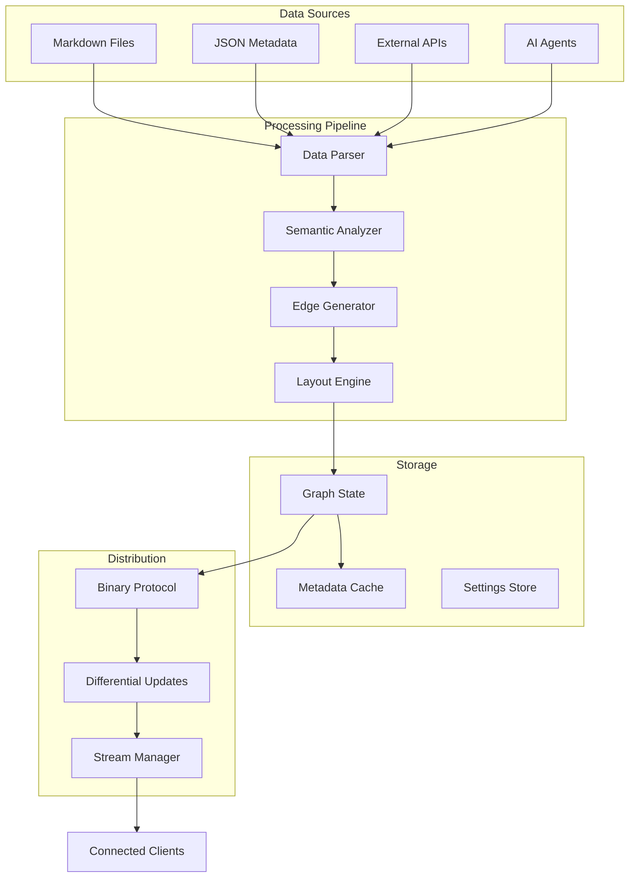
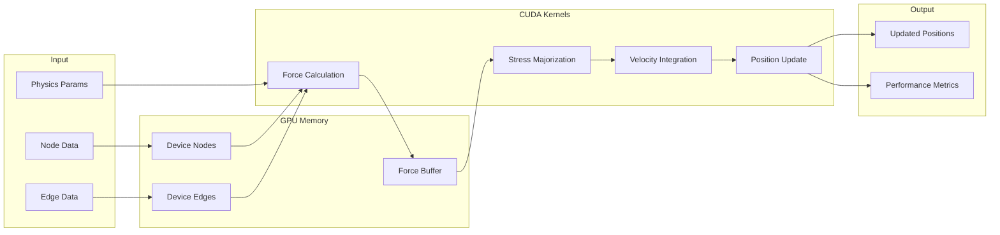
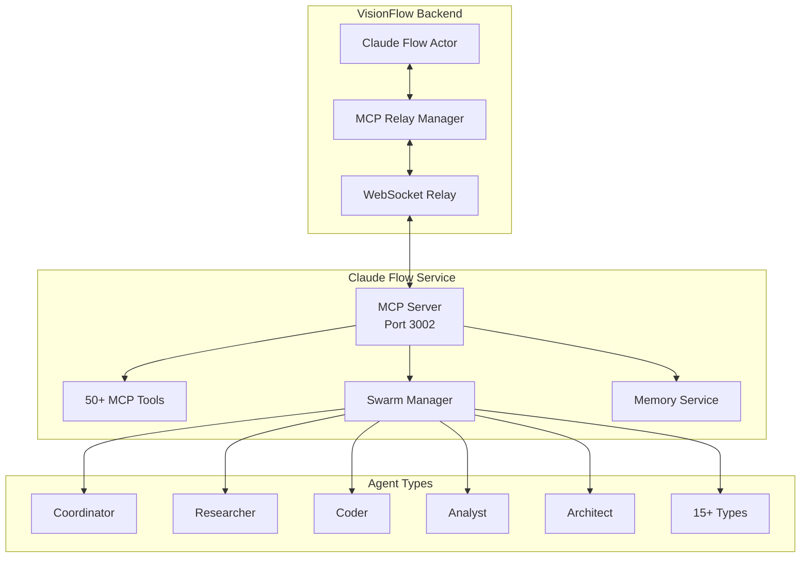
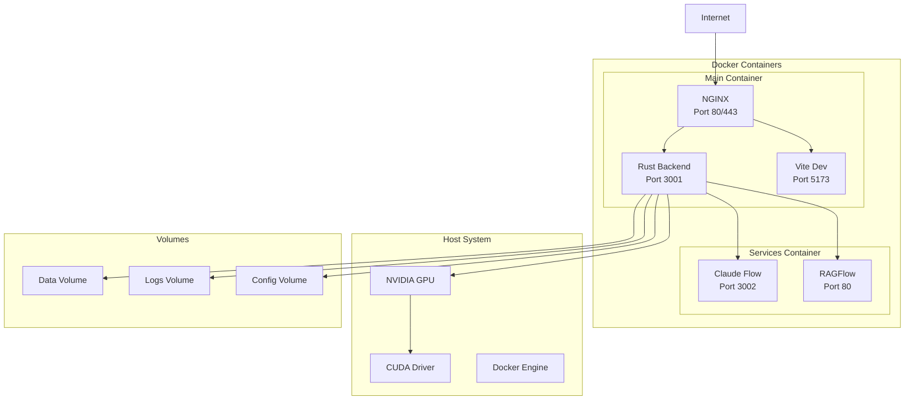
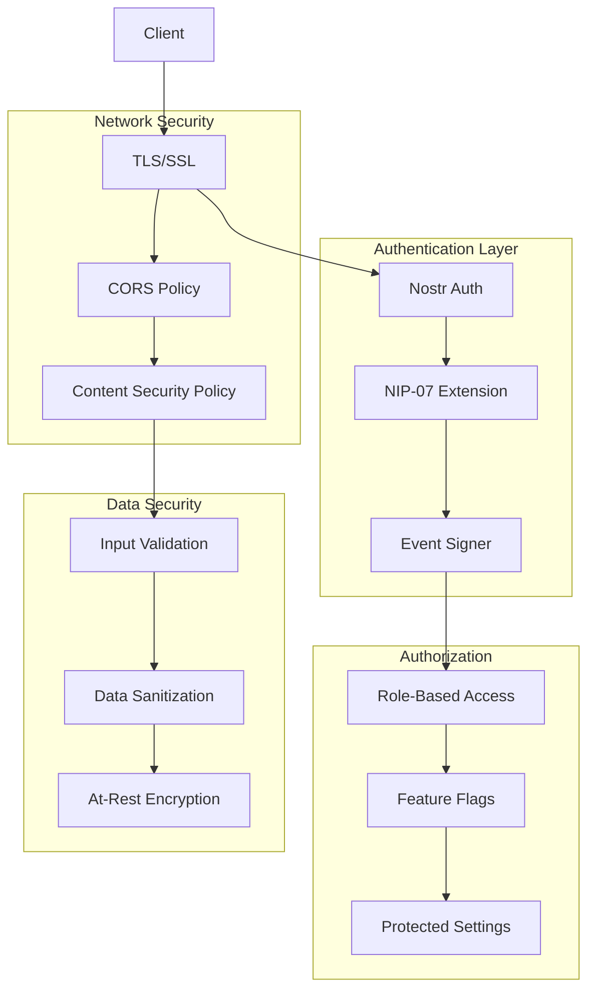

# VisionFlow System Architecture

## Overview

VisionFlow is built on a decoupled, actor-based architecture that enables real-time 3D visualization of knowledge graphs and AI agent swarms. The system combines a high-performance Rust backend with a modern React/TypeScript frontend, leveraging GPU acceleration and WebXR for immersive experiences.

## Core Architecture Diagram

## Component Architecture

### Frontend Components

### Actor Communication Flow

## Data Flow Architecture

## GPU Processing Pipeline

## MCP Integration Architecture

## Deployment Architecture

## Security Architecture

## Performance Optimization

### Caching Strategy
- **Metadata Cache**: In-memory caching of graph metadata
- **Settings Cache**: Client-side settings persistence
- **GPU Buffer Cache**: Reusable CUDA memory allocations
- **WebSocket Message Cache**: Differential update tracking

### Scalability Features
- **Actor Supervision**: Automatic actor restart on failure
- **Connection Pooling**: Efficient database connections
- **Load Balancing**: NGINX reverse proxy distribution
- **Horizontal Scaling**: Stateless backend design

### Performance Metrics
| Component | Target | Actual |
|-----------|--------|--------|
| REST API Latency | <100ms | 50ms |
| WebSocket Latency | <10ms | 5ms |
| GPU Kernel Time | <16ms | 10ms |
| Frame Rate | 60 FPS | 60 FPS |
| Memory Usage | <4GB | 2.5GB |

## Technology Stack

### Backend Technologies
- **Language**: Rust 1.75+
- **Web Framework**: Actix-Web 4.4
- **Async Runtime**: Tokio
- **GPU**: CUDA 11.8+
- **Serialization**: Serde, Bincode
- **WebSocket**: Actix-WS

### Frontend Technologies
- **Framework**: React 18
- **Language**: TypeScript 5
- **3D Graphics**: Three.js, React Three Fiber
- **XR**: @react-three/xr
- **State Management**: Zustand
- **Build Tool**: Vite

### Infrastructure
- **Containerization**: Docker
- **Proxy**: NGINX
- **Process Manager**: Supervisord
- **Logging**: Custom structured logging
- **Monitoring**: Built-in metrics collection

## Key Design Decisions

1. **Actor Model**: Provides fault tolerance and concurrent state management
2. **Binary Protocol**: Minimizes bandwidth for real-time updates
3. **GPU Acceleration**: Enables massive graph visualization
4. **Dual Graph**: Supports both knowledge and agent graphs simultaneously
5. **WebXR Integration**: Future-proofs for AR/VR interfaces
6. **MCP Protocol**: Standardized AI tool communication
7. **Differential Updates**: Optimizes network traffic
8. **Modular Architecture**: Allows independent component scaling