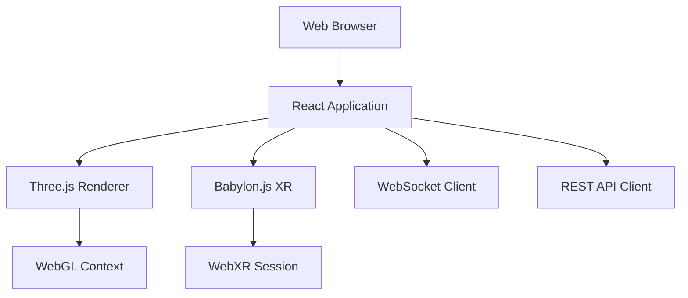
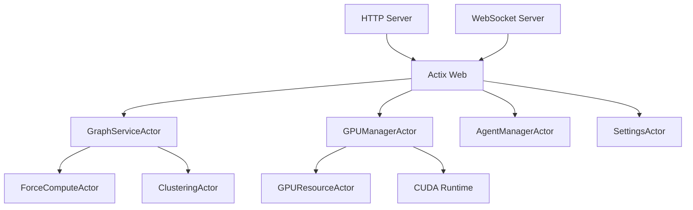
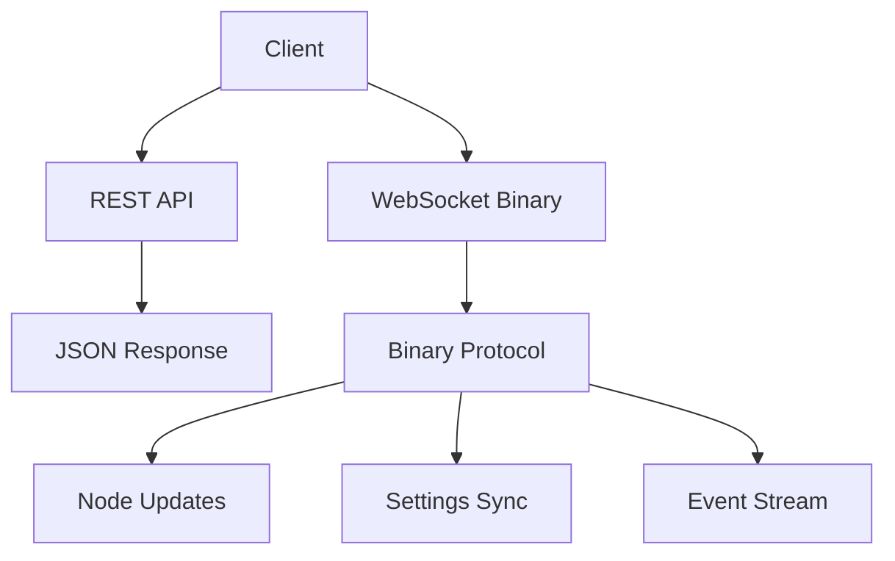
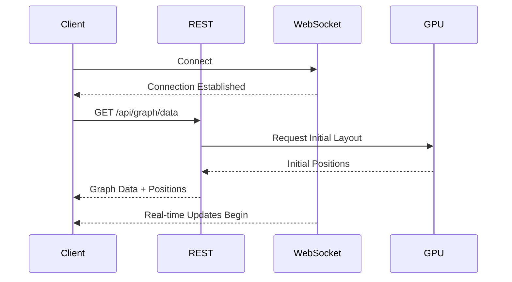
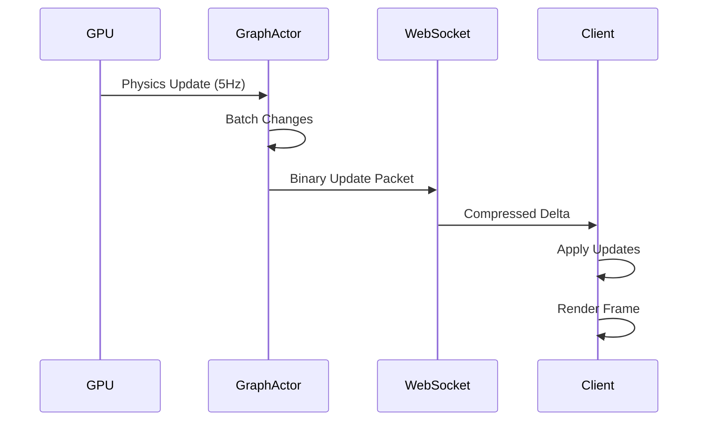
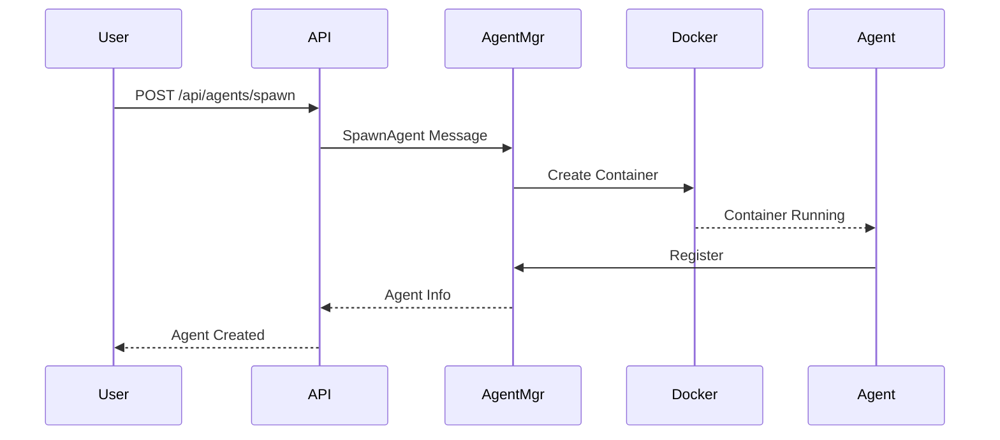
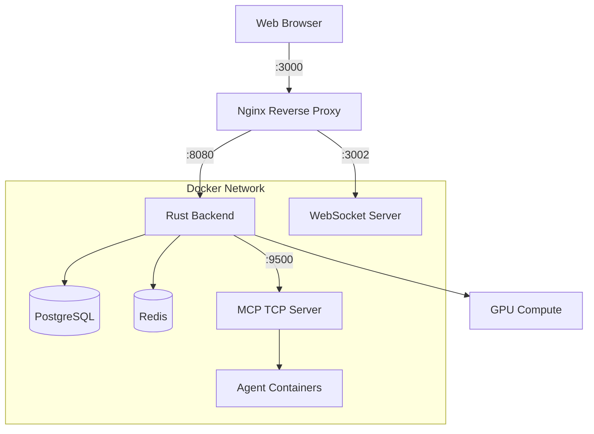
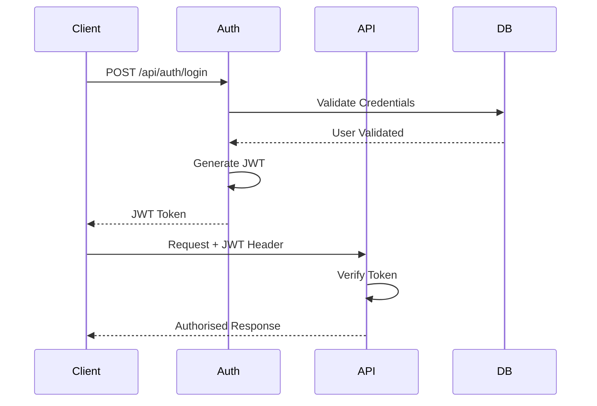

# VisionFlow System Architecture Overview

**Version**: 2.2.0
**Last Updated**: 2025-09-30
**Status**: Production-Ready Core Infrastructure

## Executive Summary

VisionFlow is an enterprise-grade 3D graph visualisation and multi-agent orchestration platform combining real-time GPU-accelerated compute with WebXR immersive experiences. The system provides sophisticated knowledge graph visualisation with distributed agent coordination capabilities.

## Core Capabilities

### Visualisation System
- **Real-time 3D rendering** with GPU acceleration
- **WebXR integration** for AR/VR experiences (Quest 3 support)
- **Binary WebSocket protocol** achieving 85% bandwidth reduction
- **Adaptive LOD rendering** for 100,000+ node graphs

### Multi-Agent Orchestration
- **Distributed agent coordination** via MCP protocol
- **Docker-based agent isolation** with resource management
- **Hierarchical and mesh topologies** for agent communication
- **Persistent agent state** with cross-session memory

### GPU Compute Pipeline
- **CUDA kernel integration** for physics simulation
- **Force-directed layout algorithms** with GPU acceleration
- **Clustering and anomaly detection** in real-time
- **Stress majorisation** for graph optimisation

## Architecture Principles

### Performance
- Binary protocols for minimal bandwidth overhead
- GPU acceleration for compute-intensive operations
- Concurrent actor model for parallel processing
- Intelligent caching and delta synchronisation

### Scalability
- Horizontal scaling via Docker orchestration
- Stateless API design with persistent storage layer
- Connection pooling and resource limiting
- Automatic load balancing across agents

### Reliability
- Actor supervision and fault tolerance
- Automatic reconnection with exponential backoff
- Health monitoring and performance metrics
- Graceful degradation under load

### Maintainability
- Clean separation of concerns across layers
- Comprehensive API documentation
- Type-safe implementations (Rust/TypeScript)
- Modular component architecture

## System Components

### Frontend Layer


**Technologies**:
- React 18 with TypeScript for UI framework
- Three.js for 3D WebGL rendering
- Babylon.js for WebXR immersive experiences
- Zustand for state management
- Vite for build tooling

### Backend Layer


**Technologies**:
- Rust with Actix framework for actor model
- CUDA for GPU compute acceleration
- PostgreSQL for persistent storage
- Redis for session and cache management

### Integration Layer


**Protocols**:
- REST API for resource operations
- Binary WebSocket for real-time updates
- MCP for agent communication
- gRPC for internal service mesh (planned)

## Data Flow Architecture

### Initialisation Flow


### Real-Time Update Flow


### Agent Coordination Flow


## Network Architecture

### Container Topology


### Port Allocation
| Service | Port | Protocol | Purpose |
|---------|------|----------|---------|
| Frontend | 3000 | HTTP | React development server |
| Backend API | 8080 | HTTP | REST API endpoints |
| WebSocket | 3002 | WS | Real-time binary protocol |
| MCP Server | 9500 | TCP | Agent orchestration |
| PostgreSQL | 5432 | TCP | Data persistence |
| Redis | 6379 | TCP | Cache and sessions |
| VNC (XR) | 5901 | VNC | XR debugging |

## Security Architecture

### Authentication Flow


### Security Layers
1. **Transport Security**: TLS 1.3 for all connections
2. **Authentication**: JWT-based with refresh tokens
3. **Authorisation**: Role-based access control (RBAC)
4. **Rate Limiting**: Per-IP and per-user throttling
5. **Input Validation**: Comprehensive sanitisation
6. **CORS**: Strict origin validation

## Performance Characteristics

### Throughput Metrics
| Component | Metric | Target | Achieved |
|-----------|--------|--------|----------|
| Graph Updates | Updates/sec | 5 Hz | 5 Hz |
| API Requests | Req/sec | 1000 | 1200 |
| WebSocket Messages | Msg/sec | 300 | 300 |
| GPU Compute | Nodes/frame | 100K | 100K |

### Latency Metrics
| Operation | Target | P50 | P95 | P99 |
|-----------|--------|-----|-----|-----|
| API Response | <50ms | 15ms | 35ms | 65ms |
| WebSocket RTT | <20ms | 8ms | 18ms | 30ms |
| GPU Compute | <200ms | 150ms | 180ms | 195ms |
| Frame Render | <16ms | 8ms | 12ms | 14ms |

### Resource Utilisation
- **CPU**: 40-60% under normal load
- **Memory**: 2-4 GB for backend
- **GPU Memory**: 1-2 GB for compute
- **Network**: 5-10 Mbps sustained

## Deployment Architecture

### Development Environment
```
┌─────────────────────────────────────┐
│     Developer Workstation           │
│                                     │
│  ┌──────────┐      ┌─────────────┐ │
│  │  Vite    │      │ Cargo Watch │ │
│  │  :3000   │      │   :8080     │ │
│  └──────────┘      └─────────────┘ │
│                                     │
│  ┌──────────────────────────────┐  │
│  │   Docker Compose             │  │
│  │  - PostgreSQL                │  │
│  │  - Redis                     │  │
│  │  - MCP Server                │  │
│  └──────────────────────────────┘  │
└─────────────────────────────────────┘
```

### Production Environment
```
┌─────────────────────────────────────┐
│         Load Balancer               │
└──────────┬──────────────────────────┘
           │
    ┌──────┴──────┐
    │             │
┌───┴────┐   ┌───┴────┐
│ Node 1 │   │ Node 2 │
│        │   │        │
│ ┌────┐ │   │ ┌────┐ │
│ │App │ │   │ │App │ │
│ └────┘ │   │ └────┘ │
└───┬────┘   └───┬────┘
    │            │
    └──────┬─────┘
           │
    ┌──────┴──────┐
    │             │
┌───┴────┐   ┌───┴────┐
│  DB    │   │ Redis  │
│Primary │   │Cluster │
└────────┘   └────────┘
```

## Technology Stack Summary

### Frontend Stack
- **Framework**: React 18.2 + TypeScript 5.0
- **3D Rendering**: Three.js r150, Babylon.js 5.0
- **State Management**: Zustand 4.3
- **Build Tool**: Vite 4.0
- **Testing**: Vitest, React Testing Library

### Backend Stack
- **Language**: Rust 1.70 (stable)
- **Web Framework**: Actix-web 4.0
- **Actor System**: Actix 0.13
- **Database**: PostgreSQL 15
- **Cache**: Redis 7.0
- **GPU**: CUDA 12.0

### Infrastructure Stack
- **Containerisation**: Docker 24.0, Docker Compose
- **Orchestration**: Kubernetes (planned)
- **CI/CD**: GitHub Actions
- **Monitoring**: Prometheus, Grafana
- **Logging**: ELK Stack

## Development Roadmap

### Completed Features (v2.2)
- ✅ Core REST API with 19 endpoints
- ✅ Binary WebSocket protocol
- ✅ GPU acceleration with CUDA
- ✅ WebXR integration for Quest 3
- ✅ Multi-agent MCP orchestration
- ✅ Settings synchronisation system
- ✅ Docker containerisation

### Current Development (v2.3)
- 🔄 GraphServiceActor refactoring
- 🔄 Voice system centralisation
- 🔄 Warning reduction (230 → <50)
- 🔄 Performance benchmarking suite

### Planned Features (v3.0)
- 📋 Kubernetes orchestration
- 📋 gRPC service mesh
- 📋 Advanced analytics dashboard
- 📋 Plugin architecture
- 📋 Multi-tenancy support

## References

- [Client Architecture](./components/client-architecture.md)
- [Server Architecture](./components/server-architecture.md)
- [GPU Compute System](./components/gpu-compute.md)
- [Integration Patterns](./integration/integration-patterns.md)
- [Deployment Guide](../development/deployment.md)
- [API Reference](../reference/api-reference.md)
