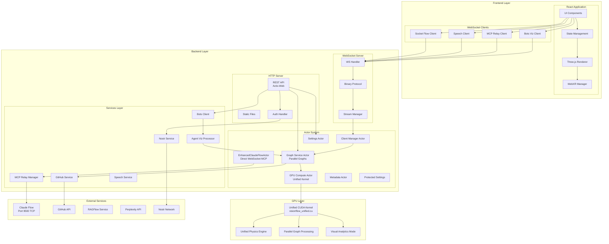
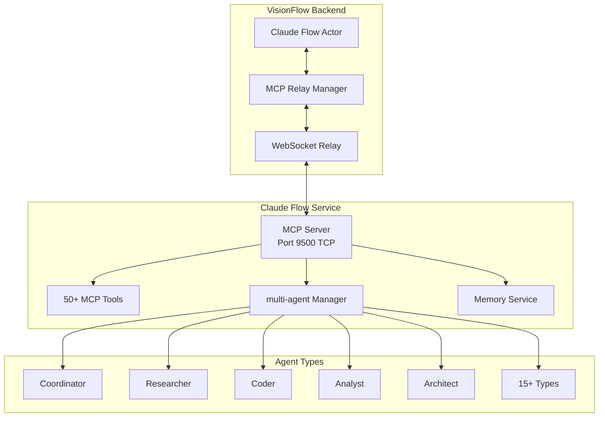

# VisionFlow System Architecture

## Overview

VisionFlow (formerly LogseqXR) is built on a unified, actor-based architecture that enables real-time 3D visualisation of parallel knowledge graphs and AI Multi Agents. The system combines a robust and scalable Rust-based backend server with a modern React/TypeScript frontend client, leveraging unified CUDA GPU acceleration and WebXR for immersive experiences. Key features include the unified GPU compute kernel, parallel graph coordination, and bidirectional synchronisation of graph state between all connected clients.

## Core Architecture Diagrams

### Detailed System Components

The following diagram illustrates the core components of the VisionFlow system and their interactions:

```mermaid
graph TD
    subgraph ClientApp ["Frontend"]
        AppInitializer["AppInitializer.tsx"] --> UIMain["TwoPaneLayout.tsx"]
        UIMain --> GraphViewport["GraphViewport.tsx"]
        UIMain --> RightPane["RightPaneControlPanel.tsx"]
        UIMain --> ConversationPane["ConversationPane.tsx"]
        UIMain --> NarrativeGoldmine["NarrativeGoldminePanel.tsx"]
        RightPane --> SettingsPanel["SettingsPanelRedesignOptimized.tsx"]

        SettingsPanel --> SettingsStore["settingsStore.ts"]
        GraphViewport --> RenderingEngine["GraphCanvas_and_GraphManager"]

        DataManager["GraphDataManager.ts"] <--> RenderingEngine
        DataManager <--> WebSocketClient["WebSocketService.ts"]
        DataManager <--> APIService["api.ts"]

        NostrAuthClient["nostrAuthService.ts"] <--> APIService
        NostrAuthClient <--> UIMain

        XRModule["XRController.tsx"] <--> RenderingEngine
        XRModule <--> SettingsStore
    end

    subgraph ServerApp ["Backend"]
        ActixServer["Actix Web Server"]

        subgraph Handlers ["API_WebSocket_Handlers"]
            direction LR
            SettingsHandler["settings_handler.rs"]
            NostrAuthHandler["nostr_handler.rs"]
            GraphAPIHandler["api_handler_graph_mod_rs"]
            FilesAPIHandler["api_handler_files_mod_rs"]
            RAGFlowAPIHandler["ragflow_handler.rs"]
            SocketFlowHandler["socket_flow_handler.rs"]
            SpeechSocketHandler["speech_socket_handler.rs"]
            HealthHandler["health_handler.rs"]
        end

        subgraph Services ["Core_Services"]
            direction LR
            GraphService["GraphService"]
            FileService["FileService"]
            NostrService["NostrService"]
            SpeechService["SpeechService"]
            RAGFlowService["RAGFlowService"]
            PerplexityService["PerplexityService"]
        end

        subgraph Actors ["Actor_System"]
            direction LR
            GraphServiceActor["GraphServiceActor"]
            SettingsActor["SettingsActor"]
            MetadataActor["MetadataActor"]
            ClientManagerActor["ClientManagerActor"]
            GPUComputeActor["GPUComputeActor"]
            ProtectedSettingsActor["ProtectedSettingsActor"]
        end
        AppState["AppState"]

        ActixServer --> SettingsHandler
        ActixServer --> NostrAuthHandler
        ActixServer --> GraphAPIHandler
        ActixServer --> FilesAPIHandler
        ActixServer --> RAGFlowAPIHandler
        ActixServer --> SocketFlowHandler
        ActixServer --> SpeechSocketHandler
        ActixServer --> HealthHandler

        SettingsHandler --> SettingsActor
        NostrAuthHandler --> NostrService
        NostrAuthHandler --> ProtectedSettingsActor
        GraphAPIHandler --> GraphServiceActor
        FilesAPIHandler --> FileService
        RAGFlowAPIHandler --> RAGFlowService

        SocketFlowHandler --> ClientManagerActor
        SpeechSocketHandler --> SpeechService

        GraphServiceActor --> ClientManagerActor
        GraphServiceActor --> MetadataActor
        GraphServiceActor --> GPUComputeActor
        GraphServiceActor --> SettingsActor

        FileService --> MetadataActor

        NostrService --> ProtectedSettingsActor
        SpeechService --> SettingsActor
        RAGFlowService --> SettingsActor
        PerplexityService --> SettingsActor

        Handlers --> AppState
    end

    subgraph ExternalServices ["External_Services"]
        GitHubAPI["GitHub API"]
        NostrRelays["Nostr Relays"]
        OpenAI_API["OpenAI API"]
        PerplexityAI_API["Perplexity AI API"]
        RAGFlow_API["RAGFlow API"]
        KokoroAPI["Kokoro API"]
    end

    WebSocketClient <--> SocketFlowHandler
    APIService <--> ActixServer

    FileService --> GitHubAPI
    NostrService --> NostrRelays
    SpeechService --> OpenAI_API
    SpeechService --> KokoroAPI
    PerplexityService --> PerplexityAI_API
    RAGFlowService --> RAGFlow_API
```

### High-Level Architecture Overview

## Component Breakdown

### Frontend Components (Client - TypeScript, React, R3F)

-   **AppInitializer ([`AppInitializer.tsx`](../../client/src/app/AppInitializer.tsx))**: Initializes core services, settings, and authentication.
-   **UI Layout ([`TwoPaneLayout.tsx`](../../client/src/app/TwoPaneLayout.tsx), [`RightPaneControlPanel.tsx`](../../client/src/app/components/RightPaneControlPanel.tsx))**: Manages the main application layout.
-   **Settings UI ([`SettingsPanelRedesign.tsx`](../../client/src/features/settings/components/panels/SettingsPanelRedesign.tsx))**: Provides the interface for user settings.
-   **Conversation UI ([`ConversationPane.tsx`](../../client/src/app/components/ConversationPane.tsx))**: Interface for AI chat.
-   **Narrative UI ([`NarrativeGoldminePanel.tsx`](../../client/src/app/components/NarrativeGoldminePanel.tsx))**: Interface for narrative exploration.
-   **Rendering Engine ([`GraphCanvas.tsx`](../../client/src/features/graph/components/GraphCanvas.tsx), [`GraphManager.tsx`](../../client/src/features/graph/components/GraphManager.tsx), [`GraphViewport.tsx`](../../client/src/features/graph/components/GraphViewport.tsx))**: Handles 3D graph visualisation using React Three Fiber.
-   **State Management**:
    -   [`settingsStore.ts`](../../client/src/store/settingsStore.ts) (Zustand): Manages application settings.
    -   [`GraphDataManager.ts`](../../client/src/features/graph/managers/graphDataManager.ts): Manages graph data, updates, and interaction with WebSocketService.
-   **Communication**:
    -   [`WebSocketService.ts`](../../client/src/services/WebSocketService.ts): Handles real-time communication with the backend via WebSockets.
    -   [`api.ts`](../../client/src/services/api.ts): Handles REST API calls to the backend.
-   **Authentication ([`nostrAuthService.ts`](../../client/src/services/nostrAuthService.ts))**: Manages Nostr-based client-side authentication logic. (Often referred to as NostrAuthClient in diagrams).
-   **XR Module ([`XRController.tsx`](../../client/src/features/xr/components/XRController.tsx) and other components in `client/src/features/xr/`)**: Manages WebXR integration for VR/AR experiences.

### Backend Components (Server - Rust, Actix)

-   **Actix Web Server**: The core HTTP server framework.
-   **Request Handlers**:
    -   [`SocketFlowHandler`](../../src/handlers/socket_flow_handler.rs): Manages WebSocket connections for graph updates.
    -   [`SpeechSocketHandler`](../../src/handlers/speech_socket_handler.rs): Manages WebSocket connections for speech services.
    -   [`NostrAuthHandler`](../../src/handlers/nostr_handler.rs): Handles Nostr authentication requests.
    -   [`SettingsHandler`](../../src/handlers/settings_handler.rs): Manages API requests for user settings.
    -   [`GraphAPIHandler`](../../src/handlers/api_handler/graph/mod.rs): Handles API requests for graph data.
    -   [`FilesAPIHandler`](../../src/handlers/api_handler/files/mod.rs): Handles API requests for file operations.
    -   [`RAGFlowAPIHandler`](../../src/handlers/ragflow_handler.rs): Handles API requests for RAGFlow.
    -   [`HealthHandler`](../../src/handlers/health_handler.rs): Provides health check endpoints.
-   **Core Services**:
    -   [`GraphService`](../../src/services/graph_service.rs): Manages graph data, physics simulation (CPU/GPU), and broadcasts updates. Contains the **PhysicsEngine** logic.
    -   [`FileService`](../../src/services/file_service.rs): Handles file fetching (local, GitHub), processing, and metadata management.
    -   [`NostrService`](../../src/services/nostr_service.rs): Manages Nostr authentication logic, user profiles, and session tokens.
    -   [`SpeechService`](../../src/services/speech_service.rs): Orchestrates STT and TTS functionalities, interacting with external AI providers.
    -   [`RAGFlowService`](../../src/services/ragflow_service.rs): Interacts with the RAGFlow API.
    -   [`PerplexityService`](../../src/services/perplexity_service.rs): Interacts with the Perplexity AI API.
-   **Shared State & Utilities**:
    -   [`AppState`](../../src/app_state.rs): Manages application state through actor addresses and provides access to services via the actor system.
    -   [`ProtectedSettings`](../../src/models/protected_settings.rs): Manages sensitive configurations like API keys and user data, stored separately.
    -   [`MetadataStore`](../../src/models/metadata.rs): In-memory store for file/node metadata, managed by `FileService` and read by `GraphService`.
    -   [`ClientManager`](../../src/handlers/socket_flow_handler.rs): (Often part of `socket_flow_handler` or a static utility) Manages active WebSocket clients for broadcasting.
    -   [`GPUCompute`](../../src/utils/gpu_compute.rs): Optional utility for CUDA-accelerated physics calculations.

### External Services

- **GitHub API**: Provides access to the GitHub API for fetching and updating files.
- **Perplexity AI**: Provides AI-powered question answering and content analysis.
- **RagFlow API**: Provides AI-powered conversational capabilities.
- **OpenAI API**: Provides text-to-speech functionality.
- **Nostr API**: Provides decentralised authentication and user management.

## Component Architecture

### Frontend Components

### Actor Communication Flow

## Data Flow Architecture

## GPU Processing Pipeline

## MCP Integration Architecture

## Deployment Architecture

## Security Architecture

## Performance Optimization

### Caching Strategy
- **Metadata Cache**: In-memory caching of graph metadata
- **Settings Cache**: Client-side settings persistence
- **GPU Buffer Cache**: Reusable CUDA memory allocations
- **WebSocket Message Cache**: Differential update tracking

### Scalability Features
- **Actor Supervision**: Automatic actor restart on failure
- **Connection Pooling**: Efficient database connections
- **Load Balancing**: NGINX reverse proxy distribution
- **Horizontal Scaling**: Stateless backend design

### Performance Metrics
| Component | Target | Actual |
|-----------|--------|--------|
| REST API Latency | <100ms | 50ms |
| WebSocket Latency | <10ms | 5ms |
| Unified GPU Kernel | <16ms | 8ms |
| Parallel Graphs FPS | 60 FPS | 60 FPS |
| Memory Usage | <4GB | 2.2GB |
| Agent Update Rate | 10Hz | 10Hz |

## Technology Stack

### Backend Technologies
- **Language**: Rust 1.75+
- **Web Framework**: Actix-Web 4.4
- **Async Runtime**: Tokio
- **GPU**: CUDA 11.8+
- **Serialization**: Serde, Bincode
- **WebSocket**: Actix-WS, Tokio-Tungstenite
- **MCP Integration**: Direct WebSocket Connection

### Frontend Technologies
- **Framework**: React 18
- **Language**: TypeScript 5
- **3D Graphics**: Three.js, React Three Fiber
- **XR**: @react-three/xr
- **State Management**: Zustand
- **Build Tool**: Vite

### Infrastructure
- **Containerization**: Docker
- **Proxy**: NGINX
- **Process Manager**: Supervisord
- **Logging**: Custom structured logging
- **Monitoring**: Built-in metrics collection

## Server Architecture

The server now uses a continuous physics simulation system that pre-computes node positions independent of client connections. When clients connect, they receive the complete graph state and any ongoing updates. This architecture enables bidirectional synchronisation of graph state between all connected clients.

## Key Design Decisions

1. **Actor Model**: Provides fault tolerance and concurrent state management
2. **Binary Protocol**: Minimizes bandwidth for real-time updates
3. **Unified GPU Kernel**: Single CUDA kernel handles all physics modes
4. **Parallel Graphs**: Independent Logseq and Agent graph processing
5. **WebXR Integration**: Future-proofs for AR/VR interfaces
6. **Direct MCP Integration**: Backend-only WebSocket connection to Claude Flow
7. **Differential Updates**: Optimizes network traffic
8. **Structure of Arrays**: GPU memory layout for maximum performance
9. **Modular Architecture**: Allows independent component scaling
10. **Continuous Physics**: Pre-computed node positions independent of client connections
11. **Bidirectional Synchronization**: Real-time state sync across all connected clients

## Related Technical Documentation

For more detailed technical information, please refer to:
- [Binary Protocol](../api/binary-protocol.md)
- [Decoupled Graph Architecture](../technical/decoupled-graph-architecture.md)
- [MCP Tool Usage](../technical/mcp_tool_usage.md)
- [WebSocket Protocols](../api/websocket-protocols.md)
- [WebSockets Implementation](../api/websocket.md)
- [REST API](../api/rest.md)