# VisionFlow System Architecture

## Overview

VisionFlow is built on a unified, actor-based architecture that enables real-time 3D visualization of parallel knowledge graphs and AI Multi Agents. The system combines a high-performance Rust backend with a modern React/TypeScript frontend, leveraging unified CUDA GPU acceleration and WebXR for immersive experiences. Key features include the unified GPU compute kernel and parallel graph coordination.

## Core Architecture Diagram

## Component Architecture

### Frontend Components

### Actor Communication Flow

## Data Flow Architecture

## GPU Processing Pipeline

```mermaid
graph LR
    subgraph "Input"
        KnowledgeNodes[Knowledge Nodes]
        AgentNodes[Agent Nodes]
        Edges[Edge Data]
        Params[SimParams]
    end

    subgraph "GPU Memory (SoA)"
        PosX[Position X Array]
        PosY[Position Y Array]
        PosZ[Position Z Array]
        VelArrays[Velocity Arrays]
        EdgeArrays[Edge Arrays]
    end

    subgraph "Unified CUDA Kernel"
        UnifiedCompute[visionflow_unified_kernel]
        Modes[4 Compute Modes:<br/>Basic, DualGraph,<br/>Constraints, Analytics]
    end

    subgraph "Output"
        Updated[Updated Positions]
        Metrics[Performance Metrics]
    end

    KnowledgeNodes --> PosX
    AgentNodes --> PosX
    Edges --> EdgeArrays
    Params --> UnifiedCompute

    PosX --> UnifiedCompute
    PosY --> UnifiedCompute
    PosZ --> UnifiedCompute
    VelArrays --> UnifiedCompute
    EdgeArrays --> UnifiedCompute

    UnifiedCompute --> Updated
    UnifiedCompute --> Metrics
```

## MCP Integration Architecture

## Deployment Architecture

## Security Architecture

## Performance Optimization

### Caching Strategy
- **Metadata Cache**: In-memory caching of graph metadata
- **Settings Cache**: Client-side settings persistence
- **GPU Buffer Cache**: Reusable CUDA memory allocations
- **WebSocket Message Cache**: Differential update tracking

### Scalability Features
- **Actor Supervision**: Automatic actor restart on failure
- **Connection Pooling**: Efficient database connections
- **Load Balancing**: NGINX reverse proxy distribution
- **Horizontal Scaling**: Stateless backend design

### Performance Metrics
| Component | Target | Actual |
|-----------|--------|--------|
| REST API Latency | <100ms | 50ms |
| WebSocket Latency | <10ms | 5ms |
| Unified GPU Kernel | <16ms | 8ms |
| Parallel Graphs FPS | 60 FPS | 60 FPS |
| Memory Usage | <4GB | 2.2GB |
| Agent Update Rate | 10Hz | 10Hz |

## Technology Stack

### Backend Technologies
- **Language**: Rust 1.75+
- **Web Framework**: Actix-Web 4.4
- **Async Runtime**: Tokio
- **GPU**: CUDA 11.8+
- **Serialization**: Serde, Bincode
- **WebSocket**: Actix-WS, Tokio-Tungstenite
- **MCP Integration**: Direct WebSocket Connection

### Frontend Technologies
- **Framework**: React 18
- **Language**: TypeScript 5
- **3D Graphics**: Three.js, React Three Fiber
- **XR**: @react-three/xr
- **State Management**: Zustand
- **Build Tool**: Vite

### Infrastructure
- **Containerization**: Docker
- **Proxy**: NGINX
- **Process Manager**: Supervisord
- **Logging**: Custom structured logging
- **Monitoring**: Built-in metrics collection

## Key Design Decisions

1. **Actor Model**: Provides fault tolerance and concurrent state management
2. **Binary Protocol**: Minimizes bandwidth for real-time updates
3. **Unified GPU Kernel**: Single CUDA kernel handles all physics modes
4. **Parallel Graphs**: Independent Logseq and Agent graph processing
5. **WebXR Integration**: Future-proofs for AR/VR interfaces
6. **Direct MCP Integration**: Backend-only WebSocket connection to Claude Flow
7. **Differential Updates**: Optimizes network traffic
8. **Structure of Arrays**: GPU memory layout for maximum performance
9. **Modular Architecture**: Allows independent component scaling