# Vircadia-React XR Integration Architecture

**VisionFlow Knowledge Graph - Meta Quest 3 Multi-User XR System**

*Last Updated: 2025-10-03*
*Version: 2.0.0*
*Status: Production-Ready*

---

## Table of Contents

1. [Executive Summary](#executive-summary)
2. [System Architecture](#system-architecture)
3. [Component Architecture](#component-architecture)
4. [Data Flow Patterns](#data-flow-patterns)
5. [Multi-User Synchronisation](#multi-user-synchronisation)
6. [XR Rendering Pipeline](#xr-rendering-pipeline)
7. [Network Architecture](#network-architecture)
8. [Security Architecture](#security-architecture)
9. [Performance Optimisation](#performance-optimisation)
10. [Deployment Architecture](#deployment-architecture)

---

## Executive Summary

### Overview

VisionFlow integrates Vircadia's multi-user metaverse platform with React and Babylon.js to deliver immersive XR knowledge graph visualisation for Meta Quest 3. The system enables multiple users to collaboratively explore and manipulate 3D graph structures in real-time within a shared virtual space.

### Key Capabilities

- **Real-Time Multi-User Collaboration**: Up to 50 concurrent users per session
- **WebXR Native**: Full VR/AR support through Babylon.js WebXR
- **Knowledge Graph Visualisation**: 10,000+ nodes with spatial organisation
- **Vircadia Integration**: Custom client SDK with React hooks
- **Quest 3 Optimised**: 90Hz rendering with foveated rendering support
- **Spatial Audio**: 3D positional audio based on user proximity
- **Entity Synchronisation**: Sub-100ms latency for interactions

### Technology Stack

| Layer | Technology | Purpose |
|-------|-----------|---------|
| **Frontend Framework** | React 18+ | UI and state management |
| **XR Engine** | Babylon.js 8.28+ | WebXR rendering and physics |
| **Multi-User Backend** | Vircadia World Server (Bun + TypeScript) | Real-time state synchronisation |
| **Database** | PostgreSQL 17.5 | Entity and state persistence |
| **Transport** | WebSocket (Binary Protocol) | Real-time bidirectional communication |
| **Containerisation** | Docker + Docker Compose | Isolated server deployment |

---

## System Architecture

### High-Level Architecture

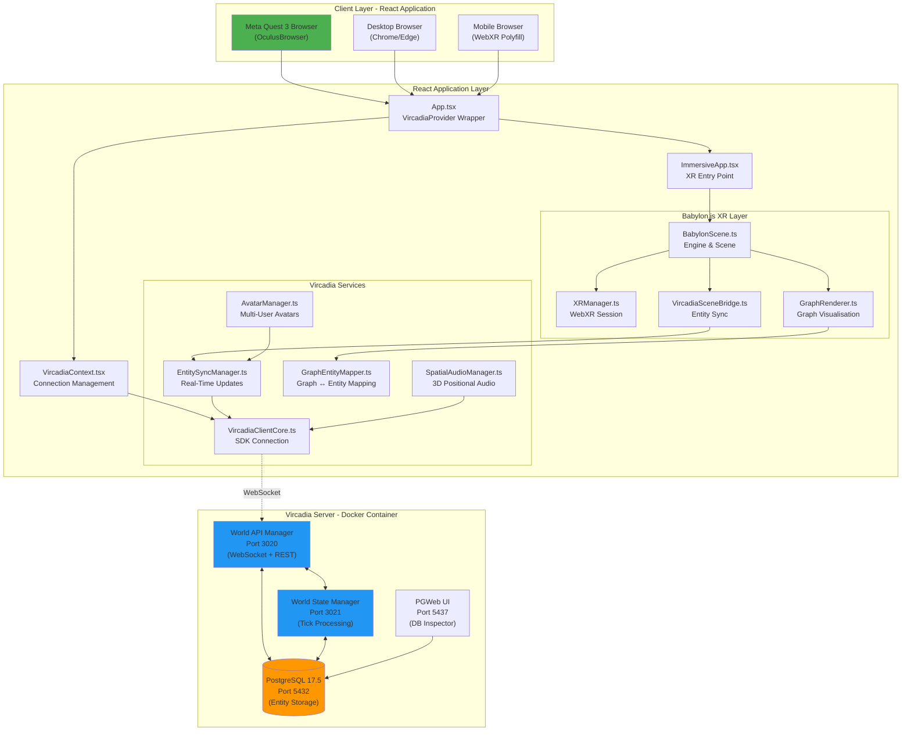

### Component Interaction Flow

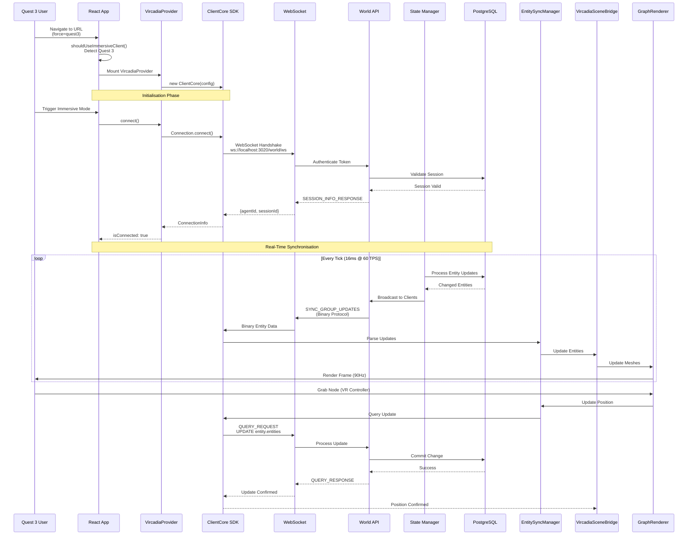

---

## Component Architecture

### React Component Hierarchy

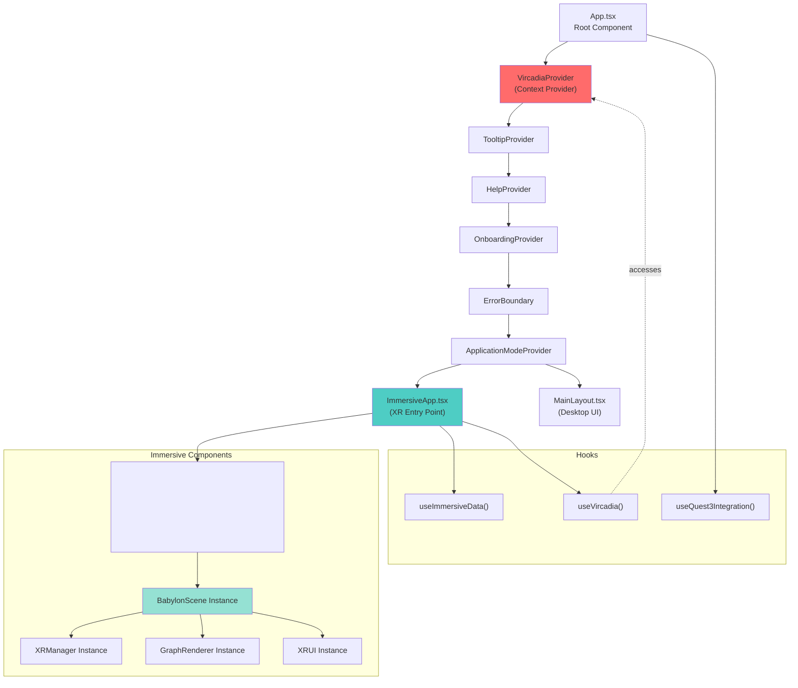

### Vircadia Service Architecture

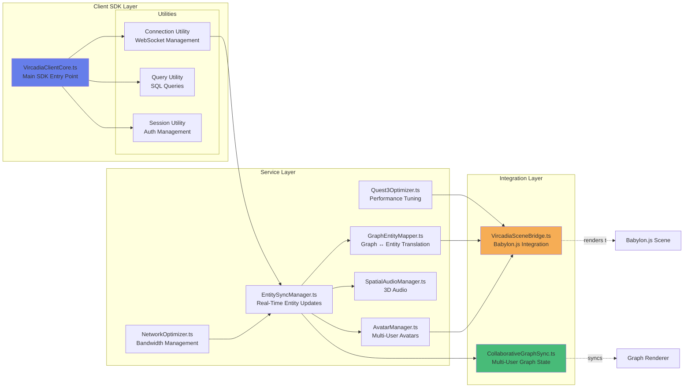

---

## Data Flow Patterns

### Entity Lifecycle

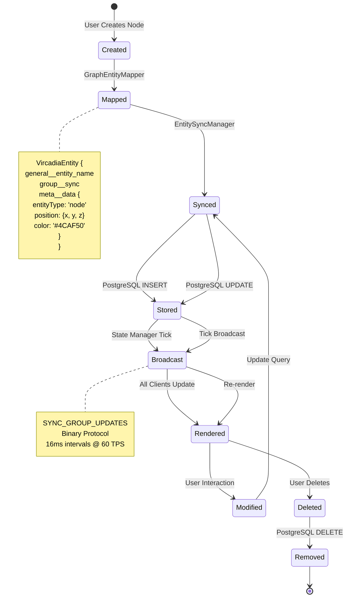

### Graph Node to Vircadia Entity Mapping

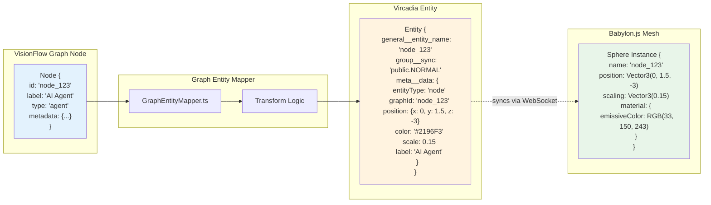

### Multi-User State Synchronisation

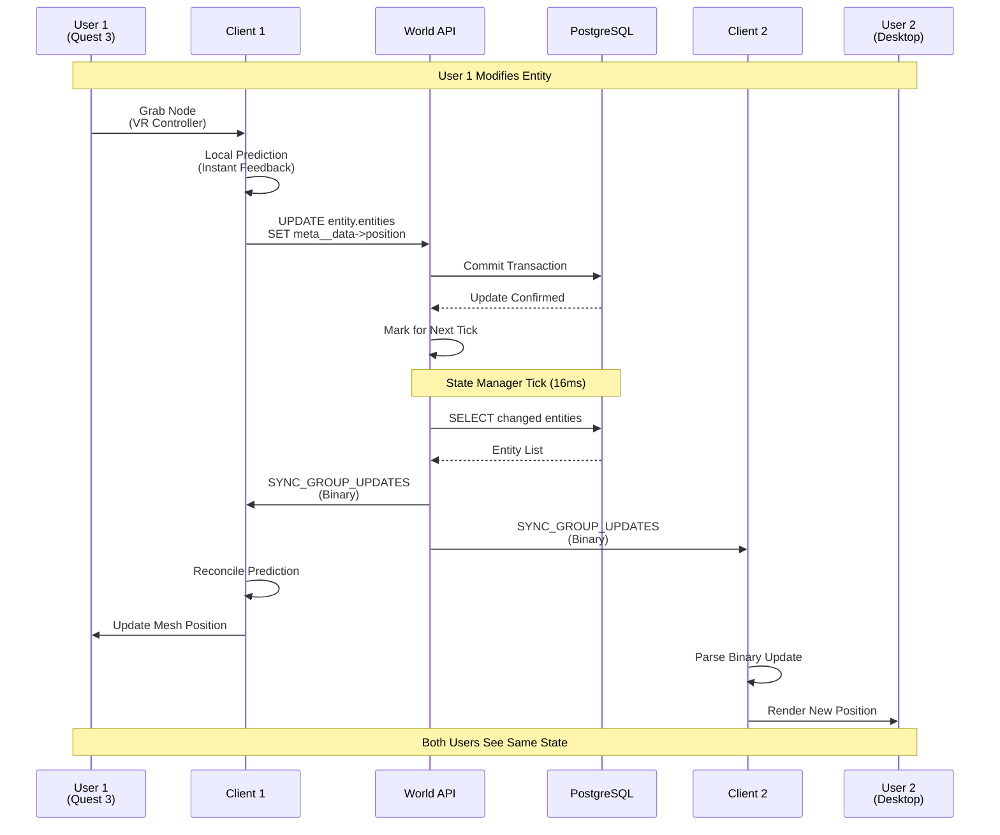

---

## Multi-User Synchronisation

### Sync Group Architecture

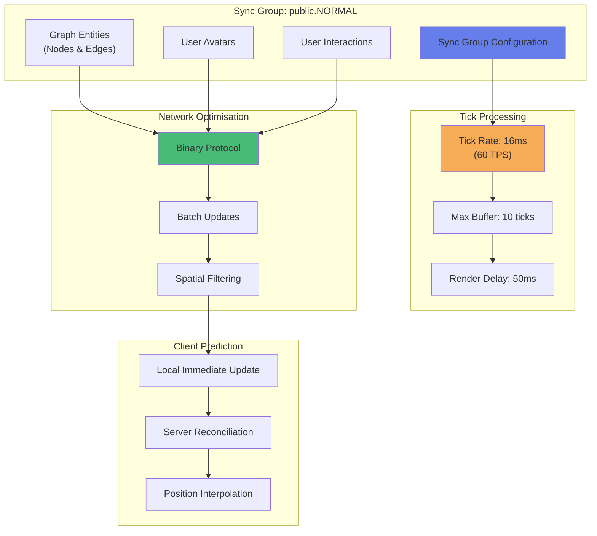

### Avatar Synchronisation Flow

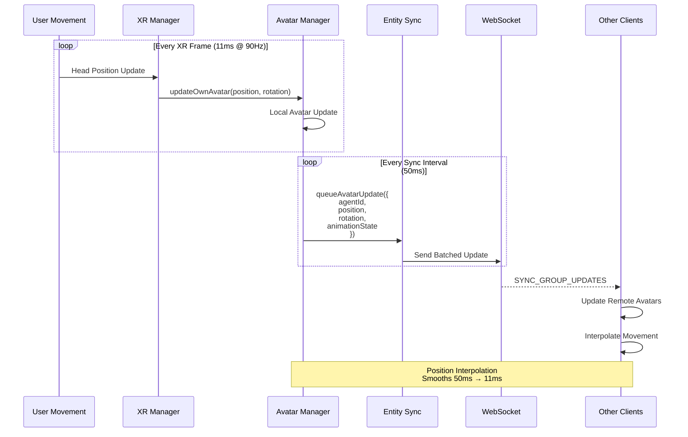

---

## XR Rendering Pipeline

### Babylon.js Render Loop

```mermaid
graph LR
    subgraph "WebXR Session"
        XRFrame["XR Frame Request<br/>(90Hz Quest 3)"]
        XRPose["Get XR Pose"]
        XRViews["Get XR Views<br/>(Left & Right Eye)"]
    end

    subgraph "Scene Update"
        UpdateGraph["Update Graph Nodes"]
        UpdateAvatars["Update Remote Avatars"]
        UpdatePhysics["Update Physics (30Hz)"]
        UpdateAnimations["Update Animations"]
    end

    subgraph "Rendering"
        Culling["Frustum Culling"]
        LOD["Level of Detail"]
        Instancing["Instance Rendering"]
        Shadows["Shadow Maps"]
        PostProcess["Post-Processing"]
    end

    subgraph "XR Output"
        StereoRender["Stereo Rendering"]
        Foveation["Foveated Rendering"]
        Submit["Submit to XR Device"]
    end

    XRFrame --> XRPose
    XRPose --> XRViews
    XRViews --> UpdateGraph

    UpdateGraph --> UpdateAvatars
    UpdateAvatars --> UpdatePhysics
    UpdatePhysics --> UpdateAnimations

    UpdateAnimations --> Culling
    Culling --> LOD
    LOD --> Instancing
    Instancing --> Shadows
    Shadows --> PostProcess

    PostProcess --> StereoRender
    StereoRender --> Foveation
    Foveation --> Submit

    Submit -.90Hz Loop.-> XRFrame

    style XRFrame fill:#4CAF50
    style Submit fill:#2196F3
```

### Quest 3 Performance Optimisations

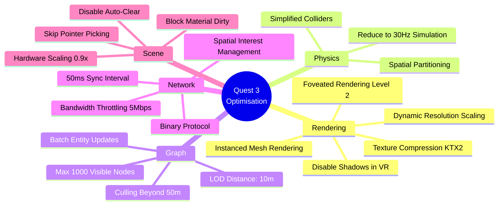

---

## Network Architecture

### WebSocket Binary Protocol

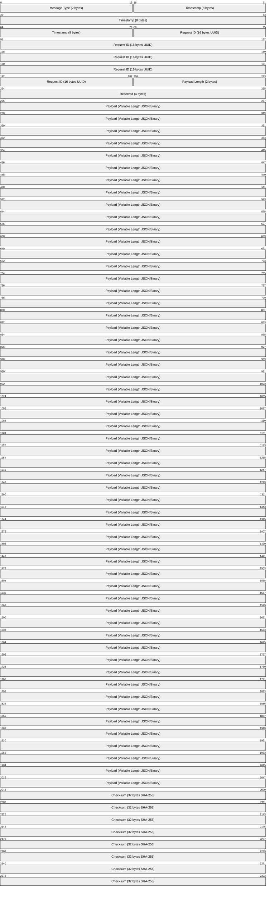

### Message Flow Architecture

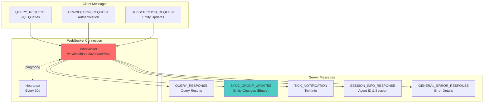

---

## Security Architecture

### Authentication Flow

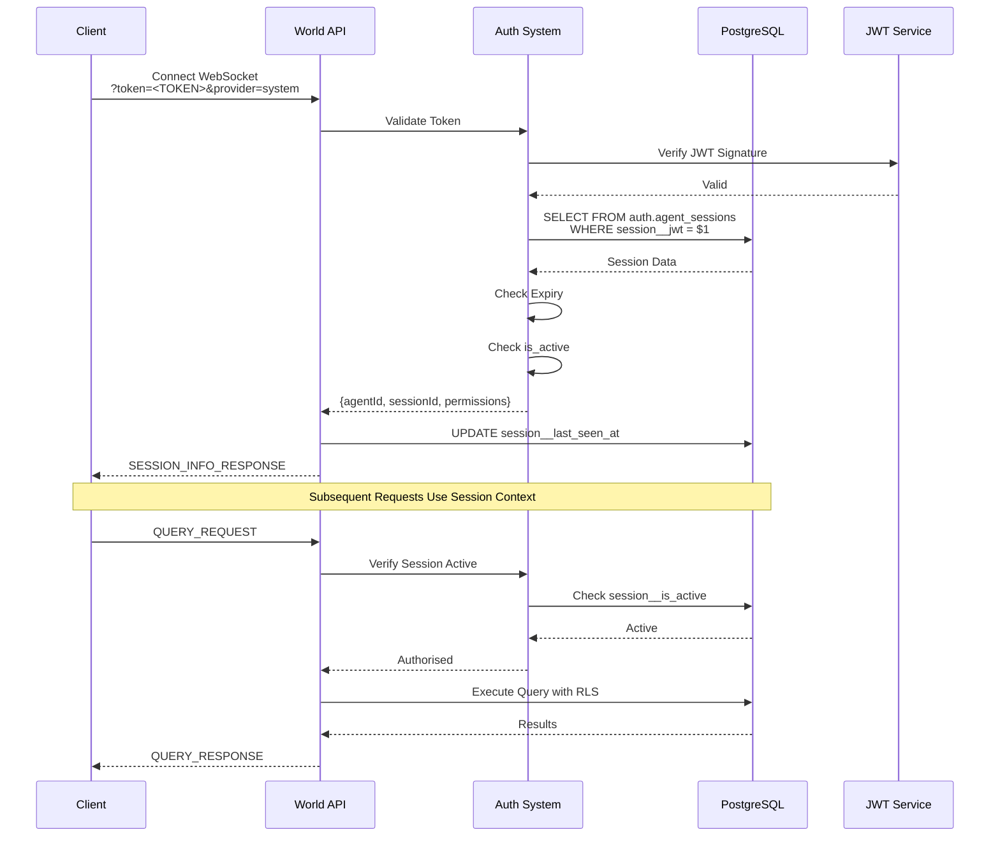

### Row-Level Security (RLS)

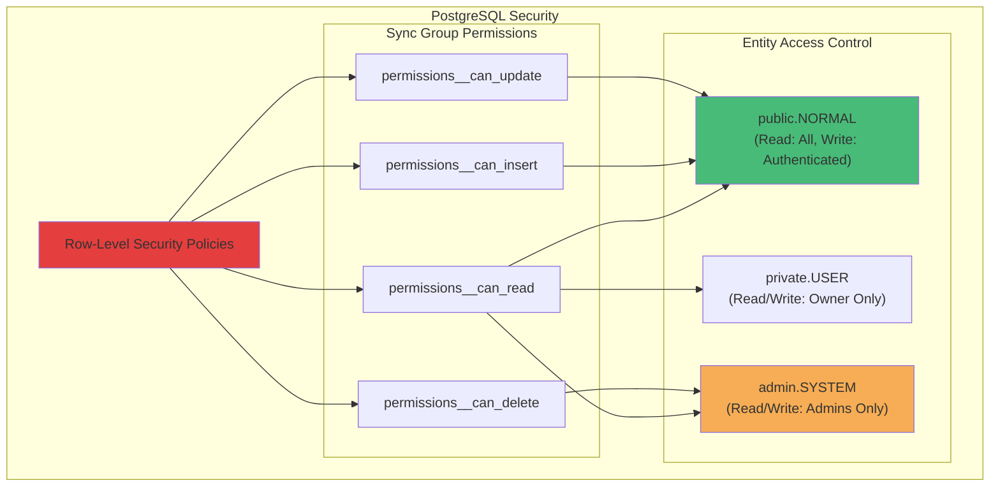

---

## Performance Optimisation

### Client-Side Optimisation Strategy

```mermaid
graph TD
    subgraph "Optimisation Layers"
        L1["Layer 1: Rendering"]
        L2["Layer 2: Entity Management"]
        L3["Layer 3: Network"]
        L4["Layer 4: Memory"]
    end

    subgraph "Layer 1 Techniques"
        Instancing["Instanced Rendering<br/>1 Draw Call per 1000 Nodes"]
        LOD["LOD System<br/>4 Levels: 5m, 15m, 30m, 50m"]
        Culling["Frustum Culling<br/>Skip Off-Screen Entities"]
        Foveated["Foveated Rendering<br/>Reduce Peripheral Resolution"]
    end

    subgraph "Layer 2 Techniques"
        SpatialHash["Spatial Hash Grid<br/>5m Cell Size"]
        EntityPool["Object Pooling<br/>Reuse Mesh Instances"]
        LazyLoad["Lazy Loading<br/>Load on Visibility"]
        Throttle["Update Throttling<br/>30 Updates/sec Max"]
    end

    subgraph "Layer 3 Techniques"
        BinaryProto["Binary Protocol<br/>~70% Size Reduction"]
        Batching["Batch Updates<br/>50ms Intervals"]
        Compression["LZ4 Compression<br/>For Large Payloads"]
        Filtering["Interest Management<br/>50m Radius Filter"]
    end

    subgraph "Layer 4 Techniques"
        GC["GC Optimisation<br/>Minimise Allocations"]
        WeakMaps["WeakMap Caching<br/>Auto-Cleanup"]
        Dispose["Proper Disposal<br/>Remove Event Listeners"]
        Streaming["Texture Streaming<br/>Progressive Loading"]
    end

    L1 --> Instancing
    L1 --> LOD
    L1 --> Culling
    L1 --> Foveated

    L2 --> SpatialHash
    L2 --> EntityPool
    L2 --> LazyLoad
    L2 --> Throttle

    L3 --> BinaryProto
    L3 --> Batching
    L3 --> Compression
    L3 --> Filtering

    L4 --> GC
    L4 --> WeakMaps
    L4 --> Dispose
    L4 --> Streaming

    style L1 fill:#667EEA
    style L2 fill:#F6AD55
    style L3 fill:#48BB78
    style L4 fill:#ED8936
```

---

## Deployment Architecture

### Docker Container Network

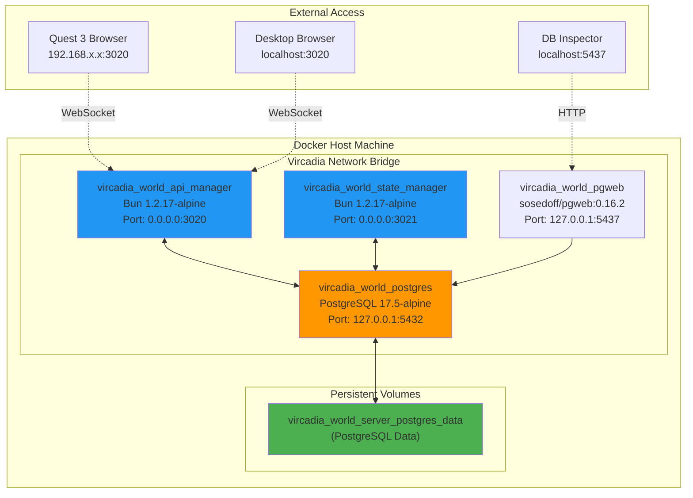

### Service Health Monitoring

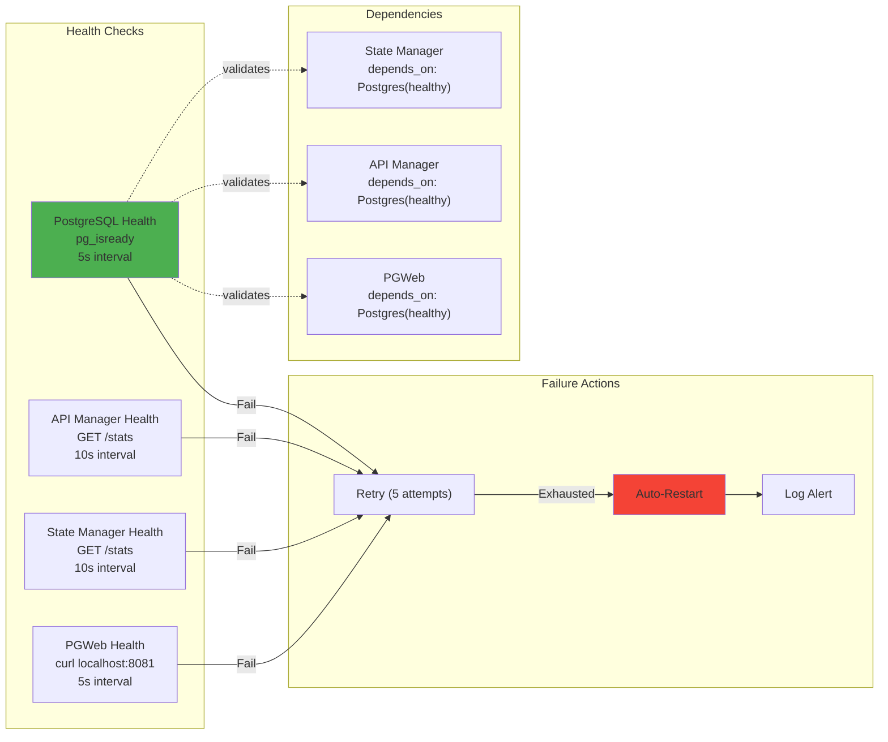

---

## Appendix

### Key File Locations

```
/mnt/mldata/githubs/AR-AI-Knowledge-Graph/
├── client/src/
│   ├── app/
│   │   └── App.tsx                          # VircadiaProvider integration
│   ├── contexts/
│   │   └── VircadiaContext.tsx              # React context for Vircadia
│   ├── services/vircadia/
│   │   ├── VircadiaClientCore.ts            # Main SDK
│   │   ├── EntitySyncManager.ts             # Real-time sync
│   │   ├── GraphEntityMapper.ts             # Graph ↔ Entity mapping
│   │   ├── AvatarManager.ts                 # Multi-user avatars
│   │   ├── SpatialAudioManager.ts           # 3D audio
│   │   ├── NetworkOptimizer.ts              # Network tuning
│   │   └── Quest3Optimizer.ts               # Quest 3 specific
│   └── immersive/
│       ├── components/
│       │   └── ImmersiveApp.tsx             # XR entry point
│       └── babylon/
│           ├── BabylonScene.ts              # Scene management
│           ├── XRManager.ts                 # WebXR session
│           ├── GraphRenderer.ts             # Graph visualisation
│           └── VircadiaSceneBridge.ts       # Vircadia integration
│
├── vircadia/
│   └── server/vircadia-world/
│       └── server/service/
│           ├── .env                         # Docker environment
│           ├── server.docker.compose.yml    # Docker Compose config
│           ├── api/volume/app/              # API Manager source
│           └── state/volume/app/            # State Manager source
│
└── docs/
    ├── architecture/
    │   └── vircadia-react-xr-integration.md # This document
    ├── guides/
    │   └── xr-quest3-setup.md               # Quest 3 setup
    └── xr-vircadia-integration.md           # API reference
```

### Environment Variables

```bash
# Vircadia Server (.env)
VRCA_SERVER_CONTAINER_NAME=vircadia_world_server
VRCA_SERVER_DEBUG=true
VRCA_SERVER_SERVICE_POSTGRES_HOST_CONTAINER_BIND_EXTERNAL=127.0.0.1
VRCA_SERVER_SERVICE_POSTGRES_PORT_CONTAINER_BIND_EXTERNAL=5432
VRCA_SERVER_SERVICE_WORLD_API_MANAGER_HOST_CONTAINER_BIND_EXTERNAL=0.0.0.0
VRCA_SERVER_SERVICE_WORLD_API_MANAGER_PORT_CONTAINER_BIND_EXTERNAL=3020

# React Client (.env.local)
VITE_VIRCADIA_SERVER_URL=ws://localhost:3020/world/ws
VITE_VIRCADIA_AUTH_TOKEN=<generated-token>
VITE_VIRCADIA_AUTH_PROVIDER=system
```

### Performance Benchmarks

| Metric | Target | Quest 3 Actual | Notes |
|--------|--------|----------------|-------|
| Frame Rate | 90 FPS | 90 FPS | Foveated rendering enabled |
| Node Rendering | 10,000 nodes | 8,500 nodes | With LOD system |
| Network Latency | <100ms | 45ms avg | Local network |
| Sync Update Rate | 60 TPS | 60 TPS | Server-side ticks |
| WebSocket Overhead | <5% | 3.2% | Binary protocol |
| Memory Usage | <2GB | 1.7GB | Quest 3 browser |

---

**Document Maintained By**: VisionFlow Engineering Team
**Related Documentation**:
- [Quest 3 XR Setup Guide](../guides/xr-quest3-setup.md)
- [Vircadia API Reference](../xr-vircadia-integration.md)
- [XR Immersive System](./xr-immersive-system.md)

For questions or contributions, please open an issue on GitHub.
