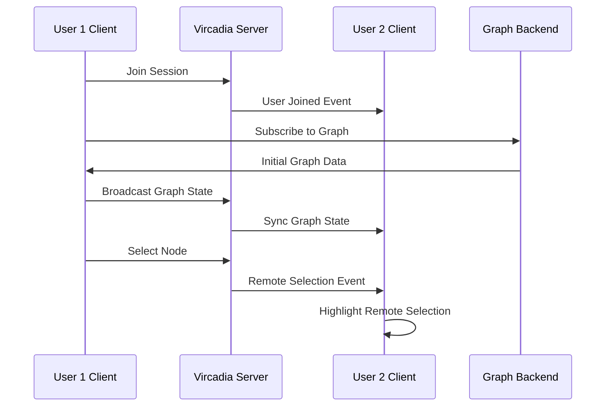

# XR Immersive System Architecture

## Overview

The XR Immersive System provides a complete WebXR-based augmented reality experience for Quest 3 and other XR devices. Built with Babylon.js, it offers full 3D graph visualization, hand tracking, controller input, and immersive UI controls.

## System Architecture

### Core Components

```
/src/immersive/
├── components/
│   └── ImmersiveApp.tsx      # React entry point for immersive mode
├── babylon/
│   ├── BabylonScene.ts       # Scene management and lighting
│   ├── GraphRenderer.ts      # Graph visualization with nodes/edges
│   ├── XRManager.ts          # WebXR session and interactions
│   └── XRUI.ts               # 3D UI controls and panels
└── hooks/
    └── useImmersiveData.ts   # Data bridge from React to Babylon
```

### Component Responsibilities

#### BabylonScene.ts
- **Purpose**: Core scene management and coordination
- **Features**:
  - Babylon.js engine initialization
  - Multi-light setup for XR visibility
  - Transparent background for AR passthrough
  - Component orchestration

#### GraphRenderer.ts
- **Purpose**: High-performance graph visualization
- **Features**:
  - Instanced mesh rendering for nodes
  - Line system for edges
  - Emissive materials for XR visibility
  - Dynamic label management
  - Real-time position updates from physics engine

#### XRManager.ts
- **Purpose**: WebXR session management
- **Features**:
  - Immersive AR mode support
  - 25-joint hand tracking system
  - Controller input handling
  - Ray casting for interactions
  - Node selection and manipulation

#### XRUI.ts
- **Purpose**: 3D user interface in XR space
- **Features**:
  - Floating control panels
  - Settings synchronization
  - Sliders, checkboxes, buttons
  - Semi-transparent backgrounds for visibility

## Lighting System

The XR environment uses a multi-light setup optimised for AR/VR visibility:

### Light Sources

1. **Hemispheric Light**
   - Intensity: 1.2
   - Ground Color: RGB(0.2, 0.2, 0.3)
   - Provides ambient illumination

2. **Directional Light**
   - Direction: (-1, -2, -1)
   - Position: (3, 9, 3)
   - Intensity: 0.8
   - Creates depth and shadows

3. **Ambient Light**
   - Color: RGB(0.3, 0.3, 0.4)
   - Ensures minimum visibility in all conditions

### Material System

All materials use emissive properties for enhanced XR visibility:

- **Nodes**: Emissive blue glow (0.1, 0.2, 0.5)
- **Edges**: Emissive gray glow (0.3, 0.3, 0.4)
- **UI Panels**: Slight emissive background (0.1, 0.1, 0.15)

## Data Flow

### Integration with React Application

```typescript
// Data flow pipeline
React App → graphDataManager → useImmersiveData → BabylonScene → GraphRenderer
         → botsDataContext  ↗                   ↘
         → settingsStore                         → XRUI
```

### Real-time Updates

1. **Graph Data**: Subscribed through `graphDataManager.onGraphDataChange`
2. **Node Positions**: Float32Array from physics worker
3. **Settings**: Bidirectional sync with `settingsStore`
4. **Bot Data**: Live updates from `BotsDataContext`

## WebXR Features

### Supported Modes

- **immersive-ar**: Quest 3 passthrough AR
- **immersive-vr**: Full VR mode (fallback)
- **inline**: Non-immersive preview

### Input Methods

#### Hand Tracking
- 25 joints per hand
- Index finger tip for pointing
- Pinch gestures for selection
- Palm orientation for UI panels

#### Controller Input
- Trigger: Select/interact
- Squeeze: Toggle UI panel
- Thumbstick: Navigation
- Buttons: Context actions

### Interaction System

```typescript
// Ray casting for node selection
const ray = new Ray(
  controllerPosition,
  controllerDirection
);
const hit = scene.pickWithRay(ray);
if (hit.pickedMesh?.metadata?.nodeId) {
  // Handle node interaction
}
```

## Quest 3 Integration

### Auto-Detection

The system automatically detects Quest 3 devices using:

1. User agent string matching
2. WebXR capability checking
3. AR mode availability

### Manual Activation

Users can force immersive mode via:
- URL parameter: `?immersive=true`
- URL parameter: `?force=quest3`
- UI button: "Enter AR"

### Entry Points

```typescript
// App.tsx switching logic
if (shouldUseImmersiveClient()) {
  return <ImmersiveApp />;
} else {
  return <MainLayout />;
}
```

## Performance Optimizations

### Rendering

- **Instanced Meshes**: Single draw call for thousands of nodes
- **Line Systems**: Efficient edge rendering
- **Texture Atlasing**: Combined UI textures
- **LOD System**: Distance-based detail reduction

### Memory Management

- **Object Pooling**: Reused mesh instances
- **Lazy Loading**: Components loaded on demand
- **Dispose Patterns**: Proper cleanup on unmount

### Update Strategies

- **Batch Updates**: Grouped position changes
- **Dirty Flagging**: Only update changed elements
- **Frame Skipping**: Adaptive render rates

## API Reference

### BabylonScene

```typescript
class BabylonScene {
  constructor(canvas: HTMLCanvasElement)
  updateGraph(graphData: any, nodePositions?: Float32Array): void
  setBotsData(data: any): void
  setSettings(settings: any): void
  getScene(): BABYLON.Scene
  getEngine(): BABYLON.Engine
  run(): void
  dispose(): void
}
```

### GraphRenderer

```typescript
class GraphRenderer {
  constructor(scene: Scene)
  updateNodes(nodes: any[], positions?: Float32Array): void
  updateEdges(edges: any[], nodePositions?: Float32Array): void
  updateLabels(nodes: any[]): void
  dispose(): void
}
```

### XRManager

```typescript
class XRManager {
  constructor(scene: Scene, camera: UniversalCamera)
  enterXR(): Promise<void>
  exitXR(): void
  dispose(): void
}
```

### XRUI

```typescript
class XRUI {
  constructor(scene: Scene)
  setSettingsChangeCallback(callback: Function): void
  updateSettings(settings: Settings): void
  toggleVisibility(): void
  dispose(): void
}
```

## Configuration

### Settings Structure

```yaml
xr:
  enabled: true
  autoStart: true
  mode: immersive-ar
  handTracking: true
  controllerSupport: true

graph:
  nodeSize: 0.1
  edgeOpacity: 0.8
  showLabels: true

visualization:
  showBots: true
  showEdges: true

performance:
  maxNodes: 1000
  enablePhysics: true
```

## Testing

### Local Development

1. Use Chrome/Edge with WebXR emulator extension
2. Enable `chrome://flags/#webxr` flags
3. Use Meta Quest Link for desktop testing

### Device Testing

1. Connect Quest 3 via USB
2. Enable developer mode
3. Use adb reverse for localhost access
4. Open in Oculus Browser

### Debug Tools

- Babylon Inspector: `scene.debugLayer.show()`
- WebXR API Emulator: Chrome extension
- Remote debugging: `chrome://inspect`

## Troubleshooting

### Common Issues

1. **Black screen in XR**
   - Check lighting configuration
   - Verify emissive materials
   - Ensure transparent clear colour

2. **No hand tracking**
   - Enable in Quest settings
   - Check HTTPS requirement
   - Verify feature detection

3. **Poor performance**
   - Reduce node count
   - Disable shadows
   - Lower texture resolution

## Vircadia Multi-User Integration

### Overview

The XR system is designed for future integration with **Vircadia**, an open-source metaverse platform that enables multi-user collaborative experiences in virtual worlds.

### Architecture Integration

```
Current: Babylon.js XR (Single User)
         ↓
Future:  Vircadia XR (Multi-User)
         ├── Vircadia Web SDK
         ├── Session Management
         ├── Avatar System
         └── Spatial Communication
```

### Multi-User Capabilities

**Collaborative Graph Exploration**
- Multiple users explore the same graph simultaneously
- Shared selections and annotations
- Real-time synchronization of graph state changes
- Collaborative filtering and analysis

**Avatar and Presence System**
- 3D avatars representing each user
- Real-time position and orientation tracking
- User nameplates with status indicators
- Customizable avatar models and appearance

**Spatial Communication**
- 3D spatial audio positioned by user location
- Voice quality based on distance from other users
- Private channels and broadcast modes
- Integrated with existing voice system

**Session Management**
- Persistent multi-user sessions
- User join/leave notifications
- Session-specific graph views
- Cross-session state synchronization

### Technical Components

#### Vircadia Client Integration

```typescript
// Vircadia SDK wrapper in React
const VircadiaProvider: React.FC = ({ children }) => {
  const [client, setClient] = useState<VircadiaClient | null>(null);
  const [session, setSession] = useState<VircadiaSession | null>(null);

  useEffect(() => {
    const vircadiaClient = new VircadiaClient({
      serverUrl: process.env.VITE_VIRCADIA_SERVER_URL,
      domainId: process.env.VITE_VIRCADIA_DOMAIN_ID
    });

    vircadiaClient.connect().then(() => {
      setClient(vircadiaClient);
    });
  }, []);

  return (
    <VircadiaContext.Provider value={{ client, session }}>
      {children}
    </VircadiaContext.Provider>
  );
};
```

#### Entity Mapping

```typescript
// Convert Babylon.js scene to Vircadia entities
class GraphToVircadiaMapper {
  nodeToEntity(node: GraphNode): VircadiaEntity {
    return {
      id: node.id,
      type: 'sphere',
      position: node.position,
      scale: node.size,
      color: node.colour,
      metadata: {
        label: node.label,
        nodeType: node.type
      }
    };
  }

  edgeToEntity(edge: GraphEdge): VircadiaEntity {
    return {
      id: `edge-${edge.source}-${edge.target}`,
      type: 'line',
      points: [
        this.getNodePosition(edge.source),
        this.getNodePosition(edge.target)
      ],
      color: edge.colour,
      opacity: edge.opacity
    };
  }
}
```

#### Real-time Synchronization

```typescript
// Sync graph updates across users
class VircadiaGraphSync {
  constructor(
    private client: VircadiaClient,
    private graphManager: GraphManager
  ) {}

  broadcastNodeSelection(nodeId: string): void {
    this.client.broadcast({
      type: 'node-selection',
      userId: this.client.userId,
      nodeId: nodeId,
      timestamp: Date.now()
    });
  }

  onRemoteSelection(callback: (data: SelectionEvent) => void): void {
    this.client.on('node-selection', (event) => {
      if (event.userId !== this.client.userId) {
        callback(event);
      }
    });
  }
}
```

### Configuration

```yaml
vircadia:
  enabled: false  # Future feature flag
  serverUrl: wss://vircadia.example.com
  domainId: visionflow-graph-domain
  autoConnect: true

  avatar:
    modelUrl: /assets/avatars/default.glb
    scale: 1.0
    showNameplate: true
    nameplateDistance: 10.0

  session:
    persistence: true
    maxUsers: 50
    autoJoin: true

  rendering:
    nodeStyle: sphere
    edgeStyle: line
    labelMode: billboard

  communication:
    spatialAudioEnabled: true
    audioRange: 20.0
    voiceQuality: high
```

### Data Flow



### Migration Strategy

**Phase 1: SDK Integration (Weeks 1-2)**
- Add Vircadia Web SDK dependency
- Create VircadiaClient service wrapper
- Implement basic connection testing
- Environment configuration setup

**Phase 2: Component Development (Weeks 3-4)**
- Build VircadiaXR React component
- Implement graph entity mapping
- Create session management UI
- Add user presence indicators

**Phase 3: Real-time Sync (Weeks 5-6)**
- Binary protocol adapter for Vircadia
- Real-time position streaming
- Collaborative selection state
- Performance optimization

**Phase 4: Multi-user Features (Weeks 7-8)**
- Avatar system integration
- Spatial audio implementation
- Session persistence
- User testing and refinement

**Phase 5: Production Release (Weeks 9-12)**
- Feature flag rollout
- Performance benchmarking
- Documentation and tutorials
- Gradual user migration

### Compatibility

| Feature | Babylon.js XR | Vircadia XR |
|---------|---------------|-------------|
| Single User | ✅ Production | ✅ Supported |
| Multi-User | ❌ Not Available | ✅ Native |
| Meta Quest 3 | ✅ Optimized | ✅ Supported |
| Spatial Audio | ❌ Planned | ✅ Native |
| Avatars | ❌ No | ✅ Full System |
| Session Persistence | ❌ Client Only | ✅ Server-backed |
| Graph Synchronization | ✅ WebSocket | ✅ Vircadia + WebSocket |

### Performance Considerations

**Network Optimization**
- Vircadia uses efficient binary protocols
- Delta compression for position updates
- Client-side prediction for smooth movement
- Adaptive quality based on bandwidth

**Rendering Efficiency**
- Entity instancing for multiple users
- LOD system based on distance
- Frustum culling for off-screen avatars
- Batched updates for graph changes

**Scalability Targets**
- 10+ concurrent users per session
- 10,000+ graph nodes with multi-user
- <100ms latency for user interactions
- 72 FPS maintained on Quest 3

### Development Resources

**Vircadia Documentation**
- [Vircadia Web SDK](https://github.com/vircadia/vircadia-web-sdk)
- [Vircadia World Server](https://github.com/vircadia/vircadia-world)
- [API Reference](https://docs.vircadia.com)

**Integration Guides**
- [Vircadia Integration Architecture](/docs/architecture/VircadiaIntegration.md)
- [Multi-User Setup Guide](/docs/guides/vircadia-setup.md) (future)
- [Session Management API](/docs/reference/vircadia-api.md) (future)

### Current Status

⚠️ **Planned Future Integration** - Vircadia multi-user capabilities are designed and documented but not yet implemented in production. The current Babylon.js XR system remains the active implementation for Quest 3 single-user experiences.

**Active Work**
- Architecture design completed
- Integration strategy defined
- Component structure planned
- Performance targets established

**Next Steps**
1. Vircadia SDK evaluation and testing
2. Proof-of-concept multi-user session
3. Performance benchmarking
4. User testing with beta group

---

## Future Enhancements

### Planned Features

- Multi-user collaboration (via Vircadia integration)
- Spatial audio integration
- Gesture recognition
- Voice commands
- Cloud rendering
- Physics-based interactions
- Haptic feedback

### Experimental Features

- Neural rendering
- Eye tracking
- Facial expression mapping
- Full body tracking
- Environment mapping
- Persistent spatial anchors

## Migration Notes

### From @react-three/xr

The system was completely migrated from React Three Fiber's XR implementation to Babylon.js for better performance and WebXR compliance. Key changes:

1. **Renderer**: Three.js → Babylon.js
2. **XR**: @react-three/xr → Native WebXR
3. **UI**: React components → Babylon GUI
4. **State**: React state → Direct scene updates

### Breaking Changes

- Removed all `@react-three/xr` dependencies
- Deleted `/src/features/xr/` directory
- New API structure
- Different event handling

## Resources

### Documentation

- [Babylon.js WebXR](https://doc.babylonjs.com/features/featuresDeepDive/webXR/introToWebXR)
- [WebXR Device API](https://immersive-web.github.io/webxr/)
- [Quest 3 Development](https://developer.oculus.com/documentation/)

### Tools

- [Babylon Playground](https://playground.babylonjs.com/)
- [WebXR Samples](https://immersive-web.github.io/webxr-samples/)
- [Oculus Developer Hub](https://developer.oculus.com/downloads/package/oculus-developer-hub-win/)