# ❌ OBSOLETE: Wrong Technology Stack

## ⚠️ DO NOT USE THIS DOCUMENT ⚠️

**Status**: DEPRECATED - Never Implemented
**Archived**: December 2, 2025
**Issue**: This document describes a PostgreSQL + Redis + Vue.js architecture that was **never built**

### Actual Architecture

The real system uses:
- **Database**: Neo4j (graph database), not PostgreSQL
- **Cache**: No Redis - Neo4j is the source of truth
- **Frontend**: React + TypeScript, not Vue.js
- **Backend**: Rust + Actix-web, not Node.js
- **Auth**: Nostr protocol, not JWT

### Current Documentation

For the **actual, current architecture**, see:
- **Primary**: `/docs/ARCHITECTURE_OVERVIEW.md`
- **Detailed**: `/docs/explanations/architecture/`
- **Components**: `/docs/explanations/architecture/core/`

---

## Historical Content Below (DO NOT USE)

# Architecture Overview (WRONG STACK - NEVER IMPLEMENTED)

## System Architecture

VisionFlow is built as a distributed, microservices-based application designed for scalability, maintainability, and high availability.

## High-Level Architecture

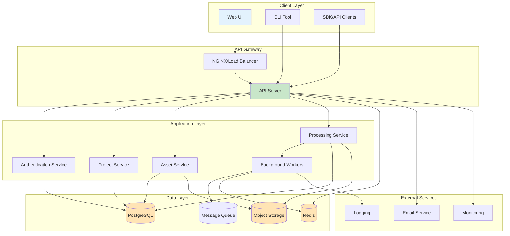

## Component Architecture

### 1. API Server

**Responsibilities**:
- HTTP request handling
- Request validation
- Authentication/Authorization
- Business logic coordination
- Response formatting

**Architecture Pattern**: Layered Architecture

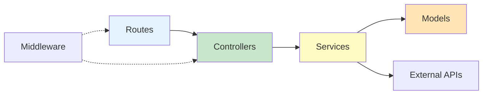

**Layers**:
1. **Routes**: Endpoint definitions
2. **Middleware**: Request processing pipeline
3. **Controllers**: Request/response handling
4. **Services**: Business logic
5. **Models**: Data access layer

**Example Flow**:
```javascript
// Route Definition
router.post('/projects', validateProject, ProjectController.create);

// Controller
async create(req, res) {
  const project = await ProjectService.create(req.body);
  res.json(project);
}

// Service
async create(data) {
  // Business logic
  const project = await Project.create(data);
  await this.notifyCreation(project);
  return project;
}

// Model
class Project extends Model {
  static async create(data) {
    return await db.projects.insert(data);
  }
}
```

### 2. Web UI Architecture

**Pattern**: Component-Based Architecture (Vue.js)

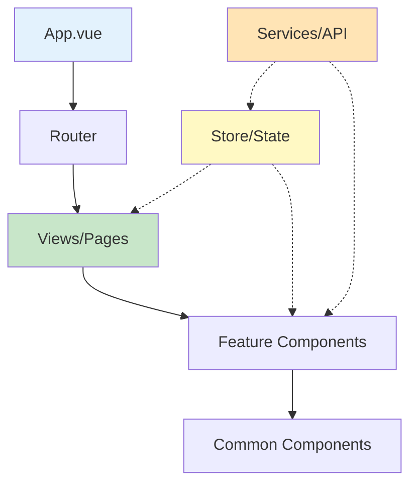

**Component Hierarchy**:
```
App.vue
├── Layout Components
│   ├── Header
│   ├── Sidebar
│   └── Footer
├── Page/View Components
│   ├── Dashboard
│   ├── ProjectList
│   └── AssetManager
└── Feature Components
    ├── ProjectCard
    ├── AssetUploader
    └── ProcessingStatus
```

**State Management**:
```javascript
// Store Structure
store/
├── index.js              // Root store
└── modules/
    ├── auth.js          // Authentication state
    ├── projects.js      // Projects state
    └── assets.js        // Assets state
```

### 3. Background Worker Architecture

**Pattern**: Queue-Based Processing

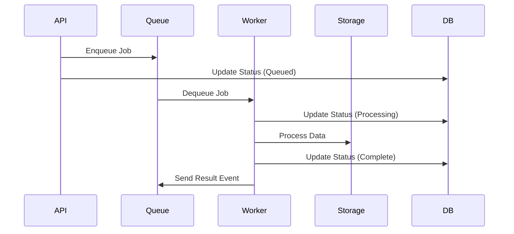

**Worker Types**:
1. **Processing Workers**: Data processing tasks
2. **Export Workers**: Data export operations
3. **Notification Workers**: Email/push notifications
4. **Cleanup Workers**: Maintenance tasks

**Job Processing**:
```javascript
class ProcessingWorker {
  async process(job) {
    try {
      await this.updateStatus(job.id, 'processing');
      const result = await this.executeJob(job);
      await this.updateStatus(job.id, 'completed');
      return result;
    } catch (error) {
      await this.handleError(job, error);
      throw error;
    }
  }
}
```

## Data Architecture

### Database Schema

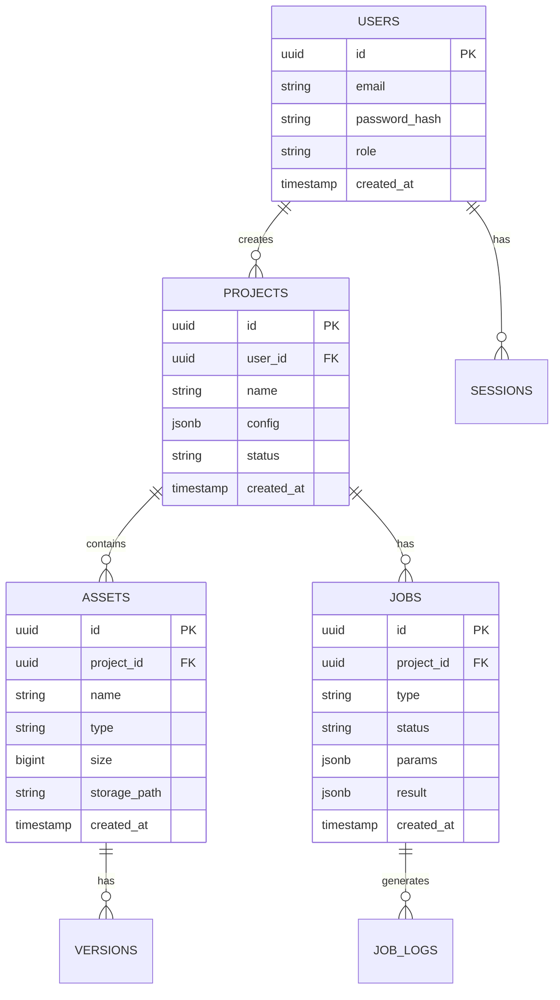

### Data Flow

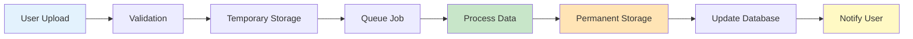

## Security Architecture

### Authentication Flow

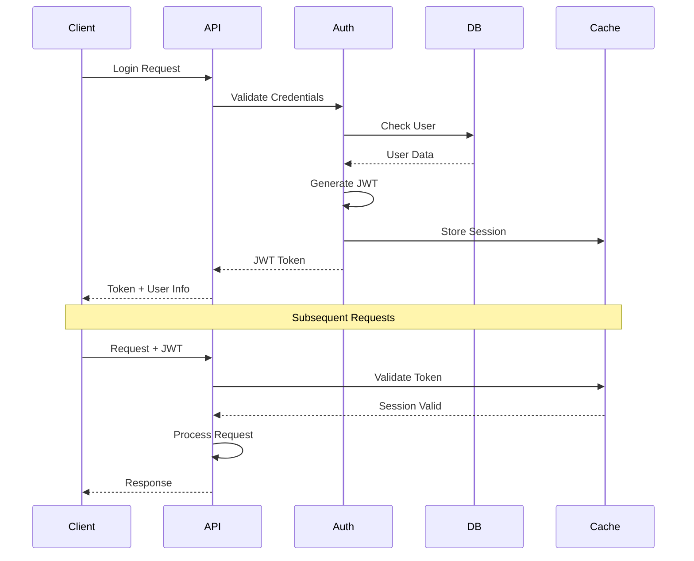

### Authorization

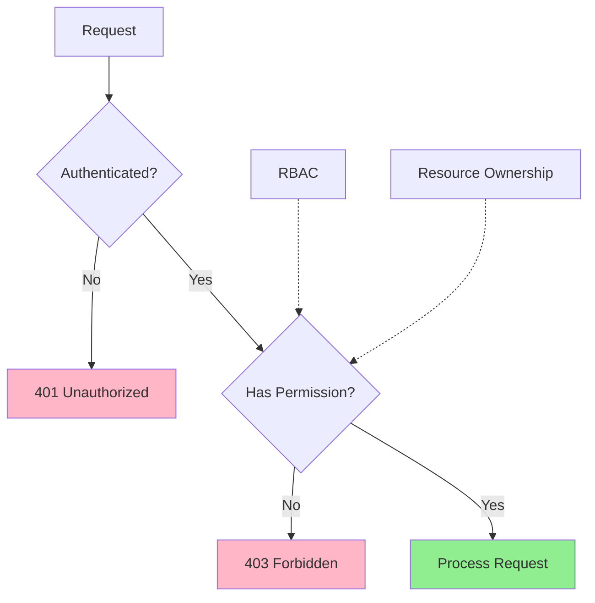

**Permission Model**:
```javascript
// Role-Based Access Control
const permissions = {
  admin: ['*'],
  operator: ['projects.*', 'assets.*', 'users.read'],
  user: ['projects.own', 'assets.own'],
  guest: ['*.read']
};

// Check permission
function hasPermission(user, action, resource) {
  const userPerms = permissions[user.role];
  return userPerms.includes(action) ||
         userPerms.includes(`${resource}.*`) ||
         userPerms.includes('*');
}
```

## Scalability Patterns

### Horizontal Scaling

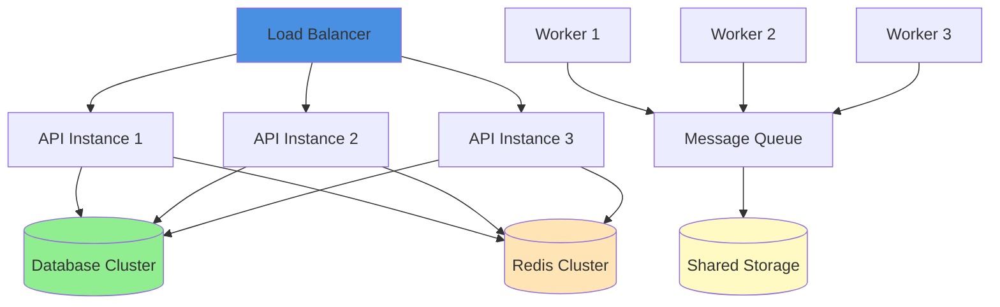

### Caching Strategy

**Multi-Level Caching**:
```javascript
// Level 1: In-Memory (Fast, Limited)
const memoryCache = new Map();

// Level 2: Redis (Fast, Distributed)
const redisCache = new Redis();

// Level 3: Database (Slow, Authoritative)
const database = new Database();

async function getData(key) {
  // Try memory cache
  if (memoryCache.has(key)) {
    return memoryCache.get(key);
  }

  // Try Redis cache
  const cached = await redisCache.get(key);
  if (cached) {
    memoryCache.set(key, cached);
    return cached;
  }

  // Fetch from database
  const data = await database.get(key);
  await redisCache.set(key, data, 'EX', 3600);
  memoryCache.set(key, data);
  return data;
}
```

## Integration Patterns

### External Service Integration

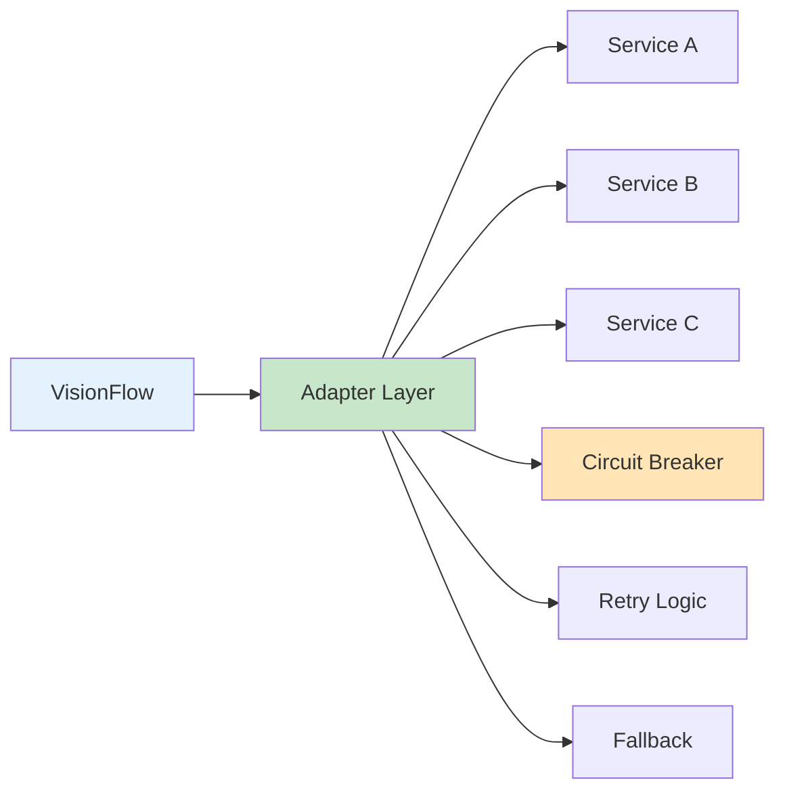

**Adapter Pattern**:
```javascript
// Storage Adapter Interface
class IStorageAdapter {
  async upload(file, path) { throw new Error('Not implemented'); }
  async download(path) { throw new Error('Not implemented'); }
  async delete(path) { throw new Error('Not implemented'); }
}

// S3 Implementation
class S3Adapter extends IStorageAdapter {
  async upload(file, path) {
    return await s3.putObject({
      Bucket: this.bucket,
      Key: path,
      Body: file
    });
  }
}

// Local Implementation
class LocalAdapter extends IStorageAdapter {
  async upload(file, path) {
    return await fs.writeFile(path, file);
  }
}

// Usage
const storage = config.storage === 's3'
  ? new S3Adapter()
  : new LocalAdapter();
```

## Event-Driven Architecture

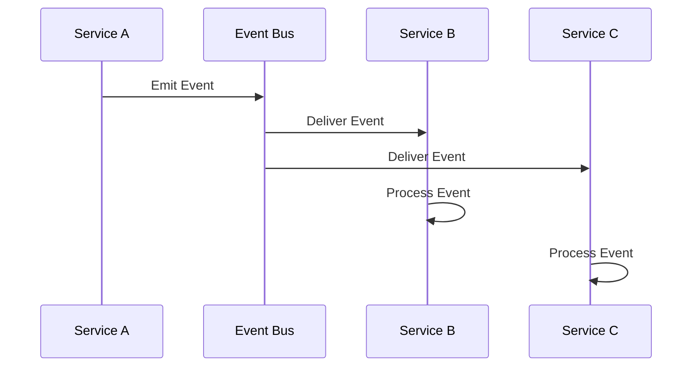

**Event System**:
```javascript
class EventBus {
  constructor() {
    this.subscribers = new Map();
  }

  subscribe(event, handler) {
    if (!this.subscribers.has(event)) {
      this.subscribers.set(event, []);
    }
    this.subscribers.get(event).push(handler);
  }

  async emit(event, data) {
    const handlers = this.subscribers.get(event) || [];
    await Promise.all(handlers.map(h => h(data)));
  }
}

// Usage
eventBus.subscribe('project.created', async (project) => {
  await notificationService.sendEmail(project.owner, 'Project created');
});

eventBus.emit('project.created', project);
```

## Deployment Architecture

### Production Deployment

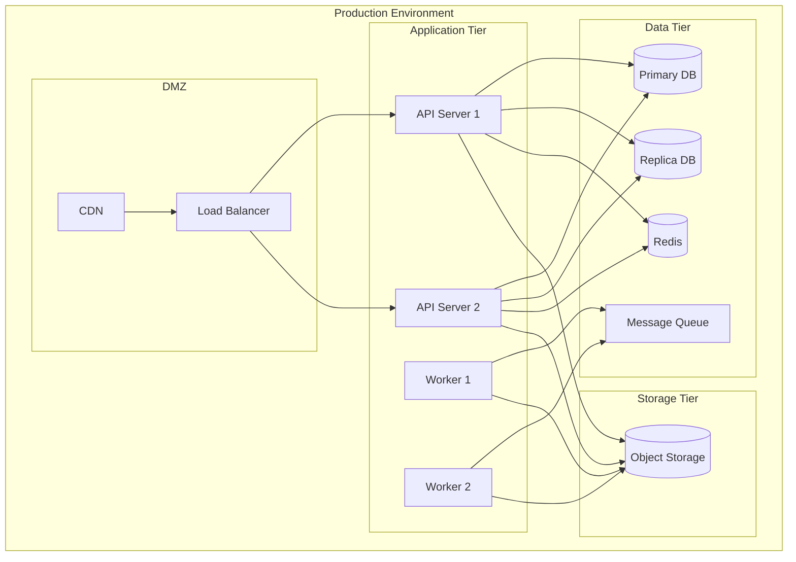

## Performance Optimization

### Request Lifecycle Optimization

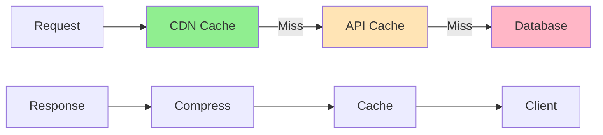

### Database Optimization

**Indexing Strategy**:
```sql
-- Frequently queried columns
CREATE INDEX idx-projects-user-id ON projects(user-id);
CREATE INDEX idx-assets-project-id ON assets(project-id);

-- Composite indexes for common queries
CREATE INDEX idx-projects-user-status ON projects(user-id, status);

-- Partial indexes for specific queries
CREATE INDEX idx-active-jobs ON jobs(created-at)
WHERE status = 'processing';
```

## Monitoring & Observability

### Metrics Collection

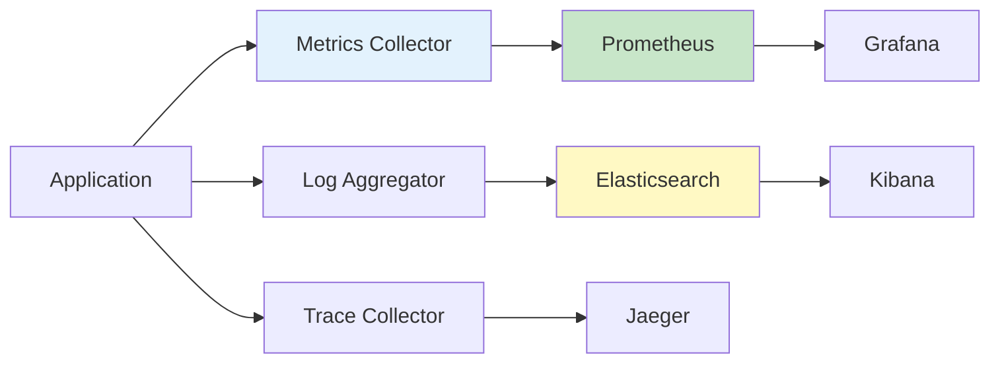

## Design Principles

1. **Single Responsibility**: Each module has one reason to change
2. **Dependency Inversion**: Depend on abstractions, not implementations
3. **Open/Closed**: Open for extension, closed for modification
4. **Interface Segregation**: Many specific interfaces vs. one general
5. **DRY**: Don't Repeat Yourself
6. **KISS**: Keep It Simple, Stupid
7. **YAGNI**: You Aren't Gonna Need It

---

---

## Related Documentation

- [Deprecated Patterns Archive](README.md)
- [Hexagonal Architecture Ports - Overview](../../explanations/architecture/ports/01-overview.md)
- [KnowledgeGraphRepository Port](../../explanations/architecture/ports/03-knowledge-graph-repository.md)
- [Settings API Authentication](../../guides/features/settings-authentication.md)
- [Ontology Storage Architecture](../../explanations/architecture/ontology-storage-architecture.md)

## Next Steps (OBSOLETE LINKS - DO NOT FOLLOW)

❌ **These links are from the old, wrong documentation. For current documentation:**
- Learn about [Current Architecture](/docs/ARCHITECTURE_OVERVIEW.md)
- Review [Testing Strategy](/docs/guides/developer/testing-guide.md)
- Understand [Contributing Guidelines](/docs/guides/contributing.md)
