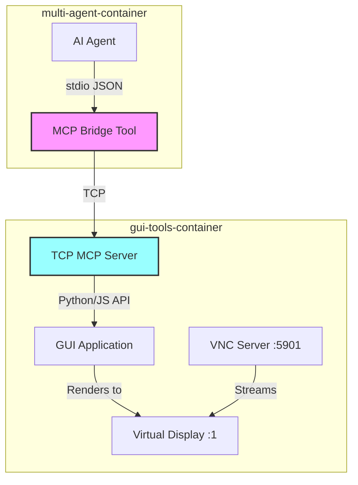
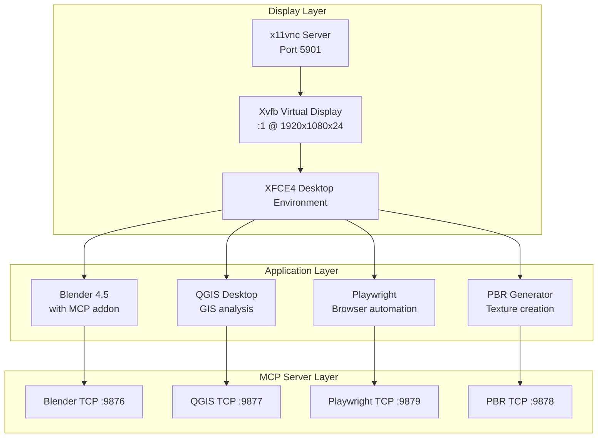
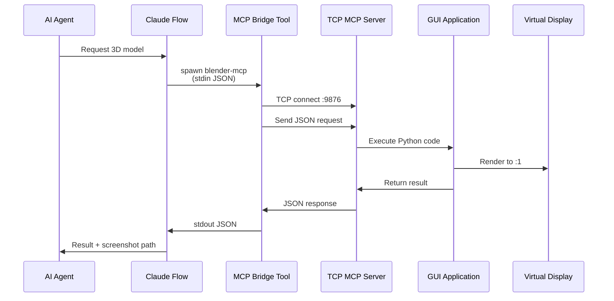

# Working with the GUI Sandbox

[← Documentation Home](../../../README.md) > Working with GUI Sandbox

This guide explains how to use the GUI sandbox environment to enable AI agents to interact with professional GUI applications through the Model Context Protocol (MCP). The GUI sandbox provides a containerised environment where agents can control tools like Blender, QGIS, Playwright, and PBR Generator for complex visual and spatial tasks.

## Table of Contents

1. [GUI Sandbox Overview](#gui-sandbox-overview)
2. [Purpose and Architecture](#purpose-and-architecture)
3. [Available GUI Tools](#available-gui-tools)
4. [VNC Access](#vnc-access)
5. [How Agents Use GUI Tools via MCP](#how-agents-use-gui-tools-via-mcp)
6. [Tool Reference](#tool-reference)
7. [Troubleshooting](#troubleshooting)

## GUI Sandbox Overview

The GUI sandbox is a specialised Docker container (`gui-tools-container`) that provides a complete desktop environment with professional GUI applications. It runs alongside the main multi-agent container and exposes these applications to AI agents through MCP bridge tools.

### What is the GUI Sandbox For?

The GUI sandbox serves three primary purposes:

1. **Visual Application Control**: Enables AI agents to programmatically control GUI applications without human intervention
2. **Resource Isolation**: Separates resource-intensive GUI applications from the core agent orchestration system
3. **Visual Debugging**: Provides VNC access for humans to observe and debug agent interactions with GUI tools

### Relationship with MCP Tools

The GUI sandbox works in tandem with MCP bridge tools in the multi-agent container:



**Key Points**:
- MCP bridge tools in `multi-agent-container` communicate with TCP servers in `gui-tools-container`
- TCP servers translate MCP requests into GUI application API calls
- All GUI applications render to a virtual display (Xvfb) accessible via VNC
- For detailed MCP tool architecture, see multi-agent-docker documentation

## Purpose and Architecture

### Container Architecture

The GUI sandbox uses a layered architecture optimised for both automation and visual access:



### System Integration

For complete multi-agent architecture documentation, see:
- Multi-Agent Docker Architecture (see project architecture docs)
- MCP Tool Reference (see multi-agent-docker documentation)

## Available GUI Tools

The GUI sandbox provides four primary tool categories, each accessible via MCP:

### 1. Blender (3D Modelling and Rendering)

**Port**: 9876
**Status**: ⏳ GUI-dependent
**Capabilities**:
- Full 3D modelling and scene creation
- Material and texture application
- Animation and rigging
- Rendering (Cycles and Eevee)
- Geometry nodes and procedural generation
- PolyHaven asset integration
- Viewport screenshot capture

**Use Cases**:
- Creating 3D visualisations for knowledge graphs
- Generating synthetic training data
- Procedural asset creation
- Architectural visualisation

### 2. QGIS (Geospatial Analysis)

**Port**: 9877
**Status**: ⏳ GUI-dependent
**Capabilities**:
- Loading and processing spatial data (shapefiles, GeoJSON, etc.)
- Spatial analysis algorithms (buffer, intersection, union)
- Map styling and cartography
- Coordinate system transformations
- Raster and vector processing
- Map export to various formats

**Use Cases**:
- Geographical data visualisation in knowledge graphs
- Spatial relationship analysis
- Map generation for reports
- Geospatial feature extraction

### 3. PBR Generator (Texture Creation)

**Port**: 9878
**Status**: ⏳ GUI-dependent
**Capabilities**:
- Physically-based rendering (PBR) texture generation
- Material types: wood, metal, stone, fabric, leather, concrete, brick, tiles
- Multiple texture map types: diffuse, normal, roughness, metallic, ambient occlusion
- Configurable resolutions (512×512 to 4096×4096)
- Direct integration with Blender materials

**Use Cases**:
- Creating realistic materials for 3D models
- Generating texture sets for game assets
- Material library creation
- Photorealistic rendering preparation

### 4. Playwright (Browser Automation)

**Port**: 9879
**Status**: ✅ Working
**Capabilities**:
- Automated web browsing and interaction
- Screenshot and PDF capture
- Form filling and submission
- JavaScript execution in browser context
- Multi-browser support (Chromium, Firefox, WebKit)
- Network request interception
- Visual regression testing

**Use Cases**:
- Web scraping for knowledge graph population
- Automated testing of web interfaces
- Documentation screenshot generation
- Dynamic content extraction

### Tool Status Legend

- **✅ Working**: Available immediately after container startup
- **⏳ GUI-dependent**: Shows soft-fail timeout warnings until GUI services fully initialise (30-60 seconds)

**Note**: GUI-dependent tools automatically recover once the GUI container is ready. Timeout warnings during startup are expected behaviour.

## VNC Access

VNC provides visual access to the GUI sandbox desktop, enabling you to observe agent interactions and debug GUI tool operations.

### Connecting via VNC

**Method 1: VNC Client**

```bash
# Using a VNC viewer application
vncviewer localhost:5901

# Or with RealVNC
open vnc://localhost:5901

# Or with TigerVNC
vncviewer localhost:5901
```

**Connection Details**:
- **Host**: `localhost` (from host machine) or `gui-tools-service` (from multi-agent container)
- **Port**: `5901`
- **Password**: None (authentication disabled for local development)
- **Display**: `:1`
- **Resolution**: 1920×1080×24

**Method 2: SSH Tunnel (Remote Access)**

If accessing from a remote machine:

```bash
# Create SSH tunnel
ssh -L 5901:localhost:5901 user@remote-host

# Then connect VNC client to localhost:5901
vncviewer localhost:5901
```

### What You'll See

When connected via VNC, you'll observe:

1. **XFCE4 Desktop**: A lightweight desktop environment
2. **Running Applications**: Blender, QGIS, and other GUI tools
3. **Live Agent Interactions**: Real-time visual feedback as agents control applications
4. **Browser Windows**: Playwright-controlled browser instances

### Using VNC for Debugging

VNC is particularly useful for:

- **Visual Verification**: Confirm that agent commands produce expected visual results
- **Error Diagnosis**: See GUI error dialogues and application states
- **Performance Monitoring**: Observe rendering and processing in real-time
- **Manual Intervention**: Take control when automation encounters issues

## How Agents Use GUI Tools via MCP

### Request Flow

When an AI agent needs to use a GUI tool, the request flows through multiple layers:



### Bridge Tool Communication Protocol

Each MCP bridge tool follows this pattern:

1. **Initialisation**: Bridge tool spawned by Claude Flow with `stdio` pipes
2. **Connection**: Bridge establishes TCP connection to GUI container service
3. **Translation**: Converts `stdio` JSON to TCP JSON protocol
4. **Execution**: TCP server executes command in GUI application context
5. **Response**: Result data flows back through the chain
6. **Cleanup**: Connection closed after response or timeout

### Example: Agent Creating a 3D Model

Here's how an agent would create and texture a 3D cube:

**Step 1: Agent requests 3D model creation**

```javascript
// Agent's high-level intent
"Create a 3D cube with gold material and render it"
```

**Step 2: Claude Flow spawns blender-mcp bridge**

```bash
# Internally executed by Claude Flow
node /workspace/scripts/mcp-blender-client.js
```

**Step 3: Bridge sends request to Blender TCP server**

```json
{
  "tool": "execute-code",
  "params": {
    "code": "import bpy\nbpy.ops.mesh.primitive-cube-add(size=2, location=(0, 0, 1))"
  }
}
```

**Step 4: Blender addon executes code in GUI context**

```python
# Executed in Blender's Python environment
import bpy
bpy.ops.mesh.primitive-cube-add(size=2, location=(0, 0, 1))
```

**Step 5: Response flows back to agent**

```json
{
  "success": true,
  "result": "Cube created successfully",
  "scene-info": {
    "objects": ["Camera", "Light", "Cube"],
    "active-object": "Cube"
  }
}
```

### MCP Tool Configuration

All GUI tools are defined in `/workspace/.mcp.json`:

```json
{
  "tools": {
    "blender-mcp": {
      "command": "node",
      "args": ["-u", "./scripts/mcp-blender-client.js"],
      "description": "3D modelling and rendering via Blender"
    },
    "qgis-mcp": {
      "command": "python3",
      "args": ["-u", "./mcp-tools/qgis-mcp.py"],
      "description": "Geospatial analysis via QGIS"
    },
    "playwright-mcp": {
      "command": "node",
      "args": ["./scripts/playwright-mcp-client.js"],
      "description": "Browser automation via Playwright"
    },
    "pbr-generator-mcp": {
      "command": "python3",
      "args": ["-u", "./mcp-tools/pbr-mcp-client.py"],
      "description": "PBR texture generation"
    }
  }
}
```

For complete tool configuration details, see multi-agent-docker documentation.

## Tool Reference

### Blender MCP Tool

**Primary Methods**:

| Method | Purpose | Key Parameters |
|--------|---------|----------------|
| `get-scene-info` | Retrieve current scene state | None |
| `get-object-info` | Get object properties | `object-name` |
| `execute-code` | Run arbitrary Python code | `code` |
| `get-viewport-screenshot` | Capture viewport image | `filepath` |
| `download-polyhaven-asset` | Import PolyHaven assets | `asset-name`, `asset-type`, `resolution` |

**Example Usage**:

```bash
# Create a procedural scene
./mcp-helper.sh run-tool blender-mcp '{
  "tool": "execute-code",
  "params": {
    "code": "
import bpy

# Clear scene
bpy.ops.object.select-all(action=\"SELECT\")
bpy.ops.object.delete()

# Create ground plane
bpy.ops.mesh.primitive-plane-add(size=10, location=(0, 0, 0))

# Create sphere with subdivision
bpy.ops.mesh.primitive-uv-sphere-add(location=(0, 0, 1))
sphere = bpy.context.object
mod = sphere.modifiers.new(\"Subsurf\", \"SUBSURF\")
mod.levels = 2

# Add material
mat = bpy.data.materials.new(\"Gold\")
mat.use-nodes = True
bsdf = mat.node-tree.nodes[\"Principled BSDF\"]
bsdf.inputs[0].default-value = (1.0, 0.766, 0.336, 1.0)
bsdf.inputs[4].default-value = 1.0
bsdf.inputs[7].default-value = 0.1
sphere.data.materials.append(mat)

# Setup camera
bpy.ops.object.camera-add(location=(7, -7, 5))
camera = bpy.context.object
camera.rotation-euler = (1.1, 0, 0.785)
bpy.context.scene.camera = camera

# Add sun light
bpy.ops.object.light-add(type=\"SUN\", location=(5, 5, 10))
    "
  }
}'

# Capture the result
./mcp-helper.sh run-tool blender-mcp '{
  "tool": "get-viewport-screenshot",
  "params": {
    "filepath": "/workspace/renders/golden-sphere.png"
  }
}'
```

### QGIS MCP Tool

**Primary Methods**:

| Method | Purpose | Key Parameters |
|--------|---------|----------------|
| `load-layer` | Load spatial data | `path`, `name` |
| `execute-algorithm` | Run processing algorithm | `algorithm`, `parameters` |
| `style-layer` | Apply visual styling | `layer-name`, `style` |
| `export-map` | Export map as image | `output-path`, `width`, `height`, `dpi` |

**Example Usage**:

```bash
# Load and analyse spatial data
./mcp-helper.sh run-tool qgis-mcp '{
  "tool": "load-layer",
  "params": {
    "path": "/workspace/data/cities.geojson",
    "name": "Major Cities"
  }
}'

# Create buffer zones
./mcp-helper.sh run-tool qgis-mcp '{
  "tool": "execute-algorithm",
  "params": {
    "algorithm": "native:buffer",
    "parameters": {
      "INPUT": "Major Cities",
      "DISTANCE": 50000,
      "OUTPUT": "/workspace/analysis/city-buffers.shp"
    }
  }
}'

# Export styled map
./mcp-helper.sh run-tool qgis-mcp '{
  "tool": "export-map",
  "params": {
    "output-path": "/workspace/maps/cities-with-buffers.png",
    "width": 1920,
    "height": 1080,
    "dpi": 300
  }
}'
```

### PBR Generator MCP Tool

**Primary Method**:

| Method | Purpose | Key Parameters |
|--------|---------|----------------|
| `generate-material` | Create PBR texture set | `material`, `resolution`, `types`, `output` |

**Available Materials**: wood, metal, stone, fabric, leather, concrete, brick, tiles

**Texture Types**: diffuse, normal, roughness, metallic, ambient-occlusion (ao)

**Example Usage**:

```bash
# Generate wood textures
./mcp-helper.sh run-tool pbr-generator-mcp '{
  "tool": "generate-material",
  "params": {
    "material": "wood",
    "resolution": "2048x2048",
    "types": ["diffuse", "normal", "roughness", "ao"],
    "output": "/workspace/textures/wood-oak"
  }
}'

# Apply to Blender object
./mcp-helper.sh run-tool blender-mcp '{
  "tool": "execute-code",
  "params": {
    "code": "
import bpy

obj = bpy.context.active-object
mat = bpy.data.materials.new(\"Wood-Oak\")
mat.use-nodes = True
nodes = mat.node-tree.nodes
links = mat.node-tree.links
bsdf = nodes[\"Principled BSDF\"]

# Load diffuse
diffuse = nodes.new(\"ShaderNodeTexImage\")
diffuse.image = bpy.data.images.load(\"/workspace/textures/wood-oak/diffuse.png\")
links.new(diffuse.outputs[0], bsdf.inputs[0])

# Load normal
normal-tex = nodes.new(\"ShaderNodeTexImage\")
normal-tex.image = bpy.data.images.load(\"/workspace/textures/wood-oak/normal.png\")
normal-map = nodes.new(\"ShaderNodeNormalMap\")
links.new(normal-tex.outputs[0], normal-map.inputs[1])
links.new(normal-map.outputs[0], bsdf.inputs[20])

# Load roughness
rough = nodes.new(\"ShaderNodeTexImage\")
rough.image = bpy.data.images.load(\"/workspace/textures/wood-oak/roughness.png\")
links.new(rough.outputs[0], bsdf.inputs[7])

obj.data.materials.append(mat)
    "
  }
}'
```

### Playwright MCP Tool

**Primary Capabilities**:

| Action | Purpose | Key Parameters |
|--------|---------|----------------|
| Navigate | Load web page | `url` |
| Screenshot | Capture page image | `path`, `full-page` |
| Click | Interact with elements | `selector` |
| Fill | Enter text in forms | `selector`, `value` |
| Evaluate | Execute JavaScript | `expression` |

**Example Usage**:

```bash
# Automated web scraping
./mcp-helper.sh run-tool playwright-mcp '{
  "method": "navigate",
  "params": {
    "url": "https://example.com/data"
  }
}'

./mcp-helper.sh run-tool playwright-mcp '{
  "method": "screenshot",
  "params": {
    "path": "/workspace/screenshots/example-page.png",
    "full-page": true
  }
}'

# Extract data with JavaScript
./mcp-helper.sh run-tool playwright-mcp '{
  "method": "evaluate",
  "params": {
    "expression": "Array.from(document.querySelectorAll(\"h2\")).map(h => h.textContent)"
  }
}'
```

## Troubleshooting

### VNC Connection Issues

**Problem**: Cannot connect to VNC server

**Solutions**:

```bash
# Check if VNC server is running
docker exec gui-tools-container ps aux | grep x11vnc

# Verify VNC port is listening
docker exec gui-tools-container netstat -tuln | grep 5901

# Check VNC server logs
docker logs gui-tools-container | grep x11vnc

# Restart GUI container
docker-compose restart gui-tools-service

# Verify port mapping
docker port gui-tools-container 5901
```

**Problem**: VNC shows black screen

**Solutions**:

```bash
# Check if Xvfb is running
docker exec gui-tools-container ps aux | grep Xvfb

# Verify DISPLAY variable
docker exec gui-tools-container bash -c "echo \$DISPLAY"

# Check X server
docker exec gui-tools-container bash -c "DISPLAY=:1 xdpyinfo | head -20"

# Restart virtual display
docker exec gui-tools-container supervisorctl restart xvfb
```

### GUI Tool Connection Issues

**Problem**: MCP bridge tools show timeout warnings

**Expected Behaviour**: GUI-dependent tools display soft-fail warnings for 30-60 seconds during container startup. This is normal.

**Solutions**:

```bash
# Wait for GUI services to initialise
docker logs gui-tools-container | tail -20

# Check GUI container health
docker inspect gui-tools-container | jq '.[0].State.Health'

# Verify all TCP servers are listening
docker exec gui-tools-container netstat -tuln | grep -E "9876|9877|9878|9879"

# Manual TCP test
telnet localhost 9876  # Blender
telnet localhost 9877  # QGIS
telnet localhost 9878  # PBR Generator
telnet localhost 9879  # Playwright
```

**Problem**: Bridge tool reports "Connection refused"

**Solutions**:

```bash
# Check if specific service is running
docker exec gui-tools-container ps aux | grep blender
docker exec gui-tools-container ps aux | grep qgis

# Restart specific MCP server
docker exec gui-tools-container supervisorctl restart blender-mcp-server

# View service logs
docker logs gui-tools-container | grep "Blender MCP"

# Check firewall rules (if applicable)
docker exec gui-tools-container iptables -L -n
```

### Rendering and Display Issues

**Problem**: Blender renders are black or corrupted

**Solutions**:

```bash
# Verify OpenGL support
docker exec gui-tools-container bash -c "DISPLAY=:1 glxinfo | grep OpenGL"

# Check GPU access (if using NVIDIA)
docker exec gui-tools-container nvidia-smi

# Test render in Blender directly
docker exec gui-tools-container bash -c "
DISPLAY=:1 /opt/blender-4.5/blender --background --python-expr '
import bpy
bpy.ops.mesh.primitive-cube-add()
bpy.context.scene.render.filepath = \"/tmp/test.png\"
bpy.ops.render.render(write-still=True)
'
"

# Check render output
docker exec gui-tools-container ls -lah /tmp/test.png
```

**Problem**: QGIS fails to load data

**Solutions**:

```bash
# Verify file permissions
docker exec gui-tools-container ls -la /workspace/data/

# Check QGIS plugins
docker exec gui-tools-container bash -c "
DISPLAY=:1 qgis --version
"

# Test QGIS from command line
docker exec gui-tools-container bash -c "
DISPLAY=:1 qgis --project /workspace/test.qgz
"
```

### Performance Issues

**Problem**: GUI applications are slow or unresponsive

**Solutions**:

```bash
# Check resource usage
docker stats gui-tools-container

# Increase container resources in docker-compose.yml
# Edit these values:
# mem-limit: 16g
# cpus: "4"

# Reduce display resolution (in gui-tools-container/startup.sh)
# Change: Xvfb :1 -screen 0 1920x1080x24
# To: Xvfb :1 -screen 0 1280x720x24

# Monitor process CPU usage
docker exec gui-tools-container top -b -n 1 | head -20
```

### Network and Port Issues

**Problem**: Cannot reach GUI services from multi-agent container

**Solutions**:

```bash
# Verify network connectivity
docker exec multi-agent-container ping -c 3 gui-tools-service

# Check DNS resolution
docker exec multi-agent-container nslookup gui-tools-service

# Verify environment variables
docker exec multi-agent-container env | grep -E "BLENDER|QGIS|PBR|PLAYWRIGHT"

# Test direct TCP connection
docker exec multi-agent-container bash -c "
echo '{\"tool\":\"get-scene-info\"}' | nc gui-tools-service 9876
"

# Check Docker network
docker network inspect docker-ragflow
```

### Debug Mode

Enable detailed logging for troubleshooting:

```bash
# Enable debug mode in environment
export DEBUG=1
export MCP-LOG-LEVEL=debug

# Restart containers with debug logging
docker-compose down
docker-compose up -d

# View detailed logs
docker logs -f gui-tools-container
docker logs -f multi-agent-container

# Enable MCP tool debug output
DEBUG=1 ./mcp-helper.sh run-tool blender-mcp '{"tool":"get-scene-info"}'
```

### Common Error Messages

| Error | Cause | Solution |
|-------|-------|----------|
| `DISPLAY :1 cannot be opened` | Xvfb not running | Check Xvfb process, restart container |
| `Connection timeout` | GUI services still initialising | Wait 60s, services auto-recover |
| `TCP connection refused` | MCP server not listening | Verify port mapping and service status |
| `Blender addon not found` | Addon installation failed | Check addon directory and permissions |
| `QGIS plugin error` | Missing dependencies | Verify QGIS installation and plugins |
| `Playwright browser not found` | Browser binaries missing | Check PLAYWRIGHT-BROWSERS-PATH |

## Related Documentation

- Multi-Agent Docker Architecture - Complete system architecture (see project docs)
- MCP Tools Reference - Detailed tool specifications (see multi-agent-docker docs)
- Development Workflow - Development best practices (see project guides)
- Orchestrating Agents - Agent coordination patterns (see project guides)
- Extending the System - Adding custom tools (see project guides)

---

*[Back to Documentation Home](../../../README.md)*
