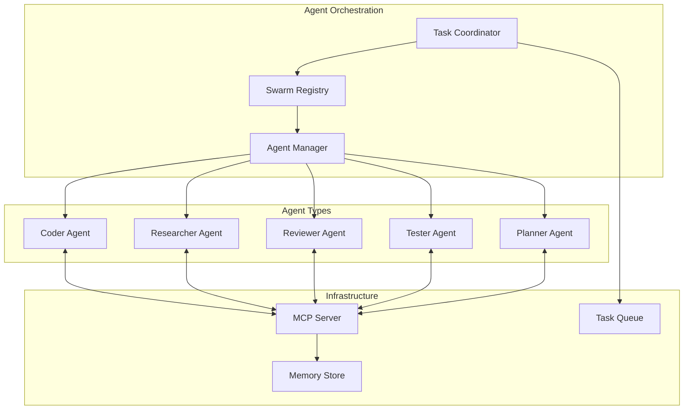

# Agentic Workers

The VisionFlow platform implements a sophisticated multi-agent system that enables distributed AI collaboration through the Model Context Protocol (MCP). This document explores the agent architecture, coordination patterns, and implementation details.

## Agent System Architecture

### Overview

The agent system consists of autonomous AI workers that collaborate to solve complex tasks. Each agent has specialized capabilities and can coordinate with others through various swarm patterns.



## Core Components

### 1. MCP (Model Context Protocol) Integration

The MCP server provides a standardized interface for agent communication:

```javascript
// MCP Server Implementation
class MCPServer {
  constructor() {
    this.agents = new Map();
    this.tools = new Map();
    this.memory = new MemoryStore();
  }
  
  // Tool registration for agents
  registerTool(name, handler) {
    this.tools.set(name, {
      name,
      description: handler.description,
      parameters: handler.parameters,
      execute: handler.execute
    });
  }
  
  // Agent lifecycle management
  async createAgent(config) {
    const agent = new Agent(config);
    this.agents.set(agent.id, agent);
    return agent;
  }
}
```

#### Protocol Features
- **JSON-RPC 2.0**: Standard protocol for method calls
- **Persistent TCP**: Maintains connections for low latency
- **Tool Discovery**: Agents can discover available tools
- **Memory Access**: Shared memory for collaboration

### 2. Agent Types and Specialisations

#### Core Agents

**Planner Agent**
- Breaks down complex tasks into subtasks
- Creates execution strategies
- Coordinates other agents
- Monitors progress

**Coder Agent**
- Implements code solutions
- Refactors existing code
- Generates tests
- Handles multiple languages

**Researcher Agent**
- Gathers information from sources
- Analyses documentation
- Synthesises findings
- Maintains knowledge base

**Reviewer Agent**
- Code review and quality checks
- Security vulnerability scanning
- Best practices enforcement
- Performance analysis

**Tester Agent**
- Unit test generation
- Integration testing
- Performance benchmarking
- Bug reproduction

#### Specialized Agents

**Byzantine Coordinator**
- Consensus mechanisms
- Fault tolerance
- Distributed decision making
- Conflict resolution

**SPARC Agents** (Specification, Pseudocode, Architecture, Refinement, Code)
- Systematic problem decomposition
- Formal specification generation
- Architecture design
- Iterative refinement

### 3. Swarm Coordination Patterns

#### Hierarchical Swarms
```
Task Coordinator
├── Planning Swarm
│   ├── Strategic Planner
│   ├── Tactical Planner
│   └── Resource Allocator
├── Implementation Swarm
│   ├── Backend Coders
│   ├── Frontend Coders
│   └── Database Specialists
└── Quality Swarm
    ├── Reviewers
    ├── Testers
    └── Security Auditors
```

#### Mesh Coordination
- Peer-to-peer agent communication
- No single point of failure
- Dynamic leadership
- Emergent behaviour

#### Adaptive Swarms
- Dynamic agent allocation
- Performance-based scaling
- Task-specific optimisation
- Learning from outcomes

## Implementation Details

### 1. Agent Creation and Lifecycle

```typescript
// Agent creation in ClaudeFlowActor
pub async fn create_swarm(
    &mut self,
    swarm_config: SwarmConfig,
) -> Result<SwarmId, Error> {
    // Generate unique swarm ID
    let swarm_id = generate_swarm_id();
    
    // Initialise agents based on configuration
    let agents = match swarm_config.pattern {
        SwarmPattern::Hierarchical => create_hierarchical_agents(),
        SwarmPattern::Mesh => create_mesh_agents(),
        SwarmPattern::Adaptive => create_adaptive_agents(),
    };
    
    // Register with MCP server
    for agent in agents {
        self.mcp_client.register_agent(agent).await?;
    }
    
    // Store swarm metadata
    self.swarms.insert(swarm_id.clone(), SwarmInfo {
        agents,
        config: swarm_config,
        created_at: SystemTime::now(),
    });
    
    Ok(swarm_id)
}
```

### 2. Task Distribution

The system implements sophisticated task distribution mechanisms:

```rust
// Task distribution algorithm
impl TaskDistributor {
    async fn distribute_task(&self, task: Task) -> Result<(), Error> {
        // Analyze task requirements
        let requirements = self.analyse_requirements(&task);
        
        // Find suitable agents
        let candidates = self.find_capable_agents(&requirements);
        
        // Apply distribution strategy
        match task.distribution_strategy {
            Strategy::RoundRobin => {
                self.round_robin_distribute(task, candidates).await
            }
            Strategy::LoadBased => {
                self.load_based_distribute(task, candidates).await
            }
            Strategy::CapabilityOptimal => {
                self.capability_optimal_distribute(task, candidates).await
            }
        }
    }
}
```

### 3. Inter-Agent Communication

Agents communicate through multiple channels:

#### Direct Messaging
```javascript
// Agent-to-agent communication
class AgentCommunication {
  async sendMessage(fromAgent, toAgent, message) {
    const envelope = {
      id: generateId(),
      from: fromAgent.id,
      to: toAgent.id,
      timestamp: Date.now(),
      type: message.type,
      content: message.content,
      replyTo: message.replyTo
    };
    
    return this.messageQueue.publish(envelope);
  }
}
```

#### Shared Memory
```javascript
// Collaborative memory access
class SharedMemory {
  async store(agentId, key, value, metadata = {}) {
    const entry = {
      key,
      value,
      agentId,
      timestamp: Date.now(),
      metadata,
      version: this.getNextVersion(key)
    };
    
    await this.vectorStore.insert(entry);
    this.broadcastUpdate(key, entry);
  }
  
  async retrieve(key, options = {}) {
    const results = await this.vectorStore.search(key, options);
    return this.mergeVersions(results);
  }
}
```

### 4. Consensus Mechanisms

For multi-agent decision making:

```typescript
// Byzantine fault-tolerant consensus
class ByzantineConsensus {
  async proposeDecision(proposal: Proposal): Promise<Decision> {
    // Phase 1: Broadcast proposal
    const votes = await this.gatherVotes(proposal);
    
    // Phase 2: Verify votes
    const validVotes = this.verifyVotes(votes);
    
    // Phase 3: Reach consensus
    if (validVotes.length >= this.quorumSize()) {
      return this.finalizeDecision(validVotes);
    }
    
    // Handle split decisions
    return this.handleSplitDecision(validVotes);
  }
}
```

## Agent Coordination Patterns

### 1. Pipeline Pattern
Agents work in sequence, each processing the output of the previous:

```
Research → Design → Implementation → Testing → Deployment
```

### 2. Parallel Pattern
Multiple agents work on independent subtasks simultaneously:

```
Task
├── Frontend Development
├── Backend Development
├── Database Design
└── API Documentation
```

### 3. Recursive Pattern
Agents spawn sub-agents for complex subtasks:

```
Main Task
├── Subtask A
│   ├── Sub-subtask A1
│   └── Sub-subtask A2
└── Subtask B
    └── Sub-subtask B1
```

## Performance and Optimisation

### Load Balancing
```rust
// Adaptive load balancing
impl LoadBalancer {
    fn select_agent(&self, task: &Task) -> Option<AgentId> {
        let agents = self.get_available_agents();
        
        // Score each agent based on:
        // - Current load
        // - Capability match
        // - Historical performance
        // - Resource availability
        
        agents.into_iter()
            .map(|agent| (agent, self.score_agent(&agent, task)))
            .max_by_key(|(_, score)| *score)
            .map(|(agent, _)| agent.id)
    }
}
```

### Caching and Memoisation
- Result caching for repeated tasks
- Shared knowledge base
- Pattern recognition
- Learning from history

## Monitoring and Telemetry

### Agent Performance Metrics
```typescript
interface AgentMetrics {
  taskCompletionRate: number;
  averageTaskTime: Duration;
  errorRate: number;
  resourceUtilisation: ResourceMetrics;
  collaborationScore: number;
}

// Real-time monitoring
class AgentMonitor {
  collectMetrics(agentId: string): AgentMetrics {
    return {
      taskCompletionRate: this.calculateCompletionRate(agentId),
      averageTaskTime: this.calculateAverageTime(agentId),
      errorRate: this.calculateErrorRate(agentId),
      resourceUtilisation: this.getResourceMetrics(agentId),
      collaborationScore: this.calculateCollaborationScore(agentId)
    };
  }
}
```

### Swarm Health Monitoring
- Agent availability tracking
- Communication latency measurement
- Consensus efficiency metrics
- Resource pool monitoring

## Security Considerations

### Agent Isolation
- Sandboxed execution environments
- Resource quotas
- Network segmentation
- Capability-based access control

### Communication Security
- Encrypted agent-to-agent messages
- Signed proposals for consensus
- Audit trail of all decisions
- Anomaly detection

## Best Practices

### 1. Task Design
- Clear, atomic task definitions
- Explicit success criteria
- Proper error handling
- Timeout specifications

### 2. Agent Configuration
- Appropriate capability assignment
- Resource limit setting
- Fallback strategies
- Monitoring setup

### 3. Swarm Patterns
- Choose patterns based on task type
- Consider fault tolerance needs
- Plan for scalability
- Monitor emergent behaviour

## Future Directions

### Advanced Capabilities
1. **Self-Organizing Swarms**: Agents that dynamically reorganise based on performance
2. **Meta-Learning**: Agents that learn optimal coordination strategies
3. **Cross-Domain Transfer**: Knowledge sharing between different task domains
4. **Predictive Scaling**: Anticipatory agent allocation

### Research Areas
- Quantum-inspired consensus algorithms
- Neuromorphic agent architectures
- Federated learning integration
- Homomorphic computation for privacy

## Conclusion

The VisionFlow agent system represents a sophisticated approach to distributed AI collaboration. By combining specialized agents, flexible coordination patterns, and robust infrastructure, the system can tackle complex tasks that would be impossible for individual agents. The architecture's emphasis on fault tolerance, scalability, and performance ensures reliable operation in production environments.