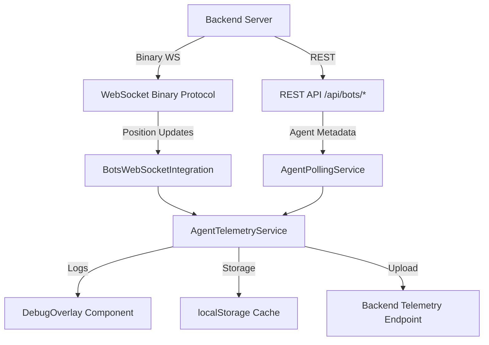

# Client Telemetry System Analysis

## Overview
The client implements a comprehensive telemetry system for monitoring agent visualization and system performance. The telemetry data flows from server to client through two primary channels: WebSocket binary protocol for high-frequency position updates and REST API for agent metadata.

## Architecture

### Core Components

#### 1. AgentTelemetryService (`/src/telemetry/AgentTelemetry.ts`)
- **Singleton service** managing all telemetry collection
- **Session tracking** with unique session IDs
- **Performance monitoring** (frame rates, memory usage, error counts)
- **Offline storage** with localStorage backup
- **Auto-upload** functionality every 30 seconds

#### 2. Binary WebSocket Protocol (`/src/services/BinaryWebSocketProtocol.ts`)
- **High-frequency streaming** for agent position/velocity updates
- **Bandwidth-efficient** binary format (19 bytes per position update, 47 bytes per full agent state)
- **Throttled updates** (16ms for positions, 100ms for metadata)
- **Multi-purpose protocol** supporting:
  - Position updates (Client ↔ Server)
  - Agent state streaming (Server → Client)
  - Voice data chunks (Bi-directional)
  - SSSP pathfinding data (Server → Client)
  - Control messages and heartbeats

#### 3. REST API Endpoints
The telemetry service polls these endpoints:
- **`/api/bots/status`** - Agent health and status telemetry
- **`/api/bots/data`** - Complete agent metadata (capabilities, metrics, workload)

### Data Flow



## Telemetry Data Types

### 1. WebSocket Binary Protocol Telemetry
**Position Updates (Client → Server)**:
- Agent ID (2 bytes)
- Position Vector3 (12 bytes)
- Timestamp (4 bytes)
- Interaction flags (1 byte)
- **Total: 19 bytes per agent**

**Agent State (Server → Client)**:
- Agent ID (2 bytes)
- Position + Velocity (24 bytes)
- Health, CPU, Memory, Workload (16 bytes)
- Token count (4 bytes)
- Status flags (1 byte)
- **Total: 47 bytes per agent**

### 2. REST API Telemetry
Fetched every 30 seconds from:
- Agent metadata (type, status, capabilities)
- Health metrics (CPU, memory, workload)
- Task completion statistics
- Token usage and success rates

### 3. Client-Side Telemetry
**Performance Metrics**:
- Frame rate monitoring (60-frame buffer)
- Memory usage tracking
- Render cycle timing
- WebSocket message counts
- Three.js operation logging

**User Interactions**:
- Component mount/unmount tracking
- User interaction logging (click, hover)
- Error tracking with stack traces

## Visualization Components

### 1. DebugOverlay (`/src/telemetry/DebugOverlay.tsx`)
Real-time debugging interface with 4 tabs:
- **Metrics**: Performance stats, memory usage, error counts
- **Agents**: Recent agent activity with position tracking
- **WebSocket**: Message flow monitoring with size tracking
- **Three.js**: 3D operations and performance metrics

**Features**:
- Toggle with `Ctrl+Shift+D`
- Export functionality (Copy, JSON export)
- Real-time updates (1-second intervals)
- Upload to backend capability

### 2. Agent Visualization Integration
**BotsVisualizationFixed.tsx**:
- Uses `useTelemetry` hook for component lifecycle tracking
- Uses `useThreeJSTelemetry` hook for 3D operations
- Logs agent spawns, position updates, and rendering performance
- Integrates with AgentTelemetryService for centralized monitoring

## Hooks and Integration

### 1. useTelemetry Hook
```typescript
const telemetry = useTelemetry('ComponentName');
telemetry.startRender();  // Track render start
telemetry.endRender();    // Track render completion
telemetry.logInteraction('click', metadata);
telemetry.logError(error, context);
```

### 2. useThreeJSTelemetry Hook
```typescript
const threeTelemetry = useThreeJSTelemetry('objectId');
threeTelemetry.logPositionUpdate(position);
threeTelemetry.logMeshCreate(position);
threeTelemetry.logAnimationFrame(position, rotation);
```

### 3. useWebSocketTelemetry Hook
```typescript
const wsTelemetry = useWebSocketTelemetry();
wsTelemetry.logMessage('position_update', 'outgoing', data);
```

## Data Persistence and Offline Capability

### localStorage Integration
- **Session caching** for offline operation
- **Performance buffering** for analysis
- **Error logging** with automatic cleanup
- **Configuration persistence** across sessions

### Upload Mechanism
- **Automatic uploads** every 30 seconds
- **Offline queue** for failed uploads
- **Payload compression** for bandwidth efficiency
- **Error retry** with exponential backoff

## Performance Optimization

### Throttling
- **Position updates**: 60fps max (16ms intervals)
- **Metadata polling**: 10fps max (100ms intervals)
- **Telemetry uploads**: 30-second intervals
- **Debug overlay**: 1-second refresh rate

### Memory Management
- **Circular buffers** for performance data (60-frame limit)
- **Automatic cleanup** of old telemetry entries
- **Efficient binary protocols** to minimize bandwidth
- **Smart caching** with TTL expiration

## Security and Privacy

### Data Minimization
- **Position data only** sent during user interactions
- **No sensitive user data** in telemetry
- **Anonymized session IDs** for tracking
- **Configurable data retention** policies

### Transport Security
- **Binary protocol validation** for message integrity
- **Version negotiation** for protocol compatibility
- **Error handling** for malformed data
- **Connection status monitoring**

## Current Integration Status

### ✅ Working Components
1. **AgentTelemetryService** - Fully functional singleton with comprehensive logging
2. **Binary WebSocket Protocol** - Complete implementation with all message types
3. **DebugOverlay** - Interactive debugging interface with 4 specialized tabs
4. **REST API Integration** - Polling service with efficient state management
5. **React Hooks** - Full integration with component lifecycle and user interactions
6. **Performance Monitoring** - Frame rate, memory, and error tracking
7. **Data Persistence** - localStorage caching and upload mechanisms

### 🔄 Active Features
1. **Real-time Position Updates** - Binary WebSocket streaming at 60fps
2. **Agent Metadata Polling** - REST API every 30 seconds with activity-based throttling
3. **Performance Analytics** - Continuous monitoring with circular buffers
4. **Debug Interface** - Live telemetry visualization with export capabilities
5. **Offline Operation** - localStorage backup with automatic sync

### 📊 Telemetry Metrics Available
- **System Performance**: Frame rates, memory usage, CPU metrics
- **Agent Activity**: Spawn counts, position changes, status updates
- **Network Activity**: WebSocket message flows, REST API call tracking
- **User Interactions**: Component usage, error rates, session analytics
- **3D Rendering**: Three.js operations, mesh updates, animation performance

The telemetry system is production-ready and provides comprehensive monitoring capabilities for the agent visualization platform with efficient data collection, real-time debugging, and robust offline operation.