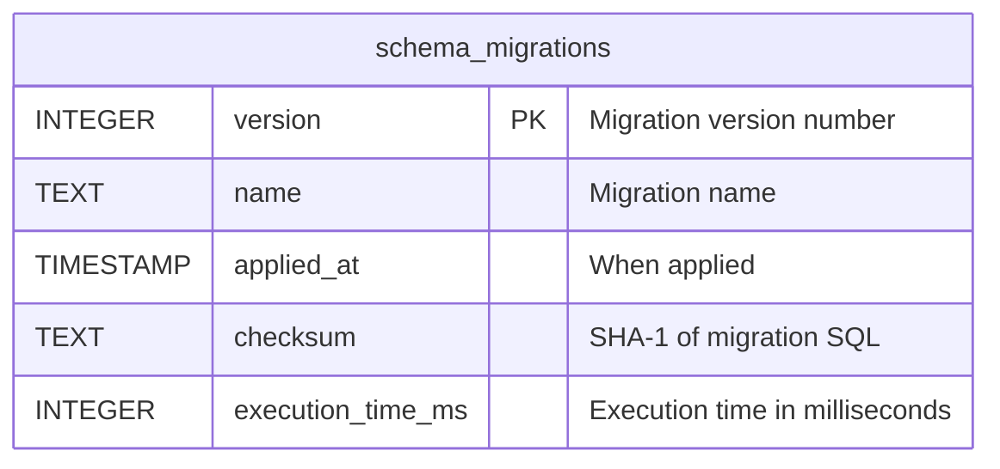

# Database Migration System

## Overview

VisionFlow uses a robust database migration system for managing schema evolution across three separate SQLite databases:
- **settings.db** - Application configuration and user management
- **knowledge_graph.db** - Knowledge graph nodes, edges, and metadata
- **ontology.db** - Ontology framework and reasoning data

The migration system provides:
- **Version tracking** with checksum verification
- **Transaction-safe** execution (all-or-nothing)
- **Rollback support** with zero data loss guarantee
- **CLI tools** for easy migration management
- **Dry-run mode** for testing

## Architecture

### Components

1. **VersionTracker** - Tracks applied migrations in `schema_migrations` table
2. **MigrationRunner** - Discovers and executes pending migrations
3. **RollbackManager** - Safely rolls back applied migrations
4. **CLI** (`migrate` binary) - Command-line interface for migration operations

### Migration File Format

```sql
-- Migration: 001_create_users_table
-- Description: Create users table with authentication
-- Author: Development Team
-- Date: 2025-10-27

-- === UP MIGRATION ===
CREATE TABLE users (
    id INTEGER PRIMARY KEY,
    username TEXT NOT NULL UNIQUE,
    email TEXT NOT NULL
);

CREATE INDEX idx_users_email ON users(email);

-- === DOWN MIGRATION ===
DROP INDEX idx_users_email;
DROP TABLE users;
```

**Important**: Both `UP MIGRATION` and `DOWN MIGRATION` markers are required.

## Usage

### Command Line Interface

#### Apply All Pending Migrations

```bash
cargo run --bin migrate up
```

This will:
1. Initialize the `schema_migrations` table if needed
2. Discover all pending migrations
3. Apply them in order within transactions
4. Record execution time and checksum

#### Rollback Last Migration

```bash
cargo run --bin migrate down
```

This will:
1. Find the last applied migration
2. Execute its DOWN migration
3. Remove it from version tracking
4. Verify database integrity

#### Check Migration Status

```bash
cargo run --bin migrate status
```

Output shows:
- Current schema version
- Applied migrations with timestamps and execution time
- Pending migrations

#### Create New Migration

```bash
cargo run --bin migrate create "add_user_roles"
```

This creates a new migration file:
```
migrations/002_add_user_roles.sql
```

## Creating Migrations

### Step 1: Generate Migration File

```bash
cargo run --bin migrate create "descriptive_name"
```

### Step 2: Write UP Migration

Add SQL commands after `-- === UP MIGRATION ===`:

```sql
-- === UP MIGRATION ===
ALTER TABLE users ADD COLUMN role TEXT DEFAULT 'user';
CREATE INDEX idx_users_role ON users(role);
```

### Step 3: Write DOWN Migration

Add rollback SQL after `-- === DOWN MIGRATION ===`:

```sql
-- === DOWN MIGRATION ===
DROP INDEX idx_users_role;
ALTER TABLE users DROP COLUMN role; -- Note: SQLite limitations apply
```

**SQLite Limitation**: ALTER TABLE DROP COLUMN requires SQLite 3.35+ or a workaround (recreate table).

### Step 4: Test Migration

```bash
# Apply
cargo run --bin migrate up

# Verify
cargo run --bin migrate status

# Test rollback
cargo run --bin migrate down
cargo run --bin migrate up
```

## Best Practices

### 1. Atomic Changes

Each migration should do ONE thing:
- ✅ GOOD: `001_create_users_table.sql`
- ❌ BAD: `001_create_all_tables.sql`

### 2. Reversible Migrations

Always provide a DOWN migration:

```sql
-- === UP MIGRATION ===
CREATE TABLE logs (
    id INTEGER PRIMARY KEY,
    message TEXT
);

-- === DOWN MIGRATION ===
DROP TABLE logs; -- Destructive but reversible
```

### 3. Data Migrations

For data changes, preserve data in DOWN migration:

```sql
-- === UP MIGRATION ===
-- Move data from old_table to new_table
INSERT INTO new_table (id, name)
SELECT id, full_name FROM old_table;

-- === DOWN MIGRATION ===
-- Restore data
INSERT INTO old_table (id, full_name)
SELECT id, name FROM new_table;
```

### 4. Idempotent Operations

Use `IF EXISTS` and `IF NOT EXISTS`:

```sql
-- === UP MIGRATION ===
CREATE TABLE IF NOT EXISTS users (...);
CREATE INDEX IF NOT EXISTS idx_users_email ON users(email);

-- === DOWN MIGRATION ===
DROP INDEX IF EXISTS idx_users_email;
DROP TABLE IF EXISTS users;
```

### 5. Testing

Test migrations thoroughly:

```bash
# Test UP
cargo run --bin migrate up

# Test DOWN
cargo run --bin migrate down

# Test re-applying
cargo run --bin migrate up
```

## Production Deployment

### Pre-Deployment Checklist

- [ ] Test migrations in staging environment
- [ ] Backup production database
- [ ] Review DOWN migrations for data safety
- [ ] Verify checksum integrity
- [ ] Check execution time estimates

### Deployment Process

1. **Backup Database**

```bash
# SQLite backup
cp data/settings.db data/settings.db.backup.$(date +%Y%m%d_%H%M%S)
```

2. **Apply Migrations**

```bash
DATABASE_PATH=data/settings.db cargo run --bin migrate up
```

3. **Verify Success**

```bash
cargo run --bin migrate status
```

4. **Monitor Logs**

Check execution times and any warnings.

### Rollback Procedure

If migration fails or causes issues:

```bash
# Rollback last migration
cargo run --bin migrate down

# Or restore from backup
cp data/settings.db.backup.20251027_120000 data/settings.db
```

## CI/CD Integration

### GitHub Actions Example

```yaml
name: Database Migrations

on:
  push:
    branches: [main]
  pull_request:
    branches: [main]

jobs:
  test-migrations:
    runs-on: ubuntu-latest
    steps:
      - uses: actions/checkout@v3

      - name: Setup Rust
        uses: actions-rs/toolchain@v1
        with:
          toolchain: stable

      - name: Test migrations (up and down)
        run: |
          cargo run --bin migrate up
          cargo run --bin migrate status
          cargo run --bin migrate down
          cargo run --bin migrate up

      - name: Run integration tests
        run: cargo test --test migrations
```

## Troubleshooting

### Checksum Mismatch

**Error**: `Checksum mismatch for migration X`

**Cause**: Migration file was modified after being applied.

**Solution**:
1. DO NOT modify applied migrations in production
2. Create a new migration to fix issues
3. In development, reset database and re-apply

### Migration Failed Mid-Execution

**Error**: `Migration X failed: [SQL error]`

**Cause**: SQL syntax error or constraint violation.

**Solution**:
- Transaction automatically rolled back
- Fix SQL in migration file
- Re-run `migrate up`

### DOWN Migration Missing

**Warning**: `DOWN migration SQL is empty`

**Cause**: No rollback commands provided.

**Impact**: Cannot rollback this migration.

**Solution**:
- Acceptable for irreversible changes (data deletion)
- Document why DOWN is not provided
- Consider manual rollback procedure

### Database Locked

**Error**: `Database is locked`

**Cause**: Another process has write lock.

**Solution**:
```bash
# Stop server
killall webxr

# Run migration
cargo run --bin migrate up

# Restart server
```

## Advanced Topics

### Custom Migration Directory

```bash
MIGRATIONS_DIR=custom/path cargo run --bin migrate up
```

### Multiple Databases

```bash
# Settings database
DATABASE_PATH=data/settings.db cargo run --bin migrate up

# Knowledge graph database
DATABASE_PATH=data/knowledge_graph.db cargo run --bin migrate up

# Ontology database
DATABASE_PATH=data/ontology.db cargo run --bin migrate up
```

### Dry-Run Mode

Test migrations without applying:

```rust
use webxr::migrations::{MigrationRunner, ExecutionMode};

let runner = MigrationRunner::new("migrations")
    .with_mode(ExecutionMode::DryRun);

runner.migrate_up(&mut conn)?; // Shows what would happen
```

## Performance Considerations

### Large Datasets

For tables with millions of rows:

1. **Batch operations**:
```sql
-- Instead of:
UPDATE users SET role = 'user';

-- Use batches:
UPDATE users SET role = 'user' WHERE id IN (
    SELECT id FROM users LIMIT 10000
);
```

2. **Monitor execution time**:
- Target: <10ms per operation (p99)
- Migrations can take longer for structural changes
- Data migrations should be batched

3. **Use indexes wisely**:
```sql
-- Drop indexes before bulk insert
DROP INDEX idx_users_email;

INSERT INTO users (...) SELECT ...;

-- Recreate after
CREATE INDEX idx_users_email ON users(email);
```

### Schema Locks

SQLite uses table-level locking:

- **EXCLUSIVE lock** during schema changes
- Plan migrations during low-traffic periods
- Consider maintenance windows for large changes

## API Reference

See code documentation:

```bash
cargo doc --open --no-deps --package webxr
```

Navigate to `webxr::migrations` module.

## Schema Version Table

The `schema_migrations` table tracks all applied migrations:



Do not manually modify this table.

## Support

For issues or questions:
- Check [ROADMAP.md](/home/devuser/workspace/project/docs/ROADMAP.md) for planned migration features
- Open GitHub issue with `[migration]` tag
- Review migration test suite for examples

## Changelog

### v1.0.0 (2025-10-27)
- Initial migration system implementation
- Transaction-safe execution
- Checksum verification
- Rollback support
- CLI tools
