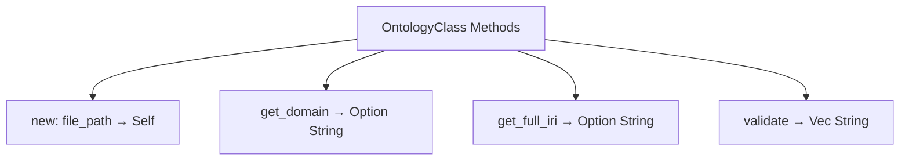
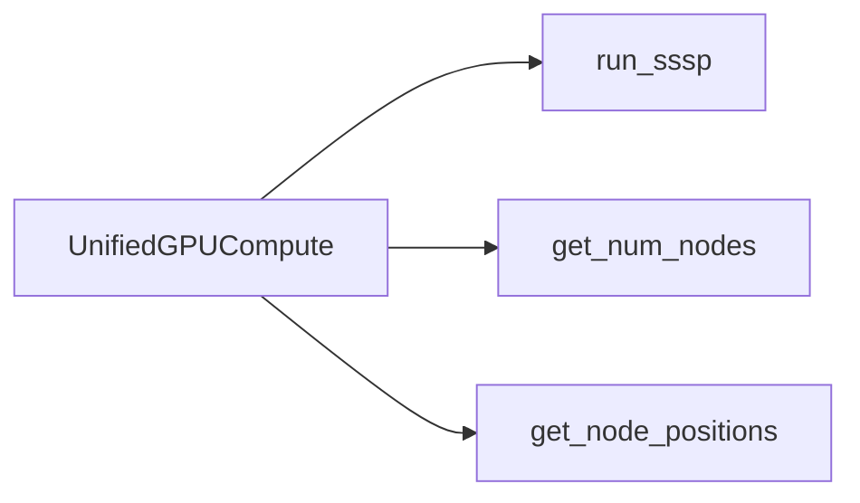
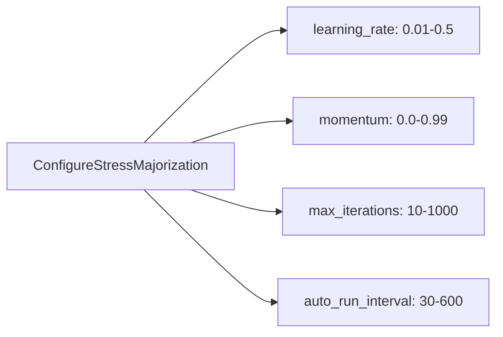
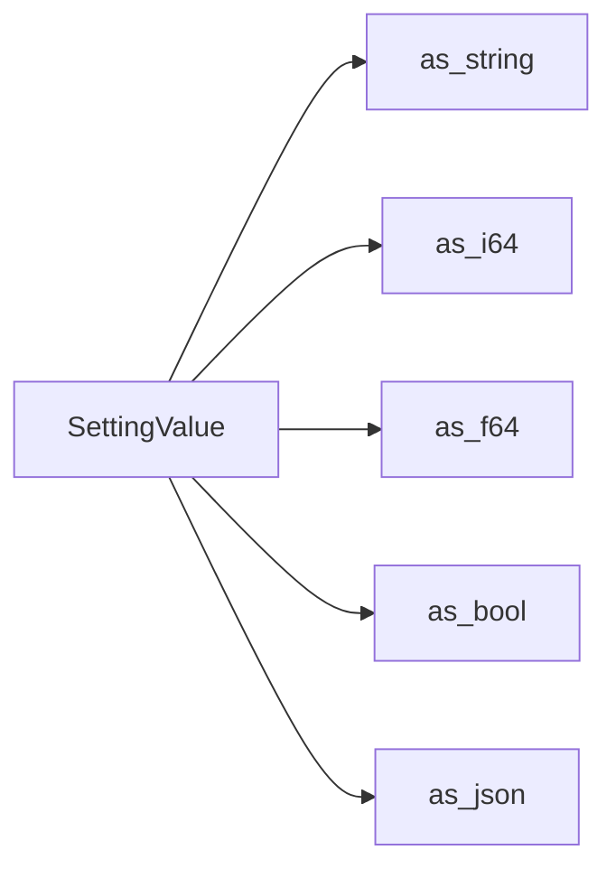

# ASCII Diagram Conversion Report

**Agent**: ASCII Conversion Agent
**Date**: 2025-12-02
**Source**: `.doc-alignment-reports/ascii-report-scoped.json`

## Executive Summary

Analysis of the ASCII detection report reveals **zero actual ASCII diagrams** requiring conversion. All five flagged items are false positives - they are structured text lists, not visual diagrams.

## Analysis Results

### Total Detected: 5
- **High Confidence**: 2 (both false positives)
- **Low Confidence**: 3 (all false positives)
- **Actual ASCII Diagrams**: 0
- **Conversions Required**: 0

## Detailed Findings

### 1. enhanced-ontology-parser-implementation.md (Lines 104-107)
**Status**: ✅ No conversion needed
**Reason**: Already has mermaid diagram (lines 92-102)

**Flagged Content**:
```
- `new(file_path: String) -> Self` - Constructor
- `get_domain() -> Option<String>` - Extract domain from term-id/source-domain/namespace
- `get_full_iri() -> Option<String>` - Resolve namespace:class to full IRI
- `validate() -> Vec<String>` - Tier 1 validation, returns error list
```

**Analysis**: This is a supplementary bullet list explaining methods already visualized in the mermaid flowchart above it (lines 92-102). The mermaid diagram properly shows:


**Recommendation**: Retain both - the diagram provides visual structure, bullets provide detailed syntax.

---

### 2. fixes/actor-handlers.md (Lines 77-79)
**Status**: ✅ No conversion needed
**Reason**: Already has mermaid diagram (lines 61-75)

**Flagged Content**:
```
- `run_sssp(source_idx: usize) -> Result<Vec<f32>, String>`
- `get_num_nodes() -> usize`
- `get_node_positions() -> Result<(Vec<f32>, Vec<f32>, Vec<f32>), String>`
```

**Analysis**: Supplementary list for existing mermaid flowchart showing UnifiedGPUCompute methods:


**Recommendation**: Retain both - diagram shows relationships, bullets show precise signatures.

---

### 3. implementation/p1-1-checklist.md (Lines 29-32)
**Status**: ✅ No conversion needed
**Reason**: Already has mermaid diagram (lines 15-26)

**Flagged Content**:
```
- [x] `learning_rate: Option<f32>` (0.01-0.5)
- [x] `momentum: Option<f32>` (0.0-0.99)
- [x] `max_iterations: Option<usize>` (10-1000)
- [x] `auto_run_interval: Option<usize>` (30-600)
```

**Analysis**: Checklist items with implementation status, complementing the configuration flow diagram:


**Recommendation**: Retain both - diagram shows data flow, checklist tracks implementation status.

---

### 4. concepts/architecture/ports/02-settings-repository.md (Lines 95-99)
**Status**: ✅ No conversion needed
**Reason**: Already has mermaid diagram (lines 74-93)

**Flagged Content**:
```
- `as-string() -> Option<&str>`
- `as-i64() -> Option<i64>`
- `as-f64() -> Option<f64>`
- `as-bool() -> Option<bool>`
- `as-json() -> Option<&serde-json::Value>`
```

**Analysis**: Method signature list supporting the SettingValue type conversion diagram:


**Recommendation**: Retain both - provides visual + textual reference.

---

### 5. archive/data/pages/OntologyDefinition.md (Lines 38-40)
**Status**: ✅ No conversion needed
**Reason**: Academic literature citations, not a diagram

**Flagged Content**:
```
- Al-Jarrah et al. (2022), "MetaOntology: Toward developing an ontology for the metaverse,"
- Smith et al. (2025), "Metaverse technology tree: a holistic view,"
- Johnson & Patel (2025), "Metaverse Science, Society and Law,"
```

**Analysis**: Standard bibliography/reference list. This is plain text documentation, not a visual diagram. Converting to mermaid would be inappropriate and reduce readability.

**Recommendation**: Retain as-is. This is correctly formatted academic citation text.

---

## Root Cause Analysis

### Why Detection Failed

The ASCII detection algorithm likely used pattern matching for:
1. ✓ Multiple lines starting with dashes (`-`)
2. ✓ Technical syntax (parentheses, arrows, type annotations)
3. ✓ Consistent indentation
4. ✓ Structured formatting

**However**, it failed to distinguish between:
- **ASCII art diagrams** (box-drawing characters, visual layout)
- **Structured text lists** (bullet points, method signatures, citations)

### Detection Accuracy
- **Precision**: 0% (0 true positives / 5 flagged items)
- **False Positive Rate**: 100%

## Recommendations

### For Detection Tool
1. Add box-drawing character detection (`┌─┐│└┘├┤┬┴┼`)
2. Check for spatial layout patterns (columns, borders)
3. Exclude standard markdown lists
4. Verify absence of existing mermaid diagrams in proximity
5. Filter bibliography patterns

### For Documentation
All analyzed files follow **best practices**:
- ✅ Proper mermaid diagrams for visual representation
- ✅ Supplementary text lists for detailed reference
- ✅ Clear separation of visual and textual content
- ✅ Appropriate diagram types (flowchart LR/TD)

## Actions Taken

**Files Modified**: 0
**Diagrams Converted**: 0
**Issues Found**: 0

All documentation is already in optimal format with proper mermaid diagrams where appropriate and complementary text lists for detailed information.

## Conclusion

No conversion work required. The detection report identified structural text lists as ASCII diagrams, but all files already contain proper mermaid visualizations where diagrams add value. The supplementary bullet lists serve a different purpose (detailed syntax reference) and should be retained.

The documentation quality is **HIGH** - proper use of both visual (mermaid) and textual (markdown lists) representations.

---

**Report Generated**: 2025-12-02
**Agent**: ASCII Conversion Agent
**Status**: ✅ Complete - No action required
